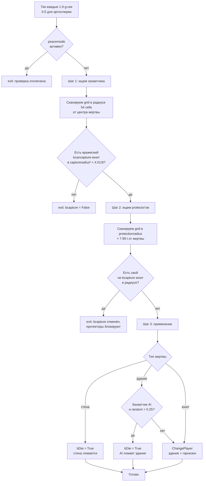

# Cossacks 3 — механика захвата (реверс-инжиниринг)

Источники: `C:\Program Files (x86)\Steam\steamapps\common\Cossacks 3\data\scripts\` (далее — `<scripts>`).
Главный файл: `<scripts>\lib\miscext.script` (`_misc_CheckCapture`, `_misc_ChangePlayer`).
Дата извлечения: 2026-04-29.

---

## Главное

В Cossacks 3 нет AoE2-подобного "конвертера". Захват работает чисто **геометрически**:
проверка раз в N тиков сравнивает евклидово расстояние от центра объекта-жертвы до окружающих
вражеских юнитов. Если ближе `gc_gameplay_captureradius` нашёлся вражеский **`bcancapture`-юнит** и
нет своего **`bprotector`** в радиусе `gc_gameplay_protectionradius` — объект меняет владельца
(или умирает, по флагу `bDie`). Свящ. (priest/pope/mullah/padre) — только **лекарь** через
"отрицательный урон", не конвертер.

---

## 1. Константы

`<scripts>\dmscript.global` (lines 207-220):

```
gc_gameplay_captureblockshotradius = 160 / gc_pixels_to_tile = 3.0 tile
gc_gameplay_captureradius          = 214 / 53.333          ≈ 4.013 tile
gc_gameplay_protectionradius       = 426 / 53.333          ≈ 7.987 tile
gc_gameplay_resourceDropRadius     = 3 tile
*Sqr — те же значения в квадрате (для евкл. сравнения)
```

Тики (`<scripts>\dmscript.global` 1478-1480):
```
gc_unit_TimeCheckCapture    = 0.1*19  ≈ 1.9   игрового сек.   (peasant + buildings)
gc_unit_TimeCheckCaptureArt = 0.1*5   ≈ 0.5   игрового сек.   (артиллерия — чаще)
```

Метрика: **Euclidean²** (`<scripts>\lib\miscext.script:1017-1018`):
```pascal
distSqr := Sqr(px-tx) + Sqr(py-ty);
if distSqr < gc_gameplay_captureradiusSqr then ...
```
`(px,py)` — позиция объекта-жертвы, `(tx,ty)` — позиция кандидата-захватчика. Это **центр-к-центру**, ни Manhattan, ни Chebyshev. Forma здания НЕ учитывается, только его one-cell anchor.

Карточные настройки (`gMap.settings.additional.capture`, dmscript.global 1072-1075):
```
0 capture_default            — захват разрешён всем (peasant, infantry, art)
1 capture_nopeasants         — peasant нельзя захватить (defalt deathmatch + battles, map.script:276,283)
2 capture_nocenterspeasants  — peasant нельзя захватить + центр (TC) нельзя
3 capture_onlyartillery      — только артиллерию можно захватывать
```

Полный обзор всех опций лобби (включая `capture` и взаимодействие с `peacetime`/territory ownership) — [`game_settings.md`](game_settings.md) §3.6.

---

## 2. Кто может быть захвачен (`bcapture` = True)

`<scripts>\lib\unit.script` — поиск `objprop.bcapture := True`:

### Юниты
| sid | line | usage |
|---|---|---|
| `peaaus`/`peatur`/`pearus`/`peapol`/`peaspa`/`peaeng`/`peaukr`/`peasco` | 1199 | peasant |
| `cannon` | 1721 | cannon |
| `howitzer` | 1753 | mortar |
| `mortar` | 1785 | supermortar |
| `multicannon` | 1812 | mcannon |
| `framegun` | 1843 | cannon |

(Остальной типы юнитов имеют `bcapture=False` → их нельзя захватить, только убить.)

### Здания
В `_unit_InitBase`:
- `SetObjBuildingBaseSettings(objprop, True, …)` — здание ловится:
  - `commonsid+'sto'` = склад (storage), line 2205
  - `commonsid+'gol'/'iro'/'coa'` = шахты, line 2312
  - `csid+'cen'` = town centre, line 2371 (`gc_obj_usage_center`, `bcapture=True`)
  - `csid+'bar'`/`csid+'ba2'` = казарма, line 2421 (`bcapture=True`)
  - `csid+'mil'` = mill (через mil-блок default `bcapture` — берётся из caller'а; в этом блоке **НЕ** перетирается, см. ниже)
  - `csid+'bla'` = blacksmith, line 2514 (`bcapture=True`)
  - и др. через `SetObjBuildingExtProperties(... True, ...)`
- `False` (= не захватываются, только разрушаются):
  - `commonsid+'tow'` = башня, line 2224 (**башни НЕЛЬЗЯ захватить**, только снести)
  - `commonsid+'por'` = port, line 2153
  - `commonsid+'swa/sga'`, `ukrwwa/wga` = стены/ворота, lines 2259/2286
  - `csid+'sta'` = стойло, line 2503
  - `csid+'aca'` = академия, line 2493 (`False`)
  - `csid+'dip'` = посольство, line 2452 (`False`)
  - `csid+'17'` = building 17 century, line 2462 (`False`)
  - `csid+'18'` = building 18 century, line 2472 (`False`)
  - `misblg/misblg2`, `misyurt`, `miscommandcenter` (mission objects) — `False`

Важное правило (`unit.script:469`): `bcancapture := not bcapture`. То есть здание со `bcapture=True` НЕ может само быть захватчиком (логично, оно неподвижно), и наоборот.

Для не-зданий (`<scripts>\lib\unit.script:2096-2097`):
```pascal
objprop.bprotector  := not objprop.bcapture;
objprop.bcancapture := (not objprop.bcapture) and (objprop.usage <> gc_obj_usage_peasant);
```
Значит:
- **Любой** небоевой/боевой юнит, у которого `bcapture=False`, является `bprotector` (защищает свои здания)
  и `bcancapture` (может захватывать) — **за исключением peasant**.
- **Peasant** (`bcapture=True`) — НЕ protector и НЕ capturer (пассивный объект захвата).
- Артиллерия (`bcapture=True`) — НЕ protector и НЕ capturer (пассивна, только обороняется огнём).

⇒ Конкретно «захватчик здания» = **любой не-пехотный/конный юнит соперника, кроме peasant и артиллерии**.

---

## 3. Триггер `_misc_CheckCapture` — полный псевдокод

Источник: `<scripts>\lib\miscext.script:961-1185`. Логика проверки в три шага:



Полный псевдокод (`<scripts>\lib\miscext.script:961-1185`, упрощённо):

```pascal
procedure _misc_CheckCapture(goHnd):
  pobj      := объект-жертва
  scangrid  := его клетка скан-сетки
  bneutral  := (not gbool_peacemode) or (owner-of-grid <> мой pl)
  if not bneutral: return                          // в peacetime + рядом наш  не проверяем

  bwall    := pobjprop.bwall
  enemyplmask := gPlayer[my pl].enemyplmask
  rx1 := floor(214/4) + 1 = 54  → радиус сканирования по grid-cells
  capturePlMask := bneutral ? enemyPlMask : myPlMask-of-grid-owner

  // -------- Шаг 1: найти захватчика --------
  bcapture := False; capturerCount := 0; bblockshot := False
  for каждой grid-cell в радиусе rx1 от scangrid:
    if в клетке есть юниты enemyplmask:
      trgHnd := bwall ? _unit_SearchCapturersForWall(...) : _unit_SearchCapturers(...)
      if trgHnd != 0:
         pobjprop2 = ObjProp(trgHnd)
         // Стены ловят любого не-здания-врага (даже peasant);
         // обычные здания — только bcancapture-юнита, и не на воде
         if bwall or (not (pobjprop2.bcapture or pobjprop2.media=water)):
            distSqr := (px-tx)² + (py-ty)²
            if distSqr < captureradiusSqr (≈4.013² tile):
               bcapture := True
               capturerCount += 1
               capturerHnd := trgHnd
               if distSqr < captureblockshotradiusSqr (3² tile):
                  bblockshot := True

  // _unit_SearchCapturers ищет юнита с условиями:
  //   not bbuilding && bcancapture && (myplmask & plmask)<>0
  //                                   && pl <> mercenaryInd
  // _unit_SearchCapturersForWall — то же, БЕЗ требования bcancapture
  //   (т.е. кто угодно из вражеской пехоты ломает стену = «захватывает»),
  //   фактически здесь захват = смерть стены (bDie=True ниже).

  // -------- Шаг 2: если жертва — здание/арт-юнит у стены, и hp >= maxhp/3 --------
  if bcapture and (not (bwall and TObj(pobj).hp < maxhp/3)):

     // 2a. Если уцель — НЕ peasant, и захватчик ОЧЕНЬ близко (<3 tile),
     //     заглушаем стрельбу здания на 100 кадров (≈3.125 g-сек):
     if usage<>peasant and bblockshot:
        attackdelay := max(attackdelay, 100*gc_frames_to_time)

     // 2b. Найти protector'ов в радиусе protectionradius (~7.99 tile)
     rx2 := floor(426/4) + 1
     for grid-cells в rx2 (только клетки с моими юнитами myplmask):
        trgHnd := _unit_SearchProtectors(...) — ищет юнита с pobjprop.bprotector
                                                && not bbuilding && (myplmask & plmask)=0
        if trgHnd != 0:
           if not pobjprop2.bcapture:
              if distSqr < protectionradiusSqr:
                 bcapture := False; protectorsCount += 1; (но цикл продолжается)

     // 2c. AI-арт-логика: если жертва — bartillery и pl=AI,
     //     и слишком много protector'ов — суицид:
     if gPlayer[my pl].bai and pobjprop.bartillery:
        if (capCount>=protCount and protCount=1) or
           (capCount>3 and protCount=2)        or
           (capCount>7 and protCount=3)        or
           (capCount>10 and protCount=4):
           if (not bEasy) or (random>0.5):
              SetTagStates(goHnd, essential_death); exit

  // -------- Шаг 3: применение захвата --------
  if bcapture:
     statetag := GetGameObjectStatesTag(goHnd)
     // Юнит, ещё не родившийся (essential_birth) и видимый — просто умирает:
     if not bbuilding and (essential_birth & statetag) and (not visual_hide):
        SetTagStates(essential_death); exit

     if (statetag & visual_hide) = 0:
        if bbuilding or (essential_none & statetag) <> 0:
           bDie := False; bAutoKill := False  // (bAutoKill в коде не задаётся явно)
           if bAutoKill or pobjprop.bwall:
              bDie := True                    // СТЕНЫ всегда умирают, не захватываются

           if not bbuilding:
              _unit_Stop(goHnd)
           else:
              отменить produce/upgrade orders;  ClearOrders;  SetSTO=0

           newPlHnd := player захватчика;  newPlInd := его index

           // alarm-event для захваченного игрока:
           if my pl == InterfaceIO_pl:
              _misc_DoAlarm(capturerHnd, goHnd, alarmevent_capture)

           // ---- AI-захватчик: иногда «ломает» вместо захвата ----
           if gPlayer[my pl].bai:        // ai теряет здание
              if bbuilding:
                 if random > 0.25:        // 75% шанс что зайдёт в деструкцию
                    if bbuilt and pobjprop.bslowdeath and hp>1999:
                       hp := 1999 - floor(RandomExt*300)   // медленная агония
                    else:
                       bDie := True
              else:                       // юнит peasant/арт
                 if usage=peasant and not bEasy:
                    bDie := True          // hard+: ai уничтожает своего peasant'а перед захватом
                 else case usage of
                    supermortar: if random>0.585     then bDie := True   // ≈41.5% suicide
                    cannon:      if random>0.391     then bDie := True   // ≈60.9% suicide
                    mortar:      if random>0.141     then bDie := True   // ≈85.9% suicide
                    peasant:     if random>0.547     then bDie := True   // ≈45.3% (если bEasy)
           else if gPlayer[newPlInd].bai and usage=peasant and not bEasy:
              bDie := True                 // обратное: AI-захватчик «убивает» peasant'а в hard

           if bDie: SetTagStates(essential_death)
           else:    _misc_ChangePlayer(goHnd, newPlHnd, bCapture=True, bCustom=False, bLAN=True)
```

**Ключевые наблюдения:**
- Захват требует **только** одного капторщика в радиусе. Время захвата = 0 (мгновенно при tick).
  Игрок видит «время на захват» как `gc_unit_TimeCheckCapture` ≈ 1.9 g-сек до следующей проверки.
- Тики со случайным offset (`random*gc_unit_TimeCheckCapture`) при init/serialize, чтобы здания
  не проверяли все одновременно (load-balancing).
- **Стены не захватываются** — они автоматически `bDie := True`. Это объясняет, почему
  «захват стены ≈ слом стены». Условие в шаге 2: `if not (bwall && hp<maxhp/3)` —
  стены ниже 1/3 HP не вызывают protector-логику и не блокируют огонь, что делает их
  бесполезной защитой при низком HP.
- **Башни** имеют `bcapture=False` ⇒ не вызывают `_misc_CheckCapture`. Их вообще нельзя захватить.
- **Гарнизон**: при захвате здания, `_misc_ChangePlayer` рекурсивно меняет владельца всех
  юнитов внутри (`pObjInside`, miscext:932-933). Производственные ордера отменяются,
  возвращая ресурсы.

### Триггеры (где вызывается `_misc_CheckCapture`)

| Источник | Условие | Период |
|---|---|---|
| `units\unit.inc\nothing.inc:507-535` | `pobjprop.bcapture and bplayable`. Только если `default OR bart OR (only_artillery and bart)`. | TimeCheckCapture (1.9с) или TimeCheckCaptureArt (0.5с) для арт. |
| `units\building.inc\nothing.inc:300-304` | `not arg_obj.bbuilt` (стройка) — независимо от bcapture! | TimeCheckCapture |
| `units\building.inc\nothing.inc:311-326` | `pobjprop.bcapture` после постройки. Учитывает map-setting, при `only_artillery` — здания НЕ проверяются. | TimeCheckCapture |

⚠️ **Building under construction** проверяется на захват ВСЕГДА (даже башни во время стройки!). Это объясняет, почему недостроенную башню можно захватить — но как только она достроится, `bcapture=False` отключает чек.

---

## 4. Захват юнитов

### Кого можно захватить как юнита
- Peasant (любого нации, sid=`pea*`).
- Артиллерия: `cannon`, `howitzer`, `mortar`, `multicannon`, `framegun`.

Это всё. Пехота, кавалерия, корабли — захватить **нельзя** (только убить).

### Кто захватывает
Любой `bcancapture && not bbuilding && not peasant` ⇒ вся обычная пехота/кавалерия/арт-команда (но не peasant и не сам объект захвата).

### Что становится с захваченным
- Peasant: при default settings и обычных условиях → меняет игрока (`_misc_ChangePlayer`). Внутри ресурс не дропается, перезапускается AI.
- Cannon/mortar: переключают игрока, заряд сохраняется в инвентаре weapon.cost. Производственные delay сбрасываются.
- Squad: захваченный юнит **выходит из squad** (см. `_misc_SquadChangePlayer`); если артиллерия была в строю — разваливает строй.

### Defaults в Deathmatch / Historical battles
`map.script:276, 283` — оба режима устанавливают `capture_nopeasants` ⇒ **peasant **в стандартных матчах НЕ захватывается**, только убивается. Захват peasant'а реален лишь в скирмише с custom-настройкой `capture_default`.

---

## 5. Нейтральные объекты, клады, мерцен

### Нейтральные игроки (`gPlayer[i].bneutral`)
- Поле `bneutral : Boolean` в TPlayer (`classes.script:3698`).
- Используется в **миссиях/сценариях** (`scenario.script:2181-2238`) — скриптеры могут переключать
  `bneutral=true/false` для дипломатии. В мультиплеере / случайных картах **этот флаг не активен** для обычных игроков.

### Mercenary (player index = MaxPlayer-1 = особый виртуальный игрок)
- `gc_player_mercenaryind = gc_MaxPlayerCount-1` (`dmscript.global:776`).
- Юниты с `bmercenary=True` (мерценарий, рекрутируется в Diplomatic centre) при `brebellion=True`
  у владельца имеют шанс **defect to mercenary player** (`unit.inc\nothing.inc:487-505`):
  ```pascal
  if gPlayer[plInd].brebellion and pobjprop.bmercenary and plInd<>mercenaryInd:
     if random_check_per_difficulty:
        _misc_ChangePlayer(myHnd, plMercHnd, False, False, True);
  ```
  То есть мерценарии «уходят» к нейтралу при банкротстве (нет золота). Это НЕ захват противником.
- Mercenary-юниты **не считаются капторщиками** (`unit.script:4656`):
  `(TObj(pobj).pl <> gc_player_mercenaryind)` — фильтр в `_unit_SearchCapturers`.

### Treasure / chest / clad
**Не найдено**. Поиски `treasure|chest|clad|gc_obj_usage_treasure|stash` не дают результатов в скриптах. В Cossacks 3 нет нейтральных кладов на карте, как в C1 (Sich Rebellion в C1 имела «клады», в C3 эту механику убрали).

### Нейтральные крестьяне на карте
`SetupStartingResources` (см. recon/map_generation_pipeline.md) спавнит **18 пеасантов в 6×3 grid** на старт игры — **все они уже принадлежат player'у**, не нейтральны. Других нейтральных юнитов на карте нет.

### Нейтральные здания
Нет. Все здания на карте — собственность игроков или mercenary-player при defect'е.

---

## 6. Захват башен (специфика)

`unit.script:2224, 2540` — все башни (`commonsid+'tow'`, `misblg`, `misblg2`) имеют **`bcapture=False`**.
- Они НЕ вызывают `_misc_CheckCapture` после постройки.
- Гарнизон внутри (`pObjInside`) при разрушении башни умирает вместе со зданием (cf. `miscext.script:451-459`).
- **Исключение:** во время стройки (когда `arg_obj.bbuilt=False`), любое здание проверяется на захват (`building.inc\nothing.inc:300`). Поэтому **недостроенную башню можно захватить** обычным infantry-юнитом подходом ближе 4 тайлов.

---

## 7. Конверсия (priest-как-конвертер)

**Нет такой механики.**
- `bpriest` — флаг (`classes.script:3645`), используется только в `miscext2.script:362-399`.
- Логика: при «атаке» priest'а на юнита с `bpriest=True` атакующего, `damage := indamage` (исходный, без protection),
  затем `pobj2.hp := pobj2.hp + damage` ⇒ **лечение**, а не конвертация.
- Никаких `_misc_ChangePlayer` в priest-коде нет.
- Юниты, имеющие priest-роль (`pope`, `mullah`, `padre`, `priest`) — все указаны в `country.script:2741-2744`,
  все имеют `bpriest=True` через `unit.script:1151+`.

⇒ Священник в C3 — это AoE-style **healer** (через «отрицательный урон»), без конверсии.

---

## 8. Capture радиус — точные числа

```
Метрика:           Euclidean²  (Sqr(dx)+Sqr(dy) < radiusSqr)
Точка отсчёта:     центр-к-центру (game-object position X/Z)
Расстояние:        в tiles (1 tile = 53.333 px)
captureradius      ≈ 4.0125 tile  ≈ 1.6 m в игровом масштабе (1 tile = 0.5 m? см. determinism)
                   = 214 px game-source units
captureblockshot   = 3.0 tile     (заглушает огонь жертвы)
protectionradius   ≈ 7.987 tile   (зона protector'а, отменяет захват)
```

⇒ Чтобы захватить здание, infantry-юниту нужно подойти **к точке-якорю здания** на расстояние < 4.013 тайлов (Euclidean).
Если здание занимает большой footprint (например, центр 5×4), фактически захватчик может стоять дальше «края» — функция использует **точку центра** (game-object position), не bbox. Тестировать: точка обычно близко к геометрическому центру здания, но не идентична, особенно для асимметричных строений.

---

## 9. Open questions

1. **Точная позиция (px,py) у здания** — это центр модели, центр bbox, или anchor-point?
   `GetGameObjectPositionXByHandle/ZByHandle` — нужен trace в-эмпирике (build a barracks, walk peasant
   до края, измерить min-distance до alarm event capture).
2. **bAutoKill** в Step 3 — переменная объявлена, но никогда не присваивается в `_misc_CheckCapture`.
   Возможно, это legacy-код от C1, где AutoKill включался для определённых типов; сейчас остаётся всегда False.
3. Для `wall` (стены): `_unit_SearchCapturersForWall` НЕ требует `bcancapture`. Значит peasant'ы и артиллерия
   тоже могут «ломать» стену через capture-механизм (а не только attack). Проверить эмпирически в скирмише
   с peacetime=off + wall + peasant без attack-команд.
4. Артиллерия проверяется чаще (0.5с против 1.9с) — означает, что её захват в 4× быстрее. Это согласуется
   с user-perception: «арт-юнит мгновенно теряется при подходе кавалерии». Но `_misc_CheckCapture` сама по себе
   мгновенна — задержки только в periodicity. Можно эмпирически замерить max-time-to-capture как `≤ 0.5 g-сек`.
5. Как проверка взаимодействует с FOG of war? Если жертва в чужом FOW, проверка идёт всё равно (server-authoritative).
6. **bsearchminattackradius** на пушках — есть ли связь между захватом и тем, что орудие переключилось на melee?

---

## 10. Цитаты строк для верификации

| Что | Файл | Строки |
|---|---|---|
| Константы радиусов | `<scripts>\dmscript.global` | 207-220 |
| Tick-периоды | `<scripts>\dmscript.global` | 1478-1480 |
| capture-режимы карты | `<scripts>\dmscript.global` | 1072-1075 |
| `_misc_CheckCapture` (полный код) | `<scripts>\lib\miscext.script` | 961-1185 |
| `_misc_ChangePlayer` | `<scripts>\lib\miscext.script` | 892-959 |
| `_unit_SearchCapturers` | `<scripts>\lib\unit.script` | 4639-4664 |
| `_unit_SearchCapturersForWall` | `<scripts>\lib\unit.script` | 4666-4691 |
| `_unit_SearchProtectors` | `<scripts>\lib\unit.script` | 4615-4637 |
| `bcapture/bcancapture/bprotector` defaults | `<scripts>\lib\unit.script` | 467-471, 2095-2098 |
| Юниты с bcapture=True | `<scripts>\lib\unit.script` | 1199, 1721, 1753, 1785, 1812, 1843 |
| Здания (бараки/центр/мил/склад/шахта) с bcapture=True | `<scripts>\lib\unit.script` | 2205, 2312, 2371, 2421, 2514 |
| Башни/стены/порт с bcapture=False | `<scripts>\lib\unit.script` | 2153, 2224, 2259, 2286, 2503, 2540 |
| Defaults map.script (DM/HB) | `<scripts>\lib\map.script` | 276, 283 |
| Building-side capture trigger | `<scripts>\units\building.inc\nothing.inc` | 293-326 |
| Unit-side capture trigger | `<scripts>\units\unit.inc\nothing.inc` | 507-535 |
| Mercenary defect (rebellion) | `<scripts>\units\unit.inc\nothing.inc` | 487-505 |
| Priest = healer, not converter | `<scripts>\lib\miscext2.script` | 362-399 |
| TPlayer.bneutral для сценариев | `<scripts>\lib\classes.script` | 3698; `<scripts>\lib\scenario.script` 2181-2238 |
