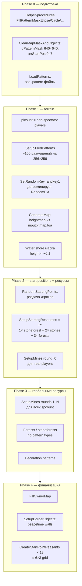

# Recon: Map generation pipeline (DoGenerate full timeline)

**Источник:** [`data/scripts/common.inc/dogenerate.inc`](C:/Program%20Files%20(x86)/Steam/steamapps/common/Cossacks%203/data/scripts/common.inc/dogenerate.inc) (2103 строки), вызывается через `ExecuteState('DoGenerate')` из [`initmapgen.inc:232`](C:/Program%20Files%20(x86)/Steam/steamapps/common/Cossacks%203/data/scripts/common.inc/initmapgen.inc#L232).

> **Связанные документы:**
> - [peasant_extraction.md §8](peasant_extraction.md) — densities (frs_big, mnt, …) и distance-таблицы для mines.
> - [peasant_extraction.md §8.4](peasant_extraction.md) — что такое `.pattern` файл и как mask мапится в env-объекты.

---

## 1. Глобальные константы (объявлены до процедур)

Из [dogenerate.inc:407-416](C:/Program%20Files%20(x86)/Steam/steamapps/common/Cossacks%203/data/scripts/common.inc/dogenerate.inc#L407):

```
cCircle1MaskX = 5    cCircle1MaskY = 7    // forbidden zone — здесь только Phase-1 mines
cCircle2MaskX = 12   cCircle2MaskY = 15   // 1× stoneforest + 1× stones + 2× forests
cCircle3MaskX = 22   cCircle3MaskY = 18   // 1× stones + 1× forest
cBorderObjDist = 1                        // peacetime wall spacing (tiles)
```

Это **полу-оси эллипсов** в `gPatternMask`, центрированные на каждой стартовой точке. Внутри эллипса `gPatternMask[x,y] := True` → ничего больше нельзя ставить (ни лес, ни камни, ни здания env-плеера). Эллипсы заполняются через `_misc_FillPatternMaskElipse(pointx, pointy+2, rx, ry)` — **с +2 смещением по Y** (стартовый поинт сдвинут вверх относительно центра масок).

Также:
- `var foreststype : Integer = floor(RandomExt*3); foreststype := 0;` ([dogenerate.inc:5-6](C:/Program%20Files%20(x86)/Steam/steamapps/common/Cossacks%203/data/scripts/common.inc/dogenerate.inc#L5)) — **foreststype всегда = 0**. Случайная инициализация немедленно перезаписана. Следствие: на Land **никогда** не бывает leaf-only (`foreststype=1`) или mixed-only (`foreststype=2`) карт. Только foreststype=0 mix: pinefir/spruce/pine/pine_big_2 (big), pinefir/spruce/pine (mid), pinefir/pine (small).
- `var bDesert : Boolean = (gMap.settings.gen.season=3);` — season=3 переключает все pattern types на `desert_*`. Для Land+любая-другая-сезон bDesert=False.
- `var maphW : Integer = mapW div 2;` — половина ширины карты (используется для tiny-corner-snapping в SetupMines round 2).

---

## 2. Pipeline (хронологический порядок, файлы от вершины DoGenerate вниз)

Общая хронология (фазы 0–4) — на схеме:



Детали по фазам ниже.

### Phase 0 — подготовка
1. [Lines 1-78] Helper-procedures для масок (FillPatternMaskElipse/Circle/Rectangle/MapBorder).
2. [Lines 80-419] Helper-procedures для юнитов и UniqueStartingUnits (нация-специфичные офицеры/барабанщики при `startingunits>default`).
3. [Lines 444-497] `ClearMapMaskAndObjects` — очистка `gPatternMask` (640×640), `arrStartPos[0..7]`, `arrStartPosBusy[i] := -1`.
4. [Lines 1284-1289] `_gui_ProcessProgressBar('progressbar.loadingenvironment')` → `LoadPatterns(True, False)` + `LoadPatterns(True, True)` — загружает все `.pattern` файлы из `data/gen/patterns/*`.

### Phase 1 — terrain
5. [Lines 1291-1296] Подсчёт `plcount` = существующие non-spectator игроки.
6. [Line 1535] `SetupTiledPatterns('tiles')` (или `desert_tiles` если bDesert) — кладёт фоновые decoration-tiles (например, грязь, трещины) на 25×25-tile сетку: `wcount = mapW div 25`, `hcount = mapH div 25`, центр каждого блока `realx = (x*25) + 12 - mapW/2 - 1`. Для 256×256 это ~10×10 ≈ **100 размещений**.
7. [Line 1538] `SetRandomKey(randkey1)` — все последующие `RandomExt` детерминированы этим seed.
8. [Lines 1542-1565] `relieftype`, `terraintype`, `minesdensity` resolved (random если выходит за валидный диапазон). Выбирается `pTerrainTypes` (DLC5 или нет в зависимости от gRecordGeneratorVersion). `ExecuteState('GenerateMap')` — engine-builtin строит heightmap из выбранного `inputbitmap.tga`, заполняет тайлы.
9. [Lines 1568-1581] Маркер water shore: для каждой клетки если height < -0.1 → `gPatternMask[x,y] := True`.
10. [Lines 1585-1587] Если `minesdensity > 2` (random) → `floor(RandomExt*3)`.
11. [Line 1590] `_misc_SetDesert(False, False)` если bDesert.

### Phase 2 — старт-поинты
12. [Lines 1596-1611] Цикл по игрокам: для каждого с валидным `startx/y` (`>= -mapW/2`) → `arrStartPos[i] := startx, starty`. **Сами координаты `gMap.players[i].startx/y` приходят из C++ engine** — он их вычисляет при загрузке `inputbitmap.tga` (по специальным маркерам в маске). `spcount` = количество игроков с валидным стартом.
13. [Line 1613] `_misc_FillPatternMaskMapBorder(3)` — внешняя рамка 3 тайла шириной заблокирована.
14. [Line 1615] **`RandomStartingPoints(spcount, minesdensity)`** — назначает игроков на arrStartPos с учётом team option (см. §3 ниже). Внутри для каждого игрока вызывается `CreateStartPoint(plInd, pointx, pointy, minesdensity, plcount)` → который делает:
    - `_misc_FillPatternMaskElipse(pointx, pointy+2, cCircle1MaskX=5, cCircle1MaskY=7)` — закрывает innermost зону.
    - `SetupMines(pointx, pointy, minround=0, maxround=1, minesdensity, spcount)` — **только round 0** (близкие mines).
    - `SetupStartingResources(pointx, pointy)` — кладёт ~5-6 кластеров вокруг (см. §4).
15. [Line 1616] `SetRandomKey(randkey1)` — re-seed (детали placement не должны влиять на следующие фазы).

### Phase 3 — relief densities + Phase-2 mines
16. [Lines 1621-1650] `relieftype` cases: plt/mnt/hil выбираются. Highlands (=3): plt=0.000055, mnt=0.000120, hil=0.000050.
17. [Lines 1688-1693] `frs_big=0.0009`, `frs_mid=0.0009`, `frs_small=0.00054`, `dcr=0.0005`, `stn1=0.00016`, `stn2=0.00012`.
18. [Lines 1715-1725] `_misc_GetFreePatternMaskModifier(probsmall, probmid, problarge, probhuge)` — Monte-Carlo на свободных клетках; затем умножается на map-size modifier `640/((mapW+mapH)/2)`. Для tiny это ×2.5.
19. [Lines 1727-1739] Финальные densities: `pln_small/_mid/_large/_huge`, `swamp_*`, `lake_*`, mnt/plt/hil умножены на `problarge`.
20. [Lines 1745-1766] `_misc_SetupPatternsByType(...)` для mountains/plateau (×3 части)/ravine/hills.
21. [Lines 1768-1771] **Phase-2 mines:** `for i:=0 to spcount-1 do SetupMines(arrStartPos[i].x, .y, minround=1, maxround=0, minesdensity, spcount)` — раунды 1..rounds-1 (внешние кольца). `maxround=0` означает «не override», т.к. условие `if (maxround>0)` false.
22. [Line 1772] `SetRandomKey(randkey1)` — re-seed снова.
23. [Lines 1774-1908] `_misc_SetupPatternsByType` для forests/stones/plain/swamp/lake — здесь `foreststype` диктует ветку (но всегда =0, так что только pine/spruce/pinefir и mixed pine_big_2).

### Phase 4 — старт-юниты + финализация
24. [Lines 1914-1923] **`for i:=0 to gc_MaxPlayerCount-1 do CreateStartPointPeasants(i, startx, starty)`** (или `CreateUniqueStartingUnits` если `startingunits>default`).
25. [Line 1925] `_misc_PreloadTextures(True, True, True)`.
26. [Line 1939] `gbool_gui_mapgenerationfinished := True`.
27. [Lines 1971-2027] Сезонная нормализация env-objects: зимой удаляются `leaftree*`; нерандомные scale clamping в `[scaleMin, scaleMax]`.
28. [Lines 2031-2050] AI setup: `gPlayer[i].progressTick := (cProgressAITick=16 div count)*ind`.
29. [Line 2052] `_player_SetupTeams(true)`.
30. [Line 2059] `gfloat_peacetime := _misc_GetPeaceTime(...)`; `gbool_peacemode := (peacetime <> default)`.
31. [Line 2062] **`FillOwnerMap(spcount)`** (см. §5).
32. [Lines 2064-2065] `if gbool_peacemode then SetupBorderObjects` (см. §6).
33. [Line 2068] `_misc_SetShoresCollision`.
34. [Lines 2075-2084] Color table per season (winter=6, desert=7, default=0; PHDR=1 для winter, 0 иначе).
35. [Line 2100] `TimeLog('Generation finished. relieftype=... minesdensity=...')`.

---

## 3. `RandomStartingPoints(plcount, minesdensity)` — раздача игроков

[dogenerate.inc:1090-1229](C:/Program%20Files%20(x86)/Steam/steamapps/common/Cossacks%203/data/scripts/common.inc/dogenerate.inc#L1090). Две ветки в зависимости от `gMap.settings.additional.teams`:

### 3.1 `teams = nearby` (союзники рядом)
1. Группируем игроков по `team` (5 команд: 0 = соло-плеера, 1..4 = командные).
2. Если в команде только 1 человек — переносим его в team[0] (соло).
3. Сортируем `teamlist` (команды с >1 игроком) — для каждой:
   - `SetRandomKey(randkey1)` + advance i раз.
   - Случайно выбираем стартовую команду из `teamlist`.
   - Вызываем `GenerateTeamStartingPoints(teamcount, pointsbusy, points)` (lines 999-1088): жадный greedy-алгоритм:
     - Берём random первую точку.
     - Каждую следующую выбираем как «точку, к которой ближе всего БОЛЬШИНСТВО уже выбранных» (если ничья по count → меньшая total distance).
   - В случайном порядке (через `SetRandomKey + RandomExt`) распределяем `points` между членами команды.

### 3.2 `teams = default` (по разным углам)
- Все игроки в team[0]. Для каждого: `SetRandomKey(randkey1) + advance(i+8)` → случайный `pointindex` из оставшихся.

В обоих случаях итогом является вызов `CreateStartPoint(player, x, y, minesdensity, plcount)` для каждого, который и запускает Phase-1 mines + StartingResources.

**Источник arrStartPos[].x/y:** **C++ engine читает inputbitmap.tga и находит спец-цвета (пиксели-маркеры старт-поинтов)**. Скрипт получает их готовыми через `gMap.players[i].startx/starty`. Скрипт умеет только переставить players между готовыми точками.

---

## 4. `SetupStartingResources(pointx, pointy)` — что спавнится возле города

[dogenerate.inc:720-978](C:/Program%20Files%20(x86)/Steam/steamapps/common/Cossacks%203/data/scripts/common.inc/dogenerate.inc#L720). Шесть последовательных placement-фаз, каждая пытается до 128×3 = 384 разных позиций (vary angle + distance). Вызывается из CreateStartPoint **после** того как cCircle1 уже заполнен.

| # | Pattern type | mindst (tiles) | dst формула | После: маска |
|--:|---|---:|---|---|
| 1 | `stoneforests` (или `desert_stoneforests`/`desert_forests_big` для bDesert) | min(5,7)=5 | `5 + RandomExt*3 + (i+j)*0.5` | — |
| 2 | _FillPatternMaskElipse(cCircle2=12,15) | — | — | блокирует средн. зону |
| 3 | `stones` | min(12,15)=12 | `12 + RandomExt*3 + (i+j)*0.5` | — |
| 4 | `forests_pinefir/spruce/pine_*_medium/big` (×2 раза, foreststype=0 → random pick из 7 вариантов) | 12 | то же | — |
| 5 | `stones` | min(12,15)+4 = 16 | `16 + RandomExt*2 + (i+j)*0.5` | — |
| 6 | `forests_*_medium/big` (ещё 1 раз) | 16 | то же | — |
| 7 | _FillPatternMaskElipse(cCircle3=22,18) | — | — | блокирует внеш. зону |

**Что это значит для базы игрока:** в радиусе **5..22 тайла** от центра города ВСЕГДА есть гарантировано:
- 1× `stoneforests` (mixed wood+stone в одном паттерне, mask~152)
- 2× `stones` (mask~138 каждый)
- 3× `forests_*_big/medium` (mask 148..1631 в зависимости от типа)

После этого зона ≤22 тайла полностью замаскирована — ничего больше Phase 3 туда не положит. **Это объясняет почему в начале игры всегда хватает дерева на ratuse + первый mill.**

Для desert замены: `desert_stoneforests`/`desert_forests_big`/`desert_stones`/`desert_forests_medium/big`.

---

## 5. `FillOwnerMap(spCount)` — кому какая клетка принадлежит

[dogenerate.inc:1370-1428](C:/Program%20Files%20(x86)/Steam/steamapps/common/Cossacks%203/data/scripts/common.inc/dogenerate.inc#L1370). Простой BFS:

1. Init `gScanGrid[i,j]` (размер `gc_scangrid_countx × gc_scangrid_county`): `owner=-1, dist=-1, fChecked=False`.
2. Для каждой стартовой позиции: `_misc_PosToScanGridIndices(arrStartPos[i].x, .y, gridX, gridY)` → `gScanGrid[gridX,gridY].owner := arrStartPosBusy[i]` (player id), `dist := 0`.
3. BFS: пока есть необработанные клетки на текущем dist → раздаём 4 соседям (i±1, j±1) тот же owner с `dist+1`.

Результат: каждая ячейка scan-grid'а помечена ID ближайшего игрока (по Manhattan distance в grid units).

---

## 6. `SetupBorderObjects` — peacetime walls

[dogenerate.inc:1430-1527](C:/Program%20Files%20(x86)/Steam/steamapps/common/Cossacks%203/data/scripts/common.inc/dogenerate.inc#L1430). Запускается **только если `gbool_peacemode`** (т.е. peacetime <> default). Полное описание peacetime-механики — [`game_settings.md`](game_settings.md) §3.4.

Идея: для каждой пары соседних клеток `gScanGrid[i,j]` и `gScanGrid[i+1,j]` (а также `[i, j+1]`):
- Если `owner` различается → провести цепочку border-объектов между центрами этих клеток.
- Шаг: `cBorderObjDist = 1` тайл.
- На воде: `gc_basename_ptborderwater`, на суше: `gc_basename_ptborder`.
- Объекты создаются у misc-плеера (`gc_playerind_misc`), `GameObjectMakeUniqId` для uniqueness.

**Импликация для нашего sim:** мы peacetime игнорируем. На default peacetime эти стены не ставятся → можно не моделировать.

---

## 7. `CreateStartPointPeasants(plInd, pointx, pointy)` — стартовые крестьяне

[dogenerate.inc:1231-1281](C:/Program%20Files%20(x86)/Steam/steamapps/common/Cossacks%203/data/scripts/common.inc/dogenerate.inc#L1231).

```
count = 18         # ВСЕГДА 18 крестьян
cUnitR = 0.75      # шаг сетки
for i = 0 to 17:
    px = pointx + (i div 3) * 0.75 + (0.5 - RandomExt) * 0.25 - (6 * 0.75)/2
    pz = pointy + (i mod 3) * 0.75 + (0.5 - RandomExt) * 0.25 - (0 * 0.75)/2
    spawn peasant(px, py, pz)
    SetGameObjectRollAngleByHandle(goHnd, 180)  # лицом вниз
```

**Сетка:** 6 колонок × 3 ряда. Шаг 0.75 тайла. Random jitter ±0.125. **Quirk:** `count mod 3 = 18 mod 3 = 0`, поэтому Y-центрирующее смещение = 0. Z-координаты идут от `pointy + 0` до `pointy + 1.5` (т.е. сетка смещена ВНИЗ относительно центра, не центрирована). X-координаты центрированы корректно: от `pointx - 2.25` до `pointx + 1.5`.

Совпадает с эмпирически наблюдаемыми **18 idle peasant** (verified 2026-04-29: 18 × (32 + 30) food/g-сек × 32/20000 × 120 g-сек ≈ 214 food, см. также [`docs/reference/01_economy.md`](../docs/reference/01_economy.md) §Famine).

Если `gMap.settings.additional.startingunits > default` → вместо 18 пеасантов вызывается `CreateUniqueStartingUnits` (нация-специфичный squad: офицер + барабанщик + несколько infantry). Полный список из 14 пресетов стартовой армии — [`game_settings.md`](game_settings.md) §3.1.

---

## 8. Что значит «Phase 1 vs Phase 2 mines»

`SetupMines(pointx, pointy, minround, maxround, minesdensity, spcount)` управляется флагами:

| Вызов | minround | maxround | rounds итог | Где |
|---|---:|---:|---|---|
| Phase 1 (внутри CreateStartPoint) | 0 | 1 | i:=0..0 (только round 0) | line 985 |
| Phase 2 (после relief) | 1 | 0 | i:=1..rounds-1 (round 0 пропущен) | line 1770 |

`if (maxround>0) and (rounds>maxround) then rounds := maxround;` ⇒ Phase 1 ограничивает rounds=1; Phase 2 maxround=0 → no override, использует полный rounds=case minesdensity.

Для **Rich (minesdensity=2) на Tiny (mapsize>2)** [version ≥80]:
- Phase 1: 1× round 0 × 3 ресурса = 3 close deposits (1g+1i+1c) на расстоянии 14..22 тайлов.
- Phase 2: rounds 1..4, но round 4 = `continue` на tiny ⇒ 3 outer rounds × 3 ресурса = 9 outer deposits.
- **Итого 12 deposits per player** при условии успеха всех 256-try попыток.

Особый случай: round 2 на tiny+spcount≤4 (line 658-696, version≥90) — `newpointx/y` snap на угол карты (`±maphW∓24, ±maphH∓24`) для самых дальних деопозитов. Это «ничейные» mines в углах, к которым нужно ехать вдоль карты.

---

## 9. Версионные различия (gRecordGeneratorVersion)

В коде много `if (gRecordGeneratorVersion < N) then …`. Текущий ванильный игровой клиент (DLC5 era) имеет version ≥ 90+, что включает:
- DLC5 terrain types (line 1555).
- Distance table v90+ (mines round 2 = 70..82 на tiny, snap to corner).
- `gRecordGeneratorVersion < 53` → удаляются player handle 8.
- `< 89` → удаляются 9, 10, 11.

Мод-разработчик может проверить `gRecordGeneratorVersion` через [`data/game/var/data.cfg`](C:/Program%20Files%20(x86)/Steam/steamapps/common/Cossacks%203/data/game/var/data.cfg) или через git log этого файла.

---

## 10. Что наша симуляция в `parser/` и `compute/` модулирует / упрощает

Проверочный список того, что код dogenerate.inc делает, но мы либо игнорируем, либо приближаем:

| Реальность | Наша симуляция | Статус |
|---|---|---|
| Engine читает arrStartPos из inputbitmap.tga | Жёстко задаём 1 startpos | OK для 1pl-сценариев |
| 6 placement-фаз SetupStartingResources с конкретными шаблонами | Считаем aggregate forest/stone density | **Грубо** — стартовые ресурсы недоучтены, но empirically validated через replay totals |
| cCircle1/2/3 forbidden zones | Не учитываем явно | Влияет на placement, частично учтено через empirical placement_rate (см. §14) |
| Phase 1 mines (round 0, 14..22 tile) | Учитывается через `predicted_mines_per_type` | OK, **validated** ratio=1.00 (см. §14) |
| Phase 2 corner-snap для round 2 на tiny | Не учитываем (даём 70..82 без snap) | Минорно |
| foreststype always 0 | Подразумеваем Land mix → совпадает | OK |
| FillOwnerMap + peacetime borders | Игнорируем | OK для default peacetime |
| 18 starting peasants в 6×3 grid | Жёстко 18 в config | OK |
| Per-pattern-type placement rate | Раньше: единый 0.65. Теперь: empirical per-type table (см. §14) | **Validated** на homogeneous Tiny+Land+Highlands bucket (n=10), ratios 0.96-1.04 |
| Sezon=3 → desert pattern types | Не реализовано | TODO если нужен desert (1/20 sample replays) |
| Plain / mountains / swamps / hills / plateaus / stoneforests | **Не предсказывается** `compute_counts` | **OPEN GAP** — ~50% всех кластеров не покрыто моделью |
| Non-Land mine formula | Считаем как Land | **OPEN GAP** — non-Land replays дают inferred P=0 (см. §14) |
| Random teams=nearby алгоритм | Не реализовано | OK для 1pl-сценариев |

---

## 14. Empirical validation pipeline (replay-based ground truth)

**С 2026-04-29:** есть infrastructure для *эмпирической* валидации модели против реальных save/replay-файлов. Это превращает §10 из «гипотез» в «измерения».

### 14.1 Стек

| Скрипт | Что делает |
|---|---|
| [`parser/parse_replay.py`](C:/projects/other/cossacks/parser/parse_replay.py) | OSWMap13 reader: extract settings (randkey0/1, maskname, mapsize, relieftype, terraintype, season, …), BMP thumbnail, pattern-name occurrences |
| [`compute/compute_replay_aggregates.py`](C:/projects/other/cossacks/compute/compute_replay_aggregates.py) | Folder of `.rep`/`.map` → `docs/derived/replay_ground_truth.json` (per-replay + per-type cluster counts) |
| [`compute/validate_map_predictions.py`](C:/projects/other/cossacks/compute/validate_map_predictions.py) | Each replay: run `compute_counts(...)` → diff vs actual → bucketed calibration table → `docs/reports/map/map_predictions_validation.md` |

Подробности про OSWMap13 формат, bucketing-методику и калибровочные числа — см. §14.2-14.5 ниже.

### 14.2 OSWMap13 format (саkmpы)

`.rep`/`.map` файлы — это binary contained dump:
- Header: length-prefixed strings (`"OSWMap13.Map.Ver[0.0]Build.Ver[X.Y.Z.NNNN]Core.Ver[1]"`, `"UID..."`, `"GameMapSnapShotBegin"`, BMP, `"GameMapSnapShotEnd"`, `"GameMapRecordBegin"`)
- Body: `(u32 keylen, ASCII key, u32 vallen, ASCII value)` pairs. Числа сериализованы как ASCII-строки.
- Pattern placements: имена `.pattern` файлов появляются verbatim как printable strings (`mng_3`, `forests_pine_big_1`, …). **Каждое occurrence = один cluster, размещённый движком** = ground truth.

`playerscount`/`startid` **отсутствуют** в headers — должны выводиться через формулу шахт (§14.4).

### 14.3 Bucketing pitfall

⚠ Mixed-bucket усреднение per-type ratios может дать ratio≈1.0 случайно: на Tiny placement rate высокий (модель занижала), на Huge — низкий (модель завышала), они компенсируются в среднем. Validator **обязательно** бакетит по `(mapsize, relieftype, terraintype, mask_kind)` и выводит per-bucket summary отдельно от mixed.

### 14.4 Player-count inference (Land only)

Для Land terrain, total mines per type encode P:
```
mines_per_type = P × (1 + n_after) + (spcount - P) × n_after
              = P + spcount × n_after

⇒ P = mng_count - spcount × n_after
```

Где `n_after = len(rounds 1..rounds-1, минус i=4 если Tiny)`. Для Tiny+Rich/Medium+4pl: 14→2P, 15→3P, 16→4P. Валидировано на sample replay (mng=14 при reportedly 2-player game → формула верна).

Для **non-Land** (terraintype != 0) формула не работает (engine logic другая — `CreateStartPoint`'s round 0 likely не fire для non-Land). См. §13 Q6.

### 14.5 Calibrated placement rates (Tiny+Land+Highlands+4pl_nowater bucket, n=10)

[`PER_TYPE_PLACEMENT_TINY_HIGHLANDS_LAND`](C:/projects/other/cossacks/compute/compute_map_resources.py) в `compute_map_resources.py`:

| pattern type | rate | bucket ratio actual/pred |
|---|---:|---:|
| `forests_pine_big` | 0.81 | 0.98 |
| `forests_pine_big_2` | 0.74 | 1.00 |
| `forests_pinefir_big` | 0.07 | 1.10 |
| `forests_spruce_big` | 0.20 | 1.00 |
| `forests_pine_medium` | 0.76 | 1.04 |
| `forests_pinefir_medium` | 0.09 | 0.75 (rounding error на 1.5→2) |
| `forests_spruce_medium` | 0.04 | 0.70 (rounding) |
| `forests_pine_small` | 0.64 | 0.96 |
| `forests_pinefir_small` | 0.03 | 0.80 |
| `stones` | 0.58 | 1.01 |
| mng/mni/mnc | (formula) | 1.00 |

**Wide variance объясняется размером pattern footprint:**
- pine_big mask = 148 cells → fits almost anywhere → ~80% placement.
- pinefir_big mask = ~920 cells → 6× больше → редко влезает → ~7%.
- spruce_big между ними → ~20%.

⚠ Числа специфичны для **Tiny+Land+Highlands**. На Huge map должны отличаться (больше места → pinefir/spruce влезают чаще). Не экстраполировать без новых replay-данных.

---

## 11. Ключевые файлы pipeline

| Что | Где | Linenoы |
|---|---|---|
| Главный orchestrator | `data/scripts/common.inc/dogenerate.inc` | 1-2103 |
| Точка входа | `data/scripts/common.inc/initmapgen.inc` | 232 |
| Mission map вариант | `data/scripts/common.inc/dogeneratemissionmap.inc` | — |
| Engine RNG seed setup | `data/scripts/lib/map.script` | 322 (`GenerateMapRandKey`) |
| InputBitmap selection | `data/scripts/common.inc/generatemap.inc` | 179-216 |
| StandPattern (C++ внутри) | `data/scripts/lib/misc.script` | 3390 (declaration only) |
| GenerateMap state | engine-builtin | вызывается line 1565 |

---

## 12. Seed space — что определяет уникальную карту

При фиксированных параметрах (terrain + mapsize + relief + mines + players) карта однозначно задаётся парой `(inputbitmap, randkey0/randkey1)`:

- `inputbitmap` — файл из `data/gen/terrainmasks/<terrain>/<N>pl_*.tga`. Выбирается случайно по индексу `floor(RandomExt*count)` ([generatemap.inc:179-191](C:/Program%20Files%20(x86)/Steam/steamapps/common/Cossacks%203/data/scripts/common.inc/generatemap.inc#L179)). Engine читает .tga и извлекает стартовые позиции по спец-маркерам в маске → `gMap.players[i].startx/y`.
- `randkey0, randkey1` — 64-битная пара RNG-сидов (`SetRandomExtKey64`, [generatemap.inc:216](C:/Program%20Files%20(x86)/Steam/steamapps/common/Cossacks%203/data/scripts/common.inc/generatemap.inc#L216)). Все последующие `RandomExt`-вызовы (placement лесов/камней/шахт, выбор bitmap из списка) детерминированы этой парой.

**Сколько базовых масок есть.** Для 4 игроков:

| terrain folder | n_files |
|---|---:|
| `continent/` | 121 |
| `continents/` | 187 |
| `islands/` | 320 |
| `land/` | **230** |
| `mediterranean/` | 122 |
| `nowater/` | 42 |
| `nowater2/` | 33 |
| `peninsulas/` | 280 |

Для нашего scope (Land + 4pl) — **230 базовых форм** карт.

**Что это даёт.**

1. **Bounded enumeration.** Для (Land, Tiny, 4pl, Highlands, Rich) общее число уникальных карт = 230 базовых форм × K randkey-вариаций. K не известно, но в 4-байтном UI seed-поле едва ли > 10⁹; реально пользовательские seed'ы лежат в гораздо меньшем диапазоне.

2. **Deterministic replay.** Зная тройку `(inputbitmap, randkey0, randkey1)`, можно воспроизвести карту bit-for-bit (с поправкой на детерминизм engine RNG, см. [determinism_audit.md](determinism_audit.md)). Save-файлы хранят `randkey1` в имени: `'game_v'+gSerialVersion+'k'+randkey1+'.map'` ([miscext2.script:15](C:/Program%20Files%20(x86)/Steam/steamapps/common/Cossacks%203/data/scripts/lib/miscext2.script#L15)).

3. **Точная калибровка trees-per-pattern.** 5-10 запусков map gen с фиксированными параметрами, парсинг env-объектов из save → empirical mapping `bitmap → tree count`. Это даст точную замену текущей константы `0.30 × mask_cells`.

**Ограничения.** `GenerateMapRandKey` ([map.script:322](C:/Program%20Files%20(x86)/Steam/steamapps/common/Cossacks%203/data/scripts/lib/map.script#L322)) — engine-builtin, тело недоступно. Точный диапазон randkey0/1 не подтверждён.

---

## 13. Открытые вопросы (для следующих сессий)

1. **Точное положение arrStartPos в inputbitmap.tga.** Engine читает маркеры в маске (вероятно, по специальным RGB-кодам пикселей). Декодировать `data/gen/terrainmasks/land/4pl_*.tga` руками — можно построить точную карту start-positions для каждого preset. Полезно для editor-tooling и точного предсказания дистанций до ресурсов.

2. ~~**`_misc_GetFreePatternMaskModifier`** values for Tiny+Highlands.~~ **PARTIALLY ANSWERED** — modifiers сами по себе не измерены, но per-type **effective placement rate** теперь откалиброван эмпирически на 10 replays (см. §14.5). Это покрывает практическое use case без нужды декодировать Monte-Carlo внутренности.

3. **`SetupTiledPatterns` влияет ли на placement других объектов?** ~100 tile-paterns на 256×256 — это «ground decoration» (трещины, грязевые пятна). Возможно, они также блокируют `gPatternMask` для последующих placement фаз — нужно проверить через `_misc_CheckStandPatternExt` поведение.

4. **C++ функции `StandPatternWithAngle`, `_misc_FillPatternMaskBy*`** — доступны только декларации, не тело. Значит финальный mapping `mask cell → конкретный env-object class` (oak vs leaftree vs decortree) — out of reach без disasm exe.

5. **gRecordGeneratorVersion live value** — нужно вытащить runtime значение чтобы знать какая ветка mines distance таблицы реально применяется. Скорее всего ≥90 (Phase-2 round-2 corner-snap consistent с sample replays), но точно не подтверждено. Можно проверить через extracted replay header `Build.Ver[X.Y.Z.NNNN]`.

6. **Non-Land mine placement formula.** Для terraintype != 0 (continent / mediterranean / coastal / peninsulas / lakes) inferred player count из mng count даёт нонсенс (P=0 или negative — см. §14.4). Гипотеза: `CreateStartPoint`'s round-0 SetupMines не fire на non-Land (engine использует другой код для генерации стартовых позиций без player-side rounds), либо n_after отличается. Нужно прочитать non-Land branches в `dogenerate.inc` или ExecuteState code.

7. **Plain / mountains / swamps / hills / plateaus / stoneforests / desert_* — добавить в `compute_counts`.** Эти pattern types вызываются *вне* foreststype-блока ([dogenerate.inc:1745-1766] для mountains/plateau/ravine/hills, остальные где-то рядом) и составляют ~50% всех cluster occurrences по replay-данным. Нужно прочитать соответствующие секции и расширить модель.

8. **Десятки randkey0/1 значений на Land+Tiny+Highlands** — собрать 50+ replays на одинаковых настройках, варьировать только randkey, чтобы подтвердить detrministicностью (тот же randkey → тот же cluster count) или измерить variance. С 10 текущими replays variance вообще не оценена.
