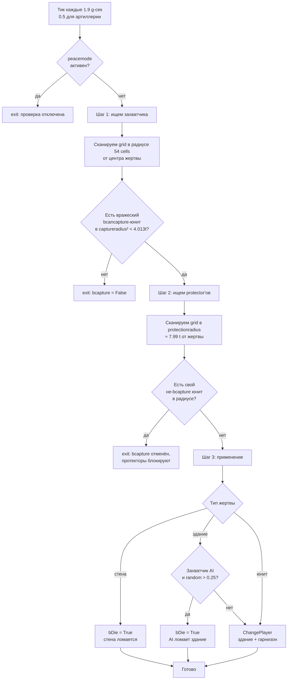

# Recon: механика захвата

Реверс-инжиниринг по `lib/miscext.script` (функции `_misc_CheckCapture`,
`_misc_ChangePlayer`). Все ссылки на код и сами Pascal-блоки собраны в
разделе [Источники](#источники) в конце документа.

## TL;DR

В Cossacks 3 нет AoE2-подобного «конвертера». Захват работает чисто
**геометрически:**

- Каждые N тиков движок измеряет евклидово расстояние от центра
  объекта-жертвы до окружающих вражеских юнитов.
- Если в радиусе `gc_gameplay_captureradius` (≈ 4 тайла) нашёлся
  вражеский юнит с флагом `bcancapture`, а в радиусе
  `gc_gameplay_protectionradius` (≈ 8 тайлов) нет своего юнита-защитника
  с `bprotector` — объект меняет владельца (или умирает, если
  у него выставлен `bDie`).
- Священник (`priest` / `pope` / `mullah` / `padre`) — это **лекарь**
  через «отрицательный урон», не конвертер. К `captureradius` не имеет
  отношения.

---

## 1. Константы

Радиусы захвата [^1]:

```
gc_gameplay_captureblockshotradius = 160 / gc_pixels_to_tile = 3.0 tile
gc_gameplay_captureradius          = 214 / 53.333          ≈ 4.013 tile
gc_gameplay_protectionradius       = 426 / 53.333          ≈ 7.987 tile
gc_gameplay_resourceDropRadius     = 3 tile
*Sqr — те же значения в квадрате (для евкл. сравнения)
```

Тики [^2]:
```
gc_unit_TimeCheckCapture    = 0.1*19  ≈ 1.9   игрового сек.   (peasant + buildings)
gc_unit_TimeCheckCaptureArt = 0.1*5   ≈ 0.5   игрового сек.   (артиллерия — чаще)
```

Метрика — **Euclidean²** [^3]: `(px, py)` — позиция объекта-жертвы,
`(tx, ty)` — позиция кандидата-захватчика. Это **центр-к-центру**, ни
Manhattan, ни Chebyshev. Форма здания НЕ учитывается, только его
one-cell anchor.

Карточные настройки `gMap.settings.additional.capture` [^4]:
```
0 capture_default            — захват разрешён всем (peasant, infantry, art)
1 capture_nopeasants         — peasant нельзя захватить (default deathmatch + battles)
2 capture_nocenterspeasants  — peasant нельзя захватить + центр (TC) нельзя
3 capture_onlyartillery      — только артиллерию можно захватывать
```

Все 4 значения опции `capture` с каноническими русскими названиями — [`reports/map/lobby_settings.md`](../../../reports/map/lobby_settings.md#capture--правила-захвата). Поведение движка (как `capture` взаимодействует с `peacetime` и владением территорией) — [`game_settings.md`](../map/game_settings.md) §3.4.

---

## 2. Кто может быть захвачен (`bcapture` = True)

Поиск `objprop.bcapture := True` в скриптах юнитов:

### Юниты
| sid | usage |
|---|---|
| `peaaus` / `peatur` / `pearus` / `peapol` / `peaspa` / `peaeng` / `peaukr` / `peasco` | peasant |
| `cannon` | cannon |
| `howitzer` | mortar |
| `mortar` | supermortar |
| `multicannon` | mcannon |
| `framegun` | cannon |

(Остальные типы юнитов имеют `bcapture=False` → их нельзя захватить, только убить.) [^5]

### Здания

В `_unit_InitBase`:
- `SetObjBuildingBaseSettings(objprop, True, …)` — здание ловится:
  - `commonsid+'sto'` = склад (storage)
  - `commonsid+'gol'/'iro'/'coa'` = шахты
  - `csid+'cen'` = town centre (`gc_obj_usage_center`, `bcapture=True`)
  - `csid+'bar'` / `csid+'ba2'` = казарма (`bcapture=True`)
  - `csid+'mil'` = mill (через mil-блок default `bcapture` — берётся
    из caller'а; в этом блоке **НЕ** перетирается, см. ниже)
  - `csid+'bla'` = blacksmith (`bcapture=True`)
  - и др. через `SetObjBuildingExtProperties(... True, ...)`
- `False` (= не захватываются, только разрушаются):
  - `commonsid+'tow'` = башня (**башни НЕЛЬЗЯ захватить**, только снести)
  - `commonsid+'por'` = port
  - `commonsid+'swa/sga'`, `ukrwwa/wga` = стены / ворота
  - `csid+'sta'` = стойло
  - `csid+'aca'` = академия (`False`)
  - `csid+'dip'` = посольство (`False`)
  - `csid+'17'` = building 17 century (`False`)
  - `csid+'18'` = building 18 century (`False`)
  - `misblg/misblg2`, `misyurt`, `miscommandcenter` (mission objects) — `False`

См. ссылки на конкретные строки в [^6].

Важное правило: `bcancapture := not bcapture` [^7]. То есть здание со
`bcapture=True` НЕ может само быть захватчиком (логично, оно неподвижно),
и наоборот.

Для не-зданий действует дополнительная настройка [^8]:

- **Любой** небоевой / боевой юнит, у которого `bcapture=False`,
  становится `bprotector` (защищает свои здания) и `bcancapture` (может
  захватывать) — **за исключением peasant**.
- **Peasant** (`bcapture=True`) — НЕ protector и НЕ capturer
  (пассивный объект захвата).
- Артиллерия (`bcapture=True`) — НЕ protector и НЕ capturer
  (пассивна, только обороняется огнём).

⇒ Конкретно «захватчик здания» = **любой не-пехотный/конный юнит соперника, кроме peasant и артиллерии**.

---

## 3. Триггер `_misc_CheckCapture` — полный псевдокод

Источник: `_misc_CheckCapture` [^9]. Логика проверки в три шага:



Полный псевдокод процедуры — см. [^10]. Высокоуровневая логика по шагам:

**Подготовка.** `pobj` — объект-жертва, `scangrid` — его клетка скан-сетки.
Если `peacemode` активен и текущая клетка не вражеская, проверка
выходит сразу. Радиус сканирования по grid-cells: `rx1 = floor(214/4) + 1 = 54`.
Маска кандидатов: при `bneutral` — вражеская, иначе — своя для владельца клетки.

**Шаг 1 — найти захватчика.** Цикл по grid-cells в радиусе `rx1`. В каждой
клетке с подходящей маской вызывается `_unit_SearchCapturersForWall` (для
стен) или `_unit_SearchCapturers` (для прочих). Если кандидат найден —
проверяется евклидов квадрат расстояния до жертвы:

- стена ловит любого не-здания-врага (даже peasant);
- обычное здание — только `bcancapture`-юнита, и не на воде.

При `distSqr < captureradiusSqr (≈ 4.013² tile)` поднимается `bcapture`,
запоминается `capturerHnd`. Если ещё ближе (`< 3² tile`) — взводится
`bblockshot` (заглушка стрельбы жертвы).

`_unit_SearchCapturers` ищет юнита с условиями `not bbuilding && bcancapture`,
`(myplmask & plmask) <> 0` и `pl <> mercenaryInd`. Версия для стены не
требует `bcancapture`, то есть кто угодно из вражеской пехоты ломает стену
(фактически захват = смерть стены).

**Шаг 2 — protector'ы.** Если жертва — здание / арт-юнит, и (для стены)
`hp >= maxhp/3`:

- *2a.* Если жертва — НЕ peasant и захватчик ОЧЕНЬ близко
  (`bblockshot`), ставим `attackdelay := max(attackdelay, 100*gc_frames_to_time)`
  (≈ 3.125 g-сек заглушки).
- *2b.* Радиус `rx2 = floor(426/4) + 1`, обходим клетки с моими юнитами.
  `_unit_SearchProtectors` ищет юнита с `pobjprop.bprotector && not bbuilding`
  и `(myplmask & plmask) = 0`. Если найден и `not pobjprop2.bcapture`
  и `distSqr < protectionradiusSqr` — `bcapture := False` (захват
  отменяется, цикл продолжается для счётчика `protectorsCount`).
- *2c.* AI-арт-логика (если жертва — `bartillery`, владелец AI):
  при определённых соотношениях `capCount / protCount` (см. [^10])
  юнит совершает суицид (`SetTagStates(essential_death)`) — кроме
  `bEasy` или прохождения `random > 0.5`.

**Шаг 3 — применение.** Если `bcapture` остался `True`:

- Юнит, ещё не родившийся (`essential_birth & statetag`) и видимый —
  просто умирает.
- Иначе при `(statetag & visual_hide) = 0`:
  - Стены всегда умирают (`pobjprop.bwall ⇒ bDie := True`).
  - Не-здание: `_unit_Stop(goHnd)`.
  - Здание: отменяются produce/upgrade orders, `ClearOrders`, `SetSTO=0`.
  - Если владелец-AI теряет здание: с шансом 75% запускается деструкция
    (slowdeath / `bDie`). Для арт-юнитов AI и peasant'ов — отдельные
    шансы суицида (см. [^10] — supermortar ≈ 41.5%, cannon ≈ 60.9%,
    mortar ≈ 85.9%, peasant в `bEasy` ≈ 45.3%).
  - Если AI-захватчик подбирает peasant'а в hard — peasant умирает,
    а не переходит к нему.
  - Иначе — `_misc_ChangePlayer(goHnd, newPlHnd, bCapture=True, ...)`.

**Ключевые наблюдения:**
- Захват требует **только** одного капторщика в радиусе. Время захвата = 0
  (мгновенно при tick). Игрок видит «время на захват» как
  `gc_unit_TimeCheckCapture` ≈ 1.9 g-сек до следующей проверки.
- Тики со случайным offset (`random*gc_unit_TimeCheckCapture`) при init/serialize,
  чтобы здания не проверяли все одновременно (load-balancing).
- **Стены не захватываются** — они автоматически `bDie := True`. Это объясняет,
  почему «захват стены ≈ слом стены». Условие в шаге 2: `if not (bwall && hp<maxhp/3)` —
  стены ниже 1/3 HP не вызывают protector-логику и не блокируют огонь, что делает
  их бесполезной защитой при низком HP.
- **Башни** имеют `bcapture=False` ⇒ не вызывают `_misc_CheckCapture`.
  Их вообще нельзя захватить.
- **Гарнизон**: при захвате здания, `_misc_ChangePlayer` рекурсивно меняет
  владельца всех юнитов внутри (`pObjInside`) [^11]. Производственные
  ордера отменяются, возвращая ресурсы.

### Триггеры (где вызывается `_misc_CheckCapture`)

| Источник | Условие | Период |
|---|---|---|
| unit-side trigger [^12] | `pobjprop.bcapture and bplayable`. Только если `default OR bart OR (only_artillery and bart)`. | TimeCheckCapture (1.9с) или TimeCheckCaptureArt (0.5с) для арт. |
| building under construction [^13] | `not arg_obj.bbuilt` (стройка) — независимо от `bcapture`! | TimeCheckCapture |
| building post-construction [^14] | `pobjprop.bcapture` после постройки. Учитывает map-setting, при `only_artillery` — здания НЕ проверяются. | TimeCheckCapture |

⚠️ **Building under construction** проверяется на захват ВСЕГДА (даже башни во время стройки!). Это объясняет, почему недостроенную башню можно захватить — но как только она достроится, `bcapture=False` отключает чек.

---

## 4. Захват юнитов

### Кого можно захватить как юнита
- Peasant (любой нации, sid=`pea*`).
- Артиллерия: `cannon`, `howitzer`, `mortar`, `multicannon`, `framegun`.

Это всё. Пехота, кавалерия, корабли — захватить **нельзя** (только убить).

### Кто захватывает
Любой `bcancapture && not bbuilding && not peasant` ⇒ вся обычная
пехота / кавалерия / арт-команда (но не peasant и не сам объект захвата).

### Что становится с захваченным
- Peasant: при default settings и обычных условиях → меняет игрока
  (`_misc_ChangePlayer`). Внутри ресурс не дропается, перезапускается AI.
- Cannon / mortar: переключают игрока, заряд сохраняется в инвентаре `weapon.cost`.
  Производственные delay сбрасываются.
- Squad: захваченный юнит **выходит из squad** (см. `_misc_SquadChangePlayer`);
  если артиллерия была в строю — разваливает строй.

### По умолчанию в Deathmatch и Historical Battle

Оба режима устанавливают `capture_nopeasants` [^15], поэтому **в стандартных
матчах крестьяне не захватываются**, только убиваются. Захват крестьянина
возможен лишь в скирмише с настройкой `capture_default`.

---

## 5. Нейтральные объекты, клады, мерценарий

### Нейтральные игроки (`gPlayer[i].bneutral`)
- Поле `bneutral : Boolean` в TPlayer [^16].
- Используется в **миссиях/сценариях** [^17] — скриптеры могут
  переключать `bneutral=true/false` для дипломатии. В мультиплеере /
  случайных картах **этот флаг не активен** для обычных игроков.

### Mercenary (player index = MaxPlayer-1 = особый виртуальный игрок)
- `gc_player_mercenaryind = gc_MaxPlayerCount-1` [^18].
- Юниты с `bmercenary=True` (наёмник, рекрутируется в Diplomatic centre)
  при `brebellion=True` у владельца имеют шанс **defect to mercenary
  player** [^19]. То есть наёмники «уходят» к нейтралу при банкротстве
  (нет золота). Это НЕ захват противником.
- Mercenary-юниты **не считаются капторщиками** [^20] — фильтр в
  `_unit_SearchCapturers`.

### Treasure / chest / clad
**Не найдено**. Поиски `treasure|chest|clad|gc_obj_usage_treasure|stash`
не дают результатов в скриптах. В Cossacks 3 нет нейтральных кладов
на карте, как в C1 (Sich Rebellion в C1 имела «клады», в C3 эту механику
убрали).

### Нейтральные крестьяне на карте
`SetupStartingResources` (см. recon/world/map/map_generation_pipeline.md)
спавнит **18 пеасантов в 6×3 grid** на старт игры — **все они уже
принадлежат player'у**, не нейтральны. Других нейтральных юнитов на
карте нет.

### Нейтральные здания
Нет. Все здания на карте — собственность игроков или mercenary-player при
defect'е.

---

## 6. Захват башен (специфика)

Все башни (`commonsid+'tow'`, `misblg`, `misblg2`) имеют **`bcapture=False`** [^21].

- Они НЕ вызывают `_misc_CheckCapture` после постройки.
- У башни нет garrison-слотов (`peasantabsorber=0`, `transport=0`,
  см. [^21] и [`5.3 Tower`](building_mechanics.md#53-tower--built-in-cannon)
  в `building_mechanics.md`), поэтому вопрос «что происходит с гарнизоном
  при разрушении» к башне неприменим. Для прочих зданий с `peasantabsorber>0`
  или `transport>0` (центр, казармы, корабли-транспорты) при разрушении
  срабатывает `_unit_DestroyObj` [^22], который вызывает
  `_unit_DoUnitsGoOutside(list, bDead=True, ...)`. В этом режиме процедура
  устанавливает `essential_death` каждому юниту в списке [^23] — то есть
  содержимое убивается одновременно со зданием.
- **Исключение:** во время стройки (когда `arg_obj.bbuilt=False`), любое
  здание проверяется на захват [^13]. Поэтому **недостроенную башню
  можно захватить** обычным infantry-юнитом подходом ближе 4 тайлов.

---

## 7. Конверсия (priest-как-конвертер)

**Нет такой механики.**
- `bpriest` — флаг [^24], используется только в [^25].
- Логика: при «атаке» priest'а на юнита с `bpriest=True` атакующего,
  `damage := indamage` (исходный, без protection), затем
  `pobj2.hp := pobj2.hp + damage` ⇒ **лечение**, а не конвертация.
- Никаких `_misc_ChangePlayer` в priest-коде нет.
- Юниты, имеющие priest-роль (`pope`, `mullah`, `padre`, `priest`) — все
  указаны в [^26], все имеют `bpriest=True` через [^27].

⇒ Священник в C3 — это AoE-style **healer** (через «отрицательный урон»),
без конверсии.

---

## 8. Capture радиус — точные числа

```
Метрика:           Euclidean²  (Sqr(dx)+Sqr(dy) < radiusSqr)
Точка отсчёта:     центр-к-центру (game-object position X/Z)
Расстояние:        в tiles (1 tile = 53.333 px)
captureradius      ≈ 4.0125 tile  ≈ 1.6 m в игровом масштабе (1 tile = 0.5 m? см. determinism)
                   = 214 px game-source units
captureblockshot   = 3.0 tile     (заглушает огонь жертвы)
protectionradius   ≈ 7.987 tile   (зона protector'а, отменяет захват)
```

⇒ Чтобы захватить здание, infantry-юниту нужно подойти **к точке-якорю
здания** на расстояние < 4.013 тайлов (Euclidean). Если здание занимает
большой footprint (например, центр 5×4), фактически захватчик может
стоять дальше «края» — функция использует **точку центра**
(game-object position), не bbox. Тестировать: точка обычно близко
к геометрическому центру здания, но не идентична, особенно для
асимметричных строений.

---

## 9. Open questions

1. **Точная позиция (`px`, `py`) у здания** — это центр модели, центр bbox,
   или anchor-point? `GetGameObjectPositionXByHandle/ZByHandle` — нужен
   trace в-эмпирике (build a barracks, walk peasant до края, измерить
   min-distance до alarm event capture).
2. **`bAutoKill`** в Step 3 — переменная объявлена, но никогда не
   присваивается в `_misc_CheckCapture`. Возможно, это legacy-код от C1,
   где AutoKill включался для определённых типов; сейчас остаётся всегда
   False.
3. Для `wall` (стены): `_unit_SearchCapturersForWall` НЕ требует
   `bcancapture`. Значит peasant'ы и артиллерия тоже могут «ломать»
   стену через capture-механизм (а не только attack). Проверить
   эмпирически в скирмише с `peacetime=off` + wall + peasant без
   attack-команд.
4. Артиллерия проверяется чаще (0.5 с против 1.9 с) — означает, что её
   захват в 4× быстрее. Это согласуется с user-perception: «арт-юнит
   мгновенно теряется при подходе кавалерии». Но `_misc_CheckCapture`
   сама по себе мгновенна — задержки только в periodicity. Можно
   эмпирически замерить max-time-to-capture как `≤ 0.5 g-сек`.
5. Как проверка взаимодействует с FOG of war? Если жертва в чужом FOW,
   проверка идёт всё равно (server-authoritative).
6. **`bsearchminattackradius`** на пушках — есть ли связь между захватом
   и тем, что орудие переключилось на ближний бой?

---

## Источники

Все ссылки относительно `data/scripts/` в установке Cossacks 3.

[^1]: Константы радиусов захвата — `dmscript.global:207-220`:

    ```pascal
    gc_gameplay_captureblockshotradius = 160 / gc_pixels_to_tile;
    gc_gameplay_captureradius          = 214 / gc_pixels_to_tile;
    gc_gameplay_protectionradius       = 426 / gc_pixels_to_tile;
    gc_gameplay_resourceDropRadius     = 3;
    ```

[^2]: Тик-периоды — `dmscript.global:1478-1480`:

    ```pascal
    gc_unit_TimeCheckCapture    = 0.1 * 19;
    gc_unit_TimeCheckCaptureArt = 0.1 * 5;
    ```

[^3]: Метрика `Euclidean²` — `lib/miscext.script:1017-1018`:

    ```pascal
    distSqr := Sqr(px-tx) + Sqr(py-ty);
    if distSqr < gc_gameplay_captureradiusSqr then ...
    ```

[^4]: Карточные настройки `gMap.settings.additional.capture` — `dmscript.global:1072-1075`:

    ```pascal
    gc_capture_default            = 0;
    gc_capture_nopeasants         = 1;
    gc_capture_nocenterspeasants  = 2;
    gc_capture_onlyartillery      = 3;
    ```

[^5]: Юниты с `bcapture=True` — `lib/unit.script`:1199 (peaaus / peatur / pearus / peapol / peaspa / peaeng / peaukr / peasco), 1721 (cannon), 1753 (howitzer), 1785 (mortar), 1812 (multicannon), 1843 (framegun).

[^6]: Здания с `bcapture` в `_unit_InitBase` — `lib/unit.script`. С `bcapture=True`: 2205 (склад), 2312 (шахты), 2371 (центр), 2421 (казарма), 2514 (blacksmith). С `bcapture=False`: 2153 (port), 2224 (башня), 2259/2286 (стены/ворота), 2452 (посольство), 2462 (17), 2472 (18), 2493 (академия), 2503 (стойло), 2540 (mission objects).

[^7]: Правило `bcancapture := not bcapture` — `lib/unit.script:469`.

[^8]: Дефолты `bprotector` / `bcancapture` для не-зданий — `lib/unit.script:2096-2097`:

    ```pascal
    objprop.bprotector  := not objprop.bcapture;
    objprop.bcancapture := (not objprop.bcapture) and (objprop.usage <> gc_obj_usage_peasant);
    ```

[^9]: `_misc_CheckCapture` — `lib/miscext.script:961-1185`.

[^10]: Полный псевдокод `_misc_CheckCapture` — `lib/miscext.script:961-1185`:

    ```pascal
    procedure _misc_CheckCapture(goHnd):
      pobj      := объект-жертва
      scangrid  := его клетка скан-сетки
      bneutral  := (not gbool_peacemode) or (owner-of-grid <> мой pl)
      if not bneutral: return                          // в peacetime + рядом наш  не проверяем

      bwall    := pobjprop.bwall
      enemyplmask := gPlayer[my pl].enemyplmask
      rx1 := floor(214/4) + 1 = 54  → радиус сканирования по grid-cells
      capturePlMask := bneutral ? enemyPlMask : myPlMask-of-grid-owner

      // -------- Шаг 1: найти захватчика --------
      bcapture := False; capturerCount := 0; bblockshot := False
      for каждой grid-cell в радиусе rx1 от scangrid:
        if в клетке есть юниты enemyplmask:
          trgHnd := bwall ? _unit_SearchCapturersForWall(...) : _unit_SearchCapturers(...)
          if trgHnd != 0:
             pobjprop2 = ObjProp(trgHnd)
             // Стены ловят любого не-здания-врага (даже peasant);
             // обычные здания — только bcancapture-юнита, и не на воде
             if bwall or (not (pobjprop2.bcapture or pobjprop2.media=water)):
                distSqr := (px-tx)² + (py-ty)²
                if distSqr < captureradiusSqr (≈4.013² tile):
                   bcapture := True
                   capturerCount += 1
                   capturerHnd := trgHnd
                   if distSqr < captureblockshotradiusSqr (3² tile):
                      bblockshot := True

      // _unit_SearchCapturers ищет юнита с условиями:
      //   not bbuilding && bcancapture && (myplmask & plmask)<>0
      //                                   && pl <> mercenaryInd
      // _unit_SearchCapturersForWall — то же, БЕЗ требования bcancapture
      //   (т.е. кто угодно из вражеской пехоты ломает стену = «захватывает»),
      //   фактически здесь захват = смерть стены (bDie=True ниже).

      // -------- Шаг 2: если жертва — здание/арт-юнит у стены, и hp >= maxhp/3 --------
      if bcapture and (not (bwall and TObj(pobj).hp < maxhp/3)):

         // 2a. Если уцель — НЕ peasant, и захватчик ОЧЕНЬ близко (<3 tile),
         //     заглушаем стрельбу здания на 100 кадров (≈3.125 g-сек):
         if usage<>peasant and bblockshot:
            attackdelay := max(attackdelay, 100*gc_frames_to_time)

         // 2b. Найти protector'ов в радиусе protectionradius (~7.99 tile)
         rx2 := floor(426/4) + 1
         for grid-cells в rx2 (только клетки с моими юнитами myplmask):
            trgHnd := _unit_SearchProtectors(...) — ищет юнита с pobjprop.bprotector
                                                    && not bbuilding && (myplmask & plmask)=0
            if trgHnd != 0:
               if not pobjprop2.bcapture:
                  if distSqr < protectionradiusSqr:
                     bcapture := False; protectorsCount += 1; (но цикл продолжается)

         // 2c. AI-арт-логика: если жертва — bartillery и pl=AI,
         //     и слишком много protector'ов — суицид:
         if gPlayer[my pl].bai and pobjprop.bartillery:
            if (capCount>=protCount and protCount=1) or
               (capCount>3 and protCount=2)        or
               (capCount>7 and protCount=3)        or
               (capCount>10 and protCount=4):
               if (not bEasy) or (random>0.5):
                  SetTagStates(goHnd, essential_death); exit

      // -------- Шаг 3: применение захвата --------
      if bcapture:
         statetag := GetGameObjectStatesTag(goHnd)
         // Юнит, ещё не родившийся (essential_birth) и видимый — просто умирает:
         if not bbuilding and (essential_birth & statetag) and (not visual_hide):
            SetTagStates(essential_death); exit

         if (statetag & visual_hide) = 0:
            if bbuilding or (essential_none & statetag) <> 0:
               bDie := False; bAutoKill := False  // (bAutoKill в коде не задаётся явно)
               if bAutoKill or pobjprop.bwall:
                  bDie := True                    // СТЕНЫ всегда умирают, не захватываются

               if not bbuilding:
                  _unit_Stop(goHnd)
               else:
                  отменить produce/upgrade orders;  ClearOrders;  SetSTO=0

               newPlHnd := player захватчика;  newPlInd := его index

               // alarm-event для захваченного игрока:
               if my pl == InterfaceIO_pl:
                  _misc_DoAlarm(capturerHnd, goHnd, alarmevent_capture)

               // ---- AI-захватчик: иногда «ломает» вместо захвата ----
               if gPlayer[my pl].bai:        // ai теряет здание
                  if bbuilding:
                     if random > 0.25:        // 75% шанс что зайдёт в деструкцию
                        if bbuilt and pobjprop.bslowdeath and hp>1999:
                           hp := 1999 - floor(RandomExt*300)   // медленная агония
                        else:
                           bDie := True
                  else:                       // юнит peasant/арт
                     if usage=peasant and not bEasy:
                        bDie := True          // hard+: ai уничтожает своего peasant'а перед захватом
                     else case usage of
                        supermortar: if random>0.585     then bDie := True   // ≈41.5% suicide
                        cannon:      if random>0.391     then bDie := True   // ≈60.9% suicide
                        mortar:      if random>0.141     then bDie := True   // ≈85.9% suicide
                        peasant:     if random>0.547     then bDie := True   // ≈45.3% (если bEasy)
               else if gPlayer[newPlInd].bai and usage=peasant and not bEasy:
                  bDie := True                 // обратное: AI-захватчик «убивает» peasant'а в hard

               if bDie: SetTagStates(essential_death)
               else:    _misc_ChangePlayer(goHnd, newPlHnd, bCapture=True, bCustom=False, bLAN=True)
    ```

[^11]: Рекурсивный обход гарнизона в `_misc_ChangePlayer` — `lib/miscext.script:932-933`.

[^12]: Unit-side capture trigger — `units/unit.inc/nothing.inc:507-535`.

[^13]: Building under construction — `units/building.inc/nothing.inc:300-304`.

[^14]: Building post-construction — `units/building.inc/nothing.inc:311-326`.

[^15]: Defaults в Deathmatch и Historical Battle — `lib/map.script:276,283` (оба режима выставляют `capture_nopeasants`).

[^16]: Поле `bneutral : Boolean` в `TPlayer` — `lib/classes.script:3698`.

[^17]: Использование `bneutral` в сценариях — `lib/scenario.script:2181-2238`.

[^18]: `gc_player_mercenaryind = gc_MaxPlayerCount-1` — `dmscript.global:776`.

[^19]: Defect наёмников при `brebellion` — `units/unit.inc/nothing.inc:487-505`:

    ```pascal
    if gPlayer[plInd].brebellion and pobjprop.bmercenary and plInd<>mercenaryInd:
       if random_check_per_difficulty:
          _misc_ChangePlayer(myHnd, plMercHnd, False, False, True);
    ```

[^20]: Фильтр mercenary в `_unit_SearchCapturers` — `lib/unit.script:4656`:

    ```pascal
    (TObj(pobj).pl <> gc_player_mercenaryind)
    ```

[^21]: Башни (`commonsid+'tow'`, `misblg`, `misblg2`) с `bcapture=False` — `lib/unit.script:2224, 2540`. Параметры `peasantabsorber=0`, `transport=0` для башни — `lib/unit.script:2223-2224`.

[^22]: `_unit_DestroyObj` для зданий с гарнизоном — `lib/miscext2.script:4232-4242`.

[^23]: `_unit_DoUnitsGoOutside` ставит `essential_death` при `bDead=True` — `lib/unit.script:4559-4564`.

[^24]: Флаг `bpriest` — `lib/classes.script:3645`.

[^25]: Logic priest «лечит, не конвертирует» — `lib/miscext2.script:362-399`.

[^26]: Юниты с priest-ролью (`pope`, `mullah`, `padre`, `priest`) — `lib/country.script:2741-2744`.

[^27]: Установка `bpriest=True` для priest-юнитов — `lib/unit.script:1151+`.

[^28]: Функции поиска кандидатов: `_unit_SearchCapturers` — `lib/unit.script:4639-4664`; `_unit_SearchCapturersForWall` — `lib/unit.script:4666-4691`; `_unit_SearchProtectors` — `lib/unit.script:4615-4637`.

[^29]: Дефолты `bcapture` / `bcancapture` / `bprotector` для зданий — `lib/unit.script:467-471`.

[^30]: `_misc_ChangePlayer` — `lib/miscext.script:892-959`.
