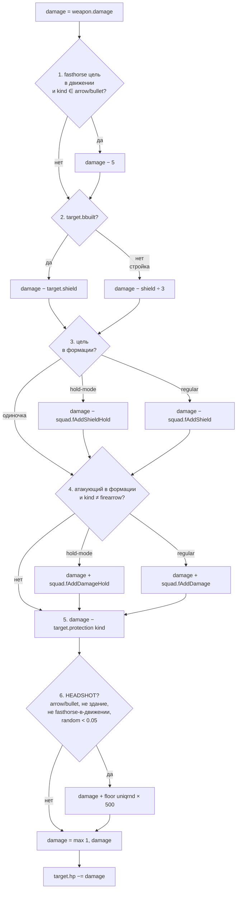

# 02. Бой и движение

[← Index](README.md)

## Содержание

**Базовые понятия**
- [Типы оружия](#типы-оружия-gc_obj_weapon_kind_)
- [uniqrnd — индивидуальное случайное число юнита](#uniqrnd--индивидуальное-случайное-число-юнита)

**Формула урона и модификаторы**
- [Формула урона (полная)](#формула-урона)
- [Свойства формулы](#свойства-формулы)
- [Хедшот — критический удар](#хедшот--критический-удар)
- [Формационные бонусы (LINE/SQUARE/KARE)](#формационные-бонусы)
- [Офицеры — роль формации и миф об ауре](#офицеры--роль-формации-и-миф-об-ауре)
- [Высокая позиция (high ground)](#высокая-позиция-high-ground)
- [AoE damage cap](#aoe-damage-cap--как-кучкование-защищает)
- [Shield /3 при недостроенном здании](#shield-3-при-недостроенном-здании)
- [Рассеяние выстрелов](#рассеяние--почему-выстрелы-промахиваются)

**Поведение стрелков**
- [Видимость и обзор (vision, FOW)](#видимость-и-обзор-vision-fow)
- [Standground / bartprepare — режимы атаки](#standground--bartprepare--режимы-атаки)
- [RunAway — автоматический отход стрелков](#runaway--автоматический-отход-стрелков)
- [Штраф к дальности при движении (standtime)](#штраф-к-дальности-при-движении)
- [Бонус к дальности в покое (addradius)](#бонус-к-дальности-в-покое)
- [Переключение оружия по дистанции](#переключение-оружия-по-дистанции)

**Специальные взаимодействия**
- [Дружественный огонь](#дружественный-огонь)
- [Захват зданий и юнитов](#захват-зданий-и-юнитов)
- [Лечение священниками](#лечение-священниками)
- [Реакция ИИ — отряд переходит в атаку от одного удара](#реакция-ии--отряд-переходит-в-атаку-от-одного-удара)
- [Score и финальный счёт](#score-и-финальный-счёт)
- [Конец партии: победа и поражение](#конец-партии-победа-и-поражение)
- [ИИ-оппонент: difficulty, build order, агрессия](#ии-оппонент-difficulty-build-order-агрессия)
- [Подтверждённые упрощения боевой формулы](#подтверждённые-упрощения-боевой-формулы)

**Сводные таблицы**
- [Скорости юнитов](#скорости-юнитов)
- [Офицеры и формации](#офицеры-и-формации)
- [Матрица контр-эффективности (приближённый TTK)](#матрица-контр-эффективности-приближённый-ttk)
- [Перекрёстная таблица: апгрейды × характеристики](#перекрёстная-таблица-апгрейды--характеристики)
- [Стоимость одного выстрела](#стоимость-одного-выстрела)

## Типы оружия (gc_obj_weapon_kind_*)

| Kind | Описание | Носители |
|---|---|---|
| `pike` | Длинное копьё/пика | Pikemen, Pikeman18 |
| `sword` | Меч/сабля | Light infantry, swordsmen, кавалерия в ближнем бою |
| `bullet` | Пуля огнестрела | Musketeer, Strelet, Janissary, Dragoon, etc. |
| `arrow` | Стрела/болт | Archer (`SHOTLU` ammo) |
| `cannonball` | Пушечное ядро | Cannon, Tower, Frigate (single shot) |
| `cannister` | Картечь | Cannon close-range, multi-cannon |

## uniqrnd — индивидуальное случайное число юнита

При спавне каждый юнит получает `uniqrnd ∈ [0..1]` ([`unit.script:2726`](file:///C:/Program%20Files%20(x86)/Steam/steamapps/common/Cossacks%203/data/scripts/lib/unit.script)). Это **зафиксированное** число, остаётся неизменным до смерти. Используется в **4 механиках одновременно**:

| # | Где применяется | Эффект |
|---:|---|---|
| 1 | Бонус хедшота | `+floor(uniqrnd × 500)` дополнительного урона при крите |
| 2 | Эффективная max range | `radiusmax -= uniqrnd × 3` тайла. Каждый стрелок стреляет чуть на разную дистанцию (асинхронные залпы) |
| 3 | Search timing | `nextSearch = now + uniqrnd × 0.15 + 0.3` сек. Юниты не сканируют синхронно |
| 4 | Multiplayer sync seed | `SetRandomKey(floor(uniqrnd × MaxInt))` для синхронизации |

Эффекты — это **компромисс**, встроенный в каждого юнита: высокий uniqrnd → большие криты, но меньшая дальность. Низкий → дальше стреляет, но слабее криты.

В C3 разработчики **специально расширили base range на +100 px** для лучников (`unit.script:999` комментарий: `// c3 added range +100 cause of uniqrnd range dispertion`) — компенсировать uniqrnd usage #2.

## Формула урона

Источник: `miscext2.script:_misc_DoDamage` (строки 274-510). Шесть последовательных шагов:



В виде псевдокода:

```
damage = weapon.damage
# 1. Anti-headshot для мобильной кавалерии
if target.usage == fasthorse AND target.is_moving AND kind in {arrow, bullet}:
    damage -= 5
# 2. Shield (одно из главных свойств танков)
damage -= target.shield if target.bbuilt else target.shield // 3
# 3. Squad shield (защита от формации цели)
damage -= squad.fAddShieldHold if hold else squad.fAddShield   # если в формации
# 4. Squad damage (бонус от формации атакующего)
damage += squad.fAddDamageHold if hold else squad.fAddDamage   # если kind != firearrow
# 5. Protection
damage -= target.protection[weapon.kind]
# 6. Headshot
if kind in {arrow, bullet} AND NOT target.bbuilding AND NOT (fasthorse_on_move) AND random < 0.05:
    damage += floor(attacker.uniqrnd * 500)
damage = max(1, damage)
target.hp -= damage
```

### Свойства формулы

- `protection` и `shield` уменьшают урон **аддитивно** (не процентно).
- **Минимум 1 хп** урона: даже если `protection > damage + bonuses`, пройдёт 1 hp.
- Shield применяется ВСЕГДА (включая поверх protection). Танки с shield эффективнее тяжёлой защиты.
- При постройке здания shield делится на 3 (см. [Shield /3 при недостроенном здании](#shield-3-при-недостроенном-здании)).
- `firearrow` (зажигательная стрела лучников) НЕ получает отрядный бонус к урону.

### Хедшот — критический удар

**5% шанс на каждый выстрел** добавить `floor(uniqrnd × 500)` урона. Где `uniqrnd` — фиксированное случайное число юнита-стрелка [0..1].

**Ключевые свойства:**

- Работает только для **arrow** и **bullet** оружия.
- НЕ работает по **зданиям**.
- НЕ работает по **light cavalry на ходу** (`usage=fasthorse + state=walk`) — у них наоборот -5 dmg штраф.
- `uniqrnd` **зафиксирован при спавне** юнита-стрелка → у каждого индивидуального мушкетера свой урон от хедшота. В отряде из 36 мушкетеров будут «снайперы» (uniqrnd≈0.9 → +450 урона) и «мазилы» (uniqrnd≈0.05 → +25 урона).
- Среднее ожидаемое: `0.05 × 250 = 12.5` дополнительного урона на выстрел (выровненный по случайным uniqrnd ~0.5).

**Пример:** мушкетер стреляет в Reiter (282 hp). Обычный урон — 6 hp. На случайном выстреле (5%) случается хедшот, и тот же мушкетер (uniqrnd≈0.252) наносит `6 + floor(0.252 × 500) = 6 + 126 = 132 hp`. Reiter падает с 282 → 150 hp.

**Почему это важно для стратегии:**

- Стрелковые отряды против Heavy Cavalry/Light Infantry статистически окупаются сильно лучше чем формула урона показывает.
- Light Cavalry **в движении** иммунна к хедшоту → основной counter к стрелковому отряду.
- C1 имел 4% шанс мгновенного убийства (комментарий в коде); в C3 механика была ребалансирована в текущий вариант. Комментарий упоминает 2%, но в реальном коде осталось `<0.05` = **5%**.

## Формационные бонусы

Источник: [`data/game/var/formations.cfg`](file:///C:/Program%20Files%20(x86)/Steam/steamapps/common/Cossacks%203/data/game/var/formations.cfg)

Юниты в строю получают **+урон / +shield** к каждому выстрелу/попаданию. В **hold-mode** (приказ «Стоять») бонусы значительно больше:

| Формация | размер | regular dmg/shield | **hold-mode dmg/shield** |
|---|---:|---:|---:|
| LINE / SQUARE / KARE | 15-196 | +2 / +2 | **+7 / +7** |
| LINE / SQUARE / KARE | **400** | **+3 / +3** | **+7 / +7** |
| Cavalry (PRUS, SHER, TRI) | любой | +1 / +1 | +1 / +1 |

**Ключевое:** мушкетер с base damage 6 → **в формации LINE в hold-mode наносит 13 урона** за выстрел (6 + 7 hold). И принимает -7 от каждого входящего попадания (поверх защиты).

**Что это значит для боя:**
- Стрелковые отряды **в hold-mode на формации** = **+117% к урону** (с 6 до 13).
- Без формации (рассыпная) — никаких бонусов.
- Кавалерийские формации (треугольник, клин) дают только +1/+1 — формация для них слабый множитель.
- **firearrow** (зажигательная стрела) НЕ получает отрядный бонус к урону.

## Офицеры — роль формации и миф об ауре

Источник: [`player.script:810-858`](file:///C:/Program%20Files%20(x86)/Steam/steamapps/common/Cossacks%203/data/scripts/lib/player.script), [`unit.script:163-164`](file:///C:/Program%20Files%20(x86)/Steam/steamapps/common/Cossacks%203/data/scripts/lib/unit.script)

**В игре НЕТ персонального бонуса-ауры от офицера.** Офицеры/барабанщики занимают слоты `maskOfficers` в формационной сетке, но в коде **нет** проверок типа `if (officer in radius) then damage += X`.

**Что реально даёт офицер:**

- Без офицера **нельзя сформировать отряд** — а без отряда нет `fAddDamage` / `fAddShield` (см. секцию [Формационные бонусы](#формационные-бонусы)).
- Офицер ходит в составе строя и держит формацию.
- При смерти офицера отряд **рассыпается** → теряет все формационные бонусы (это и есть «потеря ауры» которую ощущают игроки).

**Стратегический вывод:** **убийство офицера = убийство всех бонусов отряда**. Если в LINE-формации все мушкетеры имели +7 hold dmg / +7 hold shield — после смерти офицера это всё пропадает мгновенно. **Офицеры — снайперская цель №1.**

## Высокая позиция (high ground)

Источник: [`unit.script:5469, 7272`](file:///C:/Program%20Files%20(x86)/Steam/steamapps/common/Cossacks%203/data/scripts/lib/unit.script)

Если стрелковый юнит стоит на возвышенности (Y > 0), его **search distance** увеличивается:

```
searchdist += goHeight × 2  (только для ranged юнитов: minsearchdist > melee_radius)
```
- `goHeight` — Y-координата юнита в тайлах (высота над уровнем 0).
- Бонус **только к радиусу обнаружения** (видят дальше / открывают огонь раньше).
- Сам выстрел (`radiusmax`) технически тот же, но если враг ещё не в радиусе атаки, юнит начинает движение и выстрелит как только цель войдёт в radius. На практике **мушкетеры с холма стреляют по атакующим раньше** = больше выстрелов до ближнего боя.
- Не работает на юнитов ближнего боя (pikemen в ближнем бою остаются в нём).
- Холмы создаются параметром `relief` при генерации карты (Highlands map даёт максимум гор).

## AoE damage cap — как кучкование защищает

Источник: [`miscext2.script:_misc_DoRoundDamage:576`](file:///C:/Program%20Files%20(x86)/Steam/steamapps/common/Cossacks%203/data/scripts/lib/miscext2.script)

Взрывы (cannon, mortar, gun, grenade) попадают по всем юнитам в радиусе `r`, **но только первые N получают урон**:

```
count = floor(1 + (r / 0.35)²)
```
| Оружие | radius | максимум юнитов под взрыв |
|---|---:|---:|
| Cannon (ядро) | ~1 t | **9** |
| Mortar (бомба) | ~2 t | **33** |
| Grenade (граната) | ~0.5 t | **3** |
| Howitzer | ~1 t | **9** |

**Стратегический вывод:** **плотная толпа защищена** — 50 юнитов в одной точке теряют максимум 9 от ядра, остальные нетронуты. Растянутая линия страдает гораздо больше.

Стрелы с зажигалкой (`barrow`) имеют другую логику: урон всем в радиусе если юнитов в области <= 300; иначе только тем, кто внутри строгого `r`.

## Shield /3 при недостроенном здании

Источник: [`miscext2.script:339-342`](file:///C:/Program%20Files%20(x86)/Steam/steamapps/common/Cossacks%203/data/scripts/lib/miscext2.script)

При расчёте урона: если здание **ещё строится** (`bbuilt=False`), его shield делится на 3:

```
if (target.bbuilt):  damage -= shield        # достроено: полный shield
else:                 damage -= shield // 3   # стройка: 1/3 shield
```
**Стратегический смысл:** **сноси здания пока они строятся**. Например, башня на стройке имеет shield ~33 (вместо 100), и каждый удар по ней проходит почти полностью. Контр-стройка (атака на возводимое здание противника) гораздо эффективнее чем атака готового.

Касается ТОЛЬКО зданий — юниты не имеют состояния «строится».

## Рассеяние — почему выстрелы промахиваются

Источник: [`weapon.script:_weapon_CalcShotDispertion:625`](file:///C:/Program%20Files%20(x86)/Steam/steamapps/common/Cossacks%203/data/scripts/lib/weapon.script)

При каждом выстреле снаряд **рассеивается** относительно цели:

```
maxdisp = dist × disp × 0.0267   # в тайлах
shot_x = target_x + (1 - random*2) × maxdisp
shot_z = target_z + (1 - random*2) × maxdisp
```
Где `dist` — дистанция до цели (тайлы), `disp` — `weapon.dispertion` (тайлы, после _misc_PixelsToTiles). **Чем дальше — тем больше рассеяние** (линейно).

**Базовые значения dispertion** (из unit.script):
| Оружие | dispertion (px / tiles) | На 15 t отклонение |
|---|---:|---:|
| Strelet (SHOTMUSKET, base) | 200 / 3.75 | **±1.50 t** |
| Archer (STRELA) | 175 / 3.28 | ±1.31 t |
| Archer (OSTRELA fire) | 200 / 3.75 | ±1.50 t |
| Musketeer base | 250 / 4.69 | ±1.88 t |
| Cannon (PPOINTT) | ~250 / 4.69 | ±1.88 t |
| Tower (PPOINTTTOW) | ~100 / 1.88 | ±0.75 t |
| Yacht/galley (PPOINTTKOR) | 25 / 0.47 | ±0.19 t |

**Шанс попасть в юнит размером 1×1 t** на дистанции d:

- Если 2×maxdisp ≤ 1 → ~100% попадание
- Если 2×maxdisp > 1 → шанс ≈ 1 / (2×maxdisp) попасть точно в нужный квадрат

Пример: мушкетер (disp=3.75) на 15 t → maxdisp=1.50, окно ±1.50 = 3.00 → шанс попасть в 1×1 цель ≈ 1/3 = **~33%** одним выстрелом. Это означает что **TTK в матрице контр-эффективности ниже реального в 3 раза для дальних пуль/стрел**.

**Апгрейды dispertion** — только для **артиллерии**:
- `aca.20` (Research new sighting devices for artillery): **-35% dispersion**
- `aca.27` (Develop mathematics): **-35% dispersion** (накапливается с aca.20)
- ⚠ Для **мушкетеров и лучников** прямого dispersion-апгрейда нет.

## Видимость и обзор (vision, FOW)

Источник: [`unit.script:11565-11620`](file:///C:/Program%20Files%20(x86)/Steam/steamapps/common/Cossacks%203/data/scripts/lib/unit.script) (`_unit_GetVision`), [`player.script:475`](file:///C:/Program%20Files%20(x86)/Steam/steamapps/common/Cossacks%203/data/scripts/lib/player.script) (`SetFOWDovFunc`).

В Cossacks 3 у каждого юнита есть **два разных** радиуса «осведомлённости», и их легко спутать:

| Радиус | Что это | Где хранится | В чём измеряется |
|---|---|---|---|
| **vision** | Радиус снятия тумана войны (FOW). Сколько тайлов открыто владельцу юнита. | `objprop.vision` (целое 0..8) | Тайлы по формуле `floor(20 + 4 × vision)` |
| **searchradius** | Радиус обнаружения цели для авто-атаки (используется в `bartprepare`, `_unit_SearchTarget`). Юнит **не атакует** врага вне этого круга, даже если видит его. | `weapon.radiusmax` | Пиксели (`gc_pixels_to_tile = 53.333`) |

**Vision всегда больше searchradius** — юнит замечает врага раньше, чем способен взять его как цель.

### Формула vision

```
real_vision_radius_tiles = 20 + 4 × vision
```

| `vision` | tiles | Типичный носитель |
|---:|---:|---|
| 0 | 20 | Default (минимум) — пустая башня, шахта |
| 1 | 24 | Большинство пехоты, артиллерия, городская башня без апгрейдов |
| 2 | 28 | Лёгкая пехота, мушкетеры, средняя кавалерия |
| 3 | 32 | Драгуны, башня после апгрейда, паром |
| 4 | 36 | `pearus`, `peaukr`, разведывательная кавалерия |
| 5 | 40 | `hussarpru`, `dragoon18pie` |
| 7 | **48** | `hetman` (Гетьман — лучший обзор у тяжёлой кавалерии) |
| 8 | **52** | `drummer` / `bagpiper` / корабли (Линейный корабль / Фрегат) |

### Лучшие разведчики

- **Барабанщик / Волынщик** — `vision=8` (52 t), `searchradius=0` (не атакует). Чистый разведчик, бесплатный (выходит из казармы как сопровождение). Ходит за армией.
- **Линейный корабль / Фрегат** — `vision=8` для морского патрулирования. Видит дальше, чем стреляет (дальность ядра около 31-37 t).
- **Гетьман** (Украина) — `vision=7` (48 t), уникален для своей нации. Лучший наземный разведчик.

### Стратегические следствия

- Одного `vision`-круга стрелка в standground для разведки недостаточно — впереди нужен юнит с большим обзором (барабанщик, гусар).
- **Vision не прокачивается** — апгрейдов вида `+vision` или `visionperc` в академии/кузнице нет. Единственный способ улучшить обзор — поставить более «зоркий» юнит.
- Башня даёт `vision=1` (24 t), что меньше обзора кавалерии. Башня хороша как стационарный пост, но плохо как разведка.
- **Мортира / Супермортира** имеют `vision=1` и `searchradius=0` — для самозащиты они слепы, без сопровождения цели не обнаруживают.

Полная таблица per-unit — в [`reports/combat/vision_radii.md`](../reports/combat/vision_radii.md).

## Standground / bartprepare — режимы атаки

Источник: [`unit.script:7259-7286`](file:///C:/Program%20Files%20(x86)/Steam/steamapps/common/Cossacks%203/data/scripts/lib/unit.script), [`player.script:2456-2463`](file:///C:/Program%20Files%20(x86)/Steam/steamapps/common/Cossacks%203/data/scripts/lib/player.script)

**Ключевой механизм:** дальность авто-обнаружения врага (`maxsearchdist`) **радикально различается** в режимах standground и обычном:

```
if (bstandground AND order != move):
    maxsearchdist := MIN(searchradius, GetMaxAttackRadius)   # полная дальность оружия
else:
    maxsearchdist := minsearchdist + 0.375                    # почти melee (!)
```
**Что это значит на практике:**

- **Без standground** мушкетер (radiusmax≈9 t) обнаруживает врага только когда тот входит в **0.375 t от minsearchdist** — то есть подходит вплотную. Получается **1-2 выстрела** и сразу ближний бой. Это объясняет почему стрелковые юниты «стоят и не стреляют» по дальним целям.
- **С standground** обнаружение работает на полную `searchradius` (1500-2400 px ≈ 28-45 t). Мушкетер стреляет по любому врагу в радиусе обзора — успевает 5-10 выстрелов до ближнего боя.
- **Standground также отключает RunAway** (см. ниже): юнит держит позицию, не пытается отступать.
- **Приказ движения стирает standground**: если юниту приказали идти куда-то, он не стреляет даже если bstandground=True (см. условие `order != move` в коде).

**bartprepare** (artillery preparation) — флаг для **артиллерии, башен и портов**. Установлен на `cannon`, `howitzer`, `framegun`, `multicannon`, `tow` (towers), `port` (shipyards). При получении `attackpoint`-приказа (по площади) такие юниты:

- Принудительно выключают `bstandground` → переходят в обычный режим обнаружения
- Принудительно включают `bsearchenemy` → активно сканируют цели вокруг точки
- Получают приказ `attackpoint(trgx, trgz)` с задержкой подготовки (`attackdelay/attackmaxdelay`)

**Стратегические выводы:**

- **Всегда ставь стрелков в standground** при обороне или подготовленной засаде. Без него мушкетеры сделают 1-2 выстрела вместо 5-10.
- **При продвижении** (`bstandground=False`) стрелки отходят (RunAway) — это иногда плюс (не дают подойти), иногда минус (тормозят свой же штурм).
- **Артиллерию лучше отдавать командой attackpoint** (Ctrl+ЛКМ) — `bartprepare` правильно настраивает режимы. Если просто переместить пушку и ждать — она в режиме движения НЕ откроет огонь.

## RunAway — автоматический отход стрелков

Источник: [`unit.script:7363-7369`](file:///C:/Program%20Files%20(x86)/Steam/steamapps/common/Cossacks%203/data/scripts/lib/unit.script)

Если у стрелкового юнита (`minsearchdist > 0`, т.е. min range > 0) враг входит в **мёртвую зону** (между 0 и `minsearchdist`), юнит автоматически отступает:

```
if (cell_search_found_no_target AND враг_в_minsearchdist):
    if (NOT bstandground)
       AND (standtime=0 OR standtime > gc_unit_runawaydelay (1.3 sec)
            OR (player_is_human AND difficulty <= normal)):
        DoRunAway(toward_safe_direction, distance=gc_unit_runawaydist (3.5 t))
```
**Условия отступления (все должны выполниться):**

- Юнит **не в standground**.
- Юнит либо только что подошёл (`standtime=0`), либо стоит уже >1.3 сек, либо игрок-человек на easy/normal сложности (поблажка для новичков).
- Враг — в `minsearchdist` зоне.

**Эффект:** стрелок отступает на 3.5 тайла от врага, пытаясь восстановить дистанцию для выстрела. Это создаёт классический **паттерн отхода** мушкетеров: подошёл → стрельнул → отступил → стрельнул.

**Когда RunAway ВЫКЛЮЧЕН:**

- В `standground` (явный приказ держать позицию).
- ИИ-противник на hard+ — продолжает стрелять до самого ближнего боя, не отступает (опасный нюанс).
- При сложности hard+ игрок-человек: ИИ отходит как обычно, но игрок-человек на hard+ тоже не получает поблажку RunAway.

**Стратегические выводы:**

- Для отступательной тактики (отход с обстрелом) — **сними standground** и работай по уязвимой кавалерии/пехоте.
- Для удержания позиции (например, на холме) — **standground обязателен**, иначе мушкетеры разбегутся при подходе ближнего боя.
- Лёгкая кавалерия может **догнать отходящих мушкетеров** (fasthorse=96 против default=32 → ~3× быстрее).

## Штраф к дальности при движении

Источник: [`unit.script:8011-8023`](file:///C:/Program%20Files%20(x86)/Steam/steamapps/common/Cossacks%203/data/scripts/lib/unit.script), константа `gc_obj_maxattackradiusdisp = 3` (`dmscript.global:116`)

Юнит, который только что двигался (`standtime < 0.25 sec`), теряет в дальности:

```
if (standtime < 0.25) AND (weapon.kind != cannister):
    if (NOT bArtillery):
        radiusmax -= 3 × uniqrnd          # пехота: до -3 тайла
    else:
        radiusmax -= 3 × uniqrnd × 0.5    # артиллерия: до -1.5 тайла
```
**uniqrnd** — индивидуальный коэффициент юнита (см. секцию [uniqrnd](#uniqrnd--индивидуальное-случайное-число-юнита)) ∈ [0..1]. Так что у разных стрелков в отряде штраф разный: «снайперы» (низкий uniqrnd) теряют меньше, «мазилы» (высокий uniqrnd) — почти весь штраф.

**Стратегические выводы:**

- **Стрелок в движении не выстрелит на полную дальность** — нужно ~0.25 сек постоять. Это объясняет почему мушкетеры «промахиваются» по дальним целям при подходе.
- **Картечь не штрафуется** — пушка может бить картечью даже на ходу (но в реальности пушка `bartillery` всё равно `bstandground=True` по умолчанию).
- **Артиллерия штрафуется в 2 раза меньше** — мортира/пушка после короткого movement готова стрелять почти на полную дальность.
- В сочетании с RunAway создаёт **отход — пауза — выстрел**: мушкетер отбежал на 3.5 t, ждёт 0.25 сек чтобы вернуть полную дальность, стреляет, и снова отходит.

## Бонус к дальности в покое

Источник: [`unit.script:8026-8028`](file:///C:/Program%20Files%20(x86)/Steam/steamapps/common/Cossacks%203/data/scripts/lib/unit.script)

Если юнит в состоянии **idle** (флаг `gc_statetag_move_idle`), он получает бонус к дальности:

```
rbonus += weapon[i].addradius   # обычно _misc_PixelsToTiles(32) = ~0.6 тайла
```
**Кому даётся:** мушкетерам, лучникам, пушкам — у всех `addradius = 32 px = 0.6 t`. Для слабых стен (`gc_obj_usage_weakwall`) — дополнительно **+0.36 тайла** rbonus.

**Эффект:** стационарная защита (например, гарнизон на холме в standground) стреляет на **~0.6 t дальше** чем тот же отряд в движении. Мелочь, но в сочетании с high-ground (см. выше) и устранением movement penalty получается заметный буст эффективной дальности обороны.

## Переключение оружия по дистанции

Источник: [`unit.script:_unit_GetWeaponToAttackIndex:6376-6451`](file:///C:/Program%20Files%20(x86)/Steam/steamapps/common/Cossacks%203/data/scripts/lib/unit.script)

Многие юниты имеют **несколько слотов оружия** (`weapon[0]`, `weapon[1]`, ...). Игра автоматически выбирает нужный слот по дистанции до цели — каждое оружие имеет `radiusmin..radiusmax`. Если враг вошёл в близкий диапазон — выбирается оружие с маленьким `radiusmin`, иначе — дальнее.

Дополнительно учитывается `attmask`: если у цели `mmask` совпадает с `weapon[i].attmask` (материал брони), это оружие приоритетнее. Поэтому fire arrows выбираются для построек (их attmask содержит `gc_obj_material_building`).

**Пары multi-weapon юнитов:**

**1. Cannon (пушка) — ядро против картечи:**

| Слот | Тип | dmg | Pause | Range (px) | Когда стреляет |
|---|---|---:|---:|---|---|
| `weapon[0]` PPOINTT | cannonball (ядро) | 1800 | 350 | **550-2160** | дистанция ≥ 550 px (~10.3 t) |
| `weapon[1]` PSMPOINTTPUS | cannister (картечь) | AoE по `gWeapons[]` | 350 | **0-450** | враг ближе 450 px (~8.4 t) |

**Это значит:** если пехота подошла на ~8 тайлов к пушке — она автоматически переходит в картечный режим. **Картечь — массовый урон по толпе** (AoE). Поэтому гасить пушку «навалом пехоты» = получить картечь в упор. **Атаковать пушку нужно растянутой линией** (не больше 9 в радиусе AoE — см. AoE damage cap).

**2. Musketeer 18c — пуля против штыка (bayonet):**

| Слот | Тип | dmg | Pause | Range (px) | Когда стреляет |
|---|---|---:|---:|---|---|
| `weapon[0]` (bayonet) | pike | 5-10 (по нации) | **0** (мгновенно) | **35-65** (~0.66-1.22 t) | в упор |
| `weapon[1]` SHOTMUSKET | bullet | 16-29 (по нации) | 140-190 | **400-900** (~7.5-16.9 t) | дальше 7.5 t |

**Стратегический смысл:** мушкетер после выстрела не беспомощен в ближнем бою — у него **штык** с pause=0 (бьёт каждый цикл анимации). Атаковать перезаряжающихся мушкетеров кавалерией = получить штыковой бой. Прусские мушкетеры (dmg штыка 10) сильнее в ближнем бою чем баварские (5).

**Прокачки штыка** идут отдельно от прокачек пули — `bla.musketeer18.1.X` качает урон bullet, штык остаётся базовый.

**3. Archer — обычная стрела против огненной (firearrow):**

| Слот | Тип | dmg | Pause | Range (px) | Dispertion | Особенности |
|---|---|---:|---:|---|---:|---|
| `weapon[0]` STRELA | arrow | 15 | 75 | 400-800 | 175 px | основная стрельба |
| `weapon[1]` OSTRELA | firearrow | **150** | 125 | 400-600 | 200 px | attmask = building+wood+woodwall |

**Огненные стрелы — оружие лучников против построек.** Урон 150 (×10 от обычной), но: ниже скорострельность (-40%), хуже точность (+14% дисп.), не получают **отрядный бонус к урону** (см. секцию Хедшот/Формула урона). Игра автоматически переключает лучника на OSTRELA когда цель — здание/wood/палисад. **Лучники — лучший анти-билдинг стрелковый юнит** (если успевают подойти).

**4. Другие multi-weapon юниты** (поищи `weapon[1]` в их sid):

- **Янычар (jannisary)** — пуля + сабля ближнего боя.
- **Стрелец** — пищаль + бердыш ближнего боя.
- **Егерь / драгун** — пуля + сабля.
- **Конные стрелки** (drabant, конный стрелец) — пуля + сабля верхом.

Во всех случаях работа одинакова: близко — оружие ближнего боя, далеко — стрелковое. **Разница перезарядок:** например мушкетер перезаряжается 150 кадров пулю и 0 штык — значит **сразу после выстрела** может ткнуть штыком если враг близко (а потом перезарядка пули продолжится в фоне).

## Дружественный огонь

Источник: [`miscext2.script:_misc_DoDamage:274`](file:///C:/Program%20Files%20(x86)/Steam/steamapps/common/Cossacks%203/data/scripts/lib/miscext2.script), [`weapon.script:482-492`](file:///C:/Program%20Files%20(x86)/Steam/steamapps/common/Cossacks%203/data/scripts/lib/weapon.script), [`unit.script:7686-7714`](file:///C:/Program%20Files%20(x86)/Steam/steamapps/common/Cossacks%203/data/scripts/lib/unit.script)

**Дружественный огонь ВКЛЮЧЁН для большинства снарядов.** В функции `_misc_DoDamage` **нет проверки на сторону/владельца** — урон применяется к любому объекту, попавшему под траекторию.

**Что попадает по своим:**

- Стрелы лучников (`STRELA`, `OSTRELA` fire arrows)
- Пули мушкетов (`SHOTMUSKET`)
- Гранаты (`NUCLGRE`)
- Артиллерия (`PSMPOINTTPUS`, `DIMMORT1`, `DIMMORT2NEW`, `PSMPOINTT`, `DIMMORT2KOR`)
- AoE взрывы (картечь, ядра, бомбы) — поражают **всё в радиусе**, включая своих (`_misc_DoRoundDamage` без фильтра по стороне).

**Что НЕ ранит союзников:**

- **Корабли** — есть отдельная защита `// prevent ships from friendly fire` в weapon.script. Торговцы и боевые корабли одного игрока не топят друг друга.
- Башни и пушки с `bcheckfriendonline=True` (по умолчанию ON) — **не выстрелят, если на линии огня стоит дружественное здание** (см. `_misc_IsBuildingInRay`). Но это про блокировку выстрела, а не про урон при пролёте.

**Список оружия с явно ОТКЛЮЧЁННОЙ проверкой `bcheckfriendonline`** (стреляют сквозь свои здания, не блокируются):

`STRELA`, `OSTRELA`, `SHOTMUSKET`, `SHOTBLOCKHOUSE`, `NUCLGRE`, `PSMPOINTTPUS`, `DIMMORT1`, `DIMMORT2NEW`, `PSMPOINTT`, `DIMMORT2KOR` — то есть **все стрелы, мушкетные пули и почти вся артиллерия**.

**Стратегические выводы:**

- **Не ставь свою пехоту на линию огня артиллерии** — ядро/бомба прошьёт строй и взорвётся среди своих.
- **Лучники и мушкетеры стреляют сквозь свои ряды** — стой во второй линии без проблем, но **бомба в массу твоих юнитов = твои потери**.
- **Башни без прямой линии огня** через здания не выстрелят (если их weapon `bcheckfriendonline=True`), но снаряд при выстреле уже не различает свой/чужой.

## Захват зданий и юнитов

Полный псевдокод и список всех `bcapture/bcancapture/bprotector` флагов — в [`recon/capture_mechanics.md`](../recon/capture_mechanics.md). Здесь — суть.

Источник: [`miscext.script:961-1185`](file:///C:/Program%20Files%20(x86)/Steam/steamapps/common/Cossacks%203/data/scripts/lib/miscext.script) (`_misc_CheckCapture`).

### Геометрический триггер, а не «5% шанс»

Захват — не случайная попытка во время атаки. Каждые **1.9 g-сек** (для зданий и крестьян) или **0.5 g-сек** (для артиллерии) каждый объект-кандидат на захват проверяет своё окружение:

```
1. Найти любого вражеского юнита с bcancapture=True в евкл. радиусе captureradius (4.013 t)
   от центра объекта. Нашли — bcapture := True.
2. Проверить защитников: любой свой не-bcapture юнит в радиусе protectionradius (≈8 t)
   отменяет захват. Достаточно одного.
3. Если bcapture остался True → _misc_ChangePlayer (мгновенно, со всем гарнизоном внутри).
```

**Время до захвата = 0** (срабатывает в тот же тик). То, что игрок воспринимает как «время на захват», — это пауза между тиками проверки, до 1.9 сек.

### Кого можно захватить (`bcapture=True`)

**Юниты:**

- **Все крестьяне** всех 8 sid'ов (`peaaus`/`peatur`/`pearus`/`peapol`/`peaspa`/`peaeng`/`peaukr`/`peasco`) — `bcapture=True` ([unit.script:1199](file:///C:/Program%20Files%20(x86)/Steam/steamapps/common/Cossacks%203/data/scripts/lib/unit.script)). _Раньше в этом справочнике говорилось, что украинский и шотландский Крестьянин не захватываются — это **ошибка**, флаг у них тоже True._
- **Артиллерия** — `cannon`, `howitzer`, `mortar`, `multicannon`, `framegun`. Проверяется в **4× чаще** (0.5 g-сек), поэтому теряется почти мгновенно при подходе кавалерии.

**Здания (захватываются — меняют владельца):** Городской центр, Казарма (17/18 в.), Кузница, Склад, Мельница, Шахты (золото/железо/уголь).

**Здания (захватываются — разрушаются `bDie:=True`):** Стены и Каменные ворота (захват их просто ломает), а также любые здания на стадии постройки, независимо от типа.

### Кого захватить **нельзя** (`bcapture=False`)

| Тип | Что произойдёт при попытке |
|---|---|
| **Башни** (`tow`) после постройки | На захват вообще не проверяются. Только снос. |
| **Стены / Каменные ворота** | Захват = `bDie:=True` (объект просто умирает). |
| Академия, Конюшня, Дипломатический центр, Порт | Только снос. |
| Пехота, кавалерия, корабли | Только убийство. |

⚠️ **Недостроенное здание** проверяется на захват **всегда**, даже Башня. Если враг подойдёт к стройке, здание сменит хозяина. Как только постройка завершена — `bcapture=False` отключает проверку.

### Кто может захватывать (`bcancapture=True`)

`bcancapture := (not bcapture) and (usage <> peasant)` — то есть любой юнит, не являющийся крестьянином и сам не захватываемый. Вся пехота и кавалерия (кроме крестьян) — да; артиллерия — нет (она сама `bcapture=True`). Капелланы, барабанщики, офицеры — да (у них `bcapture=False` и usage не peasant).

### Радиусы (точные значения)

| Радиус | px | tiles | Метрика | Что значит |
|---|---:|---:|---|---|
| `captureradius` | 214 | **4.013** | Euclidean²(центр-к-центру) | внутри — захватчик может схватить объект |
| `captureblockshotradius` | 160 | 3.0 | Euclidean² | внутри — жертва не может стрелять (≈3.125 g-сек) |
| `protectionradius` | 426 | ≈7.99 | Euclidean² | один свой не-bcapture здесь — захват отменяется |

Footprint здания **не учитывается** — берётся одна `(x, y)`-точка-якорь объекта. Поэтому крупные здания (Городской центр ≈ 5×4) на практике защищены своими размерами: захватчик должен дойти до **центра**, а не до стенки.

### Настройки карты (`gMap.settings.additional.capture`)

| Режим | Поведение |
|---|---|
| `capture_default = 0` | Захват разрешён всем |
| `capture_nopeasants = 1` | **По умолчанию в DM и Historical Battle.** Крестьян захватить нельзя. |
| `capture_nocenterspeasants = 2` | Нельзя захватить ни крестьян, ни Городской центр |
| `capture_onlyartillery = 3` | Захвату поддаётся только артиллерия |

То есть в стандартном Deathmatch крестьяне **не захватываются** (только убиваются). Захват крестьянина возможен лишь в скирмише при ручной настройке `capture_default`. Все опции лобби (`peacetime`, `marketdip`, `century18` и др.) — таблицы в [`docs/reports/map/lobby_settings.md`](../reports/map/lobby_settings.md), поведение движка — в [`docs/recon/game_settings.md`](../recon/game_settings.md).

### ИИ-захватчик: 75% шанс снести вместо захвата

Если захватчик — ИИ, он с шансом **75%** выставляет зданию `bDie:=True` вместо смены владельца. Это и объясняет, почему ИИ часто «таранит» базу, а не забирает сооружения себе. У захваченной ИИ артиллерии тоже есть шанс самоуничтожения, зависящий от типа: Мортира 86%, Пушка 61%, Супермортира 41% (формулы — в recon).

### Конверсии нет

Капеллан в Cossacks 3 — только лекарь через «отрицательный урон». Никакой конверсии в духе AoE2 в скриптах нет. См. recon §7.

### Стратегические выводы

- **Защищай артиллерию пехотой** — без защитника в 8-тайловом радиусе любой рейд кавалерии отнимет Пушку за 0.5 g-сек.
- **Башни не захватываются** — снести их можно только осадой. Но недостроенная Башня — лёгкая добыча.
- **Стены — расходник.** Захват стены означает её смерть. Стена с просевшим до трети HP не активирует protector-логику для соседнего здания.
- **ИИ «таранит» вашу базу** — с 75% вероятностью он разрушает захваченные здания. Не ждите, что компьютер оставит ваш Склад себе.

## Лечение священниками

Источник: [`unit.script:1151-1188`](file:///C:/Program%20Files%20(x86)/Steam/steamapps/common/Cossacks%203/data/scripts/lib/unit.script), формула в [`miscext2.script:371-398`](file:///C:/Program%20Files%20(x86)/Steam/steamapps/common/Cossacks%203/data/scripts/lib/miscext2.script)

Священники (`priest`, `pope`, `mullah`, `padre`) лечат союзных юнитов. Используют псевдо-оружие `gc_obj_weapon_kind_heal`. Формула:

```
target.hp += weapon.damage      # БЕЗ shield, БЕЗ protection!
target.hp = min(target.hp, target.maxhp)
```
**Heal pause = 0** — лечат каждый цикл анимации (~0.7 сек), пока цель не полное HP.

| Юнит | heal/удар | дальн. (px / tiles) | Где доступен |
|---|---:|---|---|
| Priest | 20 | 0-400 / 7.5 t | большинство европейских наций |
| Pope | 25 | 0-350 / 6.6 t | Папская область / Венеция |
| Mullah | 15 | 0-500 / **9.4 t** | Турция / Алжир (самый дальний heal) |
| Padre | 30 | 0-400 / 7.5 t | Испания / Португалия (самый сильный heal) |

**Стратегические выводы:**

- **Heal игнорирует броню** — лечит на полное значение независимо от того, кто-кого защитного.
- **Несколько священников лечат одну цель параллельно** — рейтер с 282 HP лечится 4 священниками = +80 HP/цикл = ~115 HP/сек. Можно держать тяжёлую кавалерию вечно.
- **Mullah имеет самую большую дальность** (9.4 t) — лечит из второй линии, недосягаем для ближнего боя.
- **Padre самый эффективный** (30/удар) — испанско-португальская армия очень живуча.
- Священники сами **уязвимы** (низкий HP, нет брони) — приоритетная цель для рейдов.

## Реакция ИИ — отряд переходит в атаку от одного удара

Источник: [`miscext2.script:406-417`](file:///C:/Program%20Files%20(x86)/Steam/steamapps/common/Cossacks%203/data/scripts/lib/miscext2.script)

Любой не-артиллерийский юнит ИИ, **получивший урон**, переключает свой отряд (`squad`) в `fAgressive=True` и обновляет `fLastBattleTime`.

**Эффект:** один поражающий выстрел/удар по отряду ИИ переводит его в боевой режим. ИИ начинает контратаковать, преследовать, искать врага активно.

**Стратегические выводы:**

- **Поклёвывание ИИ** (один лучник в крестьянина) **активирует реакцию всего отряда ИИ**. Может быть полезно: отвлекаешь лучником, основная сила атакует с другой стороны.
- ИИ на артиллерии (пушки/мортиры) — НЕ переключается (особый случай в коде).
- Если хочешь скрытно собрать ресурсы рядом с ИИ — **не атакуй вообще**, иначе вся армия зашевелится.

## Score и финальный счёт

Источник: [`miscext2.script:443-461`](file:///C:/Program%20Files%20(x86)/Steam/steamapps/common/Cossacks%203/data/scripts/lib/miscext2.script), [`unit.script:3836-3950`](file:///C:/Program%20Files%20(x86)/Steam/steamapps/common/Cossacks%203/data/scripts/lib/unit.script). Полный разбор — в [`recon/victory_conditions.md`](../recon/victory_conditions.md) §5.

Каждый объект (`TObjProp.score`) имеет базовое число очков (Крестьянин = 10, Городской центр = 1000 и т.д.). Все события прибавляют или вычитают `target.score × множитель`:

| Событие | Множитель | Источник |
|---|---:|---|
| Произведён свой юнит / построено здание | **+1×** | unit.script:3836 |
| Убит враг | **+2×** | miscext2.script:447 |
| Убит вражеский юнит в гарнизоне здания | **+3×** | miscext2.script:451 |
| Захвачен чужой объект | **+5×** | unit.script:3837 |
| Свой юнит / здание погибли | **−2×** | unit.script:3947 |
| Погиб юнит-наёмник, ушедший в Rebellion | **−3×** | unit.script:3948 |
| Свой юнит / здание были захвачены врагом | **−5×** | unit.script:3946 |

**Score не уходит в минус** (clamp `≥0`, `unit.script:3950`). Снимок счёта пишется каждые 5 g-сек в `gPlayer[i].stat.scores.Add(...)` для итогового графика.

⚠️ **Score не определяет победу.** `_misc_CheckEndGame` смотрит только на «кто остался в живых», а Score нужен для статистики и достижений. Подробнее — в секции ниже.

## Конец партии: победа и поражение

Источник: [`miscext2.script:3770`](file:///C:/Program%20Files%20(x86)/Steam/steamapps/common/Cossacks%203/data/scripts/lib/miscext2.script) (`_misc_CheckEndGame`), [`progress.inc:54-140`](file:///C:/Program%20Files%20(x86)/Steam/steamapps/common/Cossacks%203/data/scripts/units/global.inc/progress.inc) (defeat). Полная картина — в [`recon/victory_conditions.md`](../recon/victory_conditions.md).

### Условие победы (по умолчанию)

**Last team standing.** Игроки одной команды (поле `gPlayer[i].team` из лобби) выигрывают, как только у всех игроков других команд `not bexists or bleave`. Если на старте присутствует только одна команда — никто не побеждает (sandbox / freebuild).

### Условие поражения (по умолчанию)

**`farmused == 0`** И нет ни одного крестьянина или Городского центра в собственности. Проверка идёт раз в `gc_global_TimeCheckExists × 4..12` g-сек на player tick'е. Детали:

- Пока есть хотя бы один крестьянин **или** хотя бы один Городской центр — игрок жив.
- Проверка работает **независимо от наличия армии**. Можно сидеть с одним крестьянином и одной Мельницей и не проигрывать.
- Когда `bexists` становится False, движок добивает оставшиеся юниты (`_misc_KillPlayerUnits`) и ставит `victorystate=lose`.

### Surrender (сдача)

Кнопка «Surrender» в интерфейсе вызывает `_misc_Surrender` → `bleave:=True` + `victorystate=lose` + триггер `_misc_CheckEndGame`. Чат-команды `/resign` нет, только кнопка из меню.

В rated-играх игрок, первым сдавшийся в первые **15 минут**, получает штраф **−w ELO** (`w=1` для rated, `w=2` для casual). Напарника в 2×2 не штрафуют.

### Механики, ожидаемые из других RTS, но в C3 отсутствующие

- **Wonder of the World.** В отличие от AoE2, здания-таймера победы в C3 нет (поиск `wonder|monument` по скриптам ничего не находит).
- **Победа по очкам.** Score копится исключительно для статистики и в условие победы не входит.
- **Time-limit.** Партия не заканчивается по таймеру. Есть только время мира (запрет атаки в первые N минут — таблица в [`reports/map/lobby_settings.md`](../reports/map/lobby_settings.md#peacetime--время-мира), механика в [`recon/game_settings.md`](../recon/game_settings.md#peacetime--как-устроен-мир)) и pause-limit (4 × 120 секунд).
- **Дипломатическая победа.** Команды статично заданы лобби, в рантайме не меняются.

### Game modes

| Режим | Особенность |
|---|---|
| **Random map / skirmish** | Стандарт. Условие поражения по умолчанию (`farmused==0`) активно. |
| **Historical Battle** (`gMap.bbattle=True`) | Условие поражения по умолчанию **отключено**. Завершение только по сценарию или по сдаче. |
| **Campaign / Scenario** | Триггер-действия `endgame_win=47` и `endgame_lose=48` (на каждом клиенте, по `myplind`). |
| **Rated MP** (`gMap.brating=True`) | Вес ELO = 1 (против 2 в casual). В casual короче 10 мин результат не идёт в leaderboard. |
| **Editor / Spectator / Replay** | Режимы только для просмотра, без вмешательства. |

## ИИ-оппонент: difficulty, build order, агрессия

Источник: `lib/ai.script` + `progresseconomicai.inc` + `progresswarai.inc`. Полный разбор — в [`recon/ai_behavior.md`](../recon/ai_behavior.md).

ИИ работает как обычный игрок (никаких просмотров сквозь туман войны, никакой подкормки ресурсами). Тикает каждые **2.4 g-сек**, чередуя экономику и войну.

### Сложность = гандикап по скорости постройки

Главное (и почти единственное) различие между уровнями ИИ — множитель прогресса постройки и найма:

| Сложность | `deltabuildtime ×` | Эффект |
|---|---:|---|
| Easy | **0.30** | ИИ в 3.33× медленнее человека |
| Normal | 0.50 | в 2× медленнее |
| Hard | 0.75 | в 1.33× медленнее |
| Very hard | **1.00** | паритет с игроком |
| Impossible | **1.25** | на 25% быстрее (доступен только в Historical Battle) |

⚠️ **Стартовые ресурсы у ИИ совпадают с игроком** на любом уровне (1000/4000/5000/1М, в зависимости от `resourcestart`). Чита по ресурсам, обзору или скорости движения в скриптах не найдено.

Прочие различия по уровням (мелкие):

- На **Easy** ИИ не исследует `bricks1`, `fort`, `armor1`, `accurency1`, `artlife` и не строит Гаубицу с Мортирой.
- Башни ИИ прокачивает максимум до уровня 2/3/4/5/5 (easy/normal/hard/veryhard/impossible).
- Параллельных диверсионных армий: 0/0/2/4/4.
- Прокачки атаки/защиты Шахт: cap-уровень 0/2/3/?/7.

### Build order

ИИ работает по правилам, а не по фиксированному списку. Каждый AI-tick запускает длинную цепочку `_ai_TryUnit(..., target_count, ...)` с условиями вида «если Городских центров ≥2 и Казарм ≥2 — строить Академию».

Макро-фазы (огрублённо):

1. Городской центр → Рынок → Мельница → Шахты.
2. Кузница.
3. **Казарма 17 в.** (target 1→2→3→6/8 в зависимости от количества центров и нации; у Руси cap 6 на «миллионных» картах).
4. Расширение центров (до 5 при ≥2).
5. Академия (когда ≥2 Казармы 17 в. и ≥2 Городских центров).
6. Конюшня / Артиллерийское депо / Дипломатический центр / Собор — после Академии.
7. **Казарма 18 в.** — после Академии и `gc_ai_upg_century`.
8. Башни — `min(3, peasants ÷ 75)`, при `difficulty>easy`.

Build-order сильно зависит от нации: для каждого `cid` (24 нации) свои ветки. Россия идёт с урезанным количеством Казарм, Украина выкатывает массу musk17 в обход officer-цепочки, Алжир и Турция отдают предпочтение лучникам через Академию.

### Production targets

| Цель | Формула |
|---|---|
| Крестьяне | `centers × 2`, cap **400 всего** или **30 на нацию** |
| Офицеры | `pikemen ÷ 36` (минимум 1, если pikemen>28) |
| Рейтары | `stable_count × 2` |
| Пехота 17 в. (target) | `ba17_count × 2` |
| Пехота 18 в. | `ba18_count × 2` |
| Пушки | `clamp(art_depo × 6, 6, 30)` |
| Гаубицы | `clamp(art_depo × 2, 2, 8)` |
| Мортиры | `clamp(art_depo × 8, 8, 40)` |

Когда `pikemen ≥ 36×7 + gc_ai_max_guards (120)`, ИИ переключается на найм только musk17.

### Агрессия

| Параметр | Значение | Что значит |
|---|---:|---|
| `gc_ai_AgressorsCount` | 5 | количество squads в первой aggressor-волне |
| `gc_ai_MaxDiverArmies` | 2 | максимум одновременных диверсионных армий |
| `gc_ai_OfficerWaitTime` | 20 | секунд ожидания барабанщика или офицера для формации |

**Триггер первой атаки:** как только pool агрессоров наберёт ≥5 squads и `not gbool_peacemode`. Pool пополняется по мере появления мобильных юнитов; остальных ИИ держит ближе к базе.

**Отступление:** при `enForce > myForce × 8` (с поправкой на тяжёлых юнитов). Иначе ИИ почти всегда атакует.

### Дипломатия

- Команды **статичны** из лобби. **Альянсов в рантайме нет.**
- ИИ выбирает врагов **симметрично** — `_ai_GetRandomEnemy` без приоритета на слабого.
- ИИ против ИИ: на одной команде — союз, на разных — взаимная атака.
- Сценарии могут менять отношения через триггер `gc_trigger_action_player_playerSetAsAlly = 19`. Random-map — нет.

## Подтверждённые упрощения боевой формулы

Несколько механик, привычных по другим RTS, в Cossacks 3 не реализованы. Каждый пункт ниже — результат прямого поиска по `unit.script`, `weapon.script`, `miscext2.script`, `player.script`.

- **Бонуса за кавалерийский натиск нет.** Кавалерия не получает дополнительного урона на разгоне или при первом ударе. Поиск `bcharging` / `firsthit` / `chargebonus` ничего не находит. Урон кавалерии = базовый урон её оружия.
- **Отдельного типа урона против лошадей нет.** У пикинера нет умножителя «×N против кавалерии». Эффективность пикинера против рейтара — это просто `weapon.damage(pike)` против `target.protection[pike]`; у кавалерии эта защита обычно низкая.
- **Ауры барабанщика нет.** Барабанщик — слот формации, формальное «наполнение» отряда. Бонусов к урону, скорости и морали он не даёт.
- **Особой траектории у гренадера нет.** Гренадер использует общий AoE-конвейер (`cannonball`-тип с радиусом взрыва). Спецэффектов траектории в коде нет.
- **Скрытности и невидимости нет.** Все юниты видны игроку в зоне его обзора. Флага `bstealth` в коде нет.

**Что из этого следует:** формация — единственный способ умножить урон. Никаких скрытых бонусов от позиции, кроме high-ground и standground. Апгрейды + формация + соответствие «тип оружия ↔ тип брони» — это вся боевая математика.

## Скорости юнитов

Базовые `gc_obj_speed_*` из `dmscript.global:603-620`. **Абстрактные единицы** (не tiles/sec). Реальная скорость в тайлах/сек зависит от animation `walkInterval`, `walkintervalfactor` и game speed. Для перевода нужен эмпирический замер.

| Класс | Speed | Заметка |
|---|---:|---|
| default | 32 | пехота, артиллерия и многие юниты по умолчанию |
| peasant | 40 | крестьянин — быстрее обычной пехоты |
| hardhorse | 56 | тяжёлая кавалерия (Reiter, Cuirassier, Vityaz) |
| fasthorse | 96 | лёгкая кавалерия (Hussar, Lancer, Cossack) — самые быстрые |
| cannon | 20 | пушка — медленная |
| mortar | 24 | мортира — чуть быстрее пушки |
| howitzer | 20 |  |
| multicannon | 16 |  |
| fishboat | 16 | рыбацкая лодка |
| ferry | 28 | паром (transport) |
| yacht | 40 | яхта (стрелковый корабль) |
| yachttur | 70 | турецкая яхта (быстрее стандартной) |
| chaika | 55 | украинская чайка — мобильная |
| galley | 40 |  |
| frigate | 30 | фрегат |
| xebec | 28 |  |
| battleship | 16 | баттлшип — самый медленный военный корабль |

**Закон:** относительные значения. fasthorse(96) ≈ ×3 от cannon(20). peasant(40) посередине. Самые медленные — battleship/multicannon (16).

## Офицеры и формации

Каждая нация имеет N групп офицеров. Один офицер ведёт **строй** определённых юнитов (чаще пехота/кавалерия одного класса). Формации стандартные для всех:

**LINE / SQUARE / KARE × 15 / 36 / 72 / 120 / 196 / 400 юнитов.**

Чем больше формация, тем сильнее бонусы (атака, защита, мораль).

Полные таблицы офицеров → секции в [nations/](nations/README.md) для каждой нации.

## Матрица контр-эффективности (приближённый TTK)

Для каждой пары (атакующий класс, защищающийся класс) — **приближённое время убийства** (time-to-kill, TTK) в **игровых секундах** при 1v1, без учёта формаций, движения, промахов и shield-бонусов отрядов.

Расчёт: для атакующего берём **репрезентативного юнита класса** (медианный по урону); для защитника — медианный по HP. Применяется формула урона:

```
applied = max(1, weapon.dmg - target.shield - target.protection[weapon.kind])
DPS = applied / weapon.pause_sec
TTK = target.HP / DPS
```

⚠ Цифры ориентировочные. Реальный TTK будет выше из-за: дороги к цели, подготовки выстрела (`bartprepare`), формационных бонусов (отрядный щит, формация LINE/SQUARE/KARE), movement penalty к accuracy, fast-cavalry headshot bonus.

**Медианные представители классов** (использованы для расчёта):

| Класс | Атакующий-репрезентант | урон | перезарядка (с) | тип | Защитник-репрезентант | HP | shield |
|---|---|---:|---:|---|---|---:|---:|
| Peasant | `peatur` (Peasant) | 20 | 0.5625 | sword | `peatur` (Peasant) | 50 | 0 |
| Pikemen 17c | `pikeman` (Pikeman, 17th century) | 8 | 0.4688 | pike | `pikeman` (Pikeman, 17th century) | 90 | 0 |
| Pikemen 18c | `pikeman18` (Pikeman, 18th century) | 9 | 0.2812 | pike | `pikeman18` (Pikeman, 18th century) | 85 | 0 |
| Light Infantry | `roundshierdip` (Roundshier (mercenary)) | 6 | 0.4688 | sword | `roundshierdip` (Roundshier (mercenary)) | 75 | 0 |
| Musketeers 17c | `musketeer` (Musketeer, 17th century) | 12 | 4.69 | bullet | `musketeer` (Musketeer, 17th century) | 70 | 0 |
| Musketeers 18c | `musketeer18` (Musketeer, 18th century) | 16 | 4.69 | bullet | `musketeer18pru` (Musketeer, 18th century) | 100 | 0 |
| Grenadiers | `grenadierdip` (Grenadier (mercenary)) | 16 | 4.69 | bullet | `grenadierdip` (Grenadier (mercenary)) | 30 | 0 |
| Archers | `archerturdip` (Turkish archer (mercenary)) | 100 | 0.78 | firearrow | `archerdip` (Archer (mercenary)) | 20 | 0 |
| Light Cavalry | `lightcavalrydip` (Light cavalry (mercenary)) | 18 | 2.25 | bullet | `lightcavalry` (Light cavalry) | 175 | 0 |
| Dragoons | `dragoon18dip` (Dragoon, 18th century (mercenary)) | 18 | 2.25 | bullet | `dragoon` (Dragoon, 17th century) | 220 | 0 |
| Heavy Cavalry | `wingedhussar` (Winged Hussar) | 14 | 0.375 | pike | `cuirassier` (Cuirassier) | 300 | 0 |
| Cannons | `cannon` (Cannon) | 1800 | 10.94 | cannonball | `cannon` (Cannon) | 9000 | 75 |
| Mortars | `howitzer` (Howitzer) | 4000 | 18.75 | cannonball | `howitzer` (Howitzer) | 3000 | 75 |

### Матрица контр-эффективности — TTK в g-сек

Строки = **атакующий**. Колонки = **защищающийся**. Ячейка = TTK (game-sec). Зелёные/низкие = атакующий быстро убивает; красные/высокие = защитник долго стоит.

| Atk \ Def | Pea | Pik17 | Pik18 | LtInf | Mus17 | Mus18 | Gren | Arch | LtCav | Drag | HvCav | Cnn | Mor |
|---|---:|---:|---:|---:|---:|---:|---:|---:|---:|---:|---:|---:|---:|
| **Pea** (Peasant) | 1.4 | 2.8 | 2.4 | 2.5 | 2.0 | 2.8 | **0.8** | **0.6** | 4.9 | 6.2 | 11 | _5062_ | _1688_ |
| **Pik17** (Pikemen 17c) | 2.9 | 8.4 | 5.0 | 12 | 4.1 | 5.9 | 1.8 | 1.2 | 10 | 13 | 23 | _4219_ | _1406_ |
| **Pik18** (Pikemen 18c) | 1.6 | 4.2 | 2.7 | 5.3 | 2.2 | 3.1 | **0.9** | **0.6** | 5.5 | 6.9 | 12 | _2531_ | _844_ |
| **LtInf** (Light Infantry) | 3.9 | 11 | 6.6 | 12 | 5.5 | 7.8 | 2.3 | 1.6 | 14 | 17 | 70 | _4219_ | _1406_ |
| **Mus17** (Musketeers 17c) | 20 | 53 | 33 | 88 | 27 | 39 | 12 | 7.8 | 68 | 86 | _704_ | _42210_ | _14070_ |
| **Mus18** (Musketeers 18c) | 15 | 35 | 25 | 44 | 21 | 29 | 8.8 | 5.9 | 51 | 64 | _235_ | _42210_ | _14070_ |
| **Gren** (Grenadiers) | 15 | 35 | 25 | 44 | 21 | 29 | 8.8 | 5.9 | 51 | 64 | _235_ | _42210_ | _14070_ |
| **Arch** (Archers) | **0.4** | **0.7** | **0.7** | **0.6** | **0.5** | **0.8** | **0.2** | **0.2** | 1.4 | 1.7 | 2.3 | _281_ | 94 |
| **LtCav** (Light Cavalry) | 6.2 | 14 | 11 | 17 | 8.8 | 12 | 3.8 | 2.5 | 22 | 28 | 84 | _20250_ | _6750_ |
| **Drag** (Dragoons) | 6.2 | 14 | 11 | 17 | 8.8 | 12 | 3.8 | 2.5 | 22 | 28 | 84 | _20250_ | _6750_ |
| **HvCav** (Heavy Cavalry) | 1.3 | 3.1 | 2.3 | 3.1 | 1.9 | 2.7 | **0.8** | **0.5** | 4.7 | 5.9 | 9.4 | _3375_ | _1125_ |
| **Cnn** (Cannons) | **0.3** | **0.6** | **0.5** | **0.5** | **0.4** | **0.6** | **0.2** | **0.1** | 1.1 | 1.3 | 1.9 | 57 | 19 |
| **Mor** (Mortars) | **0.2** | **0.4** | **0.4** | **0.4** | **0.3** | **0.5** | **0.1** | **0.1** | **0.8** | 1.0 | 1.4 | 43 | 14 |

**Чтение:** жирным — быстро убивает (TTK <1 сек), курсивом — почти не убивает (TTK >100 сек).

### Матрица контр-эффективности с поправкой на промахи (пули/стрелы)

Для bullet/arrow атакующих TTK выше из-за **рассеяния**: на дистанции 15 t мушкетёр попадает только ~33% выстрелов (см. секцию Рассеяние). Здесь TTK умножен на коэффициент промахов:

```
hit_chance(dist) = min(1.0, 1 / (2 × maxdisp))
                 = min(1.0, 1 / (2 × dist × disp × 0.0267))
real_TTK = ideal_TTK / hit_chance
```
Считаю на дистанции 12 t (типичная дистанция боя стрелков), с базовым рассеянием=200 px/3.75 t. Для ближнего боя (cannon/mortar в ближнем бою?) дистанция 6 t как запасное значение. Ниже — относительный TTK для стрелков (только строки: Mus17, Mus18, Arch, Drag, LtCav (если стрельба)):

| Atk \ Def | Pea | Pik17 | LtInf | Mus17 | Gren | Arch | LtCav | HvCav |
|---|---:|---:|---:|---:|---:|---:|---:|---:|
| **Mus17** (Musketeers 17c, hit≈41%) | 47 | _127_ | _211_ | _66_ | 28 | 19 | _164_ | _1691_ |
| **Mus18** (Musketeers 18c, hit≈41%) | 35 | _85_ | _106_ | 49 | 21 | 14 | _123_ | _564_ |
| **Gren** (Grenadiers, hit≈41%) | 35 | _85_ | _106_ | 49 | 21 | 14 | _123_ | _564_ |
| **Arch** (Archers, hit≈100%) | 0.4 | 0.7 | 0.6 | 0.5 | 0.2 | 0.2 | 1.4 | 2.3 |
| **LtCav** (Light Cavalry, hit≈41%) | 15 | 35 | 41 | 21 | 9 | 6 | 53 | _203_ |
| **Drag** (Dragoons, hit≈41%) | 15 | 35 | 41 | 21 | 9 | 6 | 53 | _203_ |

**Что добавилось** относительно идеального TTK:
- Стрелки на дистанции 12 t **попадают ~50%** выстрелов → TTK ×2.
- Лучники с disp 175 px (немного лучше) — попадают чуть чаще.
- На большой дистанции (15-17 t у мушкета) — TTK еще +30-50%.
- В **hold-mode формации** урон +7 (с 6 до 13) → TTK падает в ~2 раза. С учётом промахов — формация компенсирует рассеяние примерно как раз.
- **На холме** мушкетёры начинают стрелять на 2-4 t дальше → +1-2 выстрела до того, как враг подойдёт. Эффективный TTK снижается на ~10-30% за счёт лишних залпов.

**Примеры выводов** (на данных стандартной защиты):
- **Пушки / мортиры** против пехоты — TTK <1 (полный убой одним выстрелом за выстрел).
- **Пикинёры** против тяжёлой кавалерии — TTK высокий, потому что у кавалерии есть prot_pike. Но в формации пикинёр даёт значительно больше DPS.
- **Мушкетёры** против пехоты с prot_bullet=4-6 — TTK ~10-15 сек, реалистично.
- **Лёгкая кавалерия** против пушек — низкий TTK (cannon без брони, легко убивается).

## Перекрёстная таблица: апгрейды × характеристики

Какой апгрейд на что влияет. Сводка по `itype` (расшифровано в [05_upgrades.md](05_upgrades.md)). Цены даны для базовой нации (отличаются по нациям — см. [05_upgrades.md](05_upgrades.md)).

**Подсказки по нотации:** `aca.X` = academy.X, `bla.<unit>.1.X` = blacksmith damage X-уровня для юнита. `mil.X` = mill.X. Названия — из локали (en).

### Глобальные апгрейды (academy, mill)

| Апгрейд | Эффект | val | Стоимость (F/W/S/G/I/C) | Что улучшает |
|---|---|---:|---|---|
| `aca.1` (Академия) | **+food eff %** | 40 | F0/W200/S0/G325/I0/C0 | Cultivate new cultures of wheat (harvesting +40%) |
| `aca.2` (Академия) | **+food eff %** | 50 | F0/W2400/S0/G625/I0/C0 | Cultivate new cultures of rye (harvesting +50%) |
| `aca.3` (Академия) | **+food eff %** | 50 | F0/W3600/S0/G850/I0/C0 | Raise agriculturists' salary (harvesting +50%) |
| `aca.4` (Академия) | **+field HP %** | 200 | F0/W1000/S0/G475/I0/C0 | Carry out field melioration (field capacity +200%) |
| `aca.5` (Академия) | **+fish eff %** | 100 | F0/W12400/S0/G2520/I0/C0 | Design new tackle and fishing nets (boat efficiency +100%) |
| `aca.6` (Академия) | **enable unit** | 0 | F0/W12400/S0/G7040/I0/C0 | Develop new woodworking methods (frigate building) |
| `aca.7` (Академия) | **price %** | 0 | F0/W7300/S0/G1220/I0/C0 | Build new shipyards for fishing boats (fishing boat cost -85 |
| `aca.8` (Академия) | **+wood eff %** | 100 | F5500/W0/S0/G550/I0/C0 | Design new woodworking tools (woodcutting efficiency +100%) |
| `aca.9` (Академия) | **+shield** | 85 | F0/W9400/S7850/G1150/I0/C0 | Use new construction materials (durability of buildings +85) |
| `aca.10` (Академия) | **build time %** | -7500000 | F0/W0/S0/G6950/I0/C0 | Raise builders' salary (building construction time -75%) |
| `aca.11` (Академия) | **+shield** | 80 | F0/W0/S16200/G1500/I0/C0 | Research new fortification grades (durability of walls and t |
| `aca.12` (Академия) | **+damage %** | 10 | F0/W0/S0/G0/I5000/C0 | Improve firearms: rifled barrel (fire power +10%) |
| `aca.13` (Академия) | **+damage %** | 10 | F0/W0/S0/G4000/I0/C0 | Research granular gunpowder (fire power +10%) |
| `aca.14` (Академия) | **+damage %** | 15 | F0/W0/S0/G7000/I0/C0 | Research new sulphur purification methods (fire power +15%) |
| `aca.15` (Академия) | **+damage %** | 25 | F0/W0/S0/G0/I0/C11000 | Research new nitre purification methods (fire power +25%) |
| `aca.16` (Академия) | **range %** | 5 | F0/W0/S0/G2000/I12150/C0 | Research improved additions to gunpowder formula (artillery  |
| `aca.17` (Академия) | **range %** | 10 | F0/W0/S3000/G4550/I19200/C0 | Design new barrel types: unicorn, carronade (artillery range |
| `aca.18` (Академия) | **HP %** | 50 | F0/W0/S0/G500/I3830/C1500 | Design more durable gun carriage: Gribovalle system (artille |
| `aca.19` (Академия) | **enable unit** | 0 | F0/W0/S0/G1500/I0/C2500 | Design multi-barrelled cannon |
| `aca.20` (Академия) | **accuracy %** | -35 | F0/W3540/S0/G2000/I0/C7250 | Research new sighting devices for artillery (artillery accur |
| `aca.21` (Академия) | **healing** | 25 | F0/W350/S0/G100/I0/C250 | Finance artillery repair shops (repair all artillery) |
| `aca.22` (Академия) | **geology** | 0 | F0/W0/S0/G250/I0/C0 | Develop geology (previously hidden deposits appear on the ma |
| `aca.23` (Академия) | **+stone eff %** | 100 | F0/W0/S0/G1550/I3000/C0 | Develop mining (stone excavation efficiency +100%) |
| `aca.24` (Академия) | **+stone eff %** | 200 | F4200/W0/S0/G1550/I0/C12520 | Raise miners' salary (stone excavation efficiency +200%) |
| `aca.25` (Академия) | **balloon** | 0 | F0/W0/S0/G5750/I0/C0 | Design Montgolfier (reveals the whole map) |
| `aca.26` (Академия) | **healing** | 50 | F0/W0/S0/G200/I0/C200 | Develop medical science (heals all live units) |
| `aca.27` (Академия) | **accuracy %** | -35 | F0/W9540/S0/G12000/I0/C65200 | Develop mathematics (artillery accuracy +35%) |
| `aca.28` (Академия) | **speed %** | 40 | F0/W65400/S0/G24050/I0/C0 | Design new rigging types (ship speed +40%) |
| `aca.29` (Академия) | **enable unit** | 0 | F0/W32300/S0/G6800/I9000/C12800 | Design new rib system and new hulls (battleship construction |
| `aca.30` (Академия) | **build time %** | -5000000 | F0/W2300/S42700/G1150/I0/C0 | Train carpenters (shipbuilding speed x10) |
| `aca.31` (Академия) | **reload %** | -30 | F0/W0/S6000/G5500/I4200/C0 | Design wheellock (rate of fire +30%) |
| `aca.32` (Академия) | **price %** | 0 | F0/W0/S0/G6050/I0/C7750 | Design flintlock (musket cost -50%) |
| `aca.33` (Академия) | **reload %** | -30 | F0/W5000/S0/G5500/I0/C15200 | Design paper cartridge and iron ramrod (rate of fire +30%) |
| `aca.34` (Академия) | **+shield** | 2 | F0/W0/S0/G9750/I0/C0 | Research improved steel grades for cuirasses (armoured soldi |
| `aca.35` (Академия) | **+damage** | 5 | F0/W0/S0/G11500/I0/C0 | Design bayonet: barrel-inserted, bayonet with a tube (cold s |
| `aca.36` (Академия) | **+damage %** | 25 | F0/W0/S0/G19500/I0/C0 | Research new steel grades (18c musketeer/grenadier melee att |

**Стек апгрейдов по эффектам** (накопительно):

- **+food extraction**: `mil.1` (+140%? note: mill upgrade values vary) + `aca.1` (+40%) + `aca.2` (+50%) + `aca.3` (+50%). Eff может выйти на 100+140+40+50+50 = **380%**.
- **+wood extraction**: `aca.8` (+100%). Удваивает wood/trip.
- **+stone extraction**: `aca.23` (+100%) + `aca.24` (+200%). До 100+100+200 = **400% eff**.
- **+fishing**: `aca.5` (+100%). Удваивает `fishingmax` лодки → 1000→2000.
- **+field HP** (`fieldlife`): `aca.4` (+200) + `bla.1` (+100). Меняет урон полю с 100/удар до 25/удар → +4× food per field.
- **+firearm damage %**: `aca.12` (+10) + `aca.13` (+10) + `aca.14` (+15) + `aca.15` (+25) = **+60% урона** для всех bullet/arrow юнитов.
- **+artillery range %**: `aca.16` (+5) + `aca.17` (+10) = **+15% range**.
- **+artillery accuracy %**: `aca.20` (-35%) + `aca.27` (-35%) = **-70% рассеяния** (почти точные выстрелы).
- **+artillery durability %**: `aca.18` (+50%).
- **+firearm reload %**: `aca.31` (-30%) + `aca.33` (-30%) = **-60% к перезарядке** (скорость стрельбы +250%). Применяется ко **ВСЕМ стрелкам с пулевым оружием** — мушкетёрам, стрельцам, янычарам, драгунам и пр. (через `garr_UnitsShooters` / `garr_UnitsBayonet`), не только артиллерии.
- **+building shield**: `aca.9` (+85, всех зданий) + `aca.11` (+80, walls/towers).
- **+building speed**: `aca.10` (-75% buildtime).
- **+ship speed**: `aca.28` (+40%).
- **Разовые эффекты**: `aca.21` (лечит артиллерию), `aca.22` (геология — открывает шахты), `aca.25` (Монгольфьер — открывает карту), `aca.26` (лечит всех юнитов), `aca.30` (×10 скорость постройки кораблей), `aca.32` (-50% стоимость мушкетов).
- **Открывают юниты**: `aca.6` (фрегат), `aca.19` (многоствольная пушка), `aca.29` (линейный корабль).

### Поюнитные апгрейды (blacksmith / barracks / stable)

Кузница (`bla`), бараки (`bar`/`ba2`), конюшня (`sta`) содержат **поюнитные апгрейды урона и защиты** (5 уровней + специальный 7-й уровень). Формат sid: `<nat><place>.<unit>.<itype>.<level>` где itype=1 (damage) или 2 (protection).

Пример полного стека для **rusbar.pikemanrus** (Russian Spearman):
- 5 уровней damage (`.1.1` … `.1.5`): +1, +2, +2, +1, +2 = **+8 к урону**
- 5 уровней protection (`.2.1` … `.2.5`): +1, +1, +2, +1, +1 = **+6 к защите** (pike, sword, arrow)
- Level 7 unique (`.1.6` / `.2.6`): +2 к урону / +2 к защите (переопределение для rus)
- **Полный стек: +10 к урону / +8 к защите** на полностью прокачанном русском пикинёре.

Полный список — в [05_upgrades.md](05_upgrades.md) (~4500 строк, по местам).

## Стоимость одного выстрела

Многие огнестрельные юниты, башни и корабли тратят `iron` / `coal` / `gold` за каждый выстрел (независимо от цены постройки самого юнита). Это отдельный налог, помимо `consume[gold]` и `food upkeep`.

Строки сгруппированы по `(sid, оружие)`: если значения одинаковы для всех наций, показано одной строкой с `nation = all`. Если у нации своё значение — она в отдельной строке.

| sid | нации | weapon | урон | перезарядка (с) | shots/min | iron / выстрел | coal / выстрел | gold / выстрел |
|---|---|---|---:|---:|---:|---:|---:|---:|
| `archer` | alg | `OSTRELA` | 150 | 3.91 | 15.3 | — | — | — |
| `archer` | alg | `STRELA` | 15 | 2.34 | 25.6 | — | — | — |
| `archerdip` | all | `OSTRELA` | 100 | 0.78 | 76.9 | — | — | — |
| `archerdip` | all | `STRELA` | 25 | 2.5 | 24.0 | — | — | — |
| `archersco` | sco | `OSTRELA` | 150 | 4.38 | 13.7 | — | — | — |
| `archersco` | sco | `STRELA` | 20 | 3.12 | 19.2 | — | — | — |
| `archertur` | tur | `OSTRELA` | 150 | 4.38 | 13.7 | — | — | — |
| `archertur` | tur | `STRELA` | 20 | 2.66 | 22.6 | — | — | — |
| `archerturdip` | all | `OSTRELA` | 100 | 0.78 | 76.9 | — | — | — |
| `archerturdip` | all | `STRELA` | 25 | 2.5 | 24.0 | — | — | — |
| `battleship` | all | `PPOINTTKOR` | 1800 | 0.62 | 96.8 | 5 | 15 | — |
| `cannon` | all | `PPOINTT` | 1800 | 10.94 | 5.5 | 20 | 40 | — |
| `cannon` | all | `PSMPOINTTPUS` | 0 | 10.94 | 5.5 | 24 | 21 | — |
| `chaika` | ukr | `PPOINTTKOR` | 1000 | 2.34 | 25.6 | 4 | 9 | — |
| `chasseur` | fra | `SHOTMUSKET` | 20 | 5.94 | 10.1 | 4 | 8 | — |
| `dragoon` | aus, bav, den, eng, fra, hun, net, pie, pol, por, pru, sax, spa, swe, swi, ven | `SHOTMUSKET` | 15 | 5.62 | 10.7 | 2 | 4 | — |
| `dragoon18` | aus, bav, den, eng, pol, por, pru, rus, sax, spa, swe, swi, ven | `SHOTMUSKET` | 19 | 5.31 | 11.3 | 4 | 5 | — |
| `dragoon18dip` | all | `SHOTMUSKET` | 18 | 2.25 | 26.7 | 5 | 8 | — |
| `dragoon18fra` | fra | `SHOTMUSKET` | 10 | 4.69 | 12.8 | 3 | 3 | — |
| `dragoon18net` | net | `SHOTMUSKET` | 17 | 5.0 | 12.0 | 3 | 4 | — |
| `dragoon18pie` | pie | `SHOTMUSKET` | 19 | 5.0 | 12.0 | 4 | 5 | — |
| `dragoonpol` | pol | `SHOTMUSKET` | 13 | 5.0 | 12.0 | 2 | 3 | — |
| `eurtow` | aus, bav, den, eng, fra, hun, net, pie, pol, por, pru, sax, sco, spa, swe, swi, ven | `cannonball` | 1000 | 12.5 | 4.8 | 10 | 30 | — |
| `framegun` | sco | `PPOINTTFRAME` | 500 | 2.81 | 21.4 | 30 | 40 | — |
| `frigate` | all | `PPOINTTKOR` | 1800 | 2.34 | 25.6 | 25 | 35 | — |
| `galley` | all | `DIMMORT2KOR` | 1000 | 1.56 | 38.5 | 4 | 9 | — |
| `galley` | all | `PPOINTTKOR` | 100 | 4.69 | 12.8 | 4 | 9 | — |
| `gauduk` | hun | `SHOTMUSKET` | 9 | 3.12 | 19.2 | 1 | 2 | — |
| `grenadier` | aus, eng, fra, net, pie, pol, por, pru, rus, spa, swe, swi, ven | `SHOTMUSKET` | 16 | 5.31 | 11.3 | 2 | 3 | — |
| `grenadierbav` | bav | `SHOTMUSKET` | 19 | 5.31 | 11.3 | 3 | 3 | — |
| `grenadierden` | den | `SHOTMUSKET` | 19 | 5.94 | 10.1 | 3 | 3 | — |
| `grenadierdip` | all | `SHOTMUSKET` | 16 | 4.69 | 12.8 | 2 | 5 | — |
| `grenadierhun` | hun | `SHOTMUSKET` | 16 | 5.31 | 11.3 | 2 | 3 | — |
| `grenadierpru` | pru | `SHOTMUSKET` | 16 | 4.38 | 13.7 | 2 | 3 | — |
| `grenadiersax` | sax | `SHOTMUSKET` | 19 | 5.31 | 11.3 | 3 | 3 | — |
| `highlander` | eng | `SHOTMUSKET` | 16 | 5.0 | 12.0 | 3 | 4 | — |
| `howitzer` | all | `DIMMORT1` | 4000 | 18.75 | 3.2 | 20 | 100 | — |
| `jagerpor` | por | `SHOTMUSKET` | 10 | 5.94 | 10.1 | 2 | 4 | — |
| `jagerswi` | swi | `SHOTMUSKET` | 20 | 6.88 | 8.7 | 4 | 9 | — |
| `jannisary` | tur | `SHOTMUSKET` | 12 | 4.69 | 12.8 | 3 | 5 | — |
| `kingmusketeer` | fra | `SHOTMUSKET` | 43 | 6.88 | 8.7 | 6 | 10 | — |
| `lightcavalry` | hun | `SHOTMUSKET` | 14 | 5.31 | 11.3 | 2 | 3 | — |
| `lightcavalrydip` | all | `SHOTMUSKET` | 18 | 2.25 | 26.7 | 5 | 8 | — |
| `mortar` | all | `DIMMORT2` | 200 | 7.81 | 7.7 | 20 | 30 | — |
| `multicannon` | aus, bav, den, eng, fra, hun, net, pie, pol, por, pru, rus, sax, spa, swe, swi, ven | `PSMPOINTT` | 500 | 1.88 | 31.9 | 40 | 30 | — |
| `musketeer` | bav, den, eng, fra, pie, por, pru, sax, swe, swi, ven | `SHOTMUSKET` | 12 | 4.69 | 12.8 | 2 | 4 | — |
| `musketeer18` | aus, eng, fra, hun, net, pie, pol, por, rus, spa, swe, swi, ven | `SHOTMUSKET` | 16 | 4.69 | 12.8 | 2 | 3 | — |
| `musketeer18bav` | bav | `SHOTMUSKET` | 22 | 5.94 | 10.1 | 3 | 4 | — |
| `musketeer18den` | den | `SHOTMUSKET` | 29 | 5.94 | 10.1 | 4 | 5 | — |
| `musketeer18pru` | pru | `SHOTMUSKET` | 22 | 4.69 | 12.8 | 3 | 4 | — |
| `musketeer18sax` | sax | `SHOTMUSKET` | 19 | 4.38 | 13.7 | 3 | 3 | — |
| `musketeeraus` | aus | `SHOTMUSKET` | 12 | 5.0 | 12.0 | 2 | 4 | — |
| `musketeernet` | net | `SHOTMUSKET` | 10 | 3.75 | 16.0 | 1 | 3 | — |
| `musketeerpol` | pol | `SHOTMUSKET` | 9 | 3.12 | 19.2 | 1 | 2 | — |
| `musketeersco` | sco | `SHOTMUSKET` | 12 | 4.69 | 12.8 | 2 | 5 | — |
| `musketeerspa` | spa | `SHOTMUSKET` | 15 | 5.94 | 10.1 | 3 | 6 | — |
| `pandur` | aus | `SHOTMUSKET` | 17 | 4.69 | 12.8 | 3 | 6 | — |
| `pandurhun` | hun | `SHOTMUSKET` | 19 | 5.0 | 12.0 | 3 | 7 | — |
| `porpor` | por | `cannonball` | 1000 | 8.75 | 6.9 | 10 | 30 | — |
| `rustow` | rus | `cannonball` | 1000 | 9.38 | 6.4 | 10 | 30 | — |
| `serdiuk` | ukr | `SHOTMUSKET` | 12 | 4.06 | 14.8 | 3 | 6 | — |
| `strelet` | rus | `SHOTMUSKET` | 12 | 4.69 | 12.8 | 2 | 4 | — |
| `tatar` | tur | `STRELA` | 15 | 1.56 | 38.5 | — | — | — |
| `turtow` | alg, tur | `cannonball` | 1200 | 15.62 | 3.8 | 15 | 40 | — |
| `xebec` | alg, tur | `PPOINTTKOR` | 1800 | 1.56 | 38.5 | 25 | 35 | — |
| `yacht` | all | `PPOINTTKOR` | 1000 | 10.94 | 5.5 | 4 | 9 | — |
| `yachttur` | tur | `PPOINTTKOR` | 1000 | 10.94 | 5.5 | 4 | 9 | — |