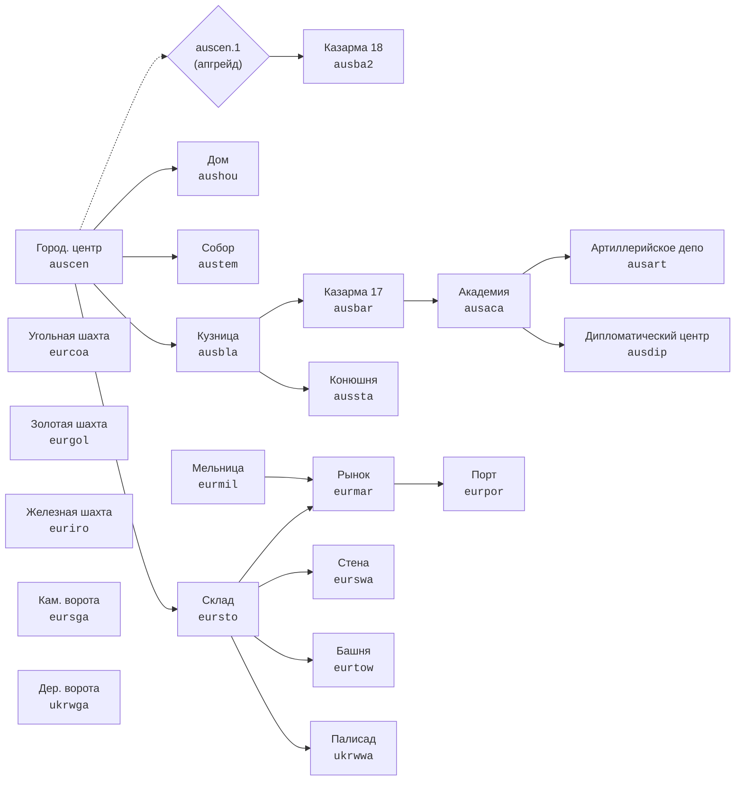

# Дерево развития

[← Таблицы и расчёты](../README.md)

Что нужно построить или исследовать, чтобы открыть выбранное здание, юнита или улучшение. Каноническое название показано первым, внутренний код — вторым.

Для зданий указана цена первого экземпляра. Стоимость следующих экземпляров приведена в [таблице роста цен](../economy/scaling_prices.md).

## Схема зданий на примере Австрии

Стрелка идёт от требования к открываемому зданию. Пунктиром показана связь Городского центра с переходом в XVIII век. У большинства наций схема устроена так же.

## Содержание

| Нация | Здания | Юниты | Ключевые апгрейды |
|---|---|---|---|
| **[Алжир](#алжир)** | [здания](#здания--алжир) | [юниты](#юниты--алжир) | [улучшения](#ключевые-улучшения--алжир) |
| **[Австрия](#австрия)** | [здания](#здания--австрия) | [юниты](#юниты--австрия) | [улучшения](#ключевые-улучшения--австрия) |
| **[Бавария](#бавария)** | [здания](#здания--бавария) | [юниты](#юниты--бавария) | [улучшения](#ключевые-улучшения--бавария) |
| **[Дания](#дания)** | [здания](#здания--дания) | [юниты](#юниты--дания) | [улучшения](#ключевые-улучшения--дания) |
| **[Англия](#англия)** | [здания](#здания--англия) | [юниты](#юниты--англия) | [улучшения](#ключевые-улучшения--англия) |
| **[Франция](#франция)** | [здания](#здания--франция) | [юниты](#юниты--франция) | [улучшения](#ключевые-улучшения--франция) |
| **[Венгрия](#венгрия)** | [здания](#здания--венгрия) | [юниты](#юниты--венгрия) | [улучшения](#ключевые-улучшения--венгрия) |
| **[Нидерланды](#нидерланды)** | [здания](#здания--нидерланды) | [юниты](#юниты--нидерланды) | [улучшения](#ключевые-улучшения--нидерланды) |
| **[Пьемонт](#пьемонт)** | [здания](#здания--пьемонт) | [юниты](#юниты--пьемонт) | [улучшения](#ключевые-улучшения--пьемонт) |
| **[Польша](#польша)** | [здания](#здания--польша) | [юниты](#юниты--польша) | [улучшения](#ключевые-улучшения--польша) |
| **[Португалия](#португалия)** | [здания](#здания--португалия) | [юниты](#юниты--португалия) | [улучшения](#ключевые-улучшения--португалия) |
| **[Пруссия](#пруссия)** | [здания](#здания--пруссия) | [юниты](#юниты--пруссия) | [улучшения](#ключевые-улучшения--пруссия) |
| **[Россия](#россия)** | [здания](#здания--россия) | [юниты](#юниты--россия) | [улучшения](#ключевые-улучшения--россия) |
| **[Саксония](#саксония)** | [здания](#здания--саксония) | [юниты](#юниты--саксония) | [улучшения](#ключевые-улучшения--саксония) |
| **[Шотландия](#шотландия)** | [здания](#здания--шотландия) | [юниты](#юниты--шотландия) | [улучшения](#ключевые-улучшения--шотландия) |
| **[Испания](#испания)** | [здания](#здания--испания) | [юниты](#юниты--испания) | [улучшения](#ключевые-улучшения--испания) |
| **[Швеция](#швеция)** | [здания](#здания--швеция) | [юниты](#юниты--швеция) | [улучшения](#ключевые-улучшения--швеция) |
| **[Швейцария](#швейцария)** | [здания](#здания--швейцария) | [юниты](#юниты--швейцария) | [улучшения](#ключевые-улучшения--швейцария) |
| **[Турция](#турция)** | [здания](#здания--турция) | [юниты](#юниты--турция) | [улучшения](#ключевые-улучшения--турция) |
| **[Украина](#украина)** | [здания](#здания--украина) | [юниты](#юниты--украина) | [улучшения](#ключевые-улучшения--украина) |
| **[Венеция](#венеция)** | [здания](#здания--венеция) | [юниты](#юниты--венеция) | [улучшения](#ключевые-улучшения--венеция) |

## Алжир

### Здания — Алжир

| Здание | Время строительства, игр. с | Цена | Места населения | Требуется |
|---|---:|---|---:|---|
| **Минарет** (`algaca`) | 156.2 | Дерево 1450, Камень 1100 | — | Казарма (`algbar`, здание) |
| **Артиллерийское депо** (`algart`) | 245.9 | Дерево 100, Камень 1000, Уголь 1400 | — | Минарет (`algaca`, здание) |
| **Казарма** (`algbar`) | 93.8 | Дерево 400, Камень 400 | 50 | Кузница (`algbla`, здание) |
| **Кузница** (`algbla`) | 109.4 | Дерево 100, Камень 30, Железо 640 | — | Городской центр (`algcen`, здание) |
| **Городской центр** (`algcen`) | 156.2 | Дерево 450, Камень 700 | 50 | — |
| **Дипломатический центр** (`algdip`) | 312.5 | Дерево 4600, Камень 2020 | — | Минарет (`algaca`, здание) |
| **Дом** (`alghou`) | 31.2 | Дерево 100, Камень 100 | 25 | Городской центр (`algcen`, здание) |
| **Конюшня** (`algsta`) | 156.2 | Дерево 1000, Камень 2200 | — | Кузница (`algbla`, здание) |
| **Мечеть** (`algtem`) | 93.8 | Дерево 1000, Камень 1200, Железо 500 | — | Городской центр (`algcen`, здание) |
| **Шахта** (`eurcoa`) | 93.8 | Дерево 100, Камень 100 | — | — |
| **Шахта** (`eurgol`) | 93.8 | Дерево 100, Камень 100 | — | — |
| **Шахта** (`euriro`) | 93.8 | Дерево 100, Камень 100 | — | — |
| **Базар** (`turmar`) | 234.4 | Дерево 450, Камень 150 | — | Мельница (`turmil`, здание), Склад (`tursto`, здание) |
| **Мельница** (`turmil`) | 93.8 | Дерево 30, Камень 150 | — | — |
| **Порт** (`turpor`) | 1562.5 | Дерево 800, Камень 800, Железо 400 | — | Базар (`turmar`, здание) |
| **Каменные ворота** (`tursga`) | 120.0 | Камень 60 | — | — |
| **Склад** (`tursto`) | 31.2 | Дерево 30, Камень 10 | — | Городской центр (`algcen`, здание) |
| **Стена** (`turswa`) | 120.0 | Камень 60 | — | Склад (`tursto`, здание) |
| **Башня** (`turtow`) | 984.4 | Дерево 150, Камень 90, Золото 100 | — | Склад (`tursto`, здание) |
| **Деревянные ворота** (`ukrwga`) | 5.6 | Дерево 10 | — | — |
| **Частокол** (`ukrwwa`) | 5.6 | Дерево 10 | — | Склад (`tursto`, здание) |

### Юниты — Алжир

| Юнит | Время найма, игр. с | Цена | Производится в | Требуется |
|---|---:|---|---|---|
| **Лучник** (`archer`) | 1.50 | Еда 20, Дерево 2, Золото 1 | Казарма (`algbar`) | — |
| **Лучник (наемник)** (`archerdip`) | 1.25 | Золото 15 | Дипломатический центр (`algdip`) | Минарет (`algaca`, здание), Городской центр (`algcen`, здание) |
| **Турецкий лучник (наемник)** (`archerturdip`) | 1.25 | Золото 15 | Дипломатический центр (`algdip`) | Минарет (`algaca`, здание), Городской центр (`algcen`, здание) |
| **Линейный корабль** (`battleship`) | 390.00 | Дерево 9000, Золото 3200, Железо 700, Уголь 6500 | Порт (`turpor`) | Разработать новую систему шпангоутов и корпуса корабля (условие для постройки линейных кораблей) (`algaca.29`, улучшение), Артиллерийское депо (`algart`, здание) |
| **Пушка** (`cannon`) | 75.00 | Дерево 250, Золото 400, Железо 400 | Артиллерийское депо (`algart`) | Кузница (`algbla`, здание) |
| **Сечевой козак (наемник)** (`cossacksichdip`) | 2.50 | Золото 60 | Дипломатический центр (`algdip`) | Минарет (`algaca`, здание), Городской центр (`algcen`, здание) |
| **Драгун 18в. (наемник)** (`dragoon18dip`) | 2.00 | Золото 120 | Дипломатический центр (`algdip`) | Минарет (`algaca`, здание), Городской центр (`algcen`, здание) |
| **Барабанщик** (`drummertur`) | 4.00 | Еда 30, Золото 15 | Казарма (`algbar`) | Минарет (`algaca`, здание) |
| **Транспорт** (`ferry`) | 56.00 | Дерево 300, Золото 50, Железо 100 | Порт (`turpor`) | Артиллерийское депо (`algart`, здание) |
| **Рыбацкая лодка** (`fishboat`) | 40.00 | Дерево 600 | Порт (`turpor`) | — |
| **Галера** (`galley`) | 50.00 | Дерево 9500, Золото 900, Железо 800 | Порт (`turpor`) | Артиллерийское депо (`algart`, здание) |
| **Гренадер (наемник)** (`grenadierdip`) | 1.50 | Золото 25 | Дипломатический центр (`algdip`) | Минарет (`algaca`, здание), Городской центр (`algcen`, здание) |
| **Гаубица** (`howitzer`) | 94.00 | Дерево 250, Золото 350, Железо 300 | Артиллерийское депо (`algart`) | Кузница (`algbla`, здание) |
| **Легкий кавалерист (наемник)** (`lightcavalrydip`) | 2.00 | Золото 120 | Дипломатический центр (`algdip`) | Минарет (`algaca`, здание), Городской центр (`algcen`, здание) |
| **Легкий пехотинец** (`lightinfantry`) | 1.00 | Еда 25, Железо 1 | Казарма (`algbar`) | — |
| **Легкий пехотинец (наемник)** (`lightinfantrydip`) | 1.25 | Золото 4 | Дипломатический центр (`algdip`) | Минарет (`algaca`, здание), Городской центр (`algcen`, здание) |
| **Мамлюк** (`mameluke`) | 12.00 | Еда 100, Дерево 5, Золото 8 | Конюшня (`algsta`) | — |
| **Мортира** (`mortar`) | 25.00 | Дерево 100, Золото 75, Железо 200 | Артиллерийское депо (`algart`) | Кузница (`algbla`, здание) |
| **Мулла** (`mullah`) | 15.00 | Еда 30, Золото 10 | Мечеть (`algtem`) | — |
| **Офицер** (`officertur`) | 7.50 | Еда 50, Золото 100 | Казарма (`algbar`) | Минарет (`algaca`, здание) |
| **Крестьянин** (`peatur`) | 12.50 | Еда 100 | Городской центр (`algcen`) | — |
| **Турецкий пикинер** (`pikemantur`) | 5.50 | Еда 55, Золото 5 | Казарма (`algbar`) | Кузница (`algbla`, здание) |
| **Рундашир (наемник)** (`roundshierdip`) | 1.50 | Золото 12 | Дипломатический центр (`algdip`) | Минарет (`algaca`, здание), Городской центр (`algcen`, здание) |
| **—** (`unitbox`) | 3.12 | Еда 100 | — | — |
| **Шебека** (`xebec`) | 230.00 | Дерево 7000, Золото 1600, Железо 320, Уголь 960 | Порт (`turpor`) | Разработать новые методы древообработки (условие для постройки шебек) (`algaca.6`, улучшение), Артиллерийское депо (`algart`, здание) |

### Ключевые улучшения — Алжир

| Улучшение | Время исследования, игр. с | Цена | Требуется |
|---|---:|---|---|
| **Исследовать новые добавки в порох (дальность стрельбы артиллерии +5%)** (`algaca.16`) | 15.6 | Золото 2000 | Артиллерийское депо (`algart`, здание) |
| **Разработать новые виды стволов: единорог, карронада (дальность стрельбы артиллерии +10%)** (`algaca.17`) | 15.6 | Камень 3000, Золото 4550 | Артиллерийское депо (`algart`, здание) |
| **Разработать более прочный лафет для орудий: система Грибоваля (прочность пушек +50%)** (`algaca.18`) | 15.6 | Золото 500, Железо 3830, Уголь 1500 | Артиллерийское депо (`algart`, здание) |
| **Разработать новые прицельные системы для пушек (меткость стрельбы артиллерии +35%)** (`algaca.20`) | 15.6 | Дерево 3540, Золото 2000, Уголь 7250 | Артиллерийское депо (`algart`, здание) |
| **Выделить деньги на ремонтные мастерские для пушек (отремонтировать все пушки)** (`algaca.21`) | 15.6 | Дерево 350, Золото 100, Уголь 250 | Артиллерийское депо (`algart`, здание) |
| **Развивать математику (меткость выстрела орудий +35%)** (`algaca.27`) | 15.6 | Дерево 9540, Золото 12000, Уголь 65200 | Артиллерийское депо (`algart`, здание) |
| **Разработать новые парусные системы (скорость кораблей +40%)** (`algaca.28`) | 15.6 | Золото 1900 | Порт (`turpor`, здание) |
| **Разработать новую систему шпангоутов и корпуса корабля (условие для постройки линейных кораблей)** (`algaca.29`) | 15.6 | Дерево 32300, Золото 6800, Железо 9000, Уголь 12800 | Порт (`turpor`, здание) |
| **Обучить плотников (скорость постройки кораблей увеличивается в 10 раз)** (`algaca.30`) | 15.6 | Камень 42700 | Порт (`turpor`, здание) |
| **Разработать новые снасти и сети для ловли рыбы (эффективность рыбацких лодок +100%)** (`algaca.5`) | 15.6 | Дерево 12400, Золото 2520 | Порт (`turpor`, здание) |
| **Разработать новые методы древообработки (условие для постройки шебек)** (`algaca.6`) | 15.6 | Дерево 9500, Золото 7040 | Порт (`turpor`, здание) |
| **Построить новые верфи для рыбацких лодок (стоимость рыбацкой лодки -85%)** (`algaca.7`) | 15.6 | Дерево 7300, Золото 1220 | Порт (`turpor`, здание) |
| **Разработать новые инструменты для древообработки (эффективность добычи дерева +100%)** (`algaca.8`) | 15.6 | Еда 5500, Золото 550 | Кузница (`algbla`, здание) |
| **—** (`algart.cannon.1.1`) | 10.0 | Дерево 1000, Камень 500, Золото 300 | Кузница (`algbla`, здание) |
| **—** (`algart.cannon.1.2`) | 10.0 | Дерево 3000, Камень 1000, Золото 500 | Кузница (`algbla`, здание) |
| **—** (`algart.cannon.1.3`) | 10.0 | Дерево 6000, Камень 2000, Золото 1000 | Кузница (`algbla`, здание) |
| **—** (`algart.cannon.1.4`) | 15.6 | Еда 1760, Золото 350 | Кузница (`algbla`, здание) |
| **—** (`algart.cannon.1.5`) | 15.6 | Еда 1760, Золото 350 | Кузница (`algbla`, здание) |
| **—** (`algart.cannon.1.6`) | 15.6 | Еда 1760, Золото 350 | Кузница (`algbla`, здание) |
| **—** (`algart.cannon.2.1`) | 10.0 | Золото 950, Железо 1000 | Кузница (`algbla`, здание) |
| **—** (`algart.cannon.2.2`) | 10.0 | Золото 150, Железо 2000 | Кузница (`algbla`, здание) |
| **—** (`algart.cannon.2.3`) | 10.0 | Золото 250, Железо 3000 | Кузница (`algbla`, здание) |
| **—** (`algart.cannon.2.4`) | 15.6 | Еда 2560, Золото 1350 | Кузница (`algbla`, здание) |
| **—** (`algart.cannon.2.5`) | 15.6 | Еда 3560, Золото 2500 | Кузница (`algbla`, здание) |
| **—** (`algart.cannon.2.6`) | 15.6 | Еда 5560, Золото 3350 | Кузница (`algbla`, здание) |
| **—** (`algart.howitzer.1.1`) | 10.0 | Дерево 1000, Камень 500, Золото 300 | Кузница (`algbla`, здание) |
| **—** (`algart.howitzer.1.2`) | 10.0 | Дерево 3000, Камень 1000, Золото 500 | Кузница (`algbla`, здание) |
| **—** (`algart.howitzer.1.3`) | 10.0 | Дерево 6000, Камень 2000, Золото 1000 | Кузница (`algbla`, здание) |
| **—** (`algart.howitzer.1.4`) | 15.6 | Еда 1760, Золото 350 | Кузница (`algbla`, здание) |
| **—** (`algart.howitzer.1.5`) | 15.6 | Еда 1760, Золото 350 | Кузница (`algbla`, здание) |
| **—** (`algart.howitzer.1.6`) | 15.6 | Еда 1760, Золото 350 | Кузница (`algbla`, здание) |
| **—** (`algart.howitzer.2.1`) | 10.0 | Золото 350, Железо 1000 | Кузница (`algbla`, здание) |
| **—** (`algart.howitzer.2.2`) | 10.0 | Золото 450, Железо 2000 | Кузница (`algbla`, здание) |
| **—** (`algart.howitzer.2.3`) | 10.0 | Золото 550, Железо 3000 | Кузница (`algbla`, здание) |
| **—** (`algart.howitzer.2.4`) | 31.2 | Еда 2560, Золото 1150 | Кузница (`algbla`, здание) |
| **—** (`algart.howitzer.2.5`) | 31.2 | Еда 3560, Золото 3200 | Кузница (`algbla`, здание) |
| **—** (`algart.howitzer.2.6`) | 31.2 | Еда 5560, Золото 4500 | Кузница (`algbla`, здание) |
| **—** (`algbar.lightinfantry.1.4`) | 15.6 | Еда 3000, Золото 360 | Кузница (`algbla`, здание) |
| **—** (`algbar.lightinfantry.1.5`) | 15.6 | Еда 4500, Золото 540 | Кузница (`algbla`, здание) |
| **—** (`algbar.lightinfantry.1.6`) | 15.6 | Еда 9375, Золото 1125 | Кузница (`algbla`, здание) |
| **—** (`algbar.lightinfantry.2.4`) | 15.6 | Еда 3600, Золото 600 | Кузница (`algbla`, здание) |
| **—** (`algbar.lightinfantry.2.5`) | 15.6 | Еда 5400, Золото 900 | Кузница (`algbla`, здание) |
| **—** (`algbar.lightinfantry.2.6`) | 15.6 | Еда 11250, Золото 1875 | Кузница (`algbla`, здание) |
| **—** (`algbar.pikemantur.1.6`) | 15.6 | Еда 18750, Золото 2350 | Кузница (`algbla`, здание) |
| **—** (`algbar.pikemantur.2.6`) | 15.6 | Еда 16875, Золото 2250 | Кузница (`algbla`, здание) |
| **Обучить столяров (отремонтировать все корабли)** (`turpor.1`) | 46.9 | Дерево 20000, Золото 1500 | Артиллерийское депо (`algart`, здание) |
| **Увеличить количество оборонительных орудий (20%)** (`turtow.1`) | 31.2 | Золото 250 | Артиллерийское депо (`algart`, здание) |
| **Увеличить количество оборонительных орудий (20%)** (`turtow.2`) | 31.2 | Железо 350 | Артиллерийское депо (`algart`, здание) |
| **Увеличить количество оборонительных орудий (10%)** (`turtow.3`) | 31.2 | Уголь 400 | Артиллерийское депо (`algart`, здание) |
| **Увеличить количество оборонительных орудий (10%)** (`turtow.4`) | 31.2 | Железо 450 | Артиллерийское депо (`algart`, здание) |
| **Увеличить количество оборонительных орудий (10%)** (`turtow.5`) | 31.2 | Уголь 500 | Артиллерийское депо (`algart`, здание) |

[↑ к содержанию](#содержание)

## Австрия

### Здания — Австрия

| Здание | Время строительства, игр. с | Цена | Места населения | Требуется |
|---|---:|---|---:|---|
| **Академия** (`ausaca`) | 625.0 | Дерево 1250, Камень 1100 | — | Казарма 17в. (`ausbar`, здание) |
| **Артиллерийское депо** (`ausart`) | 245.9 | Дерево 100, Камень 1000, Уголь 1400 | — | Академия (`ausaca`, здание) |
| **Казарма 18в.** (`ausba2`) | 5625.0 | Дерево 1700, Камень 2950, Золото 4000 | 250 | Перейти в 18 век (`auscen.1`, улучшение) |
| **Казарма 17в.** (`ausbar`) | 93.8 | Дерево 100, Камень 100, Золото 500 | 150 | Кузница (`ausbla`, здание) |
| **Кузница** (`ausbla`) | 93.8 | Дерево 100, Камень 30, Железо 640 | — | Городской центр (`auscen`, здание) |
| **Городской центр** (`auscen`) | 46.9 | Дерево 700, Камень 700 | 100 | — |
| **Дипломатический центр** (`ausdip`) | 312.5 | Дерево 4900, Камень 1700 | — | Академия (`ausaca`, здание) |
| **Дом** (`aushou`) | 31.2 | Дерево 100, Камень 100 | 25 | Городской центр (`auscen`, здание) |
| **Конюшня** (`aussta`) | 625.0 | Дерево 2500, Камень 100, Золото 600 | — | Кузница (`ausbla`, здание) |
| **Собор** (`austem`) | 156.2 | Дерево 1000, Камень 1200, Железо 500 | — | Городской центр (`auscen`, здание) |
| **Шахта** (`eurcoa`) | 93.8 | Дерево 100, Камень 100 | — | — |
| **Шахта** (`eurgol`) | 93.8 | Дерево 100, Камень 100 | — | — |
| **Шахта** (`euriro`) | 93.8 | Дерево 100, Камень 100 | — | — |
| **Рынок** (`eurmar`) | 234.4 | Дерево 450 | — | Мельница (`eurmil`, здание), Склад (`eursto`, здание) |
| **Мельница** (`eurmil`) | 93.8 | Дерево 30, Камень 150 | — | — |
| **Порт** (`eurpor`) | 1562.5 | Дерево 1600, Камень 800, Железо 400 | — | Рынок (`eurmar`, здание) |
| **Каменные ворота** (`eursga`) | 90.0 | Камень 50 | — | — |
| **Склад** (`eursto`) | 31.2 | Дерево 50, Камень 20 | — | Городской центр (`auscen`, здание) |
| **Стена** (`eurswa`) | 90.0 | Камень 50 | — | Склад (`eursto`, здание) |
| **Башня** (`eurtow`) | 1230.3 | Дерево 100, Камень 100, Золото 150 | — | Склад (`eursto`, здание) |
| **Деревянные ворота** (`ukrwga`) | 5.6 | Дерево 10 | — | — |
| **Частокол** (`ukrwwa`) | 5.6 | Дерево 10 | — | Склад (`eursto`, здание) |

### Юниты — Австрия

| Юнит | Время найма, игр. с | Цена | Производится в | Требуется |
|---|---:|---|---|---|
| **Лучник (наемник)** (`archerdip`) | 1.25 | Золото 15 | Дипломатический центр (`ausdip`) | Академия (`ausaca`, здание), Городской центр (`auscen`, здание) |
| **Турецкий лучник (наемник)** (`archerturdip`) | 1.25 | Золото 15 | Дипломатический центр (`ausdip`) | Академия (`ausaca`, здание), Городской центр (`auscen`, здание) |
| **Линейный корабль** (`battleship`) | 390.00 | Дерево 9000, Золото 3200, Железо 700, Уголь 6500 | Порт (`eurpor`) | Разработать новую систему шпангоутов и корпуса корабля (условие для постройки линейных кораблей) (`ausaca.29`, улучшение), Артиллерийское депо (`ausart`, здание) |
| **Пушка** (`cannon`) | 75.00 | Дерево 250, Золото 400, Железо 400 | Артиллерийское депо (`ausart`) | Кузница (`ausbla`, здание) |
| **Сечевой козак (наемник)** (`cossacksichdip`) | 2.50 | Золото 60 | Дипломатический центр (`ausdip`) | Академия (`ausaca`, здание), Городской центр (`auscen`, здание) |
| **Кроат** (`croat`) | 15.75 | Еда 80, Золото 6, Железо 2 | Конюшня (`aussta`) | Кузница (`ausbla`, здание) |
| **Кирасир** (`cuirassier`) | 22.50 | Еда 120, Золото 35, Железо 25 | Конюшня (`aussta`) | Кузница (`ausbla`, здание), Перейти в 18 век (`auscen.1`, улучшение) |
| **Драгун 17в.** (`dragoon`) | 15.00 | Еда 90, Золото 7, Железо 5 | Конюшня (`aussta`) | Кузница (`ausbla`, здание) |
| **Драгун 18в.** (`dragoon18`) | 22.50 | Еда 70, Золото 60, Железо 7 | Конюшня (`aussta`) | Кузница (`ausbla`, здание), Перейти в 18 век (`auscen.1`, улучшение) |
| **Драгун 18в. (наемник)** (`dragoon18dip`) | 2.00 | Золото 120 | Дипломатический центр (`ausdip`) | Академия (`ausaca`, здание), Городской центр (`auscen`, здание) |
| **Барабанщик 17в.** (`drummer`) | 5.00 | Еда 60, Золото 20 | Казарма 17в. (`ausbar`) | Академия (`ausaca`, здание) |
| **Барабанщик 18в.** (`drummer18`) | 6.00 | Еда 50, Золото 30 | Казарма 18в. (`ausba2`) | Академия (`ausaca`, здание) |
| **Транспорт** (`ferry`) | 56.00 | Дерево 300, Золото 50, Железо 100 | Порт (`eurpor`) | Артиллерийское депо (`ausart`, здание) |
| **Рыбацкая лодка** (`fishboat`) | 40.00 | Дерево 600 | Порт (`eurpor`) | — |
| **Фрегат** (`frigate`) | 230.00 | Дерево 5000, Золото 1100, Железо 600, Уголь 800 | Порт (`eurpor`) | Разработать новые методы древообработки (условие для постройки фрегатов) (`ausaca.6`, улучшение), Артиллерийское депо (`ausart`, здание) |
| **Галера** (`galley`) | 50.00 | Дерево 9500, Золото 900, Железо 800 | Порт (`eurpor`) | Артиллерийское депо (`ausart`, здание) |
| **Гренадер** (`grenadier`) | 6.00 | Еда 80, Золото 60, Железо 40 | Казарма 18в. (`ausba2`) | Кузница (`ausbla`, здание) |
| **Гренадер (наемник)** (`grenadierdip`) | 1.50 | Золото 25 | Дипломатический центр (`ausdip`) | Академия (`ausaca`, здание), Городской центр (`auscen`, здание) |
| **Гаубица** (`howitzer`) | 94.00 | Дерево 250, Золото 350, Железо 300 | Артиллерийское депо (`ausart`) | Кузница (`ausbla`, здание) |
| **Гусар** (`hussar`) | 15.00 | Еда 70, Золото 20, Железо 2 | Конюшня (`aussta`) | Кузница (`ausbla`, здание), Перейти в 18 век (`auscen.1`, улучшение) |
| **Легкий кавалерист (наемник)** (`lightcavalrydip`) | 2.00 | Золото 120 | Дипломатический центр (`ausdip`) | Академия (`ausaca`, здание), Городской центр (`auscen`, здание) |
| **Легкий пехотинец (наемник)** (`lightinfantrydip`) | 1.25 | Золото 4 | Дипломатический центр (`ausdip`) | Академия (`ausaca`, здание), Городской центр (`auscen`, здание) |
| **Мортира** (`mortar`) | 25.00 | Дерево 100, Золото 75, Железо 200 | Артиллерийское депо (`ausart`) | Кузница (`ausbla`, здание) |
| **Многоствольное орудие** (`multicannon`) | 50.00 | Дерево 200, Золото 400, Железо 250 | Артиллерийское депо (`ausart`) | Разработать многоствольное орудие (`ausaca.19`, улучшение), Кузница (`ausbla`, здание) |
| **Мушкетер 18в.** (`musketeer18`) | 4.50 | Еда 50, Золото 40, Железо 40 | Казарма 18в. (`ausba2`) | Кузница (`ausbla`, здание) |
| **Мушкетер 17в.** (`musketeeraus`) | 6.50 | Еда 35, Золото 9, Железо 15 | Казарма 17в. (`ausbar`) | Кузница (`ausbla`, здание) |
| **Офицер 17в.** (`officer`) | 10.00 | Еда 50, Золото 150, Железо 30 | Казарма 17в. (`ausbar`) | Академия (`ausaca`, здание) |
| **Офицер 18в.** (`officer18`) | 6.00 | Еда 50, Золото 200, Железо 10 | Казарма 18в. (`ausba2`) | Академия (`ausaca`, здание) |
| **Пандур** (`pandur`) | 5.50 | Еда 40, Золото 15, Железо 10 | Казарма 18в. (`ausba2`) | Кузница (`ausbla`, здание) |
| **Крестьянин** (`peaaus`) | 12.50 | Еда 100 | Городской центр (`auscen`) | — |
| **Пикинер 17в.** (`pikeman`) | 4.50 | Еда 25, Золото 3, Железо 20 | Казарма 17в. (`ausbar`) | Кузница (`ausbla`, здание) |
| **Пикинер 18в.** (`pikeman18`) | 1.25 | Еда 30, Золото 2 | Казарма 18в. (`ausba2`) | — |
| **Капеллан** (`priest`) | 20.00 | Еда 60, Золото 25 | Собор (`austem`) | — |
| **Рейтар** (`reiter`) | 24.00 | Еда 120, Золото 10, Железо 40 | Конюшня (`aussta`) | Кузница (`ausbla`, здание) |
| **Рундашир** (`roundshier`) | 4.00 | Еда 20, Золото 3, Железо 25 | Казарма 17в. (`ausbar`) | Кузница (`ausbla`, здание) |
| **Рундашир (наемник)** (`roundshierdip`) | 1.50 | Золото 12 | Дипломатический центр (`ausdip`) | Академия (`ausaca`, здание), Городской центр (`auscen`, здание) |
| **—** (`unitbox`) | 3.12 | Еда 100 | — | — |
| **Яхта** (`yacht`) | 48.00 | Дерево 900, Золото 450, Железо 150, Уголь 200 | Порт (`eurpor`) | Артиллерийское депо (`ausart`, здание) |

### Ключевые улучшения — Австрия

| Улучшение | Время исследования, игр. с | Цена | Требуется |
|---|---:|---|---|
| **Улучшить стрелковое оружие: нарезной ствол (сила выстрела +10%)** (`ausaca.12`) | 15.6 | Железо 5000 | Кузница (`ausbla`, здание) |
| **Исследовать гранулированный порох (сила выстрела +10%)** (`ausaca.13`) | 15.6 | Золото 4000 | Кузница (`ausbla`, здание) |
| **Исследовать новые методы очистки серы (сила выстрела +15%)** (`ausaca.14`) | 15.6 | Золото 7000 | Кузница (`ausbla`, здание) |
| **Исследовать новые методы очистки селитры (сила выстрела +25%)** (`ausaca.15`) | 15.6 | Уголь 11000 | Кузница (`ausbla`, здание) |
| **Исследовать новые добавки в порох (дальность стрельбы артиллерии +5%)** (`ausaca.16`) | 15.6 | Золото 2000, Железо 12150 | Артиллерийское депо (`ausart`, здание) |
| **Разработать новые виды стволов: единорог, карронада (дальность стрельбы артиллерии +10%)** (`ausaca.17`) | 15.6 | Камень 3000, Золото 4550, Железо 19200 | Артиллерийское депо (`ausart`, здание) |
| **Разработать более прочный лафет для орудий: система Грибоваля (прочность пушек +50%)** (`ausaca.18`) | 15.6 | Золото 500, Железо 3830, Уголь 1500 | Артиллерийское депо (`ausart`, здание) |
| **Разработать многоствольное орудие** (`ausaca.19`) | 15.6 | Золото 1500, Уголь 2500 | Артиллерийское депо (`ausart`, здание) |
| **Разработать новые прицельные системы для пушек (меткость стрельбы артиллерии +35%)** (`ausaca.20`) | 15.6 | Дерево 3540, Золото 2000, Уголь 7250 | Артиллерийское депо (`ausart`, здание) |
| **Выделить деньги на ремонтные мастерские для пушек (отремонтировать все пушки)** (`ausaca.21`) | 15.6 | Дерево 350, Золото 100, Уголь 250 | Артиллерийское депо (`ausart`, здание) |
| **Разработать монгольфьер (открывает всю карту)** (`ausaca.25`) | 15.6 | Золото 5750 | Перейти в 18 век (`auscen.1`, улучшение) |
| **Развивать математику (меткость выстрела орудий +35%)** (`ausaca.27`) | 15.6 | Дерево 9540, Золото 12000, Уголь 65200 | Артиллерийское депо (`ausart`, здание) |
| **Разработать новые парусные системы (скорость кораблей +40%)** (`ausaca.28`) | 15.6 | Дерево 65400, Золото 24050 | Порт (`eurpor`, здание) |
| **Разработать новую систему шпангоутов и корпуса корабля (условие для постройки линейных кораблей)** (`ausaca.29`) | 15.6 | Дерево 32300, Золото 6800, Железо 9000, Уголь 12800 | Порт (`eurpor`, здание) |
| **Обучить плотников (скорость постройки кораблей увеличивается в 10 раз)** (`ausaca.30`) | 15.6 | Дерево 2300, Камень 42700, Золото 1150 | Порт (`eurpor`, здание) |
| **Разработать кремниевый замок к ружьям (цена мушкета -50%)** (`ausaca.32`) | 15.6 | Золото 6050, Уголь 7750 | Перейти в 18 век (`auscen.1`, улучшение) |
| **Разработать новые сорта стали для кирас (защита солдат в доспехах +2)** (`ausaca.34`) | 15.6 | Золото 9750 | Кузница (`ausbla`, здание) |
| **Разработать штык: вставляемый в ствол багинет, штык с трубкой (сила удара холодного оружия +5)** (`ausaca.35`) | 15.6 | Золото 11500 | Перейти в 18 век (`auscen.1`, улучшение), Кузница (`ausbla`, здание) |
| **Разработать новые сорта стали (эффективность рукопашной атаки мушкетера 18 века и гренадера +25%)** (`ausaca.36`) | 15.6 | Золото 19500 | Перейти в 18 век (`auscen.1`, улучшение), Кузница (`ausbla`, здание) |
| **Разработать новые снасти и сети для ловли рыбы (эффективность рыбацких лодок +100%)** (`ausaca.5`) | 15.6 | Дерево 12400, Золото 2520 | Порт (`eurpor`, здание) |
| **Разработать новые методы древообработки (условие для постройки фрегатов)** (`ausaca.6`) | 15.6 | Дерево 12400, Золото 7040 | Порт (`eurpor`, здание) |
| **Построить новые верфи для рыбацких лодок (стоимость рыбацкой лодки -85%)** (`ausaca.7`) | 15.6 | Дерево 7300, Золото 1220 | Порт (`eurpor`, здание) |
| **Разработать новые инструменты для древообработки (эффективность добычи дерева +100%)** (`ausaca.8`) | 15.6 | Еда 5500, Золото 550 | Кузница (`ausbla`, здание) |
| **—** (`ausart.cannon.1.1`) | 10.0 | Дерево 1000, Камень 500, Золото 300 | Кузница (`ausbla`, здание) |
| **—** (`ausart.cannon.1.2`) | 10.0 | Дерево 3000, Камень 1000, Золото 500 | Кузница (`ausbla`, здание) |
| **—** (`ausart.cannon.1.3`) | 10.0 | Дерево 6000, Камень 2000, Золото 1000 | Кузница (`ausbla`, здание) |
| **—** (`ausart.cannon.1.4`) | 15.6 | Еда 1760, Золото 350 | Кузница (`ausbla`, здание) |
| **—** (`ausart.cannon.1.5`) | 15.6 | Еда 1760, Золото 350 | Кузница (`ausbla`, здание) |
| **—** (`ausart.cannon.1.6`) | 15.6 | Еда 1760, Золото 350 | Кузница (`ausbla`, здание) |
| **—** (`ausart.cannon.2.1`) | 10.0 | Золото 500, Железо 1000 | Кузница (`ausbla`, здание) |
| **—** (`ausart.cannon.2.2`) | 10.0 | Золото 1000, Железо 2000 | Кузница (`ausbla`, здание) |
| **—** (`ausart.cannon.2.3`) | 10.0 | Золото 2000, Железо 3000 | Кузница (`ausbla`, здание) |
| **—** (`ausart.cannon.2.4`) | 15.6 | Еда 2560 | Кузница (`ausbla`, здание) |
| **—** (`ausart.cannon.2.5`) | 15.6 | Еда 3560 | Кузница (`ausbla`, здание) |
| **—** (`ausart.cannon.2.6`) | 15.6 | Еда 5560 | Кузница (`ausbla`, здание) |
| **—** (`ausart.howitzer.1.1`) | 10.0 | Дерево 1000, Камень 500, Золото 300 | Кузница (`ausbla`, здание) |
| **—** (`ausart.howitzer.1.2`) | 10.0 | Дерево 3000, Камень 1000, Золото 500 | Кузница (`ausbla`, здание) |
| **—** (`ausart.howitzer.1.3`) | 10.0 | Дерево 6000, Камень 2000, Золото 1000 | Кузница (`ausbla`, здание) |
| **—** (`ausart.howitzer.1.4`) | 15.6 | Еда 1760, Золото 350 | Кузница (`ausbla`, здание) |
| **—** (`ausart.howitzer.1.5`) | 15.6 | Еда 1760, Золото 350 | Кузница (`ausbla`, здание) |
| **—** (`ausart.howitzer.1.6`) | 15.6 | Еда 1760, Золото 350 | Кузница (`ausbla`, здание) |
| **—** (`ausart.howitzer.2.1`) | 10.0 | Золото 500, Железо 1000 | Кузница (`ausbla`, здание) |
| **—** (`ausart.howitzer.2.2`) | 10.0 | Золото 1000, Железо 2000 | Кузница (`ausbla`, здание) |
| **—** (`ausart.howitzer.2.3`) | 10.0 | Золото 2000, Железо 3000 | Кузница (`ausbla`, здание) |
| **—** (`ausart.howitzer.2.4`) | 31.2 | Еда 2560 | Кузница (`ausbla`, здание) |
| **—** (`ausart.howitzer.2.5`) | 31.2 | Еда 3560 | Кузница (`ausbla`, здание) |
| **—** (`ausart.howitzer.2.6`) | 31.2 | Еда 5560 | Кузница (`ausbla`, здание) |
| **—** (`ausbar.pikeman.1.6`) | 15.6 | Еда 15000, Золото 1875 | Кузница (`ausbla`, здание) |
| **—** (`ausbar.pikeman.2.6`) | 15.6 | Еда 11250, Золото 1500 | Кузница (`ausbla`, здание) |
| **—** (`ausbar.roundshier.1.4`) | 15.6 | Еда 7500, Золото 900 | Кузница (`ausbla`, здание) |
| **—** (`ausbar.roundshier.1.5`) | 15.6 | Еда 9000, Золото 1080 | Кузница (`ausbla`, здание) |
| **—** (`ausbar.roundshier.1.6`) | 15.6 | Еда 18750, Золото 2250 | Кузница (`ausbla`, здание) |
| **—** (`ausbar.roundshier.2.4`) | 15.6 | Еда 3750, Золото 450 | Кузница (`ausbla`, здание) |
| **—** (`ausbar.roundshier.2.5`) | 15.6 | Еда 6750, Золото 810 | Кузница (`ausbla`, здание) |
| **—** (`ausbar.roundshier.2.6`) | 15.6 | Еда 9375, Золото 1125 | Кузница (`ausbla`, здание) |
| **Выковать штыки и тесаки для пехоты (сила удара мушкетера 18 века и гренадера +5)** (`ausbla.4`) | 15.6 | Дерево 1300, Золото 1500, Железо 900, Уголь 5000 | Перейти в 18 век (`auscen.1`, улучшение) |
| **Перейти в 18 век** (`auscen.1`) | 9.4 | Еда 30000, Золото 5000, Железо 2000, Уголь 2000 | Академия (`ausaca`, здание), Собор (`austem`, здание), Артиллерийское депо (`ausart`, здание) |
| **Расширить шахты и построить в них разветвленную сеть рельсовых дорог (+12)** (`eurcoa.4`) | 9.4 | Еда 15800, Золото 18500 | Перейти в 18 век (`auscen.1`, улучшение) |
| **Расширить шахты и построить в них разветвленную сеть рельсовых дорог (+15)** (`eurcoa.5`) | 9.4 | Еда 19800, Золото 21050 | Перейти в 18 век (`auscen.1`, улучшение) |
| **Расширить шахты и построить в них разветвленную сеть рельсовых дорог (+40)** (`eurcoa.6`) | 9.4 | Еда 50200, Золото 25950 | Перейти в 18 век (`auscen.1`, улучшение) |
| **Расширить шахты и построить в них разветвленную сеть рельсовых дорог (+12)** (`eurgol.4`) | 9.4 | Еда 15800, Золото 18500 | Перейти в 18 век (`auscen.1`, улучшение) |
| **Расширить шахты и построить в них разветвленную сеть рельсовых дорог (+15)** (`eurgol.5`) | 9.4 | Еда 19800, Золото 21050 | Перейти в 18 век (`auscen.1`, улучшение) |
| **Расширить шахты и построить в них разветвленную сеть рельсовых дорог (+40)** (`eurgol.6`) | 9.4 | Еда 50200, Золото 25950 | Перейти в 18 век (`auscen.1`, улучшение) |
| **Расширить шахты и построить в них разветвленную сеть рельсовых дорог (+12)** (`euriro.4`) | 9.4 | Еда 15800, Золото 18500 | Перейти в 18 век (`auscen.1`, улучшение) |
| **Расширить шахты и построить в них разветвленную сеть рельсовых дорог (+15)** (`euriro.5`) | 9.4 | Еда 19800, Золото 21050 | Перейти в 18 век (`auscen.1`, улучшение) |
| **Расширить шахты и построить в них разветвленную сеть рельсовых дорог (+40)** (`euriro.6`) | 9.4 | Еда 50200, Золото 25950 | Перейти в 18 век (`auscen.1`, улучшение) |
| **Обучить столяров (отремонтировать все корабли)** (`eurpor.1`) | 46.9 | Дерево 20000, Золото 1500 | Артиллерийское депо (`ausart`, здание) |
| **Увеличить количество оборонительных орудий (20%)** (`eurtow.1`) | 31.2 | Золото 250 | Артиллерийское депо (`ausart`, здание) |
| **Увеличить количество оборонительных орудий (20%)** (`eurtow.2`) | 31.2 | Железо 350 | Артиллерийское депо (`ausart`, здание) |
| **Увеличить количество оборонительных орудий (10%)** (`eurtow.3`) | 31.2 | Уголь 400 | Артиллерийское депо (`ausart`, здание) |
| **Увеличить количество оборонительных орудий (10%)** (`eurtow.4`) | 31.2 | Железо 450 | Артиллерийское депо (`ausart`, здание) |
| **Увеличить количество оборонительных орудий (10%)** (`eurtow.5`) | 31.2 | Уголь 500 | Артиллерийское депо (`ausart`, здание) |
| **Усовершенствовать конструкцию транспортного судна (+200 посадочных мест)** (`ferry.1`) | 15.6 | Еда 1000, Золото 1250 | Перейти в 18 век (`auscen.1`, улучшение) |

[↑ к содержанию](#содержание)

## Бавария

### Здания — Бавария

| Здание | Время строительства, игр. с | Цена | Места населения | Требуется |
|---|---:|---|---:|---|
| **Академия** (`bavaca`) | 625.0 | Дерево 1250, Камень 1100 | — | Казарма 17в. (`bavbar`, здание) |
| **Артиллерийское депо** (`bavart`) | 245.9 | Дерево 100, Камень 1000, Уголь 1400 | — | Академия (`bavaca`, здание) |
| **Казарма 18в.** (`bavba2`) | 5625.0 | Дерево 1700, Камень 2950, Золото 4000 | 250 | Перейти в 18 век (`bavcen.1`, улучшение) |
| **Казарма 17в.** (`bavbar`) | 93.8 | Дерево 100, Камень 100, Золото 500 | 150 | Кузница (`bavbla`, здание) |
| **Кузница** (`bavbla`) | 93.8 | Дерево 100, Камень 30, Железо 640 | — | Городской центр (`bavcen`, здание) |
| **Городской центр** (`bavcen`) | 156.2 | Дерево 700, Камень 700 | 100 | — |
| **Дипломатический центр** (`bavdip`) | 312.5 | Дерево 4900, Камень 1700 | — | Академия (`bavaca`, здание) |
| **Дом** (`bavhou`) | 31.2 | Дерево 100, Камень 100 | 25 | Городской центр (`bavcen`, здание) |
| **Конюшня** (`bavsta`) | 625.0 | Дерево 2500, Камень 100, Золото 600 | — | Кузница (`bavbla`, здание) |
| **Собор** (`bavtem`) | 156.2 | Дерево 1000, Камень 1200, Железо 500 | — | Городской центр (`bavcen`, здание) |
| **Шахта** (`eurcoa`) | 93.8 | Дерево 100, Камень 100 | — | — |
| **Шахта** (`eurgol`) | 93.8 | Дерево 100, Камень 100 | — | — |
| **Шахта** (`euriro`) | 93.8 | Дерево 100, Камень 100 | — | — |
| **Рынок** (`eurmar`) | 234.4 | Дерево 450 | — | Мельница (`eurmil`, здание), Склад (`eursto`, здание) |
| **Мельница** (`eurmil`) | 93.8 | Дерево 30, Камень 150 | — | — |
| **Порт** (`eurpor`) | 1562.5 | Дерево 1600, Камень 800, Железо 400 | — | Рынок (`eurmar`, здание) |
| **Каменные ворота** (`eursga`) | 90.0 | Камень 50 | — | — |
| **Склад** (`eursto`) | 31.2 | Дерево 50, Камень 20 | — | Городской центр (`bavcen`, здание) |
| **Стена** (`eurswa`) | 90.0 | Камень 50 | — | Склад (`eursto`, здание) |
| **Башня** (`eurtow`) | 1230.3 | Дерево 100, Камень 100, Золото 150 | — | Склад (`eursto`, здание) |
| **Деревянные ворота** (`ukrwga`) | 5.6 | Дерево 10 | — | — |
| **Частокол** (`ukrwwa`) | 5.6 | Дерево 10 | — | Склад (`eursto`, здание) |

### Юниты — Бавария

| Юнит | Время найма, игр. с | Цена | Производится в | Требуется |
|---|---:|---|---|---|
| **Лучник (наемник)** (`archerdip`) | 1.25 | Золото 15 | Дипломатический центр (`bavdip`) | Академия (`bavaca`, здание), Городской центр (`bavcen`, здание) |
| **Турецкий лучник (наемник)** (`archerturdip`) | 1.25 | Золото 15 | Дипломатический центр (`bavdip`) | Академия (`bavaca`, здание), Городской центр (`bavcen`, здание) |
| **Линейный корабль** (`battleship`) | 390.00 | Дерево 9000, Золото 3200, Железо 700, Уголь 6500 | Порт (`eurpor`) | Разработать новую систему шпангоутов и корпуса корабля (условие для постройки линейных кораблей) (`bavaca.29`, улучшение), Артиллерийское депо (`bavart`, здание) |
| **Пушка** (`cannon`) | 75.00 | Дерево 250, Золото 400, Железо 400 | Артиллерийское депо (`bavart`) | Кузница (`bavbla`, здание) |
| **Сечевой козак (наемник)** (`cossacksichdip`) | 2.50 | Золото 60 | Дипломатический центр (`bavdip`) | Академия (`bavaca`, здание), Городской центр (`bavcen`, здание) |
| **Кирасир** (`cuirassier`) | 22.50 | Еда 120, Золото 35, Железо 25 | Конюшня (`bavsta`) | Кузница (`bavbla`, здание), Перейти в 18 век (`bavcen.1`, улучшение) |
| **Драгун 17в.** (`dragoon`) | 15.00 | Еда 90, Золото 7, Железо 5 | Конюшня (`bavsta`) | Кузница (`bavbla`, здание) |
| **Драгун 18в.** (`dragoon18`) | 22.50 | Еда 70, Золото 60, Железо 7 | Конюшня (`bavsta`) | Кузница (`bavbla`, здание), Перейти в 18 век (`bavcen.1`, улучшение) |
| **Драгун 18в. (наемник)** (`dragoon18dip`) | 2.00 | Золото 120 | Дипломатический центр (`bavdip`) | Академия (`bavaca`, здание), Городской центр (`bavcen`, здание) |
| **Барабанщик 17в.** (`drummer`) | 5.00 | Еда 60, Золото 20 | Казарма 17в. (`bavbar`) | Академия (`bavaca`, здание) |
| **Барабанщик 18в.** (`drummer18`) | 6.00 | Еда 50, Золото 30 | Казарма 18в. (`bavba2`) | Академия (`bavaca`, здание) |
| **Транспорт** (`ferry`) | 56.00 | Дерево 300, Золото 50, Железо 100 | Порт (`eurpor`) | Артиллерийское депо (`bavart`, здание) |
| **Рыбацкая лодка** (`fishboat`) | 40.00 | Дерево 600 | Порт (`eurpor`) | — |
| **Фрегат** (`frigate`) | 230.00 | Дерево 5000, Золото 1100, Железо 600, Уголь 800 | Порт (`eurpor`) | Разработать новые методы древообработки (условие для постройки фрегатов) (`bavaca.6`, улучшение), Артиллерийское депо (`bavart`, здание) |
| **Галера** (`galley`) | 50.00 | Дерево 9500, Золото 900, Железо 800 | Порт (`eurpor`) | Артиллерийское депо (`bavart`, здание) |
| **Гренадер** (`grenadierbav`) | 6.00 | Еда 95, Золото 70, Железо 40 | Казарма 18в. (`bavba2`) | Кузница (`bavbla`, здание) |
| **Гренадер (наемник)** (`grenadierdip`) | 1.50 | Золото 25 | Дипломатический центр (`bavdip`) | Академия (`bavaca`, здание), Городской центр (`bavcen`, здание) |
| **Гаубица** (`howitzer`) | 94.00 | Дерево 250, Золото 350, Железо 300 | Артиллерийское депо (`bavart`) | Кузница (`bavbla`, здание) |
| **Гусар** (`hussar`) | 15.00 | Еда 70, Золото 20, Железо 2 | Конюшня (`bavsta`) | Кузница (`bavbla`, здание), Перейти в 18 век (`bavcen.1`, улучшение) |
| **Легкий кавалерист (наемник)** (`lightcavalrydip`) | 2.00 | Золото 120 | Дипломатический центр (`bavdip`) | Академия (`bavaca`, здание), Городской центр (`bavcen`, здание) |
| **Легкий пехотинец (наемник)** (`lightinfantrydip`) | 1.25 | Золото 4 | Дипломатический центр (`bavdip`) | Академия (`bavaca`, здание), Городской центр (`bavcen`, здание) |
| **Мортира** (`mortar`) | 25.00 | Дерево 100, Золото 75, Железо 200 | Артиллерийское депо (`bavart`) | Кузница (`bavbla`, здание) |
| **Многоствольное орудие** (`multicannon`) | 50.00 | Дерево 200, Золото 400, Железо 250 | Артиллерийское депо (`bavart`) | Разработать многоствольное орудие (`bavaca.19`, улучшение), Кузница (`bavbla`, здание) |
| **Мушкетер 17в.** (`musketeer`) | 6.00 | Еда 45, Золото 6, Железо 5 | Казарма 17в. (`bavbar`) | Кузница (`bavbla`, здание) |
| **Мушкетер 18в.** (`musketeer18bav`) | 5.00 | Еда 60, Золото 55, Железо 35 | Казарма 18в. (`bavba2`) | Кузница (`bavbla`, здание) |
| **Офицер 17в.** (`officer`) | 10.00 | Еда 50, Золото 150, Железо 30 | Казарма 17в. (`bavbar`) | Академия (`bavaca`, здание) |
| **Офицер 18в.** (`officer18`) | 6.00 | Еда 50, Золото 200, Железо 10 | Казарма 18в. (`bavba2`) | Академия (`bavaca`, здание) |
| **Крестьянин** (`peaaus`) | 12.50 | Еда 100 | Городской центр (`bavcen`) | — |
| **Пикинер 17в.** (`pikeman`) | 4.50 | Еда 25, Золото 3, Железо 20 | Казарма 17в. (`bavbar`) | Кузница (`bavbla`, здание) |
| **Пикинер 18в.** (`pikeman18`) | 1.25 | Еда 30, Золото 2 | Казарма 18в. (`bavba2`) | — |
| **Капеллан** (`priest`) | 20.00 | Еда 60, Золото 25 | Собор (`bavtem`) | — |
| **Рейтар** (`reiter`) | 24.00 | Еда 120, Золото 10, Железо 40 | Конюшня (`bavsta`) | Кузница (`bavbla`, здание) |
| **Рундашир (наемник)** (`roundshierdip`) | 1.50 | Золото 12 | Дипломатический центр (`bavdip`) | Академия (`bavaca`, здание), Городской центр (`bavcen`, здание) |
| **—** (`unitbox`) | 3.12 | Еда 100 | — | — |
| **Яхта** (`yacht`) | 48.00 | Дерево 900, Золото 450, Железо 150, Уголь 200 | Порт (`eurpor`) | Артиллерийское депо (`bavart`, здание) |

### Ключевые улучшения — Бавария

| Улучшение | Время исследования, игр. с | Цена | Требуется |
|---|---:|---|---|
| **Улучшить стрелковое оружие: нарезной ствол (сила выстрела +10%)** (`bavaca.12`) | 15.6 | Железо 5000 | Кузница (`bavbla`, здание) |
| **Исследовать гранулированный порох (сила выстрела +10%)** (`bavaca.13`) | 15.6 | Золото 4000 | Кузница (`bavbla`, здание) |
| **Исследовать новые методы очистки серы (сила выстрела +15%)** (`bavaca.14`) | 15.6 | Золото 7000 | Кузница (`bavbla`, здание) |
| **Исследовать новые методы очистки селитры (сила выстрела +25%)** (`bavaca.15`) | 15.6 | Уголь 11000 | Кузница (`bavbla`, здание) |
| **Исследовать новые добавки в порох (дальность стрельбы артиллерии +5%)** (`bavaca.16`) | 15.6 | Золото 2000, Железо 12150 | Артиллерийское депо (`bavart`, здание) |
| **Разработать новые виды стволов: единорог, карронада (дальность стрельбы артиллерии +10%)** (`bavaca.17`) | 15.6 | Камень 3000, Золото 4550, Железо 19200 | Артиллерийское депо (`bavart`, здание) |
| **Разработать более прочный лафет для орудий: система Грибоваля (прочность пушек +50%)** (`bavaca.18`) | 15.6 | Золото 500, Железо 3830, Уголь 1500 | Артиллерийское депо (`bavart`, здание) |
| **Разработать многоствольное орудие** (`bavaca.19`) | 15.6 | Золото 1500, Уголь 2500 | Артиллерийское депо (`bavart`, здание) |
| **Разработать новые прицельные системы для пушек (меткость стрельбы артиллерии +35%)** (`bavaca.20`) | 15.6 | Дерево 3540, Золото 2000, Уголь 7250 | Артиллерийское депо (`bavart`, здание) |
| **Выделить деньги на ремонтные мастерские для пушек (отремонтировать все пушки)** (`bavaca.21`) | 15.6 | Дерево 350, Золото 100, Уголь 250 | Артиллерийское депо (`bavart`, здание) |
| **Разработать монгольфьер (открывает всю карту)** (`bavaca.25`) | 15.6 | Золото 5750 | Перейти в 18 век (`bavcen.1`, улучшение) |
| **Развивать математику (меткость выстрела орудий +35%)** (`bavaca.27`) | 15.6 | Дерево 9540, Золото 12000, Уголь 65200 | Артиллерийское депо (`bavart`, здание) |
| **Разработать новые парусные системы (скорость кораблей +40%)** (`bavaca.28`) | 15.6 | Дерево 65400, Золото 24050 | Порт (`eurpor`, здание) |
| **Разработать новую систему шпангоутов и корпуса корабля (условие для постройки линейных кораблей)** (`bavaca.29`) | 15.6 | Дерево 32300, Золото 6800, Железо 9000, Уголь 12800 | Порт (`eurpor`, здание) |
| **Обучить плотников (скорость постройки кораблей увеличивается в 10 раз)** (`bavaca.30`) | 15.6 | Дерево 2300, Камень 42700, Золото 1150 | Порт (`eurpor`, здание) |
| **Разработать кремниевый замок к ружьям (цена мушкета -50%)** (`bavaca.32`) | 15.6 | Золото 6050, Уголь 7750 | Перейти в 18 век (`bavcen.1`, улучшение) |
| **Разработать новые сорта стали для кирас (защита солдат в доспехах +2)** (`bavaca.34`) | 15.6 | Золото 9750 | Кузница (`bavbla`, здание) |
| **Разработать штык: вставляемый в ствол багинет, штык с трубкой (сила удара холодного оружия +5)** (`bavaca.35`) | 15.6 | Золото 11500 | Перейти в 18 век (`bavcen.1`, улучшение), Кузница (`bavbla`, здание) |
| **Разработать новые сорта стали (эффективность рукопашной атаки мушкетера 18 века и гренадера +25%)** (`bavaca.36`) | 15.6 | Золото 19500 | Перейти в 18 век (`bavcen.1`, улучшение), Кузница (`bavbla`, здание) |
| **Разработать новые снасти и сети для ловли рыбы (эффективность рыбацких лодок +100%)** (`bavaca.5`) | 15.6 | Дерево 12400, Золото 2520 | Порт (`eurpor`, здание) |
| **Разработать новые методы древообработки (условие для постройки фрегатов)** (`bavaca.6`) | 15.6 | Дерево 12400, Золото 7040 | Порт (`eurpor`, здание) |
| **Построить новые верфи для рыбацких лодок (стоимость рыбацкой лодки -85%)** (`bavaca.7`) | 15.6 | Дерево 7300, Золото 1220 | Порт (`eurpor`, здание) |
| **Разработать новые инструменты для древообработки (эффективность добычи дерева +100%)** (`bavaca.8`) | 15.6 | Еда 5500, Золото 550 | Кузница (`bavbla`, здание) |
| **—** (`bavart.cannon.1.1`) | 10.0 | Дерево 1000, Камень 500, Золото 300 | Кузница (`bavbla`, здание) |
| **—** (`bavart.cannon.1.2`) | 10.0 | Дерево 3000, Камень 1000, Золото 500 | Кузница (`bavbla`, здание) |
| **—** (`bavart.cannon.1.3`) | 10.0 | Дерево 6000, Камень 2000, Золото 1000 | Кузница (`bavbla`, здание) |
| **—** (`bavart.cannon.1.4`) | 15.6 | Еда 1760, Золото 350 | Кузница (`bavbla`, здание) |
| **—** (`bavart.cannon.1.5`) | 15.6 | Еда 1760, Золото 350 | Кузница (`bavbla`, здание) |
| **—** (`bavart.cannon.1.6`) | 15.6 | Еда 1760, Золото 350 | Кузница (`bavbla`, здание) |
| **—** (`bavart.cannon.2.1`) | 10.0 | Золото 500, Железо 1000 | Кузница (`bavbla`, здание) |
| **—** (`bavart.cannon.2.2`) | 10.0 | Золото 1000, Железо 2000 | Кузница (`bavbla`, здание) |
| **—** (`bavart.cannon.2.3`) | 10.0 | Золото 2000, Железо 3000 | Кузница (`bavbla`, здание) |
| **—** (`bavart.cannon.2.4`) | 15.6 | Еда 2560 | Кузница (`bavbla`, здание) |
| **—** (`bavart.cannon.2.5`) | 15.6 | Еда 3560 | Кузница (`bavbla`, здание) |
| **—** (`bavart.cannon.2.6`) | 15.6 | Еда 5560 | Кузница (`bavbla`, здание) |
| **—** (`bavart.howitzer.1.1`) | 10.0 | Дерево 1000, Камень 500, Золото 300 | Кузница (`bavbla`, здание) |
| **—** (`bavart.howitzer.1.2`) | 10.0 | Дерево 3000, Камень 1000, Золото 500 | Кузница (`bavbla`, здание) |
| **—** (`bavart.howitzer.1.3`) | 10.0 | Дерево 6000, Камень 2000, Золото 1000 | Кузница (`bavbla`, здание) |
| **—** (`bavart.howitzer.1.4`) | 15.6 | Еда 1760, Золото 350 | Кузница (`bavbla`, здание) |
| **—** (`bavart.howitzer.1.5`) | 15.6 | Еда 1760, Золото 350 | Кузница (`bavbla`, здание) |
| **—** (`bavart.howitzer.1.6`) | 15.6 | Еда 1760, Золото 350 | Кузница (`bavbla`, здание) |
| **—** (`bavart.howitzer.2.1`) | 10.0 | Золото 500, Железо 1000 | Кузница (`bavbla`, здание) |
| **—** (`bavart.howitzer.2.2`) | 10.0 | Золото 1000, Железо 2000 | Кузница (`bavbla`, здание) |
| **—** (`bavart.howitzer.2.3`) | 10.0 | Золото 2000, Железо 3000 | Кузница (`bavbla`, здание) |
| **—** (`bavart.howitzer.2.4`) | 31.2 | Еда 2560 | Кузница (`bavbla`, здание) |
| **—** (`bavart.howitzer.2.5`) | 31.2 | Еда 3560 | Кузница (`bavbla`, здание) |
| **—** (`bavart.howitzer.2.6`) | 31.2 | Еда 5560 | Кузница (`bavbla`, здание) |
| **—** (`bavbar.pikeman.1.6`) | 15.6 | Еда 15000, Золото 1875 | Кузница (`bavbla`, здание) |
| **—** (`bavbar.pikeman.2.6`) | 15.6 | Еда 11250, Золото 1500 | Кузница (`bavbla`, здание) |
| **Выковать штыки и тесаки для пехоты (сила удара мушкетера 18 века и гренадера +5)** (`bavbla.4`) | 15.6 | Дерево 1300, Золото 1500, Железо 900, Уголь 5000 | Перейти в 18 век (`bavcen.1`, улучшение) |
| **Перейти в 18 век** (`bavcen.1`) | 9.4 | Еда 30000, Золото 5000, Железо 2000, Уголь 2000 | Академия (`bavaca`, здание), Собор (`bavtem`, здание), Артиллерийское депо (`bavart`, здание) |
| **Расширить шахты и построить в них разветвленную сеть рельсовых дорог (+12)** (`eurcoa.4`) | 9.4 | Еда 15800, Золото 18500 | Перейти в 18 век (`bavcen.1`, улучшение) |
| **Расширить шахты и построить в них разветвленную сеть рельсовых дорог (+15)** (`eurcoa.5`) | 9.4 | Еда 19800, Золото 21050 | Перейти в 18 век (`bavcen.1`, улучшение) |
| **Расширить шахты и построить в них разветвленную сеть рельсовых дорог (+40)** (`eurcoa.6`) | 9.4 | Еда 50200, Золото 25950 | Перейти в 18 век (`bavcen.1`, улучшение) |
| **Расширить шахты и построить в них разветвленную сеть рельсовых дорог (+12)** (`eurgol.4`) | 9.4 | Еда 15800, Золото 18500 | Перейти в 18 век (`bavcen.1`, улучшение) |
| **Расширить шахты и построить в них разветвленную сеть рельсовых дорог (+15)** (`eurgol.5`) | 9.4 | Еда 19800, Золото 21050 | Перейти в 18 век (`bavcen.1`, улучшение) |
| **Расширить шахты и построить в них разветвленную сеть рельсовых дорог (+40)** (`eurgol.6`) | 9.4 | Еда 50200, Золото 25950 | Перейти в 18 век (`bavcen.1`, улучшение) |
| **Расширить шахты и построить в них разветвленную сеть рельсовых дорог (+12)** (`euriro.4`) | 9.4 | Еда 15800, Золото 18500 | Перейти в 18 век (`bavcen.1`, улучшение) |
| **Расширить шахты и построить в них разветвленную сеть рельсовых дорог (+15)** (`euriro.5`) | 9.4 | Еда 19800, Золото 21050 | Перейти в 18 век (`bavcen.1`, улучшение) |
| **Расширить шахты и построить в них разветвленную сеть рельсовых дорог (+40)** (`euriro.6`) | 9.4 | Еда 50200, Золото 25950 | Перейти в 18 век (`bavcen.1`, улучшение) |
| **Обучить столяров (отремонтировать все корабли)** (`eurpor.1`) | 46.9 | Дерево 20000, Золото 1500 | Артиллерийское депо (`bavart`, здание) |
| **Увеличить количество оборонительных орудий (20%)** (`eurtow.1`) | 31.2 | Золото 250 | Артиллерийское депо (`bavart`, здание) |
| **Увеличить количество оборонительных орудий (20%)** (`eurtow.2`) | 31.2 | Железо 350 | Артиллерийское депо (`bavart`, здание) |
| **Увеличить количество оборонительных орудий (10%)** (`eurtow.3`) | 31.2 | Уголь 400 | Артиллерийское депо (`bavart`, здание) |
| **Увеличить количество оборонительных орудий (10%)** (`eurtow.4`) | 31.2 | Железо 450 | Артиллерийское депо (`bavart`, здание) |
| **Увеличить количество оборонительных орудий (10%)** (`eurtow.5`) | 31.2 | Уголь 500 | Артиллерийское депо (`bavart`, здание) |
| **Усовершенствовать конструкцию транспортного судна (+200 посадочных мест)** (`ferry.1`) | 15.6 | Еда 1000, Золото 1250 | Перейти в 18 век (`bavcen.1`, улучшение) |

[↑ к содержанию](#содержание)

## Дания

### Здания — Дания

| Здание | Время строительства, игр. с | Цена | Места населения | Требуется |
|---|---:|---|---:|---|
| **Академия** (`denaca`) | 625.0 | Дерево 1450, Камень 900 | — | Казарма 17в. (`denbar`, здание) |
| **Артиллерийское депо** (`denart`) | 245.9 | Дерево 100, Камень 1000, Уголь 1400 | — | Академия (`denaca`, здание) |
| **Казарма 18в.** (`denba2`) | 5625.0 | Дерево 1700, Камень 2950, Золото 4000 | 250 | Перейти в 18 век (`dencen.1`, улучшение) |
| **Казарма 17в.** (`denbar`) | 93.8 | Дерево 100, Камень 100, Золото 500 | 150 | Кузница (`denbla`, здание) |
| **Кузница** (`denbla`) | 93.8 | Дерево 100, Камень 30, Железо 640 | — | Городской центр (`dencen`, здание) |
| **Городской центр** (`dencen`) | 156.2 | Дерево 700, Камень 700 | 100 | — |
| **Дипломатический центр** (`dendip`) | 312.5 | Дерево 4900, Камень 1700 | — | Академия (`denaca`, здание) |
| **Дом** (`denhou`) | 31.2 | Дерево 100, Камень 100 | 25 | Городской центр (`dencen`, здание) |
| **Конюшня** (`densta`) | 625.0 | Дерево 2500, Камень 100, Золото 600 | — | Кузница (`denbla`, здание) |
| **Собор** (`dentem`) | 156.2 | Дерево 1000, Камень 1200, Железо 500 | — | Городской центр (`dencen`, здание) |
| **Шахта** (`eurcoa`) | 93.8 | Дерево 100, Камень 100 | — | — |
| **Шахта** (`eurgol`) | 93.8 | Дерево 100, Камень 100 | — | — |
| **Шахта** (`euriro`) | 93.8 | Дерево 100, Камень 100 | — | — |
| **Рынок** (`eurmar`) | 234.4 | Дерево 450 | — | Мельница (`eurmil`, здание), Склад (`eursto`, здание) |
| **Мельница** (`eurmil`) | 93.8 | Дерево 30, Камень 150 | — | — |
| **Порт** (`eurpor`) | 1562.5 | Дерево 1600, Камень 800, Железо 400 | — | Рынок (`eurmar`, здание) |
| **Каменные ворота** (`eursga`) | 90.0 | Камень 50 | — | — |
| **Склад** (`eursto`) | 31.2 | Дерево 50, Камень 20 | — | Городской центр (`dencen`, здание) |
| **Стена** (`eurswa`) | 90.0 | Камень 50 | — | Склад (`eursto`, здание) |
| **Башня** (`eurtow`) | 1230.3 | Дерево 100, Камень 100, Золото 150 | — | Склад (`eursto`, здание) |
| **Деревянные ворота** (`ukrwga`) | 5.6 | Дерево 10 | — | — |
| **Частокол** (`ukrwwa`) | 5.6 | Дерево 10 | — | Склад (`eursto`, здание) |

### Юниты — Дания

| Юнит | Время найма, игр. с | Цена | Производится в | Требуется |
|---|---:|---|---|---|
| **Лучник (наемник)** (`archerdip`) | 1.25 | Золото 15 | Дипломатический центр (`dendip`) | Академия (`denaca`, здание), Городской центр (`dencen`, здание) |
| **Турецкий лучник (наемник)** (`archerturdip`) | 1.25 | Золото 15 | Дипломатический центр (`dendip`) | Академия (`denaca`, здание), Городской центр (`dencen`, здание) |
| **Линейный корабль** (`battleship`) | 390.00 | Дерево 9000, Золото 3200, Железо 700, Уголь 6500 | Порт (`eurpor`) | Разработать новую систему шпангоутов и корпуса корабля (условие для постройки линейных кораблей) (`denaca.29`, улучшение), Артиллерийское депо (`denart`, здание) |
| **Пушка** (`cannon`) | 75.00 | Дерево 250, Золото 400, Железо 400 | Артиллерийское депо (`denart`) | Кузница (`denbla`, здание) |
| **Сечевой козак (наемник)** (`cossacksichdip`) | 2.50 | Золото 60 | Дипломатический центр (`dendip`) | Академия (`denaca`, здание), Городской центр (`dencen`, здание) |
| **Кирасир** (`cuirassier`) | 22.50 | Еда 120, Золото 35, Железо 25 | Конюшня (`densta`) | Кузница (`denbla`, здание), Перейти в 18 век (`dencen.1`, улучшение) |
| **Драгун 17в.** (`dragoon`) | 15.00 | Еда 90, Золото 7, Железо 5 | Конюшня (`densta`) | Кузница (`denbla`, здание) |
| **Драгун 18в.** (`dragoon18`) | 22.50 | Еда 70, Золото 60, Железо 7 | Конюшня (`densta`) | Кузница (`denbla`, здание), Перейти в 18 век (`dencen.1`, улучшение) |
| **Драгун 18в. (наемник)** (`dragoon18dip`) | 2.00 | Золото 120 | Дипломатический центр (`dendip`) | Академия (`denaca`, здание), Городской центр (`dencen`, здание) |
| **Барабанщик 17в.** (`drummer`) | 5.00 | Еда 60, Золото 20 | Казарма 17в. (`denbar`) | Академия (`denaca`, здание) |
| **Барабанщик 18в.** (`drummer18`) | 6.00 | Еда 50, Золото 30 | Казарма 18в. (`denba2`) | Академия (`denaca`, здание) |
| **Транспорт** (`ferry`) | 56.00 | Дерево 300, Золото 50, Железо 100 | Порт (`eurpor`) | Артиллерийское депо (`denart`, здание) |
| **Рыбацкая лодка** (`fishboat`) | 40.00 | Дерево 600 | Порт (`eurpor`) | — |
| **Фрегат** (`frigate`) | 230.00 | Дерево 5000, Золото 1100, Железо 600, Уголь 800 | Порт (`eurpor`) | Разработать новые методы древообработки (условие для постройки фрегатов) (`denaca.6`, улучшение), Артиллерийское депо (`denart`, здание) |
| **Галера** (`galley`) | 50.00 | Дерево 9500, Золото 900, Железо 800 | Порт (`eurpor`) | Артиллерийское депо (`denart`, здание) |
| **Гренадер** (`grenadierden`) | 6.50 | Еда 100, Золото 90, Железо 40 | Казарма 18в. (`denba2`) | Кузница (`denbla`, здание) |
| **Гренадер (наемник)** (`grenadierdip`) | 1.50 | Золото 25 | Дипломатический центр (`dendip`) | Академия (`denaca`, здание), Городской центр (`dencen`, здание) |
| **Гаубица** (`howitzer`) | 94.00 | Дерево 250, Золото 350, Железо 300 | Артиллерийское депо (`denart`) | Кузница (`denbla`, здание) |
| **Гусар** (`hussar`) | 15.00 | Еда 70, Золото 20, Железо 2 | Конюшня (`densta`) | Кузница (`denbla`, здание), Перейти в 18 век (`dencen.1`, улучшение) |
| **Легкий кавалерист (наемник)** (`lightcavalrydip`) | 2.00 | Золото 120 | Дипломатический центр (`dendip`) | Академия (`denaca`, здание), Городской центр (`dencen`, здание) |
| **Легкий пехотинец (наемник)** (`lightinfantrydip`) | 1.25 | Золото 4 | Дипломатический центр (`dendip`) | Академия (`denaca`, здание), Городской центр (`dencen`, здание) |
| **Мортира** (`mortar`) | 25.00 | Дерево 100, Золото 75, Железо 200 | Артиллерийское депо (`denart`) | Кузница (`denbla`, здание) |
| **Многоствольное орудие** (`multicannon`) | 50.00 | Дерево 200, Золото 400, Железо 250 | Артиллерийское депо (`denart`) | Разработать многоствольное орудие (`denaca.19`, улучшение), Кузница (`denbla`, здание) |
| **Мушкетер 17в.** (`musketeer`) | 6.00 | Еда 45, Золото 6, Железо 5 | Казарма 17в. (`denbar`) | Кузница (`denbla`, здание) |
| **Мушкетер 18в.** (`musketeer18den`) | 5.50 | Еда 50, Золото 80, Железо 40 | Казарма 18в. (`denba2`) | Кузница (`denbla`, здание) |
| **Офицер 17в.** (`officer`) | 10.00 | Еда 50, Золото 150, Железо 30 | Казарма 17в. (`denbar`) | Академия (`denaca`, здание) |
| **Офицер 18в.** (`officer18`) | 6.00 | Еда 50, Золото 200, Железо 10 | Казарма 18в. (`denba2`) | Академия (`denaca`, здание) |
| **Крестьянин** (`peaeng`) | 12.50 | Еда 100 | Городской центр (`dencen`) | — |
| **Пикинер 17в.** (`pikeman`) | 4.50 | Еда 25, Золото 3, Железо 20 | Казарма 17в. (`denbar`) | Кузница (`denbla`, здание) |
| **Пикинер 18в.** (`pikeman18`) | 1.25 | Еда 30, Золото 2 | Казарма 18в. (`denba2`) | — |
| **Капеллан** (`priest`) | 20.00 | Еда 60, Золото 25 | Собор (`dentem`) | — |
| **Рейтар** (`reiter`) | 24.00 | Еда 120, Золото 10, Железо 40 | Конюшня (`densta`) | Кузница (`denbla`, здание) |
| **Рундашир (наемник)** (`roundshierdip`) | 1.50 | Золото 12 | Дипломатический центр (`dendip`) | Академия (`denaca`, здание), Городской центр (`dencen`, здание) |
| **—** (`unitbox`) | 3.12 | Еда 100 | — | — |
| **Яхта** (`yacht`) | 48.00 | Дерево 900, Золото 450, Железо 150, Уголь 200 | Порт (`eurpor`) | Артиллерийское депо (`denart`, здание) |

### Ключевые улучшения — Дания

| Улучшение | Время исследования, игр. с | Цена | Требуется |
|---|---:|---|---|
| **Улучшить стрелковое оружие: нарезной ствол (сила выстрела +10%)** (`denaca.12`) | 15.6 | Железо 5000 | Кузница (`denbla`, здание) |
| **Исследовать гранулированный порох (сила выстрела +10%)** (`denaca.13`) | 15.6 | Золото 4000 | Кузница (`denbla`, здание) |
| **Исследовать новые методы очистки серы (сила выстрела +15%)** (`denaca.14`) | 15.6 | Золото 7000 | Кузница (`denbla`, здание) |
| **Исследовать новые методы очистки селитры (сила выстрела +25%)** (`denaca.15`) | 15.6 | Уголь 11000 | Кузница (`denbla`, здание) |
| **Исследовать новые добавки в порох (дальность стрельбы артиллерии +5%)** (`denaca.16`) | 15.6 | Золото 2000, Железо 12150 | Артиллерийское депо (`denart`, здание) |
| **Разработать новые виды стволов: единорог, карронада (дальность стрельбы артиллерии +10%)** (`denaca.17`) | 15.6 | Камень 3000, Золото 4550, Железо 19200 | Артиллерийское депо (`denart`, здание) |
| **Разработать более прочный лафет для орудий: система Грибоваля (прочность пушек +50%)** (`denaca.18`) | 15.6 | Золото 500, Железо 3830, Уголь 1500 | Артиллерийское депо (`denart`, здание) |
| **Разработать многоствольное орудие** (`denaca.19`) | 15.6 | Золото 1500, Уголь 2500 | Артиллерийское депо (`denart`, здание) |
| **Разработать новые прицельные системы для пушек (меткость стрельбы артиллерии +35%)** (`denaca.20`) | 15.6 | Дерево 3540, Золото 2000, Уголь 7250 | Артиллерийское депо (`denart`, здание) |
| **Выделить деньги на ремонтные мастерские для пушек (отремонтировать все пушки)** (`denaca.21`) | 15.6 | Дерево 350, Золото 100, Уголь 250 | Артиллерийское депо (`denart`, здание) |
| **Разработать монгольфьер (открывает всю карту)** (`denaca.25`) | 15.6 | Золото 5750 | Перейти в 18 век (`dencen.1`, улучшение) |
| **Развивать математику (меткость выстрела орудий +35%)** (`denaca.27`) | 15.6 | Дерево 9540, Золото 12000, Уголь 65200 | Артиллерийское депо (`denart`, здание) |
| **Разработать новые парусные системы (скорость кораблей +40%)** (`denaca.28`) | 15.6 | Дерево 65400, Золото 24050 | Порт (`eurpor`, здание) |
| **Разработать новую систему шпангоутов и корпуса корабля (условие для постройки линейных кораблей)** (`denaca.29`) | 15.6 | Дерево 32300, Золото 6800, Железо 9000, Уголь 12800 | Порт (`eurpor`, здание) |
| **Обучить плотников (скорость постройки кораблей увеличивается в 10 раз)** (`denaca.30`) | 15.6 | Дерево 2300, Камень 42700, Золото 1150 | Порт (`eurpor`, здание) |
| **Разработать кремниевый замок к ружьям (цена мушкета -50%)** (`denaca.32`) | 15.6 | Золото 6050, Уголь 7750 | Перейти в 18 век (`dencen.1`, улучшение) |
| **Разработать новые сорта стали для кирас (защита солдат в доспехах +2)** (`denaca.34`) | 15.6 | Золото 9750 | Кузница (`denbla`, здание) |
| **Разработать штык: вставляемый в ствол багинет, штык с трубкой (сила удара холодного оружия +5)** (`denaca.35`) | 15.6 | Золото 11500 | Перейти в 18 век (`dencen.1`, улучшение), Кузница (`denbla`, здание) |
| **Разработать новые сорта стали (эффективность рукопашной атаки мушкетера 18 века и гренадера +25%)** (`denaca.36`) | 15.6 | Золото 19500 | Перейти в 18 век (`dencen.1`, улучшение), Кузница (`denbla`, здание) |
| **Разработать новые снасти и сети для ловли рыбы (эффективность рыбацких лодок +100%)** (`denaca.5`) | 15.6 | Дерево 12400, Золото 2520 | Порт (`eurpor`, здание) |
| **Разработать новые методы древообработки (условие для постройки фрегатов)** (`denaca.6`) | 15.6 | Дерево 12400, Золото 7040 | Порт (`eurpor`, здание) |
| **Построить новые верфи для рыбацких лодок (стоимость рыбацкой лодки -85%)** (`denaca.7`) | 15.6 | Дерево 7300, Золото 1220 | Порт (`eurpor`, здание) |
| **Разработать новые инструменты для древообработки (эффективность добычи дерева +100%)** (`denaca.8`) | 15.6 | Еда 5500, Золото 550 | Кузница (`denbla`, здание) |
| **—** (`denart.cannon.1.1`) | 10.0 | Дерево 1000, Камень 500, Золото 300 | Кузница (`denbla`, здание) |
| **—** (`denart.cannon.1.2`) | 10.0 | Дерево 3000, Камень 1000, Золото 500 | Кузница (`denbla`, здание) |
| **—** (`denart.cannon.1.3`) | 10.0 | Дерево 6000, Камень 2000, Золото 1000 | Кузница (`denbla`, здание) |
| **—** (`denart.cannon.1.4`) | 15.6 | Еда 1760, Золото 350 | Кузница (`denbla`, здание) |
| **—** (`denart.cannon.1.5`) | 15.6 | Еда 1760, Золото 350 | Кузница (`denbla`, здание) |
| **—** (`denart.cannon.1.6`) | 15.6 | Еда 1760, Золото 350 | Кузница (`denbla`, здание) |
| **—** (`denart.cannon.2.1`) | 10.0 | Золото 500, Железо 1000 | Кузница (`denbla`, здание) |
| **—** (`denart.cannon.2.2`) | 10.0 | Золото 1000, Железо 2000 | Кузница (`denbla`, здание) |
| **—** (`denart.cannon.2.3`) | 10.0 | Золото 2000, Железо 3000 | Кузница (`denbla`, здание) |
| **—** (`denart.cannon.2.4`) | 15.6 | Еда 2560 | Кузница (`denbla`, здание) |
| **—** (`denart.cannon.2.5`) | 15.6 | Еда 3560 | Кузница (`denbla`, здание) |
| **—** (`denart.cannon.2.6`) | 15.6 | Еда 5560 | Кузница (`denbla`, здание) |
| **—** (`denart.howitzer.1.1`) | 10.0 | Дерево 1000, Камень 500, Золото 300 | Кузница (`denbla`, здание) |
| **—** (`denart.howitzer.1.2`) | 10.0 | Дерево 3000, Камень 1000, Золото 500 | Кузница (`denbla`, здание) |
| **—** (`denart.howitzer.1.3`) | 10.0 | Дерево 6000, Камень 2000, Золото 1000 | Кузница (`denbla`, здание) |
| **—** (`denart.howitzer.1.4`) | 15.6 | Еда 1760, Золото 350 | Кузница (`denbla`, здание) |
| **—** (`denart.howitzer.1.5`) | 15.6 | Еда 1760, Золото 350 | Кузница (`denbla`, здание) |
| **—** (`denart.howitzer.1.6`) | 15.6 | Еда 1760, Золото 350 | Кузница (`denbla`, здание) |
| **—** (`denart.howitzer.2.1`) | 10.0 | Золото 500, Железо 1000 | Кузница (`denbla`, здание) |
| **—** (`denart.howitzer.2.2`) | 10.0 | Золото 1000, Железо 2000 | Кузница (`denbla`, здание) |
| **—** (`denart.howitzer.2.3`) | 10.0 | Золото 2000, Железо 3000 | Кузница (`denbla`, здание) |
| **—** (`denart.howitzer.2.4`) | 31.2 | Еда 2560 | Кузница (`denbla`, здание) |
| **—** (`denart.howitzer.2.5`) | 31.2 | Еда 3560 | Кузница (`denbla`, здание) |
| **—** (`denart.howitzer.2.6`) | 31.2 | Еда 5560 | Кузница (`denbla`, здание) |
| **—** (`denbar.pikeman.1.6`) | 15.6 | Еда 15000, Золото 1875 | Кузница (`denbla`, здание) |
| **—** (`denbar.pikeman.2.6`) | 15.6 | Еда 11250, Золото 1500 | Кузница (`denbla`, здание) |
| **Выковать штыки и тесаки для пехоты (сила удара мушкетера 18 века и гренадера +5)** (`denbla.4`) | 15.6 | Дерево 1300, Золото 1500, Железо 900, Уголь 5000 | Перейти в 18 век (`dencen.1`, улучшение) |
| **Перейти в 18 век** (`dencen.1`) | 9.4 | Еда 20000, Золото 6500, Железо 1100, Уголь 1100 | Академия (`denaca`, здание), Собор (`dentem`, здание), Артиллерийское депо (`denart`, здание) |
| **Расширить шахты и построить в них разветвленную сеть рельсовых дорог (+12)** (`eurcoa.4`) | 9.4 | Еда 15800, Золото 18500 | Перейти в 18 век (`dencen.1`, улучшение) |
| **Расширить шахты и построить в них разветвленную сеть рельсовых дорог (+15)** (`eurcoa.5`) | 9.4 | Еда 19800, Золото 21050 | Перейти в 18 век (`dencen.1`, улучшение) |
| **Расширить шахты и построить в них разветвленную сеть рельсовых дорог (+40)** (`eurcoa.6`) | 9.4 | Еда 50200, Золото 25950 | Перейти в 18 век (`dencen.1`, улучшение) |
| **Расширить шахты и построить в них разветвленную сеть рельсовых дорог (+12)** (`eurgol.4`) | 9.4 | Еда 15800, Золото 18500 | Перейти в 18 век (`dencen.1`, улучшение) |
| **Расширить шахты и построить в них разветвленную сеть рельсовых дорог (+15)** (`eurgol.5`) | 9.4 | Еда 19800, Золото 21050 | Перейти в 18 век (`dencen.1`, улучшение) |
| **Расширить шахты и построить в них разветвленную сеть рельсовых дорог (+40)** (`eurgol.6`) | 9.4 | Еда 50200, Золото 25950 | Перейти в 18 век (`dencen.1`, улучшение) |
| **Расширить шахты и построить в них разветвленную сеть рельсовых дорог (+12)** (`euriro.4`) | 9.4 | Еда 15800, Золото 18500 | Перейти в 18 век (`dencen.1`, улучшение) |
| **Расширить шахты и построить в них разветвленную сеть рельсовых дорог (+15)** (`euriro.5`) | 9.4 | Еда 19800, Золото 21050 | Перейти в 18 век (`dencen.1`, улучшение) |
| **Расширить шахты и построить в них разветвленную сеть рельсовых дорог (+40)** (`euriro.6`) | 9.4 | Еда 50200, Золото 25950 | Перейти в 18 век (`dencen.1`, улучшение) |
| **Обучить столяров (отремонтировать все корабли)** (`eurpor.1`) | 46.9 | Дерево 20000, Золото 1500 | Артиллерийское депо (`denart`, здание) |
| **Увеличить количество оборонительных орудий (20%)** (`eurtow.1`) | 31.2 | Золото 250 | Артиллерийское депо (`denart`, здание) |
| **Увеличить количество оборонительных орудий (20%)** (`eurtow.2`) | 31.2 | Железо 350 | Артиллерийское депо (`denart`, здание) |
| **Увеличить количество оборонительных орудий (10%)** (`eurtow.3`) | 31.2 | Уголь 400 | Артиллерийское депо (`denart`, здание) |
| **Увеличить количество оборонительных орудий (10%)** (`eurtow.4`) | 31.2 | Железо 450 | Артиллерийское депо (`denart`, здание) |
| **Увеличить количество оборонительных орудий (10%)** (`eurtow.5`) | 31.2 | Уголь 500 | Артиллерийское депо (`denart`, здание) |
| **Усовершенствовать конструкцию транспортного судна (+200 посадочных мест)** (`ferry.1`) | 15.6 | Еда 1000, Золото 1250 | Перейти в 18 век (`dencen.1`, улучшение) |

[↑ к содержанию](#содержание)

## Англия

### Здания — Англия

| Здание | Время строительства, игр. с | Цена | Места населения | Требуется |
|---|---:|---|---:|---|
| **Академия** (`engaca`) | 625.0 | Дерево 1150, Камень 1200 | — | Казарма 17в. (`engbar`, здание) |
| **Артиллерийское депо** (`engart`) | 245.9 | Дерево 100, Камень 1000, Уголь 1400 | — | Академия (`engaca`, здание) |
| **Казарма 18в.** (`engba2`) | 5625.0 | Дерево 1700, Камень 2950, Золото 4000 | 250 | Перейти в 18 век (`engcen.1`, улучшение) |
| **Казарма 17в.** (`engbar`) | 93.8 | Дерево 100, Камень 100, Золото 500 | 150 | Кузница (`engbla`, здание) |
| **Кузница** (`engbla`) | 93.8 | Дерево 100, Камень 30, Железо 640 | — | Городской центр (`engcen`, здание) |
| **Городской центр** (`engcen`) | 156.2 | Дерево 700, Камень 700 | 100 | — |
| **Дипломатический центр** (`engdip`) | 312.5 | Дерево 4900, Камень 1700 | — | Академия (`engaca`, здание) |
| **Дом** (`enghou`) | 31.2 | Дерево 100, Камень 100 | 25 | Городской центр (`engcen`, здание) |
| **Конюшня** (`engsta`) | 375.0 | Дерево 2350, Золото 800 | — | Кузница (`engbla`, здание) |
| **Собор** (`engtem`) | 156.2 | Дерево 1000, Камень 1200, Железо 500 | — | Городской центр (`engcen`, здание) |
| **Шахта** (`eurcoa`) | 93.8 | Дерево 100, Камень 100 | — | — |
| **Шахта** (`eurgol`) | 93.8 | Дерево 100, Камень 100 | — | — |
| **Шахта** (`euriro`) | 93.8 | Дерево 100, Камень 100 | — | — |
| **Рынок** (`eurmar`) | 234.4 | Дерево 450 | — | Мельница (`eurmil`, здание), Склад (`eursto`, здание) |
| **Мельница** (`eurmil`) | 93.8 | Дерево 30, Камень 150 | — | — |
| **Порт** (`eurpor`) | 1562.5 | Дерево 1600, Камень 800, Железо 400 | — | Рынок (`eurmar`, здание) |
| **Каменные ворота** (`eursga`) | 90.0 | Камень 50 | — | — |
| **Склад** (`eursto`) | 31.2 | Дерево 50, Камень 20 | — | Городской центр (`engcen`, здание) |
| **Стена** (`eurswa`) | 90.0 | Камень 50 | — | Склад (`eursto`, здание) |
| **Башня** (`eurtow`) | 1230.3 | Дерево 100, Камень 100, Золото 150 | — | Склад (`eursto`, здание) |
| **Деревянные ворота** (`ukrwga`) | 5.6 | Дерево 10 | — | — |
| **Частокол** (`ukrwwa`) | 5.6 | Дерево 10 | — | Склад (`eursto`, здание) |

### Юниты — Англия

| Юнит | Время найма, игр. с | Цена | Производится в | Требуется |
|---|---:|---|---|---|
| **Лучник (наемник)** (`archerdip`) | 1.25 | Золото 15 | Дипломатический центр (`engdip`) | Академия (`engaca`, здание), Городской центр (`engcen`, здание) |
| **Турецкий лучник (наемник)** (`archerturdip`) | 1.25 | Золото 15 | Дипломатический центр (`engdip`) | Академия (`engaca`, здание), Городской центр (`engcen`, здание) |
| **Волынщик** (`bagpiper`) | 7.00 | Еда 120, Золото 20 | Казарма 18в. (`engba2`) | Академия (`engaca`, здание) |
| **Линейный корабль** (`battleship`) | 390.00 | Дерево 9000, Золото 3200, Железо 700, Уголь 6500 | Порт (`eurpor`) | Разработать новую систему шпангоутов и корпуса корабля (условие для постройки линейных кораблей) (`engaca.29`, улучшение), Артиллерийское депо (`engart`, здание) |
| **Пушка** (`cannon`) | 75.00 | Дерево 250, Золото 400, Железо 400 | Артиллерийское депо (`engart`) | Кузница (`engbla`, здание) |
| **Сечевой козак (наемник)** (`cossacksichdip`) | 2.50 | Золото 60 | Дипломатический центр (`engdip`) | Академия (`engaca`, здание), Городской центр (`engcen`, здание) |
| **Кирасир** (`cuirassier`) | 22.50 | Еда 120, Золото 35, Железо 25 | Конюшня (`engsta`) | Кузница (`engbla`, здание), Перейти в 18 век (`engcen.1`, улучшение) |
| **Драгун 17в.** (`dragoon`) | 15.00 | Еда 90, Золото 7, Железо 5 | Конюшня (`engsta`) | Кузница (`engbla`, здание) |
| **Драгун 18в.** (`dragoon18`) | 22.50 | Еда 70, Золото 60, Железо 7 | Конюшня (`engsta`) | Кузница (`engbla`, здание), Перейти в 18 век (`engcen.1`, улучшение) |
| **Драгун 18в. (наемник)** (`dragoon18dip`) | 2.00 | Золото 120 | Дипломатический центр (`engdip`) | Академия (`engaca`, здание), Городской центр (`engcen`, здание) |
| **Барабанщик 17в.** (`drummer`) | 5.00 | Еда 60, Золото 20 | Казарма 17в. (`engbar`) | Академия (`engaca`, здание) |
| **Транспорт** (`ferry`) | 56.00 | Дерево 300, Золото 50, Железо 100 | Порт (`eurpor`) | Артиллерийское депо (`engart`, здание) |
| **Рыбацкая лодка** (`fishboat`) | 40.00 | Дерево 600 | Порт (`eurpor`) | — |
| **Фрегат** (`frigate`) | 230.00 | Дерево 5000, Золото 1100, Железо 600, Уголь 800 | Порт (`eurpor`) | Разработать новые методы древообработки (условие для постройки фрегатов) (`engaca.6`, улучшение), Артиллерийское депо (`engart`, здание) |
| **Галера** (`galley`) | 50.00 | Дерево 9500, Золото 900, Железо 800 | Порт (`eurpor`) | Артиллерийское депо (`engart`, здание) |
| **Гренадер** (`grenadier`) | 6.00 | Еда 80, Золото 60, Железо 40 | Казарма 18в. (`engba2`) | Кузница (`engbla`, здание) |
| **Гренадер (наемник)** (`grenadierdip`) | 1.50 | Золото 25 | Дипломатический центр (`engdip`) | Академия (`engaca`, здание), Городской центр (`engcen`, здание) |
| **Шотландский стрелок** (`highlander`) | 6.50 | Еда 90, Золото 25, Железо 10 | Казарма 18в. (`engba2`) | Кузница (`engbla`, здание) |
| **Гаубица** (`howitzer`) | 94.00 | Дерево 250, Золото 350, Железо 300 | Артиллерийское депо (`engart`) | Кузница (`engbla`, здание) |
| **Гусар** (`hussar`) | 15.00 | Еда 70, Золото 20, Железо 2 | Конюшня (`engsta`) | Кузница (`engbla`, здание), Перейти в 18 век (`engcen.1`, улучшение) |
| **Легкий кавалерист (наемник)** (`lightcavalrydip`) | 2.00 | Золото 120 | Дипломатический центр (`engdip`) | Академия (`engaca`, здание), Городской центр (`engcen`, здание) |
| **Легкий пехотинец (наемник)** (`lightinfantrydip`) | 1.25 | Золото 4 | Дипломатический центр (`engdip`) | Академия (`engaca`, здание), Городской центр (`engcen`, здание) |
| **Мортира** (`mortar`) | 25.00 | Дерево 100, Золото 75, Железо 200 | Артиллерийское депо (`engart`) | Кузница (`engbla`, здание) |
| **Многоствольное орудие** (`multicannon`) | 50.00 | Дерево 200, Золото 400, Железо 250 | Артиллерийское депо (`engart`) | Разработать многоствольное орудие (`engaca.19`, улучшение), Кузница (`engbla`, здание) |
| **Мушкетер 17в.** (`musketeer`) | 6.00 | Еда 45, Золото 6, Железо 5 | Казарма 17в. (`engbar`) | Кузница (`engbla`, здание) |
| **Мушкетер 18в.** (`musketeer18`) | 4.50 | Еда 50, Золото 40, Железо 40 | Казарма 18в. (`engba2`) | Кузница (`engbla`, здание) |
| **Офицер 17в.** (`officer`) | 10.00 | Еда 50, Золото 150, Железо 30 | Казарма 17в. (`engbar`) | Академия (`engaca`, здание) |
| **Офицер 18в.** (`officer18`) | 6.00 | Еда 50, Золото 200, Железо 10 | Казарма 18в. (`engba2`) | Академия (`engaca`, здание) |
| **Крестьянин** (`peaeng`) | 12.50 | Еда 100 | Городской центр (`engcen`) | — |
| **Пикинер 17в.** (`pikeman`) | 4.50 | Еда 25, Золото 3, Железо 20 | Казарма 17в. (`engbar`) | Кузница (`engbla`, здание) |
| **Пикинер 18в.** (`pikeman18`) | 1.25 | Еда 30, Золото 2 | Казарма 18в. (`engba2`) | — |
| **Капеллан** (`priest`) | 20.00 | Еда 60, Золото 25 | Собор (`engtem`) | — |
| **Рейтар** (`reiter`) | 24.00 | Еда 120, Золото 10, Железо 40 | Конюшня (`engsta`) | Кузница (`engbla`, здание) |
| **Рундашир (наемник)** (`roundshierdip`) | 1.50 | Золото 12 | Дипломатический центр (`engdip`) | Академия (`engaca`, здание), Городской центр (`engcen`, здание) |
| **—** (`unitbox`) | 3.12 | Еда 100 | — | — |
| **Яхта** (`yacht`) | 48.00 | Дерево 900, Золото 450, Железо 150, Уголь 200 | Порт (`eurpor`) | Артиллерийское депо (`engart`, здание) |

### Ключевые улучшения — Англия

| Улучшение | Время исследования, игр. с | Цена | Требуется |
|---|---:|---|---|
| **Улучшить стрелковое оружие: нарезной ствол (сила выстрела +10%)** (`engaca.12`) | 15.6 | Железо 5000 | Кузница (`engbla`, здание) |
| **Исследовать гранулированный порох (сила выстрела +10%)** (`engaca.13`) | 15.6 | Золото 4000 | Кузница (`engbla`, здание) |
| **Исследовать новые методы очистки серы (сила выстрела +15%)** (`engaca.14`) | 15.6 | Золото 7000 | Кузница (`engbla`, здание) |
| **Исследовать новые методы очистки селитры (сила выстрела +25%)** (`engaca.15`) | 15.6 | Уголь 11000 | Кузница (`engbla`, здание) |
| **Исследовать новые добавки в порох (дальность стрельбы артиллерии +5%)** (`engaca.16`) | 15.6 | Золото 2000, Железо 12150 | Артиллерийское депо (`engart`, здание) |
| **Разработать новые виды стволов: единорог, карронада (дальность стрельбы артиллерии +10%)** (`engaca.17`) | 15.6 | Камень 3000, Золото 4550, Железо 19200 | Артиллерийское депо (`engart`, здание) |
| **Разработать более прочный лафет для орудий: система Грибоваля (прочность пушек +50%)** (`engaca.18`) | 15.6 | Золото 500, Железо 3830, Уголь 1500 | Артиллерийское депо (`engart`, здание) |
| **Разработать многоствольное орудие** (`engaca.19`) | 15.6 | Золото 1500, Уголь 2500 | Артиллерийское депо (`engart`, здание) |
| **Разработать новые прицельные системы для пушек (меткость стрельбы артиллерии +35%)** (`engaca.20`) | 15.6 | Дерево 3540, Золото 2000, Уголь 7250 | Артиллерийское депо (`engart`, здание) |
| **Выделить деньги на ремонтные мастерские для пушек (отремонтировать все пушки)** (`engaca.21`) | 15.6 | Дерево 350, Золото 100, Уголь 250 | Артиллерийское депо (`engart`, здание) |
| **Разработать монгольфьер (открывает всю карту)** (`engaca.25`) | 15.6 | Золото 5750 | Перейти в 18 век (`engcen.1`, улучшение) |
| **Развивать математику (меткость выстрела орудий +35%)** (`engaca.27`) | 15.6 | Дерево 9540, Золото 12000, Уголь 65200 | Артиллерийское депо (`engart`, здание) |
| **Разработать новые парусные системы (скорость кораблей +40%)** (`engaca.28`) | 15.6 | Дерево 53400, Золото 22050 | Порт (`eurpor`, здание) |
| **Разработать новую систему шпангоутов и корпуса корабля (условие для постройки линейных кораблей)** (`engaca.29`) | 15.6 | Дерево 22300, Золото 6800, Железо 7500, Уголь 13200 | Порт (`eurpor`, здание) |
| **Обучить плотников (скорость постройки кораблей увеличивается в 10 раз)** (`engaca.30`) | 15.6 | Дерево 2300, Камень 42700, Золото 1150 | Порт (`eurpor`, здание) |
| **Разработать кремниевый замок к ружьям (цена мушкета -50%)** (`engaca.32`) | 15.6 | Золото 6050, Уголь 7750 | Перейти в 18 век (`engcen.1`, улучшение) |
| **Разработать новые сорта стали для кирас (защита солдат в доспехах +2)** (`engaca.34`) | 15.6 | Золото 9750 | Кузница (`engbla`, здание) |
| **Разработать штык: вставляемый в ствол багинет, штык с трубкой (сила удара холодного оружия +5)** (`engaca.35`) | 15.6 | Золото 11500 | Перейти в 18 век (`engcen.1`, улучшение), Кузница (`engbla`, здание) |
| **Разработать новые сорта стали (эффективность рукопашной атаки мушкетера 18 века и гренадера +25%)** (`engaca.36`) | 15.6 | Золото 19500 | Перейти в 18 век (`engcen.1`, улучшение), Кузница (`engbla`, здание) |
| **Разработать новые снасти и сети для ловли рыбы (эффективность рыбацких лодок +100%)** (`engaca.5`) | 15.6 | Дерево 12400, Золото 3520 | Порт (`eurpor`, здание) |
| **Разработать новые методы древообработки (условие для постройки фрегатов)** (`engaca.6`) | 15.6 | Дерево 12400, Золото 7040 | Порт (`eurpor`, здание) |
| **Построить новые верфи для рыбацких лодок (стоимость рыбацкой лодки -85%)** (`engaca.7`) | 15.6 | Дерево 7300, Золото 1220 | Порт (`eurpor`, здание) |
| **Разработать новые инструменты для древообработки (эффективность добычи дерева +100%)** (`engaca.8`) | 15.6 | Еда 5500, Золото 550 | Кузница (`engbla`, здание) |
| **—** (`engart.cannon.1.1`) | 10.0 | Дерево 1000, Камень 500, Золото 300 | Кузница (`engbla`, здание) |
| **—** (`engart.cannon.1.2`) | 10.0 | Дерево 3000, Камень 1000, Золото 500 | Кузница (`engbla`, здание) |
| **—** (`engart.cannon.1.3`) | 10.0 | Дерево 6000, Камень 2000, Золото 1000 | Кузница (`engbla`, здание) |
| **—** (`engart.cannon.1.4`) | 15.6 | Еда 1760, Золото 350 | Кузница (`engbla`, здание) |
| **—** (`engart.cannon.1.5`) | 15.6 | Еда 1760, Золото 350 | Кузница (`engbla`, здание) |
| **—** (`engart.cannon.1.6`) | 15.6 | Еда 1760, Золото 350 | Кузница (`engbla`, здание) |
| **—** (`engart.cannon.2.1`) | 10.0 | Золото 500, Железо 1000 | Кузница (`engbla`, здание) |
| **—** (`engart.cannon.2.2`) | 10.0 | Золото 1000, Железо 2000 | Кузница (`engbla`, здание) |
| **—** (`engart.cannon.2.3`) | 10.0 | Золото 2000, Железо 3000 | Кузница (`engbla`, здание) |
| **—** (`engart.cannon.2.4`) | 15.6 | Еда 2560 | Кузница (`engbla`, здание) |
| **—** (`engart.cannon.2.5`) | 15.6 | Еда 3560 | Кузница (`engbla`, здание) |
| **—** (`engart.cannon.2.6`) | 15.6 | Еда 5560 | Кузница (`engbla`, здание) |
| **—** (`engart.howitzer.1.1`) | 10.0 | Дерево 1000, Камень 500, Золото 300 | Кузница (`engbla`, здание) |
| **—** (`engart.howitzer.1.2`) | 10.0 | Дерево 3000, Камень 1000, Золото 500 | Кузница (`engbla`, здание) |
| **—** (`engart.howitzer.1.3`) | 10.0 | Дерево 6000, Камень 2000, Золото 1000 | Кузница (`engbla`, здание) |
| **—** (`engart.howitzer.1.4`) | 15.6 | Еда 1760, Золото 350 | Кузница (`engbla`, здание) |
| **—** (`engart.howitzer.1.5`) | 15.6 | Еда 1760, Золото 350 | Кузница (`engbla`, здание) |
| **—** (`engart.howitzer.1.6`) | 15.6 | Еда 1760, Золото 350 | Кузница (`engbla`, здание) |
| **—** (`engart.howitzer.2.1`) | 10.0 | Золото 500, Железо 1000 | Кузница (`engbla`, здание) |
| **—** (`engart.howitzer.2.2`) | 10.0 | Золото 1000, Железо 2000 | Кузница (`engbla`, здание) |
| **—** (`engart.howitzer.2.3`) | 10.0 | Золото 2000, Железо 3000 | Кузница (`engbla`, здание) |
| **—** (`engart.howitzer.2.4`) | 31.2 | Еда 2560 | Кузница (`engbla`, здание) |
| **—** (`engart.howitzer.2.5`) | 31.2 | Еда 3560 | Кузница (`engbla`, здание) |
| **—** (`engart.howitzer.2.6`) | 31.2 | Еда 5560 | Кузница (`engbla`, здание) |
| **—** (`engba2.highlander.2.4`) | 15.6 | Еда 3600, Золото 600 | Кузница (`engbla`, здание) |
| **—** (`engba2.highlander.2.5`) | 15.6 | Еда 5400, Золото 900 | Кузница (`engbla`, здание) |
| **—** (`engba2.highlander.2.6`) | 15.6 | Еда 11250, Золото 1875 | Кузница (`engbla`, здание) |
| **—** (`engbar.pikeman.1.6`) | 15.6 | Еда 15000, Золото 1875 | Кузница (`engbla`, здание) |
| **—** (`engbar.pikeman.2.6`) | 15.6 | Еда 11250, Золото 1500 | Кузница (`engbla`, здание) |
| **Выковать штыки и тесаки для пехоты (сила удара мушкетера 18 века и гренадера +5)** (`engbla.4`) | 15.6 | Дерево 1300, Золото 1500, Железо 900, Уголь 5000 | Перейти в 18 век (`engcen.1`, улучшение) |
| **Перейти в 18 век** (`engcen.1`) | 9.4 | Еда 25000, Золото 5000, Железо 5500, Уголь 5500 | Академия (`engaca`, здание), Собор (`engtem`, здание), Артиллерийское депо (`engart`, здание) |
| **Расширить шахты и построить в них разветвленную сеть рельсовых дорог (+12)** (`eurcoa.4`) | 9.4 | Еда 15800, Золото 18500 | Перейти в 18 век (`engcen.1`, улучшение) |
| **Расширить шахты и построить в них разветвленную сеть рельсовых дорог (+15)** (`eurcoa.5`) | 9.4 | Еда 19800, Золото 21050 | Перейти в 18 век (`engcen.1`, улучшение) |
| **Расширить шахты и построить в них разветвленную сеть рельсовых дорог (+40)** (`eurcoa.6`) | 9.4 | Еда 50200, Золото 25950 | Перейти в 18 век (`engcen.1`, улучшение) |
| **Расширить шахты и построить в них разветвленную сеть рельсовых дорог (+12)** (`eurgol.4`) | 9.4 | Еда 15800, Золото 18500 | Перейти в 18 век (`engcen.1`, улучшение) |
| **Расширить шахты и построить в них разветвленную сеть рельсовых дорог (+15)** (`eurgol.5`) | 9.4 | Еда 19800, Золото 21050 | Перейти в 18 век (`engcen.1`, улучшение) |
| **Расширить шахты и построить в них разветвленную сеть рельсовых дорог (+40)** (`eurgol.6`) | 9.4 | Еда 50200, Золото 25950 | Перейти в 18 век (`engcen.1`, улучшение) |
| **Расширить шахты и построить в них разветвленную сеть рельсовых дорог (+12)** (`euriro.4`) | 9.4 | Еда 15800, Золото 18500 | Перейти в 18 век (`engcen.1`, улучшение) |
| **Расширить шахты и построить в них разветвленную сеть рельсовых дорог (+15)** (`euriro.5`) | 9.4 | Еда 19800, Золото 21050 | Перейти в 18 век (`engcen.1`, улучшение) |
| **Расширить шахты и построить в них разветвленную сеть рельсовых дорог (+40)** (`euriro.6`) | 9.4 | Еда 50200, Золото 25950 | Перейти в 18 век (`engcen.1`, улучшение) |
| **Обучить столяров (отремонтировать все корабли)** (`eurpor.1`) | 46.9 | Дерево 12000, Золото 500 | Артиллерийское депо (`engart`, здание) |
| **Увеличить количество оборонительных орудий (20%)** (`eurtow.1`) | 31.2 | Золото 250 | Артиллерийское депо (`engart`, здание) |
| **Увеличить количество оборонительных орудий (20%)** (`eurtow.2`) | 31.2 | Железо 350 | Артиллерийское депо (`engart`, здание) |
| **Увеличить количество оборонительных орудий (10%)** (`eurtow.3`) | 31.2 | Уголь 400 | Артиллерийское депо (`engart`, здание) |
| **Увеличить количество оборонительных орудий (10%)** (`eurtow.4`) | 31.2 | Железо 450 | Артиллерийское депо (`engart`, здание) |
| **Увеличить количество оборонительных орудий (10%)** (`eurtow.5`) | 31.2 | Уголь 500 | Артиллерийское депо (`engart`, здание) |
| **Усовершенствовать конструкцию транспортного судна (+200 посадочных мест)** (`ferry.1`) | 15.6 | Еда 1000, Золото 1250 | Перейти в 18 век (`engcen.1`, улучшение) |

[↑ к содержанию](#содержание)

## Франция

### Здания — Франция

| Здание | Время строительства, игр. с | Цена | Места населения | Требуется |
|---|---:|---|---:|---|
| **Шахта** (`eurcoa`) | 93.8 | Дерево 100, Камень 100 | — | — |
| **Шахта** (`eurgol`) | 93.8 | Дерево 100, Камень 100 | — | — |
| **Шахта** (`euriro`) | 93.8 | Дерево 100, Камень 100 | — | — |
| **Рынок** (`eurmar`) | 234.4 | Дерево 450 | — | Мельница (`eurmil`, здание), Склад (`eursto`, здание) |
| **Мельница** (`eurmil`) | 93.8 | Дерево 30, Камень 150 | — | — |
| **Порт** (`eurpor`) | 1562.5 | Дерево 1600, Камень 800, Железо 400 | — | Рынок (`eurmar`, здание) |
| **Каменные ворота** (`eursga`) | 90.0 | Камень 50 | — | — |
| **Склад** (`eursto`) | 31.2 | Дерево 50, Камень 20 | — | Городской центр (`fracen`, здание) |
| **Стена** (`eurswa`) | 90.0 | Камень 50 | — | Склад (`eursto`, здание) |
| **Башня** (`eurtow`) | 1230.3 | Дерево 100, Камень 100, Золото 150 | — | Склад (`eursto`, здание) |
| **Академия** (`fraaca`) | 625.0 | Дерево 1250, Камень 1100 | — | Казарма 17в. (`frabar`, здание) |
| **Артиллерийское депо** (`fraart`) | 245.9 | Дерево 100, Камень 1000, Уголь 1400 | — | Академия (`fraaca`, здание) |
| **Казарма 18в.** (`fraba2`) | 5625.0 | Дерево 1700, Камень 2950, Золото 4000 | 250 | Перейти в 18 век (`fracen.1`, улучшение) |
| **Казарма 17в.** (`frabar`) | 93.8 | Дерево 100, Камень 100, Золото 500 | 150 | Кузница (`frabla`, здание) |
| **Кузница** (`frabla`) | 93.8 | Дерево 100, Камень 30, Железо 640 | — | Городской центр (`fracen`, здание) |
| **Городской центр** (`fracen`) | 156.2 | Дерево 700, Камень 700 | 100 | — |
| **Дипломатический центр** (`fradip`) | 312.5 | Дерево 4900, Камень 1700 | — | Академия (`fraaca`, здание) |
| **Дом** (`frahou`) | 31.2 | Дерево 100, Камень 100 | 25 | Городской центр (`fracen`, здание) |
| **Конюшня** (`frasta`) | 625.0 | Дерево 2500, Камень 100, Золото 600 | — | Кузница (`frabla`, здание) |
| **Собор** (`fratem`) | 312.5 | Дерево 1100, Камень 2000, Железо 600 | — | Городской центр (`fracen`, здание) |
| **Деревянные ворота** (`ukrwga`) | 5.6 | Дерево 10 | — | — |
| **Частокол** (`ukrwwa`) | 5.6 | Дерево 10 | — | Склад (`eursto`, здание) |

### Юниты — Франция

| Юнит | Время найма, игр. с | Цена | Производится в | Требуется |
|---|---:|---|---|---|
| **Лучник (наемник)** (`archerdip`) | 1.25 | Золото 15 | Дипломатический центр (`fradip`) | Академия (`fraaca`, здание), Городской центр (`fracen`, здание) |
| **Турецкий лучник (наемник)** (`archerturdip`) | 1.25 | Золото 15 | Дипломатический центр (`fradip`) | Академия (`fraaca`, здание), Городской центр (`fracen`, здание) |
| **Линейный корабль** (`battleship`) | 390.00 | Дерево 9000, Золото 3200, Железо 700, Уголь 6500 | Порт (`eurpor`) | Разработать новую систему шпангоутов и корпуса корабля (условие для постройки линейных кораблей) (`fraaca.29`, улучшение), Артиллерийское депо (`fraart`, здание) |
| **Пушка** (`cannon`) | 75.00 | Дерево 250, Золото 400, Железо 400 | Артиллерийское депо (`fraart`) | Кузница (`frabla`, здание) |
| **Егерь** (`chasseur`) | 7.50 | Еда 50, Золото 45, Железо 15 | Казарма 18в. (`fraba2`) | Кузница (`frabla`, здание) |
| **Сечевой козак (наемник)** (`cossacksichdip`) | 2.50 | Золото 60 | Дипломатический центр (`fradip`) | Академия (`fraaca`, здание), Городской центр (`fracen`, здание) |
| **Кирасир** (`cuirassier`) | 22.50 | Еда 120, Золото 35, Железо 25 | Конюшня (`frasta`) | Кузница (`frabla`, здание), Перейти в 18 век (`fracen.1`, улучшение) |
| **Драгун 17в.** (`dragoon`) | 15.00 | Еда 90, Золото 7, Железо 5 | Конюшня (`frasta`) | Кузница (`frabla`, здание) |
| **Драгун 18в. (наемник)** (`dragoon18dip`) | 2.00 | Золото 120 | Дипломатический центр (`fradip`) | Академия (`fraaca`, здание), Городской центр (`fracen`, здание) |
| **Драгун 18в.** (`dragoon18fra`) | 15.00 | Еда 50, Золото 30, Железо 6 | Конюшня (`frasta`) | Кузница (`frabla`, здание), Перейти в 18 век (`fracen.1`, улучшение) |
| **Барабанщик 17в.** (`drummer`) | 5.00 | Еда 60, Золото 20 | Казарма 17в. (`frabar`) | Академия (`fraaca`, здание) |
| **Барабанщик 18в.** (`drummer18`) | 6.00 | Еда 50, Золото 30 | Казарма 18в. (`fraba2`) | Академия (`fraaca`, здание) |
| **Транспорт** (`ferry`) | 56.00 | Дерево 300, Золото 50, Железо 100 | Порт (`eurpor`) | Артиллерийское депо (`fraart`, здание) |
| **Рыбацкая лодка** (`fishboat`) | 40.00 | Дерево 600 | Порт (`eurpor`) | — |
| **Фрегат** (`frigate`) | 230.00 | Дерево 5000, Золото 1100, Железо 600, Уголь 800 | Порт (`eurpor`) | Разработать новые методы древообработки (условие для постройки фрегатов) (`fraaca.6`, улучшение), Артиллерийское депо (`fraart`, здание) |
| **Галера** (`galley`) | 50.00 | Дерево 9500, Золото 900, Железо 800 | Порт (`eurpor`) | Артиллерийское депо (`fraart`, здание) |
| **Гренадер** (`grenadier`) | 6.00 | Еда 80, Золото 60, Железо 40 | Казарма 18в. (`fraba2`) | Кузница (`frabla`, здание) |
| **Гренадер (наемник)** (`grenadierdip`) | 1.50 | Золото 25 | Дипломатический центр (`fradip`) | Академия (`fraaca`, здание), Городской центр (`fracen`, здание) |
| **Гаубица** (`howitzer`) | 94.00 | Дерево 250, Золото 350, Железо 300 | Артиллерийское депо (`fraart`) | Кузница (`frabla`, здание) |
| **Гусар** (`hussar`) | 15.00 | Еда 70, Золото 20, Железо 2 | Конюшня (`frasta`) | Кузница (`frabla`, здание), Перейти в 18 век (`fracen.1`, улучшение) |
| **Королевский мушкетер** (`kingmusketeer`) | 27.00 | Еда 100, Золото 100, Железо 8 | Конюшня (`frasta`) | Кузница (`frabla`, здание) |
| **Легкий кавалерист (наемник)** (`lightcavalrydip`) | 2.00 | Золото 120 | Дипломатический центр (`fradip`) | Академия (`fraaca`, здание), Городской центр (`fracen`, здание) |
| **Легкий пехотинец (наемник)** (`lightinfantrydip`) | 1.25 | Золото 4 | Дипломатический центр (`fradip`) | Академия (`fraaca`, здание), Городской центр (`fracen`, здание) |
| **Мортира** (`mortar`) | 25.00 | Дерево 100, Золото 75, Железо 200 | Артиллерийское депо (`fraart`) | Кузница (`frabla`, здание) |
| **Многоствольное орудие** (`multicannon`) | 50.00 | Дерево 200, Золото 400, Железо 250 | Артиллерийское депо (`fraart`) | Разработать многоствольное орудие (`fraaca.19`, улучшение), Кузница (`frabla`, здание) |
| **Мушкетер 17в.** (`musketeer`) | 6.00 | Еда 45, Золото 6, Железо 5 | Казарма 17в. (`frabar`) | Кузница (`frabla`, здание) |
| **Мушкетер 18в.** (`musketeer18`) | 4.50 | Еда 50, Золото 40, Железо 40 | Казарма 18в. (`fraba2`) | Кузница (`frabla`, здание) |
| **Офицер 17в.** (`officer`) | 10.00 | Еда 50, Золото 150, Железо 30 | Казарма 17в. (`frabar`) | Академия (`fraaca`, здание) |
| **Офицер 18в.** (`officer18`) | 6.00 | Еда 50, Золото 200, Железо 10 | Казарма 18в. (`fraba2`) | Академия (`fraaca`, здание) |
| **Крестьянин** (`peaeng`) | 12.50 | Еда 100 | Городской центр (`fracen`) | — |
| **Пикинер 17в.** (`pikeman`) | 4.50 | Еда 25, Золото 3, Железо 20 | Казарма 17в. (`frabar`) | Кузница (`frabla`, здание) |
| **Пикинер 18в.** (`pikeman18`) | 1.25 | Еда 30, Золото 2 | Казарма 18в. (`fraba2`) | — |
| **Капеллан** (`priest`) | 20.00 | Еда 60, Золото 25 | Собор (`fratem`) | — |
| **Рейтар** (`reiter`) | 24.00 | Еда 120, Золото 10, Железо 40 | Конюшня (`frasta`) | Кузница (`frabla`, здание) |
| **Рундашир (наемник)** (`roundshierdip`) | 1.50 | Золото 12 | Дипломатический центр (`fradip`) | Академия (`fraaca`, здание), Городской центр (`fracen`, здание) |
| **—** (`unitbox`) | 3.12 | Еда 100 | — | — |
| **Яхта** (`yacht`) | 48.00 | Дерево 900, Золото 450, Железо 150, Уголь 200 | Порт (`eurpor`) | Артиллерийское депо (`fraart`, здание) |

### Ключевые улучшения — Франция

| Улучшение | Время исследования, игр. с | Цена | Требуется |
|---|---:|---|---|
| **Расширить шахты и построить в них разветвленную сеть рельсовых дорог (+12)** (`eurcoa.4`) | 9.4 | Еда 15800, Золото 18500 | Перейти в 18 век (`fracen.1`, улучшение) |
| **Расширить шахты и построить в них разветвленную сеть рельсовых дорог (+15)** (`eurcoa.5`) | 9.4 | Еда 19800, Золото 21050 | Перейти в 18 век (`fracen.1`, улучшение) |
| **Расширить шахты и построить в них разветвленную сеть рельсовых дорог (+40)** (`eurcoa.6`) | 9.4 | Еда 50200, Золото 25950 | Перейти в 18 век (`fracen.1`, улучшение) |
| **Расширить шахты и построить в них разветвленную сеть рельсовых дорог (+12)** (`eurgol.4`) | 9.4 | Еда 15800, Золото 18500 | Перейти в 18 век (`fracen.1`, улучшение) |
| **Расширить шахты и построить в них разветвленную сеть рельсовых дорог (+15)** (`eurgol.5`) | 9.4 | Еда 19800, Золото 21050 | Перейти в 18 век (`fracen.1`, улучшение) |
| **Расширить шахты и построить в них разветвленную сеть рельсовых дорог (+40)** (`eurgol.6`) | 9.4 | Еда 50200, Золото 25950 | Перейти в 18 век (`fracen.1`, улучшение) |
| **Расширить шахты и построить в них разветвленную сеть рельсовых дорог (+12)** (`euriro.4`) | 9.4 | Еда 15800, Золото 18500 | Перейти в 18 век (`fracen.1`, улучшение) |
| **Расширить шахты и построить в них разветвленную сеть рельсовых дорог (+15)** (`euriro.5`) | 9.4 | Еда 19800, Золото 21050 | Перейти в 18 век (`fracen.1`, улучшение) |
| **Расширить шахты и построить в них разветвленную сеть рельсовых дорог (+40)** (`euriro.6`) | 9.4 | Еда 50200, Золото 25950 | Перейти в 18 век (`fracen.1`, улучшение) |
| **Обучить столяров (отремонтировать все корабли)** (`eurpor.1`) | 46.9 | Дерево 20000, Золото 1500 | Артиллерийское депо (`fraart`, здание) |
| **Увеличить количество оборонительных орудий (20%)** (`eurtow.1`) | 31.2 | Золото 250 | Артиллерийское депо (`fraart`, здание) |
| **Увеличить количество оборонительных орудий (20%)** (`eurtow.2`) | 31.2 | Железо 350 | Артиллерийское депо (`fraart`, здание) |
| **Увеличить количество оборонительных орудий (10%)** (`eurtow.3`) | 31.2 | Уголь 400 | Артиллерийское депо (`fraart`, здание) |
| **Увеличить количество оборонительных орудий (10%)** (`eurtow.4`) | 31.2 | Железо 450 | Артиллерийское депо (`fraart`, здание) |
| **Увеличить количество оборонительных орудий (10%)** (`eurtow.5`) | 31.2 | Уголь 500 | Артиллерийское депо (`fraart`, здание) |
| **Усовершенствовать конструкцию транспортного судна (+200 посадочных мест)** (`ferry.1`) | 15.6 | Еда 1000, Золото 1250 | Перейти в 18 век (`fracen.1`, улучшение) |
| **Улучшить стрелковое оружие: нарезной ствол (сила выстрела +10%)** (`fraaca.12`) | 15.6 | Железо 5000 | Кузница (`frabla`, здание) |
| **Исследовать гранулированный порох (сила выстрела +10%)** (`fraaca.13`) | 15.6 | Золото 4000 | Кузница (`frabla`, здание) |
| **Исследовать новые методы очистки серы (сила выстрела +15%)** (`fraaca.14`) | 15.6 | Золото 7000 | Кузница (`frabla`, здание) |
| **Исследовать новые методы очистки селитры (сила выстрела +25%)** (`fraaca.15`) | 15.6 | Уголь 11000 | Кузница (`frabla`, здание) |
| **Исследовать новые добавки в порох (дальность стрельбы артиллерии +5%)** (`fraaca.16`) | 15.6 | Золото 2000, Железо 12150 | Артиллерийское депо (`fraart`, здание) |
| **Разработать новые виды стволов: единорог, карронада (дальность стрельбы артиллерии +10%)** (`fraaca.17`) | 15.6 | Камень 3000, Золото 4550, Железо 19200 | Артиллерийское депо (`fraart`, здание) |
| **Разработать более прочный лафет для орудий: система Грибоваля (прочность пушек +50%)** (`fraaca.18`) | 15.6 | Золото 500, Железо 3830, Уголь 1500 | Артиллерийское депо (`fraart`, здание) |
| **Разработать многоствольное орудие** (`fraaca.19`) | 15.6 | Золото 1500, Уголь 2500 | Артиллерийское депо (`fraart`, здание) |
| **Разработать новые прицельные системы для пушек (меткость стрельбы артиллерии +35%)** (`fraaca.20`) | 15.6 | Дерево 13540, Золото 1500, Уголь 5950 | Артиллерийское депо (`fraart`, здание) |
| **Выделить деньги на ремонтные мастерские для пушек (отремонтировать все пушки)** (`fraaca.21`) | 15.6 | Дерево 350, Золото 100, Уголь 250 | Артиллерийское депо (`fraart`, здание) |
| **Разработать монгольфьер (открывает всю карту)** (`fraaca.25`) | 15.6 | Золото 5750 | Перейти в 18 век (`fracen.1`, улучшение) |
| **Развивать математику (меткость выстрела орудий +35%)** (`fraaca.27`) | 15.6 | Дерево 23580, Золото 9800, Уголь 65400 | Артиллерийское депо (`fraart`, здание) |
| **Разработать новые парусные системы (скорость кораблей +40%)** (`fraaca.28`) | 15.6 | Дерево 65400, Золото 24050 | Порт (`eurpor`, здание) |
| **Разработать новую систему шпангоутов и корпуса корабля (условие для постройки линейных кораблей)** (`fraaca.29`) | 15.6 | Дерево 32300, Золото 6800, Железо 9000, Уголь 12800 | Порт (`eurpor`, здание) |
| **Обучить плотников (скорость постройки кораблей увеличивается в 10 раз)** (`fraaca.30`) | 15.6 | Дерево 2300, Камень 42700, Золото 1150 | Порт (`eurpor`, здание) |
| **Разработать кремниевый замок к ружьям (цена мушкета -50%)** (`fraaca.32`) | 15.6 | Золото 6050, Уголь 7750 | Перейти в 18 век (`fracen.1`, улучшение) |
| **Разработать новые сорта стали для кирас (защита солдат в доспехах +2)** (`fraaca.34`) | 15.6 | Золото 9750 | Кузница (`frabla`, здание) |
| **Разработать штык: вставляемый в ствол багинет, штык с трубкой (сила удара холодного оружия +5)** (`fraaca.35`) | 15.6 | Золото 11500 | Перейти в 18 век (`fracen.1`, улучшение), Кузница (`frabla`, здание) |
| **Разработать новые сорта стали (эффективность рукопашной атаки мушкетера 18 века и гренадера +25%)** (`fraaca.36`) | 15.6 | Золото 19500 | Перейти в 18 век (`fracen.1`, улучшение), Кузница (`frabla`, здание) |
| **Разработать новые снасти и сети для ловли рыбы (эффективность рыбацких лодок +100%)** (`fraaca.5`) | 15.6 | Дерево 13900, Золото 2420 | Порт (`eurpor`, здание) |
| **Разработать новые методы древообработки (условие для постройки фрегатов)** (`fraaca.6`) | 15.6 | Дерево 13500, Золото 7250 | Порт (`eurpor`, здание) |
| **Построить новые верфи для рыбацких лодок (стоимость рыбацкой лодки -85%)** (`fraaca.7`) | 15.6 | Дерево 7800, Золото 1110 | Порт (`eurpor`, здание) |
| **Разработать новые инструменты для древообработки (эффективность добычи дерева +100%)** (`fraaca.8`) | 15.6 | Еда 5500, Золото 550 | Кузница (`frabla`, здание) |
| **—** (`fraart.cannon.1.1`) | 10.0 | Дерево 1000, Камень 500, Золото 300 | Кузница (`frabla`, здание) |
| **—** (`fraart.cannon.1.2`) | 10.0 | Дерево 3000, Камень 1000, Золото 500 | Кузница (`frabla`, здание) |
| **—** (`fraart.cannon.1.3`) | 10.0 | Дерево 6000, Камень 2000, Золото 1000 | Кузница (`frabla`, здание) |
| **—** (`fraart.cannon.1.4`) | 15.6 | Еда 1760, Золото 350 | Кузница (`frabla`, здание) |
| **—** (`fraart.cannon.1.5`) | 15.6 | Еда 1760, Золото 350 | Кузница (`frabla`, здание) |
| **—** (`fraart.cannon.1.6`) | 15.6 | Еда 1760, Золото 350 | Кузница (`frabla`, здание) |
| **—** (`fraart.cannon.2.1`) | 10.0 | Золото 500, Железо 1000 | Кузница (`frabla`, здание) |
| **—** (`fraart.cannon.2.2`) | 10.0 | Золото 1000, Железо 2000 | Кузница (`frabla`, здание) |
| **—** (`fraart.cannon.2.3`) | 10.0 | Золото 2000, Железо 3000 | Кузница (`frabla`, здание) |
| **—** (`fraart.cannon.2.4`) | 15.6 | Еда 2560 | Кузница (`frabla`, здание) |
| **—** (`fraart.cannon.2.5`) | 15.6 | Еда 3560 | Кузница (`frabla`, здание) |
| **—** (`fraart.cannon.2.6`) | 15.6 | Еда 5560 | Кузница (`frabla`, здание) |
| **—** (`fraart.howitzer.1.1`) | 10.0 | Дерево 1000, Камень 500, Золото 300 | Кузница (`frabla`, здание) |
| **—** (`fraart.howitzer.1.2`) | 10.0 | Дерево 3000, Камень 1000, Золото 500 | Кузница (`frabla`, здание) |
| **—** (`fraart.howitzer.1.3`) | 10.0 | Дерево 6000, Камень 2000, Золото 1000 | Кузница (`frabla`, здание) |
| **—** (`fraart.howitzer.1.4`) | 15.6 | Еда 1760, Золото 350 | Кузница (`frabla`, здание) |
| **—** (`fraart.howitzer.1.5`) | 15.6 | Еда 1760, Золото 350 | Кузница (`frabla`, здание) |
| **—** (`fraart.howitzer.1.6`) | 15.6 | Еда 1760, Золото 350 | Кузница (`frabla`, здание) |
| **—** (`fraart.howitzer.2.1`) | 10.0 | Золото 500, Железо 1000 | Кузница (`frabla`, здание) |
| **—** (`fraart.howitzer.2.2`) | 10.0 | Золото 1000, Железо 2000 | Кузница (`frabla`, здание) |
| **—** (`fraart.howitzer.2.3`) | 10.0 | Золото 2000, Железо 3000 | Кузница (`frabla`, здание) |
| **—** (`fraart.howitzer.2.4`) | 31.2 | Еда 2560 | Кузница (`frabla`, здание) |
| **—** (`fraart.howitzer.2.5`) | 31.2 | Еда 3560 | Кузница (`frabla`, здание) |
| **—** (`fraart.howitzer.2.6`) | 31.2 | Еда 5560 | Кузница (`frabla`, здание) |
| **—** (`frabar.pikeman.1.6`) | 15.6 | Еда 15000, Золото 1875 | Кузница (`frabla`, здание) |
| **—** (`frabar.pikeman.2.6`) | 15.6 | Еда 11250, Золото 1500 | Кузница (`frabla`, здание) |
| **Выковать штыки и тесаки для пехоты (сила удара мушкетера 18 века и гренадера +5)** (`frabla.4`) | 15.6 | Дерево 1300, Золото 1500, Железо 900, Уголь 5000 | Перейти в 18 век (`fracen.1`, улучшение) |
| **Перейти в 18 век** (`fracen.1`) | 9.4 | Еда 40000, Золото 3500, Железо 4000, Уголь 4000 | Академия (`fraaca`, здание), Собор (`fratem`, здание), Артиллерийское депо (`fraart`, здание) |

[↑ к содержанию](#содержание)

## Венгрия

### Здания — Венгрия

| Здание | Время строительства, игр. с | Цена | Места населения | Требуется |
|---|---:|---|---:|---|
| **Шахта** (`eurcoa`) | 93.8 | Дерево 100, Камень 100 | — | — |
| **Шахта** (`eurgol`) | 93.8 | Дерево 100, Камень 100 | — | — |
| **Шахта** (`euriro`) | 93.8 | Дерево 100, Камень 100 | — | — |
| **Рынок** (`eurmar`) | 234.4 | Дерево 450 | — | Мельница (`eurmil`, здание), Склад (`eursto`, здание) |
| **Мельница** (`eurmil`) | 93.8 | Дерево 30, Камень 150 | — | — |
| **Порт** (`eurpor`) | 1562.5 | Дерево 1600, Камень 800, Железо 400 | — | Рынок (`eurmar`, здание) |
| **Каменные ворота** (`eursga`) | 90.0 | Камень 50 | — | — |
| **Склад** (`eursto`) | 31.2 | Дерево 50, Камень 20 | — | Городской центр (`huncen`, здание) |
| **Стена** (`eurswa`) | 90.0 | Камень 50 | — | Склад (`eursto`, здание) |
| **Башня** (`eurtow`) | 1230.3 | Дерево 100, Камень 100, Золото 150 | — | Склад (`eursto`, здание) |
| **Академия** (`hunaca`) | 625.0 | Дерево 1250, Камень 1100 | — | Казарма 17в. (`hunbar`, здание) |
| **Артиллерийское депо** (`hunart`) | 245.9 | Дерево 100, Камень 1000, Уголь 1400 | — | Академия (`hunaca`, здание) |
| **Казарма 18в.** (`hunba2`) | 5625.0 | Дерево 1700, Камень 2950, Золото 4000 | 250 | Перейти в 18 век (`huncen.1`, улучшение) |
| **Казарма 17в.** (`hunbar`) | 93.8 | Дерево 100, Камень 100, Золото 500 | 150 | Кузница (`hunbla`, здание) |
| **Кузница** (`hunbla`) | 93.8 | Дерево 100, Камень 30, Железо 640 | — | Городской центр (`huncen`, здание) |
| **Городской центр** (`huncen`) | 156.2 | Дерево 700, Камень 700 | 100 | — |
| **Дипломатический центр** (`hundip`) | 312.5 | Дерево 4900, Камень 1700 | — | Академия (`hunaca`, здание) |
| **Дом** (`hunhou`) | 31.2 | Дерево 100, Камень 100 | 25 | Городской центр (`huncen`, здание) |
| **Конюшня** (`hunsta`) | 625.0 | Дерево 2500, Камень 100, Золото 600 | — | Кузница (`hunbla`, здание) |
| **Собор** (`huntem`) | 156.2 | Дерево 1000, Камень 1200, Железо 500 | — | Городской центр (`huncen`, здание) |
| **Деревянные ворота** (`ukrwga`) | 5.6 | Дерево 10 | — | — |
| **Частокол** (`ukrwwa`) | 5.6 | Дерево 10 | — | Склад (`eursto`, здание) |

### Юниты — Венгрия

| Юнит | Время найма, игр. с | Цена | Производится в | Требуется |
|---|---:|---|---|---|
| **Лучник (наемник)** (`archerdip`) | 1.25 | Золото 15 | Дипломатический центр (`hundip`) | Академия (`hunaca`, здание), Городской центр (`huncen`, здание) |
| **Турецкий лучник (наемник)** (`archerturdip`) | 1.25 | Золото 15 | Дипломатический центр (`hundip`) | Академия (`hunaca`, здание), Городской центр (`huncen`, здание) |
| **Линейный корабль** (`battleship`) | 390.00 | Дерево 9000, Золото 3200, Железо 700, Уголь 6500 | Порт (`eurpor`) | Разработать новую систему шпангоутов и корпуса корабля (условие для постройки линейных кораблей) (`hunaca.29`, улучшение), Артиллерийское депо (`hunart`, здание) |
| **Пушка** (`cannon`) | 75.00 | Дерево 250, Золото 400, Железо 400 | Артиллерийское депо (`hunart`) | Кузница (`hunbla`, здание) |
| **Сечевой козак (наемник)** (`cossacksichdip`) | 2.50 | Золото 60 | Дипломатический центр (`hundip`) | Академия (`hunaca`, здание), Городской центр (`huncen`, здание) |
| **Кирасир** (`cuirassier`) | 22.50 | Еда 120, Золото 35, Железо 25 | Конюшня (`hunsta`) | Кузница (`hunbla`, здание), Перейти в 18 век (`huncen.1`, улучшение) |
| **Драгун 17в.** (`dragoon`) | 15.00 | Еда 90, Золото 7, Железо 5 | Конюшня (`hunsta`) | Кузница (`hunbla`, здание) |
| **Драгун 18в. (наемник)** (`dragoon18dip`) | 2.00 | Золото 120 | Дипломатический центр (`hundip`) | Академия (`hunaca`, здание), Городской центр (`huncen`, здание) |
| **Барабанщик 17в.** (`drummer`) | 5.00 | Еда 60, Золото 20 | Казарма 17в. (`hunbar`) | Академия (`hunaca`, здание) |
| **Барабанщик 18в.** (`drummer18`) | 6.00 | Еда 50, Золото 30 | Казарма 18в. (`hunba2`) | Академия (`hunaca`, здание) |
| **Транспорт** (`ferry`) | 56.00 | Дерево 300, Золото 50, Железо 100 | Порт (`eurpor`) | Артиллерийское депо (`hunart`, здание) |
| **Рыбацкая лодка** (`fishboat`) | 40.00 | Дерево 600 | Порт (`eurpor`) | — |
| **Фрегат** (`frigate`) | 230.00 | Дерево 5000, Золото 1100, Железо 600, Уголь 800 | Порт (`eurpor`) | Разработать новые методы древообработки (условие для постройки фрегатов) (`hunaca.6`, улучшение), Артиллерийское депо (`hunart`, здание) |
| **Галера** (`galley`) | 50.00 | Дерево 9500, Золото 900, Железо 800 | Порт (`eurpor`) | Артиллерийское депо (`hunart`, здание) |
| **Гайдук** (`gauduk`) | 4.50 | Еда 35, Золото 4, Железо 4 | Казарма 17в. (`hunbar`) | Кузница (`hunbla`, здание) |
| **Гренадер (наемник)** (`grenadierdip`) | 1.50 | Золото 25 | Дипломатический центр (`hundip`) | Академия (`hunaca`, здание), Городской центр (`huncen`, здание) |
| **Гренадер** (`grenadierhun`) | 6.50 | Еда 90, Золото 80, Железо 40 | Казарма 18в. (`hunba2`) | Кузница (`hunbla`, здание) |
| **Гаубица** (`howitzer`) | 94.00 | Дерево 250, Золото 350, Железо 300 | Артиллерийское депо (`hunart`) | Кузница (`hunbla`, здание) |
| **Гусар** (`hussarhun`) | 21.00 | Еда 100, Золото 30, Железо 2 | Конюшня (`hunsta`) | Кузница (`hunbla`, здание) |
| **Легкий кавалерист** (`lightcavalry`) | 21.00 | Еда 90, Золото 50, Железо 6 | Конюшня (`hunsta`) | Кузница (`hunbla`, здание), Перейти в 18 век (`huncen.1`, улучшение) |
| **Легкий кавалерист (наемник)** (`lightcavalrydip`) | 2.00 | Золото 120 | Дипломатический центр (`hundip`) | Академия (`hunaca`, здание), Городской центр (`huncen`, здание) |
| **Легкий пехотинец (наемник)** (`lightinfantrydip`) | 1.25 | Золото 4 | Дипломатический центр (`hundip`) | Академия (`hunaca`, здание), Городской центр (`huncen`, здание) |
| **Мортира** (`mortar`) | 25.00 | Дерево 100, Золото 75, Железо 200 | Артиллерийское депо (`hunart`) | Кузница (`hunbla`, здание) |
| **Многоствольное орудие** (`multicannon`) | 50.00 | Дерево 200, Золото 400, Железо 250 | Артиллерийское депо (`hunart`) | Разработать многоствольное орудие (`hunaca.19`, улучшение), Кузница (`hunbla`, здание) |
| **Мушкетер 18в.** (`musketeer18`) | 4.50 | Еда 50, Золото 40, Железо 40 | Казарма 18в. (`hunba2`) | Кузница (`hunbla`, здание) |
| **Офицер 17в.** (`officer`) | 10.00 | Еда 50, Золото 150, Железо 30 | Казарма 17в. (`hunbar`) | Академия (`hunaca`, здание) |
| **Офицер 18в.** (`officer18`) | 6.00 | Еда 50, Золото 200, Железо 10 | Казарма 18в. (`hunba2`) | Академия (`hunaca`, здание) |
| **Секей** (`pandurhun`) | 6.50 | Еда 30, Золото 25, Железо 10 | Казарма 18в. (`hunba2`) | Кузница (`hunbla`, здание) |
| **Крестьянин** (`peapol`) | 12.50 | Еда 100 | Городской центр (`huncen`) | — |
| **Пикинер 17в.** (`pikeman`) | 4.50 | Еда 25, Золото 3, Железо 20 | Казарма 17в. (`hunbar`) | Кузница (`hunbla`, здание) |
| **Пикинер 18в.** (`pikeman18`) | 1.25 | Еда 30, Золото 2 | Казарма 18в. (`hunba2`) | — |
| **Капеллан** (`priest`) | 20.00 | Еда 60, Золото 25 | Собор (`huntem`) | — |
| **Рейтар** (`reiter`) | 24.00 | Еда 120, Золото 10, Железо 40 | Конюшня (`hunsta`) | Кузница (`hunbla`, здание) |
| **Рундашир (наемник)** (`roundshierdip`) | 1.50 | Золото 12 | Дипломатический центр (`hundip`) | Академия (`hunaca`, здание), Городской центр (`huncen`, здание) |
| **—** (`unitbox`) | 3.12 | Еда 100 | — | — |
| **Яхта** (`yacht`) | 48.00 | Дерево 900, Золото 450, Железо 150, Уголь 200 | Порт (`eurpor`) | Артиллерийское депо (`hunart`, здание) |

### Ключевые улучшения — Венгрия

| Улучшение | Время исследования, игр. с | Цена | Требуется |
|---|---:|---|---|
| **Расширить шахты и построить в них разветвленную сеть рельсовых дорог (+12)** (`eurcoa.4`) | 9.4 | Еда 15800, Золото 18500 | Перейти в 18 век (`huncen.1`, улучшение) |
| **Расширить шахты и построить в них разветвленную сеть рельсовых дорог (+15)** (`eurcoa.5`) | 9.4 | Еда 19800, Золото 21050 | Перейти в 18 век (`huncen.1`, улучшение) |
| **Расширить шахты и построить в них разветвленную сеть рельсовых дорог (+40)** (`eurcoa.6`) | 9.4 | Еда 50200, Золото 25950 | Перейти в 18 век (`huncen.1`, улучшение) |
| **Расширить шахты и построить в них разветвленную сеть рельсовых дорог (+12)** (`eurgol.4`) | 9.4 | Еда 15800, Золото 18500 | Перейти в 18 век (`huncen.1`, улучшение) |
| **Расширить шахты и построить в них разветвленную сеть рельсовых дорог (+15)** (`eurgol.5`) | 9.4 | Еда 19800, Золото 21050 | Перейти в 18 век (`huncen.1`, улучшение) |
| **Расширить шахты и построить в них разветвленную сеть рельсовых дорог (+40)** (`eurgol.6`) | 9.4 | Еда 50200, Золото 25950 | Перейти в 18 век (`huncen.1`, улучшение) |
| **Расширить шахты и построить в них разветвленную сеть рельсовых дорог (+12)** (`euriro.4`) | 9.4 | Еда 15800, Золото 18500 | Перейти в 18 век (`huncen.1`, улучшение) |
| **Расширить шахты и построить в них разветвленную сеть рельсовых дорог (+15)** (`euriro.5`) | 9.4 | Еда 19800, Золото 21050 | Перейти в 18 век (`huncen.1`, улучшение) |
| **Расширить шахты и построить в них разветвленную сеть рельсовых дорог (+40)** (`euriro.6`) | 9.4 | Еда 50200, Золото 25950 | Перейти в 18 век (`huncen.1`, улучшение) |
| **Обучить столяров (отремонтировать все корабли)** (`eurpor.1`) | 46.9 | Дерево 20000, Золото 1500 | Артиллерийское депо (`hunart`, здание) |
| **Увеличить количество оборонительных орудий (20%)** (`eurtow.1`) | 31.2 | Золото 250 | Артиллерийское депо (`hunart`, здание) |
| **Увеличить количество оборонительных орудий (20%)** (`eurtow.2`) | 31.2 | Железо 350 | Артиллерийское депо (`hunart`, здание) |
| **Увеличить количество оборонительных орудий (10%)** (`eurtow.3`) | 31.2 | Уголь 400 | Артиллерийское депо (`hunart`, здание) |
| **Увеличить количество оборонительных орудий (10%)** (`eurtow.4`) | 31.2 | Железо 450 | Артиллерийское депо (`hunart`, здание) |
| **Увеличить количество оборонительных орудий (10%)** (`eurtow.5`) | 31.2 | Уголь 500 | Артиллерийское депо (`hunart`, здание) |
| **Усовершенствовать конструкцию транспортного судна (+200 посадочных мест)** (`ferry.1`) | 15.6 | Еда 1000, Золото 1250 | Перейти в 18 век (`huncen.1`, улучшение) |
| **Улучшить стрелковое оружие: нарезной ствол (сила выстрела +10%)** (`hunaca.12`) | 15.6 | Железо 5000 | Кузница (`hunbla`, здание) |
| **Исследовать гранулированный порох (сила выстрела +10%)** (`hunaca.13`) | 15.6 | Золото 4000 | Кузница (`hunbla`, здание) |
| **Исследовать новые методы очистки серы (сила выстрела +15%)** (`hunaca.14`) | 15.6 | Золото 7000 | Кузница (`hunbla`, здание) |
| **Исследовать новые методы очистки селитры (сила выстрела +25%)** (`hunaca.15`) | 15.6 | Уголь 11000 | Кузница (`hunbla`, здание) |
| **Исследовать новые добавки в порох (дальность стрельбы артиллерии +5%)** (`hunaca.16`) | 15.6 | Золото 2000, Железо 12150 | Артиллерийское депо (`hunart`, здание) |
| **Разработать новые виды стволов: единорог, карронада (дальность стрельбы артиллерии +10%)** (`hunaca.17`) | 15.6 | Камень 3000, Золото 4550, Железо 19200 | Артиллерийское депо (`hunart`, здание) |
| **Разработать более прочный лафет для орудий: система Грибоваля (прочность пушек +50%)** (`hunaca.18`) | 15.6 | Золото 500, Железо 3830, Уголь 1500 | Артиллерийское депо (`hunart`, здание) |
| **Разработать многоствольное орудие** (`hunaca.19`) | 15.6 | Золото 1500, Уголь 2500 | Артиллерийское депо (`hunart`, здание) |
| **Разработать новые прицельные системы для пушек (меткость стрельбы артиллерии +35%)** (`hunaca.20`) | 15.6 | Дерево 3540, Золото 2000, Уголь 7250 | Артиллерийское депо (`hunart`, здание) |
| **Выделить деньги на ремонтные мастерские для пушек (отремонтировать все пушки)** (`hunaca.21`) | 15.6 | Дерево 350, Золото 100, Уголь 250 | Артиллерийское депо (`hunart`, здание) |
| **Разработать монгольфьер (открывает всю карту)** (`hunaca.25`) | 15.6 | Золото 5750 | Перейти в 18 век (`huncen.1`, улучшение) |
| **Развивать математику (меткость выстрела орудий +35%)** (`hunaca.27`) | 15.6 | Дерево 9540, Золото 12000, Уголь 65200 | Артиллерийское депо (`hunart`, здание) |
| **Разработать новые парусные системы (скорость кораблей +40%)** (`hunaca.28`) | 15.6 | Дерево 65400, Золото 24050 | Порт (`eurpor`, здание) |
| **Разработать новую систему шпангоутов и корпуса корабля (условие для постройки линейных кораблей)** (`hunaca.29`) | 15.6 | Дерево 32300, Золото 6800, Железо 9000, Уголь 12800 | Порт (`eurpor`, здание) |
| **Обучить плотников (скорость постройки кораблей увеличивается в 10 раз)** (`hunaca.30`) | 15.6 | Дерево 2300, Камень 42700, Золото 1150 | Порт (`eurpor`, здание) |
| **Разработать кремниевый замок к ружьям (цена мушкета -50%)** (`hunaca.32`) | 15.6 | Золото 6050, Уголь 7750 | Перейти в 18 век (`huncen.1`, улучшение) |
| **Разработать новые сорта стали для кирас (защита солдат в доспехах +2)** (`hunaca.34`) | 15.6 | Золото 9750 | Кузница (`hunbla`, здание) |
| **Разработать штык: вставляемый в ствол багинет, штык с трубкой (сила удара холодного оружия +5)** (`hunaca.35`) | 15.6 | Золото 11500 | Перейти в 18 век (`huncen.1`, улучшение), Кузница (`hunbla`, здание) |
| **Разработать новые сорта стали (эффективность рукопашной атаки мушкетера 18 века и гренадера +25%)** (`hunaca.36`) | 15.6 | Золото 19500 | Перейти в 18 век (`huncen.1`, улучшение), Кузница (`hunbla`, здание) |
| **Разработать новые снасти и сети для ловли рыбы (эффективность рыбацких лодок +100%)** (`hunaca.5`) | 15.6 | Дерево 12400, Золото 2520 | Порт (`eurpor`, здание) |
| **Разработать новые методы древообработки (условие для постройки фрегатов)** (`hunaca.6`) | 15.6 | Дерево 12400, Золото 7040 | Порт (`eurpor`, здание) |
| **Построить новые верфи для рыбацких лодок (стоимость рыбацкой лодки -85%)** (`hunaca.7`) | 15.6 | Дерево 7300, Золото 1220 | Порт (`eurpor`, здание) |
| **Разработать новые инструменты для древообработки (эффективность добычи дерева +100%)** (`hunaca.8`) | 15.6 | Еда 5500, Золото 550 | Кузница (`hunbla`, здание) |
| **—** (`hunart.cannon.1.1`) | 10.0 | Дерево 1000, Камень 500, Золото 300 | Кузница (`hunbla`, здание) |
| **—** (`hunart.cannon.1.2`) | 10.0 | Дерево 3000, Камень 1000, Золото 500 | Кузница (`hunbla`, здание) |
| **—** (`hunart.cannon.1.3`) | 10.0 | Дерево 6000, Камень 2000, Золото 1000 | Кузница (`hunbla`, здание) |
| **—** (`hunart.cannon.1.4`) | 15.6 | Еда 1760, Золото 350 | Кузница (`hunbla`, здание) |
| **—** (`hunart.cannon.1.5`) | 15.6 | Еда 1760, Золото 350 | Кузница (`hunbla`, здание) |
| **—** (`hunart.cannon.1.6`) | 15.6 | Еда 1760, Золото 350 | Кузница (`hunbla`, здание) |
| **—** (`hunart.cannon.2.1`) | 10.0 | Золото 500, Железо 1000 | Кузница (`hunbla`, здание) |
| **—** (`hunart.cannon.2.2`) | 10.0 | Золото 1000, Железо 2000 | Кузница (`hunbla`, здание) |
| **—** (`hunart.cannon.2.3`) | 10.0 | Золото 2000, Железо 3000 | Кузница (`hunbla`, здание) |
| **—** (`hunart.cannon.2.4`) | 15.6 | Еда 2560 | Кузница (`hunbla`, здание) |
| **—** (`hunart.cannon.2.5`) | 15.6 | Еда 3560 | Кузница (`hunbla`, здание) |
| **—** (`hunart.cannon.2.6`) | 15.6 | Еда 5560 | Кузница (`hunbla`, здание) |
| **—** (`hunart.howitzer.1.1`) | 10.0 | Дерево 1000, Камень 500, Золото 300 | Кузница (`hunbla`, здание) |
| **—** (`hunart.howitzer.1.2`) | 10.0 | Дерево 3000, Камень 1000, Золото 500 | Кузница (`hunbla`, здание) |
| **—** (`hunart.howitzer.1.3`) | 10.0 | Дерево 6000, Камень 2000, Золото 1000 | Кузница (`hunbla`, здание) |
| **—** (`hunart.howitzer.1.4`) | 15.6 | Еда 1760, Золото 350 | Кузница (`hunbla`, здание) |
| **—** (`hunart.howitzer.1.5`) | 15.6 | Еда 1760, Золото 350 | Кузница (`hunbla`, здание) |
| **—** (`hunart.howitzer.1.6`) | 15.6 | Еда 1760, Золото 350 | Кузница (`hunbla`, здание) |
| **—** (`hunart.howitzer.2.1`) | 10.0 | Золото 500, Железо 1000 | Кузница (`hunbla`, здание) |
| **—** (`hunart.howitzer.2.2`) | 10.0 | Золото 1000, Железо 2000 | Кузница (`hunbla`, здание) |
| **—** (`hunart.howitzer.2.3`) | 10.0 | Золото 2000, Железо 3000 | Кузница (`hunbla`, здание) |
| **—** (`hunart.howitzer.2.4`) | 31.2 | Еда 2560 | Кузница (`hunbla`, здание) |
| **—** (`hunart.howitzer.2.5`) | 31.2 | Еда 3560 | Кузница (`hunbla`, здание) |
| **—** (`hunart.howitzer.2.6`) | 31.2 | Еда 5560 | Кузница (`hunbla`, здание) |
| **—** (`hunbar.pikeman.1.6`) | 15.6 | Еда 15000, Золото 1875 | Кузница (`hunbla`, здание) |
| **—** (`hunbar.pikeman.2.6`) | 15.6 | Еда 11250, Золото 1500 | Кузница (`hunbla`, здание) |
| **Выковать штыки и тесаки для пехоты (сила удара мушкетера 18 века и гренадера +5)** (`hunbla.4`) | 15.6 | Дерево 1300, Золото 1500, Железо 900, Уголь 5000 | Перейти в 18 век (`huncen.1`, улучшение) |
| **Перейти в 18 век** (`huncen.1`) | 9.4 | Еда 30000, Золото 5000, Железо 2000, Уголь 2000 | Академия (`hunaca`, здание), Собор (`huntem`, здание), Артиллерийское депо (`hunart`, здание) |

[↑ к содержанию](#содержание)

## Нидерланды

### Здания — Нидерланды

| Здание | Время строительства, игр. с | Цена | Места населения | Требуется |
|---|---:|---|---:|---|
| **Шахта** (`eurcoa`) | 93.8 | Дерево 100, Камень 100 | — | — |
| **Шахта** (`eurgol`) | 93.8 | Дерево 100, Камень 100 | — | — |
| **Шахта** (`euriro`) | 93.8 | Дерево 100, Камень 100 | — | — |
| **Рынок** (`eurmar`) | 234.4 | Дерево 450 | — | Мельница (`eurmil`, здание), Склад (`eursto`, здание) |
| **Мельница** (`eurmil`) | 93.8 | Дерево 30, Камень 150 | — | — |
| **Порт** (`eurpor`) | 1562.5 | Дерево 1600, Камень 800, Железо 400 | — | Рынок (`eurmar`, здание) |
| **Каменные ворота** (`eursga`) | 90.0 | Камень 50 | — | — |
| **Склад** (`eursto`) | 31.2 | Дерево 50, Камень 20 | — | Городской центр (`netcen`, здание) |
| **Стена** (`eurswa`) | 90.0 | Камень 50 | — | Склад (`eursto`, здание) |
| **Башня** (`eurtow`) | 1230.3 | Дерево 100, Камень 100, Золото 150 | — | Склад (`eursto`, здание) |
| **Академия** (`netaca`) | 625.0 | Дерево 1050, Камень 1230 | — | Казарма 17в. (`netbar`, здание) |
| **Артиллерийское депо** (`netart`) | 245.9 | Дерево 100, Камень 1000, Уголь 1400 | — | Академия (`netaca`, здание) |
| **Казарма 18в.** (`netba2`) | 5625.0 | Дерево 1700, Камень 2950, Золото 4000 | 250 | Перейти в 18 век (`netcen.1`, улучшение) |
| **Казарма 17в.** (`netbar`) | 93.8 | Дерево 100, Камень 100, Золото 500 | 150 | Кузница (`netbla`, здание) |
| **Кузница** (`netbla`) | 93.8 | Дерево 100, Камень 30, Железо 640 | — | Городской центр (`netcen`, здание) |
| **Городской центр** (`netcen`) | 156.2 | Дерево 700, Камень 700 | 100 | — |
| **Дипломатический центр** (`netdip`) | 312.5 | Дерево 4900, Камень 1700 | — | Академия (`netaca`, здание) |
| **Дом** (`nethou`) | 31.2 | Дерево 100, Камень 100 | 25 | Городской центр (`netcen`, здание) |
| **Конюшня** (`netsta`) | 625.0 | Дерево 2500, Камень 100, Золото 600 | — | Кузница (`netbla`, здание) |
| **Собор** (`nettem`) | 156.2 | Дерево 1000, Камень 1200, Железо 500 | — | Городской центр (`netcen`, здание) |
| **Деревянные ворота** (`ukrwga`) | 5.6 | Дерево 10 | — | — |
| **Частокол** (`ukrwwa`) | 5.6 | Дерево 10 | — | Склад (`eursto`, здание) |

### Юниты — Нидерланды

| Юнит | Время найма, игр. с | Цена | Производится в | Требуется |
|---|---:|---|---|---|
| **Лучник (наемник)** (`archerdip`) | 1.25 | Золото 15 | Дипломатический центр (`netdip`) | Академия (`netaca`, здание), Городской центр (`netcen`, здание) |
| **Турецкий лучник (наемник)** (`archerturdip`) | 1.25 | Золото 15 | Дипломатический центр (`netdip`) | Академия (`netaca`, здание), Городской центр (`netcen`, здание) |
| **Линейный корабль** (`battleship`) | 390.00 | Дерево 9000, Золото 3200, Железо 700, Уголь 6500 | Порт (`eurpor`) | Разработать новую систему шпангоутов и корпуса корабля (условие для постройки линейных кораблей) (`netaca.29`, улучшение), Артиллерийское депо (`netart`, здание) |
| **Пушка** (`cannon`) | 75.00 | Дерево 250, Золото 400, Железо 400 | Артиллерийское депо (`netart`) | Кузница (`netbla`, здание) |
| **Сечевой козак (наемник)** (`cossacksichdip`) | 2.50 | Золото 60 | Дипломатический центр (`netdip`) | Академия (`netaca`, здание), Городской центр (`netcen`, здание) |
| **Кирасир** (`cuirassier`) | 22.50 | Еда 120, Золото 35, Железо 25 | Конюшня (`netsta`) | Кузница (`netbla`, здание), Перейти в 18 век (`netcen.1`, улучшение) |
| **Драгун 17в.** (`dragoon`) | 15.00 | Еда 90, Золото 7, Железо 5 | Конюшня (`netsta`) | Кузница (`netbla`, здание) |
| **Драгун 18в. (наемник)** (`dragoon18dip`) | 2.00 | Золото 120 | Дипломатический центр (`netdip`) | Академия (`netaca`, здание), Городской центр (`netcen`, здание) |
| **Драгун 18в.** (`dragoon18net`) | 24.00 | Еда 100, Золото 70, Железо 7 | Конюшня (`netsta`) | Кузница (`netbla`, здание), Перейти в 18 век (`netcen.1`, улучшение) |
| **Барабанщик 17в.** (`drummer`) | 5.00 | Еда 60, Золото 20 | Казарма 17в. (`netbar`) | Академия (`netaca`, здание) |
| **Барабанщик 18в.** (`drummer18`) | 6.00 | Еда 50, Золото 30 | Казарма 18в. (`netba2`) | Академия (`netaca`, здание) |
| **Транспорт** (`ferry`) | 56.00 | Дерево 300, Золото 50, Железо 100 | Порт (`eurpor`) | Артиллерийское депо (`netart`, здание) |
| **Рыбацкая лодка** (`fishboat`) | 40.00 | Дерево 600 | Порт (`eurpor`) | — |
| **Фрегат** (`frigate`) | 230.00 | Дерево 5000, Золото 1100, Железо 600, Уголь 800 | Порт (`eurpor`) | Разработать новые методы древообработки (условие для постройки фрегатов) (`netaca.6`, улучшение), Артиллерийское депо (`netart`, здание) |
| **Галера** (`galley`) | 50.00 | Дерево 9500, Золото 900, Железо 800 | Порт (`eurpor`) | Артиллерийское депо (`netart`, здание) |
| **Гренадер** (`grenadier`) | 6.00 | Еда 80, Золото 60, Железо 40 | Казарма 18в. (`netba2`) | Кузница (`netbla`, здание) |
| **Гренадер (наемник)** (`grenadierdip`) | 1.50 | Золото 25 | Дипломатический центр (`netdip`) | Академия (`netaca`, здание), Городской центр (`netcen`, здание) |
| **Гаубица** (`howitzer`) | 94.00 | Дерево 250, Золото 350, Железо 300 | Артиллерийское депо (`netart`) | Кузница (`netbla`, здание) |
| **Гусар** (`hussar`) | 15.00 | Еда 70, Золото 20, Железо 2 | Конюшня (`netsta`) | Кузница (`netbla`, здание), Перейти в 18 век (`netcen.1`, улучшение) |
| **Легкий кавалерист (наемник)** (`lightcavalrydip`) | 2.00 | Золото 120 | Дипломатический центр (`netdip`) | Академия (`netaca`, здание), Городской центр (`netcen`, здание) |
| **Легкий пехотинец (наемник)** (`lightinfantrydip`) | 1.25 | Золото 4 | Дипломатический центр (`netdip`) | Академия (`netaca`, здание), Городской центр (`netcen`, здание) |
| **Мортира** (`mortar`) | 25.00 | Дерево 100, Золото 75, Железо 200 | Артиллерийское депо (`netart`) | Кузница (`netbla`, здание) |
| **Многоствольное орудие** (`multicannon`) | 50.00 | Дерево 200, Золото 400, Железо 250 | Артиллерийское депо (`netart`) | Разработать многоствольное орудие (`netaca.19`, улучшение), Кузница (`netbla`, здание) |
| **Мушкетер 18в.** (`musketeer18`) | 4.50 | Еда 50, Золото 40, Железо 40 | Казарма 18в. (`netba2`) | Кузница (`netbla`, здание) |
| **Мушкетер 17в.** (`musketeernet`) | 5.00 | Еда 50, Золото 8, Железо 4 | Казарма 17в. (`netbar`) | Кузница (`netbla`, здание) |
| **Офицер 17в.** (`officer`) | 10.00 | Еда 50, Золото 150, Железо 30 | Казарма 17в. (`netbar`) | Академия (`netaca`, здание) |
| **Офицер 18в.** (`officer18`) | 6.00 | Еда 50, Золото 200, Железо 10 | Казарма 18в. (`netba2`) | Академия (`netaca`, здание) |
| **Крестьянин** (`peaeng`) | 12.50 | Еда 100 | Городской центр (`netcen`) | — |
| **Пикинер 17в.** (`pikeman`) | 4.50 | Еда 25, Золото 3, Железо 20 | Казарма 17в. (`netbar`) | Кузница (`netbla`, здание) |
| **Пикинер 18в.** (`pikeman18`) | 1.25 | Еда 30, Золото 2 | Казарма 18в. (`netba2`) | — |
| **Капеллан** (`priest`) | 20.00 | Еда 60, Золото 25 | Собор (`nettem`) | — |
| **Рейтар** (`reiter`) | 24.00 | Еда 120, Золото 10, Железо 40 | Конюшня (`netsta`) | Кузница (`netbla`, здание) |
| **Рундашир (наемник)** (`roundshierdip`) | 1.50 | Золото 12 | Дипломатический центр (`netdip`) | Академия (`netaca`, здание), Городской центр (`netcen`, здание) |
| **—** (`unitbox`) | 3.12 | Еда 100 | — | — |
| **Яхта** (`yacht`) | 48.00 | Дерево 900, Золото 450, Железо 150, Уголь 200 | Порт (`eurpor`) | Артиллерийское депо (`netart`, здание) |

### Ключевые улучшения — Нидерланды

| Улучшение | Время исследования, игр. с | Цена | Требуется |
|---|---:|---|---|
| **Расширить шахты и построить в них разветвленную сеть рельсовых дорог (+12)** (`eurcoa.4`) | 9.4 | Еда 15800, Золото 18500 | Перейти в 18 век (`netcen.1`, улучшение) |
| **Расширить шахты и построить в них разветвленную сеть рельсовых дорог (+15)** (`eurcoa.5`) | 9.4 | Еда 19800, Золото 21050 | Перейти в 18 век (`netcen.1`, улучшение) |
| **Расширить шахты и построить в них разветвленную сеть рельсовых дорог (+40)** (`eurcoa.6`) | 9.4 | Еда 50200, Золото 25950 | Перейти в 18 век (`netcen.1`, улучшение) |
| **Расширить шахты и построить в них разветвленную сеть рельсовых дорог (+12)** (`eurgol.4`) | 9.4 | Еда 15800, Золото 18500 | Перейти в 18 век (`netcen.1`, улучшение) |
| **Расширить шахты и построить в них разветвленную сеть рельсовых дорог (+15)** (`eurgol.5`) | 9.4 | Еда 19800, Золото 21050 | Перейти в 18 век (`netcen.1`, улучшение) |
| **Расширить шахты и построить в них разветвленную сеть рельсовых дорог (+40)** (`eurgol.6`) | 9.4 | Еда 50200, Золото 25950 | Перейти в 18 век (`netcen.1`, улучшение) |
| **Расширить шахты и построить в них разветвленную сеть рельсовых дорог (+12)** (`euriro.4`) | 9.4 | Еда 15800, Золото 18500 | Перейти в 18 век (`netcen.1`, улучшение) |
| **Расширить шахты и построить в них разветвленную сеть рельсовых дорог (+15)** (`euriro.5`) | 9.4 | Еда 19800, Золото 21050 | Перейти в 18 век (`netcen.1`, улучшение) |
| **Расширить шахты и построить в них разветвленную сеть рельсовых дорог (+40)** (`euriro.6`) | 9.4 | Еда 50200, Золото 25950 | Перейти в 18 век (`netcen.1`, улучшение) |
| **Обучить столяров (отремонтировать все корабли)** (`eurpor.1`) | 46.9 | Дерево 20000, Золото 1500 | Артиллерийское депо (`netart`, здание) |
| **Увеличить количество оборонительных орудий (20%)** (`eurtow.1`) | 31.2 | Золото 250 | Артиллерийское депо (`netart`, здание) |
| **Увеличить количество оборонительных орудий (20%)** (`eurtow.2`) | 31.2 | Железо 350 | Артиллерийское депо (`netart`, здание) |
| **Увеличить количество оборонительных орудий (10%)** (`eurtow.3`) | 31.2 | Уголь 400 | Артиллерийское депо (`netart`, здание) |
| **Увеличить количество оборонительных орудий (10%)** (`eurtow.4`) | 31.2 | Железо 450 | Артиллерийское депо (`netart`, здание) |
| **Увеличить количество оборонительных орудий (10%)** (`eurtow.5`) | 31.2 | Уголь 500 | Артиллерийское депо (`netart`, здание) |
| **Усовершенствовать конструкцию транспортного судна (+200 посадочных мест)** (`ferry.1`) | 15.6 | Еда 1000, Золото 1250 | Перейти в 18 век (`netcen.1`, улучшение) |
| **Улучшить стрелковое оружие: нарезной ствол (сила выстрела +10%)** (`netaca.12`) | 15.6 | Железо 5000 | Кузница (`netbla`, здание) |
| **Исследовать гранулированный порох (сила выстрела +10%)** (`netaca.13`) | 15.6 | Золото 4000 | Кузница (`netbla`, здание) |
| **Исследовать новые методы очистки серы (сила выстрела +15%)** (`netaca.14`) | 15.6 | Золото 7000 | Кузница (`netbla`, здание) |
| **Исследовать новые методы очистки селитры (сила выстрела +25%)** (`netaca.15`) | 15.6 | Уголь 11000 | Кузница (`netbla`, здание) |
| **Исследовать новые добавки в порох (дальность стрельбы артиллерии +5%)** (`netaca.16`) | 15.6 | Золото 2000, Железо 12150 | Артиллерийское депо (`netart`, здание) |
| **Разработать новые виды стволов: единорог, карронада (дальность стрельбы артиллерии +10%)** (`netaca.17`) | 15.6 | Камень 3000, Золото 4550, Железо 19200 | Артиллерийское депо (`netart`, здание) |
| **Разработать более прочный лафет для орудий: система Грибоваля (прочность пушек +50%)** (`netaca.18`) | 15.6 | Золото 500, Железо 3830, Уголь 1500 | Артиллерийское депо (`netart`, здание) |
| **Разработать многоствольное орудие** (`netaca.19`) | 15.6 | Золото 1500, Уголь 2500 | Артиллерийское депо (`netart`, здание) |
| **Разработать новые прицельные системы для пушек (меткость стрельбы артиллерии +35%)** (`netaca.20`) | 15.6 | Дерево 3540, Золото 2000, Уголь 7250 | Артиллерийское депо (`netart`, здание) |
| **Выделить деньги на ремонтные мастерские для пушек (отремонтировать все пушки)** (`netaca.21`) | 15.6 | Дерево 350, Золото 100, Уголь 250 | Артиллерийское депо (`netart`, здание) |
| **Разработать монгольфьер (открывает всю карту)** (`netaca.25`) | 15.6 | Золото 5750 | Перейти в 18 век (`netcen.1`, улучшение) |
| **Развивать математику (меткость выстрела орудий +35%)** (`netaca.27`) | 15.6 | Дерево 9540, Золото 12000, Уголь 65200 | Артиллерийское депо (`netart`, здание) |
| **Разработать новые парусные системы (скорость кораблей +40%)** (`netaca.28`) | 15.6 | Дерево 65400, Золото 24050 | Порт (`eurpor`, здание) |
| **Разработать новую систему шпангоутов и корпуса корабля (условие для постройки линейных кораблей)** (`netaca.29`) | 15.6 | Дерево 32300, Золото 6800, Железо 9000, Уголь 12800 | Порт (`eurpor`, здание) |
| **Обучить плотников (скорость постройки кораблей увеличивается в 10 раз)** (`netaca.30`) | 15.6 | Дерево 2300, Камень 42700, Золото 1150 | Порт (`eurpor`, здание) |
| **Разработать кремниевый замок к ружьям (цена мушкета -50%)** (`netaca.32`) | 15.6 | Золото 6050, Уголь 7750 | Перейти в 18 век (`netcen.1`, улучшение) |
| **Разработать новые сорта стали для кирас (защита солдат в доспехах +2)** (`netaca.34`) | 15.6 | Золото 9750 | Кузница (`netbla`, здание) |
| **Разработать штык: вставляемый в ствол багинет, штык с трубкой (сила удара холодного оружия +5)** (`netaca.35`) | 15.6 | Золото 11500 | Перейти в 18 век (`netcen.1`, улучшение), Кузница (`netbla`, здание) |
| **Разработать новые сорта стали (эффективность рукопашной атаки мушкетера 18 века и гренадера +25%)** (`netaca.36`) | 15.6 | Золото 19500 | Перейти в 18 век (`netcen.1`, улучшение), Кузница (`netbla`, здание) |
| **Разработать новые снасти и сети для ловли рыбы (эффективность рыбацких лодок +100%)** (`netaca.5`) | 15.6 | Дерево 12400, Золото 2520 | Порт (`eurpor`, здание) |
| **Разработать новые методы древообработки (условие для постройки фрегатов)** (`netaca.6`) | 15.6 | Дерево 12400, Золото 7040 | Порт (`eurpor`, здание) |
| **Построить новые верфи для рыбацких лодок (стоимость рыбацкой лодки -85%)** (`netaca.7`) | 15.6 | Дерево 7300, Золото 1220 | Порт (`eurpor`, здание) |
| **Разработать новые инструменты для древообработки (эффективность добычи дерева +100%)** (`netaca.8`) | 15.6 | Еда 5500, Золото 550 | Кузница (`netbla`, здание) |
| **—** (`netart.cannon.1.1`) | 10.0 | Дерево 1000, Камень 500, Золото 300 | Кузница (`netbla`, здание) |
| **—** (`netart.cannon.1.2`) | 10.0 | Дерево 3000, Камень 1000, Золото 500 | Кузница (`netbla`, здание) |
| **—** (`netart.cannon.1.3`) | 10.0 | Дерево 6000, Камень 2000, Золото 1000 | Кузница (`netbla`, здание) |
| **—** (`netart.cannon.1.4`) | 15.6 | Еда 1760, Золото 350 | Кузница (`netbla`, здание) |
| **—** (`netart.cannon.1.5`) | 15.6 | Еда 1760, Золото 350 | Кузница (`netbla`, здание) |
| **—** (`netart.cannon.1.6`) | 15.6 | Еда 1760, Золото 350 | Кузница (`netbla`, здание) |
| **—** (`netart.cannon.2.1`) | 10.0 | Золото 500, Железо 1000 | Кузница (`netbla`, здание) |
| **—** (`netart.cannon.2.2`) | 10.0 | Золото 1000, Железо 2000 | Кузница (`netbla`, здание) |
| **—** (`netart.cannon.2.3`) | 10.0 | Золото 2000, Железо 3000 | Кузница (`netbla`, здание) |
| **—** (`netart.cannon.2.4`) | 15.6 | Еда 2560 | Кузница (`netbla`, здание) |
| **—** (`netart.cannon.2.5`) | 15.6 | Еда 3560 | Кузница (`netbla`, здание) |
| **—** (`netart.cannon.2.6`) | 15.6 | Еда 5560 | Кузница (`netbla`, здание) |
| **—** (`netart.howitzer.1.1`) | 10.0 | Дерево 1000, Камень 500, Золото 300 | Кузница (`netbla`, здание) |
| **—** (`netart.howitzer.1.2`) | 10.0 | Дерево 3000, Камень 1000, Золото 500 | Кузница (`netbla`, здание) |
| **—** (`netart.howitzer.1.3`) | 10.0 | Дерево 6000, Камень 2000, Золото 1000 | Кузница (`netbla`, здание) |
| **—** (`netart.howitzer.1.4`) | 15.6 | Еда 1760, Золото 350 | Кузница (`netbla`, здание) |
| **—** (`netart.howitzer.1.5`) | 15.6 | Еда 1760, Золото 350 | Кузница (`netbla`, здание) |
| **—** (`netart.howitzer.1.6`) | 15.6 | Еда 1760, Золото 350 | Кузница (`netbla`, здание) |
| **—** (`netart.howitzer.2.1`) | 10.0 | Золото 500, Железо 1000 | Кузница (`netbla`, здание) |
| **—** (`netart.howitzer.2.2`) | 10.0 | Золото 1000, Железо 2000 | Кузница (`netbla`, здание) |
| **—** (`netart.howitzer.2.3`) | 10.0 | Золото 2000, Железо 3000 | Кузница (`netbla`, здание) |
| **—** (`netart.howitzer.2.4`) | 31.2 | Еда 2560 | Кузница (`netbla`, здание) |
| **—** (`netart.howitzer.2.5`) | 31.2 | Еда 3560 | Кузница (`netbla`, здание) |
| **—** (`netart.howitzer.2.6`) | 31.2 | Еда 5560 | Кузница (`netbla`, здание) |
| **—** (`netbar.pikeman.1.6`) | 15.6 | Еда 15000, Золото 1875 | Кузница (`netbla`, здание) |
| **—** (`netbar.pikeman.2.6`) | 15.6 | Еда 11250, Золото 1500 | Кузница (`netbla`, здание) |
| **Выковать штыки и тесаки для пехоты (сила удара мушкетера 18 века и гренадера +5)** (`netbla.4`) | 15.6 | Дерево 1300, Золото 1500, Железо 900, Уголь 5000 | Перейти в 18 век (`netcen.1`, улучшение) |
| **Перейти в 18 век** (`netcen.1`) | 9.4 | Еда 33000, Золото 4800, Железо 1800, Уголь 1800 | Академия (`netaca`, здание), Собор (`nettem`, здание), Артиллерийское депо (`netart`, здание) |

[↑ к содержанию](#содержание)

## Пьемонт

### Здания — Пьемонт

| Здание | Время строительства, игр. с | Цена | Места населения | Требуется |
|---|---:|---|---:|---|
| **Шахта** (`eurcoa`) | 93.8 | Дерево 100, Камень 100 | — | — |
| **Шахта** (`eurgol`) | 93.8 | Дерево 100, Камень 100 | — | — |
| **Шахта** (`euriro`) | 93.8 | Дерево 100, Камень 100 | — | — |
| **Рынок** (`eurmar`) | 234.4 | Дерево 450 | — | Мельница (`eurmil`, здание), Склад (`eursto`, здание) |
| **Мельница** (`eurmil`) | 93.8 | Дерево 30, Камень 150 | — | — |
| **Порт** (`eurpor`) | 1562.5 | Дерево 1600, Камень 800, Железо 400 | — | Рынок (`eurmar`, здание) |
| **Каменные ворота** (`eursga`) | 90.0 | Камень 50 | — | — |
| **Склад** (`eursto`) | 31.2 | Дерево 50, Камень 20 | — | Городской центр (`piecen`, здание) |
| **Стена** (`eurswa`) | 90.0 | Камень 50 | — | Склад (`eursto`, здание) |
| **Башня** (`eurtow`) | 1230.3 | Дерево 100, Камень 100, Золото 150 | — | Склад (`eursto`, здание) |
| **Академия** (`pieaca`) | 625.0 | Дерево 1250, Камень 1100 | — | Казарма 17в. (`piebar`, здание) |
| **Артиллерийское депо** (`pieart`) | 245.9 | Дерево 100, Камень 1000, Уголь 1400 | — | Академия (`pieaca`, здание) |
| **Казарма 18в.** (`pieba2`) | 5625.0 | Дерево 1700, Камень 2950, Золото 4000 | 250 | Перейти в 18 век (`piecen.1`, улучшение) |
| **Казарма 17в.** (`piebar`) | 93.8 | Дерево 100, Камень 100, Золото 500 | 150 | Кузница (`piebla`, здание) |
| **Кузница** (`piebla`) | 93.8 | Дерево 100, Камень 30, Железо 640 | — | Городской центр (`piecen`, здание) |
| **Городской центр** (`piecen`) | 156.2 | Дерево 700, Камень 700 | 100 | — |
| **Дипломатический центр** (`piedip`) | 312.5 | Дерево 4900, Камень 1700 | — | Академия (`pieaca`, здание) |
| **Дом** (`piehou`) | 31.2 | Дерево 100, Камень 100 | 25 | Городской центр (`piecen`, здание) |
| **Конюшня** (`piesta`) | 625.0 | Дерево 2500, Камень 100, Золото 600 | — | Кузница (`piebla`, здание) |
| **Собор** (`pietem`) | 156.2 | Дерево 1000, Камень 1200, Железо 500 | — | Городской центр (`piecen`, здание) |
| **Деревянные ворота** (`ukrwga`) | 5.6 | Дерево 10 | — | — |
| **Частокол** (`ukrwwa`) | 5.6 | Дерево 10 | — | Склад (`eursto`, здание) |

### Юниты — Пьемонт

| Юнит | Время найма, игр. с | Цена | Производится в | Требуется |
|---|---:|---|---|---|
| **Лучник (наемник)** (`archerdip`) | 1.25 | Золото 15 | Дипломатический центр (`piedip`) | Академия (`pieaca`, здание), Городской центр (`piecen`, здание) |
| **Турецкий лучник (наемник)** (`archerturdip`) | 1.25 | Золото 15 | Дипломатический центр (`piedip`) | Академия (`pieaca`, здание), Городской центр (`piecen`, здание) |
| **Линейный корабль** (`battleship`) | 390.00 | Дерево 9000, Золото 3200, Железо 700, Уголь 6500 | Порт (`eurpor`) | Разработать новую систему шпангоутов и корпуса корабля (условие для постройки линейных кораблей) (`pieaca.29`, улучшение), Артиллерийское депо (`pieart`, здание) |
| **Пушка** (`cannon`) | 75.00 | Дерево 250, Золото 400, Железо 400 | Артиллерийское депо (`pieart`) | Кузница (`piebla`, здание) |
| **Сечевой козак (наемник)** (`cossacksichdip`) | 2.50 | Золото 60 | Дипломатический центр (`piedip`) | Академия (`pieaca`, здание), Городской центр (`piecen`, здание) |
| **Кирасир** (`cuirassier`) | 22.50 | Еда 120, Золото 35, Железо 25 | Конюшня (`piesta`) | Кузница (`piebla`, здание), Перейти в 18 век (`piecen.1`, улучшение) |
| **Драгун 17в.** (`dragoon`) | 15.00 | Еда 90, Золото 7, Железо 5 | Конюшня (`piesta`) | Кузница (`piebla`, здание) |
| **Драгун 18в. (наемник)** (`dragoon18dip`) | 2.00 | Золото 120 | Дипломатический центр (`piedip`) | Академия (`pieaca`, здание), Городской центр (`piecen`, здание) |
| **Драгун 18в.** (`dragoon18pie`) | 20.25 | Еда 60, Золото 65, Железо 7 | Конюшня (`piesta`) | Кузница (`piebla`, здание), Перейти в 18 век (`piecen.1`, улучшение) |
| **Барабанщик 17в.** (`drummer`) | 5.00 | Еда 60, Золото 20 | Казарма 17в. (`piebar`) | Академия (`pieaca`, здание) |
| **Барабанщик 18в.** (`drummer18`) | 6.00 | Еда 50, Золото 30 | Казарма 18в. (`pieba2`) | Академия (`pieaca`, здание) |
| **Транспорт** (`ferry`) | 56.00 | Дерево 300, Золото 50, Железо 100 | Порт (`eurpor`) | Артиллерийское депо (`pieart`, здание) |
| **Рыбацкая лодка** (`fishboat`) | 40.00 | Дерево 600 | Порт (`eurpor`) | — |
| **Фрегат** (`frigate`) | 230.00 | Дерево 5000, Золото 1100, Железо 600, Уголь 800 | Порт (`eurpor`) | Разработать новые методы древообработки (условие для постройки фрегатов) (`pieaca.6`, улучшение), Артиллерийское депо (`pieart`, здание) |
| **Галера** (`galley`) | 50.00 | Дерево 9500, Золото 900, Железо 800 | Порт (`eurpor`) | Артиллерийское депо (`pieart`, здание) |
| **Гренадер** (`grenadier`) | 6.00 | Еда 80, Золото 60, Железо 40 | Казарма 18в. (`pieba2`) | Кузница (`piebla`, здание) |
| **Гренадер (наемник)** (`grenadierdip`) | 1.50 | Золото 25 | Дипломатический центр (`piedip`) | Академия (`pieaca`, здание), Городской центр (`piecen`, здание) |
| **Гаубица** (`howitzer`) | 94.00 | Дерево 250, Золото 350, Железо 300 | Артиллерийское депо (`pieart`) | Кузница (`piebla`, здание) |
| **Гусар** (`hussar`) | 15.00 | Еда 70, Золото 20, Железо 2 | Конюшня (`piesta`) | Кузница (`piebla`, здание), Перейти в 18 век (`piecen.1`, улучшение) |
| **Легкий кавалерист (наемник)** (`lightcavalrydip`) | 2.00 | Золото 120 | Дипломатический центр (`piedip`) | Академия (`pieaca`, здание), Городской центр (`piecen`, здание) |
| **Легкий пехотинец (наемник)** (`lightinfantrydip`) | 1.25 | Золото 4 | Дипломатический центр (`piedip`) | Академия (`pieaca`, здание), Городской центр (`piecen`, здание) |
| **Мортира** (`mortar`) | 25.00 | Дерево 100, Золото 75, Железо 200 | Артиллерийское депо (`pieart`) | Кузница (`piebla`, здание) |
| **Многоствольное орудие** (`multicannon`) | 50.00 | Дерево 200, Золото 400, Железо 250 | Артиллерийское депо (`pieart`) | Разработать многоствольное орудие (`pieaca.19`, улучшение), Кузница (`piebla`, здание) |
| **Мушкетер 17в.** (`musketeer`) | 6.00 | Еда 45, Золото 6, Железо 5 | Казарма 17в. (`piebar`) | Кузница (`piebla`, здание) |
| **Мушкетер 18в.** (`musketeer18`) | 4.50 | Еда 50, Золото 40, Железо 40 | Казарма 18в. (`pieba2`) | Кузница (`piebla`, здание) |
| **Офицер 17в.** (`officer`) | 10.00 | Еда 50, Золото 150, Железо 30 | Казарма 17в. (`piebar`) | Академия (`pieaca`, здание) |
| **Офицер 18в.** (`officer18`) | 6.00 | Еда 50, Золото 200, Железо 10 | Казарма 18в. (`pieba2`) | Академия (`pieaca`, здание) |
| **Падре** (`padre`) | 25.00 | Еда 50, Золото 40 | Собор (`pietem`) | — |
| **Крестьянин** (`peaspa`) | 12.50 | Еда 100 | Городской центр (`piecen`) | — |
| **Пикинер 17в.** (`pikeman`) | 4.50 | Еда 25, Золото 3, Железо 20 | Казарма 17в. (`piebar`) | Кузница (`piebla`, здание) |
| **Пикинер 18в.** (`pikeman18`) | 1.25 | Еда 30, Золото 2 | Казарма 18в. (`pieba2`) | — |
| **Рейтар** (`reiter`) | 24.00 | Еда 120, Золото 10, Железо 40 | Конюшня (`piesta`) | Кузница (`piebla`, здание) |
| **Рундашир (наемник)** (`roundshierdip`) | 1.50 | Золото 12 | Дипломатический центр (`piedip`) | Академия (`pieaca`, здание), Городской центр (`piecen`, здание) |
| **—** (`unitbox`) | 3.12 | Еда 100 | — | — |
| **Яхта** (`yacht`) | 48.00 | Дерево 900, Золото 450, Железо 150, Уголь 200 | Порт (`eurpor`) | Артиллерийское депо (`pieart`, здание) |

### Ключевые улучшения — Пьемонт

| Улучшение | Время исследования, игр. с | Цена | Требуется |
|---|---:|---|---|
| **Расширить шахты и построить в них разветвленную сеть рельсовых дорог (+12)** (`eurcoa.4`) | 9.4 | Еда 15800, Золото 18500 | Перейти в 18 век (`piecen.1`, улучшение) |
| **Расширить шахты и построить в них разветвленную сеть рельсовых дорог (+15)** (`eurcoa.5`) | 9.4 | Еда 19800, Золото 21050 | Перейти в 18 век (`piecen.1`, улучшение) |
| **Расширить шахты и построить в них разветвленную сеть рельсовых дорог (+40)** (`eurcoa.6`) | 9.4 | Еда 50200, Золото 25950 | Перейти в 18 век (`piecen.1`, улучшение) |
| **Расширить шахты и построить в них разветвленную сеть рельсовых дорог (+12)** (`eurgol.4`) | 9.4 | Еда 15800, Золото 18500 | Перейти в 18 век (`piecen.1`, улучшение) |
| **Расширить шахты и построить в них разветвленную сеть рельсовых дорог (+15)** (`eurgol.5`) | 9.4 | Еда 19800, Золото 21050 | Перейти в 18 век (`piecen.1`, улучшение) |
| **Расширить шахты и построить в них разветвленную сеть рельсовых дорог (+40)** (`eurgol.6`) | 9.4 | Еда 50200, Золото 25950 | Перейти в 18 век (`piecen.1`, улучшение) |
| **Расширить шахты и построить в них разветвленную сеть рельсовых дорог (+12)** (`euriro.4`) | 9.4 | Еда 15800, Золото 18500 | Перейти в 18 век (`piecen.1`, улучшение) |
| **Расширить шахты и построить в них разветвленную сеть рельсовых дорог (+15)** (`euriro.5`) | 9.4 | Еда 19800, Золото 21050 | Перейти в 18 век (`piecen.1`, улучшение) |
| **Расширить шахты и построить в них разветвленную сеть рельсовых дорог (+40)** (`euriro.6`) | 9.4 | Еда 50200, Золото 25950 | Перейти в 18 век (`piecen.1`, улучшение) |
| **Обучить столяров (отремонтировать все корабли)** (`eurpor.1`) | 46.9 | Дерево 20000, Золото 1500 | Артиллерийское депо (`pieart`, здание) |
| **Увеличить количество оборонительных орудий (20%)** (`eurtow.1`) | 31.2 | Золото 250 | Артиллерийское депо (`pieart`, здание) |
| **Увеличить количество оборонительных орудий (20%)** (`eurtow.2`) | 31.2 | Железо 350 | Артиллерийское депо (`pieart`, здание) |
| **Увеличить количество оборонительных орудий (10%)** (`eurtow.3`) | 31.2 | Уголь 400 | Артиллерийское депо (`pieart`, здание) |
| **Увеличить количество оборонительных орудий (10%)** (`eurtow.4`) | 31.2 | Железо 450 | Артиллерийское депо (`pieart`, здание) |
| **Увеличить количество оборонительных орудий (10%)** (`eurtow.5`) | 31.2 | Уголь 500 | Артиллерийское депо (`pieart`, здание) |
| **Усовершенствовать конструкцию транспортного судна (+200 посадочных мест)** (`ferry.1`) | 15.6 | Еда 1000, Золото 1250 | Перейти в 18 век (`piecen.1`, улучшение) |
| **Улучшить стрелковое оружие: нарезной ствол (сила выстрела +10%)** (`pieaca.12`) | 15.6 | Железо 5000 | Кузница (`piebla`, здание) |
| **Исследовать гранулированный порох (сила выстрела +10%)** (`pieaca.13`) | 15.6 | Золото 4000 | Кузница (`piebla`, здание) |
| **Исследовать новые методы очистки серы (сила выстрела +15%)** (`pieaca.14`) | 15.6 | Золото 7000 | Кузница (`piebla`, здание) |
| **Исследовать новые методы очистки селитры (сила выстрела +25%)** (`pieaca.15`) | 15.6 | Уголь 11000 | Кузница (`piebla`, здание) |
| **Исследовать новые добавки в порох (дальность стрельбы артиллерии +5%)** (`pieaca.16`) | 15.6 | Золото 2000, Железо 12150 | Артиллерийское депо (`pieart`, здание) |
| **Разработать новые виды стволов: единорог, карронада (дальность стрельбы артиллерии +10%)** (`pieaca.17`) | 15.6 | Камень 3000, Золото 4550, Железо 19200 | Артиллерийское депо (`pieart`, здание) |
| **Разработать более прочный лафет для орудий: система Грибоваля (прочность пушек +50%)** (`pieaca.18`) | 15.6 | Золото 500, Железо 3830, Уголь 1500 | Артиллерийское депо (`pieart`, здание) |
| **Разработать многоствольное орудие** (`pieaca.19`) | 15.6 | Золото 1500, Уголь 2500 | Артиллерийское депо (`pieart`, здание) |
| **Разработать новые прицельные системы для пушек (меткость стрельбы артиллерии +35%)** (`pieaca.20`) | 15.6 | Дерево 3540, Золото 2000, Уголь 7250 | Артиллерийское депо (`pieart`, здание) |
| **Выделить деньги на ремонтные мастерские для пушек (отремонтировать все пушки)** (`pieaca.21`) | 15.6 | Дерево 350, Золото 100, Уголь 250 | Артиллерийское депо (`pieart`, здание) |
| **Разработать монгольфьер (открывает всю карту)** (`pieaca.25`) | 15.6 | Золото 5750 | Перейти в 18 век (`piecen.1`, улучшение) |
| **Развивать математику (меткость выстрела орудий +35%)** (`pieaca.27`) | 15.6 | Дерево 9540, Золото 12000, Уголь 65200 | Артиллерийское депо (`pieart`, здание) |
| **Разработать новые парусные системы (скорость кораблей +40%)** (`pieaca.28`) | 15.6 | Дерево 65400, Золото 24050 | Порт (`eurpor`, здание) |
| **Разработать новую систему шпангоутов и корпуса корабля (условие для постройки линейных кораблей)** (`pieaca.29`) | 15.6 | Дерево 32300, Золото 6800, Железо 9000, Уголь 12800 | Порт (`eurpor`, здание) |
| **Обучить плотников (скорость постройки кораблей увеличивается в 10 раз)** (`pieaca.30`) | 15.6 | Дерево 2300, Камень 42700, Золото 1150 | Порт (`eurpor`, здание) |
| **Разработать кремниевый замок к ружьям (цена мушкета -50%)** (`pieaca.32`) | 15.6 | Золото 6050, Уголь 7750 | Перейти в 18 век (`piecen.1`, улучшение) |
| **Разработать новые сорта стали для кирас (защита солдат в доспехах +2)** (`pieaca.34`) | 15.6 | Золото 9750 | Кузница (`piebla`, здание) |
| **Разработать штык: вставляемый в ствол багинет, штык с трубкой (сила удара холодного оружия +5)** (`pieaca.35`) | 15.6 | Золото 11500 | Перейти в 18 век (`piecen.1`, улучшение), Кузница (`piebla`, здание) |
| **Разработать новые сорта стали (эффективность рукопашной атаки мушкетера 18 века и гренадера +25%)** (`pieaca.36`) | 15.6 | Золото 19500 | Перейти в 18 век (`piecen.1`, улучшение), Кузница (`piebla`, здание) |
| **Разработать новые снасти и сети для ловли рыбы (эффективность рыбацких лодок +100%)** (`pieaca.5`) | 15.6 | Дерево 12400, Золото 2520 | Порт (`eurpor`, здание) |
| **Разработать новые методы древообработки (условие для постройки фрегатов)** (`pieaca.6`) | 15.6 | Дерево 12400, Золото 7040 | Порт (`eurpor`, здание) |
| **Построить новые верфи для рыбацких лодок (стоимость рыбацкой лодки -85%)** (`pieaca.7`) | 15.6 | Дерево 7300, Золото 1220 | Порт (`eurpor`, здание) |
| **Разработать новые инструменты для древообработки (эффективность добычи дерева +100%)** (`pieaca.8`) | 15.6 | Еда 5500, Золото 550 | Кузница (`piebla`, здание) |
| **—** (`pieart.cannon.1.1`) | 10.0 | Дерево 1000, Камень 500, Золото 300 | Кузница (`piebla`, здание) |
| **—** (`pieart.cannon.1.2`) | 10.0 | Дерево 3000, Камень 1000, Золото 500 | Кузница (`piebla`, здание) |
| **—** (`pieart.cannon.1.3`) | 10.0 | Дерево 6000, Камень 2000, Золото 1000 | Кузница (`piebla`, здание) |
| **—** (`pieart.cannon.1.4`) | 15.6 | Еда 1760, Золото 350 | Кузница (`piebla`, здание) |
| **—** (`pieart.cannon.1.5`) | 15.6 | Еда 1760, Золото 350 | Кузница (`piebla`, здание) |
| **—** (`pieart.cannon.1.6`) | 15.6 | Еда 1760, Золото 350 | Кузница (`piebla`, здание) |
| **—** (`pieart.cannon.2.1`) | 10.0 | Золото 500, Железо 1000 | Кузница (`piebla`, здание) |
| **—** (`pieart.cannon.2.2`) | 10.0 | Золото 1000, Железо 2000 | Кузница (`piebla`, здание) |
| **—** (`pieart.cannon.2.3`) | 10.0 | Золото 2000, Железо 3000 | Кузница (`piebla`, здание) |
| **—** (`pieart.cannon.2.4`) | 15.6 | Еда 2560 | Кузница (`piebla`, здание) |
| **—** (`pieart.cannon.2.5`) | 15.6 | Еда 3560 | Кузница (`piebla`, здание) |
| **—** (`pieart.cannon.2.6`) | 15.6 | Еда 5560 | Кузница (`piebla`, здание) |
| **—** (`pieart.howitzer.1.1`) | 10.0 | Дерево 1000, Камень 500, Золото 300 | Кузница (`piebla`, здание) |
| **—** (`pieart.howitzer.1.2`) | 10.0 | Дерево 3000, Камень 1000, Золото 500 | Кузница (`piebla`, здание) |
| **—** (`pieart.howitzer.1.3`) | 10.0 | Дерево 6000, Камень 2000, Золото 1000 | Кузница (`piebla`, здание) |
| **—** (`pieart.howitzer.1.4`) | 15.6 | Еда 1760, Золото 350 | Кузница (`piebla`, здание) |
| **—** (`pieart.howitzer.1.5`) | 15.6 | Еда 1760, Золото 350 | Кузница (`piebla`, здание) |
| **—** (`pieart.howitzer.1.6`) | 15.6 | Еда 1760, Золото 350 | Кузница (`piebla`, здание) |
| **—** (`pieart.howitzer.2.1`) | 10.0 | Золото 500, Железо 1000 | Кузница (`piebla`, здание) |
| **—** (`pieart.howitzer.2.2`) | 10.0 | Золото 1000, Железо 2000 | Кузница (`piebla`, здание) |
| **—** (`pieart.howitzer.2.3`) | 10.0 | Золото 2000, Железо 3000 | Кузница (`piebla`, здание) |
| **—** (`pieart.howitzer.2.4`) | 31.2 | Еда 2560 | Кузница (`piebla`, здание) |
| **—** (`pieart.howitzer.2.5`) | 31.2 | Еда 3560 | Кузница (`piebla`, здание) |
| **—** (`pieart.howitzer.2.6`) | 31.2 | Еда 5560 | Кузница (`piebla`, здание) |
| **—** (`piebar.pikeman.1.6`) | 15.6 | Еда 15000, Золото 1875 | Кузница (`piebla`, здание) |
| **—** (`piebar.pikeman.2.6`) | 15.6 | Еда 11250, Золото 1500 | Кузница (`piebla`, здание) |
| **Выковать штыки и тесаки для пехоты (сила удара мушкетера 18 века и гренадера +5)** (`piebla.4`) | 15.6 | Дерево 1300, Золото 1500, Железо 900, Уголь 5000 | Перейти в 18 век (`piecen.1`, улучшение) |
| **Перейти в 18 век** (`piecen.1`) | 9.4 | Еда 30000, Золото 5000, Железо 2000, Уголь 2000 | Академия (`pieaca`, здание), Собор (`pietem`, здание), Артиллерийское депо (`pieart`, здание) |

[↑ к содержанию](#содержание)

## Польша

### Здания — Польша

| Здание | Время строительства, игр. с | Цена | Места населения | Требуется |
|---|---:|---|---:|---|
| **Шахта** (`eurcoa`) | 93.8 | Дерево 100, Камень 100 | — | — |
| **Шахта** (`eurgol`) | 93.8 | Дерево 100, Камень 100 | — | — |
| **Шахта** (`euriro`) | 93.8 | Дерево 100, Камень 100 | — | — |
| **Рынок** (`eurmar`) | 234.4 | Дерево 450 | — | Мельница (`eurmil`, здание), Склад (`russto`, здание) |
| **Мельница** (`eurmil`) | 93.8 | Дерево 30, Камень 150 | — | — |
| **Порт** (`eurpor`) | 1562.5 | Дерево 1600, Камень 800, Железо 400 | — | Рынок (`eurmar`, здание) |
| **Каменные ворота** (`eursga`) | 90.0 | Камень 50 | — | — |
| **Стена** (`eurswa`) | 90.0 | Камень 50 | — | Склад (`russto`, здание) |
| **Башня** (`eurtow`) | 1230.3 | Дерево 100, Камень 100, Золото 150 | — | Склад (`russto`, здание) |
| **Академия** (`polaca`) | 625.0 | Дерево 950, Камень 800 | — | Казарма 17в. (`polbar`, здание) |
| **Артиллерийское депо** (`polart`) | 245.9 | Дерево 100, Камень 1000, Уголь 1400 | — | Академия (`polaca`, здание) |
| **Казарма 18в.** (`polba2`) | 5625.0 | Дерево 1700, Камень 2950, Золото 4000 | 250 | Перейти в 18 век (`polcen.1`, улучшение) |
| **Казарма 17в.** (`polbar`) | 93.8 | Дерево 100, Камень 100, Золото 500 | 150 | Кузница (`polbla`, здание) |
| **Кузница** (`polbla`) | 93.8 | Дерево 100, Камень 30, Железо 640 | — | Городской центр (`polcen`, здание) |
| **Городской центр** (`polcen`) | 156.2 | Дерево 700, Камень 700 | 100 | — |
| **Дипломатический центр** (`poldip`) | 312.5 | Дерево 4900, Камень 1700 | — | Академия (`polaca`, здание) |
| **Дом** (`polhou`) | 31.2 | Дерево 100, Камень 100 | 25 | Городской центр (`polcen`, здание) |
| **Конюшня** (`polsta`) | 625.0 | Дерево 2500, Камень 100, Золото 600 | — | Кузница (`polbla`, здание) |
| **Собор** (`poltem`) | 156.2 | Дерево 1000, Камень 1200, Железо 500 | — | Городской центр (`polcen`, здание) |
| **Склад** (`russto`) | 31.2 | Дерево 50, Камень 20 | — | Городской центр (`polcen`, здание) |
| **Деревянные ворота** (`ukrwga`) | 5.6 | Дерево 10 | — | — |
| **Частокол** (`ukrwwa`) | 5.6 | Дерево 10 | — | Склад (`russto`, здание) |

### Юниты — Польша

| Юнит | Время найма, игр. с | Цена | Производится в | Требуется |
|---|---:|---|---|---|
| **Лучник (наемник)** (`archerdip`) | 1.25 | Золото 15 | Дипломатический центр (`poldip`) | Академия (`polaca`, здание), Городской центр (`polcen`, здание) |
| **Турецкий лучник (наемник)** (`archerturdip`) | 1.25 | Золото 15 | Дипломатический центр (`poldip`) | Академия (`polaca`, здание), Городской центр (`polcen`, здание) |
| **Линейный корабль** (`battleship`) | 390.00 | Дерево 9000, Золото 3200, Железо 700, Уголь 6500 | Порт (`eurpor`) | Разработать новую систему шпангоутов и корпуса корабля (условие для постройки линейных кораблей) (`polaca.29`, улучшение), Артиллерийское депо (`polart`, здание) |
| **Пушка** (`cannon`) | 75.00 | Дерево 250, Золото 400, Железо 400 | Артиллерийское депо (`polart`) | Кузница (`polbla`, здание) |
| **Сечевой козак (наемник)** (`cossacksichdip`) | 2.50 | Золото 60 | Дипломатический центр (`poldip`) | Академия (`polaca`, здание), Городской центр (`polcen`, здание) |
| **Кирасир** (`cuirassier`) | 22.50 | Еда 120, Золото 35, Железо 25 | Конюшня (`polsta`) | Кузница (`polbla`, здание), Перейти в 18 век (`polcen.1`, улучшение) |
| **Драгун 17в.** (`dragoon`) | 15.00 | Еда 90, Золото 7, Железо 5 | Конюшня (`polsta`) | Кузница (`polbla`, здание) |
| **Драгун 18в.** (`dragoon18`) | 22.50 | Еда 70, Золото 60, Железо 7 | Конюшня (`polsta`) | Кузница (`polbla`, здание), Перейти в 18 век (`polcen.1`, улучшение) |
| **Драгун 18в. (наемник)** (`dragoon18dip`) | 2.00 | Золото 120 | Дипломатический центр (`poldip`) | Академия (`polaca`, здание), Городской центр (`polcen`, здание) |
| **Посполитое рушение** (`dragoonpol`) | 13.50 | Еда 70, Золото 5, Железо 4 | Конюшня (`polsta`) | Кузница (`polbla`, здание) |
| **Барабанщик 17в.** (`drummer`) | 5.00 | Еда 60, Золото 20 | Казарма 17в. (`polbar`) | Академия (`polaca`, здание) |
| **Барабанщик 18в.** (`drummer18`) | 6.00 | Еда 50, Золото 30 | Казарма 18в. (`polba2`) | Академия (`polaca`, здание) |
| **Транспорт** (`ferry`) | 56.00 | Дерево 300, Золото 50, Железо 100 | Порт (`eurpor`) | Артиллерийское депо (`polart`, здание) |
| **Рыбацкая лодка** (`fishboat`) | 40.00 | Дерево 600 | Порт (`eurpor`) | — |
| **Фрегат** (`frigate`) | 230.00 | Дерево 5000, Золото 1100, Железо 600, Уголь 800 | Порт (`eurpor`) | Разработать новые методы древообработки (условие для постройки фрегатов) (`polaca.6`, улучшение), Артиллерийское депо (`polart`, здание) |
| **Галера** (`galley`) | 50.00 | Дерево 9500, Золото 900, Железо 800 | Порт (`eurpor`) | Артиллерийское депо (`polart`, здание) |
| **Гренадер** (`grenadier`) | 6.00 | Еда 80, Золото 60, Железо 40 | Казарма 18в. (`polba2`) | Кузница (`polbla`, здание) |
| **Гренадер (наемник)** (`grenadierdip`) | 1.50 | Золото 25 | Дипломатический центр (`poldip`) | Академия (`polaca`, здание), Городской центр (`polcen`, здание) |
| **Гаубица** (`howitzer`) | 94.00 | Дерево 250, Золото 350, Железо 300 | Артиллерийское депо (`polart`) | Кузница (`polbla`, здание) |
| **Гусар** (`hussar`) | 15.00 | Еда 70, Золото 20, Железо 2 | Конюшня (`polsta`) | Кузница (`polbla`, здание), Перейти в 18 век (`polcen.1`, улучшение) |
| **Легкий кавалерист (наемник)** (`lightcavalrydip`) | 2.00 | Золото 120 | Дипломатический центр (`poldip`) | Академия (`polaca`, здание), Городской центр (`polcen`, здание) |
| **Легкий пехотинец (наемник)** (`lightinfantrydip`) | 1.25 | Золото 4 | Дипломатический центр (`poldip`) | Академия (`polaca`, здание), Городской центр (`polcen`, здание) |
| **Мортира** (`mortar`) | 25.00 | Дерево 100, Золото 75, Железо 200 | Артиллерийское депо (`polart`) | Кузница (`polbla`, здание) |
| **Многоствольное орудие** (`multicannon`) | 50.00 | Дерево 200, Золото 400, Железо 250 | Артиллерийское депо (`polart`) | Разработать многоствольное орудие (`polaca.19`, улучшение), Кузница (`polbla`, здание) |
| **Мушкетер 18в.** (`musketeer18`) | 4.50 | Еда 50, Золото 40, Железо 40 | Казарма 18в. (`polba2`) | Кузница (`polbla`, здание) |
| **Мушкетер 17в.** (`musketeerpol`) | 4.50 | Еда 40, Золото 3, Железо 3 | Казарма 17в. (`polbar`) | Кузница (`polbla`, здание) |
| **Офицер 17в.** (`officer`) | 10.00 | Еда 50, Золото 150, Железо 30 | Казарма 17в. (`polbar`) | Академия (`polaca`, здание) |
| **Офицер 18в.** (`officer18`) | 6.00 | Еда 50, Золото 200, Железо 10 | Казарма 18в. (`polba2`) | Академия (`polaca`, здание) |
| **Крестьянин** (`peapol`) | 12.50 | Еда 100 | Городской центр (`polcen`) | — |
| **Пикинер 18в.** (`pikeman18`) | 1.25 | Еда 30, Золото 2 | Казарма 18в. (`polba2`) | — |
| **Пикинер 17в.** (`pikemanpol`) | 3.00 | Еда 25, Золото 1 | Казарма 17в. (`polbar`) | Кузница (`polbla`, здание) |
| **Капеллан** (`priest`) | 20.00 | Еда 60, Золото 25 | Собор (`poltem`) | — |
| **Легкий рейтар** (`reiterpol`) | 8.25 | Еда 60, Золото 5, Железо 2 | Конюшня (`polsta`) | Кузница (`polbla`, здание) |
| **Рундашир (наемник)** (`roundshierdip`) | 1.50 | Золото 12 | Дипломатический центр (`poldip`) | Академия (`polaca`, здание), Городской центр (`polcen`, здание) |
| **—** (`unitbox`) | 3.12 | Еда 100 | — | — |
| **Крылатый гусар** (`wingedhussar`) | 26.00 | Еда 130, Золото 30, Железо 25 | Конюшня (`polsta`) | Кузница (`polbla`, здание) |
| **Яхта** (`yacht`) | 48.00 | Дерево 900, Золото 450, Железо 150, Уголь 200 | Порт (`eurpor`) | Артиллерийское депо (`polart`, здание) |

### Ключевые улучшения — Польша

| Улучшение | Время исследования, игр. с | Цена | Требуется |
|---|---:|---|---|
| **Расширить шахты и построить в них разветвленную сеть рельсовых дорог (+12)** (`eurcoa.4`) | 9.4 | Еда 15800, Золото 18500 | Перейти в 18 век (`polcen.1`, улучшение) |
| **Расширить шахты и построить в них разветвленную сеть рельсовых дорог (+15)** (`eurcoa.5`) | 9.4 | Еда 19800, Золото 21050 | Перейти в 18 век (`polcen.1`, улучшение) |
| **Расширить шахты и построить в них разветвленную сеть рельсовых дорог (+40)** (`eurcoa.6`) | 9.4 | Еда 50200, Золото 25950 | Перейти в 18 век (`polcen.1`, улучшение) |
| **Расширить шахты и построить в них разветвленную сеть рельсовых дорог (+12)** (`eurgol.4`) | 9.4 | Еда 15800, Золото 18500 | Перейти в 18 век (`polcen.1`, улучшение) |
| **Расширить шахты и построить в них разветвленную сеть рельсовых дорог (+15)** (`eurgol.5`) | 9.4 | Еда 19800, Золото 21050 | Перейти в 18 век (`polcen.1`, улучшение) |
| **Расширить шахты и построить в них разветвленную сеть рельсовых дорог (+40)** (`eurgol.6`) | 9.4 | Еда 50200, Золото 25950 | Перейти в 18 век (`polcen.1`, улучшение) |
| **Расширить шахты и построить в них разветвленную сеть рельсовых дорог (+12)** (`euriro.4`) | 9.4 | Еда 15800, Золото 18500 | Перейти в 18 век (`polcen.1`, улучшение) |
| **Расширить шахты и построить в них разветвленную сеть рельсовых дорог (+15)** (`euriro.5`) | 9.4 | Еда 19800, Золото 21050 | Перейти в 18 век (`polcen.1`, улучшение) |
| **Расширить шахты и построить в них разветвленную сеть рельсовых дорог (+40)** (`euriro.6`) | 9.4 | Еда 50200, Золото 25950 | Перейти в 18 век (`polcen.1`, улучшение) |
| **Обучить столяров (отремонтировать все корабли)** (`eurpor.1`) | 46.9 | Дерево 20000, Золото 1500 | Артиллерийское депо (`polart`, здание) |
| **Увеличить количество оборонительных орудий (20%)** (`eurtow.1`) | 31.2 | Золото 250 | Артиллерийское депо (`polart`, здание) |
| **Увеличить количество оборонительных орудий (20%)** (`eurtow.2`) | 31.2 | Железо 350 | Артиллерийское депо (`polart`, здание) |
| **Увеличить количество оборонительных орудий (10%)** (`eurtow.3`) | 31.2 | Уголь 400 | Артиллерийское депо (`polart`, здание) |
| **Увеличить количество оборонительных орудий (10%)** (`eurtow.4`) | 31.2 | Железо 450 | Артиллерийское депо (`polart`, здание) |
| **Увеличить количество оборонительных орудий (10%)** (`eurtow.5`) | 31.2 | Уголь 500 | Артиллерийское депо (`polart`, здание) |
| **Усовершенствовать конструкцию транспортного судна (+200 посадочных мест)** (`ferry.1`) | 15.6 | Еда 1000, Золото 1250 | Перейти в 18 век (`polcen.1`, улучшение) |
| **Улучшить стрелковое оружие: нарезной ствол (сила выстрела +10%)** (`polaca.12`) | 15.6 | Железо 5000 | Кузница (`polbla`, здание) |
| **Исследовать гранулированный порох (сила выстрела +10%)** (`polaca.13`) | 15.6 | Золото 4000 | Кузница (`polbla`, здание) |
| **Исследовать новые методы очистки серы (сила выстрела +15%)** (`polaca.14`) | 15.6 | Золото 7000 | Кузница (`polbla`, здание) |
| **Исследовать новые методы очистки селитры (сила выстрела +25%)** (`polaca.15`) | 15.6 | Уголь 11000 | Кузница (`polbla`, здание) |
| **Исследовать новые добавки в порох (дальность стрельбы артиллерии +5%)** (`polaca.16`) | 15.6 | Золото 2000, Железо 12150 | Артиллерийское депо (`polart`, здание) |
| **Разработать новые виды стволов: единорог, карронада (дальность стрельбы артиллерии +10%)** (`polaca.17`) | 15.6 | Камень 3000, Золото 4550, Железо 19200 | Артиллерийское депо (`polart`, здание) |
| **Разработать более прочный лафет для орудий: система Грибоваля (прочность пушек +50%)** (`polaca.18`) | 15.6 | Золото 500, Железо 3830, Уголь 1500 | Артиллерийское депо (`polart`, здание) |
| **Разработать многоствольное орудие** (`polaca.19`) | 15.6 | Золото 1500, Уголь 2500 | Артиллерийское депо (`polart`, здание) |
| **Разработать новые прицельные системы для пушек (меткость стрельбы артиллерии +35%)** (`polaca.20`) | 15.6 | Дерево 3540, Золото 2000, Уголь 7250 | Артиллерийское депо (`polart`, здание) |
| **Выделить деньги на ремонтные мастерские для пушек (отремонтировать все пушки)** (`polaca.21`) | 15.6 | Дерево 350, Золото 100, Уголь 250 | Артиллерийское депо (`polart`, здание) |
| **Разработать монгольфьер (открывает всю карту)** (`polaca.25`) | 15.6 | Золото 5750 | Перейти в 18 век (`polcen.1`, улучшение) |
| **Развивать математику (меткость выстрела орудий +35%)** (`polaca.27`) | 15.6 | Дерево 9540, Золото 12000, Уголь 65200 | Артиллерийское депо (`polart`, здание) |
| **Разработать новые парусные системы (скорость кораблей +40%)** (`polaca.28`) | 15.6 | Дерево 65400, Золото 24050 | Порт (`eurpor`, здание) |
| **Разработать новую систему шпангоутов и корпуса корабля (условие для постройки линейных кораблей)** (`polaca.29`) | 15.6 | Дерево 32300, Золото 6800, Железо 9000, Уголь 12800 | Порт (`eurpor`, здание) |
| **Обучить плотников (скорость постройки кораблей увеличивается в 10 раз)** (`polaca.30`) | 15.6 | Дерево 2300, Камень 42700, Золото 1150 | Порт (`eurpor`, здание) |
| **Разработать кремниевый замок к ружьям (цена мушкета -50%)** (`polaca.32`) | 15.6 | Золото 6050, Уголь 7750 | Перейти в 18 век (`polcen.1`, улучшение) |
| **Разработать новые сорта стали для кирас (защита солдат в доспехах +2)** (`polaca.34`) | 15.6 | Золото 9750 | Кузница (`polbla`, здание) |
| **Разработать штык: вставляемый в ствол багинет, штык с трубкой (сила удара холодного оружия +5)** (`polaca.35`) | 15.6 | Золото 11500 | Перейти в 18 век (`polcen.1`, улучшение), Кузница (`polbla`, здание) |
| **Разработать новые сорта стали (эффективность рукопашной атаки мушкетера 18 века и гренадера +25%)** (`polaca.36`) | 15.6 | Золото 19500 | Перейти в 18 век (`polcen.1`, улучшение), Кузница (`polbla`, здание) |
| **Разработать новые снасти и сети для ловли рыбы (эффективность рыбацких лодок +100%)** (`polaca.5`) | 15.6 | Дерево 12400, Золото 2520 | Порт (`eurpor`, здание) |
| **Разработать новые методы древообработки (условие для постройки фрегатов)** (`polaca.6`) | 15.6 | Дерево 12400, Золото 7040 | Порт (`eurpor`, здание) |
| **Построить новые верфи для рыбацких лодок (стоимость рыбацкой лодки -85%)** (`polaca.7`) | 15.6 | Дерево 7300, Золото 1220 | Порт (`eurpor`, здание) |
| **Разработать новые инструменты для древообработки (эффективность добычи дерева +100%)** (`polaca.8`) | 15.6 | Еда 5500, Золото 550 | Кузница (`polbla`, здание) |
| **—** (`polart.cannon.1.1`) | 10.0 | Дерево 1000, Камень 500, Золото 300 | Кузница (`polbla`, здание) |
| **—** (`polart.cannon.1.2`) | 10.0 | Дерево 3000, Камень 1000, Золото 500 | Кузница (`polbla`, здание) |
| **—** (`polart.cannon.1.3`) | 10.0 | Дерево 6000, Камень 2000, Золото 1000 | Кузница (`polbla`, здание) |
| **—** (`polart.cannon.1.4`) | 15.6 | Еда 1760, Золото 350 | Кузница (`polbla`, здание) |
| **—** (`polart.cannon.1.5`) | 15.6 | Еда 1760, Золото 350 | Кузница (`polbla`, здание) |
| **—** (`polart.cannon.1.6`) | 15.6 | Еда 1760, Золото 350 | Кузница (`polbla`, здание) |
| **—** (`polart.cannon.2.1`) | 10.0 | Золото 500, Железо 1000 | Кузница (`polbla`, здание) |
| **—** (`polart.cannon.2.2`) | 10.0 | Золото 1000, Железо 2000 | Кузница (`polbla`, здание) |
| **—** (`polart.cannon.2.3`) | 10.0 | Золото 2000, Железо 3000 | Кузница (`polbla`, здание) |
| **—** (`polart.cannon.2.4`) | 15.6 | Еда 2560 | Кузница (`polbla`, здание) |
| **—** (`polart.cannon.2.5`) | 15.6 | Еда 3560 | Кузница (`polbla`, здание) |
| **—** (`polart.cannon.2.6`) | 15.6 | Еда 5560 | Кузница (`polbla`, здание) |
| **—** (`polart.howitzer.1.1`) | 10.0 | Дерево 1000, Камень 500, Золото 300 | Кузница (`polbla`, здание) |
| **—** (`polart.howitzer.1.2`) | 10.0 | Дерево 3000, Камень 1000, Золото 500 | Кузница (`polbla`, здание) |
| **—** (`polart.howitzer.1.3`) | 10.0 | Дерево 6000, Камень 2000, Золото 1000 | Кузница (`polbla`, здание) |
| **—** (`polart.howitzer.1.4`) | 15.6 | Еда 1760, Золото 350 | Кузница (`polbla`, здание) |
| **—** (`polart.howitzer.1.5`) | 15.6 | Еда 1760, Золото 350 | Кузница (`polbla`, здание) |
| **—** (`polart.howitzer.1.6`) | 15.6 | Еда 1760, Золото 350 | Кузница (`polbla`, здание) |
| **—** (`polart.howitzer.2.1`) | 10.0 | Золото 500, Железо 1000 | Кузница (`polbla`, здание) |
| **—** (`polart.howitzer.2.2`) | 10.0 | Золото 1000, Железо 2000 | Кузница (`polbla`, здание) |
| **—** (`polart.howitzer.2.3`) | 10.0 | Золото 2000, Железо 3000 | Кузница (`polbla`, здание) |
| **—** (`polart.howitzer.2.4`) | 31.2 | Еда 2560 | Кузница (`polbla`, здание) |
| **—** (`polart.howitzer.2.5`) | 31.2 | Еда 3560 | Кузница (`polbla`, здание) |
| **—** (`polart.howitzer.2.6`) | 31.2 | Еда 5560 | Кузница (`polbla`, здание) |
| **—** (`polbar.pikemanpol.1.6`) | 15.6 | Еда 22500, Золото 2800 | Кузница (`polbla`, здание) |
| **—** (`polbar.pikemanpol.2.6`) | 15.6 | Еда 15000, Золото 1000 | Кузница (`polbla`, здание) |
| **Выковать штыки и тесаки для пехоты (сила удара мушкетера 18 века и гренадера +5)** (`polbla.4`) | 15.6 | Дерево 1300, Золото 1500, Железо 900, Уголь 5000 | Перейти в 18 век (`polcen.1`, улучшение) |
| **Перейти в 18 век** (`polcen.1`) | 9.4 | Еда 30000, Золото 4800, Железо 2200, Уголь 2200 | Академия (`polaca`, здание), Собор (`poltem`, здание), Артиллерийское депо (`polart`, здание) |

[↑ к содержанию](#содержание)

## Португалия

### Здания — Португалия

| Здание | Время строительства, игр. с | Цена | Места населения | Требуется |
|---|---:|---|---:|---|
| **Шахта** (`eurcoa`) | 93.8 | Дерево 100, Камень 100 | — | — |
| **Шахта** (`eurgol`) | 93.8 | Дерево 100, Камень 100 | — | — |
| **Шахта** (`euriro`) | 93.8 | Дерево 100, Камень 100 | — | — |
| **Мельница** (`eurmil`) | 93.8 | Дерево 30, Камень 150 | — | — |
| **Каменные ворота** (`eursga`) | 90.0 | Камень 50 | — | — |
| **Стена** (`eurswa`) | 90.0 | Камень 50 | — | Склад (`spasto`, здание) |
| **Башня** (`eurtow`) | 1230.3 | Дерево 100, Камень 100, Золото 150 | — | Склад (`spasto`, здание) |
| **Академия** (`poraca`) | 625.0 | Дерево 1250, Камень 1100 | — | Казарма 17в. (`porbar`, здание) |
| **Артиллерийское депо** (`porart`) | 245.9 | Дерево 100, Камень 1000, Уголь 1400 | — | Академия (`poraca`, здание) |
| **Казарма 18в.** (`porba2`) | 5625.0 | Дерево 1700, Камень 2950, Золото 4000 | 250 | Перейти в 18 век (`porcen.1`, улучшение) |
| **Казарма 17в.** (`porbar`) | 93.8 | Дерево 100, Камень 100, Золото 500 | 150 | Кузница (`porbla`, здание) |
| **Кузница** (`porbla`) | 93.8 | Дерево 100, Камень 30, Железо 640 | — | Городской центр (`porcen`, здание) |
| **Городской центр** (`porcen`) | 156.2 | Дерево 700, Камень 700 | 100 | — |
| **Дипломатический центр** (`pordip`) | 312.5 | Дерево 4900, Камень 1700 | — | Академия (`poraca`, здание) |
| **Дом** (`porhou`) | 31.2 | Дерево 100, Камень 100 | 25 | Городской центр (`porcen`, здание) |
| **Порт** (`porpor`) | 1562.5 | Дерево 1600, Камень 800, Железо 400 | — | Рынок (`spamar`, здание) |
| **Конюшня** (`porsta`) | 625.0 | Дерево 2500, Камень 100, Золото 600 | — | Кузница (`porbla`, здание) |
| **Собор** (`portem`) | 156.2 | Дерево 1000, Камень 1200, Железо 500 | — | Городской центр (`porcen`, здание) |
| **Рынок** (`spamar`) | 156.2 | Дерево 450 | — | Мельница (`eurmil`, здание), Склад (`spasto`, здание) |
| **Склад** (`spasto`) | 31.2 | Дерево 20, Камень 20 | — | Городской центр (`porcen`, здание) |
| **Деревянные ворота** (`ukrwga`) | 5.6 | Дерево 10 | — | — |
| **Частокол** (`ukrwwa`) | 5.6 | Дерево 10 | — | Склад (`spasto`, здание) |

### Юниты — Португалия

| Юнит | Время найма, игр. с | Цена | Производится в | Требуется |
|---|---:|---|---|---|
| **Лучник (наемник)** (`archerdip`) | 1.25 | Золото 15 | Дипломатический центр (`pordip`) | Академия (`poraca`, здание), Городской центр (`porcen`, здание) |
| **Турецкий лучник (наемник)** (`archerturdip`) | 1.25 | Золото 15 | Дипломатический центр (`pordip`) | Академия (`poraca`, здание), Городской центр (`porcen`, здание) |
| **Линейный корабль** (`battleship`) | 390.00 | Дерево 9000, Золото 3200, Железо 700, Уголь 6500 | Порт (`porpor`) | Разработать новую систему шпангоутов и корпуса корабля (условие для постройки линейных кораблей) (`poraca.29`, улучшение), Артиллерийское депо (`porart`, здание) |
| **Пушка** (`cannon`) | 75.00 | Дерево 250, Золото 400, Железо 400 | Артиллерийское депо (`porart`) | Кузница (`porbla`, здание) |
| **Сечевой козак (наемник)** (`cossacksichdip`) | 2.50 | Золото 60 | Дипломатический центр (`pordip`) | Академия (`poraca`, здание), Городской центр (`porcen`, здание) |
| **Кирасир** (`cuirassier`) | 22.50 | Еда 120, Золото 35, Железо 25 | Конюшня (`porsta`) | Кузница (`porbla`, здание), Перейти в 18 век (`porcen.1`, улучшение) |
| **Драгун 17в.** (`dragoon`) | 15.00 | Еда 90, Золото 7, Железо 5 | Конюшня (`porsta`) | Кузница (`porbla`, здание) |
| **Драгун 18в.** (`dragoon18`) | 22.50 | Еда 70, Золото 60, Железо 7 | Конюшня (`porsta`) | Кузница (`porbla`, здание), Перейти в 18 век (`porcen.1`, улучшение) |
| **Драгун 18в. (наемник)** (`dragoon18dip`) | 2.00 | Золото 120 | Дипломатический центр (`pordip`) | Академия (`poraca`, здание), Городской центр (`porcen`, здание) |
| **Барабанщик 17в.** (`drummer`) | 5.00 | Еда 60, Золото 20 | Казарма 17в. (`porbar`) | Академия (`poraca`, здание) |
| **Барабанщик 18в.** (`drummer18`) | 6.00 | Еда 50, Золото 30 | Казарма 18в. (`porba2`) | Академия (`poraca`, здание) |
| **Транспорт** (`ferry`) | 56.00 | Дерево 300, Золото 50, Железо 100 | Порт (`porpor`) | Артиллерийское депо (`porart`, здание) |
| **Рыбацкая лодка** (`fishboat`) | 40.00 | Дерево 600 | Порт (`porpor`) | — |
| **Фрегат** (`frigate`) | 230.00 | Дерево 5000, Золото 1100, Железо 600, Уголь 800 | Порт (`porpor`) | Разработать новые методы древообработки (условие для постройки фрегатов) (`poraca.6`, улучшение), Артиллерийское депо (`porart`, здание) |
| **Галера** (`galley`) | 50.00 | Дерево 9500, Золото 900, Железо 800 | Порт (`porpor`) | Артиллерийское депо (`porart`, здание) |
| **Гренадер** (`grenadier`) | 6.00 | Еда 80, Золото 60, Железо 40 | Казарма 18в. (`porba2`) | Кузница (`porbla`, здание) |
| **Гренадер (наемник)** (`grenadierdip`) | 1.50 | Золото 25 | Дипломатический центр (`pordip`) | Академия (`poraca`, здание), Городской центр (`porcen`, здание) |
| **Гаубица** (`howitzer`) | 94.00 | Дерево 250, Золото 350, Железо 300 | Артиллерийское депо (`porart`) | Кузница (`porbla`, здание) |
| **Гусар** (`hussar`) | 15.00 | Еда 70, Золото 20, Железо 2 | Конюшня (`porsta`) | Кузница (`porbla`, здание), Перейти в 18 век (`porcen.1`, улучшение) |
| **Доброволец** (`jagerpor`) | 2.25 | Еда 30, Золото 2, Железо 5 | Казарма 18в. (`porba2`) | Кузница (`porbla`, здание) |
| **Легкий кавалерист (наемник)** (`lightcavalrydip`) | 2.00 | Золото 120 | Дипломатический центр (`pordip`) | Академия (`poraca`, здание), Городской центр (`porcen`, здание) |
| **Легкий пехотинец (наемник)** (`lightinfantrydip`) | 1.25 | Золото 4 | Дипломатический центр (`pordip`) | Академия (`poraca`, здание), Городской центр (`porcen`, здание) |
| **Мортира** (`mortar`) | 25.00 | Дерево 100, Золото 75, Железо 200 | Артиллерийское депо (`porart`) | Кузница (`porbla`, здание) |
| **Многоствольное орудие** (`multicannon`) | 50.00 | Дерево 200, Золото 400, Железо 250 | Артиллерийское депо (`porart`) | Разработать многоствольное орудие (`poraca.19`, улучшение), Кузница (`porbla`, здание) |
| **Мушкетер 17в.** (`musketeer`) | 6.00 | Еда 45, Золото 6, Железо 5 | Казарма 17в. (`porbar`) | Кузница (`porbla`, здание) |
| **Мушкетер 18в.** (`musketeer18`) | 4.50 | Еда 50, Золото 40, Железо 40 | Казарма 18в. (`porba2`) | Кузница (`porbla`, здание) |
| **Офицер 17в.** (`officer`) | 10.00 | Еда 50, Золото 150, Железо 30 | Казарма 17в. (`porbar`) | Академия (`poraca`, здание) |
| **Офицер 18в.** (`officer18`) | 6.00 | Еда 50, Золото 200, Железо 10 | Казарма 18в. (`porba2`) | Академия (`poraca`, здание) |
| **Крестьянин** (`peaspa`) | 12.50 | Еда 100 | Городской центр (`porcen`) | — |
| **Пикинер 18в.** (`pikeman18`) | 1.25 | Еда 30, Золото 2 | Казарма 18в. (`porba2`) | — |
| **Пикинер 17в.** (`pikemanpor`) | 4.00 | Еда 40, Золото 4, Железо 5 | Казарма 17в. (`porbar`) | Кузница (`porbla`, здание) |
| **Капеллан** (`priest`) | 20.00 | Еда 60, Золото 25 | Собор (`portem`) | — |
| **Рейтар** (`reiter`) | 24.00 | Еда 120, Золото 10, Железо 40 | Конюшня (`porsta`) | Кузница (`porbla`, здание) |
| **Рундашир (наемник)** (`roundshierdip`) | 1.50 | Золото 12 | Дипломатический центр (`pordip`) | Академия (`poraca`, здание), Городской центр (`porcen`, здание) |
| **—** (`unitbox`) | 3.12 | Еда 100 | — | — |
| **Яхта** (`yacht`) | 48.00 | Дерево 900, Золото 450, Железо 150, Уголь 200 | Порт (`porpor`) | Артиллерийское депо (`porart`, здание) |

### Ключевые улучшения — Португалия

| Улучшение | Время исследования, игр. с | Цена | Требуется |
|---|---:|---|---|
| **Расширить шахты и построить в них разветвленную сеть рельсовых дорог (+12)** (`eurcoa.4`) | 9.4 | Еда 15800, Золото 18500 | Перейти в 18 век (`porcen.1`, улучшение) |
| **Расширить шахты и построить в них разветвленную сеть рельсовых дорог (+15)** (`eurcoa.5`) | 9.4 | Еда 19800, Золото 21050 | Перейти в 18 век (`porcen.1`, улучшение) |
| **Расширить шахты и построить в них разветвленную сеть рельсовых дорог (+40)** (`eurcoa.6`) | 9.4 | Еда 50200, Золото 25950 | Перейти в 18 век (`porcen.1`, улучшение) |
| **Расширить шахты и построить в них разветвленную сеть рельсовых дорог (+12)** (`eurgol.4`) | 9.4 | Еда 15800, Золото 18500 | Перейти в 18 век (`porcen.1`, улучшение) |
| **Расширить шахты и построить в них разветвленную сеть рельсовых дорог (+15)** (`eurgol.5`) | 9.4 | Еда 19800, Золото 21050 | Перейти в 18 век (`porcen.1`, улучшение) |
| **Расширить шахты и построить в них разветвленную сеть рельсовых дорог (+40)** (`eurgol.6`) | 9.4 | Еда 50200, Золото 25950 | Перейти в 18 век (`porcen.1`, улучшение) |
| **Расширить шахты и построить в них разветвленную сеть рельсовых дорог (+12)** (`euriro.4`) | 9.4 | Еда 15800, Золото 18500 | Перейти в 18 век (`porcen.1`, улучшение) |
| **Расширить шахты и построить в них разветвленную сеть рельсовых дорог (+15)** (`euriro.5`) | 9.4 | Еда 19800, Золото 21050 | Перейти в 18 век (`porcen.1`, улучшение) |
| **Расширить шахты и построить в них разветвленную сеть рельсовых дорог (+40)** (`euriro.6`) | 9.4 | Еда 50200, Золото 25950 | Перейти в 18 век (`porcen.1`, улучшение) |
| **Увеличить количество оборонительных орудий (20%)** (`eurtow.1`) | 31.2 | Золото 250 | Артиллерийское депо (`porart`, здание) |
| **Увеличить количество оборонительных орудий (20%)** (`eurtow.2`) | 31.2 | Железо 350 | Артиллерийское депо (`porart`, здание) |
| **Увеличить количество оборонительных орудий (10%)** (`eurtow.3`) | 31.2 | Уголь 400 | Артиллерийское депо (`porart`, здание) |
| **Увеличить количество оборонительных орудий (10%)** (`eurtow.4`) | 31.2 | Железо 450 | Артиллерийское депо (`porart`, здание) |
| **Увеличить количество оборонительных орудий (10%)** (`eurtow.5`) | 31.2 | Уголь 500 | Артиллерийское депо (`porart`, здание) |
| **Усовершенствовать конструкцию транспортного судна (+200 посадочных мест)** (`ferry.1`) | 15.6 | Еда 1000, Золото 1250 | Перейти в 18 век (`porcen.1`, улучшение) |
| **Улучшить стрелковое оружие: нарезной ствол (сила выстрела +10%)** (`poraca.12`) | 15.6 | Железо 5000 | Кузница (`porbla`, здание) |
| **Исследовать гранулированный порох (сила выстрела +10%)** (`poraca.13`) | 15.6 | Золото 4000 | Кузница (`porbla`, здание) |
| **Исследовать новые методы очистки серы (сила выстрела +15%)** (`poraca.14`) | 15.6 | Золото 7000 | Кузница (`porbla`, здание) |
| **Исследовать новые методы очистки селитры (сила выстрела +25%)** (`poraca.15`) | 15.6 | Уголь 11000 | Кузница (`porbla`, здание) |
| **Исследовать новые добавки в порох (дальность стрельбы артиллерии +5%)** (`poraca.16`) | 15.6 | Золото 2000, Железо 12150 | Артиллерийское депо (`porart`, здание) |
| **Разработать новые виды стволов: единорог, карронада (дальность стрельбы артиллерии +10%)** (`poraca.17`) | 15.6 | Камень 3000, Золото 4550, Железо 19200 | Артиллерийское депо (`porart`, здание) |
| **Разработать более прочный лафет для орудий: система Грибоваля (прочность пушек +50%)** (`poraca.18`) | 15.6 | Золото 500, Железо 3830, Уголь 1500 | Артиллерийское депо (`porart`, здание) |
| **Разработать многоствольное орудие** (`poraca.19`) | 15.6 | Золото 1500, Уголь 2500 | Артиллерийское депо (`porart`, здание) |
| **Разработать новые прицельные системы для пушек (меткость стрельбы артиллерии +35%)** (`poraca.20`) | 15.6 | Дерево 3540, Золото 2000, Уголь 7250 | Артиллерийское депо (`porart`, здание) |
| **Выделить деньги на ремонтные мастерские для пушек (отремонтировать все пушки)** (`poraca.21`) | 15.6 | Дерево 350, Золото 100, Уголь 250 | Артиллерийское депо (`porart`, здание) |
| **Разработать монгольфьер (открывает всю карту)** (`poraca.25`) | 15.6 | Золото 5750 | Перейти в 18 век (`porcen.1`, улучшение) |
| **Развивать математику (меткость выстрела орудий +35%)** (`poraca.27`) | 15.6 | Дерево 9540, Золото 12000, Уголь 65200 | Артиллерийское депо (`porart`, здание) |
| **Разработать новые парусные системы (скорость кораблей +40%)** (`poraca.28`) | 15.6 | Дерево 65400, Золото 24050 | Порт (`porpor`, здание) |
| **Разработать новую систему шпангоутов и корпуса корабля (условие для постройки линейных кораблей)** (`poraca.29`) | 15.6 | Дерево 32300, Золото 6800, Железо 9000, Уголь 12800 | Порт (`porpor`, здание) |
| **Обучить плотников (скорость постройки кораблей увеличивается в 10 раз)** (`poraca.30`) | 15.6 | Дерево 2300, Камень 42700, Золото 1150 | Порт (`porpor`, здание) |
| **Разработать кремниевый замок к ружьям (цена мушкета -50%)** (`poraca.32`) | 15.6 | Золото 6050, Уголь 7750 | Перейти в 18 век (`porcen.1`, улучшение) |
| **Разработать новые сорта стали для кирас (защита солдат в доспехах +2)** (`poraca.34`) | 15.6 | Золото 9750 | Кузница (`porbla`, здание) |
| **Разработать штык: вставляемый в ствол багинет, штык с трубкой (сила удара холодного оружия +5)** (`poraca.35`) | 15.6 | Золото 11500 | Перейти в 18 век (`porcen.1`, улучшение), Кузница (`porbla`, здание) |
| **Разработать новые сорта стали (эффективность рукопашной атаки мушкетера 18 века и гренадера +25%)** (`poraca.36`) | 15.6 | Золото 19500 | Перейти в 18 век (`porcen.1`, улучшение), Кузница (`porbla`, здание) |
| **Разработать новые снасти и сети для ловли рыбы (эффективность рыбацких лодок +100%)** (`poraca.5`) | 15.6 | Дерево 12400, Золото 2520 | Порт (`porpor`, здание) |
| **Разработать новые методы древообработки (условие для постройки фрегатов)** (`poraca.6`) | 15.6 | Дерево 12400, Золото 7040 | Порт (`porpor`, здание) |
| **Построить новые верфи для рыбацких лодок (стоимость рыбацкой лодки -85%)** (`poraca.7`) | 15.6 | Дерево 7300, Золото 1220 | Порт (`porpor`, здание) |
| **Разработать новые инструменты для древообработки (эффективность добычи дерева +100%)** (`poraca.8`) | 15.6 | Еда 5500, Золото 550 | Кузница (`porbla`, здание) |
| **—** (`porart.cannon.1.1`) | 10.0 | Дерево 1000, Камень 500, Золото 300 | Кузница (`porbla`, здание) |
| **—** (`porart.cannon.1.2`) | 10.0 | Дерево 3000, Камень 1000, Золото 500 | Кузница (`porbla`, здание) |
| **—** (`porart.cannon.1.3`) | 10.0 | Дерево 6000, Камень 2000, Золото 1000 | Кузница (`porbla`, здание) |
| **—** (`porart.cannon.1.4`) | 15.6 | Еда 1760, Золото 350 | Кузница (`porbla`, здание) |
| **—** (`porart.cannon.1.5`) | 15.6 | Еда 1760, Золото 350 | Кузница (`porbla`, здание) |
| **—** (`porart.cannon.1.6`) | 15.6 | Еда 1760, Золото 350 | Кузница (`porbla`, здание) |
| **—** (`porart.cannon.2.1`) | 10.0 | Золото 500, Железо 1000 | Кузница (`porbla`, здание) |
| **—** (`porart.cannon.2.2`) | 10.0 | Золото 1000, Железо 2000 | Кузница (`porbla`, здание) |
| **—** (`porart.cannon.2.3`) | 10.0 | Золото 2000, Железо 3000 | Кузница (`porbla`, здание) |
| **—** (`porart.cannon.2.4`) | 15.6 | Еда 2560 | Кузница (`porbla`, здание) |
| **—** (`porart.cannon.2.5`) | 15.6 | Еда 3560 | Кузница (`porbla`, здание) |
| **—** (`porart.cannon.2.6`) | 15.6 | Еда 5560 | Кузница (`porbla`, здание) |
| **—** (`porart.howitzer.1.1`) | 10.0 | Дерево 1000, Камень 500, Золото 300 | Кузница (`porbla`, здание) |
| **—** (`porart.howitzer.1.2`) | 10.0 | Дерево 3000, Камень 1000, Золото 500 | Кузница (`porbla`, здание) |
| **—** (`porart.howitzer.1.3`) | 10.0 | Дерево 6000, Камень 2000, Золото 1000 | Кузница (`porbla`, здание) |
| **—** (`porart.howitzer.1.4`) | 15.6 | Еда 1760, Золото 350 | Кузница (`porbla`, здание) |
| **—** (`porart.howitzer.1.5`) | 15.6 | Еда 1760, Золото 350 | Кузница (`porbla`, здание) |
| **—** (`porart.howitzer.1.6`) | 15.6 | Еда 1760, Золото 350 | Кузница (`porbla`, здание) |
| **—** (`porart.howitzer.2.1`) | 10.0 | Золото 500, Железо 1000 | Кузница (`porbla`, здание) |
| **—** (`porart.howitzer.2.2`) | 10.0 | Золото 1000, Железо 2000 | Кузница (`porbla`, здание) |
| **—** (`porart.howitzer.2.3`) | 10.0 | Золото 2000, Железо 3000 | Кузница (`porbla`, здание) |
| **—** (`porart.howitzer.2.4`) | 31.2 | Еда 2560 | Кузница (`porbla`, здание) |
| **—** (`porart.howitzer.2.5`) | 31.2 | Еда 3560 | Кузница (`porbla`, здание) |
| **—** (`porart.howitzer.2.6`) | 31.2 | Еда 5560 | Кузница (`porbla`, здание) |
| **—** (`porbar.pikemanpor.1.6`) | 15.6 | Еда 15000, Золото 1875 | Кузница (`porbla`, здание) |
| **—** (`porbar.pikemanpor.2.6`) | 15.6 | Еда 11250, Золото 1500 | Кузница (`porbla`, здание) |
| **Выковать штыки и тесаки для пехоты (сила удара мушкетера 18 века и гренадера +5)** (`porbla.4`) | 15.6 | Дерево 1300, Золото 1500, Железо 900, Уголь 5000 | Перейти в 18 век (`porcen.1`, улучшение) |
| **Перейти в 18 век** (`porcen.1`) | 9.4 | Еда 30000, Золото 5000, Железо 2000, Уголь 2000 | Академия (`poraca`, здание), Собор (`portem`, здание), Артиллерийское депо (`porart`, здание) |
| **Обучить столяров (отремонтировать все корабли)** (`porpor.1`) | 46.9 | Дерево 20000, Золото 1500 | Артиллерийское депо (`porart`, здание) |

[↑ к содержанию](#содержание)

## Пруссия

### Здания — Пруссия

| Здание | Время строительства, игр. с | Цена | Места населения | Требуется |
|---|---:|---|---:|---|
| **Шахта** (`eurcoa`) | 93.8 | Дерево 100, Камень 100 | — | — |
| **Шахта** (`eurgol`) | 93.8 | Дерево 100, Камень 100 | — | — |
| **Шахта** (`euriro`) | 93.8 | Дерево 100, Камень 100 | — | — |
| **Рынок** (`eurmar`) | 234.4 | Дерево 450 | — | Мельница (`eurmil`, здание), Склад (`eursto`, здание) |
| **Мельница** (`eurmil`) | 93.8 | Дерево 30, Камень 150 | — | — |
| **Порт** (`eurpor`) | 1562.5 | Дерево 1600, Камень 800, Железо 400 | — | Рынок (`eurmar`, здание) |
| **Каменные ворота** (`eursga`) | 90.0 | Камень 50 | — | — |
| **Склад** (`eursto`) | 31.2 | Дерево 50, Камень 20 | — | Городской центр (`prucen`, здание) |
| **Стена** (`eurswa`) | 90.0 | Камень 50 | — | Склад (`eursto`, здание) |
| **Башня** (`eurtow`) | 1230.3 | Дерево 100, Камень 100, Золото 150 | — | Склад (`eursto`, здание) |
| **Академия** (`pruaca`) | 625.0 | Дерево 1200, Камень 1150 | — | Казарма 17в. (`prubar`, здание) |
| **Артиллерийское депо** (`pruart`) | 245.9 | Дерево 100, Камень 1000, Уголь 1400 | — | Академия (`pruaca`, здание) |
| **Казарма 18в.** (`pruba2`) | 5625.0 | Дерево 1700, Камень 2950, Золото 4000 | 250 | Перейти в 18 век (`prucen.1`, улучшение) |
| **Казарма 17в.** (`prubar`) | 93.8 | Дерево 100, Камень 100, Золото 500 | 150 | Кузница (`prubla`, здание) |
| **Кузница** (`prubla`) | 93.8 | Дерево 100, Камень 30, Железо 640 | — | Городской центр (`prucen`, здание) |
| **Городской центр** (`prucen`) | 156.2 | Дерево 700, Камень 700 | 100 | — |
| **Дипломатический центр** (`prudip`) | 312.5 | Дерево 4900, Камень 1700 | — | Академия (`pruaca`, здание) |
| **Дом** (`pruhou`) | 31.2 | Дерево 100, Камень 100 | 25 | Городской центр (`prucen`, здание) |
| **Конюшня** (`prusta`) | 625.0 | Дерево 2500, Камень 100, Золото 600 | — | Кузница (`prubla`, здание) |
| **Собор** (`prutem`) | 156.2 | Дерево 1000, Камень 1200, Железо 500 | — | Городской центр (`prucen`, здание) |
| **Деревянные ворота** (`ukrwga`) | 5.6 | Дерево 10 | — | — |
| **Частокол** (`ukrwwa`) | 5.6 | Дерево 10 | — | Склад (`eursto`, здание) |

### Юниты — Пруссия

| Юнит | Время найма, игр. с | Цена | Производится в | Требуется |
|---|---:|---|---|---|
| **Лучник (наемник)** (`archerdip`) | 1.25 | Золото 15 | Дипломатический центр (`prudip`) | Академия (`pruaca`, здание), Городской центр (`prucen`, здание) |
| **Турецкий лучник (наемник)** (`archerturdip`) | 1.25 | Золото 15 | Дипломатический центр (`prudip`) | Академия (`pruaca`, здание), Городской центр (`prucen`, здание) |
| **Линейный корабль** (`battleship`) | 390.00 | Дерево 9000, Золото 3200, Железо 700, Уголь 6500 | Порт (`eurpor`) | Разработать новую систему шпангоутов и корпуса корабля (условие для постройки линейных кораблей) (`pruaca.29`, улучшение), Артиллерийское депо (`pruart`, здание) |
| **Пушка** (`cannon`) | 75.00 | Дерево 250, Золото 400, Железо 400 | Артиллерийское депо (`pruart`) | Кузница (`prubla`, здание) |
| **Сечевой козак (наемник)** (`cossacksichdip`) | 2.50 | Золото 60 | Дипломатический центр (`prudip`) | Академия (`pruaca`, здание), Городской центр (`prucen`, здание) |
| **Кирасир** (`cuirassier`) | 22.50 | Еда 120, Золото 35, Железо 25 | Конюшня (`prusta`) | Кузница (`prubla`, здание), Перейти в 18 век (`prucen.1`, улучшение) |
| **Драгун 17в.** (`dragoon`) | 15.00 | Еда 90, Золото 7, Железо 5 | Конюшня (`prusta`) | Кузница (`prubla`, здание) |
| **Драгун 18в.** (`dragoon18`) | 22.50 | Еда 70, Золото 60, Железо 7 | Конюшня (`prusta`) | Кузница (`prubla`, здание), Перейти в 18 век (`prucen.1`, улучшение) |
| **Драгун 18в. (наемник)** (`dragoon18dip`) | 2.00 | Золото 120 | Дипломатический центр (`prudip`) | Академия (`pruaca`, здание), Городской центр (`prucen`, здание) |
| **Барабанщик 17в.** (`drummer`) | 5.00 | Еда 60, Золото 20 | Казарма 17в. (`prubar`) | Академия (`pruaca`, здание) |
| **Барабанщик 18в.** (`drummer18`) | 6.00 | Еда 50, Золото 30 | Казарма 18в. (`pruba2`) | Академия (`pruaca`, здание) |
| **Транспорт** (`ferry`) | 56.00 | Дерево 300, Золото 50, Железо 100 | Порт (`eurpor`) | Артиллерийское депо (`pruart`, здание) |
| **Рыбацкая лодка** (`fishboat`) | 40.00 | Дерево 600 | Порт (`eurpor`) | — |
| **Фрегат** (`frigate`) | 230.00 | Дерево 5000, Золото 1100, Железо 600, Уголь 800 | Порт (`eurpor`) | Разработать новые методы древообработки (условие для постройки фрегатов) (`pruaca.6`, улучшение), Артиллерийское депо (`pruart`, здание) |
| **Галера** (`galley`) | 50.00 | Дерево 9500, Золото 900, Железо 800 | Порт (`eurpor`) | Артиллерийское депо (`pruart`, здание) |
| **Гренадер** (`grenadier`) | 6.00 | Еда 80, Золото 60, Железо 40 | Казарма 18в. (`pruba2`) | Кузница (`prubla`, здание) |
| **Гренадер (наемник)** (`grenadierdip`) | 1.50 | Золото 25 | Дипломатический центр (`prudip`) | Академия (`pruaca`, здание), Городской центр (`prucen`, здание) |
| **Гренадер** (`grenadierpru`) | 7.00 | Еда 90, Золото 100, Железо 45 | Казарма 18в. (`pruba2`) | Кузница (`prubla`, здание) |
| **Гаубица** (`howitzer`) | 94.00 | Дерево 250, Золото 350, Железо 300 | Артиллерийское депо (`pruart`) | Кузница (`prubla`, здание) |
| **Гусар** (`hussarpru`) | 11.25 | Еда 80, Золото 15, Железо 2 | Конюшня (`prusta`) | Кузница (`prubla`, здание), Перейти в 18 век (`prucen.1`, улучшение) |
| **Легкий кавалерист (наемник)** (`lightcavalrydip`) | 2.00 | Золото 120 | Дипломатический центр (`prudip`) | Академия (`pruaca`, здание), Городской центр (`prucen`, здание) |
| **Легкий пехотинец (наемник)** (`lightinfantrydip`) | 1.25 | Золото 4 | Дипломатический центр (`prudip`) | Академия (`pruaca`, здание), Городской центр (`prucen`, здание) |
| **Мортира** (`mortar`) | 25.00 | Дерево 100, Золото 75, Железо 200 | Артиллерийское депо (`pruart`) | Кузница (`prubla`, здание) |
| **Многоствольное орудие** (`multicannon`) | 50.00 | Дерево 200, Золото 400, Железо 250 | Артиллерийское депо (`pruart`) | Разработать многоствольное орудие (`pruaca.19`, улучшение), Кузница (`prubla`, здание) |
| **Мушкетер 17в.** (`musketeer`) | 6.00 | Еда 45, Золото 6, Железо 5 | Казарма 17в. (`prubar`) | Кузница (`prubla`, здание) |
| **Мушкетер 18в.** (`musketeer18pru`) | 6.00 | Еда 70, Золото 80, Железо 40 | Казарма 18в. (`pruba2`) | Кузница (`prubla`, здание) |
| **Офицер 17в.** (`officer`) | 10.00 | Еда 50, Золото 150, Железо 30 | Казарма 17в. (`prubar`) | Академия (`pruaca`, здание) |
| **Офицер 18в.** (`officer18`) | 6.00 | Еда 50, Золото 200, Железо 10 | Казарма 18в. (`pruba2`) | Академия (`pruaca`, здание) |
| **Крестьянин** (`peaaus`) | 12.50 | Еда 100 | Городской центр (`prucen`) | — |
| **Пикинер 17в.** (`pikeman`) | 4.50 | Еда 25, Золото 3, Железо 20 | Казарма 17в. (`prubar`) | Кузница (`prubla`, здание) |
| **Пикинер 18в.** (`pikeman18`) | 1.25 | Еда 30, Золото 2 | Казарма 18в. (`pruba2`) | — |
| **Капеллан** (`priest`) | 20.00 | Еда 60, Золото 25 | Собор (`prutem`) | — |
| **Рейтар** (`reiter`) | 24.00 | Еда 120, Золото 10, Железо 40 | Конюшня (`prusta`) | Кузница (`prubla`, здание) |
| **Рундашир (наемник)** (`roundshierdip`) | 1.50 | Золото 12 | Дипломатический центр (`prudip`) | Академия (`pruaca`, здание), Городской центр (`prucen`, здание) |
| **—** (`unitbox`) | 3.12 | Еда 100 | — | — |
| **Яхта** (`yacht`) | 48.00 | Дерево 900, Золото 450, Железо 150, Уголь 200 | Порт (`eurpor`) | Артиллерийское депо (`pruart`, здание) |

### Ключевые улучшения — Пруссия

| Улучшение | Время исследования, игр. с | Цена | Требуется |
|---|---:|---|---|
| **Расширить шахты и построить в них разветвленную сеть рельсовых дорог (+12)** (`eurcoa.4`) | 9.4 | Еда 15800, Золото 18500 | Перейти в 18 век (`prucen.1`, улучшение) |
| **Расширить шахты и построить в них разветвленную сеть рельсовых дорог (+15)** (`eurcoa.5`) | 9.4 | Еда 19800, Золото 21050 | Перейти в 18 век (`prucen.1`, улучшение) |
| **Расширить шахты и построить в них разветвленную сеть рельсовых дорог (+40)** (`eurcoa.6`) | 9.4 | Еда 50200, Золото 25950 | Перейти в 18 век (`prucen.1`, улучшение) |
| **Расширить шахты и построить в них разветвленную сеть рельсовых дорог (+12)** (`eurgol.4`) | 9.4 | Еда 15800, Золото 18500 | Перейти в 18 век (`prucen.1`, улучшение) |
| **Расширить шахты и построить в них разветвленную сеть рельсовых дорог (+15)** (`eurgol.5`) | 9.4 | Еда 19800, Золото 21050 | Перейти в 18 век (`prucen.1`, улучшение) |
| **Расширить шахты и построить в них разветвленную сеть рельсовых дорог (+40)** (`eurgol.6`) | 9.4 | Еда 50200, Золото 25950 | Перейти в 18 век (`prucen.1`, улучшение) |
| **Расширить шахты и построить в них разветвленную сеть рельсовых дорог (+12)** (`euriro.4`) | 9.4 | Еда 15800, Золото 18500 | Перейти в 18 век (`prucen.1`, улучшение) |
| **Расширить шахты и построить в них разветвленную сеть рельсовых дорог (+15)** (`euriro.5`) | 9.4 | Еда 19800, Золото 21050 | Перейти в 18 век (`prucen.1`, улучшение) |
| **Расширить шахты и построить в них разветвленную сеть рельсовых дорог (+40)** (`euriro.6`) | 9.4 | Еда 50200, Золото 25950 | Перейти в 18 век (`prucen.1`, улучшение) |
| **Обучить столяров (отремонтировать все корабли)** (`eurpor.1`) | 46.9 | Дерево 20000, Золото 1500 | Артиллерийское депо (`pruart`, здание) |
| **Увеличить количество оборонительных орудий (20%)** (`eurtow.1`) | 31.2 | Золото 250 | Артиллерийское депо (`pruart`, здание) |
| **Увеличить количество оборонительных орудий (20%)** (`eurtow.2`) | 31.2 | Железо 350 | Артиллерийское депо (`pruart`, здание) |
| **Увеличить количество оборонительных орудий (10%)** (`eurtow.3`) | 31.2 | Уголь 400 | Артиллерийское депо (`pruart`, здание) |
| **Увеличить количество оборонительных орудий (10%)** (`eurtow.4`) | 31.2 | Железо 450 | Артиллерийское депо (`pruart`, здание) |
| **Увеличить количество оборонительных орудий (10%)** (`eurtow.5`) | 31.2 | Уголь 500 | Артиллерийское депо (`pruart`, здание) |
| **Усовершенствовать конструкцию транспортного судна (+200 посадочных мест)** (`ferry.1`) | 15.6 | Еда 1000, Золото 1250 | Перейти в 18 век (`prucen.1`, улучшение) |
| **Улучшить стрелковое оружие: нарезной ствол (сила выстрела +10%)** (`pruaca.12`) | 15.6 | Железо 5000 | Кузница (`prubla`, здание) |
| **Исследовать гранулированный порох (сила выстрела +10%)** (`pruaca.13`) | 15.6 | Золото 4000 | Кузница (`prubla`, здание) |
| **Исследовать новые методы очистки серы (сила выстрела +15%)** (`pruaca.14`) | 15.6 | Золото 7000 | Кузница (`prubla`, здание) |
| **Исследовать новые методы очистки селитры (сила выстрела +25%)** (`pruaca.15`) | 15.6 | Уголь 11000 | Кузница (`prubla`, здание) |
| **Исследовать новые добавки в порох (дальность стрельбы артиллерии +5%)** (`pruaca.16`) | 15.6 | Золото 2000, Железо 12150 | Артиллерийское депо (`pruart`, здание) |
| **Разработать новые виды стволов: единорог, карронада (дальность стрельбы артиллерии +10%)** (`pruaca.17`) | 15.6 | Камень 3000, Золото 4550, Железо 19200 | Артиллерийское депо (`pruart`, здание) |
| **Разработать более прочный лафет для орудий: система Грибоваля (прочность пушек +50%)** (`pruaca.18`) | 15.6 | Золото 500, Железо 3830, Уголь 1500 | Артиллерийское депо (`pruart`, здание) |
| **Разработать многоствольное орудие** (`pruaca.19`) | 15.6 | Золото 1500, Уголь 2500 | Артиллерийское депо (`pruart`, здание) |
| **Разработать новые прицельные системы для пушек (меткость стрельбы артиллерии +35%)** (`pruaca.20`) | 15.6 | Дерево 23540, Золото 1900, Уголь 4250 | Артиллерийское депо (`pruart`, здание) |
| **Выделить деньги на ремонтные мастерские для пушек (отремонтировать все пушки)** (`pruaca.21`) | 15.6 | Дерево 350, Золото 100, Уголь 250 | Артиллерийское депо (`pruart`, здание) |
| **Разработать монгольфьер (открывает всю карту)** (`pruaca.25`) | 15.6 | Золото 5750 | Перейти в 18 век (`prucen.1`, улучшение) |
| **Развивать математику (меткость выстрела орудий +35%)** (`pruaca.27`) | 15.6 | Дерево 12540, Золото 8500, Уголь 57200 | Артиллерийское депо (`pruart`, здание) |
| **Разработать новые парусные системы (скорость кораблей +40%)** (`pruaca.28`) | 15.6 | Дерево 65400, Золото 24050 | Порт (`eurpor`, здание) |
| **Разработать новую систему шпангоутов и корпуса корабля (условие для постройки линейных кораблей)** (`pruaca.29`) | 15.6 | Дерево 32300, Золото 6800, Железо 9000, Уголь 12800 | Порт (`eurpor`, здание) |
| **Обучить плотников (скорость постройки кораблей увеличивается в 10 раз)** (`pruaca.30`) | 15.6 | Дерево 2300, Камень 42700, Золото 1150 | Порт (`eurpor`, здание) |
| **Разработать кремниевый замок к ружьям (цена мушкета -50%)** (`pruaca.32`) | 15.6 | Золото 6050, Уголь 7750 | Перейти в 18 век (`prucen.1`, улучшение) |
| **Разработать новые сорта стали для кирас (защита солдат в доспехах +2)** (`pruaca.34`) | 15.6 | Золото 9750 | Кузница (`prubla`, здание) |
| **Разработать штык: вставляемый в ствол багинет, штык с трубкой (сила удара холодного оружия +5)** (`pruaca.35`) | 15.6 | Золото 11500 | Перейти в 18 век (`prucen.1`, улучшение), Кузница (`prubla`, здание) |
| **Разработать новые сорта стали (эффективность рукопашной атаки мушкетера 18 века и гренадера +25%)** (`pruaca.36`) | 15.6 | Золото 19500 | Перейти в 18 век (`prucen.1`, улучшение), Кузница (`prubla`, здание) |
| **Разработать новые снасти и сети для ловли рыбы (эффективность рыбацких лодок +100%)** (`pruaca.5`) | 15.6 | Дерево 12400, Золото 2520 | Порт (`eurpor`, здание) |
| **Разработать новые методы древообработки (условие для постройки фрегатов)** (`pruaca.6`) | 15.6 | Дерево 12400, Золото 7040 | Порт (`eurpor`, здание) |
| **Построить новые верфи для рыбацких лодок (стоимость рыбацкой лодки -85%)** (`pruaca.7`) | 15.6 | Дерево 7300, Золото 1220 | Порт (`eurpor`, здание) |
| **Разработать новые инструменты для древообработки (эффективность добычи дерева +100%)** (`pruaca.8`) | 15.6 | Еда 5500, Золото 550 | Кузница (`prubla`, здание) |
| **—** (`pruart.cannon.1.1`) | 10.0 | Дерево 1000, Камень 500, Золото 300 | Кузница (`prubla`, здание) |
| **—** (`pruart.cannon.1.2`) | 10.0 | Дерево 3000, Камень 1000, Золото 500 | Кузница (`prubla`, здание) |
| **—** (`pruart.cannon.1.3`) | 10.0 | Дерево 6000, Камень 2000, Золото 1000 | Кузница (`prubla`, здание) |
| **—** (`pruart.cannon.1.4`) | 15.6 | Еда 1760, Золото 350 | Кузница (`prubla`, здание) |
| **—** (`pruart.cannon.1.5`) | 15.6 | Еда 1760, Золото 350 | Кузница (`prubla`, здание) |
| **—** (`pruart.cannon.1.6`) | 15.6 | Еда 1760, Золото 350 | Кузница (`prubla`, здание) |
| **—** (`pruart.cannon.2.1`) | 10.0 | Золото 500, Железо 1000 | Кузница (`prubla`, здание) |
| **—** (`pruart.cannon.2.2`) | 10.0 | Золото 1000, Железо 2000 | Кузница (`prubla`, здание) |
| **—** (`pruart.cannon.2.3`) | 10.0 | Золото 2000, Железо 3000 | Кузница (`prubla`, здание) |
| **—** (`pruart.cannon.2.4`) | 15.6 | Еда 2560 | Кузница (`prubla`, здание) |
| **—** (`pruart.cannon.2.5`) | 15.6 | Еда 3560 | Кузница (`prubla`, здание) |
| **—** (`pruart.cannon.2.6`) | 15.6 | Еда 5560 | Кузница (`prubla`, здание) |
| **—** (`pruart.howitzer.1.1`) | 10.0 | Дерево 1000, Камень 500, Золото 300 | Кузница (`prubla`, здание) |
| **—** (`pruart.howitzer.1.2`) | 10.0 | Дерево 3000, Камень 1000, Золото 500 | Кузница (`prubla`, здание) |
| **—** (`pruart.howitzer.1.3`) | 10.0 | Дерево 6000, Камень 2000, Золото 1000 | Кузница (`prubla`, здание) |
| **—** (`pruart.howitzer.1.4`) | 15.6 | Еда 1760, Золото 350 | Кузница (`prubla`, здание) |
| **—** (`pruart.howitzer.1.5`) | 15.6 | Еда 1760, Золото 350 | Кузница (`prubla`, здание) |
| **—** (`pruart.howitzer.1.6`) | 15.6 | Еда 1760, Золото 350 | Кузница (`prubla`, здание) |
| **—** (`pruart.howitzer.2.1`) | 10.0 | Золото 500, Железо 1000 | Кузница (`prubla`, здание) |
| **—** (`pruart.howitzer.2.2`) | 10.0 | Золото 1000, Железо 2000 | Кузница (`prubla`, здание) |
| **—** (`pruart.howitzer.2.3`) | 10.0 | Золото 2000, Железо 3000 | Кузница (`prubla`, здание) |
| **—** (`pruart.howitzer.2.4`) | 31.2 | Еда 2560 | Кузница (`prubla`, здание) |
| **—** (`pruart.howitzer.2.5`) | 31.2 | Еда 3560 | Кузница (`prubla`, здание) |
| **—** (`pruart.howitzer.2.6`) | 31.2 | Еда 5560 | Кузница (`prubla`, здание) |
| **—** (`prubar.pikeman.1.6`) | 15.6 | Еда 15000, Золото 1875 | Кузница (`prubla`, здание) |
| **—** (`prubar.pikeman.2.6`) | 15.6 | Еда 11250, Золото 1500 | Кузница (`prubla`, здание) |
| **Выковать штыки и тесаки для пехоты (сила удара мушкетера 18 века и гренадера +5)** (`prubla.4`) | 15.6 | Дерево 1300, Золото 1500, Железо 900, Уголь 5000 | Перейти в 18 век (`prucen.1`, улучшение) |
| **Перейти в 18 век** (`prucen.1`) | 9.4 | Еда 20000, Золото 6500, Железо 1100, Уголь 1100 | Академия (`pruaca`, здание), Собор (`prutem`, здание), Артиллерийское депо (`pruart`, здание) |

[↑ к содержанию](#содержание)

## Россия

### Здания — Россия

| Здание | Время строительства, игр. с | Цена | Места населения | Требуется |
|---|---:|---|---:|---|
| **Шахта** (`eurcoa`) | 93.8 | Дерево 100, Камень 100 | — | — |
| **Шахта** (`eurgol`) | 93.8 | Дерево 100, Камень 100 | — | — |
| **Шахта** (`euriro`) | 93.8 | Дерево 100, Камень 100 | — | — |
| **Академия** (`rusaca`) | 843.8 | Дерево 1250, Камень 1300 | — | Стрелецкая казарма (`rusbar`, здание) |
| **Артиллерийское депо** (`rusart`) | 245.9 | Дерево 100, Камень 1000, Уголь 1400 | — | Академия (`rusaca`, здание) |
| **Казарма 18в.** (`rusba2`) | 5625.0 | Дерево 1700, Камень 2950, Золото 4000 | 250 | Перейти в 18 век (`ruscen.1`, улучшение) |
| **Стрелецкая казарма** (`rusbar`) | 78.1 | Дерево 200, Камень 20 | 25 | Кузница (`rusbla`, здание) |
| **Кузница** (`rusbla`) | 93.8 | Дерево 100, Камень 30, Железо 640 | — | Городской центр (`ruscen`, здание) |
| **Городской центр** (`ruscen`) | 156.2 | Дерево 680, Камень 700 | 75 | — |
| **Дипломатический центр** (`rusdip`) | 312.5 | Дерево 7900, Камень 3700 | — | Академия (`rusaca`, здание) |
| **Изба** (`rushou`) | 31.2 | Дерево 120 | 25 | Городской центр (`ruscen`, здание) |
| **Рынок** (`rusmar`) | 234.4 | Дерево 450 | — | Мельница (`rusmil`, здание), Склад (`russto`, здание) |
| **Мельница** (`rusmil`) | 93.8 | Дерево 210 | — | — |
| **Порт** (`ruspor`) | 1562.5 | Дерево 1200, Камень 800, Железо 400 | — | Рынок (`rusmar`, здание) |
| **Каменные ворота** (`russga`) | 200.0 | Камень 60 | — | — |
| **Конюшня** (`russta`) | 375.0 | Дерево 7950, Золото 550 | — | Кузница (`rusbla`, здание) |
| **Склад** (`russto`) | 31.2 | Дерево 50, Камень 20 | — | Городской центр (`ruscen`, здание) |
| **Стена** (`russwa`) | 200.0 | Камень 60 | — | Склад (`russto`, здание) |
| **Православная церковь** (`rustem`) | 156.2 | Дерево 1150, Камень 1650, Золото 100, Железо 500 | — | Городской центр (`ruscen`, здание) |
| **Башня** (`rustow`) | 1476.6 | Дерево 100, Камень 100, Золото 150 | — | Склад (`russto`, здание) |
| **Деревянные ворота** (`ukrwga`) | 5.6 | Дерево 10 | — | — |
| **Частокол** (`ukrwwa`) | 5.6 | Дерево 10 | — | Склад (`russto`, здание) |

### Юниты — Россия

| Юнит | Время найма, игр. с | Цена | Производится в | Требуется |
|---|---:|---|---|---|
| **Лучник (наемник)** (`archerdip`) | 1.25 | Золото 15 | Дипломатический центр (`rusdip`) | Академия (`rusaca`, здание), Городской центр (`ruscen`, здание) |
| **Турецкий лучник (наемник)** (`archerturdip`) | 1.25 | Золото 15 | Дипломатический центр (`rusdip`) | Академия (`rusaca`, здание), Городской центр (`ruscen`, здание) |
| **Линейный корабль** (`battleship`) | 390.00 | Дерево 9000, Золото 3200, Железо 700, Уголь 6500 | Порт (`ruspor`) | Разработать новую систему шпангоутов и корпуса корабля (условие для постройки линейных кораблей) (`rusaca.29`, улучшение), Артиллерийское депо (`rusart`, здание) |
| **Пушка** (`cannon`) | 75.00 | Дерево 250, Золото 400, Железо 400 | Артиллерийское депо (`rusart`) | Кузница (`rusbla`, здание) |
| **Донской козак** (`cossackdon`) | 13.50 | Еда 100, Дерево 1 | Конюшня (`russta`) | — |
| **Сечевой козак (наемник)** (`cossacksichdip`) | 2.50 | Золото 60 | Дипломатический центр (`rusdip`) | Академия (`rusaca`, здание), Городской центр (`ruscen`, здание) |
| **Кирасир** (`cuirassier`) | 22.50 | Еда 120, Золото 35, Железо 25 | Конюшня (`russta`) | Кузница (`rusbla`, здание), Перейти в 18 век (`ruscen.1`, улучшение) |
| **Драгун 18в.** (`dragoon18`) | 22.50 | Еда 70, Золото 60, Железо 7 | Конюшня (`russta`) | Кузница (`rusbla`, здание), Перейти в 18 век (`ruscen.1`, улучшение) |
| **Драгун 18в. (наемник)** (`dragoon18dip`) | 2.00 | Золото 120 | Дипломатический центр (`rusdip`) | Академия (`rusaca`, здание), Городской центр (`ruscen`, здание) |
| **Барабанщик 18в.** (`drummer18`) | 6.00 | Еда 90, Золото 15 | Казарма 18в. (`rusba2`) | Академия (`rusaca`, здание) |
| **Барабанщик 17в.** (`drummerrus`) | 6.00 | Еда 90, Золото 15 | Стрелецкая казарма (`rusbar`) | Академия (`rusaca`, здание) |
| **Транспорт** (`ferry`) | 56.00 | Дерево 300, Золото 50, Железо 100 | Порт (`ruspor`) | Артиллерийское депо (`rusart`, здание) |
| **Рыбацкая лодка** (`fishboat`) | 40.00 | Дерево 600 | Порт (`ruspor`) | — |
| **Фрегат** (`frigate`) | 230.00 | Дерево 5000, Золото 1100, Железо 600, Уголь 800 | Порт (`ruspor`) | Разработать новые методы древообработки (условие для постройки фрегатов) (`rusaca.6`, улучшение), Артиллерийское депо (`rusart`, здание) |
| **Галера** (`galley`) | 50.00 | Дерево 9500, Золото 900, Железо 800 | Порт (`ruspor`) | Артиллерийское депо (`rusart`, здание) |
| **Гренадер** (`grenadier`) | 6.00 | Еда 80, Золото 60, Железо 40 | Казарма 18в. (`rusba2`) | Кузница (`rusbla`, здание) |
| **Гренадер (наемник)** (`grenadierdip`) | 1.50 | Золото 25 | Дипломатический центр (`rusdip`) | Академия (`rusaca`, здание), Городской центр (`ruscen`, здание) |
| **Гаубица** (`howitzer`) | 94.00 | Дерево 250, Золото 350, Железо 300 | Артиллерийское депо (`rusart`) | Кузница (`rusbla`, здание) |
| **Гусар** (`hussar`) | 15.00 | Еда 70, Золото 20, Железо 2 | Конюшня (`russta`) | Кузница (`rusbla`, здание), Перейти в 18 век (`ruscen.1`, улучшение) |
| **Легкий кавалерист (наемник)** (`lightcavalrydip`) | 2.00 | Золото 120 | Дипломатический центр (`rusdip`) | Академия (`rusaca`, здание), Городской центр (`ruscen`, здание) |
| **Легкий пехотинец (наемник)** (`lightinfantrydip`) | 1.25 | Золото 4 | Дипломатический центр (`rusdip`) | Академия (`rusaca`, здание), Городской центр (`ruscen`, здание) |
| **Мортира** (`mortar`) | 25.00 | Дерево 100, Золото 75, Железо 200 | Артиллерийское депо (`rusart`) | Кузница (`rusbla`, здание) |
| **Многоствольное орудие** (`multicannon`) | 50.00 | Дерево 200, Золото 400, Железо 250 | Артиллерийское депо (`rusart`) | Разработать многоствольное орудие (`rusaca.19`, улучшение), Кузница (`rusbla`, здание) |
| **Мушкетер 18в.** (`musketeer18`) | 4.50 | Еда 50, Золото 40, Железо 40 | Казарма 18в. (`rusba2`) | Кузница (`rusbla`, здание) |
| **Офицер 18в.** (`officer18`) | 6.00 | Еда 50, Золото 200, Железо 10 | Казарма 18в. (`rusba2`) | Академия (`rusaca`, здание) |
| **Командир** (`officerrus`) | 12.50 | Еда 100, Золото 125, Железо 5 | Стрелецкая казарма (`rusbar`) | Академия (`rusaca`, здание) |
| **Крепостной** (`pearus`) | 12.50 | Еда 100 | Городской центр (`ruscen`) | — |
| **Пикинер 18в.** (`pikeman18`) | 1.25 | Еда 30, Золото 2 | Казарма 18в. (`rusba2`) | — |
| **Копейщик** (`pikemanrus`) | 5.50 | Еда 45, Золото 4, Железо 15 | Стрелецкая казарма (`rusbar`) | Кузница (`rusbla`, здание) |
| **Поп** (`pope`) | 20.00 | Еда 40, Золото 20 | Православная церковь (`rustem`) | — |
| **Рундашир (наемник)** (`roundshierdip`) | 1.50 | Золото 12 | Дипломатический центр (`rusdip`) | Академия (`rusaca`, здание), Городской центр (`ruscen`, здание) |
| **Стрелец** (`strelet`) | 8.50 | Еда 70, Золото 7, Железо 9 | Стрелецкая казарма (`rusbar`) | Кузница (`rusbla`, здание) |
| **—** (`unitbox`) | 3.12 | Еда 100 | — | — |
| **Витязь** (`vityaz`) | 25.50 | Еда 160, Золото 13, Железо 25 | Конюшня (`russta`) | Кузница (`rusbla`, здание) |
| **Яхта** (`yacht`) | 48.00 | Дерево 900, Золото 450, Железо 150, Уголь 200 | Порт (`ruspor`) | Артиллерийское депо (`rusart`, здание) |

### Ключевые улучшения — Россия

| Улучшение | Время исследования, игр. с | Цена | Требуется |
|---|---:|---|---|
| **Расширить шахты и построить в них разветвленную сеть рельсовых дорог (+12)** (`eurcoa.4`) | 9.4 | Еда 15800, Золото 18500 | Перейти в 18 век (`ruscen.1`, улучшение) |
| **Расширить шахты и построить в них разветвленную сеть рельсовых дорог (+15)** (`eurcoa.5`) | 9.4 | Еда 19800, Золото 21050 | Перейти в 18 век (`ruscen.1`, улучшение) |
| **Расширить шахты и построить в них разветвленную сеть рельсовых дорог (+40)** (`eurcoa.6`) | 9.4 | Еда 50200, Золото 25950 | Перейти в 18 век (`ruscen.1`, улучшение) |
| **Расширить шахты и построить в них разветвленную сеть рельсовых дорог (+12)** (`eurgol.4`) | 9.4 | Еда 15800, Золото 18500 | Перейти в 18 век (`ruscen.1`, улучшение) |
| **Расширить шахты и построить в них разветвленную сеть рельсовых дорог (+15)** (`eurgol.5`) | 9.4 | Еда 19800, Золото 21050 | Перейти в 18 век (`ruscen.1`, улучшение) |
| **Расширить шахты и построить в них разветвленную сеть рельсовых дорог (+40)** (`eurgol.6`) | 9.4 | Еда 50200, Золото 25950 | Перейти в 18 век (`ruscen.1`, улучшение) |
| **Расширить шахты и построить в них разветвленную сеть рельсовых дорог (+12)** (`euriro.4`) | 9.4 | Еда 15800, Золото 18500 | Перейти в 18 век (`ruscen.1`, улучшение) |
| **Расширить шахты и построить в них разветвленную сеть рельсовых дорог (+15)** (`euriro.5`) | 9.4 | Еда 19800, Золото 21050 | Перейти в 18 век (`ruscen.1`, улучшение) |
| **Расширить шахты и построить в них разветвленную сеть рельсовых дорог (+40)** (`euriro.6`) | 9.4 | Еда 50200, Золото 25950 | Перейти в 18 век (`ruscen.1`, улучшение) |
| **Усовершенствовать конструкцию транспортного судна (+200 посадочных мест)** (`ferry.1`) | 15.6 | Еда 1000, Золото 1250 | Перейти в 18 век (`ruscen.1`, улучшение) |
| **Улучшить стрелковое оружие: нарезной ствол (сила выстрела +10%)** (`rusaca.12`) | 15.6 | Железо 5000 | Кузница (`rusbla`, здание) |
| **Исследовать гранулированный порох (сила выстрела +10%)** (`rusaca.13`) | 15.6 | Золото 4000 | Кузница (`rusbla`, здание) |
| **Исследовать новые методы очистки серы (сила выстрела +15%)** (`rusaca.14`) | 15.6 | Золото 7000 | Кузница (`rusbla`, здание) |
| **Исследовать новые методы очистки селитры (сила выстрела +25%)** (`rusaca.15`) | 15.6 | Уголь 11000 | Кузница (`rusbla`, здание) |
| **Исследовать новые добавки в порох (дальность стрельбы артиллерии +5%)** (`rusaca.16`) | 15.6 | Золото 2000, Железо 12150 | Артиллерийское депо (`rusart`, здание) |
| **Разработать новые виды стволов: единорог, карронада (дальность стрельбы артиллерии +10%)** (`rusaca.17`) | 15.6 | Камень 3000, Золото 4550, Железо 19200 | Артиллерийское депо (`rusart`, здание) |
| **Разработать более прочный лафет для орудий: система Грибоваля (прочность пушек +50%)** (`rusaca.18`) | 15.6 | Золото 500, Железо 3830, Уголь 1500 | Артиллерийское депо (`rusart`, здание) |
| **Разработать многоствольное орудие** (`rusaca.19`) | 15.6 | Золото 1500, Уголь 2500 | Артиллерийское депо (`rusart`, здание) |
| **Разработать новые прицельные системы для пушек (меткость стрельбы артиллерии +35%)** (`rusaca.20`) | 15.6 | Дерево 3540, Золото 2000, Уголь 7250 | Артиллерийское депо (`rusart`, здание) |
| **Выделить деньги на ремонтные мастерские для пушек (отремонтировать все пушки)** (`rusaca.21`) | 15.6 | Дерево 350, Золото 100, Уголь 250 | Артиллерийское депо (`rusart`, здание) |
| **Разработать монгольфьер (открывает всю карту)** (`rusaca.25`) | 15.6 | Золото 5750 | Перейти в 18 век (`ruscen.1`, улучшение) |
| **Развивать математику (меткость выстрела орудий +35%)** (`rusaca.27`) | 15.6 | Дерево 9540, Золото 12000, Уголь 65200 | Артиллерийское депо (`rusart`, здание) |
| **Разработать новые парусные системы (скорость кораблей +40%)** (`rusaca.28`) | 15.6 | Дерево 65400, Золото 24050 | Порт (`ruspor`, здание) |
| **Разработать новую систему шпангоутов и корпуса корабля (условие для постройки линейных кораблей)** (`rusaca.29`) | 15.6 | Дерево 32300, Золото 6800, Железо 9000, Уголь 12800 | Порт (`ruspor`, здание) |
| **Обучить плотников (скорость постройки кораблей увеличивается в 10 раз)** (`rusaca.30`) | 15.6 | Дерево 2300, Камень 42700, Золото 1150 | Порт (`ruspor`, здание) |
| **Разработать кремниевый замок к ружьям (цена мушкета -50%)** (`rusaca.32`) | 15.6 | Золото 6050, Уголь 7750 | Перейти в 18 век (`ruscen.1`, улучшение) |
| **Разработать новые сорта стали для кирас (защита солдат в доспехах +2)** (`rusaca.34`) | 15.6 | Золото 9750 | Кузница (`rusbla`, здание) |
| **Разработать штык: вставляемый в ствол багинет, штык с трубкой (сила удара холодного оружия +5)** (`rusaca.35`) | 15.6 | Золото 11500 | Перейти в 18 век (`ruscen.1`, улучшение), Кузница (`rusbla`, здание) |
| **Разработать новые сорта стали (эффективность рукопашной атаки мушкетера 18 века и гренадера +25%)** (`rusaca.36`) | 15.6 | Золото 19500 | Перейти в 18 век (`ruscen.1`, улучшение), Кузница (`rusbla`, здание) |
| **Разработать новые снасти и сети для ловли рыбы (эффективность рыбацких лодок +100%)** (`rusaca.5`) | 15.6 | Дерево 12400, Золото 2520 | Порт (`ruspor`, здание) |
| **Разработать новые методы древообработки (условие для постройки фрегатов)** (`rusaca.6`) | 15.6 | Дерево 12400, Золото 7040 | Порт (`ruspor`, здание) |
| **Построить новые верфи для рыбацких лодок (стоимость рыбацкой лодки -85%)** (`rusaca.7`) | 15.6 | Дерево 7300, Золото 1220 | Порт (`ruspor`, здание) |
| **Разработать новые инструменты для древообработки (эффективность добычи дерева +100%)** (`rusaca.8`) | 15.6 | Еда 5500, Золото 550 | Кузница (`rusbla`, здание) |
| **—** (`rusart.cannon.1.1`) | 10.0 | Дерево 1000, Камень 500, Золото 300 | Кузница (`rusbla`, здание) |
| **—** (`rusart.cannon.1.2`) | 10.0 | Дерево 3000, Камень 1000, Золото 500 | Кузница (`rusbla`, здание) |
| **—** (`rusart.cannon.1.3`) | 10.0 | Дерево 6000, Камень 2000, Золото 1000 | Кузница (`rusbla`, здание) |
| **—** (`rusart.cannon.1.4`) | 15.6 | Еда 1760, Золото 350 | Кузница (`rusbla`, здание) |
| **—** (`rusart.cannon.1.5`) | 15.6 | Еда 1760, Золото 350 | Кузница (`rusbla`, здание) |
| **—** (`rusart.cannon.1.6`) | 15.6 | Еда 1760, Золото 350 | Кузница (`rusbla`, здание) |
| **—** (`rusart.cannon.2.1`) | 10.0 | Золото 500, Железо 1000 | Кузница (`rusbla`, здание) |
| **—** (`rusart.cannon.2.2`) | 10.0 | Золото 1000, Железо 2000 | Кузница (`rusbla`, здание) |
| **—** (`rusart.cannon.2.3`) | 10.0 | Золото 2000, Железо 3000 | Кузница (`rusbla`, здание) |
| **—** (`rusart.cannon.2.4`) | 15.6 | Еда 2560 | Кузница (`rusbla`, здание) |
| **—** (`rusart.cannon.2.5`) | 15.6 | Еда 3560 | Кузница (`rusbla`, здание) |
| **—** (`rusart.cannon.2.6`) | 15.6 | Еда 5560 | Кузница (`rusbla`, здание) |
| **—** (`rusart.howitzer.1.1`) | 10.0 | Дерево 1000, Камень 500, Золото 300 | Кузница (`rusbla`, здание) |
| **—** (`rusart.howitzer.1.2`) | 10.0 | Дерево 3000, Камень 1000, Золото 500 | Кузница (`rusbla`, здание) |
| **—** (`rusart.howitzer.1.3`) | 10.0 | Дерево 6000, Камень 2000, Золото 1000 | Кузница (`rusbla`, здание) |
| **—** (`rusart.howitzer.1.4`) | 15.6 | Еда 1760, Золото 350 | Кузница (`rusbla`, здание) |
| **—** (`rusart.howitzer.1.5`) | 15.6 | Еда 1760, Золото 350 | Кузница (`rusbla`, здание) |
| **—** (`rusart.howitzer.1.6`) | 15.6 | Еда 1760, Золото 350 | Кузница (`rusbla`, здание) |
| **—** (`rusart.howitzer.2.1`) | 10.0 | Золото 500, Железо 1000 | Кузница (`rusbla`, здание) |
| **—** (`rusart.howitzer.2.2`) | 10.0 | Золото 1000, Железо 2000 | Кузница (`rusbla`, здание) |
| **—** (`rusart.howitzer.2.3`) | 10.0 | Золото 2000, Железо 3000 | Кузница (`rusbla`, здание) |
| **—** (`rusart.howitzer.2.4`) | 31.2 | Еда 2560 | Кузница (`rusbla`, здание) |
| **—** (`rusart.howitzer.2.5`) | 31.2 | Еда 3560 | Кузница (`rusbla`, здание) |
| **—** (`rusart.howitzer.2.6`) | 31.2 | Еда 5560 | Кузница (`rusbla`, здание) |
| **—** (`rusbar.pikemanrus.1.6`) | 15.6 | Еда 15000, Золото 1875 | Кузница (`rusbla`, здание) |
| **—** (`rusbar.pikemanrus.2.6`) | 15.6 | Еда 11250, Золото 1500 | Кузница (`rusbla`, здание) |
| **Выковать штыки и тесаки для пехоты (сила удара мушкетера 18 века и гренадера +5)** (`rusbla.4`) | 15.6 | Дерево 1300, Золото 1500, Железо 900, Уголь 5000 | Перейти в 18 век (`ruscen.1`, улучшение) |
| **Перейти в 18 век** (`ruscen.1`) | 9.4 | Еда 30000, Золото 5000, Железо 2000, Уголь 2000 | Академия (`rusaca`, здание), Православная церковь (`rustem`, здание), Артиллерийское депо (`rusart`, здание) |
| **Обучить столяров (отремонтировать все корабли)** (`ruspor.1`) | 46.9 | Дерево 20000, Золото 1500 | Артиллерийское депо (`rusart`, здание) |
| **Увеличить количество оборонительных орудий (20%)** (`rustow.1`) | 31.2 | Золото 250 | Артиллерийское депо (`rusart`, здание) |
| **Увеличить количество оборонительных орудий (20%)** (`rustow.2`) | 31.2 | Железо 350 | Артиллерийское депо (`rusart`, здание) |
| **Увеличить количество оборонительных орудий (10%)** (`rustow.3`) | 31.2 | Уголь 400 | Артиллерийское депо (`rusart`, здание) |
| **Увеличить количество оборонительных орудий (10%)** (`rustow.4`) | 31.2 | Железо 450 | Артиллерийское депо (`rusart`, здание) |
| **Увеличить количество оборонительных орудий (10%)** (`rustow.5`) | 31.2 | Уголь 500 | Артиллерийское депо (`rusart`, здание) |

[↑ к содержанию](#содержание)

## Саксония

### Здания — Саксония

| Здание | Время строительства, игр. с | Цена | Места населения | Требуется |
|---|---:|---|---:|---|
| **Шахта** (`eurcoa`) | 93.8 | Дерево 100, Камень 100 | — | — |
| **Шахта** (`eurgol`) | 93.8 | Дерево 100, Камень 100 | — | — |
| **Шахта** (`euriro`) | 93.8 | Дерево 100, Камень 100 | — | — |
| **Рынок** (`eurmar`) | 234.4 | Дерево 450 | — | Мельница (`eurmil`, здание), Склад (`eursto`, здание) |
| **Мельница** (`eurmil`) | 93.8 | Дерево 30, Камень 150 | — | — |
| **Порт** (`eurpor`) | 1562.5 | Дерево 1600, Камень 800, Железо 400 | — | Рынок (`eurmar`, здание) |
| **Каменные ворота** (`eursga`) | 90.0 | Камень 50 | — | — |
| **Склад** (`eursto`) | 31.2 | Дерево 50, Камень 20 | — | Городской центр (`saxcen`, здание) |
| **Стена** (`eurswa`) | 90.0 | Камень 50 | — | Склад (`eursto`, здание) |
| **Башня** (`eurtow`) | 1230.3 | Дерево 100, Камень 100, Золото 150 | — | Склад (`eursto`, здание) |
| **Академия** (`saxaca`) | 625.0 | Дерево 1250, Камень 1100 | — | Казарма 17в. (`saxbar`, здание) |
| **Артиллерийское депо** (`saxart`) | 245.9 | Дерево 100, Камень 1000, Уголь 1400 | — | Академия (`saxaca`, здание) |
| **Казарма 18в.** (`saxba2`) | 5625.0 | Дерево 1700, Камень 2950, Золото 4000 | 250 | Перейти в 18 век (`saxcen.1`, улучшение) |
| **Казарма 17в.** (`saxbar`) | 93.8 | Дерево 100, Камень 100, Золото 500 | 150 | Кузница (`saxbla`, здание) |
| **Кузница** (`saxbla`) | 93.8 | Дерево 100, Камень 30, Железо 640 | — | Городской центр (`saxcen`, здание) |
| **Городской центр** (`saxcen`) | 156.2 | Дерево 700, Камень 700 | 100 | — |
| **Дипломатический центр** (`saxdip`) | 312.5 | Дерево 4900, Камень 1700 | — | Академия (`saxaca`, здание) |
| **Дом** (`saxhou`) | 31.2 | Дерево 100, Камень 100 | 25 | Городской центр (`saxcen`, здание) |
| **Конюшня** (`saxsta`) | 625.0 | Дерево 2500, Камень 100, Золото 600 | — | Кузница (`saxbla`, здание) |
| **Собор** (`saxtem`) | 156.2 | Дерево 1000, Камень 1200, Железо 500 | — | Городской центр (`saxcen`, здание) |
| **Деревянные ворота** (`ukrwga`) | 5.6 | Дерево 10 | — | — |
| **Частокол** (`ukrwwa`) | 5.6 | Дерево 10 | — | Склад (`eursto`, здание) |

### Юниты — Саксония

| Юнит | Время найма, игр. с | Цена | Производится в | Требуется |
|---|---:|---|---|---|
| **Лучник (наемник)** (`archerdip`) | 1.25 | Золото 15 | Дипломатический центр (`saxdip`) | Академия (`saxaca`, здание), Городской центр (`saxcen`, здание) |
| **Турецкий лучник (наемник)** (`archerturdip`) | 1.25 | Золото 15 | Дипломатический центр (`saxdip`) | Академия (`saxaca`, здание), Городской центр (`saxcen`, здание) |
| **Линейный корабль** (`battleship`) | 390.00 | Дерево 9000, Золото 3200, Железо 700, Уголь 6500 | Порт (`eurpor`) | Разработать новую систему шпангоутов и корпуса корабля (условие для постройки линейных кораблей) (`saxaca.29`, улучшение), Артиллерийское депо (`saxart`, здание) |
| **Пушка** (`cannon`) | 75.00 | Дерево 250, Золото 400, Железо 400 | Артиллерийское депо (`saxart`) | Кузница (`saxbla`, здание) |
| **Сечевой козак (наемник)** (`cossacksichdip`) | 2.50 | Золото 60 | Дипломатический центр (`saxdip`) | Академия (`saxaca`, здание), Городской центр (`saxcen`, здание) |
| **Кирасир** (`cuirassier`) | 22.50 | Еда 120, Золото 35, Железо 25 | Конюшня (`saxsta`) | Кузница (`saxbla`, здание), Перейти в 18 век (`saxcen.1`, улучшение) |
| **Драгун 17в.** (`dragoon`) | 15.00 | Еда 90, Золото 7, Железо 5 | Конюшня (`saxsta`) | Кузница (`saxbla`, здание) |
| **Драгун 18в.** (`dragoon18`) | 22.50 | Еда 70, Золото 60, Железо 7 | Конюшня (`saxsta`) | Кузница (`saxbla`, здание), Перейти в 18 век (`saxcen.1`, улучшение) |
| **Драгун 18в. (наемник)** (`dragoon18dip`) | 2.00 | Золото 120 | Дипломатический центр (`saxdip`) | Академия (`saxaca`, здание), Городской центр (`saxcen`, здание) |
| **Барабанщик 17в.** (`drummer`) | 5.00 | Еда 60, Золото 20 | Казарма 17в. (`saxbar`) | Академия (`saxaca`, здание) |
| **Барабанщик 18в.** (`drummer18`) | 6.00 | Еда 50, Золото 30 | Казарма 18в. (`saxba2`) | Академия (`saxaca`, здание) |
| **Транспорт** (`ferry`) | 56.00 | Дерево 300, Золото 50, Железо 100 | Порт (`eurpor`) | Артиллерийское депо (`saxart`, здание) |
| **Рыбацкая лодка** (`fishboat`) | 40.00 | Дерево 600 | Порт (`eurpor`) | — |
| **Фрегат** (`frigate`) | 230.00 | Дерево 5000, Золото 1100, Железо 600, Уголь 800 | Порт (`eurpor`) | Разработать новые методы древообработки (условие для постройки фрегатов) (`saxaca.6`, улучшение), Артиллерийское депо (`saxart`, здание) |
| **Галера** (`galley`) | 50.00 | Дерево 9500, Золото 900, Железо 800 | Порт (`eurpor`) | Артиллерийское депо (`saxart`, здание) |
| **Гренадер (наемник)** (`grenadierdip`) | 1.50 | Золото 25 | Дипломатический центр (`saxdip`) | Академия (`saxaca`, здание), Городской центр (`saxcen`, здание) |
| **Гренадер** (`grenadiersax`) | 6.00 | Еда 50, Золото 60, Железо 40 | Казарма 18в. (`saxba2`) | Кузница (`saxbla`, здание) |
| **Гвардейский кавалерист** (`guardcavalrysax`) | 24.00 | Еда 140, Золото 50, Железо 20 | Конюшня (`saxsta`) | Кузница (`saxbla`, здание), Перейти в 18 век (`saxcen.1`, улучшение) |
| **Гаубица** (`howitzer`) | 94.00 | Дерево 250, Золото 350, Железо 300 | Артиллерийское депо (`saxart`) | Кузница (`saxbla`, здание) |
| **Гусар** (`hussar`) | 15.00 | Еда 70, Золото 20, Железо 2 | Конюшня (`saxsta`) | Кузница (`saxbla`, здание), Перейти в 18 век (`saxcen.1`, улучшение) |
| **Легкий кавалерист (наемник)** (`lightcavalrydip`) | 2.00 | Золото 120 | Дипломатический центр (`saxdip`) | Академия (`saxaca`, здание), Городской центр (`saxcen`, здание) |
| **Легкий пехотинец (наемник)** (`lightinfantrydip`) | 1.25 | Золото 4 | Дипломатический центр (`saxdip`) | Академия (`saxaca`, здание), Городской центр (`saxcen`, здание) |
| **Мортира** (`mortar`) | 25.00 | Дерево 100, Золото 75, Железо 200 | Артиллерийское депо (`saxart`) | Кузница (`saxbla`, здание) |
| **Многоствольное орудие** (`multicannon`) | 50.00 | Дерево 200, Золото 400, Железо 250 | Артиллерийское депо (`saxart`) | Разработать многоствольное орудие (`saxaca.19`, улучшение), Кузница (`saxbla`, здание) |
| **Мушкетер 17в.** (`musketeer`) | 6.00 | Еда 45, Золото 6, Железо 5 | Казарма 17в. (`saxbar`) | Кузница (`saxbla`, здание) |
| **Мушкетер 18в.** (`musketeer18sax`) | 4.50 | Еда 40, Золото 45, Железо 40 | Казарма 18в. (`saxba2`) | Кузница (`saxbla`, здание) |
| **Офицер 17в.** (`officer`) | 10.00 | Еда 50, Золото 150, Железо 30 | Казарма 17в. (`saxbar`) | Академия (`saxaca`, здание) |
| **Офицер 18в.** (`officer18`) | 6.00 | Еда 50, Золото 200, Железо 10 | Казарма 18в. (`saxba2`) | Академия (`saxaca`, здание) |
| **Крестьянин** (`peaaus`) | 12.50 | Еда 100 | Городской центр (`saxcen`) | — |
| **Пикинер 17в.** (`pikeman`) | 4.50 | Еда 25, Золото 3, Железо 20 | Казарма 17в. (`saxbar`) | Кузница (`saxbla`, здание) |
| **Пикинер 18в.** (`pikeman18`) | 1.25 | Еда 30, Золото 2 | Казарма 18в. (`saxba2`) | — |
| **Капеллан** (`priest`) | 20.00 | Еда 60, Золото 25 | Собор (`saxtem`) | — |
| **Рейтар** (`reiter`) | 24.00 | Еда 120, Золото 10, Железо 40 | Конюшня (`saxsta`) | Кузница (`saxbla`, здание) |
| **Рундашир (наемник)** (`roundshierdip`) | 1.50 | Золото 12 | Дипломатический центр (`saxdip`) | Академия (`saxaca`, здание), Городской центр (`saxcen`, здание) |
| **—** (`unitbox`) | 3.12 | Еда 100 | — | — |
| **Яхта** (`yacht`) | 48.00 | Дерево 900, Золото 450, Железо 150, Уголь 200 | Порт (`eurpor`) | Артиллерийское депо (`saxart`, здание) |

### Ключевые улучшения — Саксония

| Улучшение | Время исследования, игр. с | Цена | Требуется |
|---|---:|---|---|
| **Расширить шахты и построить в них разветвленную сеть рельсовых дорог (+12)** (`eurcoa.4`) | 9.4 | Еда 15800, Золото 18500 | Перейти в 18 век (`saxcen.1`, улучшение) |
| **Расширить шахты и построить в них разветвленную сеть рельсовых дорог (+15)** (`eurcoa.5`) | 9.4 | Еда 19800, Золото 21050 | Перейти в 18 век (`saxcen.1`, улучшение) |
| **Расширить шахты и построить в них разветвленную сеть рельсовых дорог (+40)** (`eurcoa.6`) | 9.4 | Еда 50200, Золото 25950 | Перейти в 18 век (`saxcen.1`, улучшение) |
| **Расширить шахты и построить в них разветвленную сеть рельсовых дорог (+12)** (`eurgol.4`) | 9.4 | Еда 15800, Золото 18500 | Перейти в 18 век (`saxcen.1`, улучшение) |
| **Расширить шахты и построить в них разветвленную сеть рельсовых дорог (+15)** (`eurgol.5`) | 9.4 | Еда 19800, Золото 21050 | Перейти в 18 век (`saxcen.1`, улучшение) |
| **Расширить шахты и построить в них разветвленную сеть рельсовых дорог (+40)** (`eurgol.6`) | 9.4 | Еда 50200, Золото 25950 | Перейти в 18 век (`saxcen.1`, улучшение) |
| **Расширить шахты и построить в них разветвленную сеть рельсовых дорог (+12)** (`euriro.4`) | 9.4 | Еда 15800, Золото 18500 | Перейти в 18 век (`saxcen.1`, улучшение) |
| **Расширить шахты и построить в них разветвленную сеть рельсовых дорог (+15)** (`euriro.5`) | 9.4 | Еда 19800, Золото 21050 | Перейти в 18 век (`saxcen.1`, улучшение) |
| **Расширить шахты и построить в них разветвленную сеть рельсовых дорог (+40)** (`euriro.6`) | 9.4 | Еда 50200, Золото 25950 | Перейти в 18 век (`saxcen.1`, улучшение) |
| **Обучить столяров (отремонтировать все корабли)** (`eurpor.1`) | 46.9 | Дерево 20000, Золото 1500 | Артиллерийское депо (`saxart`, здание) |
| **Увеличить количество оборонительных орудий (20%)** (`eurtow.1`) | 31.2 | Золото 250 | Артиллерийское депо (`saxart`, здание) |
| **Увеличить количество оборонительных орудий (20%)** (`eurtow.2`) | 31.2 | Железо 350 | Артиллерийское депо (`saxart`, здание) |
| **Увеличить количество оборонительных орудий (10%)** (`eurtow.3`) | 31.2 | Уголь 400 | Артиллерийское депо (`saxart`, здание) |
| **Увеличить количество оборонительных орудий (10%)** (`eurtow.4`) | 31.2 | Железо 450 | Артиллерийское депо (`saxart`, здание) |
| **Увеличить количество оборонительных орудий (10%)** (`eurtow.5`) | 31.2 | Уголь 500 | Артиллерийское депо (`saxart`, здание) |
| **Усовершенствовать конструкцию транспортного судна (+200 посадочных мест)** (`ferry.1`) | 15.6 | Еда 1000, Золото 1250 | Перейти в 18 век (`saxcen.1`, улучшение) |
| **Улучшить стрелковое оружие: нарезной ствол (сила выстрела +10%)** (`saxaca.12`) | 15.6 | Железо 5000 | Кузница (`saxbla`, здание) |
| **Исследовать гранулированный порох (сила выстрела +10%)** (`saxaca.13`) | 15.6 | Золото 4000 | Кузница (`saxbla`, здание) |
| **Исследовать новые методы очистки серы (сила выстрела +15%)** (`saxaca.14`) | 15.6 | Золото 7000 | Кузница (`saxbla`, здание) |
| **Исследовать новые методы очистки селитры (сила выстрела +25%)** (`saxaca.15`) | 15.6 | Уголь 11000 | Кузница (`saxbla`, здание) |
| **Исследовать новые добавки в порох (дальность стрельбы артиллерии +5%)** (`saxaca.16`) | 15.6 | Золото 2000, Железо 12150 | Артиллерийское депо (`saxart`, здание) |
| **Разработать новые виды стволов: единорог, карронада (дальность стрельбы артиллерии +10%)** (`saxaca.17`) | 15.6 | Камень 3000, Золото 4550, Железо 19200 | Артиллерийское депо (`saxart`, здание) |
| **Разработать более прочный лафет для орудий: система Грибоваля (прочность пушек +50%)** (`saxaca.18`) | 15.6 | Золото 500, Железо 3830, Уголь 1500 | Артиллерийское депо (`saxart`, здание) |
| **Разработать многоствольное орудие** (`saxaca.19`) | 15.6 | Золото 1500, Уголь 2500 | Артиллерийское депо (`saxart`, здание) |
| **Разработать новые прицельные системы для пушек (меткость стрельбы артиллерии +35%)** (`saxaca.20`) | 15.6 | Дерево 3540, Золото 2000, Уголь 7250 | Артиллерийское депо (`saxart`, здание) |
| **Выделить деньги на ремонтные мастерские для пушек (отремонтировать все пушки)** (`saxaca.21`) | 15.6 | Дерево 350, Золото 100, Уголь 250 | Артиллерийское депо (`saxart`, здание) |
| **Разработать монгольфьер (открывает всю карту)** (`saxaca.25`) | 15.6 | Золото 5750 | Перейти в 18 век (`saxcen.1`, улучшение) |
| **Развивать математику (меткость выстрела орудий +35%)** (`saxaca.27`) | 15.6 | Дерево 9540, Золото 12000, Уголь 65200 | Артиллерийское депо (`saxart`, здание) |
| **Разработать новые парусные системы (скорость кораблей +40%)** (`saxaca.28`) | 15.6 | Дерево 65400, Золото 24050 | Порт (`eurpor`, здание) |
| **Разработать новую систему шпангоутов и корпуса корабля (условие для постройки линейных кораблей)** (`saxaca.29`) | 15.6 | Дерево 32300, Золото 6800, Железо 9000, Уголь 12800 | Порт (`eurpor`, здание) |
| **Обучить плотников (скорость постройки кораблей увеличивается в 10 раз)** (`saxaca.30`) | 15.6 | Дерево 2300, Камень 42700, Золото 1150 | Порт (`eurpor`, здание) |
| **Разработать кремниевый замок к ружьям (цена мушкета -50%)** (`saxaca.32`) | 15.6 | Золото 6050, Уголь 7750 | Перейти в 18 век (`saxcen.1`, улучшение) |
| **Разработать новые сорта стали для кирас (защита солдат в доспехах +2)** (`saxaca.34`) | 15.6 | Золото 9750 | Кузница (`saxbla`, здание) |
| **Разработать штык: вставляемый в ствол багинет, штык с трубкой (сила удара холодного оружия +5)** (`saxaca.35`) | 15.6 | Золото 11500 | Перейти в 18 век (`saxcen.1`, улучшение), Кузница (`saxbla`, здание) |
| **Разработать новые сорта стали (эффективность рукопашной атаки мушкетера 18 века и гренадера +25%)** (`saxaca.36`) | 15.6 | Золото 19500 | Перейти в 18 век (`saxcen.1`, улучшение), Кузница (`saxbla`, здание) |
| **Разработать новые снасти и сети для ловли рыбы (эффективность рыбацких лодок +100%)** (`saxaca.5`) | 15.6 | Дерево 12400, Золото 2520 | Порт (`eurpor`, здание) |
| **Разработать новые методы древообработки (условие для постройки фрегатов)** (`saxaca.6`) | 15.6 | Дерево 12400, Золото 7040 | Порт (`eurpor`, здание) |
| **Построить новые верфи для рыбацких лодок (стоимость рыбацкой лодки -85%)** (`saxaca.7`) | 15.6 | Дерево 7300, Золото 1220 | Порт (`eurpor`, здание) |
| **Разработать новые инструменты для древообработки (эффективность добычи дерева +100%)** (`saxaca.8`) | 15.6 | Еда 5500, Золото 550 | Кузница (`saxbla`, здание) |
| **—** (`saxart.cannon.1.1`) | 10.0 | Дерево 1000, Камень 500, Золото 300 | Кузница (`saxbla`, здание) |
| **—** (`saxart.cannon.1.2`) | 10.0 | Дерево 3000, Камень 1000, Золото 500 | Кузница (`saxbla`, здание) |
| **—** (`saxart.cannon.1.3`) | 10.0 | Дерево 6000, Камень 2000, Золото 1000 | Кузница (`saxbla`, здание) |
| **—** (`saxart.cannon.1.4`) | 15.6 | Еда 1760, Золото 350 | Кузница (`saxbla`, здание) |
| **—** (`saxart.cannon.1.5`) | 15.6 | Еда 1760, Золото 350 | Кузница (`saxbla`, здание) |
| **—** (`saxart.cannon.1.6`) | 15.6 | Еда 1760, Золото 350 | Кузница (`saxbla`, здание) |
| **—** (`saxart.cannon.2.1`) | 10.0 | Золото 500, Железо 1000 | Кузница (`saxbla`, здание) |
| **—** (`saxart.cannon.2.2`) | 10.0 | Золото 1000, Железо 2000 | Кузница (`saxbla`, здание) |
| **—** (`saxart.cannon.2.3`) | 10.0 | Золото 2000, Железо 3000 | Кузница (`saxbla`, здание) |
| **—** (`saxart.cannon.2.4`) | 15.6 | Еда 2560 | Кузница (`saxbla`, здание) |
| **—** (`saxart.cannon.2.5`) | 15.6 | Еда 3560 | Кузница (`saxbla`, здание) |
| **—** (`saxart.cannon.2.6`) | 15.6 | Еда 5560 | Кузница (`saxbla`, здание) |
| **—** (`saxart.howitzer.1.1`) | 10.0 | Дерево 1000, Камень 500, Золото 300 | Кузница (`saxbla`, здание) |
| **—** (`saxart.howitzer.1.2`) | 10.0 | Дерево 3000, Камень 1000, Золото 500 | Кузница (`saxbla`, здание) |
| **—** (`saxart.howitzer.1.3`) | 10.0 | Дерево 6000, Камень 2000, Золото 1000 | Кузница (`saxbla`, здание) |
| **—** (`saxart.howitzer.1.4`) | 15.6 | Еда 1760, Золото 350 | Кузница (`saxbla`, здание) |
| **—** (`saxart.howitzer.1.5`) | 15.6 | Еда 1760, Золото 350 | Кузница (`saxbla`, здание) |
| **—** (`saxart.howitzer.1.6`) | 15.6 | Еда 1760, Золото 350 | Кузница (`saxbla`, здание) |
| **—** (`saxart.howitzer.2.1`) | 10.0 | Золото 500, Железо 1000 | Кузница (`saxbla`, здание) |
| **—** (`saxart.howitzer.2.2`) | 10.0 | Золото 1000, Железо 2000 | Кузница (`saxbla`, здание) |
| **—** (`saxart.howitzer.2.3`) | 10.0 | Золото 2000, Железо 3000 | Кузница (`saxbla`, здание) |
| **—** (`saxart.howitzer.2.4`) | 31.2 | Еда 2560 | Кузница (`saxbla`, здание) |
| **—** (`saxart.howitzer.2.5`) | 31.2 | Еда 3560 | Кузница (`saxbla`, здание) |
| **—** (`saxart.howitzer.2.6`) | 31.2 | Еда 5560 | Кузница (`saxbla`, здание) |
| **—** (`saxbar.pikeman.1.6`) | 15.6 | Еда 15000, Золото 1875 | Кузница (`saxbla`, здание) |
| **—** (`saxbar.pikeman.2.6`) | 15.6 | Еда 11250, Золото 1500 | Кузница (`saxbla`, здание) |
| **Выковать штыки и тесаки для пехоты (сила удара мушкетера 18 века и гренадера +5)** (`saxbla.4`) | 15.6 | Дерево 1300, Золото 1500, Железо 900, Уголь 5000 | Перейти в 18 век (`saxcen.1`, улучшение) |
| **Перейти в 18 век** (`saxcen.1`) | 9.4 | Еда 30000, Золото 5000, Железо 2000, Уголь 2000 | Академия (`saxaca`, здание), Собор (`saxtem`, здание), Артиллерийское депо (`saxart`, здание) |

[↑ к содержанию](#содержание)

## Шотландия

### Здания — Шотландия

| Здание | Время строительства, игр. с | Цена | Места населения | Требуется |
|---|---:|---|---:|---|
| **Шахта** (`eurcoa`) | 93.8 | Дерево 100, Камень 100 | — | — |
| **Шахта** (`eurgol`) | 93.8 | Дерево 100, Камень 100 | — | — |
| **Шахта** (`euriro`) | 93.8 | Дерево 100, Камень 100 | — | — |
| **Рынок** (`eurmar`) | 234.4 | Дерево 450 | — | Мельница (`eurmil`, здание), Склад (`eursto`, здание) |
| **Мельница** (`eurmil`) | 93.8 | Дерево 30, Камень 150 | — | — |
| **Порт** (`eurpor`) | 1562.5 | Дерево 1600, Камень 800, Железо 400 | — | Рынок (`eurmar`, здание) |
| **Каменные ворота** (`eursga`) | 90.0 | Камень 50 | — | — |
| **Склад** (`eursto`) | 31.2 | Дерево 50, Камень 20 | — | Городской центр (`scocen`, здание) |
| **Стена** (`eurswa`) | 90.0 | Камень 50 | — | Склад (`eursto`, здание) |
| **Башня** (`eurtow`) | 1230.3 | Дерево 100, Камень 100, Золото 150 | — | Склад (`eursto`, здание) |
| **Академия** (`scoaca`) | 625.0 | Дерево 1250, Камень 1100 | — | Казарма 17в. (`scobar`, здание) |
| **Артиллерийское депо** (`scoart`) | 245.9 | Дерево 100, Камень 1000, Уголь 1400 | — | Академия (`scoaca`, здание) |
| **Замок** (`scoba2`) | 625.0 | Дерево 640, Камень 2400, Золото 2400 | 150 | Кузница (`scobla`, здание) |
| **Казарма 17в.** (`scobar`) | 93.8 | Дерево 100, Камень 100, Золото 500 | 150 | Кузница (`scobla`, здание) |
| **Кузница** (`scobla`) | 93.8 | Дерево 100, Камень 30, Железо 640 | — | Городской центр (`scocen`, здание) |
| **Городской центр** (`scocen`) | 156.2 | Дерево 700, Камень 700 | 100 | — |
| **Дипломатический центр** (`scodip`) | 312.5 | Дерево 4900, Камень 1700 | — | Академия (`scoaca`, здание) |
| **Дом** (`scohou`) | 31.2 | Дерево 100, Камень 100 | 25 | Городской центр (`scocen`, здание) |
| **Конюшня** (`scosta`) | 375.0 | Дерево 2350, Золото 800 | — | Кузница (`scobla`, здание) |
| **Собор** (`scotem`) | 156.2 | Дерево 1000, Камень 1200, Железо 500 | — | Городской центр (`scocen`, здание) |
| **Деревянные ворота** (`ukrwga`) | 5.6 | Дерево 10 | — | — |
| **Частокол** (`ukrwwa`) | 5.6 | Дерево 10 | — | Склад (`eursto`, здание) |

### Юниты — Шотландия

| Юнит | Время найма, игр. с | Цена | Производится в | Требуется |
|---|---:|---|---|---|
| **Лучник (наемник)** (`archerdip`) | 1.25 | Золото 15 | Дипломатический центр (`scodip`) | Академия (`scoaca`, здание), Городской центр (`scocen`, здание) |
| **Лучник кланов** (`archersco`) | 6.00 | Еда 80, Дерево 5, Золото 7 | Замок (`scoba2`) | Кузница (`scobla`, здание) |
| **Турецкий лучник (наемник)** (`archerturdip`) | 1.25 | Золото 15 | Дипломатический центр (`scodip`) | Академия (`scoaca`, здание), Городской центр (`scocen`, здание) |
| **Волынщик** (`bagpiper`) | 7.00 | Еда 120, Золото 20 | Казарма 17в. (`scobar`) | Академия (`scoaca`, здание) |
| **Линейный корабль** (`battleship`) | 390.00 | Дерево 9000, Золото 3200, Железо 700, Уголь 6500 | Порт (`eurpor`) | Разработать новую систему шпангоутов и корпуса корабля (условие для постройки линейных кораблей) (`scoaca.29`, улучшение), Артиллерийское депо (`scoart`, здание) |
| **Пушка** (`cannon`) | 75.00 | Дерево 250, Золото 400, Железо 400 | Артиллерийское депо (`scoart`) | Кузница (`scobla`, здание) |
| **Сечевой козак (наемник)** (`cossacksichdip`) | 2.50 | Золото 60 | Дипломатический центр (`scodip`) | Академия (`scoaca`, здание), Городской центр (`scocen`, здание) |
| **Драгун 18в. (наемник)** (`dragoon18dip`) | 2.00 | Золото 120 | Дипломатический центр (`scodip`) | Академия (`scoaca`, здание), Городской центр (`scocen`, здание) |
| **Транспорт** (`ferry`) | 56.00 | Дерево 300, Золото 50, Железо 100 | Порт (`eurpor`) | Артиллерийское депо (`scoart`, здание) |
| **Рыбацкая лодка** (`fishboat`) | 40.00 | Дерево 600 | Порт (`eurpor`) | — |
| **Рибадекин** (`framegun`) | 50.00 | Дерево 200, Золото 300, Железо 150 | Артиллерийское депо (`scoart`) | Кузница (`scobla`, здание) |
| **Фрегат** (`frigate`) | 230.00 | Дерево 5000, Золото 1100, Железо 600, Уголь 800 | Порт (`eurpor`) | Разработать новые методы древообработки (условие для постройки фрегатов) (`scoaca.6`, улучшение), Артиллерийское депо (`scoart`, здание) |
| **Гренадер (наемник)** (`grenadierdip`) | 1.50 | Золото 25 | Дипломатический центр (`scodip`) | Академия (`scoaca`, здание), Городской центр (`scocen`, здание) |
| **Гаубица** (`howitzer`) | 94.00 | Дерево 250, Золото 350, Железо 300 | Артиллерийское депо (`scoart`) | Кузница (`scobla`, здание) |
| **Лансер** (`lancersco`) | 21.00 | Еда 120, Золото 6 | Конюшня (`scosta`) | Кузница (`scobla`, здание) |
| **Легкий кавалерист (наемник)** (`lightcavalrydip`) | 2.00 | Золото 120 | Дипломатический центр (`scodip`) | Академия (`scoaca`, здание), Городской центр (`scocen`, здание) |
| **Легкий пехотинец (наемник)** (`lightinfantrydip`) | 1.25 | Золото 4 | Дипломатический центр (`scodip`) | Академия (`scoaca`, здание), Городской центр (`scocen`, здание) |
| **Мортира** (`mortar`) | 25.00 | Дерево 100, Золото 75, Железо 200 | Артиллерийское депо (`scoart`) | Кузница (`scobla`, здание) |
| **Мушкетер Ковенанта** (`musketeersco`) | 7.00 | Еда 55, Золото 8, Железо 7 | Казарма 17в. (`scobar`) | Кузница (`scobla`, здание) |
| **Офицер** (`officersco`) | 10.00 | Еда 130, Золото 130, Железо 10 | Казарма 17в. (`scobar`) | Академия (`scoaca`, здание) |
| **Крестьянин** (`peasco`) | 12.50 | Еда 100 | Городской центр (`scocen`) | — |
| **Пикинер Ковенанта** (`pikemansco`) | 4.00 | Еда 35, Золото 2 | Казарма 17в. (`scobar`) | Кузница (`scobla`, здание) |
| **Капеллан** (`priest`) | 20.00 | Еда 60, Золото 25 | Собор (`scotem`) | — |
| **Рейдер** (`raidersco`) | 22.50 | Еда 130, Золото 8, Железо 2 | Конюшня (`scosta`) | Кузница (`scobla`, здание) |
| **Рундашир (наемник)** (`roundshierdip`) | 1.50 | Золото 12 | Дипломатический центр (`scodip`) | Академия (`scoaca`, здание), Городской центр (`scocen`, здание) |
| **Мечник кланов** (`swordsmansco`) | 7.00 | Еда 110, Дерево 5, Золото 10 | Замок (`scoba2`) | Кузница (`scobla`, здание) |
| **—** (`unitbox`) | 3.12 | Еда 100 | — | — |
| **Яхта** (`yacht`) | 48.00 | Дерево 900, Золото 450, Железо 150, Уголь 200 | Порт (`eurpor`) | Артиллерийское депо (`scoart`, здание) |

### Ключевые улучшения — Шотландия

| Улучшение | Время исследования, игр. с | Цена | Требуется |
|---|---:|---|---|
| **Расширить шахты и построить в них разветвленную сеть рельсовых дорог (+12)** (`eurcoa.4`) | 9.4 | Еда 15800, Золото 18500 | Перейти в 18 век (`scocen.1`, улучшение) |
| **Расширить шахты и построить в них разветвленную сеть рельсовых дорог (+15)** (`eurcoa.5`) | 9.4 | Еда 19800, Золото 21050 | Перейти в 18 век (`scocen.1`, улучшение) |
| **Расширить шахты и построить в них разветвленную сеть рельсовых дорог (+40)** (`eurcoa.6`) | 9.4 | Еда 50200, Золото 25950 | Перейти в 18 век (`scocen.1`, улучшение) |
| **Расширить шахты и построить в них разветвленную сеть рельсовых дорог (+12)** (`eurgol.4`) | 9.4 | Еда 15800, Золото 18500 | Перейти в 18 век (`scocen.1`, улучшение) |
| **Расширить шахты и построить в них разветвленную сеть рельсовых дорог (+15)** (`eurgol.5`) | 9.4 | Еда 19800, Золото 21050 | Перейти в 18 век (`scocen.1`, улучшение) |
| **Расширить шахты и построить в них разветвленную сеть рельсовых дорог (+40)** (`eurgol.6`) | 9.4 | Еда 50200, Золото 25950 | Перейти в 18 век (`scocen.1`, улучшение) |
| **Расширить шахты и построить в них разветвленную сеть рельсовых дорог (+12)** (`euriro.4`) | 9.4 | Еда 15800, Золото 18500 | Перейти в 18 век (`scocen.1`, улучшение) |
| **Расширить шахты и построить в них разветвленную сеть рельсовых дорог (+15)** (`euriro.5`) | 9.4 | Еда 19800, Золото 21050 | Перейти в 18 век (`scocen.1`, улучшение) |
| **Расширить шахты и построить в них разветвленную сеть рельсовых дорог (+40)** (`euriro.6`) | 9.4 | Еда 50200, Золото 25950 | Перейти в 18 век (`scocen.1`, улучшение) |
| **Обучить столяров (отремонтировать все корабли)** (`eurpor.1`) | 46.9 | Дерево 20000, Золото 1500 | Артиллерийское депо (`scoart`, здание) |
| **Увеличить количество оборонительных орудий (20%)** (`eurtow.1`) | 31.2 | Золото 250 | Артиллерийское депо (`scoart`, здание) |
| **Увеличить количество оборонительных орудий (20%)** (`eurtow.2`) | 31.2 | Железо 350 | Артиллерийское депо (`scoart`, здание) |
| **Увеличить количество оборонительных орудий (10%)** (`eurtow.3`) | 31.2 | Уголь 400 | Артиллерийское депо (`scoart`, здание) |
| **Увеличить количество оборонительных орудий (10%)** (`eurtow.4`) | 31.2 | Железо 450 | Артиллерийское депо (`scoart`, здание) |
| **Увеличить количество оборонительных орудий (10%)** (`eurtow.5`) | 31.2 | Уголь 500 | Артиллерийское депо (`scoart`, здание) |
| **Усовершенствовать конструкцию транспортного судна (+200 посадочных мест)** (`ferry.1`) | 15.6 | Еда 1000, Золото 1250 | Перейти в 18 век (`scocen.1`, улучшение) |
| **Улучшить стрелковое оружие: нарезной ствол (сила выстрела +10%)** (`scoaca.12`) | 15.6 | Железо 5000 | Кузница (`scobla`, здание) |
| **Исследовать гранулированный порох (сила выстрела +10%)** (`scoaca.13`) | 15.6 | Золото 4000 | Кузница (`scobla`, здание) |
| **Исследовать новые методы очистки серы (сила выстрела +15%)** (`scoaca.14`) | 15.6 | Золото 7000 | Кузница (`scobla`, здание) |
| **Исследовать новые методы очистки селитры (сила выстрела +25%)** (`scoaca.15`) | 15.6 | Уголь 11000 | Кузница (`scobla`, здание) |
| **Исследовать новые добавки в порох (дальность стрельбы артиллерии +5%)** (`scoaca.16`) | 15.6 | Золото 2000, Железо 12150 | Артиллерийское депо (`scoart`, здание) |
| **Разработать новые виды стволов: единорог, карронада (дальность стрельбы артиллерии +10%)** (`scoaca.17`) | 15.6 | Камень 3000, Золото 4550, Железо 19200 | Артиллерийское депо (`scoart`, здание) |
| **Разработать более прочный лафет для орудий: система Грибоваля (прочность пушек +50%)** (`scoaca.18`) | 15.6 | Золото 500, Железо 3830, Уголь 1500 | Артиллерийское депо (`scoart`, здание) |
| **Разработать новые прицельные системы для пушек (меткость стрельбы артиллерии +35%)** (`scoaca.20`) | 15.6 | Дерево 3540, Золото 2000, Уголь 7250 | Артиллерийское депо (`scoart`, здание) |
| **Выделить деньги на ремонтные мастерские для пушек (отремонтировать все пушки)** (`scoaca.21`) | 15.6 | Дерево 350, Золото 100, Уголь 250 | Артиллерийское депо (`scoart`, здание) |
| **Развивать математику (меткость выстрела орудий +35%)** (`scoaca.27`) | 15.6 | Дерево 9540, Золото 12000, Уголь 65200 | Артиллерийское депо (`scoart`, здание) |
| **Разработать новые парусные системы (скорость кораблей +40%)** (`scoaca.28`) | 15.6 | Дерево 65400, Золото 24050 | Порт (`eurpor`, здание) |
| **Разработать новую систему шпангоутов и корпуса корабля (условие для постройки линейных кораблей)** (`scoaca.29`) | 15.6 | Дерево 32300, Золото 6800, Железо 9000, Уголь 12800 | Порт (`eurpor`, здание) |
| **Обучить плотников (скорость постройки кораблей увеличивается в 10 раз)** (`scoaca.30`) | 15.6 | Дерево 2300, Камень 42700, Золото 1150 | Порт (`eurpor`, здание) |
| **Разработать кремниевый замок к ружьям (цена мушкета -50%)** (`scoaca.32`) | 15.6 | Золото 6050, Уголь 7750 | Перейти в 18 век (`scocen.1`, улучшение) |
| **Разработать новые сорта стали для кирас (защита солдат в доспехах +2)** (`scoaca.34`) | 15.6 | Золото 9750 | Кузница (`scobla`, здание) |
| **Разработать штык: вставляемый в ствол багинет, штык с трубкой (сила удара холодного оружия +5)** (`scoaca.35`) | 15.6 | Золото 11500 | Перейти в 18 век (`scocen.1`, улучшение), Кузница (`scobla`, здание) |
| **Разработать новые сорта стали (эффективность рукопашной атаки мушкетера 18 века и гренадера +25%)** (`scoaca.36`) | 15.6 | Золото 19500 | Перейти в 18 век (`scocen.1`, улучшение), Кузница (`scobla`, здание) |
| **Разработать новые снасти и сети для ловли рыбы (эффективность рыбацких лодок +100%)** (`scoaca.5`) | 15.6 | Дерево 12400, Золото 2520 | Порт (`eurpor`, здание) |
| **Разработать новые методы древообработки (условие для постройки фрегатов)** (`scoaca.6`) | 15.6 | Дерево 12400, Золото 7040 | Порт (`eurpor`, здание) |
| **Построить новые верфи для рыбацких лодок (стоимость рыбацкой лодки -85%)** (`scoaca.7`) | 15.6 | Дерево 7300, Золото 1220 | Порт (`eurpor`, здание) |
| **Разработать новые инструменты для древообработки (эффективность добычи дерева +100%)** (`scoaca.8`) | 15.6 | Еда 5500, Золото 550 | Кузница (`scobla`, здание) |
| **—** (`scoart.cannon.1.1`) | 10.0 | Дерево 1000, Камень 500, Золото 300 | Кузница (`scobla`, здание) |
| **—** (`scoart.cannon.1.2`) | 10.0 | Дерево 3000, Камень 1000, Золото 500 | Кузница (`scobla`, здание) |
| **—** (`scoart.cannon.1.3`) | 10.0 | Дерево 6000, Камень 2000, Золото 1000 | Кузница (`scobla`, здание) |
| **—** (`scoart.cannon.1.4`) | 15.6 | Еда 1760, Золото 350 | Кузница (`scobla`, здание) |
| **—** (`scoart.cannon.1.5`) | 15.6 | Еда 1760, Золото 350 | Кузница (`scobla`, здание) |
| **—** (`scoart.cannon.1.6`) | 15.6 | Еда 1760, Золото 350 | Кузница (`scobla`, здание) |
| **—** (`scoart.cannon.2.1`) | 10.0 | Золото 500, Железо 1000 | Кузница (`scobla`, здание) |
| **—** (`scoart.cannon.2.2`) | 10.0 | Золото 1000, Железо 2000 | Кузница (`scobla`, здание) |
| **—** (`scoart.cannon.2.3`) | 10.0 | Золото 2000, Железо 3000 | Кузница (`scobla`, здание) |
| **—** (`scoart.cannon.2.4`) | 15.6 | Еда 2560 | Кузница (`scobla`, здание) |
| **—** (`scoart.cannon.2.5`) | 15.6 | Еда 3560 | Кузница (`scobla`, здание) |
| **—** (`scoart.cannon.2.6`) | 15.6 | Еда 5560 | Кузница (`scobla`, здание) |
| **—** (`scoart.howitzer.1.1`) | 10.0 | Дерево 1000, Камень 500, Золото 300 | Кузница (`scobla`, здание) |
| **—** (`scoart.howitzer.1.2`) | 10.0 | Дерево 3000, Камень 1000, Золото 500 | Кузница (`scobla`, здание) |
| **—** (`scoart.howitzer.1.3`) | 10.0 | Дерево 6000, Камень 2000, Золото 1000 | Кузница (`scobla`, здание) |
| **—** (`scoart.howitzer.1.4`) | 15.6 | Еда 1760, Золото 350 | Кузница (`scobla`, здание) |
| **—** (`scoart.howitzer.1.5`) | 15.6 | Еда 1760, Золото 350 | Кузница (`scobla`, здание) |
| **—** (`scoart.howitzer.1.6`) | 15.6 | Еда 1760, Золото 350 | Кузница (`scobla`, здание) |
| **—** (`scoart.howitzer.2.1`) | 10.0 | Золото 500, Железо 1000 | Кузница (`scobla`, здание) |
| **—** (`scoart.howitzer.2.2`) | 10.0 | Золото 1000, Железо 2000 | Кузница (`scobla`, здание) |
| **—** (`scoart.howitzer.2.3`) | 10.0 | Золото 2000, Железо 3000 | Кузница (`scobla`, здание) |
| **—** (`scoart.howitzer.2.4`) | 31.2 | Еда 2560 | Кузница (`scobla`, здание) |
| **—** (`scoart.howitzer.2.5`) | 31.2 | Еда 3560 | Кузница (`scobla`, здание) |
| **—** (`scoart.howitzer.2.6`) | 31.2 | Еда 5560 | Кузница (`scobla`, здание) |
| **—** (`scobar.pikemansco.1.6`) | 15.6 | Еда 22500, Золото 2800 | Кузница (`scobla`, здание) |
| **—** (`scobar.pikemansco.2.6`) | 15.6 | Еда 16875, Золото 2250 | Кузница (`scobla`, здание) |
| **Выковать штыки и тесаки для пехоты (сила удара мушкетера 18 века и гренадера +5)** (`scobla.4`) | 15.6 | Дерево 1300, Золото 1500, Железо 900, Уголь 5000 | Перейти в 18 век (`scocen.1`, улучшение) |
| **Перейти в 18 век** (`scocen.1`) | 9.4 | Еда 30000, Золото 5000, Железо 2000, Уголь 2000 | Академия (`scoaca`, здание), Собор (`scotem`, здание), Артиллерийское депо (`scoart`, здание) |

[↑ к содержанию](#содержание)

## Испания

### Здания — Испания

| Здание | Время строительства, игр. с | Цена | Места населения | Требуется |
|---|---:|---|---:|---|
| **Шахта** (`eurcoa`) | 93.8 | Дерево 100, Камень 100 | — | — |
| **Шахта** (`eurgol`) | 93.8 | Дерево 100, Камень 100 | — | — |
| **Шахта** (`euriro`) | 93.8 | Дерево 100, Камень 100 | — | — |
| **Мельница** (`eurmil`) | 93.8 | Дерево 30, Камень 150 | — | — |
| **Порт** (`eurpor`) | 1562.5 | Дерево 1600, Камень 800, Железо 400 | — | Рынок (`spamar`, здание) |
| **Каменные ворота** (`eursga`) | 90.0 | Камень 50 | — | — |
| **Стена** (`eurswa`) | 90.0 | Камень 50 | — | Склад (`spasto`, здание) |
| **Башня** (`eurtow`) | 1230.3 | Дерево 100, Камень 100, Золото 150 | — | Склад (`spasto`, здание) |
| **Академия** (`spaaca`) | 625.0 | Дерево 1350, Камень 1000 | — | Казарма 17в. (`spabar`, здание) |
| **Артиллерийское депо** (`spaart`) | 245.9 | Дерево 100, Камень 1000, Уголь 1400 | — | Академия (`spaaca`, здание) |
| **Казарма 18в.** (`spaba2`) | 5625.0 | Дерево 1700, Камень 2950, Золото 4000 | 250 | Перейти в 18 век (`spacen.1`, улучшение) |
| **Казарма 17в.** (`spabar`) | 93.8 | Дерево 100, Камень 100, Золото 500 | 150 | Кузница (`spabla`, здание) |
| **Кузница** (`spabla`) | 93.8 | Дерево 100, Камень 30, Железо 640 | — | Городской центр (`spacen`, здание) |
| **Городской центр** (`spacen`) | 156.2 | Дерево 700, Камень 700 | 100 | — |
| **Дипломатический центр** (`spadip`) | 312.5 | Дерево 4900, Камень 1700 | — | Академия (`spaaca`, здание) |
| **Дом** (`spahou`) | 31.2 | Дерево 100, Камень 100 | 25 | Городской центр (`spacen`, здание) |
| **Рынок** (`spamar`) | 156.2 | Дерево 450 | — | Мельница (`eurmil`, здание), Склад (`spasto`, здание) |
| **Конюшня** (`spasta`) | 625.0 | Дерево 2500, Камень 100, Золото 600 | — | Кузница (`spabla`, здание) |
| **Склад** (`spasto`) | 31.2 | Дерево 20, Камень 20 | — | Городской центр (`spacen`, здание) |
| **Собор** (`spatem`) | 156.2 | Дерево 1000, Камень 1200, Железо 500 | — | Городской центр (`spacen`, здание) |
| **Деревянные ворота** (`ukrwga`) | 5.6 | Дерево 10 | — | — |
| **Частокол** (`ukrwwa`) | 5.6 | Дерево 10 | — | Склад (`spasto`, здание) |

### Юниты — Испания

| Юнит | Время найма, игр. с | Цена | Производится в | Требуется |
|---|---:|---|---|---|
| **Лучник (наемник)** (`archerdip`) | 1.25 | Золото 15 | Дипломатический центр (`spadip`) | Академия (`spaaca`, здание), Городской центр (`spacen`, здание) |
| **Турецкий лучник (наемник)** (`archerturdip`) | 1.25 | Золото 15 | Дипломатический центр (`spadip`) | Академия (`spaaca`, здание), Городской центр (`spacen`, здание) |
| **Линейный корабль** (`battleship`) | 390.00 | Дерево 9000, Золото 3200, Железо 700, Уголь 6500 | Порт (`eurpor`) | Разработать новую систему шпангоутов и корпуса корабля (условие для постройки линейных кораблей) (`spaaca.29`, улучшение), Артиллерийское депо (`spaart`, здание) |
| **Пушка** (`cannon`) | 75.00 | Дерево 250, Золото 400, Железо 400 | Артиллерийское депо (`spaart`) | Кузница (`spabla`, здание) |
| **Сечевой козак (наемник)** (`cossacksichdip`) | 2.50 | Золото 60 | Дипломатический центр (`spadip`) | Академия (`spaaca`, здание), Городской центр (`spacen`, здание) |
| **Кирасир** (`cuirassier`) | 22.50 | Еда 120, Золото 35, Железо 25 | Конюшня (`spasta`) | Кузница (`spabla`, здание), Перейти в 18 век (`spacen.1`, улучшение) |
| **Драгун 17в.** (`dragoon`) | 15.00 | Еда 90, Золото 7, Железо 5 | Конюшня (`spasta`) | Кузница (`spabla`, здание) |
| **Драгун 18в.** (`dragoon18`) | 22.50 | Еда 70, Золото 60, Железо 7 | Конюшня (`spasta`) | Кузница (`spabla`, здание), Перейти в 18 век (`spacen.1`, улучшение) |
| **Драгун 18в. (наемник)** (`dragoon18dip`) | 2.00 | Золото 120 | Дипломатический центр (`spadip`) | Академия (`spaaca`, здание), Городской центр (`spacen`, здание) |
| **Барабанщик 17в.** (`drummer`) | 5.00 | Еда 60, Золото 20 | Казарма 17в. (`spabar`) | Академия (`spaaca`, здание) |
| **Барабанщик 18в.** (`drummer18`) | 6.00 | Еда 50, Золото 30 | Казарма 18в. (`spaba2`) | Академия (`spaaca`, здание) |
| **Транспорт** (`ferry`) | 56.00 | Дерево 300, Золото 50, Железо 100 | Порт (`eurpor`) | Артиллерийское депо (`spaart`, здание) |
| **Рыбацкая лодка** (`fishboat`) | 40.00 | Дерево 600 | Порт (`eurpor`) | — |
| **Фрегат** (`frigate`) | 230.00 | Дерево 5000, Золото 1100, Железо 600, Уголь 800 | Порт (`eurpor`) | Разработать новые методы древообработки (условие для постройки фрегатов) (`spaaca.6`, улучшение), Артиллерийское депо (`spaart`, здание) |
| **Галера** (`galley`) | 50.00 | Дерево 9500, Золото 900, Железо 800 | Порт (`eurpor`) | Артиллерийское депо (`spaart`, здание) |
| **Гренадер** (`grenadier`) | 6.00 | Еда 80, Золото 60, Железо 40 | Казарма 18в. (`spaba2`) | Кузница (`spabla`, здание) |
| **Гренадер (наемник)** (`grenadierdip`) | 1.50 | Золото 25 | Дипломатический центр (`spadip`) | Академия (`spaaca`, здание), Городской центр (`spacen`, здание) |
| **Гаубица** (`howitzer`) | 94.00 | Дерево 250, Золото 350, Железо 300 | Артиллерийское депо (`spaart`) | Кузница (`spabla`, здание) |
| **Гусар** (`hussar`) | 15.00 | Еда 70, Золото 20, Железо 2 | Конюшня (`spasta`) | Кузница (`spabla`, здание), Перейти в 18 век (`spacen.1`, улучшение) |
| **Легкий кавалерист (наемник)** (`lightcavalrydip`) | 2.00 | Золото 120 | Дипломатический центр (`spadip`) | Академия (`spaaca`, здание), Городской центр (`spacen`, здание) |
| **Легкий пехотинец (наемник)** (`lightinfantrydip`) | 1.25 | Золото 4 | Дипломатический центр (`spadip`) | Академия (`spaaca`, здание), Городской центр (`spacen`, здание) |
| **Мортира** (`mortar`) | 25.00 | Дерево 100, Золото 75, Железо 200 | Артиллерийское депо (`spaart`) | Кузница (`spabla`, здание) |
| **Многоствольное орудие** (`multicannon`) | 50.00 | Дерево 200, Золото 400, Железо 250 | Артиллерийское депо (`spaart`) | Разработать многоствольное орудие (`spaaca.19`, улучшение), Кузница (`spabla`, здание) |
| **Мушкетер 18в.** (`musketeer18`) | 4.50 | Еда 50, Золото 40, Железо 40 | Казарма 18в. (`spaba2`) | Кузница (`spabla`, здание) |
| **Мушкетер 17в.** (`musketeerspa`) | 7.50 | Еда 40, Золото 12, Железо 20 | Казарма 17в. (`spabar`) | Кузница (`spabla`, здание) |
| **Офицер 17в.** (`officer`) | 10.00 | Еда 50, Золото 150, Железо 30 | Казарма 17в. (`spabar`) | Академия (`spaaca`, здание) |
| **Офицер 18в.** (`officer18`) | 6.00 | Еда 50, Золото 200, Железо 10 | Казарма 18в. (`spaba2`) | Академия (`spaaca`, здание) |
| **Крестьянин** (`peaspa`) | 12.50 | Еда 100 | Городской центр (`spacen`) | — |
| **Пикинер 17в.** (`pikeman`) | 5.50 | Еда 35, Золото 7, Железо 30 | Казарма 17в. (`spabar`) | Кузница (`spabla`, здание) |
| **Пикинер 18в.** (`pikeman18`) | 1.25 | Еда 30, Золото 2 | Казарма 18в. (`spaba2`) | — |
| **Коселет** (`pikemanspa`) | 5.50 | Еда 35, Золото 7, Железо 30 | Казарма 17в. (`spabar`) | Кузница (`spabla`, здание) |
| **Капеллан** (`priest`) | 20.00 | Еда 60, Золото 25 | Собор (`spatem`) | — |
| **Рейтар** (`reiter`) | 24.00 | Еда 120, Золото 10, Железо 40 | Конюшня (`spasta`) | Кузница (`spabla`, здание) |
| **Рундашир (наемник)** (`roundshierdip`) | 1.50 | Золото 12 | Дипломатический центр (`spadip`) | Академия (`spaaca`, здание), Городской центр (`spacen`, здание) |
| **—** (`unitbox`) | 3.12 | Еда 100 | — | — |
| **Яхта** (`yacht`) | 48.00 | Дерево 900, Золото 450, Железо 150, Уголь 200 | Порт (`eurpor`) | Артиллерийское депо (`spaart`, здание) |

### Ключевые улучшения — Испания

| Улучшение | Время исследования, игр. с | Цена | Требуется |
|---|---:|---|---|
| **Расширить шахты и построить в них разветвленную сеть рельсовых дорог (+12)** (`eurcoa.4`) | 9.4 | Еда 15800, Золото 18500 | Перейти в 18 век (`spacen.1`, улучшение) |
| **Расширить шахты и построить в них разветвленную сеть рельсовых дорог (+15)** (`eurcoa.5`) | 9.4 | Еда 19800, Золото 21050 | Перейти в 18 век (`spacen.1`, улучшение) |
| **Расширить шахты и построить в них разветвленную сеть рельсовых дорог (+40)** (`eurcoa.6`) | 9.4 | Еда 50200, Золото 25950 | Перейти в 18 век (`spacen.1`, улучшение) |
| **Расширить шахты и построить в них разветвленную сеть рельсовых дорог (+12)** (`eurgol.4`) | 9.4 | Еда 15800, Золото 18500 | Перейти в 18 век (`spacen.1`, улучшение) |
| **Расширить шахты и построить в них разветвленную сеть рельсовых дорог (+15)** (`eurgol.5`) | 9.4 | Еда 19800, Золото 21050 | Перейти в 18 век (`spacen.1`, улучшение) |
| **Расширить шахты и построить в них разветвленную сеть рельсовых дорог (+40)** (`eurgol.6`) | 9.4 | Еда 50200, Золото 25950 | Перейти в 18 век (`spacen.1`, улучшение) |
| **Расширить шахты и построить в них разветвленную сеть рельсовых дорог (+12)** (`euriro.4`) | 9.4 | Еда 15800, Золото 18500 | Перейти в 18 век (`spacen.1`, улучшение) |
| **Расширить шахты и построить в них разветвленную сеть рельсовых дорог (+15)** (`euriro.5`) | 9.4 | Еда 19800, Золото 21050 | Перейти в 18 век (`spacen.1`, улучшение) |
| **Расширить шахты и построить в них разветвленную сеть рельсовых дорог (+40)** (`euriro.6`) | 9.4 | Еда 50200, Золото 25950 | Перейти в 18 век (`spacen.1`, улучшение) |
| **Обучить столяров (отремонтировать все корабли)** (`eurpor.1`) | 46.9 | Дерево 20000, Золото 1500 | Артиллерийское депо (`spaart`, здание) |
| **Увеличить количество оборонительных орудий (20%)** (`eurtow.1`) | 31.2 | Золото 250 | Артиллерийское депо (`spaart`, здание) |
| **Увеличить количество оборонительных орудий (20%)** (`eurtow.2`) | 31.2 | Железо 350 | Артиллерийское депо (`spaart`, здание) |
| **Увеличить количество оборонительных орудий (10%)** (`eurtow.3`) | 31.2 | Уголь 400 | Артиллерийское депо (`spaart`, здание) |
| **Увеличить количество оборонительных орудий (10%)** (`eurtow.4`) | 31.2 | Железо 450 | Артиллерийское депо (`spaart`, здание) |
| **Увеличить количество оборонительных орудий (10%)** (`eurtow.5`) | 31.2 | Уголь 500 | Артиллерийское депо (`spaart`, здание) |
| **Усовершенствовать конструкцию транспортного судна (+200 посадочных мест)** (`ferry.1`) | 15.6 | Еда 1000, Золото 1250 | Перейти в 18 век (`spacen.1`, улучшение) |
| **Улучшить стрелковое оружие: нарезной ствол (сила выстрела +10%)** (`spaaca.12`) | 15.6 | Железо 5000 | Кузница (`spabla`, здание) |
| **Исследовать гранулированный порох (сила выстрела +10%)** (`spaaca.13`) | 15.6 | Золото 4000 | Кузница (`spabla`, здание) |
| **Исследовать новые методы очистки серы (сила выстрела +15%)** (`spaaca.14`) | 15.6 | Золото 7000 | Кузница (`spabla`, здание) |
| **Исследовать новые методы очистки селитры (сила выстрела +25%)** (`spaaca.15`) | 15.6 | Уголь 11000 | Кузница (`spabla`, здание) |
| **Исследовать новые добавки в порох (дальность стрельбы артиллерии +5%)** (`spaaca.16`) | 15.6 | Золото 2000, Железо 12150 | Артиллерийское депо (`spaart`, здание) |
| **Разработать новые виды стволов: единорог, карронада (дальность стрельбы артиллерии +10%)** (`spaaca.17`) | 15.6 | Камень 3000, Золото 4550, Железо 19200 | Артиллерийское депо (`spaart`, здание) |
| **Разработать более прочный лафет для орудий: система Грибоваля (прочность пушек +50%)** (`spaaca.18`) | 15.6 | Золото 500, Железо 3830, Уголь 1500 | Артиллерийское депо (`spaart`, здание) |
| **Разработать многоствольное орудие** (`spaaca.19`) | 15.6 | Золото 1500, Уголь 2500 | Артиллерийское депо (`spaart`, здание) |
| **Разработать новые прицельные системы для пушек (меткость стрельбы артиллерии +35%)** (`spaaca.20`) | 15.6 | Дерево 3540, Золото 2000, Уголь 7250 | Артиллерийское депо (`spaart`, здание) |
| **Выделить деньги на ремонтные мастерские для пушек (отремонтировать все пушки)** (`spaaca.21`) | 15.6 | Дерево 350, Золото 100, Уголь 250 | Артиллерийское депо (`spaart`, здание) |
| **Разработать монгольфьер (открывает всю карту)** (`spaaca.25`) | 15.6 | Золото 5750 | Перейти в 18 век (`spacen.1`, улучшение) |
| **Развивать математику (меткость выстрела орудий +35%)** (`spaaca.27`) | 15.6 | Дерево 9540, Золото 12000, Уголь 65200 | Артиллерийское депо (`spaart`, здание) |
| **Разработать новые парусные системы (скорость кораблей +40%)** (`spaaca.28`) | 15.6 | Дерево 65400, Золото 24050 | Порт (`eurpor`, здание) |
| **Разработать новую систему шпангоутов и корпуса корабля (условие для постройки линейных кораблей)** (`spaaca.29`) | 15.6 | Дерево 32300, Золото 6800, Железо 9000, Уголь 12800 | Порт (`eurpor`, здание) |
| **Обучить плотников (скорость постройки кораблей увеличивается в 10 раз)** (`spaaca.30`) | 15.6 | Дерево 2300, Камень 42700, Золото 1150 | Порт (`eurpor`, здание) |
| **Разработать кремниевый замок к ружьям (цена мушкета -50%)** (`spaaca.32`) | 15.6 | Золото 6050, Уголь 7750 | Перейти в 18 век (`spacen.1`, улучшение) |
| **Разработать новые сорта стали для кирас (защита солдат в доспехах +2)** (`spaaca.34`) | 15.6 | Золото 9750 | Кузница (`spabla`, здание) |
| **Разработать штык: вставляемый в ствол багинет, штык с трубкой (сила удара холодного оружия +5)** (`spaaca.35`) | 15.6 | Золото 11500 | Перейти в 18 век (`spacen.1`, улучшение), Кузница (`spabla`, здание) |
| **Разработать новые сорта стали (эффективность рукопашной атаки мушкетера 18 века и гренадера +25%)** (`spaaca.36`) | 15.6 | Золото 19500 | Перейти в 18 век (`spacen.1`, улучшение), Кузница (`spabla`, здание) |
| **Разработать новые снасти и сети для ловли рыбы (эффективность рыбацких лодок +100%)** (`spaaca.5`) | 15.6 | Дерево 12400, Золото 2520 | Порт (`eurpor`, здание) |
| **Разработать новые методы древообработки (условие для постройки фрегатов)** (`spaaca.6`) | 15.6 | Дерево 12400, Золото 7040 | Порт (`eurpor`, здание) |
| **Построить новые верфи для рыбацких лодок (стоимость рыбацкой лодки -85%)** (`spaaca.7`) | 15.6 | Дерево 7300, Золото 1220 | Порт (`eurpor`, здание) |
| **Разработать новые инструменты для древообработки (эффективность добычи дерева +100%)** (`spaaca.8`) | 15.6 | Еда 5500, Золото 550 | Кузница (`spabla`, здание) |
| **—** (`spaart.cannon.1.1`) | 10.0 | Дерево 1000, Камень 500, Золото 300 | Кузница (`spabla`, здание) |
| **—** (`spaart.cannon.1.2`) | 10.0 | Дерево 3000, Камень 1000, Золото 500 | Кузница (`spabla`, здание) |
| **—** (`spaart.cannon.1.3`) | 10.0 | Дерево 6000, Камень 2000, Золото 1000 | Кузница (`spabla`, здание) |
| **—** (`spaart.cannon.1.4`) | 15.6 | Еда 1760, Золото 350 | Кузница (`spabla`, здание) |
| **—** (`spaart.cannon.1.5`) | 15.6 | Еда 1760, Золото 350 | Кузница (`spabla`, здание) |
| **—** (`spaart.cannon.1.6`) | 15.6 | Еда 1760, Золото 350 | Кузница (`spabla`, здание) |
| **—** (`spaart.cannon.2.1`) | 10.0 | Золото 500, Железо 1000 | Кузница (`spabla`, здание) |
| **—** (`spaart.cannon.2.2`) | 10.0 | Золото 1000, Железо 2000 | Кузница (`spabla`, здание) |
| **—** (`spaart.cannon.2.3`) | 10.0 | Золото 2000, Железо 3000 | Кузница (`spabla`, здание) |
| **—** (`spaart.cannon.2.4`) | 15.6 | Еда 2560 | Кузница (`spabla`, здание) |
| **—** (`spaart.cannon.2.5`) | 15.6 | Еда 3560 | Кузница (`spabla`, здание) |
| **—** (`spaart.cannon.2.6`) | 15.6 | Еда 5560 | Кузница (`spabla`, здание) |
| **—** (`spaart.howitzer.1.1`) | 10.0 | Дерево 1000, Камень 500, Золото 300 | Кузница (`spabla`, здание) |
| **—** (`spaart.howitzer.1.2`) | 10.0 | Дерево 3000, Камень 1000, Золото 500 | Кузница (`spabla`, здание) |
| **—** (`spaart.howitzer.1.3`) | 10.0 | Дерево 6000, Камень 2000, Золото 1000 | Кузница (`spabla`, здание) |
| **—** (`spaart.howitzer.1.4`) | 15.6 | Еда 1760, Золото 350 | Кузница (`spabla`, здание) |
| **—** (`spaart.howitzer.1.5`) | 15.6 | Еда 1760, Золото 350 | Кузница (`spabla`, здание) |
| **—** (`spaart.howitzer.1.6`) | 15.6 | Еда 1760, Золото 350 | Кузница (`spabla`, здание) |
| **—** (`spaart.howitzer.2.1`) | 10.0 | Золото 500, Железо 1000 | Кузница (`spabla`, здание) |
| **—** (`spaart.howitzer.2.2`) | 10.0 | Золото 1000, Железо 2000 | Кузница (`spabla`, здание) |
| **—** (`spaart.howitzer.2.3`) | 10.0 | Золото 2000, Железо 3000 | Кузница (`spabla`, здание) |
| **—** (`spaart.howitzer.2.4`) | 31.2 | Еда 2560 | Кузница (`spabla`, здание) |
| **—** (`spaart.howitzer.2.5`) | 31.2 | Еда 3560 | Кузница (`spabla`, здание) |
| **—** (`spaart.howitzer.2.6`) | 31.2 | Еда 5560 | Кузница (`spabla`, здание) |
| **—** (`spabar.pikeman.1.6`) | 15.6 | Еда 15000, Золото 1875 | Кузница (`spabla`, здание) |
| **—** (`spabar.pikeman.2.6`) | 15.6 | Еда 11250, Золото 1500 | Кузница (`spabla`, здание) |
| **Выковать штыки и тесаки для пехоты (сила удара мушкетера 18 века и гренадера +5)** (`spabla.4`) | 15.6 | Дерево 1300, Золото 1500, Железо 900, Уголь 5000 | Перейти в 18 век (`spacen.1`, улучшение) |
| **Перейти в 18 век** (`spacen.1`) | 9.4 | Еда 30000, Золото 5000, Железо 2000, Уголь 2000 | Академия (`spaaca`, здание), Собор (`spatem`, здание), Артиллерийское депо (`spaart`, здание) |

[↑ к содержанию](#содержание)

## Швеция

### Здания — Швеция

| Здание | Время строительства, игр. с | Цена | Места населения | Требуется |
|---|---:|---|---:|---|
| **Шахта** (`eurcoa`) | 93.8 | Дерево 100, Камень 100 | — | — |
| **Шахта** (`eurgol`) | 93.8 | Дерево 100, Камень 100 | — | — |
| **Шахта** (`euriro`) | 93.8 | Дерево 100, Камень 100 | — | — |
| **Рынок** (`eurmar`) | 234.4 | Дерево 450 | — | Мельница (`eurmil`, здание), Склад (`eursto`, здание) |
| **Мельница** (`eurmil`) | 93.8 | Дерево 30, Камень 150 | — | — |
| **Порт** (`eurpor`) | 1562.5 | Дерево 1600, Камень 800, Железо 400 | — | Рынок (`eurmar`, здание) |
| **Каменные ворота** (`eursga`) | 90.0 | Камень 50 | — | — |
| **Склад** (`eursto`) | 31.2 | Дерево 50, Камень 20 | — | Городской центр (`swecen`, здание) |
| **Стена** (`eurswa`) | 90.0 | Камень 50 | — | Склад (`eursto`, здание) |
| **Башня** (`eurtow`) | 1230.3 | Дерево 100, Камень 100, Золото 150 | — | Склад (`eursto`, здание) |
| **Академия** (`sweaca`) | 625.0 | Дерево 1350, Камень 1000 | — | Казарма 17в. (`swebar`, здание) |
| **Артиллерийское депо** (`sweart`) | 245.9 | Дерево 100, Камень 1000, Уголь 1400 | — | Академия (`sweaca`, здание) |
| **Казарма 18в.** (`sweba2`) | 5625.0 | Дерево 1700, Камень 2950, Золото 4000 | 250 | Перейти в 18 век (`swecen.1`, улучшение) |
| **Казарма 17в.** (`swebar`) | 93.8 | Дерево 100, Камень 100, Золото 500 | 150 | Кузница (`swebla`, здание) |
| **Кузница** (`swebla`) | 93.8 | Дерево 100, Камень 30, Железо 640 | — | Городской центр (`swecen`, здание) |
| **Городской центр** (`swecen`) | 156.2 | Дерево 700, Камень 700 | 100 | — |
| **Дипломатический центр** (`swedip`) | 312.5 | Дерево 4900, Камень 1700 | — | Академия (`sweaca`, здание) |
| **Дом** (`swehou`) | 31.2 | Дерево 100, Камень 100 | 25 | Городской центр (`swecen`, здание) |
| **Конюшня** (`swesta`) | 625.0 | Дерево 2500, Камень 100, Золото 600 | — | Кузница (`swebla`, здание) |
| **Собор** (`swetem`) | 156.2 | Дерево 1000, Камень 1200, Железо 500 | — | Городской центр (`swecen`, здание) |
| **Деревянные ворота** (`ukrwga`) | 5.6 | Дерево 10 | — | — |
| **Частокол** (`ukrwwa`) | 5.6 | Дерево 10 | — | Склад (`eursto`, здание) |

### Юниты — Швеция

| Юнит | Время найма, игр. с | Цена | Производится в | Требуется |
|---|---:|---|---|---|
| **Лучник (наемник)** (`archerdip`) | 1.25 | Золото 15 | Дипломатический центр (`swedip`) | Академия (`sweaca`, здание), Городской центр (`swecen`, здание) |
| **Турецкий лучник (наемник)** (`archerturdip`) | 1.25 | Золото 15 | Дипломатический центр (`swedip`) | Академия (`sweaca`, здание), Городской центр (`swecen`, здание) |
| **Линейный корабль** (`battleship`) | 390.00 | Дерево 9000, Золото 3200, Железо 700, Уголь 6500 | Порт (`eurpor`) | Разработать новую систему шпангоутов и корпуса корабля (условие для постройки линейных кораблей) (`sweaca.29`, улучшение), Артиллерийское депо (`sweart`, здание) |
| **Пушка** (`cannon`) | 75.00 | Дерево 250, Золото 400, Железо 400 | Артиллерийское депо (`sweart`) | Кузница (`swebla`, здание) |
| **Сечевой козак (наемник)** (`cossacksichdip`) | 2.50 | Золото 60 | Дипломатический центр (`swedip`) | Академия (`sweaca`, здание), Городской центр (`swecen`, здание) |
| **Кирасир** (`cuirassier`) | 22.50 | Еда 120, Золото 35, Железо 25 | Конюшня (`swesta`) | Кузница (`swebla`, здание), Перейти в 18 век (`swecen.1`, улучшение) |
| **Драгун 17в.** (`dragoon`) | 15.00 | Еда 90, Золото 7, Железо 5 | Конюшня (`swesta`) | Кузница (`swebla`, здание) |
| **Драгун 18в.** (`dragoon18`) | 22.50 | Еда 70, Золото 60, Железо 7 | Конюшня (`swesta`) | Кузница (`swebla`, здание), Перейти в 18 век (`swecen.1`, улучшение) |
| **Драгун 18в. (наемник)** (`dragoon18dip`) | 2.00 | Золото 120 | Дипломатический центр (`swedip`) | Академия (`sweaca`, здание), Городской центр (`swecen`, здание) |
| **Барабанщик 17в.** (`drummer`) | 5.00 | Еда 60, Золото 20 | Казарма 17в. (`swebar`) | Академия (`sweaca`, здание) |
| **Барабанщик 18в.** (`drummer18`) | 6.00 | Еда 50, Золото 30 | Казарма 18в. (`sweba2`) | Академия (`sweaca`, здание) |
| **Транспорт** (`ferry`) | 56.00 | Дерево 300, Золото 50, Железо 100 | Порт (`eurpor`) | Артиллерийское депо (`sweart`, здание) |
| **Рыбацкая лодка** (`fishboat`) | 40.00 | Дерево 600 | Порт (`eurpor`) | — |
| **Фрегат** (`frigate`) | 230.00 | Дерево 5000, Золото 1100, Железо 600, Уголь 800 | Порт (`eurpor`) | Разработать новые методы древообработки (условие для постройки фрегатов) (`sweaca.6`, улучшение), Артиллерийское депо (`sweart`, здание) |
| **Галера** (`galley`) | 50.00 | Дерево 9500, Золото 900, Железо 800 | Порт (`eurpor`) | Артиллерийское депо (`sweart`, здание) |
| **Гренадер** (`grenadier`) | 6.00 | Еда 80, Золото 60, Железо 40 | Казарма 18в. (`sweba2`) | Кузница (`swebla`, здание) |
| **Гренадер (наемник)** (`grenadierdip`) | 1.50 | Золото 25 | Дипломатический центр (`swedip`) | Академия (`sweaca`, здание), Городской центр (`swecen`, здание) |
| **Гаккапелит** (`hackapell`) | 18.00 | Еда 80, Золото 7, Железо 2 | Конюшня (`swesta`) | Кузница (`swebla`, здание) |
| **Гаубица** (`howitzer`) | 94.00 | Дерево 250, Золото 350, Железо 300 | Артиллерийское депо (`sweart`) | Кузница (`swebla`, здание) |
| **Гусар** (`hussar`) | 15.00 | Еда 70, Золото 20, Железо 2 | Конюшня (`swesta`) | Кузница (`swebla`, здание), Перейти в 18 век (`swecen.1`, улучшение) |
| **Легкий кавалерист (наемник)** (`lightcavalrydip`) | 2.00 | Золото 120 | Дипломатический центр (`swedip`) | Академия (`sweaca`, здание), Городской центр (`swecen`, здание) |
| **Легкий пехотинец (наемник)** (`lightinfantrydip`) | 1.25 | Золото 4 | Дипломатический центр (`swedip`) | Академия (`sweaca`, здание), Городской центр (`swecen`, здание) |
| **Мортира** (`mortar`) | 25.00 | Дерево 100, Золото 75, Железо 200 | Артиллерийское депо (`sweart`) | Кузница (`swebla`, здание) |
| **Многоствольное орудие** (`multicannon`) | 50.00 | Дерево 200, Золото 400, Железо 250 | Артиллерийское депо (`sweart`) | Разработать многоствольное орудие (`sweaca.19`, улучшение), Кузница (`swebla`, здание) |
| **Мушкетер 17в.** (`musketeer`) | 6.00 | Еда 45, Золото 6, Железо 5 | Казарма 17в. (`swebar`) | Кузница (`swebla`, здание) |
| **Мушкетер 18в.** (`musketeer18`) | 4.50 | Еда 50, Золото 40, Железо 40 | Казарма 18в. (`sweba2`) | Кузница (`swebla`, здание) |
| **Офицер 17в.** (`officer`) | 10.00 | Еда 50, Золото 150, Железо 30 | Казарма 17в. (`swebar`) | Академия (`sweaca`, здание) |
| **Офицер 18в.** (`officer18`) | 6.00 | Еда 50, Золото 200, Железо 10 | Казарма 18в. (`sweba2`) | Академия (`sweaca`, здание) |
| **Крестьянин** (`peaeng`) | 12.50 | Еда 100 | Городской центр (`swecen`) | — |
| **Пикинер 17в.** (`pikeman`) | 4.50 | Еда 25, Золото 3, Железо 20 | Казарма 17в. (`swebar`) | Кузница (`swebla`, здание) |
| **Пикинер 18в.** (`pikeman18swe`) | 1.50 | Еда 40, Золото 3 | Казарма 18в. (`sweba2`) | — |
| **Капеллан** (`priest`) | 20.00 | Еда 60, Золото 25 | Собор (`swetem`) | — |
| **Шведский рейтар** (`reiterswe`) | 22.50 | Еда 130, Золото 7, Железо 20 | Конюшня (`swesta`) | Кузница (`swebla`, здание) |
| **Рундашир (наемник)** (`roundshierdip`) | 1.50 | Золото 12 | Дипломатический центр (`swedip`) | Академия (`sweaca`, здание), Городской центр (`swecen`, здание) |
| **—** (`unitbox`) | 3.12 | Еда 100 | — | — |
| **Яхта** (`yacht`) | 48.00 | Дерево 900, Золото 450, Железо 150, Уголь 200 | Порт (`eurpor`) | Артиллерийское депо (`sweart`, здание) |

### Ключевые улучшения — Швеция

| Улучшение | Время исследования, игр. с | Цена | Требуется |
|---|---:|---|---|
| **Расширить шахты и построить в них разветвленную сеть рельсовых дорог (+12)** (`eurcoa.4`) | 9.4 | Еда 15800, Золото 18500 | Перейти в 18 век (`swecen.1`, улучшение) |
| **Расширить шахты и построить в них разветвленную сеть рельсовых дорог (+15)** (`eurcoa.5`) | 9.4 | Еда 19800, Золото 21050 | Перейти в 18 век (`swecen.1`, улучшение) |
| **Расширить шахты и построить в них разветвленную сеть рельсовых дорог (+40)** (`eurcoa.6`) | 9.4 | Еда 50200, Золото 25950 | Перейти в 18 век (`swecen.1`, улучшение) |
| **Расширить шахты и построить в них разветвленную сеть рельсовых дорог (+12)** (`eurgol.4`) | 9.4 | Еда 15800, Золото 18500 | Перейти в 18 век (`swecen.1`, улучшение) |
| **Расширить шахты и построить в них разветвленную сеть рельсовых дорог (+15)** (`eurgol.5`) | 9.4 | Еда 19800, Золото 21050 | Перейти в 18 век (`swecen.1`, улучшение) |
| **Расширить шахты и построить в них разветвленную сеть рельсовых дорог (+40)** (`eurgol.6`) | 9.4 | Еда 50200, Золото 25950 | Перейти в 18 век (`swecen.1`, улучшение) |
| **Расширить шахты и построить в них разветвленную сеть рельсовых дорог (+12)** (`euriro.4`) | 9.4 | Еда 15800, Золото 18500 | Перейти в 18 век (`swecen.1`, улучшение) |
| **Расширить шахты и построить в них разветвленную сеть рельсовых дорог (+15)** (`euriro.5`) | 9.4 | Еда 19800, Золото 21050 | Перейти в 18 век (`swecen.1`, улучшение) |
| **Расширить шахты и построить в них разветвленную сеть рельсовых дорог (+40)** (`euriro.6`) | 9.4 | Еда 50200, Золото 25950 | Перейти в 18 век (`swecen.1`, улучшение) |
| **Обучить столяров (отремонтировать все корабли)** (`eurpor.1`) | 46.9 | Дерево 20000, Золото 1500 | Артиллерийское депо (`sweart`, здание) |
| **Увеличить количество оборонительных орудий (20%)** (`eurtow.1`) | 31.2 | Золото 250 | Артиллерийское депо (`sweart`, здание) |
| **Увеличить количество оборонительных орудий (20%)** (`eurtow.2`) | 31.2 | Железо 350 | Артиллерийское депо (`sweart`, здание) |
| **Увеличить количество оборонительных орудий (10%)** (`eurtow.3`) | 31.2 | Уголь 400 | Артиллерийское депо (`sweart`, здание) |
| **Увеличить количество оборонительных орудий (10%)** (`eurtow.4`) | 31.2 | Железо 450 | Артиллерийское депо (`sweart`, здание) |
| **Увеличить количество оборонительных орудий (10%)** (`eurtow.5`) | 31.2 | Уголь 500 | Артиллерийское депо (`sweart`, здание) |
| **Усовершенствовать конструкцию транспортного судна (+200 посадочных мест)** (`ferry.1`) | 15.6 | Еда 1000, Золото 1250 | Перейти в 18 век (`swecen.1`, улучшение) |
| **Улучшить стрелковое оружие: нарезной ствол (сила выстрела +10%)** (`sweaca.12`) | 15.6 | Железо 5000 | Кузница (`swebla`, здание) |
| **Исследовать гранулированный порох (сила выстрела +10%)** (`sweaca.13`) | 15.6 | Золото 4000 | Кузница (`swebla`, здание) |
| **Исследовать новые методы очистки серы (сила выстрела +15%)** (`sweaca.14`) | 15.6 | Золото 7000 | Кузница (`swebla`, здание) |
| **Исследовать новые методы очистки селитры (сила выстрела +25%)** (`sweaca.15`) | 15.6 | Уголь 11000 | Кузница (`swebla`, здание) |
| **Исследовать новые добавки в порох (дальность стрельбы артиллерии +5%)** (`sweaca.16`) | 15.6 | Золото 2000, Железо 12150 | Артиллерийское депо (`sweart`, здание) |
| **Разработать новые виды стволов: единорог, карронада (дальность стрельбы артиллерии +10%)** (`sweaca.17`) | 15.6 | Камень 3000, Золото 4550, Железо 19200 | Артиллерийское депо (`sweart`, здание) |
| **Разработать более прочный лафет для орудий: система Грибоваля (прочность пушек +50%)** (`sweaca.18`) | 15.6 | Золото 500, Железо 3830, Уголь 1500 | Артиллерийское депо (`sweart`, здание) |
| **Разработать многоствольное орудие** (`sweaca.19`) | 15.6 | Золото 1500, Уголь 2500 | Артиллерийское депо (`sweart`, здание) |
| **Разработать новые прицельные системы для пушек (меткость стрельбы артиллерии +35%)** (`sweaca.20`) | 15.6 | Дерево 3540, Золото 2000, Уголь 7250 | Артиллерийское депо (`sweart`, здание) |
| **Выделить деньги на ремонтные мастерские для пушек (отремонтировать все пушки)** (`sweaca.21`) | 15.6 | Дерево 350, Золото 100, Уголь 250 | Артиллерийское депо (`sweart`, здание) |
| **Разработать монгольфьер (открывает всю карту)** (`sweaca.25`) | 15.6 | Золото 5750 | Перейти в 18 век (`swecen.1`, улучшение) |
| **Развивать математику (меткость выстрела орудий +35%)** (`sweaca.27`) | 15.6 | Дерево 9540, Золото 12000, Уголь 65200 | Артиллерийское депо (`sweart`, здание) |
| **Разработать новые парусные системы (скорость кораблей +40%)** (`sweaca.28`) | 15.6 | Дерево 65400, Золото 24050 | Порт (`eurpor`, здание) |
| **Разработать новую систему шпангоутов и корпуса корабля (условие для постройки линейных кораблей)** (`sweaca.29`) | 15.6 | Дерево 32300, Золото 6800, Железо 9000, Уголь 12800 | Порт (`eurpor`, здание) |
| **Обучить плотников (скорость постройки кораблей увеличивается в 10 раз)** (`sweaca.30`) | 15.6 | Дерево 2300, Камень 42700, Золото 1150 | Порт (`eurpor`, здание) |
| **Разработать кремниевый замок к ружьям (цена мушкета -50%)** (`sweaca.32`) | 15.6 | Золото 6050, Уголь 7750 | Перейти в 18 век (`swecen.1`, улучшение) |
| **Разработать новые сорта стали для кирас (защита солдат в доспехах +2)** (`sweaca.34`) | 15.6 | Золото 9750 | Кузница (`swebla`, здание) |
| **Разработать штык: вставляемый в ствол багинет, штык с трубкой (сила удара холодного оружия +5)** (`sweaca.35`) | 15.6 | Золото 11500 | Перейти в 18 век (`swecen.1`, улучшение), Кузница (`swebla`, здание) |
| **Разработать новые сорта стали (эффективность рукопашной атаки мушкетера 18 века и гренадера +25%)** (`sweaca.36`) | 15.6 | Золото 19500 | Перейти в 18 век (`swecen.1`, улучшение), Кузница (`swebla`, здание) |
| **Разработать новые снасти и сети для ловли рыбы (эффективность рыбацких лодок +100%)** (`sweaca.5`) | 15.6 | Дерево 12400, Золото 2520 | Порт (`eurpor`, здание) |
| **Разработать новые методы древообработки (условие для постройки фрегатов)** (`sweaca.6`) | 15.6 | Дерево 12400, Золото 7040 | Порт (`eurpor`, здание) |
| **Построить новые верфи для рыбацких лодок (стоимость рыбацкой лодки -85%)** (`sweaca.7`) | 15.6 | Дерево 7300, Золото 1220 | Порт (`eurpor`, здание) |
| **Разработать новые инструменты для древообработки (эффективность добычи дерева +100%)** (`sweaca.8`) | 15.6 | Еда 5500, Золото 550 | Кузница (`swebla`, здание) |
| **—** (`sweart.cannon.1.1`) | 10.0 | Дерево 1000, Камень 500, Золото 300 | Кузница (`swebla`, здание) |
| **—** (`sweart.cannon.1.2`) | 10.0 | Дерево 3000, Камень 1000, Золото 500 | Кузница (`swebla`, здание) |
| **—** (`sweart.cannon.1.3`) | 10.0 | Дерево 6000, Камень 2000, Золото 1000 | Кузница (`swebla`, здание) |
| **—** (`sweart.cannon.1.4`) | 15.6 | Еда 1760, Золото 350 | Кузница (`swebla`, здание) |
| **—** (`sweart.cannon.1.5`) | 15.6 | Еда 1760, Золото 350 | Кузница (`swebla`, здание) |
| **—** (`sweart.cannon.1.6`) | 15.6 | Еда 1760, Золото 350 | Кузница (`swebla`, здание) |
| **—** (`sweart.cannon.2.1`) | 10.0 | Золото 500, Железо 1000 | Кузница (`swebla`, здание) |
| **—** (`sweart.cannon.2.2`) | 10.0 | Золото 1000, Железо 2000 | Кузница (`swebla`, здание) |
| **—** (`sweart.cannon.2.3`) | 10.0 | Золото 2000, Железо 3000 | Кузница (`swebla`, здание) |
| **—** (`sweart.cannon.2.4`) | 15.6 | Еда 2560 | Кузница (`swebla`, здание) |
| **—** (`sweart.cannon.2.5`) | 15.6 | Еда 3560 | Кузница (`swebla`, здание) |
| **—** (`sweart.cannon.2.6`) | 15.6 | Еда 5560 | Кузница (`swebla`, здание) |
| **—** (`sweart.howitzer.1.1`) | 10.0 | Дерево 1000, Камень 500, Золото 300 | Кузница (`swebla`, здание) |
| **—** (`sweart.howitzer.1.2`) | 10.0 | Дерево 3000, Камень 1000, Золото 500 | Кузница (`swebla`, здание) |
| **—** (`sweart.howitzer.1.3`) | 10.0 | Дерево 6000, Камень 2000, Золото 1000 | Кузница (`swebla`, здание) |
| **—** (`sweart.howitzer.1.4`) | 15.6 | Еда 1760, Золото 350 | Кузница (`swebla`, здание) |
| **—** (`sweart.howitzer.1.5`) | 15.6 | Еда 1760, Золото 350 | Кузница (`swebla`, здание) |
| **—** (`sweart.howitzer.1.6`) | 15.6 | Еда 1760, Золото 350 | Кузница (`swebla`, здание) |
| **—** (`sweart.howitzer.2.1`) | 10.0 | Золото 500, Железо 1000 | Кузница (`swebla`, здание) |
| **—** (`sweart.howitzer.2.2`) | 10.0 | Золото 1000, Железо 2000 | Кузница (`swebla`, здание) |
| **—** (`sweart.howitzer.2.3`) | 10.0 | Золото 2000, Железо 3000 | Кузница (`swebla`, здание) |
| **—** (`sweart.howitzer.2.4`) | 31.2 | Еда 2560 | Кузница (`swebla`, здание) |
| **—** (`sweart.howitzer.2.5`) | 31.2 | Еда 3560 | Кузница (`swebla`, здание) |
| **—** (`sweart.howitzer.2.6`) | 31.2 | Еда 5560 | Кузница (`swebla`, здание) |
| **—** (`swebar.pikeman.1.6`) | 15.6 | Еда 15000, Золото 1875 | Кузница (`swebla`, здание) |
| **—** (`swebar.pikeman.2.6`) | 15.6 | Еда 11250, Золото 1500 | Кузница (`swebla`, здание) |
| **Выковать штыки и тесаки для пехоты (сила удара мушкетера 18 века и гренадера +5)** (`swebla.4`) | 15.6 | Дерево 1300, Золото 1500, Железо 900, Уголь 5000 | Перейти в 18 век (`swecen.1`, улучшение) |
| **Перейти в 18 век** (`swecen.1`) | 9.4 | Еда 37000, Золото 5500, Железо 1500, Уголь 1500 | Академия (`sweaca`, здание), Собор (`swetem`, здание), Артиллерийское депо (`sweart`, здание) |

[↑ к содержанию](#содержание)

## Швейцария

### Здания — Швейцария

| Здание | Время строительства, игр. с | Цена | Места населения | Требуется |
|---|---:|---|---:|---|
| **Шахта** (`eurcoa`) | 93.8 | Дерево 100, Камень 100 | — | — |
| **Шахта** (`eurgol`) | 93.8 | Дерево 100, Камень 100 | — | — |
| **Шахта** (`euriro`) | 93.8 | Дерево 100, Камень 100 | — | — |
| **Рынок** (`eurmar`) | 234.4 | Дерево 450 | — | Мельница (`eurmil`, здание), Склад (`eursto`, здание) |
| **Мельница** (`eurmil`) | 93.8 | Дерево 30, Камень 150 | — | — |
| **Порт** (`eurpor`) | 1562.5 | Дерево 1600, Камень 800, Железо 400 | — | Рынок (`eurmar`, здание) |
| **Каменные ворота** (`eursga`) | 90.0 | Камень 50 | — | — |
| **Склад** (`eursto`) | 31.2 | Дерево 50, Камень 20 | — | Городской центр (`swicen`, здание) |
| **Стена** (`eurswa`) | 90.0 | Камень 50 | — | Склад (`eursto`, здание) |
| **Башня** (`eurtow`) | 1230.3 | Дерево 100, Камень 100, Золото 150 | — | Склад (`eursto`, здание) |
| **Академия** (`swiaca`) | 625.0 | Дерево 1250, Камень 1100 | — | Казарма 17в. (`swibar`, здание) |
| **Артиллерийское депо** (`swiart`) | 245.9 | Дерево 100, Камень 1000, Уголь 1400 | — | Академия (`swiaca`, здание) |
| **Казарма 18в.** (`swiba2`) | 5625.0 | Дерево 1700, Камень 2950, Золото 4000 | 250 | Перейти в 18 век (`swicen.1`, улучшение) |
| **Казарма 17в.** (`swibar`) | 93.8 | Дерево 100, Камень 100, Золото 500 | 150 | Кузница (`swibla`, здание) |
| **Кузница** (`swibla`) | 93.8 | Дерево 100, Камень 30, Железо 640 | — | Городской центр (`swicen`, здание) |
| **Городской центр** (`swicen`) | 156.2 | Дерево 700, Камень 700 | 100 | — |
| **Дипломатический центр** (`swidip`) | 312.5 | Дерево 4900, Камень 1700 | — | Академия (`swiaca`, здание) |
| **Дом** (`swihou`) | 31.2 | Дерево 100, Камень 100 | 25 | Городской центр (`swicen`, здание) |
| **Конюшня** (`swista`) | 625.0 | Дерево 2500, Камень 100, Золото 600 | — | Кузница (`swibla`, здание) |
| **Собор** (`switem`) | 156.2 | Дерево 1000, Камень 1200, Железо 500 | — | Городской центр (`swicen`, здание) |
| **Деревянные ворота** (`ukrwga`) | 5.6 | Дерево 10 | — | — |
| **Частокол** (`ukrwwa`) | 5.6 | Дерево 10 | — | Склад (`eursto`, здание) |

### Юниты — Швейцария

| Юнит | Время найма, игр. с | Цена | Производится в | Требуется |
|---|---:|---|---|---|
| **Лучник (наемник)** (`archerdip`) | 1.25 | Золото 15 | Дипломатический центр (`swidip`) | Академия (`swiaca`, здание), Городской центр (`swicen`, здание) |
| **Турецкий лучник (наемник)** (`archerturdip`) | 1.25 | Золото 15 | Дипломатический центр (`swidip`) | Академия (`swiaca`, здание), Городской центр (`swicen`, здание) |
| **Линейный корабль** (`battleship`) | 390.00 | Дерево 9000, Золото 3200, Железо 700, Уголь 6500 | Порт (`eurpor`) | Разработать новую систему шпангоутов и корпуса корабля (условие для постройки линейных кораблей) (`swiaca.29`, улучшение), Артиллерийское депо (`swiart`, здание) |
| **Пушка** (`cannon`) | 75.00 | Дерево 250, Золото 400, Железо 400 | Артиллерийское депо (`swiart`) | Кузница (`swibla`, здание) |
| **Сечевой козак (наемник)** (`cossacksichdip`) | 2.50 | Золото 60 | Дипломатический центр (`swidip`) | Академия (`swiaca`, здание), Городской центр (`swicen`, здание) |
| **Кирасир** (`cuirassier`) | 22.50 | Еда 120, Золото 35, Железо 25 | Конюшня (`swista`) | Кузница (`swibla`, здание), Перейти в 18 век (`swicen.1`, улучшение) |
| **Драгун 17в.** (`dragoon`) | 15.00 | Еда 90, Золото 7, Железо 5 | Конюшня (`swista`) | Кузница (`swibla`, здание) |
| **Драгун 18в.** (`dragoon18`) | 22.50 | Еда 70, Золото 60, Железо 7 | Конюшня (`swista`) | Кузница (`swibla`, здание), Перейти в 18 век (`swicen.1`, улучшение) |
| **Драгун 18в. (наемник)** (`dragoon18dip`) | 2.00 | Золото 120 | Дипломатический центр (`swidip`) | Академия (`swiaca`, здание), Городской центр (`swicen`, здание) |
| **Барабанщик 17в.** (`drummer`) | 5.00 | Еда 60, Золото 20 | Казарма 17в. (`swibar`) | Академия (`swiaca`, здание) |
| **Барабанщик 18в.** (`drummer18`) | 6.00 | Еда 50, Золото 30 | Казарма 18в. (`swiba2`) | Академия (`swiaca`, здание) |
| **Транспорт** (`ferry`) | 56.00 | Дерево 300, Золото 50, Железо 100 | Порт (`eurpor`) | Артиллерийское депо (`swiart`, здание) |
| **Рыбацкая лодка** (`fishboat`) | 40.00 | Дерево 600 | Порт (`eurpor`) | — |
| **Фрегат** (`frigate`) | 230.00 | Дерево 5000, Золото 1100, Железо 600, Уголь 800 | Порт (`eurpor`) | Разработать новые методы древообработки (условие для постройки фрегатов) (`swiaca.6`, улучшение), Артиллерийское депо (`swiart`, здание) |
| **Галера** (`galley`) | 50.00 | Дерево 9500, Золото 900, Железо 800 | Порт (`eurpor`) | Артиллерийское депо (`swiart`, здание) |
| **Гренадер** (`grenadier`) | 6.00 | Еда 80, Золото 60, Железо 40 | Казарма 18в. (`swiba2`) | Кузница (`swibla`, здание) |
| **Гренадер (наемник)** (`grenadierdip`) | 1.50 | Золото 25 | Дипломатический центр (`swidip`) | Академия (`swiaca`, здание), Городской центр (`swicen`, здание) |
| **Гаубица** (`howitzer`) | 94.00 | Дерево 250, Золото 350, Железо 300 | Артиллерийское депо (`swiart`) | Кузница (`swibla`, здание) |
| **Конный егерь** (`hussarswi`) | 19.50 | Еда 120, Золото 30, Железо 2 | Конюшня (`swista`) | Кузница (`swibla`, здание), Перейти в 18 век (`swicen.1`, улучшение) |
| **Егерь** (`jagerswi`) | 8.50 | Еда 40, Золото 70, Железо 20 | Казарма 18в. (`swiba2`) | Кузница (`swibla`, здание) |
| **Легкий кавалерист (наемник)** (`lightcavalrydip`) | 2.00 | Золото 120 | Дипломатический центр (`swidip`) | Академия (`swiaca`, здание), Городской центр (`swicen`, здание) |
| **Легкий пехотинец (наемник)** (`lightinfantrydip`) | 1.25 | Золото 4 | Дипломатический центр (`swidip`) | Академия (`swiaca`, здание), Городской центр (`swicen`, здание) |
| **Мортира** (`mortar`) | 25.00 | Дерево 100, Золото 75, Железо 200 | Артиллерийское депо (`swiart`) | Кузница (`swibla`, здание) |
| **Многоствольное орудие** (`multicannon`) | 50.00 | Дерево 200, Золото 400, Железо 250 | Артиллерийское депо (`swiart`) | Разработать многоствольное орудие (`swiaca.19`, улучшение), Кузница (`swibla`, здание) |
| **Мушкетер 17в.** (`musketeer`) | 6.00 | Еда 45, Золото 6, Железо 5 | Казарма 17в. (`swibar`) | Кузница (`swibla`, здание) |
| **Мушкетер 18в.** (`musketeer18`) | 4.50 | Еда 50, Золото 40, Железо 40 | Казарма 18в. (`swiba2`) | Кузница (`swibla`, здание) |
| **Офицер 17в.** (`officer`) | 10.00 | Еда 50, Золото 150, Железо 30 | Казарма 17в. (`swibar`) | Академия (`swiaca`, здание) |
| **Офицер 18в.** (`officer18`) | 6.00 | Еда 50, Золото 200, Железо 10 | Казарма 18в. (`swiba2`) | Академия (`swiaca`, здание) |
| **Крестьянин** (`peaaus`) | 12.50 | Еда 100 | Городской центр (`swicen`) | — |
| **Пикинер 18в.** (`pikeman18`) | 1.25 | Еда 30, Золото 2 | Казарма 18в. (`swiba2`) | — |
| **Пикинер 17в.** (`pikemanswi`) | 5.00 | Еда 40, Золото 6, Железо 20 | Казарма 17в. (`swibar`) | Кузница (`swibla`, здание) |
| **Капеллан** (`priest`) | 20.00 | Еда 60, Золото 25 | Собор (`switem`) | — |
| **Рейтар** (`reiter`) | 24.00 | Еда 120, Золото 10, Железо 40 | Конюшня (`swista`) | Кузница (`swibla`, здание) |
| **Рундашир (наемник)** (`roundshierdip`) | 1.50 | Золото 12 | Дипломатический центр (`swidip`) | Академия (`swiaca`, здание), Городской центр (`swicen`, здание) |
| **—** (`unitbox`) | 3.12 | Еда 100 | — | — |
| **Яхта** (`yacht`) | 48.00 | Дерево 900, Золото 450, Железо 150, Уголь 200 | Порт (`eurpor`) | Артиллерийское депо (`swiart`, здание) |

### Ключевые улучшения — Швейцария

| Улучшение | Время исследования, игр. с | Цена | Требуется |
|---|---:|---|---|
| **Расширить шахты и построить в них разветвленную сеть рельсовых дорог (+12)** (`eurcoa.4`) | 9.4 | Еда 15800, Золото 18500 | Перейти в 18 век (`swicen.1`, улучшение) |
| **Расширить шахты и построить в них разветвленную сеть рельсовых дорог (+15)** (`eurcoa.5`) | 9.4 | Еда 19800, Золото 21050 | Перейти в 18 век (`swicen.1`, улучшение) |
| **Расширить шахты и построить в них разветвленную сеть рельсовых дорог (+40)** (`eurcoa.6`) | 9.4 | Еда 50200, Золото 25950 | Перейти в 18 век (`swicen.1`, улучшение) |
| **Расширить шахты и построить в них разветвленную сеть рельсовых дорог (+12)** (`eurgol.4`) | 9.4 | Еда 15800, Золото 18500 | Перейти в 18 век (`swicen.1`, улучшение) |
| **Расширить шахты и построить в них разветвленную сеть рельсовых дорог (+15)** (`eurgol.5`) | 9.4 | Еда 19800, Золото 21050 | Перейти в 18 век (`swicen.1`, улучшение) |
| **Расширить шахты и построить в них разветвленную сеть рельсовых дорог (+40)** (`eurgol.6`) | 9.4 | Еда 50200, Золото 25950 | Перейти в 18 век (`swicen.1`, улучшение) |
| **Расширить шахты и построить в них разветвленную сеть рельсовых дорог (+12)** (`euriro.4`) | 9.4 | Еда 15800, Золото 18500 | Перейти в 18 век (`swicen.1`, улучшение) |
| **Расширить шахты и построить в них разветвленную сеть рельсовых дорог (+15)** (`euriro.5`) | 9.4 | Еда 19800, Золото 21050 | Перейти в 18 век (`swicen.1`, улучшение) |
| **Расширить шахты и построить в них разветвленную сеть рельсовых дорог (+40)** (`euriro.6`) | 9.4 | Еда 50200, Золото 25950 | Перейти в 18 век (`swicen.1`, улучшение) |
| **Обучить столяров (отремонтировать все корабли)** (`eurpor.1`) | 46.9 | Дерево 20000, Золото 1500 | Артиллерийское депо (`swiart`, здание) |
| **Увеличить количество оборонительных орудий (20%)** (`eurtow.1`) | 31.2 | Золото 250 | Артиллерийское депо (`swiart`, здание) |
| **Увеличить количество оборонительных орудий (20%)** (`eurtow.2`) | 31.2 | Железо 350 | Артиллерийское депо (`swiart`, здание) |
| **Увеличить количество оборонительных орудий (10%)** (`eurtow.3`) | 31.2 | Уголь 400 | Артиллерийское депо (`swiart`, здание) |
| **Увеличить количество оборонительных орудий (10%)** (`eurtow.4`) | 31.2 | Железо 450 | Артиллерийское депо (`swiart`, здание) |
| **Увеличить количество оборонительных орудий (10%)** (`eurtow.5`) | 31.2 | Уголь 500 | Артиллерийское депо (`swiart`, здание) |
| **Усовершенствовать конструкцию транспортного судна (+200 посадочных мест)** (`ferry.1`) | 15.6 | Еда 1000, Золото 1250 | Перейти в 18 век (`swicen.1`, улучшение) |
| **Улучшить стрелковое оружие: нарезной ствол (сила выстрела +10%)** (`swiaca.12`) | 15.6 | Железо 5000 | Кузница (`swibla`, здание) |
| **Исследовать гранулированный порох (сила выстрела +10%)** (`swiaca.13`) | 15.6 | Золото 4000 | Кузница (`swibla`, здание) |
| **Исследовать новые методы очистки серы (сила выстрела +15%)** (`swiaca.14`) | 15.6 | Золото 7000 | Кузница (`swibla`, здание) |
| **Исследовать новые методы очистки селитры (сила выстрела +25%)** (`swiaca.15`) | 15.6 | Уголь 11000 | Кузница (`swibla`, здание) |
| **Исследовать новые добавки в порох (дальность стрельбы артиллерии +5%)** (`swiaca.16`) | 15.6 | Золото 2000, Железо 12150 | Артиллерийское депо (`swiart`, здание) |
| **Разработать новые виды стволов: единорог, карронада (дальность стрельбы артиллерии +10%)** (`swiaca.17`) | 15.6 | Камень 3000, Золото 4550, Железо 19200 | Артиллерийское депо (`swiart`, здание) |
| **Разработать более прочный лафет для орудий: система Грибоваля (прочность пушек +50%)** (`swiaca.18`) | 15.6 | Золото 500, Железо 3830, Уголь 1500 | Артиллерийское депо (`swiart`, здание) |
| **Разработать многоствольное орудие** (`swiaca.19`) | 15.6 | Золото 1500, Уголь 2500 | Артиллерийское депо (`swiart`, здание) |
| **Разработать новые прицельные системы для пушек (меткость стрельбы артиллерии +35%)** (`swiaca.20`) | 15.6 | Дерево 3540, Золото 2000, Уголь 7250 | Артиллерийское депо (`swiart`, здание) |
| **Выделить деньги на ремонтные мастерские для пушек (отремонтировать все пушки)** (`swiaca.21`) | 15.6 | Дерево 350, Золото 100, Уголь 250 | Артиллерийское депо (`swiart`, здание) |
| **Разработать монгольфьер (открывает всю карту)** (`swiaca.25`) | 15.6 | Золото 5750 | Перейти в 18 век (`swicen.1`, улучшение) |
| **Развивать математику (меткость выстрела орудий +35%)** (`swiaca.27`) | 15.6 | Дерево 9540, Золото 12000, Уголь 65200 | Артиллерийское депо (`swiart`, здание) |
| **Разработать новые парусные системы (скорость кораблей +40%)** (`swiaca.28`) | 15.6 | Дерево 65400, Золото 24050 | Порт (`eurpor`, здание) |
| **Разработать новую систему шпангоутов и корпуса корабля (условие для постройки линейных кораблей)** (`swiaca.29`) | 15.6 | Дерево 32300, Золото 6800, Железо 9000, Уголь 12800 | Порт (`eurpor`, здание) |
| **Обучить плотников (скорость постройки кораблей увеличивается в 10 раз)** (`swiaca.30`) | 15.6 | Дерево 2300, Камень 42700, Золото 1150 | Порт (`eurpor`, здание) |
| **Разработать кремниевый замок к ружьям (цена мушкета -50%)** (`swiaca.32`) | 15.6 | Золото 6050, Уголь 7750 | Перейти в 18 век (`swicen.1`, улучшение) |
| **Разработать новые сорта стали для кирас (защита солдат в доспехах +2)** (`swiaca.34`) | 15.6 | Золото 9750 | Кузница (`swibla`, здание) |
| **Разработать штык: вставляемый в ствол багинет, штык с трубкой (сила удара холодного оружия +5)** (`swiaca.35`) | 15.6 | Золото 11500 | Перейти в 18 век (`swicen.1`, улучшение), Кузница (`swibla`, здание) |
| **Разработать новые сорта стали (эффективность рукопашной атаки мушкетера 18 века и гренадера +25%)** (`swiaca.36`) | 15.6 | Золото 19500 | Перейти в 18 век (`swicen.1`, улучшение), Кузница (`swibla`, здание) |
| **Разработать новые снасти и сети для ловли рыбы (эффективность рыбацких лодок +100%)** (`swiaca.5`) | 15.6 | Дерево 12400, Золото 2520 | Порт (`eurpor`, здание) |
| **Разработать новые методы древообработки (условие для постройки фрегатов)** (`swiaca.6`) | 15.6 | Дерево 12400, Золото 7040 | Порт (`eurpor`, здание) |
| **Построить новые верфи для рыбацких лодок (стоимость рыбацкой лодки -85%)** (`swiaca.7`) | 15.6 | Дерево 7300, Золото 1220 | Порт (`eurpor`, здание) |
| **Разработать новые инструменты для древообработки (эффективность добычи дерева +100%)** (`swiaca.8`) | 15.6 | Еда 5500, Золото 550 | Кузница (`swibla`, здание) |
| **—** (`swiart.cannon.1.1`) | 10.0 | Дерево 1000, Камень 500, Золото 300 | Кузница (`swibla`, здание) |
| **—** (`swiart.cannon.1.2`) | 10.0 | Дерево 3000, Камень 1000, Золото 500 | Кузница (`swibla`, здание) |
| **—** (`swiart.cannon.1.3`) | 10.0 | Дерево 6000, Камень 2000, Золото 1000 | Кузница (`swibla`, здание) |
| **—** (`swiart.cannon.1.4`) | 15.6 | Еда 1760, Золото 350 | Кузница (`swibla`, здание) |
| **—** (`swiart.cannon.1.5`) | 15.6 | Еда 1760, Золото 350 | Кузница (`swibla`, здание) |
| **—** (`swiart.cannon.1.6`) | 15.6 | Еда 1760, Золото 350 | Кузница (`swibla`, здание) |
| **—** (`swiart.cannon.2.1`) | 10.0 | Золото 500, Железо 1000 | Кузница (`swibla`, здание) |
| **—** (`swiart.cannon.2.2`) | 10.0 | Золото 1000, Железо 2000 | Кузница (`swibla`, здание) |
| **—** (`swiart.cannon.2.3`) | 10.0 | Золото 2000, Железо 3000 | Кузница (`swibla`, здание) |
| **—** (`swiart.cannon.2.4`) | 15.6 | Еда 2560 | Кузница (`swibla`, здание) |
| **—** (`swiart.cannon.2.5`) | 15.6 | Еда 3560 | Кузница (`swibla`, здание) |
| **—** (`swiart.cannon.2.6`) | 15.6 | Еда 5560 | Кузница (`swibla`, здание) |
| **—** (`swiart.howitzer.1.1`) | 10.0 | Дерево 1000, Камень 500, Золото 300 | Кузница (`swibla`, здание) |
| **—** (`swiart.howitzer.1.2`) | 10.0 | Дерево 3000, Камень 1000, Золото 500 | Кузница (`swibla`, здание) |
| **—** (`swiart.howitzer.1.3`) | 10.0 | Дерево 6000, Камень 2000, Золото 1000 | Кузница (`swibla`, здание) |
| **—** (`swiart.howitzer.1.4`) | 15.6 | Еда 1760, Золото 350 | Кузница (`swibla`, здание) |
| **—** (`swiart.howitzer.1.5`) | 15.6 | Еда 1760, Золото 350 | Кузница (`swibla`, здание) |
| **—** (`swiart.howitzer.1.6`) | 15.6 | Еда 1760, Золото 350 | Кузница (`swibla`, здание) |
| **—** (`swiart.howitzer.2.1`) | 10.0 | Золото 500, Железо 1000 | Кузница (`swibla`, здание) |
| **—** (`swiart.howitzer.2.2`) | 10.0 | Золото 1000, Железо 2000 | Кузница (`swibla`, здание) |
| **—** (`swiart.howitzer.2.3`) | 10.0 | Золото 2000, Железо 3000 | Кузница (`swibla`, здание) |
| **—** (`swiart.howitzer.2.4`) | 31.2 | Еда 2560 | Кузница (`swibla`, здание) |
| **—** (`swiart.howitzer.2.5`) | 31.2 | Еда 3560 | Кузница (`swibla`, здание) |
| **—** (`swiart.howitzer.2.6`) | 31.2 | Еда 5560 | Кузница (`swibla`, здание) |
| **—** (`swibar.pikemanswi.1.6`) | 15.6 | Еда 15000, Золото 1875 | Кузница (`swibla`, здание) |
| **—** (`swibar.pikemanswi.2.6`) | 15.6 | Еда 11250, Золото 1500 | Кузница (`swibla`, здание) |
| **Выковать штыки и тесаки для пехоты (сила удара мушкетера 18 века и гренадера +5)** (`swibla.4`) | 15.6 | Дерево 1300, Золото 1500, Железо 900, Уголь 5000 | Перейти в 18 век (`swicen.1`, улучшение) |
| **Перейти в 18 век** (`swicen.1`) | 9.4 | Еда 30000, Золото 5000, Железо 2000, Уголь 2000 | Академия (`swiaca`, здание), Собор (`switem`, здание), Артиллерийское депо (`swiart`, здание) |

[↑ к содержанию](#содержание)

## Турция

### Здания — Турция

| Здание | Время строительства, игр. с | Цена | Места населения | Требуется |
|---|---:|---|---:|---|
| **Шахта** (`eurcoa`) | 93.8 | Дерево 100, Камень 100 | — | — |
| **Шахта** (`eurgol`) | 93.8 | Дерево 100, Камень 100 | — | — |
| **Шахта** (`euriro`) | 93.8 | Дерево 100, Камень 100 | — | — |
| **Минарет** (`turaca`) | 156.2 | Дерево 1450, Камень 1100 | — | Казарма (`turbar`, здание) |
| **Артиллерийское депо** (`turart`) | 245.9 | Дерево 500, Камень 1200, Уголь 1400 | — | Минарет (`turaca`, здание) |
| **Казарма** (`turbar`) | 93.8 | Дерево 400, Камень 400 | 50 | Кузница (`turbla`, здание) |
| **Кузница** (`turbla`) | 109.4 | Дерево 100, Камень 30, Железо 640 | — | Городской центр (`turcen`, здание) |
| **Городской центр** (`turcen`) | 156.2 | Дерево 600, Камень 500 | 100 | — |
| **Дипломатический центр** (`turdip`) | 312.5 | Дерево 4600, Камень 2020 | — | Минарет (`turaca`, здание) |
| **Дом** (`turhou`) | 31.2 | Дерево 100, Камень 100 | 25 | Городской центр (`turcen`, здание) |
| **Базар** (`turmar`) | 234.4 | Дерево 450, Камень 150 | — | Мельница (`turmil`, здание), Склад (`tursto`, здание) |
| **Мельница** (`turmil`) | 93.8 | Дерево 30, Камень 150 | — | — |
| **Порт** (`turpor`) | 1562.5 | Дерево 800, Камень 800, Железо 400 | — | Базар (`turmar`, здание) |
| **Каменные ворота** (`tursga`) | 120.0 | Камень 60 | — | — |
| **Конюшня** (`tursta`) | 156.2 | Дерево 1000, Камень 2600 | — | Кузница (`turbla`, здание) |
| **Склад** (`tursto`) | 31.2 | Дерево 30, Камень 10 | — | Городской центр (`turcen`, здание) |
| **Стена** (`turswa`) | 120.0 | Камень 60 | — | Склад (`tursto`, здание) |
| **Мечеть** (`turtem`) | 93.8 | Дерево 1000, Камень 1200, Железо 500 | — | Городской центр (`turcen`, здание) |
| **Башня** (`turtow`) | 984.4 | Дерево 150, Камень 90, Золото 100 | — | Склад (`tursto`, здание) |
| **Деревянные ворота** (`ukrwga`) | 5.6 | Дерево 10 | — | — |
| **Частокол** (`ukrwwa`) | 5.6 | Дерево 10 | — | Склад (`tursto`, здание) |

### Юниты — Турция

| Юнит | Время найма, игр. с | Цена | Производится в | Требуется |
|---|---:|---|---|---|
| **Лучник (наемник)** (`archerdip`) | 1.25 | Золото 15 | Дипломатический центр (`turdip`) | Минарет (`turaca`, здание), Городской центр (`turcen`, здание) |
| **Турецкий лучник** (`archertur`) | 3.00 | Еда 45, Дерево 3, Золото 4 | Казарма (`turbar`) | Кузница (`turbla`, здание) |
| **Турецкий лучник (наемник)** (`archerturdip`) | 1.25 | Золото 15 | Дипломатический центр (`turdip`) | Минарет (`turaca`, здание), Городской центр (`turcen`, здание) |
| **Линейный корабль** (`battleship`) | 390.00 | Дерево 9000, Золото 3200, Железо 700, Уголь 6500 | Порт (`turpor`) | Разработать новую систему шпангоутов и корпуса корабля (условие для постройки линейных кораблей) (`turaca.29`, улучшение), Артиллерийское депо (`turart`, здание) |
| **Пушка** (`cannon`) | 75.00 | Дерево 250, Золото 400, Железо 400 | Артиллерийское депо (`turart`) | Кузница (`turbla`, здание) |
| **Сечевой козак (наемник)** (`cossacksichdip`) | 2.50 | Золото 60 | Дипломатический центр (`turdip`) | Минарет (`turaca`, здание), Городской центр (`turcen`, здание) |
| **Драгун 18в. (наемник)** (`dragoon18dip`) | 2.00 | Золото 120 | Дипломатический центр (`turdip`) | Минарет (`turaca`, здание), Городской центр (`turcen`, здание) |
| **Барабанщик** (`drummertur`) | 4.00 | Еда 30, Золото 15 | Казарма (`turbar`) | Минарет (`turaca`, здание) |
| **Транспорт** (`ferry`) | 56.00 | Дерево 300, Золото 50, Железо 100 | Порт (`turpor`) | Артиллерийское депо (`turart`, здание) |
| **Рыбацкая лодка** (`fishboat`) | 40.00 | Дерево 600 | Порт (`turpor`) | — |
| **Галера** (`galley`) | 50.00 | Дерево 9500, Золото 900, Железо 800 | Порт (`turpor`) | Артиллерийское депо (`turart`, здание) |
| **Гренадер (наемник)** (`grenadierdip`) | 1.50 | Золото 25 | Дипломатический центр (`turdip`) | Минарет (`turaca`, здание), Городской центр (`turcen`, здание) |
| **Гаубица** (`howitzer`) | 94.00 | Дерево 250, Золото 350, Железо 300 | Артиллерийское депо (`turart`) | Кузница (`turbla`, здание) |
| **Янычар** (`jannisary`) | 8.00 | Еда 55, Золото 13, Железо 5 | Казарма (`turbar`) | Кузница (`turbla`, здание) |
| **Легкий кавалерист (наемник)** (`lightcavalrydip`) | 2.00 | Золото 120 | Дипломатический центр (`turdip`) | Минарет (`turaca`, здание), Городской центр (`turcen`, здание) |
| **Легкий пехотинец** (`lightinfantry`) | 1.00 | Еда 25, Железо 1 | Казарма (`turbar`) | — |
| **Легкий пехотинец (наемник)** (`lightinfantrydip`) | 1.25 | Золото 4 | Дипломатический центр (`turdip`) | Минарет (`turaca`, здание), Городской центр (`turcen`, здание) |
| **Мортира** (`mortar`) | 25.00 | Дерево 100, Золото 75, Железо 200 | Артиллерийское депо (`turart`) | Кузница (`turbla`, здание) |
| **Мулла** (`mullah`) | 15.00 | Еда 30, Золото 10 | Мечеть (`turtem`) | — |
| **Офицер** (`officertur`) | 7.50 | Еда 50, Золото 100 | Казарма (`turbar`) | Минарет (`turaca`, здание) |
| **Крестьянин** (`peatur`) | 12.50 | Еда 100 | Городской центр (`turcen`) | — |
| **Турецкий пикинер** (`pikemantur`) | 5.50 | Еда 55, Золото 5 | Казарма (`turbar`) | Кузница (`turbla`, здание) |
| **Рундашир (наемник)** (`roundshierdip`) | 1.50 | Золото 12 | Дипломатический центр (`turdip`) | Минарет (`turaca`, здание), Городской центр (`turcen`, здание) |
| **Тяжелый сипах** (`sipahi`) | 18.00 | Еда 130, Золото 20, Железо 70 | Конюшня (`tursta`) | Кузница (`turbla`, здание) |
| **Легкий сипах** (`spakh`) | 9.00 | Еда 80, Золото 6, Железо 5 | Конюшня (`tursta`) | — |
| **Татарин** (`tatar`) | 11.25 | Еда 70, Дерево 2, Золото 6 | Конюшня (`tursta`) | — |
| **—** (`unitbox`) | 3.12 | Еда 100 | — | — |
| **Шебека** (`xebec`) | 230.00 | Дерево 7000, Золото 1600, Железо 320, Уголь 960 | Порт (`turpor`) | Разработать новые методы древообработки (условие для постройки шебек) (`turaca.6`, улучшение), Артиллерийское депо (`turart`, здание) |
| **Турецкая яхта** (`yachttur`) | 48.00 | Дерево 900, Золото 450, Железо 150, Уголь 200 | Порт (`turpor`) | Артиллерийское депо (`turart`, здание) |

### Ключевые улучшения — Турция

| Улучшение | Время исследования, игр. с | Цена | Требуется |
|---|---:|---|---|
| **Улучшить стрелковое оружие: нарезной ствол (сила выстрела +10%)** (`turaca.12`) | 15.6 | Железо 5000 | Кузница (`turbla`, здание) |
| **Исследовать гранулированный порох (сила выстрела +10%)** (`turaca.13`) | 15.6 | Золото 4000 | Кузница (`turbla`, здание) |
| **Исследовать новые методы очистки серы (сила выстрела +15%)** (`turaca.14`) | 15.6 | Золото 7000 | Кузница (`turbla`, здание) |
| **Исследовать новые методы очистки селитры (сила выстрела +25%)** (`turaca.15`) | 15.6 | Уголь 11000 | Кузница (`turbla`, здание) |
| **Исследовать новые добавки в порох (дальность стрельбы артиллерии +5%)** (`turaca.16`) | 15.6 | Золото 2000 | Артиллерийское депо (`turart`, здание) |
| **Разработать новые виды стволов: единорог, карронада (дальность стрельбы артиллерии +10%)** (`turaca.17`) | 15.6 | Камень 3000, Золото 4550 | Артиллерийское депо (`turart`, здание) |
| **Разработать более прочный лафет для орудий: система Грибоваля (прочность пушек +50%)** (`turaca.18`) | 15.6 | Золото 500, Железо 3830, Уголь 1500 | Артиллерийское депо (`turart`, здание) |
| **Разработать новые прицельные системы для пушек (меткость стрельбы артиллерии +35%)** (`turaca.20`) | 15.6 | Дерево 3540, Золото 2000, Уголь 7250 | Артиллерийское депо (`turart`, здание) |
| **Выделить деньги на ремонтные мастерские для пушек (отремонтировать все пушки)** (`turaca.21`) | 15.6 | Дерево 350, Золото 100, Уголь 250 | Артиллерийское депо (`turart`, здание) |
| **Развивать математику (меткость выстрела орудий +35%)** (`turaca.27`) | 15.6 | Дерево 9540, Золото 12000, Уголь 65200 | Артиллерийское депо (`turart`, здание) |
| **Разработать новые парусные системы (скорость кораблей +40%)** (`turaca.28`) | 15.6 | Золото 1900 | Порт (`turpor`, здание) |
| **Разработать новую систему шпангоутов и корпуса корабля (условие для постройки линейных кораблей)** (`turaca.29`) | 15.6 | Дерево 32300, Золото 6800, Железо 9000, Уголь 12800 | Порт (`turpor`, здание) |
| **Обучить плотников (скорость постройки кораблей увеличивается в 10 раз)** (`turaca.30`) | 15.6 | Камень 42700 | Порт (`turpor`, здание) |
| **Разработать новые сорта стали для кирас (защита солдат в доспехах +2)** (`turaca.34`) | 15.6 | Золото 6950 | Кузница (`turbla`, здание) |
| **Разработать новые снасти и сети для ловли рыбы (эффективность рыбацких лодок +100%)** (`turaca.5`) | 15.6 | Дерево 12400, Золото 2520 | Порт (`turpor`, здание) |
| **Разработать новые методы древообработки (условие для постройки шебек)** (`turaca.6`) | 15.6 | Дерево 9500, Золото 7040 | Порт (`turpor`, здание) |
| **Построить новые верфи для рыбацких лодок (стоимость рыбацкой лодки -85%)** (`turaca.7`) | 15.6 | Дерево 7300, Золото 1220 | Порт (`turpor`, здание) |
| **Разработать новые инструменты для древообработки (эффективность добычи дерева +100%)** (`turaca.8`) | 15.6 | Еда 5500, Золото 550 | Кузница (`turbla`, здание) |
| **—** (`turart.cannon.1.1`) | 10.0 | Дерево 1000, Камень 500, Золото 300 | Кузница (`turbla`, здание) |
| **—** (`turart.cannon.1.2`) | 10.0 | Дерево 3000, Камень 1000, Золото 500 | Кузница (`turbla`, здание) |
| **—** (`turart.cannon.1.3`) | 10.0 | Дерево 6000, Камень 2000, Золото 1000 | Кузница (`turbla`, здание) |
| **—** (`turart.cannon.1.4`) | 15.6 | Еда 1760, Золото 350 | Кузница (`turbla`, здание) |
| **—** (`turart.cannon.1.5`) | 15.6 | Еда 1760, Золото 350 | Кузница (`turbla`, здание) |
| **—** (`turart.cannon.1.6`) | 15.6 | Еда 1760, Золото 350 | Кузница (`turbla`, здание) |
| **—** (`turart.cannon.2.1`) | 10.0 | Золото 950, Железо 1000 | Кузница (`turbla`, здание) |
| **—** (`turart.cannon.2.2`) | 10.0 | Золото 150, Железо 2000 | Кузница (`turbla`, здание) |
| **—** (`turart.cannon.2.3`) | 10.0 | Золото 250, Железо 3000 | Кузница (`turbla`, здание) |
| **—** (`turart.cannon.2.4`) | 15.6 | Еда 2560, Золото 1350 | Кузница (`turbla`, здание) |
| **—** (`turart.cannon.2.5`) | 15.6 | Еда 3560, Золото 2500 | Кузница (`turbla`, здание) |
| **—** (`turart.cannon.2.6`) | 15.6 | Еда 5560, Золото 3350 | Кузница (`turbla`, здание) |
| **—** (`turart.howitzer.1.1`) | 10.0 | Дерево 1000, Камень 500, Золото 300 | Кузница (`turbla`, здание) |
| **—** (`turart.howitzer.1.2`) | 10.0 | Дерево 3000, Камень 1000, Золото 500 | Кузница (`turbla`, здание) |
| **—** (`turart.howitzer.1.3`) | 10.0 | Дерево 6000, Камень 2000, Золото 1000 | Кузница (`turbla`, здание) |
| **—** (`turart.howitzer.1.4`) | 15.6 | Еда 1760, Золото 350 | Кузница (`turbla`, здание) |
| **—** (`turart.howitzer.1.5`) | 15.6 | Еда 1760, Золото 350 | Кузница (`turbla`, здание) |
| **—** (`turart.howitzer.1.6`) | 15.6 | Еда 1760, Золото 350 | Кузница (`turbla`, здание) |
| **—** (`turart.howitzer.2.1`) | 10.0 | Золото 350, Железо 1000 | Кузница (`turbla`, здание) |
| **—** (`turart.howitzer.2.2`) | 10.0 | Золото 450, Железо 2000 | Кузница (`turbla`, здание) |
| **—** (`turart.howitzer.2.3`) | 10.0 | Золото 550, Железо 3000 | Кузница (`turbla`, здание) |
| **—** (`turart.howitzer.2.4`) | 31.2 | Еда 2560, Золото 1150 | Кузница (`turbla`, здание) |
| **—** (`turart.howitzer.2.5`) | 31.2 | Еда 3560, Золото 3200 | Кузница (`turbla`, здание) |
| **—** (`turart.howitzer.2.6`) | 31.2 | Еда 5560, Золото 4500 | Кузница (`turbla`, здание) |
| **—** (`turbar.jannisary.1.4`) | 15.6 | Еда 5000, Золото 1600 | Кузница (`turbla`, здание) |
| **—** (`turbar.jannisary.1.5`) | 15.6 | Еда 7500, Золото 3200 | Кузница (`turbla`, здание) |
| **—** (`turbar.jannisary.1.6`) | 15.6 | Еда 10000, Золото 4800 | Кузница (`turbla`, здание) |
| **—** (`turbar.lightinfantry.1.4`) | 15.6 | Еда 3000, Золото 360 | Кузница (`turbla`, здание) |
| **—** (`turbar.lightinfantry.1.5`) | 15.6 | Еда 4500, Золото 540 | Кузница (`turbla`, здание) |
| **—** (`turbar.lightinfantry.1.6`) | 15.6 | Еда 9375, Золото 1125 | Кузница (`turbla`, здание) |
| **—** (`turbar.lightinfantry.2.4`) | 15.6 | Еда 3600, Золото 600 | Кузница (`turbla`, здание) |
| **—** (`turbar.lightinfantry.2.5`) | 15.6 | Еда 5400, Золото 900 | Кузница (`turbla`, здание) |
| **—** (`turbar.lightinfantry.2.6`) | 15.6 | Еда 11250, Золото 1875 | Кузница (`turbla`, здание) |
| **—** (`turbar.pikemantur.1.6`) | 15.6 | Еда 18750, Золото 2350 | Кузница (`turbla`, здание) |
| **—** (`turbar.pikemantur.2.6`) | 15.6 | Еда 16875, Золото 2250 | Кузница (`turbla`, здание) |
| **Обучить столяров (отремонтировать все корабли)** (`turpor.1`) | 46.9 | Дерево 20000, Золото 1500 | Артиллерийское депо (`turart`, здание) |
| **Увеличить количество оборонительных орудий (20%)** (`turtow.1`) | 31.2 | Золото 250 | Артиллерийское депо (`turart`, здание) |
| **Увеличить количество оборонительных орудий (20%)** (`turtow.2`) | 31.2 | Железо 350 | Артиллерийское депо (`turart`, здание) |
| **Увеличить количество оборонительных орудий (10%)** (`turtow.3`) | 31.2 | Уголь 400 | Артиллерийское депо (`turart`, здание) |
| **Увеличить количество оборонительных орудий (10%)** (`turtow.4`) | 31.2 | Железо 450 | Артиллерийское депо (`turart`, здание) |
| **Увеличить количество оборонительных орудий (10%)** (`turtow.5`) | 31.2 | Уголь 500 | Артиллерийское депо (`turart`, здание) |

[↑ к содержанию](#содержание)

## Украина

### Здания — Украина

| Здание | Время строительства, игр. с | Цена | Места населения | Требуется |
|---|---:|---|---:|---|
| **Шахта** (`eurcoa`) | 93.8 | Дерево 100, Камень 100 | — | — |
| **Шахта** (`eurgol`) | 93.8 | Дерево 100, Камень 100 | — | — |
| **Шахта** (`euriro`) | 93.8 | Дерево 100, Камень 100 | — | — |
| **Рынок** (`rusmar`) | 234.4 | Дерево 450 | — | Мельница (`rusmil`, здание), Склад (`russto`, здание) |
| **Мельница** (`rusmil`) | 93.8 | Дерево 210 | — | — |
| **Склад** (`russto`) | 31.2 | Дерево 50, Камень 20 | — | Городской центр (`ukrcen`, здание) |
| **Академия** (`ukraca`) | 46.9 | Дерево 1350, Камень 1200 | — | Козацкий дом (`ukrbar`, здание) |
| **Артиллерийское депо** (`ukrart`) | 245.9 | Дерево 4250, Камень 4400, Золото 100, Уголь 1400 | — | Академия (`ukraca`, здание) |
| **Козацкий дом** (`ukrbar`) | 93.8 | Дерево 150, Камень 150 | 75 | Кузница (`ukrbla`, здание) |
| **Кузница** (`ukrbla`) | 62.5 | Дерево 100, Камень 30, Железо 640 | — | Городской центр (`ukrcen`, здание) |
| **Городской центр** (`ukrcen`) | 156.2 | Дерево 700 | 200 | — |
| **Дипломатический центр** (`ukrdip`) | 312.5 | Дерево 3900, Камень 2700 | — | Академия (`ukraca`, здание) |
| **Хижина** (`ukrhou`) | 31.2 | Дерево 120 | 25 | Городской центр (`ukrcen`, здание) |
| **Порт** (`ukrpor`) | 1562.5 | Дерево 2000 | — | Рынок (`rusmar`, здание) |
| **Конюшня** (`ukrsta`) | 156.2 | Дерево 3200, Камень 850, Золото 850 | — | Кузница (`ukrbla`, здание) |
| **Православная церковь** (`ukrtem`) | 156.2 | Дерево 1100, Камень 1400, Железо 300 | — | Городской центр (`ukrcen`, здание) |
| **Деревянные ворота** (`ukrwga`) | 8.1 | Дерево 12 | — | — |
| **Частокол** (`ukrwwa`) | 8.1 | Дерево 12 | — | Склад (`russto`, здание) |

### Юниты — Украина

| Юнит | Время найма, игр. с | Цена | Производится в | Требуется |
|---|---:|---|---|---|
| **Лучник (наемник)** (`archerdip`) | 1.25 | Золото 15 | Дипломатический центр (`ukrdip`) | Академия (`ukraca`, здание), Городской центр (`ukrcen`, здание) |
| **Турецкий лучник (наемник)** (`archerturdip`) | 1.25 | Золото 15 | Дипломатический центр (`ukrdip`) | Академия (`ukraca`, здание), Городской центр (`ukrcen`, здание) |
| **Пушка** (`cannon`) | 75.00 | Дерево 250, Золото 400, Железо 400 | Артиллерийское депо (`ukrart`) | Кузница (`ukrbla`, здание) |
| **—** (`chaika`) | 40.00 | Дерево 1050, Золото 600, Железо 200, Уголь 400 | Порт (`ukrpor`) | Артиллерийское депо (`ukrart`, здание) |
| **Реестровый козак** (`cossackregister`) | 10.50 | Еда 70, Золото 15 | Конюшня (`ukrsta`) | Кузница (`ukrbla`, здание) |
| **Сечевой козак** (`cossacksich`) | 13.50 | Еда 130, Железо 2 | Конюшня (`ukrsta`) | — |
| **Сечевой козак (наемник)** (`cossacksichdip`) | 2.50 | Золото 60 | Дипломатический центр (`ukrdip`) | Академия (`ukraca`, здание), Городской центр (`ukrcen`, здание) |
| **Драгун 18в. (наемник)** (`dragoon18dip`) | 2.00 | Золото 120 | Дипломатический центр (`ukrdip`) | Академия (`ukraca`, здание), Городской центр (`ukrcen`, здание) |
| **Транспорт** (`ferry`) | 56.00 | Дерево 300, Золото 50, Железо 100 | Порт (`ukrpor`) | Артиллерийское депо (`ukrart`, здание) |
| **Рыбацкая лодка** (`fishboat`) | 40.00 | Дерево 600 | Порт (`ukrpor`) | — |
| **Галера** (`galley`) | 50.00 | Дерево 9500, Золото 900, Железо 800 | Порт (`ukrpor`) | Артиллерийское депо (`ukrart`, здание) |
| **Гренадер (наемник)** (`grenadierdip`) | 1.50 | Золото 25 | Дипломатический центр (`ukrdip`) | Академия (`ukraca`, здание), Городской центр (`ukrcen`, здание) |
| **Гетьман** (`hetman`) | 16.50 | Еда 150, Золото 150, Железо 10 | Конюшня (`ukrsta`) | — |
| **Гаубица** (`howitzer`) | 94.00 | Дерево 250, Золото 350, Железо 300 | Артиллерийское депо (`ukrart`) | Кузница (`ukrbla`, здание) |
| **Легкий кавалерист (наемник)** (`lightcavalrydip`) | 2.00 | Золото 120 | Дипломатический центр (`ukrdip`) | Академия (`ukraca`, здание), Городской центр (`ukrcen`, здание) |
| **Легкий пехотинец (наемник)** (`lightinfantrydip`) | 1.25 | Золото 4 | Дипломатический центр (`ukrdip`) | Академия (`ukraca`, здание), Городской центр (`ukrcen`, здание) |
| **Мортира** (`mortar`) | 25.00 | Дерево 100, Золото 75, Железо 200 | Артиллерийское депо (`ukrart`) | Кузница (`ukrbla`, здание) |
| **Крестьянин** (`peaukr`) | 11.25 | Еда 100 | Городской центр (`ukrcen`) | — |
| **Поп** (`pope`) | 20.00 | Еда 40, Золото 20 | Православная церковь (`ukrtem`) | — |
| **Рундашир (наемник)** (`roundshierdip`) | 1.50 | Золото 12 | Дипломатический центр (`ukrdip`) | Академия (`ukraca`, здание), Городской центр (`ukrcen`, здание) |
| **Сердюк** (`serdiuk`) | 11.00 | Еда 60, Золото 11, Железо 5 | Козацкий дом (`ukrbar`) | — |
| **—** (`unitbox`) | 3.12 | Еда 100 | — | — |

### Ключевые улучшения — Украина

| Улучшение | Время исследования, игр. с | Цена | Требуется |
|---|---:|---|---|
| **Улучшить стрелковое оружие: нарезной ствол (сила выстрела +10%)** (`ukraca.12`) | 15.6 | Железо 5000 | Кузница (`ukrbla`, здание) |
| **Исследовать гранулированный порох (сила выстрела +10%)** (`ukraca.13`) | 15.6 | Золото 4000 | Кузница (`ukrbla`, здание) |
| **Исследовать новые методы очистки серы (сила выстрела +15%)** (`ukraca.14`) | 15.6 | Золото 7000 | Кузница (`ukrbla`, здание) |
| **Исследовать новые методы очистки селитры (сила выстрела +25%)** (`ukraca.15`) | 15.6 | Уголь 11000 | Кузница (`ukrbla`, здание) |
| **Исследовать новые добавки в порох (дальность стрельбы артиллерии +5%)** (`ukraca.16`) | 15.6 | Золото 2000, Железо 12150 | Артиллерийское депо (`ukrart`, здание) |
| **Разработать новые виды стволов: единорог, карронада (дальность стрельбы артиллерии +10%)** (`ukraca.17`) | 15.6 | Камень 3000, Золото 4550, Железо 19200 | Артиллерийское депо (`ukrart`, здание) |
| **Разработать более прочный лафет для орудий: система Грибоваля (прочность пушек +50%)** (`ukraca.18`) | 15.6 | Золото 500, Железо 3830, Уголь 1500 | Артиллерийское депо (`ukrart`, здание) |
| **Разработать новые прицельные системы для пушек (меткость стрельбы артиллерии +35%)** (`ukraca.20`) | 15.6 | Дерево 3540, Золото 2000, Уголь 7250 | Артиллерийское депо (`ukrart`, здание) |
| **Выделить деньги на ремонтные мастерские для пушек (отремонтировать все пушки)** (`ukraca.21`) | 15.6 | Дерево 350, Золото 100, Уголь 250 | Артиллерийское депо (`ukrart`, здание) |
| **Развивать математику (меткость выстрела орудий +35%)** (`ukraca.27`) | 15.6 | Дерево 9540, Золото 12000, Уголь 65200 | Артиллерийское депо (`ukrart`, здание) |
| **Разработать новые парусные системы (скорость кораблей +40%)** (`ukraca.28`) | 15.6 | Золото 900 | Порт (`ukrpor`, здание) |
| **Обучить плотников (скорость постройки кораблей увеличивается в 10 раз)** (`ukraca.30`) | 15.6 | Дерево 2300, Камень 42700, Золото 1150 | Порт (`ukrpor`, здание) |
| **Разработать новые снасти и сети для ловли рыбы (эффективность рыбацких лодок +100%)** (`ukraca.5`) | 15.6 | Дерево 12400, Золото 2520 | Порт (`ukrpor`, здание) |
| **Построить новые верфи для рыбацких лодок (стоимость рыбацкой лодки -85%)** (`ukraca.7`) | 15.6 | Дерево 7300, Золото 1220 | Порт (`ukrpor`, здание) |
| **Разработать новые инструменты для древообработки (эффективность добычи дерева +100%)** (`ukraca.8`) | 15.6 | Еда 5500, Золото 550 | Кузница (`ukrbla`, здание) |
| **—** (`ukrart.cannon.1.1`) | 10.0 | Дерево 1000, Камень 500, Золото 300 | Кузница (`ukrbla`, здание) |
| **—** (`ukrart.cannon.1.2`) | 10.0 | Дерево 3000, Камень 1000, Золото 500 | Кузница (`ukrbla`, здание) |
| **—** (`ukrart.cannon.1.3`) | 10.0 | Дерево 6000, Камень 2000, Золото 1000 | Кузница (`ukrbla`, здание) |
| **—** (`ukrart.cannon.1.4`) | 15.6 | Еда 1760, Золото 350 | Кузница (`ukrbla`, здание) |
| **—** (`ukrart.cannon.1.5`) | 15.6 | Еда 1760, Золото 350 | Кузница (`ukrbla`, здание) |
| **—** (`ukrart.cannon.1.6`) | 15.6 | Еда 1760, Золото 350 | Кузница (`ukrbla`, здание) |
| **—** (`ukrart.cannon.2.1`) | 10.0 | Золото 500, Железо 1000 | Кузница (`ukrbla`, здание) |
| **—** (`ukrart.cannon.2.2`) | 10.0 | Золото 1000, Железо 2000 | Кузница (`ukrbla`, здание) |
| **—** (`ukrart.cannon.2.3`) | 10.0 | Золото 2000, Железо 3000 | Кузница (`ukrbla`, здание) |
| **—** (`ukrart.cannon.2.4`) | 15.6 | Еда 2560 | Кузница (`ukrbla`, здание) |
| **—** (`ukrart.cannon.2.5`) | 15.6 | Еда 3560 | Кузница (`ukrbla`, здание) |
| **—** (`ukrart.cannon.2.6`) | 15.6 | Еда 5560 | Кузница (`ukrbla`, здание) |
| **—** (`ukrart.howitzer.1.1`) | 10.0 | Дерево 1000, Камень 500, Золото 300 | Кузница (`ukrbla`, здание) |
| **—** (`ukrart.howitzer.1.2`) | 10.0 | Дерево 3000, Камень 1000, Золото 500 | Кузница (`ukrbla`, здание) |
| **—** (`ukrart.howitzer.1.3`) | 10.0 | Дерево 6000, Камень 2000, Золото 1000 | Кузница (`ukrbla`, здание) |
| **—** (`ukrart.howitzer.1.4`) | 15.6 | Еда 1760, Золото 350 | Кузница (`ukrbla`, здание) |
| **—** (`ukrart.howitzer.1.5`) | 15.6 | Еда 1760, Золото 350 | Кузница (`ukrbla`, здание) |
| **—** (`ukrart.howitzer.1.6`) | 15.6 | Еда 1760, Золото 350 | Кузница (`ukrbla`, здание) |
| **—** (`ukrart.howitzer.2.1`) | 10.0 | Золото 500, Железо 1000 | Кузница (`ukrbla`, здание) |
| **—** (`ukrart.howitzer.2.2`) | 10.0 | Золото 1000, Железо 2000 | Кузница (`ukrbla`, здание) |
| **—** (`ukrart.howitzer.2.3`) | 10.0 | Золото 2000, Железо 3000 | Кузница (`ukrbla`, здание) |
| **—** (`ukrart.howitzer.2.4`) | 31.2 | Еда 2560 | Кузница (`ukrbla`, здание) |
| **—** (`ukrart.howitzer.2.5`) | 31.2 | Еда 3560 | Кузница (`ukrbla`, здание) |
| **—** (`ukrart.howitzer.2.6`) | 31.2 | Еда 5560 | Кузница (`ukrbla`, здание) |
| **—** (`ukrbar.serdiuk.1.6`) | 15.6 | Еда 60000, Золото 8000 | Кузница (`ukrbla`, здание) |
| **—** (`ukrbar.serdiuk.2.6`) | 15.6 | Еда 11250, Золото 1125 | Кузница (`ukrbla`, здание) |
| **Обучить столяров (отремонтировать все корабли)** (`ukrpor.1`) | 46.9 | Дерево 20000, Золото 1500 | Артиллерийское депо (`ukrart`, здание) |

[↑ к содержанию](#содержание)

## Венеция

### Здания — Венеция

| Здание | Время строительства, игр. с | Цена | Места населения | Требуется |
|---|---:|---|---:|---|
| **Шахта** (`eurcoa`) | 93.8 | Дерево 100, Камень 100 | — | — |
| **Шахта** (`eurgol`) | 93.8 | Дерево 100, Камень 100 | — | — |
| **Шахта** (`euriro`) | 93.8 | Дерево 100, Камень 100 | — | — |
| **Рынок** (`eurmar`) | 234.4 | Дерево 450 | — | Мельница (`eurmil`, здание), Склад (`eursto`, здание) |
| **Мельница** (`eurmil`) | 93.8 | Дерево 30, Камень 150 | — | — |
| **Порт** (`eurpor`) | 1562.5 | Дерево 1600, Камень 800, Железо 400 | — | Рынок (`eurmar`, здание) |
| **Каменные ворота** (`eursga`) | 90.0 | Камень 50 | — | — |
| **Склад** (`eursto`) | 31.2 | Дерево 50, Камень 20 | — | Городской центр (`vencen`, здание) |
| **Стена** (`eurswa`) | 90.0 | Камень 50 | — | Склад (`eursto`, здание) |
| **Башня** (`eurtow`) | 1230.3 | Дерево 100, Камень 100, Золото 150 | — | Склад (`eursto`, здание) |
| **Деревянные ворота** (`ukrwga`) | 5.6 | Дерево 10 | — | — |
| **Частокол** (`ukrwwa`) | 5.6 | Дерево 10 | — | Склад (`eursto`, здание) |
| **Академия** (`venaca`) | 625.0 | Дерево 1090, Камень 1260 | — | Казарма 17в. (`venbar`, здание) |
| **Артиллерийское депо** (`venart`) | 245.9 | Дерево 100, Камень 1000, Уголь 1400 | — | Академия (`venaca`, здание) |
| **Казарма 18в.** (`venba2`) | 5625.0 | Дерево 1700, Камень 2950, Золото 4000 | 250 | Перейти в 18 век (`vencen.1`, улучшение) |
| **Казарма 17в.** (`venbar`) | 93.8 | Дерево 100, Камень 100, Золото 500 | 150 | Кузница (`venbla`, здание) |
| **Кузница** (`venbla`) | 93.8 | Дерево 100, Камень 30, Железо 640 | — | Городской центр (`vencen`, здание) |
| **Городской центр** (`vencen`) | 156.2 | Дерево 700, Камень 700 | 100 | — |
| **Дипломатический центр** (`vendip`) | 312.5 | Дерево 4900, Камень 1700 | — | Академия (`venaca`, здание) |
| **Дом** (`venhou`) | 31.2 | Дерево 100, Камень 100 | 25 | Городской центр (`vencen`, здание) |
| **Конюшня** (`vensta`) | 625.0 | Дерево 2500, Камень 100, Золото 600 | — | Кузница (`venbla`, здание) |
| **Собор** (`ventem`) | 156.2 | Дерево 1000, Камень 1200, Железо 500 | — | Городской центр (`vencen`, здание) |

### Юниты — Венеция

| Юнит | Время найма, игр. с | Цена | Производится в | Требуется |
|---|---:|---|---|---|
| **Лучник (наемник)** (`archerdip`) | 1.25 | Золото 15 | Дипломатический центр (`vendip`) | Академия (`venaca`, здание), Городской центр (`vencen`, здание) |
| **Турецкий лучник (наемник)** (`archerturdip`) | 1.25 | Золото 15 | Дипломатический центр (`vendip`) | Академия (`venaca`, здание), Городской центр (`vencen`, здание) |
| **Линейный корабль** (`battleship`) | 390.00 | Дерево 9000, Золото 3200, Железо 700, Уголь 6500 | Порт (`eurpor`) | Разработать новую систему шпангоутов и корпуса корабля (условие для постройки линейных кораблей) (`venaca.29`, улучшение), Артиллерийское депо (`venart`, здание) |
| **Пушка** (`cannon`) | 75.00 | Дерево 250, Золото 400, Железо 400 | Артиллерийское депо (`venart`) | Кузница (`venbla`, здание) |
| **Сечевой козак (наемник)** (`cossacksichdip`) | 2.50 | Золото 60 | Дипломатический центр (`vendip`) | Академия (`venaca`, здание), Городской центр (`vencen`, здание) |
| **Кирасир** (`cuirassier`) | 22.50 | Еда 120, Золото 35, Железо 25 | Конюшня (`vensta`) | Кузница (`venbla`, здание), Перейти в 18 век (`vencen.1`, улучшение) |
| **Драгун 17в.** (`dragoon`) | 15.00 | Еда 90, Золото 7, Железо 5 | Конюшня (`vensta`) | Кузница (`venbla`, здание) |
| **Драгун 18в.** (`dragoon18`) | 22.50 | Еда 70, Золото 60, Железо 7 | Конюшня (`vensta`) | Кузница (`venbla`, здание), Перейти в 18 век (`vencen.1`, улучшение) |
| **Драгун 18в. (наемник)** (`dragoon18dip`) | 2.00 | Золото 120 | Дипломатический центр (`vendip`) | Академия (`venaca`, здание), Городской центр (`vencen`, здание) |
| **Барабанщик 17в.** (`drummer`) | 5.00 | Еда 60, Золото 20 | Казарма 17в. (`venbar`) | Академия (`venaca`, здание) |
| **Барабанщик 18в.** (`drummer18`) | 6.00 | Еда 50, Золото 30 | Казарма 18в. (`venba2`) | Академия (`venaca`, здание) |
| **Транспорт** (`ferry`) | 56.00 | Дерево 300, Золото 50, Железо 100 | Порт (`eurpor`) | Артиллерийское депо (`venart`, здание) |
| **Рыбацкая лодка** (`fishboat`) | 40.00 | Дерево 600 | Порт (`eurpor`) | — |
| **Фрегат** (`frigate`) | 230.00 | Дерево 5000, Золото 1100, Железо 600, Уголь 800 | Порт (`eurpor`) | Разработать новые методы древообработки (условие для постройки фрегатов) (`venaca.6`, улучшение), Артиллерийское депо (`venart`, здание) |
| **Галера** (`galley`) | 50.00 | Дерево 9500, Золото 900, Железо 800 | Порт (`eurpor`) | Артиллерийское депо (`venart`, здание) |
| **Гренадер** (`grenadier`) | 6.00 | Еда 80, Золото 60, Железо 40 | Казарма 18в. (`venba2`) | Кузница (`venbla`, здание) |
| **Гренадер (наемник)** (`grenadierdip`) | 1.50 | Золото 25 | Дипломатический центр (`vendip`) | Академия (`venaca`, здание), Городской центр (`vencen`, здание) |
| **Гаубица** (`howitzer`) | 94.00 | Дерево 250, Золото 350, Железо 300 | Артиллерийское депо (`venart`) | Кузница (`venbla`, здание) |
| **Гусар** (`hussar`) | 15.00 | Еда 70, Золото 20, Железо 2 | Конюшня (`vensta`) | Кузница (`venbla`, здание), Перейти в 18 век (`vencen.1`, улучшение) |
| **Легкий кавалерист (наемник)** (`lightcavalrydip`) | 2.00 | Золото 120 | Дипломатический центр (`vendip`) | Академия (`venaca`, здание), Городской центр (`vencen`, здание) |
| **Легкий пехотинец (наемник)** (`lightinfantrydip`) | 1.25 | Золото 4 | Дипломатический центр (`vendip`) | Академия (`venaca`, здание), Городской центр (`vencen`, здание) |
| **Мортира** (`mortar`) | 25.00 | Дерево 100, Золото 75, Железо 200 | Артиллерийское депо (`venart`) | Кузница (`venbla`, здание) |
| **Многоствольное орудие** (`multicannon`) | 50.00 | Дерево 200, Золото 400, Железо 250 | Артиллерийское депо (`venart`) | Разработать многоствольное орудие (`venaca.19`, улучшение), Кузница (`venbla`, здание) |
| **Мушкетер 17в.** (`musketeer`) | 6.00 | Еда 45, Золото 6, Железо 5 | Казарма 17в. (`venbar`) | Кузница (`venbla`, здание) |
| **Мушкетер 18в.** (`musketeer18`) | 4.50 | Еда 50, Золото 40, Железо 40 | Казарма 18в. (`venba2`) | Кузница (`venbla`, здание) |
| **Офицер 17в.** (`officer`) | 10.00 | Еда 50, Золото 150, Железо 30 | Казарма 17в. (`venbar`) | Академия (`venaca`, здание) |
| **Офицер 18в.** (`officer18`) | 6.00 | Еда 50, Золото 200, Железо 10 | Казарма 18в. (`venba2`) | Академия (`venaca`, здание) |
| **Крестьянин** (`peaspa`) | 12.50 | Еда 100 | Городской центр (`vencen`) | — |
| **Пикинер 17в.** (`pikeman`) | 4.50 | Еда 25, Золото 3, Железо 20 | Казарма 17в. (`venbar`) | Кузница (`venbla`, здание) |
| **Пикинер 18в.** (`pikeman18`) | 1.25 | Еда 30, Золото 2 | Казарма 18в. (`venba2`) | — |
| **Капеллан** (`priest`) | 20.00 | Еда 60, Золото 25 | Собор (`ventem`) | — |
| **Рейтар** (`reiter`) | 24.00 | Еда 120, Золото 10, Железо 40 | Конюшня (`vensta`) | Кузница (`venbla`, здание) |
| **Рундашир (наемник)** (`roundshierdip`) | 1.50 | Золото 12 | Дипломатический центр (`vendip`) | Академия (`venaca`, здание), Городской центр (`vencen`, здание) |
| **—** (`unitbox`) | 3.12 | Еда 100 | — | — |
| **Яхта** (`yacht`) | 48.00 | Дерево 900, Золото 450, Железо 150, Уголь 200 | Порт (`eurpor`) | Артиллерийское депо (`venart`, здание) |

### Ключевые улучшения — Венеция

| Улучшение | Время исследования, игр. с | Цена | Требуется |
|---|---:|---|---|
| **Расширить шахты и построить в них разветвленную сеть рельсовых дорог (+12)** (`eurcoa.4`) | 9.4 | Еда 15800, Золото 18500 | Перейти в 18 век (`vencen.1`, улучшение) |
| **Расширить шахты и построить в них разветвленную сеть рельсовых дорог (+15)** (`eurcoa.5`) | 9.4 | Еда 19800, Золото 21050 | Перейти в 18 век (`vencen.1`, улучшение) |
| **Расширить шахты и построить в них разветвленную сеть рельсовых дорог (+40)** (`eurcoa.6`) | 9.4 | Еда 50200, Золото 25950 | Перейти в 18 век (`vencen.1`, улучшение) |
| **Расширить шахты и построить в них разветвленную сеть рельсовых дорог (+12)** (`eurgol.4`) | 9.4 | Еда 15800, Золото 18500 | Перейти в 18 век (`vencen.1`, улучшение) |
| **Расширить шахты и построить в них разветвленную сеть рельсовых дорог (+15)** (`eurgol.5`) | 9.4 | Еда 19800, Золото 21050 | Перейти в 18 век (`vencen.1`, улучшение) |
| **Расширить шахты и построить в них разветвленную сеть рельсовых дорог (+40)** (`eurgol.6`) | 9.4 | Еда 50200, Золото 25950 | Перейти в 18 век (`vencen.1`, улучшение) |
| **Расширить шахты и построить в них разветвленную сеть рельсовых дорог (+12)** (`euriro.4`) | 9.4 | Еда 15800, Золото 18500 | Перейти в 18 век (`vencen.1`, улучшение) |
| **Расширить шахты и построить в них разветвленную сеть рельсовых дорог (+15)** (`euriro.5`) | 9.4 | Еда 19800, Золото 21050 | Перейти в 18 век (`vencen.1`, улучшение) |
| **Расширить шахты и построить в них разветвленную сеть рельсовых дорог (+40)** (`euriro.6`) | 9.4 | Еда 50200, Золото 25950 | Перейти в 18 век (`vencen.1`, улучшение) |
| **Обучить столяров (отремонтировать все корабли)** (`eurpor.1`) | 46.9 | Дерево 20000, Золото 1500 | Артиллерийское депо (`venart`, здание) |
| **Увеличить количество оборонительных орудий (20%)** (`eurtow.1`) | 31.2 | Золото 250 | Артиллерийское депо (`venart`, здание) |
| **Увеличить количество оборонительных орудий (20%)** (`eurtow.2`) | 31.2 | Железо 350 | Артиллерийское депо (`venart`, здание) |
| **Увеличить количество оборонительных орудий (10%)** (`eurtow.3`) | 31.2 | Уголь 400 | Артиллерийское депо (`venart`, здание) |
| **Увеличить количество оборонительных орудий (10%)** (`eurtow.4`) | 31.2 | Железо 450 | Артиллерийское депо (`venart`, здание) |
| **Увеличить количество оборонительных орудий (10%)** (`eurtow.5`) | 31.2 | Уголь 500 | Артиллерийское депо (`venart`, здание) |
| **Усовершенствовать конструкцию транспортного судна (+200 посадочных мест)** (`ferry.1`) | 15.6 | Еда 1000, Золото 1250 | Перейти в 18 век (`vencen.1`, улучшение) |
| **Улучшить стрелковое оружие: нарезной ствол (сила выстрела +10%)** (`venaca.12`) | 15.6 | Железо 5000 | Кузница (`venbla`, здание) |
| **Исследовать гранулированный порох (сила выстрела +10%)** (`venaca.13`) | 15.6 | Золото 4000 | Кузница (`venbla`, здание) |
| **Исследовать новые методы очистки серы (сила выстрела +15%)** (`venaca.14`) | 15.6 | Золото 7000 | Кузница (`venbla`, здание) |
| **Исследовать новые методы очистки селитры (сила выстрела +25%)** (`venaca.15`) | 15.6 | Уголь 11000 | Кузница (`venbla`, здание) |
| **Исследовать новые добавки в порох (дальность стрельбы артиллерии +5%)** (`venaca.16`) | 15.6 | Золото 2000, Железо 12150 | Артиллерийское депо (`venart`, здание) |
| **Разработать новые виды стволов: единорог, карронада (дальность стрельбы артиллерии +10%)** (`venaca.17`) | 15.6 | Камень 3000, Золото 4550, Железо 19200 | Артиллерийское депо (`venart`, здание) |
| **Разработать более прочный лафет для орудий: система Грибоваля (прочность пушек +50%)** (`venaca.18`) | 15.6 | Золото 500, Железо 3830, Уголь 1500 | Артиллерийское депо (`venart`, здание) |
| **Разработать многоствольное орудие** (`venaca.19`) | 15.6 | Золото 1500, Уголь 2500 | Артиллерийское депо (`venart`, здание) |
| **Разработать новые прицельные системы для пушек (меткость стрельбы артиллерии +35%)** (`venaca.20`) | 15.6 | Дерево 3540, Золото 2000, Уголь 7250 | Артиллерийское депо (`venart`, здание) |
| **Выделить деньги на ремонтные мастерские для пушек (отремонтировать все пушки)** (`venaca.21`) | 15.6 | Дерево 350, Золото 100, Уголь 250 | Артиллерийское депо (`venart`, здание) |
| **Разработать монгольфьер (открывает всю карту)** (`venaca.25`) | 15.6 | Золото 5750 | Перейти в 18 век (`vencen.1`, улучшение) |
| **Развивать математику (меткость выстрела орудий +35%)** (`venaca.27`) | 15.6 | Дерево 9540, Золото 12000, Уголь 65200 | Артиллерийское депо (`venart`, здание) |
| **Разработать новые парусные системы (скорость кораблей +40%)** (`venaca.28`) | 15.6 | Дерево 65400, Золото 24050 | Порт (`eurpor`, здание) |
| **Разработать новую систему шпангоутов и корпуса корабля (условие для постройки линейных кораблей)** (`venaca.29`) | 15.6 | Дерево 32300, Золото 6800, Железо 9000, Уголь 12800 | Порт (`eurpor`, здание) |
| **Обучить плотников (скорость постройки кораблей увеличивается в 10 раз)** (`venaca.30`) | 15.6 | Дерево 2300, Камень 42700, Золото 1150 | Порт (`eurpor`, здание) |
| **Разработать кремниевый замок к ружьям (цена мушкета -50%)** (`venaca.32`) | 15.6 | Золото 6050, Уголь 7750 | Перейти в 18 век (`vencen.1`, улучшение) |
| **Разработать новые сорта стали для кирас (защита солдат в доспехах +2)** (`venaca.34`) | 15.6 | Золото 9750 | Кузница (`venbla`, здание) |
| **Разработать штык: вставляемый в ствол багинет, штык с трубкой (сила удара холодного оружия +5)** (`venaca.35`) | 15.6 | Золото 11500 | Перейти в 18 век (`vencen.1`, улучшение), Кузница (`venbla`, здание) |
| **Разработать новые сорта стали (эффективность рукопашной атаки мушкетера 18 века и гренадера +25%)** (`venaca.36`) | 15.6 | Золото 19500 | Перейти в 18 век (`vencen.1`, улучшение), Кузница (`venbla`, здание) |
| **Разработать новые снасти и сети для ловли рыбы (эффективность рыбацких лодок +100%)** (`venaca.5`) | 15.6 | Дерево 12400, Золото 2520 | Порт (`eurpor`, здание) |
| **Разработать новые методы древообработки (условие для постройки фрегатов)** (`venaca.6`) | 15.6 | Дерево 12400, Золото 7040 | Порт (`eurpor`, здание) |
| **Построить новые верфи для рыбацких лодок (стоимость рыбацкой лодки -85%)** (`venaca.7`) | 15.6 | Дерево 7300, Золото 1220 | Порт (`eurpor`, здание) |
| **Разработать новые инструменты для древообработки (эффективность добычи дерева +100%)** (`venaca.8`) | 15.6 | Еда 5500, Золото 550 | Кузница (`venbla`, здание) |
| **—** (`venart.cannon.1.1`) | 10.0 | Дерево 1000, Камень 500, Золото 300 | Кузница (`venbla`, здание) |
| **—** (`venart.cannon.1.2`) | 10.0 | Дерево 3000, Камень 1000, Золото 500 | Кузница (`venbla`, здание) |
| **—** (`venart.cannon.1.3`) | 10.0 | Дерево 6000, Камень 2000, Золото 1000 | Кузница (`venbla`, здание) |
| **—** (`venart.cannon.1.4`) | 15.6 | Еда 1760, Золото 350 | Кузница (`venbla`, здание) |
| **—** (`venart.cannon.1.5`) | 15.6 | Еда 1760, Золото 350 | Кузница (`venbla`, здание) |
| **—** (`venart.cannon.1.6`) | 15.6 | Еда 1760, Золото 350 | Кузница (`venbla`, здание) |
| **—** (`venart.cannon.2.1`) | 10.0 | Золото 500, Железо 1000 | Кузница (`venbla`, здание) |
| **—** (`venart.cannon.2.2`) | 10.0 | Золото 1000, Железо 2000 | Кузница (`venbla`, здание) |
| **—** (`venart.cannon.2.3`) | 10.0 | Золото 2000, Железо 3000 | Кузница (`venbla`, здание) |
| **—** (`venart.cannon.2.4`) | 15.6 | Еда 2560 | Кузница (`venbla`, здание) |
| **—** (`venart.cannon.2.5`) | 15.6 | Еда 3560 | Кузница (`venbla`, здание) |
| **—** (`venart.cannon.2.6`) | 15.6 | Еда 5560 | Кузница (`venbla`, здание) |
| **—** (`venart.howitzer.1.1`) | 10.0 | Дерево 1000, Камень 500, Золото 300 | Кузница (`venbla`, здание) |
| **—** (`venart.howitzer.1.2`) | 10.0 | Дерево 3000, Камень 1000, Золото 500 | Кузница (`venbla`, здание) |
| **—** (`venart.howitzer.1.3`) | 10.0 | Дерево 6000, Камень 2000, Золото 1000 | Кузница (`venbla`, здание) |
| **—** (`venart.howitzer.1.4`) | 15.6 | Еда 1760, Золото 350 | Кузница (`venbla`, здание) |
| **—** (`venart.howitzer.1.5`) | 15.6 | Еда 1760, Золото 350 | Кузница (`venbla`, здание) |
| **—** (`venart.howitzer.1.6`) | 15.6 | Еда 1760, Золото 350 | Кузница (`venbla`, здание) |
| **—** (`venart.howitzer.2.1`) | 10.0 | Золото 500, Железо 1000 | Кузница (`venbla`, здание) |
| **—** (`venart.howitzer.2.2`) | 10.0 | Золото 1000, Железо 2000 | Кузница (`venbla`, здание) |
| **—** (`venart.howitzer.2.3`) | 10.0 | Золото 2000, Железо 3000 | Кузница (`venbla`, здание) |
| **—** (`venart.howitzer.2.4`) | 31.2 | Еда 2560 | Кузница (`venbla`, здание) |
| **—** (`venart.howitzer.2.5`) | 31.2 | Еда 3560 | Кузница (`venbla`, здание) |
| **—** (`venart.howitzer.2.6`) | 31.2 | Еда 5560 | Кузница (`venbla`, здание) |
| **—** (`venbar.pikeman.1.6`) | 15.6 | Еда 15000, Золото 1875 | Кузница (`venbla`, здание) |
| **—** (`venbar.pikeman.2.6`) | 15.6 | Еда 11250, Золото 1500 | Кузница (`venbla`, здание) |
| **Выковать штыки и тесаки для пехоты (сила удара мушкетера 18 века и гренадера +5)** (`venbla.4`) | 15.6 | Дерево 1300, Золото 1500, Железо 900, Уголь 5000 | Перейти в 18 век (`vencen.1`, улучшение) |
| **Перейти в 18 век** (`vencen.1`) | 9.4 | Еда 40000, Золото 3000, Железо 2500, Уголь 2500 | Академия (`venaca`, здание), Собор (`ventem`, здание), Артиллерийское депо (`venart`, здание) |

[↑ к содержанию](#содержание)
