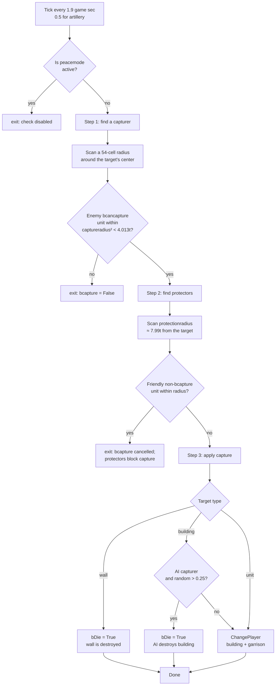

<a id="recon-механика-захвата"></a>
<a id="как-захватываются-здания-и-юниты"></a>
# How Buildings and Units Are Captured

[← How the game works](../../README.md)

This article explains the capture mechanic using `lib/miscext.script`,
especially `_misc_CheckCapture` and `_misc_ChangePlayer`. Code
references and Pascal excerpts are collected under [Sources](#sources).

<a id="коротко-о-главном"></a>
## TL;DR

Cossacks 3 has no Age of Empires II-style conversion. Capture is
purely **geometric**:

- Every N ticks the engine measures the Euclidean distance from the center
  the victim object to surrounding enemy units.
- If within the radius of `gc_gameplay_captureradius` (≈ 4 tiles) there is
  enemy unit with flag `bcancapture`, and in radius
  `gc_gameplay_protectionradius` (≈ 8 tiles) does not have its own defender unit
  with `bprotector` - the object changes owner (or dies if
  it is set to `bDie`).
- Priests are **healers**, not capturers. Their technical roles
  `priest`, `pope`, `mullah`, and `padre` use negative damage for
  healing and are unrelated to `captureradius`.

---

<a id="1-константы"></a>
## 1. Constants

Capture radii [^1]:
```
gc_gameplay_captureblockshotradius = 160 / gc_pixels_to_tile = 3.0 tile
gc_gameplay_captureradius          = 214 / 53.333          ≈ 4.013 tile
gc_gameplay_protectionradius       = 426 / 53.333          ≈ 7.987 tile
gc_gameplay_resourceDropRadius     = 3 tile
*Sqr — the same values squared (for Euclidean comparisons)
```
Ticks [^2]:
```
gc_unit_TimeCheckCapture    = 0.1*19  ≈ 1.9 game sec   (peasants + buildings)
gc_unit_TimeCheckCaptureArt = 0.1*5   ≈ 0.5 game sec   (artillery — checked more often)
```
Metric - **Euclidean²** [^3]: `(px, py)` - position of the victim object,
`(tx, ty)` is the position of the invader candidate. It's **center-to-center**, neither
Manhattan, nor Chebyshev. The shape of the building is NOT taken into account, only its
one-cell anchor.

Card settings `gMap.settings.additional.capture` [^4]:
```
0 capture_default            — all eligible objects can be captured (peasants, infantry, artillery)
1 capture_nopeasants         — peasants cannot be captured (default deathmatch + battles)
2 capture_nocenterspeasants  — peasants and Town Halls cannot be captured
3 capture_onlyartillery      — only artillery can be captured
```
All 4 values of the `capture` option with canonical Russian names are [`reports/map/lobby_settings.md`](../../../reports/map/lobby_settings.md#capture--правила-захвата). Engine behavior (how `capture` interacts with `peacetime` and territory ownership) - [`game_settings.md`](../map/game_settings.md) §3.4.

---

<a id="2-кто-может-быть-захвачен-bcapture--true"></a>
## 2. Who can be captured (`bcapture` = True)

Search for `objprop.bcapture := True` in unit scripts:

<a id="юниты"></a>
### Units

| Canonical name | Internal ID | Technical `usage` |
|---|---|---|
| Peasant or Serf | `peaaus`, `peatur`, `pearus`, `peapol`, `peaspa`, `peaeng`, `peaukr`, `peasco` | `peasant` |
| Cannon | `cannon` | `cannon` |
| Howitzer | `howitzer` | `mortar` |
| Bombard | `mortar` | `supermortar` |
| Multi-barrelled Cannon | `multicannon` | `mcannon` |
| Frame gun | `framegun` | `cannon` |

(Other types of units have `bcapture=False` → they cannot be captured, only killed.) [^5]

<a id="здания"></a>
### Buildings

In `_unit_InitBase`:
- `SetObjBuildingBaseSettings(objprop, True, …)` - the building is caught:
  - `commonsid+'sto'` = storage
  - `commonsid+'gol'/'iro'/'coa'` = mines
  - `csid+'cen'` = town center (`gc_obj_usage_center`, `bcapture=True`)
  - `csid+'bar'` / `csid+'ba2'` = barracks (`bcapture=True`)
  - `csid+'mil'` = mill (via the default mil block `bcapture` - taken
    from caller; in this block **NOT** is frayed, see below)
  - `csid+'bla'` = blacksmith (`bcapture=True`)
  - and others via `SetObjBuildingExtProperties(... True, ...)`
- `False` (= not captured, only destroyed):
  - `commonsid+'tow'` = tower (**towers CANNOT be captured**, only demolished)
  - `commonsid+'por'` = port
  - `commonsid+'swa/sga'`, `ukrwwa/wga` = walls/gates
  - `csid+'sta'` = stall
  - `csid+'aca'` = academy (`False`)
  - `csid+'dip'` = embassy (`False`)
  - `csid+'17'` = building 17 century (`False`)
  - `csid+'18'` = building 18 century (`False`)
  - `misblg/misblg2`, `misyurt`, `miscommandcenter` (mission objects) — `False`

See [^6] for specific line references.

Important rule: `bcancapture := not bcapture` [^7]. That is, a building with
`bcapture=True` cannot itself be an invader (logically, it is motionless),
and vice versa.

For non-buildings, the additional setting [^8] applies:

- **Any** ordinary unit that has `bcapture=False`
  becomes `bprotector` (protects its buildings) and `bcancapture` (can
  capture), **except a Peasant**.
- A **Peasant or Serf** (`bcapture=True`) is neither a protector nor
  a capturer; it is a passive capture target.
- Artillery (`bcapture=True`) is neither a protector nor a capturer
  (passive, only defends itself with fire).

⇒ A building is captured by **an ordinary enemy infantryman or
cavalryman, but not a Peasant or artillery piece**.

---

<a id="3-триггер-misccheckcapture--полный-псевдокод"></a>
<a id="3-проверка-захвата-misccheckcapture--полный-псевдокод"></a>
## 3. Capture check (`_misc_CheckCapture`) — full pseudocode

Source: `_misc_CheckCapture` [^9]. Check logic in three steps:

For the complete pseudocode of the procedure, see [^10]. High-level logic step by step:

**Preparation.** `pobj` is the victim object, `scangrid` is its scan grid cell.
If `peacemode` is active and the current cell is not enemy, check
comes out immediately. Scan radius for grid-cells: `rx1 = floor(214/4) + 1 = 54`.
Candidate mask: if `bneutral` - enemy mask, otherwise - own for the owner of the cell.

**Step 1 - find the invader.** Loop through grid-cells in radius `rx1`. In each
cell with a suitable mask is called `_unit_SearchCapturersForWall` (for
walls) or `_unit_SearchCapturers` (for others). If a candidate is found -
The Euclidean square of the distance to the victim is checked:

- the wall catches any non-building enemy (even peasant);
- an ordinary building - only a `bcancapture` unit, and not on the water.

When `distSqr < captureradiusSqr (≈ 4.013² tile)` rises `bcapture`,
`capturerHnd` is remembered. If even closer (`< 3² tile`) - cocked
`bblockshot` (victim shooting plug).

`_unit_SearchCapturers` is looking for a unit with the conditions `not bbuilding && bcancapture`,
`(myplmask & plmask) <> 0` and `pl <> mercenaryInd`. Wall version not
requires `bcancapture`, that is, anyone from the enemy infantry breaks the wall
(actually capture = death of the wall).

**Step 2 - protectors.** If the victim is a building / art unit, and (for a wall)
`hp >= maxhp/3`:

- *2a.* If the victim is NOT a peasant and the invader is VERY close
  (`bblockshot`), set `attackdelay := max(attackdelay, 100*gc_frames_to_time)`
  (≈ 3.125 g-sec stub).
- *2b.* Radius `rx2 = floor(426/4) + 1`, we go around the cells with my units.
  `_unit_SearchProtectors` is looking for a unit with `pobjprop.bprotector && not bbuilding`
  and `(myplmask & plmask) = 0`. If found and `not pobjprop2.bcapture`
  and `distSqr < protectionradiusSqr` - `bcapture := False` (capture
  is cancelled, the cycle continues for counter `protectorsCount`).
- *2c.* AI art logic (if the victim is `bartillery`, AI owner):
  at certain ratios `capCount / protCount` (see [^10])
  unit commits suicide (`SetTagStates(essential_death)`) - except
  `bEasy` or passing `random > 0.5`.

**Step 3 - Apply.** If `bcapture` remains `True`:

- Unit not yet born (`essential_birth & statetag`) and visible -
  just dies.
- Otherwise, with `(statetag & visual_hide) = 0`:
  - Walls always die (`pobjprop.bwall ⇒ bDie := True`).
  - Non-building: `_unit_Stop(goHnd)`.
  - Building: produce/upgrade orders, `ClearOrders`, `SetSTO=0` are cancelled.
  - If the owner-AI loses the building: with a 75% chance destruction will be triggered
    (slowdeath/`bDie`). For AI and peasant art units - separate
    chances of suicide (see [^10] - supermortar ≈ 41.5%, cannon ≈ 60.9%,
    mortar ≈ 85.9%, peasant in `bEasy` ≈ 45.3%).
  - If an AI invader picks up a peasant in hard mode, the peasant dies,
    but does not go to him.
  - Otherwise - `_misc_ChangePlayer(goHnd, newPlHnd, bCapture=True, ...)`.

**Key Observations:**
- Capture requires **only** one captor in radius. Capture time = 0
  (instantly when tick). The player sees the "capture time" as
  `gc_unit_TimeCheckCapture` ≈ 1.9 g-sec until next check.
- Ticks with random offset (`random*gc_unit_TimeCheckCapture`) during init/serialize,
  so that buildings do not check everything at the same time (load-balancing).
- **Walls are not captured** - they are automatically `bDie := True`. This explains
  why “capturing a wall equals breaking a wall.” Condition in step 2: `if not (bwall && hp<maxhp/3)` —
  walls below 1/3 HP do not trigger protector logic and do not block fire, which makes
  their defense is useless at low HP.
- **Towers** have `bcapture=False` ⇒ do not call `_misc_CheckCapture`.
They cannot be captured at all.
- **Garrison**: when capturing a building, `_misc_ChangePlayer` recursively changes
  owner of all units inside (`pObjInside`) [^11]. Production
  orders are canceled, returning resources.

<a id="триггеры-где-вызывается-misccheckcapture"></a>
<a id="где-вызывается-проверка-misccheckcapture"></a>
### Where `_misc_CheckCapture` is called

| Source | Condition | Period |
|---|---|---|
| unit-side trigger [^12] | `pobjprop.bcapture and bplayable`. Only if `default OR bart OR (only_artillery and bart)`. | TimeCheckCapture (1.9s) or TimeCheckCaptureArt (0.5s) for art. |
| building under construction [^13] | `not arg_obj.bbuilt` (construction) - regardless of `bcapture`! | TimeCheckCapture |
| building post-construction [^14] | `pobjprop.bcapture` after construction. Takes into account map-setting, with `only_artillery` - buildings are NOT checked. | TimeCheckCapture |

⚠️ **Building under construction** is ALWAYS checked for capture (even towers during construction!). This explains why an unfinished tower can be captured - but as soon as it is completed, `bcapture=False` disables the check.

---

<a id="4-захват-юнитов"></a>
## 4. Capture units

### Who can be captured as a unit

- Peasant or Serf of any nation (internal pattern `pea*`).
- Cannon (`cannon`), Howitzer (`howitzer`), Bombard (`mortar`),
  Multi-barrelled Cannon (`multicannon`), and Frame gun (`framegun`).

This is all. Infantry, cavalry, and ships **cannot be captured** (only killed).

### Who captures the unit
Any ordinary infantryman or cavalryman satisfying
`bcancapture && not bbuilding && not peasant`; neither the Peasant
nor the captured artillery piece qualifies.

<a id="кого-можно-захватить-как-юнита"></a>
<a id="что-становится-с-захваченным"></a>
### What happens to the captured
- A Peasant or Serf changes owner through `_misc_ChangePlayer`.
  Carried resources are retained, and AI behaviour restarts.
- An artillery piece changes owner while its ammunition remains in
  `weapon.cost`; production delays are reset.
- A captured unit **leaves its formation**
  (`_misc_SquadChangePlayer`), breaking an artillery formation.

<a id="кто-захватывает"></a>
<a id="по-умолчанию-в-deathmatch-и-historical-battle"></a>
<a id="стандартные-правила-в-на-смерть-и-историческом-сражении"></a>
### Default in Deathmatch and Historical Battle

Both modes set `capture_nopeasants` [^15], so **in standard
In matches, peasants are not captured**, only killed. Capture peasant
only possible in skirmish with the `capture_default` setting.

---

<a id="5-нейтральные-объекты-клады-мерценарий"></a>
<a id="5-нейтральные-объекты-клады-и-наёмники"></a>
## 5. Neutral objects, treasures, and mercenaries

<a id="нейтральные-игроки-gplayeribneutral"></a>
### Neutral players (`gPlayer[i].bneutral`)
- Field `bneutral : Boolean` in TPlayer [^16].
- Used in **missions/scenarios** [^17] - scripters can
  toggle `bneutral=true/false` for diplomacy. In multiplayer /
  random maps **this flag is not active** for regular players.

<a id="mercenary-player-index--maxplayer-1--особый-виртуальный-игрок"></a>
<a id="наёмники-технический-игрок-maxplayer-1"></a>
### Mercenary (player index = MaxPlayer-1 = special virtual player)
- `gc_player_mercenaryind = gc_MaxPlayerCount-1` [^18].
- Units with `bmercenary=True` (mercenary, recruited to the Diplomatic center)
  with `brebellion=True` the owner has a chance of **defect to mercenary
  player** [^19]. That is, mercenaries “go” to neutral in case of bankruptcy
  (no gold). This is NOT an enemy takeover.
- Mercenary units **are not considered captors** [^20] - filter in
  `_unit_SearchCapturers`.

<a id="treasure--chest--clad"></a>
<a id="сокровища-и-сундуки"></a>
### Treasure/chest/clad
**Not found**. Searches `treasure|chest|clad|gc_obj_usage_treasure|stash`
do not produce results in scripts. There are no neutral treasures in Cossacks 3
on the map, like in C1 (Sich Rebellion in C1 had “treasures”, in C3 this mechanic
removed).

<a id="нейтральные-крестьяне-на-карте"></a>
### Neutral peasants on the map
`SetupStartingResources` (see recon/world/map/map_generation_pipeline.md)
spawns **18 peasants in a 6x3 grid** at the start of the game - **all of them are already
belong to the player**, are not neutral. Other neutral units on
no map.

<a id="нейтральные-здания"></a>
### Neutral buildings
No. All buildings on the map are the property of the players or mercenary-player when
defect.

---

<a id="6-захват-башен-специфика"></a>
## 6. Capture towers (specifics)
All towers (`commonsid+'tow'`, `misblg`, `misblg2`) have **`bcapture=False`** [^21].

- They DO NOT call `_misc_CheckCapture` after construction.
- The tower does not have garrison slots (`peasantabsorber=0`, `transport=0`,
  see [^21] and [`5.3 Tower`](building_mechanics.md#53-tower--built-in-cannon)
  in `building_mechanics.md`), so the question is “what happens to the garrison
  upon destruction" is not applicable to the tower. For other buildings with `peasantabsorber>0`
  or `transport>0` (center, barracks, transport ships) upon destruction
  `_unit_DestroyObj` [^22] is triggered, which causes
  `_unit_DoUnitsGoOutside(list, bDead=True, ...)`. In this mode the procedure
  sets `essential_death` to each unit in the list [^23] - that is
  the contents are killed at the same time as the building.
- **Exception:** during construction (when `arg_obj.bbuilt=False`), any
  the building is being checked for capture [^13]. Therefore **unfinished tower
  can be captured** by a regular infantry unit by approaching closer than 4 tiles.

---

<a id="7-конверсия-priest-как-конвертер"></a>
<a id="7-священники-лечат-а-не-обращают-противника"></a>
## 7. Priests heal; they do not convert enemies

**No such mechanics.**
- `bpriest` - [^24] flag, used only in [^25].
- Logic: when a priest “attacks” a unit with `bpriest=True` attacker,
  `damage := indamage` (original, without protection), then
  `pobj2.hp := pobj2.hp + damage` ⇒ **treatment**, not conversion.
- There are no `_misc_ChangePlayer` in the priest code.
- Units with the priest role (`pope`, `mullah`, `padre`, `priest`) - all
  listed in [^26], all have `bpriest=True` through [^27].

⇒ A Priest in Cossacks 3 is a **healer** using negative damage. It
never changes the target's owner.

---

<a id="8-capture-радиус--точные-числа"></a>
<a id="8-точные-радиусы-захвата"></a>
## 8. Exact capture radii
```
Metric:            Euclidean²  (Sqr(dx)+Sqr(dy) < radiusSqr)
Reference points:  center to center (game-object position X/Z)
Distance:          in tiles (1 tile = 53.333 px)
captureradius      ≈ 4.0125 tiles ≈ 1.6 m at game scale (1 tile = 0.5 m? see determinism)
                   = 214 px game-source units
captureblockshot   = 3.0 tiles    (suppresses the target's fire)
protectionradius   ≈ 7.987 tiles  (protector zone; cancels capture)
```
⇒ To capture a building, an infantry unit needs to approach **an anchor point
buildings** at a distance of < 4,013 tiles (Euclidean). If the building occupies
large footprint (eg 5x4 center), in fact the invader can
stand further than the “edge” - the function uses **center point**
(game-object position), not bbox. Test: the point is usually close
to the geometric center of the building, but not identical, especially for
asymmetrical buildings.

---

<a id="9-что-ещё-требует-проверки"></a>
## 9. What still needs verification

1. **Exact position (`px`, `py`) near the building** is the center of the model, the center of bbox,
   or anchor-point? `GetGameObjectPositionXByHandle/ZByHandle` - needed
   trace empirically (build a barracks, walk peasant to the edge, measure
   min-distance to alarm event capture).
2. **`bAutoKill`** in Step 3 - the variable is declared, but never
   assigned to `_misc_CheckCapture`. Perhaps this is legacy code from C1,
   where AutoKill was enabled for certain types; now remains always
   False.
3. For `wall` (walls): `_unit_SearchCapturersForWall` does NOT require
   `bcancapture`. This means peasants and artillery can also “break”
   wall through the capture mechanism (and not just attack). Check
   empirically in skirmish with `peacetime=off` + wall + peasant without
   attack commands
4. Artillery is checked more often (0.5 s vs. 1.9 s) - means that it
   capture 4x faster. This is consistent with user-perception: "art unit
   instantly lost when the cavalry approaches.” But `_misc_CheckCapture`
   itself is instantaneous - delays are only in periodicity. You can
   empirically measure max-time-to-capture as `≤ 0.5 game sec`.
5. How does the check interact with FOG of war? If the victim is in someone else's FOW,
   the check continues anyway (server-authoritative).
6. **`bsearchminattackradius`** on guns - is there a connection between the capture
   and the fact that the weapon switched to close combat?

---

<a id="источники"></a>
## Sources

All links are relative to `data/scripts/` in the Cossacks 3 installation.

[^1]: Gripping radius constants - `dmscript.global:207-220`:
    ```pascal
    gc_gameplay_captureblockshotradius = 160 / gc_pixels_to_tile;
    gc_gameplay_captureradius          = 214 / gc_pixels_to_tile;
    gc_gameplay_protectionradius       = 426 / gc_pixels_to_tile;
    gc_gameplay_resourceDropRadius     = 3;
    ```
[^2]: Tick periods - `dmscript.global:1478-1480`:
    ```pascal
    gc_unit_TimeCheckCapture    = 0.1 * 19;
    gc_unit_TimeCheckCaptureArt = 0.1 * 5;
    ```
[^3]: Metric `Euclidean²` - `lib/miscext.script:1017-1018`:
    ```pascal
    distSqr := Sqr(px-tx) + Sqr(py-ty);
    if distSqr < gc_gameplay_captureradiusSqr then ...
    ```
[^4]: Card settings `gMap.settings.additional.capture` - `dmscript.global:1072-1075`:
    ```pascal
    gc_capture_default            = 0;
    gc_capture_nopeasants         = 1;
    gc_capture_nocenterspeasants  = 2;
    gc_capture_onlyartillery      = 3;
    ```
[^5]: Units with `bcapture=True` - `lib/unit.script`:1199 (peaaus / peatur / pearus / peapol / peaspa / peaeng / peaukr / peasco), 1721 (cannon), 1753 (howitzer), 1785 (mortar), 1812 (multicannon), 1843 (framegun).

[^6]: Buildings with `bcapture` to `_unit_InitBase` - `lib/unit.script`. From `bcapture=True`: 2205 (warehouse), 2312 (mines), 2371 (center), 2421 (barracks), 2514 (blacksmith). From `bcapture=False`: 2153 (port), 2224 (tower), 2259/2286 (walls/gates), 2452 (embassy), 2462 (17), 2472 (18), 2493 (academy), 2503 (stall), 2540 (mission objects).

[^7]: Rule `bcancapture := not bcapture` - `lib/unit.script:469`.

[^8]: Defaults `bprotector` / `bcancapture` for non-buildings - `lib/unit.script:2096-2097`:
    ```pascal
    objprop.bprotector  := not objprop.bcapture;
    objprop.bcancapture := (not objprop.bcapture) and (objprop.usage <> gc_obj_usage_peasant);
    ```
[^9]: `_misc_CheckCapture` - `lib/miscext.script:961-1185`.

[^10]: Full pseudocode `_misc_CheckCapture` - `lib/miscext.script:961-1185`:
    ```pascal
    procedure _misc_CheckCapture(goHnd):
      pobj      := target object
      scangrid  := its scan-grid cell
      bneutral  := (not gbool_peacemode) or (owner-of-grid <> my pl)
      if not bneutral: return                          // skip during peace time when the nearby grid is ours

      bwall    := pobjprop.bwall
      enemyplmask := gPlayer[my pl].enemyplmask
      rx1 := floor(214/4) + 1 = 54  → scan radius in grid cells
      capturePlMask := bneutral ? enemyPlMask : myPlMask-of-grid-owner

      // -------- Step 1: find a capturer --------
      bcapture := False; capturerCount := 0; bblockshot := False
      for each grid cell within rx1 of scangrid:
        if the cell contains enemyplmask units:
          trgHnd := bwall ? _unit_SearchCapturersForWall(...) : _unit_SearchCapturers(...)
          if trgHnd != 0:
             pobjprop2 = ObjProp(trgHnd)
             // Walls accept any enemy non-building (even a peasant);
             // normal buildings accept only a bcancapture unit that is not on water.
             if bwall or (not (pobjprop2.bcapture or pobjprop2.media=water)):
                distSqr := (px-tx)² + (py-ty)²
                if distSqr < captureradiusSqr (≈4.013² tile):
                   bcapture := True
                   capturerCount += 1
                   capturerHnd := trgHnd
                   if distSqr < captureblockshotradiusSqr (3² tile):
                      bblockshot := True

      // _unit_SearchCapturers finds a unit satisfying:
      //   not bbuilding && bcancapture && (myplmask & plmask)<>0
      //                                   && pl <> mercenaryInd
      // _unit_SearchCapturersForWall is the same WITHOUT the bcancapture requirement
      //   (that is, any enemy infantry can break, or "capture," a wall);
      //   capture here effectively means wall death (bDie=True below).

      // -------- Step 2: target is a building/artillery by a wall and hp >= maxhp/3 --------
      if bcapture and (not (bwall and TObj(pobj).hp < maxhp/3)):

         // 2a. If the target is NOT a peasant and the capturer is very close (<3 tiles),
         //     suppress building fire for 100 frames (≈3.125 game sec):
         if usage<>peasant and bblockshot:
            attackdelay := max(attackdelay, 100*gc_frames_to_time)

         // 2b. Find protectors within protectionradius (~7.99 tiles)
         rx2 := floor(426/4) + 1
         for grid cells within rx2 (only cells containing my myplmask units):
            trgHnd := _unit_SearchProtectors(...) — finds a unit with pobjprop.bprotector
                                                    && not bbuilding && (myplmask & plmask)=0
            if trgHnd != 0:
               if not pobjprop2.bcapture:
                  if distSqr < protectionradiusSqr:
                     bcapture := False; protectorsCount += 1; (but the loop continues)

         // 2c. AI artillery logic: when the target is bartillery, pl=AI,
         //     and there are too many protectors, commit suicide:
         if gPlayer[my pl].bai and pobjprop.bartillery:
            if (capCount>=protCount and protCount=1) or
               (capCount>3 and protCount=2)        or
               (capCount>7 and protCount=3)        or
               (capCount>10 and protCount=4):
               if (not bEasy) or (random>0.5):
                  SetTagStates(goHnd, essential_death); exit

      // -------- Step 3: apply capture --------
      if bcapture:
         statetag := GetGameObjectStatesTag(goHnd)
         // A visible unit that has not spawned yet (essential_birth) simply dies:
         if not bbuilding and (essential_birth & statetag) and (not visual_hide):
            SetTagStates(essential_death); exit

         if (statetag & visual_hide) = 0:
            if bbuilding or (essential_none & statetag) <> 0:
               bDie := False; bAutoKill := False  // bAutoKill is not assigned explicitly in the code
               if bAutoKill or pobjprop.bwall:
                  bDie := True                    // WALLS always die; they are never transferred

               if not bbuilding:
                  _unit_Stop(goHnd)
               else:
                  cancel produce/upgrade orders;  ClearOrders;  SetSTO=0

               newPlHnd := capturer's player;  newPlInd := that player's index

               // Alarm event for the captured player:
               if my pl == InterfaceIO_pl:
                  _misc_DoAlarm(capturerHnd, goHnd, alarmevent_capture)

               // ---- AI capturer: sometimes destroys instead of capturing ----
               if gPlayer[my pl].bai:        // AI loses the building
                  if bbuilding:
                     if random > 0.25:        // 75% chance of entering destruction
                        if bbuilt and pobjprop.bslowdeath and hp>1999:
                           hp := 1999 - floor(RandomExt*300)   // slow death
                        else:
                           bDie := True
                  else:                       // peasant/artillery unit
                     if usage=peasant and not bEasy:
                        bDie := True          // hard+: AI destroys its peasant before capture
                     else case usage of
                        supermortar: if random>0.585     then bDie := True   // ≈41.5% suicide
                        cannon:      if random>0.391     then bDie := True   // ≈60.9% suicide
                        mortar:      if random>0.141     then bDie := True   // ≈85.9% suicide
                        peasant:     if random>0.547     then bDie := True   // ≈45.3% when bEasy
               else if gPlayer[newPlInd].bai and usage=peasant and not bEasy:
                  bDie := True                 // inverse case: an AI capturer "kills" the peasant on hard

               if bDie: SetTagStates(essential_death)
               else:    _misc_ChangePlayer(goHnd, newPlHnd, bCapture=True, bCustom=False, bLAN=True)
    ```
[^11]: Recursive garrison bypass in `_misc_ChangePlayer` - `lib/miscext.script:932-933`.

[^12]: Unit-side capture trigger - `units/unit.inc/nothing.inc:507-535`.

[^13]: Building under construction — `units/building.inc/nothing.inc:300-304`.

[^14]: Building post-construction - `units/building.inc/nothing.inc:311-326`.

[^15]: Defaults in Deathmatch and Historical Battle are `lib/map.script:276,283` (both modes are set to `capture_nopeasants`).

[^16]: Field `bneutral : Boolean` in `TPlayer` is `lib/classes.script:3698`.

[^17]: Using `bneutral` in scripts - `lib/scenario.script:2181-2238`.

[^18]: `gc_player_mercenaryind = gc_MaxPlayerCount-1` - `dmscript.global:776`.

[^19]: Defect of mercenaries with `brebellion` — `units/unit.inc/nothing.inc:487-505`:
    ```pascal
    if gPlayer[plInd].brebellion and pobjprop.bmercenary and plInd<>mercenaryInd:
       if random_check_per_difficulty:
          _misc_ChangePlayer(myHnd, plMercHnd, False, False, True);
    ```
[^20]: Mercenary filter in `_unit_SearchCapturers` - `lib/unit.script:4656`:
    ```pascal
    (TObj(pobj).pl <> gc_player_mercenaryind)
    ```
[^21]: Towers (`commonsid+'tow'`, `misblg`, `misblg2`) with `bcapture=False` - `lib/unit.script:2224, 2540`. Parameters `peasantabsorber=0`, `transport=0` for the tower - `lib/unit.script:2223-2224`.

[^22]: `_unit_DestroyObj` for buildings with a garrison - `lib/miscext2.script:4232-4242`.

[^23]: `_unit_DoUnitsGoOutside` puts `essential_death` when `bDead=True` — `lib/unit.script:4559-4564`.

[^24]: Flag `bpriest` - `lib/classes.script:3645`.

[^25]: Logic priest “heals, does not convert” - `lib/miscext2.script:362-399`.

[^26]: Units with the priest role (`pope`, `mullah`, `padre`, `priest`) - `lib/country.script:2741-2744`.

[^27]: Setting `bpriest=True` for priest units - `lib/unit.script:1151+`.

[^28]: Candidate search functions: `_unit_SearchCapturers` - `lib/unit.script:4639-4664`; `_unit_SearchCapturersForWall` - `lib/unit.script:4666-4691`; `_unit_SearchProtectors` - `lib/unit.script:4615-4637`.

[^29]: Defaults `bcapture` / `bcancapture` / `bprotector` for buildings - `lib/unit.script:467-471`.

[^30]: `_misc_ChangePlayer` - `lib/miscext.script:892-959`.
