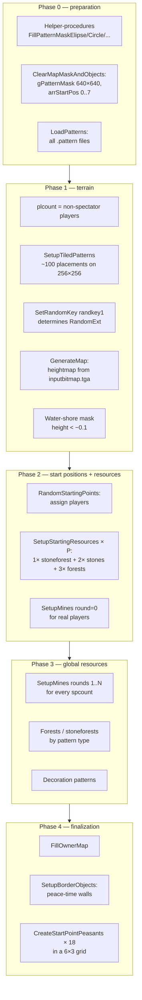

<a id="recon-pipeline-генерации-карты"></a>
<a id="как-создаётся-случайная-карта"></a>
# How a Random Map Is Generated

[← How the game works](../../README.md)

The game assembles a random map in five stages: preparation, terrain,
starting positions and nearby resources, remaining resources, and
finalization. In the engine this chain is performed by `DoGenerate`, started
through `ExecuteState('DoGenerate')` [^1]. Code references and Pascal excerpts
are collected in [Sources](#sources) at the end.

**Related documents:**

- [Resource gathering, §8](../economy/peasant_extraction.md) — densities
  (`frs_big`, `mnt`, ...) and distances from the center for mines.
- [Resource gathering, §8.4](../economy/peasant_extraction.md) — what a
  `.pattern` file is and how mask cells become environment objects.

<a id="коротко"></a>
## In brief

- The map is built in **five stages**: preparation → terrain → starting
  positions and nearby resources → remaining resources → finalization.
- The triple `(inputbitmap, randkey0, randkey1)` **fully determines the map**,
  allowing replays to reproduce it (see §12).
- Around each starting position there are three ellipses (`cCircle1/2/3`):
  inner (5 × 7 tiles) - only peasants, middle (12 × 15) -
  a guaranteed mixed stone-and-forest area (`stoneforest`), stones, and
  forests; the outer ellipse (22 × 18) holds another forest.
- `foreststype` always equals 0 for **every** map type: at the very beginning
  `DoGenerate` goes `var foreststype : Integer = floor(RandomExt*3); foreststype := 0;`
  [^2]. The random choice is overwritten by a constant, and `DoGenerate` is
  the only generation procedure common to all terrain modes.
  All forests therefore use the pine-and-spruce mixture from
  `case foreststype of 0`.
- In phase 4, `CreateStartPointPeasants` is always called - **18
  peasants** in a 6×3 grid, regardless of the `startingunits` option in the lobby.

<a id="1-глобальные-константы-объявлены-до-процедур"></a>
## 1. Global constants (declared before procedures)

Declarations of global constants [^3]:

- `cCircle1MaskX = 5`, `cCircle1MaskY = 7` - `forbidden zone`, there are only Phase-1 mines here.
- `cCircle2MaskX = 12`, `cCircle2MaskY = 15` — 1× stoneforest + 1× stones + 2× forests.
- `cCircle3MaskX = 22`, `cCircle3MaskY = 18` — 1× stones + 1× forest.
- `cBorderObjDist = 1` — peacetime wall spacing (tiles).

These are the **semi-axes of the ellipses** in `gPatternMask`, centered on each starting
point. Inside the ellipse `gPatternMask[x,y] := True` → nothing else can be placed
(no forest, no stones, no env player buildings). Ellipses are filled through
`_misc_FillPatternMaskElipse(pointx, pointy+2, rx, ry)` - **with +2 Y offset**
(the starting point is shifted upward relative to the center of the masks).

Also:

- `foreststype` is initialized as `floor(RandomExt*3)`, but immediately
  is overwritten by `0` [^2]. Corollary: Land **never** happens
  leaf-only (`foreststype=1`) or mixed-only (`foreststype=2`) maps. Only
  `foreststype=0` mix: `pinefir/spruce/pine/pine_big_2` (big),
  `pinefir/spruce/pine` (mid), `pinefir/pine` (small).
- `bDesert := (gMap.settings.gen.season=3)` — `season=3` switches everything
  pattern types at `desert_*`. For Land + any-other-season `bDesert=False`.
- `maphW := mapW div 2` - half the width of the map (used for tiny-corner
  snapping in `SetupMines` round 2).

---

<a id="2-pipeline-хронологический-порядок-файлы-от-вершины-dogenerate-вниз"></a>
<a id="2-порядок-генерации-карты"></a>
## 2. Map-generation sequence

General chronology (phases 0–4) - in the diagram:

Phase details below.

<a id="phase-0--подготовка"></a>
<a id="этап-0--подготовка"></a>
### Stage 0 — preparation

1. Helper procedures for masks (`FillPatternMaskElipse/Circle/Rectangle/MapBorder`) [^4].
2. Helper procedures for units and `UniqueStartingUnits`: nation-specific
   officers and drummers for a non-default starting army (`startingunits > default`) [^5].
3. `ClearMapMaskAndObjects` - cleaning `gPatternMask` (640×640), `arrStartPos[0..7]`, `arrStartPosBusy[i] := -1` [^6].
4. `_gui_ProcessProgressBar('progressbar.loadingenvironment')` → `LoadPatterns(True, False)` + `LoadPatterns(True, True)` - loads all `.pattern` files from `data/gen/patterns/*` [^7].

<a id="этап-1--рельеф-и-базовая-поверхность"></a>
### Stage 1 — terrain and base surface

5. Existing non-spectator players are counted in `plcount` [^8].
6. `SetupTiledPatterns('tiles')` — or `desert_tiles` in the desert — places
   background details such as dirt and cracks on a 25 × 25-tile grid. A
   256 × 256 map receives about **100 placements** [^9].
7. `SetRandomKey(randkey1)` sets the generator key, making all subsequent
   `RandomExt` calls reproducible [^10].
8. Relief (`relieftype`), terrain type (`terraintype`), and mine richness
   (`minesdensity`) are validated; invalid values are randomized. The built-in
   `ExecuteState('GenerateMap')` then creates a heightmap from the selected
   `inputbitmap.tga` and fills the map tiles [^11].
9. Shore and water cells with `height < -0.1` are blocked in
   `gPatternMask` [^12].
10. The Random mine setting (`minesdensity > 2`) is replaced with
    `floor(RandomExt*3)` [^13].
11. `_misc_SetDesert(False, False)` if `bDesert` [^14].

<a id="phase-1--terrain"></a>
<a id="этап-2--стартовые-позиции-и-ближайшие-ресурсы"></a>
### Stage 2 — starting positions and nearby resources

12. The C++ engine extracts starting positions from special markers in
    `inputbitmap.tga`. The script copies valid `gMap.players[i].startx/y`
    coordinates to `arrStartPos`; their number is stored in `spcount` [^15].
13. `_misc_FillPatternMaskMapBorder(3)` - the outer frame of 3 tiles wide is blocked by [^16].
14. **`RandomStartingPoints(spcount, minesdensity)`** [^17] assigns positions
    according to the team setting (see §3). For each player,
    `CreateStartPoint(...)`:
    - closes the inner zone with `_misc_FillPatternMaskElipse(...)`;
    - places the first round of nearby deposits with `SetupMines(...)`;
    - `SetupStartingResources(pointx, pointy)` — places ~5–6 clusters around (see §4).
15. A second `SetRandomKey(randkey1)` resets the generator so that details of
    the previous placement do not affect later stages [^18].

<a id="phase-2--старт-поинты"></a>
<a id="этап-3--рельеф-и-остальные-ресурсы"></a>
### Stage 3 — relief and remaining resources

16. `relieftype` cases: `plt/mnt/hil` are selected. Highlands (=3): `plt=0.000055`, `mnt=0.000120`, `hil=0.000050` [^19].
17. `frs_big=0.0009`, `frs_mid=0.0009`, `frs_small=0.00054`, `dcr=0.0005`, `stn1=0.00016`, `stn2=0.00012` [^20].
18. `_misc_GetFreePatternMaskModifier(...)` estimates the proportion of free
    cells by Monte Carlo. The result is multiplied by the map-size adjustment
    `640/((mapW+mapH)/2)`; for Tiny maps this is ×2.5 [^21].
19. Final densities: `pln_small/_mid/_large/_huge`, `swamp_*`, `lake_*`, `mnt/plt/hil` multiplied by `problarge` [^22].
20. `_misc_SetupPatternsByType(...)` for mountains/plateau (×3 parts)/ravine/hills [^23].
21. **Remaining deposits:** `SetupMines(...)` runs rounds `1..rounds-1`,
    creating the outer rings. Here `maxround = 0` means that no additional
    limit is imposed [^24].
22. The generator key is reset again with `SetRandomKey(randkey1)` [^25].
23. `_misc_SetupPatternsByType` for forests/stones/plain/swamp/lake - here `foreststype` dictates the branch (but always =0, so only `pine/spruce/pinefir` and mixed `pine_big_2`) [^26].

<a id="phase-4--старт-юниты--финализация"></a>
<a id="phase-3--relief-densities--phase-2-mines"></a>
<a id="этап-4--стартовые-юниты-и-завершение"></a>
### Stage 4 — starting units and finalization

24. **`for i:=0 to gc_MaxPlayerCount-1 do CreateStartPointPeasants(i, startx, starty)`** (or `CreateUniqueStartingUnits` if `startingunits>default`) [^27].
25. `_misc_PreloadTextures(True, True, True)` [^28].
26. `gbool_gui_mapgenerationfinished := True` [^29].
27. Environment objects are normalized for the season: `leaftree*` is
    removed in winter, and scale is clamped to `[scaleMin, scaleMax]` [^30].
28. Processing ticks are distributed among AI players
    (`gPlayer[i].progressTick := ...`) [^31].
29. `_player_SetupTeams(true)` [^32].
30. `gfloat_peacetime := _misc_GetPeaceTime(...)`; `gbool_peacemode := (peacetime <> default)` [^33].
31. **`FillOwnerMap(spcount)`** (see §5) [^34].
32. `if gbool_peacemode then SetupBorderObjects` (see §6) [^35].
33. `_misc_SetShoresCollision` [^36].
34. Color table per season (winter=6, desert=7, default=0; PHDR=1 for winter, 0 otherwise) [^37].
35. `TimeLog('Generation finished. relieftype=... minesdensity=...')` [^38].

---

<a id="3-randomstartingpointsplcount-minesdensity--раздача-игроков"></a>
<a id="3-как-игрокам-назначаются-стартовые-позиции"></a>
## 3. How starting positions are assigned

`RandomStartingPoints(plcount, minesdensity)` has two branches, selected by
the team setting (`gMap.settings.additional.teams`) [^17].

<a id="31-teams--nearby-союзники-рядом"></a>
<a id="31-союзники-рядом-teams--nearby"></a>
### 3.1 Allies nearby (`teams = nearby`)

1. Players are grouped by `team`: `0` means solo players and `1..4` are teams.
2. A team with only one member is moved into the solo group (`team[0]`).
3. For every multi-player team:
   - the generator is reset with `SetRandomKey(randkey1)` and advanced by the
     required number of steps;
   - the next team is selected randomly from `teamlist`;
   - `GenerateTeamStartingPoints(...)` chooses neighbouring positions with a
     greedy algorithm [^39]. The first position is random; every later
     position should be close to most of the existing ones, with total
     distance used as the tie-breaker;
   - the selected positions (`points`) are randomly assigned to team members.

<a id="32-teams--default-по-разным-углам"></a>
<a id="32-обычная-расстановка-teams--default"></a>
### 3.2 Standard placement (`teams = default`)

- All players belong to `team[0]`. For each one, the generator is reset with
  `SetRandomKey(randkey1)`, advanced by `i + 8` steps, and used to choose a
  random remaining position (`pointindex`).

In both cases, `CreateStartPoint(...)` is called for every player. It places
the first round of deposits and the nearby starting resources.

**Where `arrStartPos[].x/y` comes from.** The C++ engine reads
`inputbitmap.tga` and finds special-color pixels that mark starting positions.
The script receives their coordinates through `gMap.players[i].startx/starty`
and can only reassign players among those positions.

---

<a id="4-setupstartingresourcespointx-pointy--что-спавнится-возле-города"></a>
<a id="4-какие-ресурсы-появляются-возле-стартового-города"></a>
## 4. Resources placed near the starting Town Hall

`SetupStartingResources(pointx, pointy)` performs six placement stages. Each
tests up to 128 × 3 = 384 positions by varying angle and distance. It is
called from `CreateStartPoint` **after** the inner `cCircle1` zone is filled
[^40].

| # | Object | Minimum distance, tiles | Distance formula | Zone blocked afterward |
|--:|---|---:|---|---|
| 1 | Mixed stone-and-forest area (`stoneforests`; `desert_stoneforests` or `desert_forests_big` in desert) | `min(5,7) = 5` | `5 + RandomExt*3 + (i+j)*0.5` | — |
| 2 | `_FillPatternMaskElipse(cCircle2=12,15)` | — | — | Middle zone |
| 3 | Stones (`stones`) | `min(12,15) = 12` | `12 + RandomExt*3 + (i+j)*0.5` | — |
| 4 | Medium or large forest (`forests_pinefir/spruce/pine_*_medium/big`), twice | 12 | Same | — |
| 5 | Stones (`stones`) | `min(12,15) + 4 = 16` | `16 + RandomExt*2 + (i+j)*0.5` | — |
| 6 | One more medium or large forest (`forests_*_medium/big`) | 16 | Same | — |
| 7 | `_FillPatternMaskElipse(cCircle3=22,18)` | — | — | Outer zone |

**What does this mean for the player base:** within a radius of **5..22 tiles** from the city center there is ALWAYS guaranteed:

- 1× `stoneforests` (mixed wood+stone in one pattern, mask~152)
- 2× `stones` (mask~138 each)
- 3× `forests_*_big/medium` (mask 148..1631 depending on type)

Afterward, the area within 22 tiles is fully masked and the third stage cannot
place anything else there. **This is why the starting area reliably contains
enough wood for a Town Hall (`ratuse`) and the first Mill (`mill`).**

For desert replacement: `desert_stoneforests`/`desert_forests_big`/`desert_stones`/`desert_forests_medium/big`.

---

<a id="5-fillownermapspcount--кому-какая-клетка-принадлежит"></a>
<a id="5-как-карта-делится-между-игроками"></a>
## 5. How the map is divided among players

`FillOwnerMap(spCount)` uses breadth-first search (`BFS`) [^41]:

1. Init `gScanGrid[i,j]` (size `gc_scangrid_countx × gc_scangrid_county`): `owner=-1`, `dist=-1`, `fChecked=False`.
2. For each starting position: `_misc_PosToScanGridIndices(arrStartPos[i].x, .y, gridX, gridY)` → `gScanGrid[gridX,gridY].owner := arrStartPosBusy[i]` (player id), `dist := 0`.
3. BFS: while there are unprocessed cells on the current `dist` → distribute to 4 neighbors (i±1, j±1) the same owner with `dist+1`.

The result assigns every scan-grid cell to the nearest player by Manhattan
distance.

---

<a id="6-границы-во-время-мира"></a>
## 6. Peace-time borders

`SetupBorderObjects` runs **only while peace time is enabled**
(`gbool_peacemode`, or `peacetime ≠ 0`) [^42]. See
[Match settings](game_settings.md#32-peace-time-peacetime) for the full mechanic.

Idea: for each pair of neighboring cells `gScanGrid[i,j]` and `gScanGrid[i+1,j]` (as well as `[i, j+1]`):

- If `owner` is different → draw a chain of border objects between the centers of these cells.
- Step: `cBorderObjDist = 1` tile.
- On water: `gc_basename_ptborderwater`, on land: `gc_basename_ptborder`.
- The technical miscellaneous player (`gc_playerind_misc`) owns the objects;
  `GameObjectMakeUniqId` assigns unique identifiers.

**For our model:** peace time is currently ignored. With the normal no-peace-time
setting, these borders are absent and do not affect resource calculations.

---

<a id="7-createstartpointpeasantsplind-pointx-pointy--стартовые-крестьяне"></a>
<a id="7-как-размещаются-стартовые-крестьяне"></a>
## 7. How starting Peasants are placed

Algorithm [^43]:

- `count = 18` - ALWAYS 18 peasants.
- `cUnitR = 0.75` — grid step.
- For `i` from 0 to 17:
  - `px = pointx + (i div 3) * 0.75 + (0.5 - RandomExt) * 0.25 - (6 * 0.75)/2`
  - `pz = pointy + (i mod 3) * 0.75 + (0.5 - RandomExt) * 0.25 - (0 * 0.75)/2`
  - spawns a peasant in `(px, py, pz)`, face down (`SetGameObjectRollAngleByHandle = 180`).

**Grid:** 6 columns × 3 rows, 0.75 tiles apart, with random jitter of ±0.125.
Because `count mod 3 = 18 mod 3 = 0`, the Y-centering offset is zero. The
Z coordinates run from `pointy + 0` to `pointy + 1.5`, so the grid is shifted
downward rather than centered. X is centered correctly, from
`pointx - 2.25` to `pointx + 1.5`.

Coincides with the empirically observed **18 idle peasant** (verified 2026-04-29: 18 × (32 + 30) food/g-sec × 32/20000 × 120 g-sec ≈ 214 food, see also [economy guide](../../../reference/01_economy/README.md) §Famine).
If `gMap.settings.additional.startingunits > 0` (not "Default") → instead of 18 peasants, `CreateUniqueStartingUnits` is called (nation-specific unit: officer + drummer + several infantrymen). All 14 presets with canonical Russian names - [lobby settings](../../../reports/map/lobby_settings.md#startingunits--стартовая-армия); behavior - [match settings](game_settings.md) §3.1.

---

<a id="8-что-значит-phase-1-vs-phase-2-mines"></a>
<a id="8-как-размещаются-месторождения"></a>
## 8. How mineral deposits are placed

`SetupMines(pointx, pointy, minround, maxround, minesdensity, spcount)` is
called twice:

| Stage | `minround` | `maxround` | Rounds performed | Source |
|---|---:|---:|---|---|
| First call inside `CreateStartPoint` | 0 | 1 | `i := 0..0`, round 0 only | [^44] |
| Second call after terrain generation | 1 | 0 | `i := 1..rounds-1`, skipping round 0 | [^24] |

`if (maxround>0) and (rounds>maxround) then rounds := maxround;` ⇒ Phase 1 limits rounds=1; Phase 2 `maxround=0` → no override, uses full rounds=case minesdensity.

For **Rich (`minesdensity=2`) on Tiny (`mapsize>2`)** [version ≥80]:

- Phase 1: 1× round 0 × 3 resources = 3 close deposits (1g+1i+1c) at a distance of 14..22 tiles.
- Phase 2: rounds 1..4, but round 4 = `continue` on tiny ⇒ 3 outer rounds × 3 resources = 9 outer deposits.
- **Twelve deposits per player is an upper bound on attempts.** Each deposit
  receives up to 256 candidate positions. If none avoids `cCircle`, other
  mines, and a neighbour's starting position, the deposit is omitted. In
  practice a Tiny Rich map produces 9–12 deposits, depending on its generation
  key.

Special case: round 2 on tiny + spcount ≤ 4 (`version ≥ 90`) - `newpointx/y` is snapped to the corner of the map (`±maphW ∓ 24, ±maphH ∓ 24`) for the farthest deposits [^45]. These are “no man’s” mines in the corners, to which you need to go along the edge of the map.

---

<a id="9-версионные-различия-grecordgeneratorversion"></a>
## 9. Version differences (`gRecordGeneratorVersion`)

There are a lot of `if (gRecordGeneratorVersion < N) then …` in the code. The current vanilla game client (DLC5 era) has version ≥ 90+, which includes:

- DLC5 terrain types [^46].
- Distance table v90+ (mines round 2 = 70..82 on tiny, snap to corner).
- `gRecordGeneratorVersion < 53` → player handle 8 is deleted.
- `< 89` → 9, 10, 11 are deleted.

A mod developer can check `gRecordGeneratorVersion` via `data/game/var/data.cfg` or via git log of this file.

---

<a id="10-что-наша-симуляция-в-parser-и-compute-модулирует--упрощает"></a>
<a id="10-что-упрощает-наша-расчётная-модель"></a>
## 10. What our calculation model simplifies

A checklist of what the code `dogenerate.inc` does but we either ignore or approximate:

| Reality | Our simulation | Status |
|---|---|---|
| Engine reads starting positions (`arrStartPos`) from `inputbitmap.tga` | We set one position explicitly | Sufficient for one-player scenarios |
| Six `SetupStartingResources` stages with specific patterns | We use aggregate forest and stone density | **Rough:** starting resources are undercounted, but totals have been checked against replays |
| Blocked `cCircle1/2/3` zones | Not modelled explicitly | Their effect is partly absorbed by the measured placement rates (§14) |
| Nearby deposits, round 0 at 14–22 tiles | Modelled through `predicted_mines_per_type` | Validated: actual-to-predicted ratio is 1.00 |
| Second-round corner snapping on Tiny maps | Not modelled; distance remains 70–82 | Minor difference |
| Forest type always equals `0` | Land mixture assumed | Matches |
| Territory ownership and peace-time borders | Ignored | Harmless with the standard no-peace-time setting |
| 18 starting Peasants in a 6 × 3 grid | Fixed at 18 in configuration | Matches |
| Placement probability by pattern type | Measured per-type values replace the former universal 0.65 | Validated on ten homogeneous Tiny + Land + Highlands replays; ratios 0.96–1.04 |
| Desert patterns for `season = 3` | Not implemented | Needed for desert maps; 1 of 20 sample replays |
| Plains, mountains, swamps, hills, plateaus, and stone forests | Not predicted by `compute_counts` | **Open gap:** about 50% of clusters are outside the model |
| Deposit formula outside Land | Calculated as Land | **Open gap:** such replays yield an invalid player count |
| Allies-nearby placement | Not implemented | Sufficient for one-player scenarios |

---

<a id="14-проверка-расчётной-модели-по-реплеям"></a>
## 14. Validating the calculation model against replays

Since 29 April 2026, the model can be checked against real save and replay
files. This turns §10 from a list of hypotheses into measured results.

<a id="141-стек"></a>
### 14.1 Stack

| Script | Purpose |
|---|---|
| [`parser/parse_replay.py`](../../../../parser/parse_replay.py) | Reads OSWMap13 settings, the BMP preview, and occurrences of `.pattern` names |
| [`parser/parse_replay_aggregates.py`](../../../../parser/parse_replay_aggregates.py) | Aggregates a folder of `.rep`/`.map` files into `derived/replay_ground_truth.json` with per-replay and per-type cluster counts |
| [`compute/validate_map_predictions.py`](../../../../compute/validate_map_predictions.py) | Runs `compute_counts(...)` for every replay, compares prediction with reality, and writes the grouped [calibration table](../../../../internals_en/data/map_predictions_validation.md) |

For details about the OSWMap13 format, bucketing methodology and calibration numbers, see §14.2-14.5 below.

<a id="142-формат-oswmap13-карты"></a>
### 14.2 OSWMap13 (maps) format

`.rep` and `.map` files contain a binary snapshot:

- The header contains length-prefixed strings such as
  `"OSWMap13.Map.Ver[0.0]..."`, `"UID..."`, `"GameMapSnapShotBegin"`, a BMP
  image, `"GameMapSnapShotEnd"`, and `"GameMapRecordBegin"`.
- The body contains `(u32 keylen, ASCII key, u32 vallen, ASCII value)` pairs;
  numbers are serialized as ASCII strings.
- Placed `.pattern` filenames appear as printable strings, for example `mng_3`
  and `forests_pine_big_1`. **Each occurrence represents one cluster actually
  placed by the engine** and is therefore ground truth.

`playerscount`/`startid` **missing** in headers - must be derived via the mines formula (§14.4).

<a id="143-почему-выборку-нужно-делить-на-группы"></a>
### 14.3 Why the sample must be split into groups

⚠ A combined actual-to-predicted ratio can accidentally approach 1.0. Tiny
maps have a higher placement rate and were underpredicted; Huge maps have a
lower rate and were overpredicted. The errors cancel out. Validation must
therefore group data by `(mapsize, relieftype, terraintype, mask_kind)` and
report the combined result separately.

<a id="144-как-вывести-число-игроков-на-карте-суша"></a>
### 14.4 Inferring the player count on Land

For Land terrain, total mines per type encode P:
```
mines_per_type = P × (1 + n_after) + (spcount - P) × n_after
              = P + spcount × n_after

⇒ P = mng_count - spcount × n_after
```
Here `n_after` is the number of rounds after round 0, excluding round 4 on
Tiny maps. With Tiny, Rich or Medium deposits, and four starting positions,
values 14, 15, and 16 mean two, three, and four players respectively. A
two-player replay with `mng_count = 14` validates the formula.

For **non-Land** (`terraintype != 0`) the formula does not work (the engine logic is different - `CreateStartPoint`'s round 0 is likely not fire for non-Land). See §13 Q6.

<a id="145-измеренные-вероятности-размещения"></a>
### 14.5 Measured placement rates

The values are stored in
[`PER_TYPE_PLACEMENT_TINY_HIGHLANDS_LAND`](../../../../compute/compute_map_resources.py).
The sample contains ten Tiny + Land + Highlands replays with four starting
positions and a no-water mask (`Tiny+Land+Highlands+4pl_nowater`).

| Pattern type | Placement rate | Actual / predicted |
|---|---:|---:|
| `forests_pine_big` | 0.81 | 0.98 |
| `forests_pine_big_2` | 0.74 | 1.00 |
| `forests_pinefir_big` | 0.07 | 1.10 |
| `forests_spruce_big` | 0.20 | 1.00 |
| `forests_pine_medium` | 0.76 | 1.04 |
| `forests_pinefir_medium` | 0.09 | 0.75 (rounding error by 1.5→2) |
| `forests_spruce_medium` | 0.04 | 0.70 (rounding) |
| `forests_pine_small` | 0.64 | 0.96 |
| `forests_pinefir_small` | 0.03 | 0.80 |
| `stones` | 0.58 | 1.01 |
| Gold, iron, and coal (`mng/mni/mnc`) | Formula | 1.00 |

**Wide variance explained by pattern footprint size:**

- pine_big mask = 148 cells → fits almost anywhere → ~80% placement.
- pinefir_big mask = ~920 cells → 6× more → rarely fits → ~7%.
- spruce_big between them → ~20%.

⚠ Numbers are specific to **Tiny+Land+Highlands**. They should be different on the Huge map (more space → pinefir/spruce fit more often). Do not extrapolate without new replay data.

---

<a id="11-ключевые-файлы-pipeline"></a>
<a id="11-ключевые-файлы-алгоритма"></a>
## 11. Key algorithm files

| Purpose | File | Lines |
|---|---|---|
| Main orchestrator | `data/scripts/common.inc/dogenerate.inc` | 1-2103 |
| Entry point | `data/scripts/common.inc/initmapgen.inc` | 232 |
| Mission map option | `data/scripts/common.inc/dogeneratemissionmap.inc` | — |
| Engine RNG seed setup | `data/scripts/lib/map.script` | 322 (`GenerateMapRandKey`) |
| InputBitmap selection | `data/scripts/common.inc/generatemap.inc` | 179-216 |
| StandPattern (C++ inside) | `data/scripts/lib/misc.script` | 3390 (declaration only) |
| GenerateMap state | engine-builtin | called line 1565 |

---

<a id="12-seed-space--что-определяет-уникальную-карту"></a>
<a id="12-что-определяет-уникальную-карту"></a>
<a id="12-seed-space"></a>
## 12. What determines a unique map

With terrain type, map size, relief, mine richness, and player count fixed, a
map is uniquely specified by its base mask (`inputbitmap`) and generation keys
(`randkey0`, `randkey1`):

- `inputbitmap` - file from `data/gen/terrainmasks/<terrain>/<N>pl_*.tga`. Selected randomly by index `floor(RandomExt*count)` [^47]. The Engine reads .tga and extracts starting positions based on special markers in the mask → `gMap.players[i].startx/y`.
- `randkey0, randkey1` — 64-bit pair of RNG seeds (`SetRandomExtKey64`) [^48]. All subsequent `RandomExt` calls (placement of forests/stones/mines, selection of bitmap from the list) are determined by this pair.

**How many basic masks are there.** For 4 players:

| terrain folder | n_files |
|---|---:|
| `continent/` | 121 |
| `continents/` | 187 |
| `islands/` | 320 |
| `land/` | **230** |
| `mediterranean/` | 122 |
| `nowater/` | 42 |
| `nowater2/` | 33 |
| `peninsulas/` | 280 |

For Land with four players, there are **230 base map forms**.

**What does it give.**

1. **Bounded enumeration.** For Land + Tiny + four players + Highlands +
   Rich, the number of maps is 230 base forms multiplied by the number of key
   variants. The exact range is unknown, but the four-byte UI field is unlikely
   to expose more than `10⁹` useful values.
2. **Deterministic replay.** Given `inputbitmap`, `randkey0`, and `randkey1`,
   the map can be reproduced bit for bit, subject to engine determinism; see
   [the determinism audit](../../../../internals_en/engine/determinism_audit.md).
   Save filenames contain `randkey1`:
   `'game_v'+gSerialVersion+'k'+randkey1+'.map'` [^49].

3. **Precise tree-count calibration.** Five to ten generations with identical
   settings, followed by parsing environment objects from the save, can measure
   the mapping from a mask to its tree count. This would replace the current
   approximation `0.30 × mask_cells`.

**Limitations.** `GenerateMapRandKey` is built into the engine and its body is
not available [^50]. The exact range of `randkey0` and `randkey1` remains
unconfirmed.

---

<a id="13-открытые-вопросы-для-следующих-сессий"></a>
## 13. Open questions

1. **Exact starting positions (`arrStartPos`) in `inputbitmap.tga`.** The
   engine probably reads special RGB pixel codes. Manually decoding
   `data/gen/terrainmasks/land/4pl_*.tga` would reveal the exact positions for
   every mask and improve editor tooling and resource-distance predictions.

2. ~~**`_misc_GetFreePatternMaskModifier` values for Tiny + Highlands.**~~
   **Partly answered:** the modifiers themselves are unknown, but effective
   per-type placement rates have been calibrated from ten replays (§14.5).
   This is enough for practical calculations without reconstructing the Monte
   Carlo implementation.

3. **Does `SetupTiledPatterns` affect later object placement?** Roughly one
   hundred tiled patterns on a 256 × 256 map provide ground decorations such
   as cracks and mud. They may also block `gPatternMask`; this must be checked
   through `_misc_CheckStandPatternExt`.

4. **C++ functions `StandPatternWithAngle` and `_misc_FillPatternMaskBy*`.**
   Only declarations are available. Without disassembling the executable, a
   mask cell cannot be mapped exactly to an environment-object class such as
   `oak`, `leaftree`, or `decortree`.

5. **The live `gRecordGeneratorVersion` value.** This determines which branch
   of the deposit-distance table is used. It is probably at least 90 because
   second-round corner snapping matches sample replays, but this has not been
   confirmed. The extracted replay header `Build.Ver[X.Y.Z.NNNN]` may provide
   the answer.

6. **Deposit formula outside Land.** For Continents, Mediterranean, Coastal,
   Peninsulas, and Lakes (`terraintype != 0`), the number of gold deposits
   (`mng`) implies an impossible player count of zero or less (§14.4).
   `CreateStartPoint` may skip round 0, or the number of later rounds may
   differ. The relevant `dogenerate.inc` branches or `ExecuteState` code must
   be examined.

7. **Add plains, mountains, swamps, hills, plateaus, stone forests, and desert
   areas to `compute_counts`.** Their technical types (`plain`, `mountains`,
   `swamps`, `hills`, `plateaus`, `stoneforests`, `desert_*`) are placed
   outside the `foreststype` block and account for about half of the clusters
   found in replays.

8. **Dozens of `randkey0` and `randkey1` values for Land + Tiny + Highlands.**
   At least fifty replays with identical settings and only the key changed are
   needed to confirm that a key always produces the same cluster count, or to
   measure the variance. The ten current replays are not enough.

---

<a id="источники"></a>
## Sources

All links are relative to `data/scripts/` in the Cossacks 3 installation.

[^1]: `DoGenerate` entry point is `common.inc/initmapgen.inc:232`, main script is `common.inc/dogenerate.inc:1-2103` (2103 lines).
[^2]: `foreststype` initialization and forced override — `common.inc/dogenerate.inc:5-6`:
    ```pascal
    var foreststype : Integer = floor(RandomExt*3);
    foreststype := 0;
    ```
[^3]: Global constants `cCircle*`, `cBorderObjDist` - `common.inc/dogenerate.inc:407-416`.

[^4]: Helper-procedures for masks (`FillPatternMaskElipse/Circle/Rectangle/MapBorder`) - `common.inc/dogenerate.inc:1-78`.

[^5]: Helper-procedures for units and `UniqueStartingUnits` - `common.inc/dogenerate.inc:80-419`.

[^6]: `ClearMapMaskAndObjects` - `common.inc/dogenerate.inc:444-497`.

[^7]: `LoadPatterns` after the progress bar - `common.inc/dogenerate.inc:1284-1289`.

[^8]: Counting `plcount` non-spectator - `common.inc/dogenerate.inc:1291-1296`.

[^9]: `SetupTiledPatterns('tiles')` - `common.inc/dogenerate.inc:1535`.

[^10]: `SetRandomKey(randkey1)` (first seed) - `common.inc/dogenerate.inc:1538`.

[^11]: Resolve `relieftype/terraintype/minesdensity` + `ExecuteState('GenerateMap')` - `common.inc/dogenerate.inc:1542-1565`.

[^12]: Water shore mask (`height < -0.1`) — `common.inc/dogenerate.inc:1568-1581`.

[^13]: Random `minesdensity` if > 2 - `common.inc/dogenerate.inc:1585-1587`.

[^14]: `_misc_SetDesert(False, False)` - `common.inc/dogenerate.inc:1590`.

[^15]: Filling `arrStartPos` from `gMap.players[i].startx/y` - `common.inc/dogenerate.inc:1596-1611`.

[^16]: `_misc_FillPatternMaskMapBorder(3)` - `common.inc/dogenerate.inc:1613`.

[^17]: `RandomStartingPoints` - `common.inc/dogenerate.inc:1090-1229` (call to `1615`).

[^18]: Re-seed after `RandomStartingPoints` - `common.inc/dogenerate.inc:1616`.

[^19]: `relieftype` densities (`plt/mnt/hil`) - `common.inc/dogenerate.inc:1621-1650`.

[^20]: Basic density constants (`frs_big`, `dcr`, `stn1`, ...) - `common.inc/dogenerate.inc:1688-1693`.

[^21]: `_misc_GetFreePatternMaskModifier(...)` + map-size modifier - `common.inc/dogenerate.inc:1715-1725`.

[^22]: Final densities (`pln_*`, `swamp_*`, `lake_*`) - `common.inc/dogenerate.inc:1727-1739`.

[^23]: `_misc_SetupPatternsByType` for mountains/plateau/ravine/hills - `common.inc/dogenerate.inc:1745-1766`.

[^24]: Phase-2 mines cycle - `common.inc/dogenerate.inc:1768-1771`:
    ```pascal
    for i := 0 to spcount-1 do
       SetupMines(arrStartPos[i].x, arrStartPos[i].y, 1, 0, minesdensity, spcount);
    ```
[^25]: Re-seed after Phase-2 mines - `common.inc/dogenerate.inc:1772`.

[^26]: `_misc_SetupPatternsByType` for forests/stones/plain/swamp/lake - `common.inc/dogenerate.inc:1774-1908`.

[^27]: Cycle `CreateStartPointPeasants` / `CreateUniqueStartingUnits` - `common.inc/dogenerate.inc:1914-1923`.

[^28]: `_misc_PreloadTextures(True, True, True)` - `common.inc/dogenerate.inc:1925`.

[^29]: `gbool_gui_mapgenerationfinished := True` - `common.inc/dogenerate.inc:1939`.

[^30]: Seasonal normalization of env-objects - `common.inc/dogenerate.inc:1971-2027`.

[^31]: AI `progressTick` setup - `common.inc/dogenerate.inc:2031-2050`.

[^32]: `_player_SetupTeams(true)` - `common.inc/dogenerate.inc:2052`.

[^33]: `gfloat_peacetime` / `gbool_peacemode` - `common.inc/dogenerate.inc:2059`.

[^34]: `FillOwnerMap(spcount)` - `common.inc/dogenerate.inc:2062`.

[^35]: `SetupBorderObjects` (under `gbool_peacemode`) - `common.inc/dogenerate.inc:2064-2065`.

[^36]: `_misc_SetShoresCollision` - `common.inc/dogenerate.inc:2068`.

[^37]: Color table per season (winter=6, desert=7, default=0; PHDR=1 for winter) — `common.inc/dogenerate.inc:2075-2084`.

[^38]: Final `TimeLog('Generation finished. ...')` - `common.inc/dogenerate.inc:2100`.

[^39]: `GenerateTeamStartingPoints(teamcount, pointsbusy, points)` - `common.inc/dogenerate.inc:999-1088`.

[^40]: `SetupStartingResources(pointx, pointy)` - `common.inc/dogenerate.inc:720-978`.

[^41]: `FillOwnerMap(spCount)` - `common.inc/dogenerate.inc:1370-1428`.

[^42]: `SetupBorderObjects` - `common.inc/dogenerate.inc:1430-1527`.

[^43]: `CreateStartPointPeasants(plInd, pointx, pointy)` — `common.inc/dogenerate.inc:1231-1281`:
    ```pascal
    count := 18;
    cUnitR := 0.75;
    for i := 0 to count-1 do
    begin
       px := pointx + (i div 3) * cUnitR + (0.5 - RandomExt) * 0.25 - (6 * cUnitR)/2;
       pz := pointy + (i mod 3) * cUnitR + (0.5 - RandomExt) * 0.25 - (0 * cUnitR)/2;
       ...
       SetGameObjectRollAngleByHandle(goHnd, 180);
    end;
    ```
[^44]: Phase-1 mines inside `CreateStartPoint` - `common.inc/dogenerate.inc:985`.

[^45]: Tiny corner-snap for round 2 - `common.inc/dogenerate.inc:658-696` (version ≥ 90).

[^46]: DLC5 terrain types - `common.inc/dogenerate.inc:1555`.

[^47]: Select `inputbitmap` through `floor(RandomExt*count)` - `common.inc/generatemap.inc:179-191`.

[^48]: `SetRandomExtKey64(randkey0, randkey1)` - `common.inc/generatemap.inc:216`.

[^49]: The name of the save file with `randkey1` is `lib/miscext2.script:15` (`'game_v'+gSerialVersion+'k'+randkey1+'.map'`).

[^50]: `GenerateMapRandKey` - `lib/map.script:322` (engine-builtin, body unavailable).
