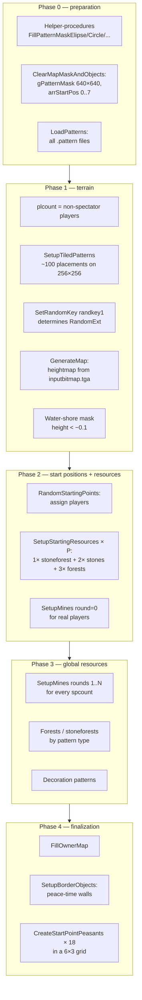

<a id="recon-pipeline-генерации-карты"></a>
<a id="как-создаётся-случайная-карта"></a>
# How a Random Map Is Generated

[← How the game works](../../README.md)

Full timeline `DoGenerate`. The entry point is `ExecuteState('DoGenerate')` [^1].
All links to code and Pascal blocks are collected in the [Sources](#sources) section
at the end of the document.

**Related documents:**

- [peasant_extraction.md §8](../economy/peasant_extraction.md) — densities
  (`frs_big`, `mnt`, ...) and distances from the center for mines.
- [peasant_extraction.md §8.4](../economy/peasant_extraction.md) - what is
  `.pattern` file and how `mask` cells are turned into env objects.

## TL;DR

- The map is built in **5 phases**: preparation → terrain → start points +
  starting resources → global resources → finalization.
- Three `(inputbitmap, randkey0, randkey1)` **determines the card**
  completely - so replays reproduce the same map (see §12).
- Around each starting position there are three ellipses (`cCircle1/2/3`):
  inner (5 × 7 tiles) - only peasants, middle (12 × 15) -
  guaranteed stoneforest + stones + forests, external (22 × 18) —
  another forest.
- `foreststype` always = 0 for **any** card type: at the very beginning
  `DoGenerate` goes `var foreststype : Integer = floor(RandomExt*3); foreststype := 0;`
  [^2] - The RNG selection is overwritten by a constant, and this `DoGenerate` -
  the only generation procedure common to all terrain modes.
  All forests on any map are a pine/spruce mix from the `case foreststype of 0` branch.
- In phase 4, `CreateStartPointPeasants` is always called - **18
  peasants** in a 6×3 grid, regardless of the `startingunits` option in the lobby.

<a id="1-глобальные-константы-объявлены-до-процедур"></a>
## 1. Global constants (declared before procedures)

Declarations of global constants [^3]:

- `cCircle1MaskX = 5`, `cCircle1MaskY = 7` - `forbidden zone`, there are only Phase-1 mines here.
- `cCircle2MaskX = 12`, `cCircle2MaskY = 15` — 1× stoneforest + 1× stones + 2× forests.
- `cCircle3MaskX = 22`, `cCircle3MaskY = 18` — 1× stones + 1× forest.
- `cBorderObjDist = 1` — peacetime wall spacing (tiles).

These are the **semi-axes of the ellipses** in `gPatternMask`, centered on each starting
point. Inside the ellipse `gPatternMask[x,y] := True` → nothing else can be placed
(no forest, no stones, no env player buildings). Ellipses are filled through
`_misc_FillPatternMaskElipse(pointx, pointy+2, rx, ry)` - **with +2 Y offset**
(the starting point is shifted upward relative to the center of the masks).

Also:

- `foreststype` is initialized as `floor(RandomExt*3)`, but immediately
  is overwritten by `0` [^2]. Corollary: Land **never** happens
  leaf-only (`foreststype=1`) or mixed-only (`foreststype=2`) cards. Only
  `foreststype=0` mix: `pinefir/spruce/pine/pine_big_2` (big),
  `pinefir/spruce/pine` (mid), `pinefir/pine` (small).
- `bDesert := (gMap.settings.gen.season=3)` — `season=3` switches everything
  pattern types at `desert_*`. For Land + any-other-season `bDesert=False`.
- `maphW := mapW div 2` - half the width of the map (used for tiny-corner
  snapping in `SetupMines` round 2).

---

<a id="2-pipeline-хронологический-порядок-файлы-от-вершины-dogenerate-вниз"></a>
## 2. Pipeline (chronological order, files from the top of DoGenerate down)

General chronology (phases 0–4) - in the diagram:

Phase details below.

<a id="phase-0--подготовка"></a>
### Phase 0 - preparation

1. Helper-procedures for masks (`FillPatternMaskElipse/Circle/Rectangle/MapBorder`) [^4].
2. Helper-procedures for units and `UniqueStartingUnits` (nation-specific officers/drummers under `startingunits>default`) [^5].
3. `ClearMapMaskAndObjects` - cleaning `gPatternMask` (640×640), `arrStartPos[0..7]`, `arrStartPosBusy[i] := -1` [^6].
4. `_gui_ProcessProgressBar('progressbar.loadingenvironment')` → `LoadPatterns(True, False)` + `LoadPatterns(True, True)` - loads all `.pattern` files from `data/gen/patterns/*` [^7].

### Phase 1 - terrain

5. Count `plcount` = existing non-spectator players [^8].
6. `SetupTiledPatterns('tiles')` (or `desert_tiles` if `bDesert`) - places background decoration-tiles (for example, dirt, cracks) on a 25×25-tile grid: `wcount = mapW div 25`, `hcount = mapH div 25`, the center of each block `realx = (x*25) + 12 - mapW/2 - 1`. For 256×256 this is ~10×10 ≈ **100 placements** [^9].
7. `SetRandomKey(randkey1)` - all subsequent `RandomExt` are determined by this seed [^10].
8. `relieftype`, `terraintype`, `minesdensity` resolved (random if outside the valid range). `pTerrainTypes` is selected (DLC5 or not depending on `gRecordGeneratorVersion`). `ExecuteState('GenerateMap')` - engine-builtin builds a heightmap from the selected `inputbitmap.tga`, fills the [^11] tiles.
9. Marker water shore: for each cell if `height < -0.1` → `gPatternMask[x,y] := True` [^12].
10. If `minesdensity > 2` (random) → `floor(RandomExt*3)` [^13].
11. `_misc_SetDesert(False, False)` if `bDesert` [^14].

<a id="phase-1--terrain"></a>
### Phase 2 - start points

12. Cycle by players: for each with a valid `startx/y` (`>= -mapW/2`) → `arrStartPos[i] := startx, starty`. **The `gMap.players[i].startx/y` coordinates themselves come from the C++ engine** - it calculates them when loading `inputbitmap.tga` (using special markers in the mask). `spcount` = number of players with a valid start [^15].
13. `_misc_FillPatternMaskMapBorder(3)` - the outer frame of 3 tiles wide is blocked by [^16].
14. **`RandomStartingPoints(spcount, minesdensity)`** [^17] - assigns players to `arrStartPos` taking into account the team option (see §3 below). Internally, `CreateStartPoint(plInd, pointx, pointy, minesdensity, plcount)` is called for each player, which does:
    - `_misc_FillPatternMaskElipse(pointx, pointy+2, cCircle1MaskX=5, cCircle1MaskY=7)` - closes the innermost zone.
    - `SetupMines(pointx, pointy, minround=0, maxround=1, minesdensity, spcount)` - **only round 0** (close mines).
    - `SetupStartingResources(pointx, pointy)` — places ~5–6 clusters around (see §4).
15. `SetRandomKey(randkey1)` — re-seed (placement details should not affect the following phases) [^18].

<a id="phase-2--старт-поинты"></a>
### Phase 3 - relief densities + Phase-2 mines

16. `relieftype` cases: `plt/mnt/hil` are selected. Highlands (=3): `plt=0.000055`, `mnt=0.000120`, `hil=0.000050` [^19].
17. `frs_big=0.0009`, `frs_mid=0.0009`, `frs_small=0.00054`, `dcr=0.0005`, `stn1=0.00016`, `stn2=0.00012` [^20].
18. `_misc_GetFreePatternMaskModifier(probsmall, probmid, problarge, probhuge)` — Monte-Carlo on free cells; then multiplied by the map-size modifier `640/((mapW+mapH)/2)`. For tiny it is ×2.5 [^21].
19. Final densities: `pln_small/_mid/_large/_huge`, `swamp_*`, `lake_*`, `mnt/plt/hil` multiplied by `problarge` [^22].
20. `_misc_SetupPatternsByType(...)` for mountains/plateau (×3 parts)/ravine/hills [^23].
21. **Phase-2 mines:** `for i:=0 to spcount-1 do SetupMines(arrStartPos[i].x, .y, minround=1, maxround=0, minesdensity, spcount)` - rounds 1..rounds-1 (outer rings). `maxround=0` means “not override”, because condition `if (maxround>0)` false [^24].
22. `SetRandomKey(randkey1)` - re-seed again [^25].
23. `_misc_SetupPatternsByType` for forests/stones/plain/swamp/lake - here `foreststype` dictates the branch (but always =0, so only `pine/spruce/pinefir` and mixed `pine_big_2`) [^26].

<a id="phase-4--старт-юниты--финализация"></a>
<a id="phase-3--relief-densities--phase-2-mines"></a>
### Phase 4 - starting units + finalization

24. **`for i:=0 to gc_MaxPlayerCount-1 do CreateStartPointPeasants(i, startx, starty)`** (or `CreateUniqueStartingUnits` if `startingunits>default`) [^27].
25. `_misc_PreloadTextures(True, True, True)` [^28].
26. `gbool_gui_mapgenerationfinished := True` [^29].
27. Seasonal normalization of env-objects: `leaftree*` is removed in winter; non-random scale clamping in `[scaleMin, scaleMax]` [^30].
28. AI setup: `gPlayer[i].progressTick := (cProgressAITick=16 div count)*ind` [^31].
29. `_player_SetupTeams(true)` [^32].
30. `gfloat_peacetime := _misc_GetPeaceTime(...)`; `gbool_peacemode := (peacetime <> default)` [^33].
31. **`FillOwnerMap(spcount)`** (see §5) [^34].
32. `if gbool_peacemode then SetupBorderObjects` (see §6) [^35].
33. `_misc_SetShoresCollision` [^36].
34. Color table per season (winter=6, desert=7, default=0; PHDR=1 for winter, 0 otherwise) [^37].
35. `TimeLog('Generation finished. relieftype=... minesdensity=...')` [^38].

---

<a id="3-randomstartingpointsplcount-minesdensity--раздача-игроков"></a>
## 3. `RandomStartingPoints(plcount, minesdensity)` - distribution of players

Two branches depending on `gMap.settings.additional.teams` [^17].

<a id="31-teams--nearby-союзники-рядом"></a>
### 3.1 `teams = nearby` (allies nearby)

1. Group players by `team` (5 teams: 0 = solo player, 1..4 = team).
2. If there is only 1 person in the team, we transfer him to `team[0]` (solo).
3. Sort `teamlist` (teams with >1 player) - for each:
   - `SetRandomKey(randkey1)` + advance i times.
   - Randomly select the starting command from `teamlist`.
   - Call `GenerateTeamStartingPoints(teamcount, pointsbusy, points)` [^39]: greedy greedy algorithm:
     - Take random the first point.
     - We select each next one as “the point to which the MOST of those already selected are closest” (if there is a tie in count → less total distance).
   - Randomly (via `SetRandomKey + RandomExt`) distribute `points` among team members.

<a id="32-teams--default-по-разным-углам"></a>
### 3.2 `teams = default` (different angles)

- All players in `team[0]`. For each: `SetRandomKey(randkey1) + advance(i+8)` → random `pointindex` from the remaining ones.

In both cases, the result is a call to `CreateStartPoint(player, x, y, minesdensity, plcount)` for each, which launches Phase-1 mines + StartingResources.

**Source `arrStartPos[].x/y`:** **C++ engine reads `inputbitmap.tga` and finds special colors (pixel markers of start points)**. The script gets them ready via `gMap.players[i].startx/starty`. The script can only rearrange players between ready points.

---

<a id="4-setupstartingresourcespointx-pointy--что-спавнится-возле-города"></a>
## 4. `SetupStartingResources(pointx, pointy)` - what spawns near the city

Six consecutive placement phases, each attempting up to 128×3 = 384 different positions (vary angle + distance). Called from `CreateStartPoint` **after** `cCircle1` has already been filled with [^40].

| # | Pattern type | mindst (tiles) | dst formula | After: mask |
|--:|---|---:|---|---|
| 1 | `stoneforests` (or `desert_stoneforests`/`desert_forests_big` for bDesert) | min(5,7)=5 | `5 + RandomExt*3 + (i+j)*0.5` | — |
| 2 | _FillPatternMaskElipse(cCircle2=12,15) | — | — | blocks medium zone |
| 3 | `stones` | min(12,15)=12 | `12 + RandomExt*3 + (i+j)*0.5` | — |
| 4 | `forests_pinefir/spruce/pine_*_medium/big` (×2 times, foreststype=0 → random pick of 7 options) | 12 | same | — |
| 5 | `stones` | min(12,15)+4 = 16 | `16 + RandomExt*2 + (i+j)*0.5` | — |
| 6 | `forests_*_medium/big` (1 more time) | 16 | same | — |
| 7 | _FillPatternMaskElipse(cCircle3=22,18) | — | — | blocks external zone |

**What does this mean for the player base:** within a radius of **5..22 tiles** from the city center there is ALWAYS guaranteed:

- 1× `stoneforests` (mixed wood+stone in one pattern, mask~152)
- 2× `stones` (mask~138 each)
- 3× `forests_*_big/medium` (mask 148..1631 depending on type)

After this, the area ≤22 tiles is completely masked - Phase 3 will not put anything else there. **This explains why at the beginning of the game there is always enough wood for ratuse + the first mill.**

For desert replacement: `desert_stoneforests`/`desert_forests_big`/`desert_stones`/`desert_forests_medium/big`.

---

<a id="5-fillownermapspcount--кому-какая-клетка-принадлежит"></a>
## 5. `FillOwnerMap(spCount)` - who owns which cell

Simple BFS [^41]:

1. Init `gScanGrid[i,j]` (size `gc_scangrid_countx × gc_scangrid_county`): `owner=-1`, `dist=-1`, `fChecked=False`.
2. For each starting position: `_misc_PosToScanGridIndices(arrStartPos[i].x, .y, gridX, gridY)` → `gScanGrid[gridX,gridY].owner := arrStartPosBusy[i]` (player id), `dist := 0`.
3. BFS: while there are unprocessed cells on the current `dist` → distribute to 4 neighbors (i±1, j±1) the same owner with `dist+1`.

Result: each cell of the scan-grid is marked with the ID of the nearest player (by Manhattan distance in grid units).

---

## 6. `SetupBorderObjects` — peacetime walls

Runs **only if `gbool_peacemode`** (i.e. `peacetime` ≠ 0) [^42]. Full description of peacetime mechanics - [`game_settings.md`](game_settings.md) §3.2.

Idea: for each pair of neighboring cells `gScanGrid[i,j]` and `gScanGrid[i+1,j]` (as well as `[i, j+1]`):

- If `owner` is different → draw a chain of border objects between the centers of these cells.
- Step: `cBorderObjDist = 1` tile.
- On water: `gc_basename_ptborderwater`, on land: `gc_basename_ptborder`.
- Objects are created in the misc player (`gc_playerind_misc`), `GameObjectMakeUniqId` for uniqueness.

**Implication for our sim:** we ignore peacetime. At default peacetime these walls are not placed → there is no need to model them.

---

<a id="7-createstartpointpeasantsplind-pointx-pointy--стартовые-крестьяне"></a>
## 7. `CreateStartPointPeasants(plInd, pointx, pointy)` - starting peasants

Algorithm [^43]:

- `count = 18` - ALWAYS 18 peasants.
- `cUnitR = 0.75` — grid step.
- For `i` from 0 to 17:
  - `px = pointx + (i div 3) * 0.75 + (0.5 - RandomExt) * 0.25 - (6 * 0.75)/2`
  - `pz = pointy + (i mod 3) * 0.75 + (0.5 - RandomExt) * 0.25 - (0 * 0.75)/2`
  - spawns a peasant in `(px, py, pz)`, face down (`SetGameObjectRollAngleByHandle = 180`).

**Grid:** 6 columns × 3 rows. Step 0.75 tiles. Random jitter ±0.125. **Quirk:** `count mod 3 = 18 mod 3 = 0`, so Y-centering offset = 0. Z-coordinates go from `pointy + 0` to `pointy + 1.5` (ie the grid is offset DOWN from the center, not centered). The X coordinates are centered correctly: `pointx - 2.25` to `pointx + 1.5`.

Coincides with the empirically observed **18 idle peasant** (verified 2026-04-29: 18 × (32 + 30) food/g-sec × 32/20000 × 120 g-sec ≈ 214 food, see also [`docs/reference/01_economy/README.md`](../../../reference/01_economy/README.md) §Famine).
If `gMap.settings.additional.startingunits > 0` (not "Default") → instead of 18 peasants, `CreateUniqueStartingUnits` is called (nation-specific unit: officer + drummer + several infantrymen). All 14 presets with canonical Russian names - [`reports/map/lobby_settings.md`](../../../reports/map/lobby_settings.md#startingunits--стартовая-армия); behavior - [`game_settings.md`](game_settings.md) §3.1.

---

<a id="8-что-значит-phase-1-vs-phase-2-mines"></a>
## 8. What does “Phase 1 vs Phase 2 mines” mean?

`SetupMines(pointx, pointy, minround, maxround, minesdensity, spcount)` is controlled by the flags:

| Challenge | minround | maxround | rounds total | Where |
|---|---:|---:|---|---|
| Phase 1 (inside `CreateStartPoint`) | 0 | 1 | i:=0..0 (round 0 only) | [^44] |
| Phase 2 (after relief) | 1 | 0 | i:=1..rounds-1 (round 0 skipped) | [^24] |

`if (maxround>0) and (rounds>maxround) then rounds := maxround;` ⇒ Phase 1 limits rounds=1; Phase 2 `maxround=0` → no override, uses full rounds=case minesdensity.

For **Rich (`minesdensity=2`) on Tiny (`mapsize>2`)** [version ≥80]:

- Phase 1: 1× round 0 × 3 resources = 3 close deposits (1g+1i+1c) at a distance of 14..22 tiles.
- Phase 2: rounds 1..4, but round 4 = `continue` on tiny ⇒ 3 outer rounds × 3 resources = 9 outer deposits.
- **Up to 12 deposits per player** is the number of _attempts_, 256 try each. If for an individual `(round, restype)` all 256 attempts did not find a valid position (there is no place without collisions with its own cCircle / other mines / neighbor's starting point), this mine simply does not appear. In practice, under Tiny in Rich mode you can get 9–12 mines; the exact number is a function of the specific card seed.

Special case: round 2 on tiny + spcount ≤ 4 (`version ≥ 90`) - `newpointx/y` is snapped to the corner of the map (`±maphW ∓ 24, ±maphH ∓ 24`) for the farthest deposits [^45]. These are “no man’s” mines in the corners, to which you need to go along the edge of the map.

---

<a id="9-версионные-различия-grecordgeneratorversion"></a>
## 9. Version differences (`gRecordGeneratorVersion`)

There are a lot of `if (gRecordGeneratorVersion < N) then …` in the code. The current vanilla game client (DLC5 era) has version ≥ 90+, which includes:

- DLC5 terrain types [^46].
- Distance table v90+ (mines round 2 = 70..82 on tiny, snap to corner).
- `gRecordGeneratorVersion < 53` → player handle 8 is deleted.
- `< 89` → 9, 10, 11 are deleted.

A mod developer can check `gRecordGeneratorVersion` via `data/game/var/data.cfg` or via git log of this file.

---

<a id="10-что-наша-симуляция-в-parser-и-compute-модулирует--упрощает"></a>
## 10. What our simulation in `parser/` and `compute/` modulates / simplifies

A checklist of what the code `dogenerate.inc` does but we either ignore or approximate:

| Reality | Our simulation | Status |
|---|---|---|
| Engine reads arrStartPos from inputbitmap.tga | We strictly set 1 startpos | OK for 1pl scripts |
| 6 placement phases of SetupStartingResources with specific templates | We consider aggregate forest/stone density | **Roughly** - starting resources are undercounted, but empirically validated through replay totals |
| cCircle1/2/3 forbidden zones | We do not explicitly take into account | Affects placement, partially taken into account through empirical placement_rate (see §14) |
| Phase 1 mines (round 0, 14..22 tiles) | Accounted for via `predicted_mines_per_type` | OK, **validated** ratio=1.00 (see §14) |
| Phase 2 corner-snap for round 2 on tiny | We do not take into account (we give 70..82 without snap) | Minor |
| foreststype always 0 | We mean Land mix → matches | OK |
| FillOwnerMap + peacetime borders | Ignore | OK for default peacetime |
| 18 starting peasants in 6x3 grid | Hard 18 in config | OK |
| Per-pattern-type placement rate | Previously: uniform 0.65. Now: empirical per-type table (see §14) | **Validated** on homogeneous Tiny+Land+Highlands bucket (n=10), ratios 0.96-1.04 |
| Season=3 → desert pattern types | Not implemented | TODO if you need desert (1/20 sample replays) |
| Plain / mountains / swamps / hills / plateaus / stoneforests | **Not predicted** `compute_counts` | **OPEN GAP** — ~50% of all clusters are not covered by the model |
| Non-Land mine formula | We count as Land | **OPEN GAP** — non-Land replays give inferred P=0 (see §14) |
| Random teams=nearby algorithm | Not implemented | OK for 1pl scripts |

---

<a id="14-проверка-расчётной-модели-по-реплеям"></a>
## 14. Empirical validation pipeline (replay-based ground truth)

**Since 2026-04-29:** there is infrastructure for *empirical* model validation against real save/replay files. This turns §10 from “hypotheses” into “measurements.”

<a id="141-стек"></a>
### 14.1 Stack

| Script | What does |
|---|---|
| [`parser/parse_replay.py`](../../../../parser/parse_replay.py) | OSWMap13 reader: extract settings (randkey0/1, maskname, mapsize, relieftype, terraintype, season, ...), BMP thumbnail, pattern-name occurrences |
| [`parser/parse_replay_aggregates.py`](../../../../parser/parse_replay_aggregates.py) | Folder of `.rep`/`.map` → `derived/replay_ground_truth.json` (per-replay + per-type cluster counts) |
| [`compute/validate_map_predictions.py`](../../../../compute/validate_map_predictions.py) | Each replay: run `compute_counts(...)` → diff vs actual → bucketed calibration table → `internals_en/data/map_predictions_validation.md` |

For details about the OSWMap13 format, bucketing methodology and calibration numbers, see §14.2-14.5 below.

<a id="142-формат-oswmap13-карты"></a>
### 14.2 OSWMap13 (maps) format

`.rep`/`.map` files are binary contained dump:

- Header: length-prefixed strings (`"OSWMap13.Map.Ver[0.0]Build.Ver[X.Y.Z.NNNN]Core.Ver[1]"`, `"UID..."`, `"GameMapSnapShotBegin"`, BMP, `"GameMapSnapShotEnd"`, `"GameMapRecordBegin"`)
- Body: `(u32 keylen, ASCII key, u32 vallen, ASCII value)` pairs. Numbers are serialized as ASCII strings.
- Pattern placements: `.pattern` file names appear verbatim as printable strings (`mng_3`, `forests_pine_big_1`, ...). **Each occurrence = one cluster placed by the engine** = ground truth.

`playerscount`/`startid` **missing** in headers - must be derived via the mines formula (§14.4).

### 14.3 Bucketing pitfall

⚠ Mixed-bucket averaging of per-type ratios can give ratio≈1.0 by chance: on Tiny the placement rate is high (the model underestimated), on Huge it is low (the model overestimated), they are compensated on average. Validator **required** buckets by `(mapsize, relieftype, terraintype, mask_kind)` and displays the per-bucket summary separately from the mixed one.

### 14.4 Player-count inference (Land only)

For Land terrain, total mines per type encode P:
```
mines_per_type = P × (1 + n_after) + (spcount - P) × n_after
              = P + spcount × n_after

⇒ P = mng_count - spcount × n_after
```
Where is `n_after = len(rounds 1..rounds-1, minus i=4 when Tiny)`. For Tiny+Rich/Medium+4pl: 14→2P, 15→3P, 16→4P. Validated on sample replay (mng=14 with a reported 2-player game → the formula is correct).

For **non-Land** (`terraintype != 0`) the formula does not work (the engine logic is different - `CreateStartPoint`'s round 0 is likely not fire for non-Land). See §13 Q6.

### 14.5 Calibrated placement rates (Tiny+Land+Highlands+4pl_nowater bucket, n=10)

[`PER_TYPE_PLACEMENT_TINY_HIGHLANDS_LAND`](../../../../compute/compute_map_resources.py) to `compute_map_resources.py`:

| pattern type | rate | bucket ratio actual/pred |
|---|---:|---:|
| `forests_pine_big` | 0.81 | 0.98 |
| `forests_pine_big_2` | 0.74 | 1.00 |
| `forests_pinefir_big` | 0.07 | 1.10 |
| `forests_spruce_big` | 0.20 | 1.00 |
| `forests_pine_medium` | 0.76 | 1.04 |
| `forests_pinefir_medium` | 0.09 | 0.75 (rounding error by 1.5→2) |
| `forests_spruce_medium` | 0.04 | 0.70 (rounding) |
| `forests_pine_small` | 0.64 | 0.96 |
| `forests_pinefir_small` | 0.03 | 0.80 |
| `stones` | 0.58 | 1.01 |
| mng/mni/mnc | (formula) | 1.00 |

**Wide variance explained by pattern footprint size:**

- pine_big mask = 148 cells → fits almost anywhere → ~80% placement.
- pinefir_big mask = ~920 cells → 6× more → rarely fits → ~7%.
- spruce_big between them → ~20%.

⚠ Numbers are specific to **Tiny+Land+Highlands**. They should be different on the Huge map (more space → pinefir/spruce fit more often). Do not extrapolate without new replay data.

---

<a id="11-ключевые-файлы-pipeline"></a>
<a id="11-ключевые-файлы-алгоритма"></a>
## 11. Key pipeline files

| What | Where | Strings |
|---|---|---|
| Chief orchestrator | `data/scripts/common.inc/dogenerate.inc` | 1-2103 |
| Entry point | `data/scripts/common.inc/initmapgen.inc` | 232 |
| Mission map option | `data/scripts/common.inc/dogeneratemissionmap.inc` | — |
| Engine RNG seed setup | `data/scripts/lib/map.script` | 322 (`GenerateMapRandKey`) |
| InputBitmap selection | `data/scripts/common.inc/generatemap.inc` | 179-216 |
| StandPattern (C++ inside) | `data/scripts/lib/misc.script` | 3390 (declaration only) |
| GenerateMap state | engine-builtin | called line 1565 |

---

<a id="12-seed-space--что-определяет-уникальную-карту"></a>
<a id="12-что-определяет-уникальную-карту"></a>
## 12. Seed space - what determines a unique map

With fixed parameters (terrain + mapsize + relief + mines + players), the map is uniquely specified by the pair `(inputbitmap, randkey0/randkey1)`:

- `inputbitmap` - file from `data/gen/terrainmasks/<terrain>/<N>pl_*.tga`. Selected randomly by index `floor(RandomExt*count)` [^47]. The Engine reads .tga and extracts starting positions based on special markers in the mask → `gMap.players[i].startx/y`.
- `randkey0, randkey1` — 64-bit pair of RNG seeds (`SetRandomExtKey64`) [^48]. All subsequent `RandomExt` calls (placement of forests/stones/mines, selection of bitmap from the list) are determined by this pair.

**How many basic masks are there.** For 4 players:

| terrain folder | n_files |
|---|---:|
| `continent/` | 121 |
| `continents/` | 187 |
| `islands/` | 320 |
| `land/` | **230** |
| `mediterranean/` | 122 |
| `nowater/` | 42 |
| `nowater2/` | 33 |
| `peninsulas/` | 280 |

For our scope (Land + 4pl) - **230 basic forms** cards.

**What does it give.**

1. **Bounded enumeration.** For (Land, Tiny, 4pl, Highlands, Rich) the total number of unique cards = 230 basic forms × K randkey variations. K is not known, but in a 4-byte UI seed field it is hardly > 10⁹; In reality, custom seeds lie in a much smaller range.
2. **Deterministic replay.** Knowing the triple `(inputbitmap, randkey0, randkey1)`, you can reproduce the bit-for-bit map (adjusted for engine RNG determinism, see [determinism_audit.md](../../../../internals_en/engine/determinism_audit.md)). Save files store `randkey1` in the name: `'game_v'+gSerialVersion+'k'+randkey1+'.map'` [^49].

3. **Precise calibration of trees-per-pattern.** 5-10 runs of map gen with fixed parameters, parsing env objects from save → empirical mapping `bitmap → tree count`. This will give an exact replacement for the current constant `0.30 × mask_cells`.

**Limitations.** `GenerateMapRandKey` - engine-builtin, body not available [^50]. The exact range of `randkey0/1` has not been confirmed.

---

<a id="13-открытые-вопросы-для-следующих-сессий"></a>
## 13. Open questions (for next sessions)

1. **Exact position of arrStartPos in inputbitmap.tga.** The Engine reads the markers in the mask (probably by special RGB pixel codes). Decode `data/gen/terrainmasks/land/4pl_*.tga` by hand - you can build an accurate start-positions map for each preset. Useful for editor-tooling and accurate prediction of distances to resources.

2. ~~**`_misc_GetFreePatternMaskModifier`** values for Tiny+Highlands.~~ **PARTIALLY ANSWERED** - modifiers themselves are not measured, but the per-type **effective placement rate** is now empirically calibrated for 10 replays (see §14.5). This covers practical use cases without having to decode Monte-Carlo internals.

3. **`SetupTiledPatterns` does it affect the placement of other objects?** ~100 tile-paterns at 256×256 are “ground decoration” (cracks, mud spots). Perhaps they also block `gPatternMask` for subsequent placement phases - you need to check the behavior through `_misc_CheckStandPatternExt`.

4. **C++ functions `StandPatternWithAngle`, `_misc_FillPatternMaskBy*`** - only declarations are available, not the body. This means the final mapping `mask cell → a specific env-object class` (oak vs leaftree vs decortree) is out of reach without disasm exe.

5. **gRecordGeneratorVersion live value** - you need to pull out the runtime value to know which branch of the mines distance table is actually used. Most likely ≥90 (Phase-2 round-2 corner-snap consistent with sample replays), but not exactly confirmed. You can check it via extracted replay header `Build.Ver[X.Y.Z.NNNN]`.

6. **Non-Land mine placement formula.** For `terraintype != 0` (continent / mediterranean / coastal / peninsulas / lakes) inferred player count from mng count gives nonsense (P=0 or negative - see §14.4). Hypothesis: `CreateStartPoint`'s round-0 `SetupMines` does not fire on non-Land (the engine uses a different code to generate starting positions without player-side rounds), or `n_after` is different. You need to read non-Land branches in `dogenerate.inc` or ExecuteState code.

7. **Plain / mountains / swamps / hills / plateaus / stoneforests / desert_* - add to `compute_counts`.** These pattern types are called *outside* the foreststype block (for mountains/plateau/ravine/hills [^23], the rest are somewhere nearby) and make up ~50% of all cluster occurrences according to replay data. You need to read the relevant sections and expand the model.

8. **Dozens of `randkey0` / `randkey1` values on Land + Tiny + Highlands** - you need to collect 50+ replays on the same settings and vary only `randkey` in order to either confirm determinism (the same `randkey` → the same cluster count), or measure the variance. Variance was not assessed on the 10 available replays.

---

<a id="источники"></a>
## Sources

All links are relative to `data/scripts/` in the Cossacks 3 installation.

[^1]: `DoGenerate` entry point is `common.inc/initmapgen.inc:232`, main script is `common.inc/dogenerate.inc:1-2103` (2103 lines).
[^2]: `foreststype` initialization and forced override — `common.inc/dogenerate.inc:5-6`:
    ```pascal
    var foreststype : Integer = floor(RandomExt*3);
    foreststype := 0;
    ```
[^3]: Global constants `cCircle*`, `cBorderObjDist` - `common.inc/dogenerate.inc:407-416`.

[^4]: Helper-procedures for masks (`FillPatternMaskElipse/Circle/Rectangle/MapBorder`) - `common.inc/dogenerate.inc:1-78`.

[^5]: Helper-procedures for units and `UniqueStartingUnits` - `common.inc/dogenerate.inc:80-419`.

[^6]: `ClearMapMaskAndObjects` - `common.inc/dogenerate.inc:444-497`.

[^7]: `LoadPatterns` after the progress bar - `common.inc/dogenerate.inc:1284-1289`.

[^8]: Counting `plcount` non-spectator - `common.inc/dogenerate.inc:1291-1296`.

[^9]: `SetupTiledPatterns('tiles')` - `common.inc/dogenerate.inc:1535`.

[^10]: `SetRandomKey(randkey1)` (first seed) - `common.inc/dogenerate.inc:1538`.

[^11]: Resolve `relieftype/terraintype/minesdensity` + `ExecuteState('GenerateMap')` - `common.inc/dogenerate.inc:1542-1565`.

[^12]: Water shore mask (`height < -0.1`) — `common.inc/dogenerate.inc:1568-1581`.

[^13]: Random `minesdensity` if > 2 - `common.inc/dogenerate.inc:1585-1587`.

[^14]: `_misc_SetDesert(False, False)` - `common.inc/dogenerate.inc:1590`.

[^15]: Filling `arrStartPos` from `gMap.players[i].startx/y` - `common.inc/dogenerate.inc:1596-1611`.

[^16]: `_misc_FillPatternMaskMapBorder(3)` - `common.inc/dogenerate.inc:1613`.

[^17]: `RandomStartingPoints` - `common.inc/dogenerate.inc:1090-1229` (call to `1615`).

[^18]: Re-seed after `RandomStartingPoints` - `common.inc/dogenerate.inc:1616`.

[^19]: `relieftype` densities (`plt/mnt/hil`) - `common.inc/dogenerate.inc:1621-1650`.

[^20]: Basic density constants (`frs_big`, `dcr`, `stn1`, ...) - `common.inc/dogenerate.inc:1688-1693`.

[^21]: `_misc_GetFreePatternMaskModifier(...)` + map-size modifier - `common.inc/dogenerate.inc:1715-1725`.

[^22]: Final densities (`pln_*`, `swamp_*`, `lake_*`) - `common.inc/dogenerate.inc:1727-1739`.

[^23]: `_misc_SetupPatternsByType` for mountains/plateau/ravine/hills - `common.inc/dogenerate.inc:1745-1766`.

[^24]: Phase-2 mines cycle - `common.inc/dogenerate.inc:1768-1771`:
    ```pascal
    for i := 0 to spcount-1 do
       SetupMines(arrStartPos[i].x, arrStartPos[i].y, 1, 0, minesdensity, spcount);
    ```
[^25]: Re-seed after Phase-2 mines - `common.inc/dogenerate.inc:1772`.

[^26]: `_misc_SetupPatternsByType` for forests/stones/plain/swamp/lake - `common.inc/dogenerate.inc:1774-1908`.

[^27]: Cycle `CreateStartPointPeasants` / `CreateUniqueStartingUnits` - `common.inc/dogenerate.inc:1914-1923`.

[^28]: `_misc_PreloadTextures(True, True, True)` - `common.inc/dogenerate.inc:1925`.

[^29]: `gbool_gui_mapgenerationfinished := True` - `common.inc/dogenerate.inc:1939`.

[^30]: Seasonal normalization of env-objects - `common.inc/dogenerate.inc:1971-2027`.

[^31]: AI `progressTick` setup - `common.inc/dogenerate.inc:2031-2050`.

[^32]: `_player_SetupTeams(true)` - `common.inc/dogenerate.inc:2052`.

[^33]: `gfloat_peacetime` / `gbool_peacemode` - `common.inc/dogenerate.inc:2059`.

[^34]: `FillOwnerMap(spcount)` - `common.inc/dogenerate.inc:2062`.

[^35]: `SetupBorderObjects` (under `gbool_peacemode`) - `common.inc/dogenerate.inc:2064-2065`.

[^36]: `_misc_SetShoresCollision` - `common.inc/dogenerate.inc:2068`.

[^37]: Color table per season (winter=6, desert=7, default=0; PHDR=1 for winter) — `common.inc/dogenerate.inc:2075-2084`.

[^38]: Final `TimeLog('Generation finished. ...')` - `common.inc/dogenerate.inc:2100`.

[^39]: `GenerateTeamStartingPoints(teamcount, pointsbusy, points)` - `common.inc/dogenerate.inc:999-1088`.

[^40]: `SetupStartingResources(pointx, pointy)` - `common.inc/dogenerate.inc:720-978`.

[^41]: `FillOwnerMap(spCount)` - `common.inc/dogenerate.inc:1370-1428`.

[^42]: `SetupBorderObjects` - `common.inc/dogenerate.inc:1430-1527`.

[^43]: `CreateStartPointPeasants(plInd, pointx, pointy)` — `common.inc/dogenerate.inc:1231-1281`:
    ```pascal
    count := 18;
    cUnitR := 0.75;
    for i := 0 to count-1 do
    begin
       px := pointx + (i div 3) * cUnitR + (0.5 - RandomExt) * 0.25 - (6 * cUnitR)/2;
       pz := pointy + (i mod 3) * cUnitR + (0.5 - RandomExt) * 0.25 - (0 * cUnitR)/2;
       ...
       SetGameObjectRollAngleByHandle(goHnd, 180);
    end;
    ```
[^44]: Phase-1 mines inside `CreateStartPoint` - `common.inc/dogenerate.inc:985`.

[^45]: Tiny corner-snap for round 2 - `common.inc/dogenerate.inc:658-696` (version ≥ 90).

[^46]: DLC5 terrain types - `common.inc/dogenerate.inc:1555`.

[^47]: Select `inputbitmap` through `floor(RandomExt*count)` - `common.inc/generatemap.inc:179-191`.

[^48]: `SetRandomExtKey64(randkey0, randkey1)` - `common.inc/generatemap.inc:216`.

[^49]: The name of the save file with `randkey1` is `lib/miscext2.script:15` (`'game_v'+gSerialVersion+'k'+randkey1+'.map'`).

[^50]: `GenerateMapRandKey` - `lib/map.script:322` (engine-builtin, body unavailable).
