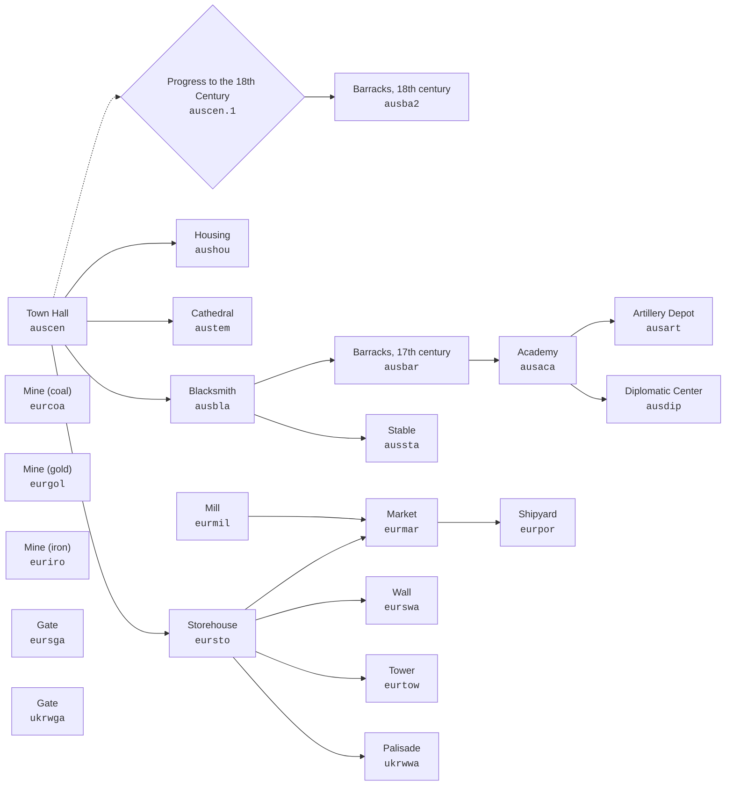

# Technology Tree by Nation

[← Tables and calculations](../README.md)

This reference shows what must be built or researched before each building,
unit, or upgrade becomes available. The canonical name appears first and
the internal identifier follows in code formatting.

Requirement columns show the canonical name, internal identifier, and kind of
each prerequisite. Several requirements separated by commas must all be met.
Building tables show the price of the first copy; see
[building price growth](../economy/scaling_prices.md) for later copies.

## Building Diagram: Austria

Each arrow runs from a requirement to the building it unlocks. The dotted
arrow connects the Town Hall to the advance to the 18th century. Most
nations use the same overall structure.

## Contents

| Nation | Buildings | Units | Key upgrades |
|---|---|---|---|
| **[Algeria](#alg--algeria-алжир)** | [buildings](#alg--здания) | [units](#alg--юниты) | [upgrades](#alg--ключевые-апгрейды-с-зависимостями) |
| **[Austria](#aus--austria-австрия)** | [buildings](#aus--здания) | [units](#aus--юниты) | [upgrades](#aus--ключевые-апгрейды-с-зависимостями) |
| **[Bavaria](#bav--bavaria-бавария)** | [buildings](#bav--здания) | [units](#bav--юниты) | [upgrades](#bav--ключевые-апгрейды-с-зависимостями) |
| **[Denmark](#den--denmark-дания)** | [buildings](#den--здания) | [units](#den--юниты) | [upgrades](#den--ключевые-апгрейды-с-зависимостями) |
| **[England](#eng--england-англия)** | [buildings](#eng--здания) | [units](#eng--юниты) | [upgrades](#eng--ключевые-апгрейды-с-зависимостями) |
| **[France](#fra--france-франция)** | [buildings](#fra--здания) | [units](#fra--юниты) | [upgrades](#fra--ключевые-апгрейды-с-зависимостями) |
| **[Hungary](#hun--hungary-венгрия)** | [buildings](#hun--здания) | [units](#hun--юниты) | [upgrades](#hun--ключевые-апгрейды-с-зависимостями) |
| **[Netherlands](#net--netherlands-нидерланды)** | [buildings](#net--здания) | [units](#net--юниты) | [upgrades](#net--ключевые-апгрейды-с-зависимостями) |
| **[Piedmont](#pie--piedmont-пьемонт)** | [buildings](#pie--здания) | [units](#pie--юниты) | [upgrades](#pie--ключевые-апгрейды-с-зависимостями) |
| **[Poland](#pol--poland-польша)** | [buildings](#pol--здания) | [units](#pol--юниты) | [upgrades](#pol--ключевые-апгрейды-с-зависимостями) |
| **[Portugal](#por--portugal-португалия)** | [buildings](#por--здания) | [units](#por--юниты) | [upgrades](#por--ключевые-апгрейды-с-зависимостями) |
| **[Prussia](#pru--prussia-пруссия)** | [buildings](#pru--здания) | [units](#pru--юниты) | [upgrades](#pru--ключевые-апгрейды-с-зависимостями) |
| **[Russia](#rus--russia-россия)** | [buildings](#rus--здания) | [units](#rus--юниты) | [upgrades](#rus--ключевые-апгрейды-с-зависимостями) |
| **[Saxony](#sax--saxony-саксония)** | [buildings](#sax--здания) | [units](#sax--юниты) | [upgrades](#sax--ключевые-апгрейды-с-зависимостями) |
| **[Scotland](#sco--scotland-шотландия)** | [buildings](#sco--здания) | [units](#sco--юниты) | [upgrades](#sco--ключевые-апгрейды-с-зависимостями) |
| **[Spain](#spa--spain-испания)** | [buildings](#spa--здания) | [units](#spa--юниты) | [upgrades](#spa--ключевые-апгрейды-с-зависимостями) |
| **[Sweden](#swe--sweden-швеция)** | [buildings](#swe--здания) | [units](#swe--юниты) | [upgrades](#swe--ключевые-апгрейды-с-зависимостями) |
| **[Switzerland](#swi--switzerland-швейцария)** | [buildings](#swi--здания) | [units](#swi--юниты) | [upgrades](#swi--ключевые-апгрейды-с-зависимостями) |
| **[Turkey](#tur--turkey-турция)** | [buildings](#tur--здания) | [units](#tur--юниты) | [upgrades](#tur--ключевые-апгрейды-с-зависимостями) |
| **[Ukraine](#ukr--ukraine-украина)** | [buildings](#ukr--здания) | [units](#ukr--юниты) | [upgrades](#ukr--ключевые-апгрейды-с-зависимостями) |
| **[Venice](#ven--venice-венеция)** | [buildings](#ven--здания) | [units](#ven--юниты) | [upgrades](#ven--ключевые-апгрейды-с-зависимостями) |

## Algeria (`alg`)

### Buildings

| Building | Build time (game s) | Cost | Population | Requires |
| --- | ---: | --- | ---: | --- |
| **Minaret** (`algaca`) | 156.2 | wood 1,450, stone 1,100 | — | Barracks (`algbar`; building) |
| **Artillery Depot** (`algart`) | 245.9 | wood 100, stone 1,000, coal 1,400 | — | Minaret (`algaca`; building) |
| **Barracks** (`algbar`) | 93.8 | wood 400, stone 400 | 50 | Blacksmith (`algbla`; building) |
| **Blacksmith** (`algbla`) | 109.4 | wood 100, stone 30, iron 640 | — | Town Hall (`algcen`; building) |
| **Town Hall** (`algcen`) | 156.2 | wood 450, stone 700 | 50 | — |
| **Diplomatic Center** (`algdip`) | 312.5 | wood 4,600, stone 2,020 | — | Minaret (`algaca`; building) |
| **Housing** (`alghou`) | 31.2 | wood 100, stone 100 | 25 | Town Hall (`algcen`; building) |
| **Stable** (`algsta`) | 156.2 | wood 1,000, stone 2,200 | — | Blacksmith (`algbla`; building) |
| **Mosque** (`algtem`) | 93.8 | wood 1,000, stone 1,200, iron 500 | — | Town Hall (`algcen`; building) |
| **Mine** (`eurcoa`) | 93.8 | wood 100, stone 100 | — | — |
| **Mine** (`eurgol`) | 93.8 | wood 100, stone 100 | — | — |
| **Mine** (`euriro`) | 93.8 | wood 100, stone 100 | — | — |
| **Bazaar** (`turmar`) | 234.4 | wood 450, stone 150 | — | Mill (`turmil`; building), Storehouse (`tursto`; building) |
| **Mill** (`turmil`) | 93.8 | wood 30, stone 150 | — | — |
| **Shipyard** (`turpor`) | 1562.5 | wood 800, stone 800, iron 400 | — | Bazaar (`turmar`; building) |
| **Gate** (`tursga`) | 120.0 | stone 60 | — | — |
| **Storehouse** (`tursto`) | 31.2 | wood 30, stone 10 | — | Town Hall (`algcen`; building) |
| **Wall** (`turswa`) | 120.0 | stone 60 | — | Storehouse (`tursto`; building) |
| **Tower** (`turtow`) | 984.4 | wood 150, stone 90, gold 100 | — | Storehouse (`tursto`; building) |
| **Gate** (`ukrwga`) | 5.6 | wood 10 | — | — |
| **Palisade** (`ukrwwa`) | 5.6 | wood 10 | — | Storehouse (`tursto`; building) |

### Units

| Unit | Training time (game s) | Cost | Trained at | Requires |
| --- | ---: | --- | --- | --- |
| **Archer** (`archer`) | 1.50 | food 20, wood 2, gold 1 | Barracks (`algbar`) | — |
| **Archer (mercenary)** (`archerdip`) | 1.25 | gold 15 | Diplomatic Center (`algdip`) | Minaret (`algaca`; building), Town Hall (`algcen`; building) |
| **Turkish archer (mercenary)** (`archerturdip`) | 1.25 | gold 15 | Diplomatic Center (`algdip`) | Minaret (`algaca`; building), Town Hall (`algcen`; building) |
| **Ship of the Line** (`battleship`) | 390.00 | wood 9,000, gold 3,200, iron 700, coal 6,500 | Shipyard (`turpor`) | Design new rib system and new hulls (battleship construction) (`algaca.29`; upgrade), Artillery Depot (`algart`; building) |
| **Cannon** (`cannon`) | 75.00 | wood 250, gold 400, iron 400 | Artillery Depot (`algart`) | Blacksmith (`algbla`; building) |
| **Sich Cossack (mercenary)** (`cossacksichdip`) | 2.50 | gold 60 | Diplomatic Center (`algdip`) | Minaret (`algaca`; building), Town Hall (`algcen`; building) |
| **Dragoon, 18th century (mercenary)** (`dragoon18dip`) | 2.00 | gold 120 | Diplomatic Center (`algdip`) | Minaret (`algaca`; building), Town Hall (`algcen`; building) |
| **Drummer, 17th century** (`drummertur`) | 4.00 | food 30, gold 15 | Barracks (`algbar`) | Minaret (`algaca`; building) |
| **Ferry** (`ferry`) | 56.00 | wood 300, gold 50, iron 100 | Shipyard (`turpor`) | Artillery Depot (`algart`; building) |
| **Boat** (`fishboat`) | 40.00 | wood 600 | Shipyard (`turpor`) | — |
| **Galley** (`galley`) | 50.00 | wood 9,500, gold 900, iron 800 | Shipyard (`turpor`) | Artillery Depot (`algart`; building) |
| **Grenadier (mercenary)** (`grenadierdip`) | 1.50 | gold 25 | Diplomatic Center (`algdip`) | Minaret (`algaca`; building), Town Hall (`algcen`; building) |
| **Howitzer** (`howitzer`) | 94.00 | wood 250, gold 350, iron 300 | Artillery Depot (`algart`) | Blacksmith (`algbla`; building) |
| **Light cavalry (mercenary)** (`lightcavalrydip`) | 2.00 | gold 120 | Diplomatic Center (`algdip`) | Minaret (`algaca`; building), Town Hall (`algcen`; building) |
| **Light Infantryman** (`lightinfantry`) | 1.00 | food 25, iron 1 | Barracks (`algbar`) | — |
| **Light Infantryman (mercenary)** (`lightinfantrydip`) | 1.25 | gold 4 | Diplomatic Center (`algdip`) | Minaret (`algaca`; building), Town Hall (`algcen`; building) |
| **Mameluke** (`mameluke`) | 12.00 | food 100, wood 5, gold 8 | Stable (`algsta`) | — |
| **Bombard** (`mortar`) | 25.00 | wood 100, gold 75, iron 200 | Artillery Depot (`algart`) | Blacksmith (`algbla`; building) |
| **Mullah** (`mullah`) | 15.00 | food 30, gold 10 | Mosque (`algtem`) | — |
| **Officer** (`officertur`) | 7.50 | food 50, gold 100 | Barracks (`algbar`) | Minaret (`algaca`; building) |
| **Peasant** (`peatur`) | 12.50 | food 100 | Town Hall (`algcen`) | — |
| **Ottoman Pikeman** (`pikemantur`) | 5.50 | food 55, gold 5 | Barracks (`algbar`) | Blacksmith (`algbla`; building) |
| **Roundshier (mercenary)** (`roundshierdip`) | 1.50 | gold 12 | Diplomatic Center (`algdip`) | Minaret (`algaca`; building), Town Hall (`algcen`; building) |
| **Test object** (`unitbox`) | 3.12 | food 100 | — | — |
| **Xebec** (`xebec`) | 230.00 | wood 7,000, gold 1,600, iron 320, coal 960 | Shipyard (`turpor`) | Develop new woodworking methods (xebec building) (`algaca.6`; upgrade), Artillery Depot (`algart`; building) |

### Key Upgrades

| Upgrade | Research time (game s) | Cost | Requires |
| --- | ---: | --- | --- |
| **Research improved additions to gunpowder formula (artillery range +5%)** (`algaca.16`) | 15.6 | gold 2,000 | Artillery Depot (`algart`; building) |
| **Design new barrel types: unicorn, carronade (artillery range +10%)** (`algaca.17`) | 15.6 | stone 3,000, gold 4,550 | Artillery Depot (`algart`; building) |
| **Design more durable gun carriage: Gribovalle system (artillery durability +50%)** (`algaca.18`) | 15.6 | gold 500, iron 3,830, coal 1,500 | Artillery Depot (`algart`; building) |
| **Research new sighting devices for artillery (artillery accuracy +35%)** (`algaca.20`) | 15.6 | wood 3,540, gold 2,000, coal 7,250 | Artillery Depot (`algart`; building) |
| **Finance artillery repair shops (repair all artillery)** (`algaca.21`) | 15.6 | wood 350, gold 100, coal 250 | Artillery Depot (`algart`; building) |
| **Develop mathematics (artillery accuracy +35%)** (`algaca.27`) | 15.6 | wood 9,540, gold 12,000, coal 65,200 | Artillery Depot (`algart`; building) |
| **Design new rigging types (ship speed +40%)** (`algaca.28`) | 15.6 | gold 1,900 | Shipyard (`turpor`; building) |
| **Design new rib system and new hulls (battleship construction)** (`algaca.29`) | 15.6 | wood 32,300, gold 6,800, iron 9,000, coal 12,800 | Shipyard (`turpor`; building) |
| **Train carpenters (shipbuilding speed x10)** (`algaca.30`) | 15.6 | stone 42,700 | Shipyard (`turpor`; building) |
| **Design new tackle and fishing nets (boat efficiency +100%)** (`algaca.5`) | 15.6 | wood 12,400, gold 2,520 | Shipyard (`turpor`; building) |
| **Develop new woodworking methods (xebec building)** (`algaca.6`) | 15.6 | wood 9,500, gold 7,040 | Shipyard (`turpor`; building) |
| **Build new shipyards for fishing boats (fishing boat cost -85%)** (`algaca.7`) | 15.6 | wood 7,300, gold 1,220 | Shipyard (`turpor`; building) |
| **Design new woodworking tools (woodcutting efficiency +100%)** (`algaca.8`) | 15.6 | food 5,500, gold 550 | Blacksmith (`algbla`; building) |
| **—** (`algart.cannon.1.1`) | 10.0 | wood 1,000, stone 500, gold 300 | Blacksmith (`algbla`; building) |
| **—** (`algart.cannon.1.2`) | 10.0 | wood 3,000, stone 1,000, gold 500 | Blacksmith (`algbla`; building) |
| **—** (`algart.cannon.1.3`) | 10.0 | wood 6,000, stone 2,000, gold 1,000 | Blacksmith (`algbla`; building) |
| **—** (`algart.cannon.1.4`) | 15.6 | food 1,760, gold 350 | Blacksmith (`algbla`; building) |
| **—** (`algart.cannon.1.5`) | 15.6 | food 1,760, gold 350 | Blacksmith (`algbla`; building) |
| **—** (`algart.cannon.1.6`) | 15.6 | food 1,760, gold 350 | Blacksmith (`algbla`; building) |
| **—** (`algart.cannon.2.1`) | 10.0 | gold 950, iron 1,000 | Blacksmith (`algbla`; building) |
| **—** (`algart.cannon.2.2`) | 10.0 | gold 150, iron 2,000 | Blacksmith (`algbla`; building) |
| **—** (`algart.cannon.2.3`) | 10.0 | gold 250, iron 3,000 | Blacksmith (`algbla`; building) |
| **—** (`algart.cannon.2.4`) | 15.6 | food 2,560, gold 1,350 | Blacksmith (`algbla`; building) |
| **—** (`algart.cannon.2.5`) | 15.6 | food 3,560, gold 2,500 | Blacksmith (`algbla`; building) |
| **—** (`algart.cannon.2.6`) | 15.6 | food 5,560, gold 3,350 | Blacksmith (`algbla`; building) |
| **—** (`algart.howitzer.1.1`) | 10.0 | wood 1,000, stone 500, gold 300 | Blacksmith (`algbla`; building) |
| **—** (`algart.howitzer.1.2`) | 10.0 | wood 3,000, stone 1,000, gold 500 | Blacksmith (`algbla`; building) |
| **—** (`algart.howitzer.1.3`) | 10.0 | wood 6,000, stone 2,000, gold 1,000 | Blacksmith (`algbla`; building) |
| **—** (`algart.howitzer.1.4`) | 15.6 | food 1,760, gold 350 | Blacksmith (`algbla`; building) |
| **—** (`algart.howitzer.1.5`) | 15.6 | food 1,760, gold 350 | Blacksmith (`algbla`; building) |
| **—** (`algart.howitzer.1.6`) | 15.6 | food 1,760, gold 350 | Blacksmith (`algbla`; building) |
| **—** (`algart.howitzer.2.1`) | 10.0 | gold 350, iron 1,000 | Blacksmith (`algbla`; building) |
| **—** (`algart.howitzer.2.2`) | 10.0 | gold 450, iron 2,000 | Blacksmith (`algbla`; building) |
| **—** (`algart.howitzer.2.3`) | 10.0 | gold 550, iron 3,000 | Blacksmith (`algbla`; building) |
| **—** (`algart.howitzer.2.4`) | 31.2 | food 2,560, gold 1,150 | Blacksmith (`algbla`; building) |
| **—** (`algart.howitzer.2.5`) | 31.2 | food 3,560, gold 3,200 | Blacksmith (`algbla`; building) |
| **—** (`algart.howitzer.2.6`) | 31.2 | food 5,560, gold 4,500 | Blacksmith (`algbla`; building) |
| **—** (`algbar.lightinfantry.1.4`) | 15.6 | food 3,000, gold 360 | Blacksmith (`algbla`; building) |
| **—** (`algbar.lightinfantry.1.5`) | 15.6 | food 4,500, gold 540 | Blacksmith (`algbla`; building) |
| **—** (`algbar.lightinfantry.1.6`) | 15.6 | food 9,375, gold 1,125 | Blacksmith (`algbla`; building) |
| **—** (`algbar.lightinfantry.2.4`) | 15.6 | food 3,600, gold 600 | Blacksmith (`algbla`; building) |
| **—** (`algbar.lightinfantry.2.5`) | 15.6 | food 5,400, gold 900 | Blacksmith (`algbla`; building) |
| **—** (`algbar.lightinfantry.2.6`) | 15.6 | food 11,250, gold 1,875 | Blacksmith (`algbla`; building) |
| **—** (`algbar.pikemantur.1.6`) | 15.6 | food 18,750, gold 2,350 | Blacksmith (`algbla`; building) |
| **—** (`algbar.pikemantur.2.6`) | 15.6 | food 16,875, gold 2,250 | Blacksmith (`algbla`; building) |
| **Train woodworkers (repair all ships)** (`turpor.1`) | 46.9 | wood 20,000, gold 1,500 | Artillery Depot (`algart`; building) |
| **Increase number of defensive cannons (20%)** (`turtow.1`) | 31.2 | gold 250 | Artillery Depot (`algart`; building) |
| **Increase number of defensive cannons (20%)** (`turtow.2`) | 31.2 | iron 350 | Artillery Depot (`algart`; building) |
| **Increase number of defensive cannons (10%)** (`turtow.3`) | 31.2 | coal 400 | Artillery Depot (`algart`; building) |
| **Increase number of defensive cannons (10%)** (`turtow.4`) | 31.2 | iron 450 | Artillery Depot (`algart`; building) |
| **Increase number of defensive cannons (10%)** (`turtow.5`) | 31.2 | coal 500 | Artillery Depot (`algart`; building) |

[↑ to contents](#содержание)

## Austria (`aus`)

### Buildings

| Building | Build time (game s) | Cost | Population | Requires |
| --- | ---: | --- | ---: | --- |
| **Academy** (`ausaca`) | 625.0 | wood 1,250, stone 1,100 | — | Barracks, 17th century (`ausbar`; building) |
| **Artillery Depot** (`ausart`) | 245.9 | wood 100, stone 1,000, coal 1,400 | — | Academy (`ausaca`; building) |
| **Barracks, 18th century** (`ausba2`) | 5625.0 | wood 1,700, stone 2,950, gold 4,000 | 250 | Progress to the 18th Century (`auscen.1`; upgrade) |
| **Barracks, 17th century** (`ausbar`) | 93.8 | wood 100, stone 100, gold 500 | 150 | Blacksmith (`ausbla`; building) |
| **Blacksmith** (`ausbla`) | 93.8 | wood 100, stone 30, iron 640 | — | Town Hall (`auscen`; building) |
| **Town Hall** (`auscen`) | 46.9 | wood 700, stone 700 | 100 | — |
| **Diplomatic Center** (`ausdip`) | 312.5 | wood 4,900, stone 1,700 | — | Academy (`ausaca`; building) |
| **Housing** (`aushou`) | 31.2 | wood 100, stone 100 | 25 | Town Hall (`auscen`; building) |
| **Stable** (`aussta`) | 625.0 | wood 2,500, stone 100, gold 600 | — | Blacksmith (`ausbla`; building) |
| **Cathedral** (`austem`) | 156.2 | wood 1,000, stone 1,200, iron 500 | — | Town Hall (`auscen`; building) |
| **Mine** (`eurcoa`) | 93.8 | wood 100, stone 100 | — | — |
| **Mine** (`eurgol`) | 93.8 | wood 100, stone 100 | — | — |
| **Mine** (`euriro`) | 93.8 | wood 100, stone 100 | — | — |
| **Market** (`eurmar`) | 234.4 | wood 450 | — | Mill (`eurmil`; building), Storehouse (`eursto`; building) |
| **Mill** (`eurmil`) | 93.8 | wood 30, stone 150 | — | — |
| **Shipyard** (`eurpor`) | 1562.5 | wood 1,600, stone 800, iron 400 | — | Market (`eurmar`; building) |
| **Gate** (`eursga`) | 90.0 | stone 50 | — | — |
| **Storehouse** (`eursto`) | 31.2 | wood 50, stone 20 | — | Town Hall (`auscen`; building) |
| **Wall** (`eurswa`) | 90.0 | stone 50 | — | Storehouse (`eursto`; building) |
| **Tower** (`eurtow`) | 1230.3 | wood 100, stone 100, gold 150 | — | Storehouse (`eursto`; building) |
| **Gate** (`ukrwga`) | 5.6 | wood 10 | — | — |
| **Palisade** (`ukrwwa`) | 5.6 | wood 10 | — | Storehouse (`eursto`; building) |

### Units

| Unit | Training time (game s) | Cost | Trained at | Requires |
| --- | ---: | --- | --- | --- |
| **Archer (mercenary)** (`archerdip`) | 1.25 | gold 15 | Diplomatic Center (`ausdip`) | Academy (`ausaca`; building), Town Hall (`auscen`; building) |
| **Turkish archer (mercenary)** (`archerturdip`) | 1.25 | gold 15 | Diplomatic Center (`ausdip`) | Academy (`ausaca`; building), Town Hall (`auscen`; building) |
| **Ship of the Line** (`battleship`) | 390.00 | wood 9,000, gold 3,200, iron 700, coal 6,500 | Shipyard (`eurpor`) | Design new rib system and new hulls (battleship construction) (`ausaca.29`; upgrade), Artillery Depot (`ausart`; building) |
| **Cannon** (`cannon`) | 75.00 | wood 250, gold 400, iron 400 | Artillery Depot (`ausart`) | Blacksmith (`ausbla`; building) |
| **Sich Cossack (mercenary)** (`cossacksichdip`) | 2.50 | gold 60 | Diplomatic Center (`ausdip`) | Academy (`ausaca`; building), Town Hall (`auscen`; building) |
| **Croat** (`croat`) | 15.75 | food 80, gold 6, iron 2 | Stable (`aussta`) | Blacksmith (`ausbla`; building) |
| **Cuirassier** (`cuirassier`) | 22.50 | food 120, gold 35, iron 25 | Stable (`aussta`) | Blacksmith (`ausbla`; building), Progress to the 18th Century (`auscen.1`; upgrade) |
| **Dragoon, 17th century** (`dragoon`) | 15.00 | food 90, gold 7, iron 5 | Stable (`aussta`) | Blacksmith (`ausbla`; building) |
| **Dragoon, 18th century** (`dragoon18`) | 22.50 | food 70, gold 60, iron 7 | Stable (`aussta`) | Blacksmith (`ausbla`; building), Progress to the 18th Century (`auscen.1`; upgrade) |
| **Dragoon, 18th century (mercenary)** (`dragoon18dip`) | 2.00 | gold 120 | Diplomatic Center (`ausdip`) | Academy (`ausaca`; building), Town Hall (`auscen`; building) |
| **Drummer, 17th century** (`drummer`) | 5.00 | food 60, gold 20 | Barracks, 17th century (`ausbar`) | Academy (`ausaca`; building) |
| **Drummer, 18th century** (`drummer18`) | 6.00 | food 50, gold 30 | Barracks, 18th century (`ausba2`) | Academy (`ausaca`; building) |
| **Ferry** (`ferry`) | 56.00 | wood 300, gold 50, iron 100 | Shipyard (`eurpor`) | Artillery Depot (`ausart`; building) |
| **Boat** (`fishboat`) | 40.00 | wood 600 | Shipyard (`eurpor`) | — |
| **Frigate** (`frigate`) | 230.00 | wood 5,000, gold 1,100, iron 600, coal 800 | Shipyard (`eurpor`) | Develop new woodworking methods (frigate building) (`ausaca.6`; upgrade), Artillery Depot (`ausart`; building) |
| **Galley** (`galley`) | 50.00 | wood 9,500, gold 900, iron 800 | Shipyard (`eurpor`) | Artillery Depot (`ausart`; building) |
| **Grenadier** (`grenadier`) | 6.00 | food 80, gold 60, iron 40 | Barracks, 18th century (`ausba2`) | Blacksmith (`ausbla`; building) |
| **Grenadier (mercenary)** (`grenadierdip`) | 1.50 | gold 25 | Diplomatic Center (`ausdip`) | Academy (`ausaca`; building), Town Hall (`auscen`; building) |
| **Howitzer** (`howitzer`) | 94.00 | wood 250, gold 350, iron 300 | Artillery Depot (`ausart`) | Blacksmith (`ausbla`; building) |
| **Hussar** (`hussar`) | 15.00 | food 70, gold 20, iron 2 | Stable (`aussta`) | Blacksmith (`ausbla`; building), Progress to the 18th Century (`auscen.1`; upgrade) |
| **Light cavalry (mercenary)** (`lightcavalrydip`) | 2.00 | gold 120 | Diplomatic Center (`ausdip`) | Academy (`ausaca`; building), Town Hall (`auscen`; building) |
| **Light Infantryman (mercenary)** (`lightinfantrydip`) | 1.25 | gold 4 | Diplomatic Center (`ausdip`) | Academy (`ausaca`; building), Town Hall (`auscen`; building) |
| **Bombard** (`mortar`) | 25.00 | wood 100, gold 75, iron 200 | Artillery Depot (`ausart`) | Blacksmith (`ausbla`; building) |
| **Multi-barrelled Cannon** (`multicannon`) | 50.00 | wood 200, gold 400, iron 250 | Artillery Depot (`ausart`) | Design multi-barrelled cannon (`ausaca.19`; upgrade), Blacksmith (`ausbla`; building) |
| **Musketeer, 18th century** (`musketeer18`) | 4.50 | food 50, gold 40, iron 40 | Barracks, 18th century (`ausba2`) | Blacksmith (`ausbla`; building) |
| **Musketeer, 17th century** (`musketeeraus`) | 6.50 | food 35, gold 9, iron 15 | Barracks, 17th century (`ausbar`) | Blacksmith (`ausbla`; building) |
| **Officer, 17th century** (`officer`) | 10.00 | food 50, gold 150, iron 30 | Barracks, 17th century (`ausbar`) | Academy (`ausaca`; building) |
| **Officer, 18th century** (`officer18`) | 6.00 | food 50, gold 200, iron 10 | Barracks, 18th century (`ausba2`) | Academy (`ausaca`; building) |
| **Pandur** (`pandur`) | 5.50 | food 40, gold 15, iron 10 | Barracks, 18th century (`ausba2`) | Blacksmith (`ausbla`; building) |
| **Peasant** (`peaaus`) | 12.50 | food 100 | Town Hall (`auscen`) | — |
| **Pikeman, 17th century** (`pikeman`) | 4.50 | food 25, gold 3, iron 20 | Barracks, 17th century (`ausbar`) | Blacksmith (`ausbla`; building) |
| **Pikeman, 18th century** (`pikeman18`) | 1.25 | food 30, gold 2 | Barracks, 18th century (`ausba2`) | — |
| **Priest** (`priest`) | 20.00 | food 60, gold 25 | Cathedral (`austem`) | — |
| **Reiter** (`reiter`) | 24.00 | food 120, gold 10, iron 40 | Stable (`aussta`) | Blacksmith (`ausbla`; building) |
| **Roundshier** (`roundshier`) | 4.00 | food 20, gold 3, iron 25 | Barracks, 17th century (`ausbar`) | Blacksmith (`ausbla`; building) |
| **Roundshier (mercenary)** (`roundshierdip`) | 1.50 | gold 12 | Diplomatic Center (`ausdip`) | Academy (`ausaca`; building), Town Hall (`auscen`; building) |
| **Test object** (`unitbox`) | 3.12 | food 100 | — | — |
| **Yacht** (`yacht`) | 48.00 | wood 900, gold 450, iron 150, coal 200 | Shipyard (`eurpor`) | Artillery Depot (`ausart`; building) |

### Key Upgrades

| Upgrade | Research time (game s) | Cost | Requires |
| --- | ---: | --- | --- |
| **Improve firearms: rifled barrel (fire power +10%)** (`ausaca.12`) | 15.6 | iron 5,000 | Blacksmith (`ausbla`; building) |
| **Research granular gunpowder (fire power +10%)** (`ausaca.13`) | 15.6 | gold 4,000 | Blacksmith (`ausbla`; building) |
| **Research new sulphur purification methods (fire power +15%)** (`ausaca.14`) | 15.6 | gold 7,000 | Blacksmith (`ausbla`; building) |
| **Research new nitre purification methods (fire power +25%)** (`ausaca.15`) | 15.6 | coal 11,000 | Blacksmith (`ausbla`; building) |
| **Research improved additions to gunpowder formula (artillery range +5%)** (`ausaca.16`) | 15.6 | gold 2,000, iron 12,150 | Artillery Depot (`ausart`; building) |
| **Design new barrel types: unicorn, carronade (artillery range +10%)** (`ausaca.17`) | 15.6 | stone 3,000, gold 4,550, iron 19,200 | Artillery Depot (`ausart`; building) |
| **Design more durable gun carriage: Gribovalle system (artillery durability +50%)** (`ausaca.18`) | 15.6 | gold 500, iron 3,830, coal 1,500 | Artillery Depot (`ausart`; building) |
| **Design multi-barrelled cannon** (`ausaca.19`) | 15.6 | gold 1,500, coal 2,500 | Artillery Depot (`ausart`; building) |
| **Research new sighting devices for artillery (artillery accuracy +35%)** (`ausaca.20`) | 15.6 | wood 3,540, gold 2,000, coal 7,250 | Artillery Depot (`ausart`; building) |
| **Finance artillery repair shops (repair all artillery)** (`ausaca.21`) | 15.6 | wood 350, gold 100, coal 250 | Artillery Depot (`ausart`; building) |
| **Design Montgolfier (reveals the whole map)** (`ausaca.25`) | 15.6 | gold 5,750 | Progress to the 18th Century (`auscen.1`; upgrade) |
| **Develop mathematics (artillery accuracy +35%)** (`ausaca.27`) | 15.6 | wood 9,540, gold 12,000, coal 65,200 | Artillery Depot (`ausart`; building) |
| **Design new rigging types (ship speed +40%)** (`ausaca.28`) | 15.6 | wood 65,400, gold 24,050 | Shipyard (`eurpor`; building) |
| **Design new rib system and new hulls (battleship construction)** (`ausaca.29`) | 15.6 | wood 32,300, gold 6,800, iron 9,000, coal 12,800 | Shipyard (`eurpor`; building) |
| **Train carpenters (shipbuilding speed x10)** (`ausaca.30`) | 15.6 | wood 2,300, stone 42,700, gold 1,150 | Shipyard (`eurpor`; building) |
| **Design flintlock (musket cost -50%)** (`ausaca.32`) | 15.6 | gold 6,050, coal 7,750 | Progress to the 18th Century (`auscen.1`; upgrade) |
| **Research improved steel grades for cuirasses (armoured soldier defence +2)** (`ausaca.34`) | 15.6 | gold 9,750 | Blacksmith (`ausbla`; building) |
| **Design bayonet: barrel-inserted, bayonet with a tube (cold steel weapons +5)** (`ausaca.35`) | 15.6 | gold 11,500 | Progress to the 18th Century (`auscen.1`; upgrade), Blacksmith (`ausbla`; building) |
| **Research new steel grades (18c musketeer/grenadier melee attack efficiency +25%)** (`ausaca.36`) | 15.6 | gold 19,500 | Progress to the 18th Century (`auscen.1`; upgrade), Blacksmith (`ausbla`; building) |
| **Design new tackle and fishing nets (boat efficiency +100%)** (`ausaca.5`) | 15.6 | wood 12,400, gold 2,520 | Shipyard (`eurpor`; building) |
| **Develop new woodworking methods (frigate building)** (`ausaca.6`) | 15.6 | wood 12,400, gold 7,040 | Shipyard (`eurpor`; building) |
| **Build new shipyards for fishing boats (fishing boat cost -85%)** (`ausaca.7`) | 15.6 | wood 7,300, gold 1,220 | Shipyard (`eurpor`; building) |
| **Design new woodworking tools (woodcutting efficiency +100%)** (`ausaca.8`) | 15.6 | food 5,500, gold 550 | Blacksmith (`ausbla`; building) |
| **—** (`ausart.cannon.1.1`) | 10.0 | wood 1,000, stone 500, gold 300 | Blacksmith (`ausbla`; building) |
| **—** (`ausart.cannon.1.2`) | 10.0 | wood 3,000, stone 1,000, gold 500 | Blacksmith (`ausbla`; building) |
| **—** (`ausart.cannon.1.3`) | 10.0 | wood 6,000, stone 2,000, gold 1,000 | Blacksmith (`ausbla`; building) |
| **—** (`ausart.cannon.1.4`) | 15.6 | food 1,760, gold 350 | Blacksmith (`ausbla`; building) |
| **—** (`ausart.cannon.1.5`) | 15.6 | food 1,760, gold 350 | Blacksmith (`ausbla`; building) |
| **—** (`ausart.cannon.1.6`) | 15.6 | food 1,760, gold 350 | Blacksmith (`ausbla`; building) |
| **—** (`ausart.cannon.2.1`) | 10.0 | gold 500, iron 1,000 | Blacksmith (`ausbla`; building) |
| **—** (`ausart.cannon.2.2`) | 10.0 | gold 1,000, iron 2,000 | Blacksmith (`ausbla`; building) |
| **—** (`ausart.cannon.2.3`) | 10.0 | gold 2,000, iron 3,000 | Blacksmith (`ausbla`; building) |
| **—** (`ausart.cannon.2.4`) | 15.6 | food 2,560 | Blacksmith (`ausbla`; building) |
| **—** (`ausart.cannon.2.5`) | 15.6 | food 3,560 | Blacksmith (`ausbla`; building) |
| **—** (`ausart.cannon.2.6`) | 15.6 | food 5,560 | Blacksmith (`ausbla`; building) |
| **—** (`ausart.howitzer.1.1`) | 10.0 | wood 1,000, stone 500, gold 300 | Blacksmith (`ausbla`; building) |
| **—** (`ausart.howitzer.1.2`) | 10.0 | wood 3,000, stone 1,000, gold 500 | Blacksmith (`ausbla`; building) |
| **—** (`ausart.howitzer.1.3`) | 10.0 | wood 6,000, stone 2,000, gold 1,000 | Blacksmith (`ausbla`; building) |
| **—** (`ausart.howitzer.1.4`) | 15.6 | food 1,760, gold 350 | Blacksmith (`ausbla`; building) |
| **—** (`ausart.howitzer.1.5`) | 15.6 | food 1,760, gold 350 | Blacksmith (`ausbla`; building) |
| **—** (`ausart.howitzer.1.6`) | 15.6 | food 1,760, gold 350 | Blacksmith (`ausbla`; building) |
| **—** (`ausart.howitzer.2.1`) | 10.0 | gold 500, iron 1,000 | Blacksmith (`ausbla`; building) |
| **—** (`ausart.howitzer.2.2`) | 10.0 | gold 1,000, iron 2,000 | Blacksmith (`ausbla`; building) |
| **—** (`ausart.howitzer.2.3`) | 10.0 | gold 2,000, iron 3,000 | Blacksmith (`ausbla`; building) |
| **—** (`ausart.howitzer.2.4`) | 31.2 | food 2,560 | Blacksmith (`ausbla`; building) |
| **—** (`ausart.howitzer.2.5`) | 31.2 | food 3,560 | Blacksmith (`ausbla`; building) |
| **—** (`ausart.howitzer.2.6`) | 31.2 | food 5,560 | Blacksmith (`ausbla`; building) |
| **—** (`ausbar.pikeman.1.6`) | 15.6 | food 15,000, gold 1,875 | Blacksmith (`ausbla`; building) |
| **—** (`ausbar.pikeman.2.6`) | 15.6 | food 11,250, gold 1,500 | Blacksmith (`ausbla`; building) |
| **—** (`ausbar.roundshier.1.4`) | 15.6 | food 7,500, gold 900 | Blacksmith (`ausbla`; building) |
| **—** (`ausbar.roundshier.1.5`) | 15.6 | food 9,000, gold 1,080 | Blacksmith (`ausbla`; building) |
| **—** (`ausbar.roundshier.1.6`) | 15.6 | food 18,750, gold 2,250 | Blacksmith (`ausbla`; building) |
| **—** (`ausbar.roundshier.2.4`) | 15.6 | food 3,750, gold 450 | Blacksmith (`ausbla`; building) |
| **—** (`ausbar.roundshier.2.5`) | 15.6 | food 6,750, gold 810 | Blacksmith (`ausbla`; building) |
| **—** (`ausbar.roundshier.2.6`) | 15.6 | food 9,375, gold 1,125 | Blacksmith (`ausbla`; building) |
| **Forge bayonets and broadswords for infantry (18c musketeer/grenadier melee attack +5)** (`ausbla.4`) | 15.6 | wood 1,300, gold 1,500, iron 900, coal 5,000 | Progress to the 18th Century (`auscen.1`; upgrade) |
| **Progress to the 18th Century** (`auscen.1`) | 9.4 | food 30,000, gold 5,000, iron 2,000, coal 2,000 | Academy (`ausaca`; building), Cathedral (`austem`; building), Artillery Depot (`ausart`; building) |
| **Enlarge mines and build extensive railroad network for them (+12)** (`eurcoa.4`) | 9.4 | food 15,800, gold 18,500 | Progress to the 18th Century (`auscen.1`; upgrade) |
| **Enlarge mines and build extensive railroad network for them (+15)** (`eurcoa.5`) | 9.4 | food 19,800, gold 21,050 | Progress to the 18th Century (`auscen.1`; upgrade) |
| **Enlarge mines and build extensive railroad network for them (+40)** (`eurcoa.6`) | 9.4 | food 50,200, gold 25,950 | Progress to the 18th Century (`auscen.1`; upgrade) |
| **Enlarge mines and build extensive railroad network for them (+12)** (`eurgol.4`) | 9.4 | food 15,800, gold 18,500 | Progress to the 18th Century (`auscen.1`; upgrade) |
| **Enlarge mines and build extensive railroad network for them (+15)** (`eurgol.5`) | 9.4 | food 19,800, gold 21,050 | Progress to the 18th Century (`auscen.1`; upgrade) |
| **Enlarge mines and build extensive railroad network for them (+40)** (`eurgol.6`) | 9.4 | food 50,200, gold 25,950 | Progress to the 18th Century (`auscen.1`; upgrade) |
| **Enlarge mines and build extensive railroad network for them (+12)** (`euriro.4`) | 9.4 | food 15,800, gold 18,500 | Progress to the 18th Century (`auscen.1`; upgrade) |
| **Enlarge mines and build extensive railroad network for them (+15)** (`euriro.5`) | 9.4 | food 19,800, gold 21,050 | Progress to the 18th Century (`auscen.1`; upgrade) |
| **Enlarge mines and build extensive railroad network for them (+40)** (`euriro.6`) | 9.4 | food 50,200, gold 25,950 | Progress to the 18th Century (`auscen.1`; upgrade) |
| **Train woodworkers (repair all ships)** (`eurpor.1`) | 46.9 | wood 20,000, gold 1,500 | Artillery Depot (`ausart`; building) |
| **Increase number of defensive cannons (20%)** (`eurtow.1`) | 31.2 | gold 250 | Artillery Depot (`ausart`; building) |
| **Increase number of defensive cannons (20%)** (`eurtow.2`) | 31.2 | iron 350 | Artillery Depot (`ausart`; building) |
| **Increase number of defensive cannons (10%)** (`eurtow.3`) | 31.2 | coal 400 | Artillery Depot (`ausart`; building) |
| **Increase number of defensive cannons (10%)** (`eurtow.4`) | 31.2 | iron 450 | Artillery Depot (`ausart`; building) |
| **Increase number of defensive cannons (10%)** (`eurtow.5`) | 31.2 | coal 500 | Artillery Depot (`ausart`; building) |
| **Improve transport vessel design (+200 capacity)** (`ferry.1`) | 15.6 | food 1,000, gold 1,250 | Progress to the 18th Century (`auscen.1`; upgrade) |

[↑ to contents](#содержание)

## Bavaria (`bav`)

### Buildings

| Building | Build time (game s) | Cost | Population | Requires |
| --- | ---: | --- | ---: | --- |
| **Academy** (`bavaca`) | 625.0 | wood 1,250, stone 1,100 | — | Barracks, 17th century (`bavbar`; building) |
| **Artillery Depot** (`bavart`) | 245.9 | wood 100, stone 1,000, coal 1,400 | — | Academy (`bavaca`; building) |
| **Barracks, 18th century** (`bavba2`) | 5625.0 | wood 1,700, stone 2,950, gold 4,000 | 250 | Progress to the 18th Century (`bavcen.1`; upgrade) |
| **Barracks, 17th century** (`bavbar`) | 93.8 | wood 100, stone 100, gold 500 | 150 | Blacksmith (`bavbla`; building) |
| **Blacksmith** (`bavbla`) | 93.8 | wood 100, stone 30, iron 640 | — | Town Hall (`bavcen`; building) |
| **Town Hall** (`bavcen`) | 156.2 | wood 700, stone 700 | 100 | — |
| **Diplomatic Center** (`bavdip`) | 312.5 | wood 4,900, stone 1,700 | — | Academy (`bavaca`; building) |
| **Housing** (`bavhou`) | 31.2 | wood 100, stone 100 | 25 | Town Hall (`bavcen`; building) |
| **Stable** (`bavsta`) | 625.0 | wood 2,500, stone 100, gold 600 | — | Blacksmith (`bavbla`; building) |
| **Cathedral** (`bavtem`) | 156.2 | wood 1,000, stone 1,200, iron 500 | — | Town Hall (`bavcen`; building) |
| **Mine** (`eurcoa`) | 93.8 | wood 100, stone 100 | — | — |
| **Mine** (`eurgol`) | 93.8 | wood 100, stone 100 | — | — |
| **Mine** (`euriro`) | 93.8 | wood 100, stone 100 | — | — |
| **Market** (`eurmar`) | 234.4 | wood 450 | — | Mill (`eurmil`; building), Storehouse (`eursto`; building) |
| **Mill** (`eurmil`) | 93.8 | wood 30, stone 150 | — | — |
| **Shipyard** (`eurpor`) | 1562.5 | wood 1,600, stone 800, iron 400 | — | Market (`eurmar`; building) |
| **Gate** (`eursga`) | 90.0 | stone 50 | — | — |
| **Storehouse** (`eursto`) | 31.2 | wood 50, stone 20 | — | Town Hall (`bavcen`; building) |
| **Wall** (`eurswa`) | 90.0 | stone 50 | — | Storehouse (`eursto`; building) |
| **Tower** (`eurtow`) | 1230.3 | wood 100, stone 100, gold 150 | — | Storehouse (`eursto`; building) |
| **Gate** (`ukrwga`) | 5.6 | wood 10 | — | — |
| **Palisade** (`ukrwwa`) | 5.6 | wood 10 | — | Storehouse (`eursto`; building) |

### Units

| Unit | Training time (game s) | Cost | Trained at | Requires |
| --- | ---: | --- | --- | --- |
| **Archer (mercenary)** (`archerdip`) | 1.25 | gold 15 | Diplomatic Center (`bavdip`) | Academy (`bavaca`; building), Town Hall (`bavcen`; building) |
| **Turkish archer (mercenary)** (`archerturdip`) | 1.25 | gold 15 | Diplomatic Center (`bavdip`) | Academy (`bavaca`; building), Town Hall (`bavcen`; building) |
| **Ship of the Line** (`battleship`) | 390.00 | wood 9,000, gold 3,200, iron 700, coal 6,500 | Shipyard (`eurpor`) | Design new rib system and new hulls (battleship construction) (`bavaca.29`; upgrade), Artillery Depot (`bavart`; building) |
| **Cannon** (`cannon`) | 75.00 | wood 250, gold 400, iron 400 | Artillery Depot (`bavart`) | Blacksmith (`bavbla`; building) |
| **Sich Cossack (mercenary)** (`cossacksichdip`) | 2.50 | gold 60 | Diplomatic Center (`bavdip`) | Academy (`bavaca`; building), Town Hall (`bavcen`; building) |
| **Cuirassier** (`cuirassier`) | 22.50 | food 120, gold 35, iron 25 | Stable (`bavsta`) | Blacksmith (`bavbla`; building), Progress to the 18th Century (`bavcen.1`; upgrade) |
| **Dragoon, 17th century** (`dragoon`) | 15.00 | food 90, gold 7, iron 5 | Stable (`bavsta`) | Blacksmith (`bavbla`; building) |
| **Dragoon, 18th century** (`dragoon18`) | 22.50 | food 70, gold 60, iron 7 | Stable (`bavsta`) | Blacksmith (`bavbla`; building), Progress to the 18th Century (`bavcen.1`; upgrade) |
| **Dragoon, 18th century (mercenary)** (`dragoon18dip`) | 2.00 | gold 120 | Diplomatic Center (`bavdip`) | Academy (`bavaca`; building), Town Hall (`bavcen`; building) |
| **Drummer, 17th century** (`drummer`) | 5.00 | food 60, gold 20 | Barracks, 17th century (`bavbar`) | Academy (`bavaca`; building) |
| **Drummer, 18th century** (`drummer18`) | 6.00 | food 50, gold 30 | Barracks, 18th century (`bavba2`) | Academy (`bavaca`; building) |
| **Ferry** (`ferry`) | 56.00 | wood 300, gold 50, iron 100 | Shipyard (`eurpor`) | Artillery Depot (`bavart`; building) |
| **Boat** (`fishboat`) | 40.00 | wood 600 | Shipyard (`eurpor`) | — |
| **Frigate** (`frigate`) | 230.00 | wood 5,000, gold 1,100, iron 600, coal 800 | Shipyard (`eurpor`) | Develop new woodworking methods (frigate building) (`bavaca.6`; upgrade), Artillery Depot (`bavart`; building) |
| **Galley** (`galley`) | 50.00 | wood 9,500, gold 900, iron 800 | Shipyard (`eurpor`) | Artillery Depot (`bavart`; building) |
| **Grenadier** (`grenadierbav`) | 6.00 | food 95, gold 70, iron 40 | Barracks, 18th century (`bavba2`) | Blacksmith (`bavbla`; building) |
| **Grenadier (mercenary)** (`grenadierdip`) | 1.50 | gold 25 | Diplomatic Center (`bavdip`) | Academy (`bavaca`; building), Town Hall (`bavcen`; building) |
| **Howitzer** (`howitzer`) | 94.00 | wood 250, gold 350, iron 300 | Artillery Depot (`bavart`) | Blacksmith (`bavbla`; building) |
| **Hussar** (`hussar`) | 15.00 | food 70, gold 20, iron 2 | Stable (`bavsta`) | Blacksmith (`bavbla`; building), Progress to the 18th Century (`bavcen.1`; upgrade) |
| **Light cavalry (mercenary)** (`lightcavalrydip`) | 2.00 | gold 120 | Diplomatic Center (`bavdip`) | Academy (`bavaca`; building), Town Hall (`bavcen`; building) |
| **Light Infantryman (mercenary)** (`lightinfantrydip`) | 1.25 | gold 4 | Diplomatic Center (`bavdip`) | Academy (`bavaca`; building), Town Hall (`bavcen`; building) |
| **Bombard** (`mortar`) | 25.00 | wood 100, gold 75, iron 200 | Artillery Depot (`bavart`) | Blacksmith (`bavbla`; building) |
| **Multi-barrelled Cannon** (`multicannon`) | 50.00 | wood 200, gold 400, iron 250 | Artillery Depot (`bavart`) | Design multi-barrelled cannon (`bavaca.19`; upgrade), Blacksmith (`bavbla`; building) |
| **Musketeer, 17th century** (`musketeer`) | 6.00 | food 45, gold 6, iron 5 | Barracks, 17th century (`bavbar`) | Blacksmith (`bavbla`; building) |
| **Musketeer, 18th century** (`musketeer18bav`) | 5.00 | food 60, gold 55, iron 35 | Barracks, 18th century (`bavba2`) | Blacksmith (`bavbla`; building) |
| **Officer, 17th century** (`officer`) | 10.00 | food 50, gold 150, iron 30 | Barracks, 17th century (`bavbar`) | Academy (`bavaca`; building) |
| **Officer, 18th century** (`officer18`) | 6.00 | food 50, gold 200, iron 10 | Barracks, 18th century (`bavba2`) | Academy (`bavaca`; building) |
| **Peasant** (`peaaus`) | 12.50 | food 100 | Town Hall (`bavcen`) | — |
| **Pikeman, 17th century** (`pikeman`) | 4.50 | food 25, gold 3, iron 20 | Barracks, 17th century (`bavbar`) | Blacksmith (`bavbla`; building) |
| **Pikeman, 18th century** (`pikeman18`) | 1.25 | food 30, gold 2 | Barracks, 18th century (`bavba2`) | — |
| **Priest** (`priest`) | 20.00 | food 60, gold 25 | Cathedral (`bavtem`) | — |
| **Reiter** (`reiter`) | 24.00 | food 120, gold 10, iron 40 | Stable (`bavsta`) | Blacksmith (`bavbla`; building) |
| **Roundshier (mercenary)** (`roundshierdip`) | 1.50 | gold 12 | Diplomatic Center (`bavdip`) | Academy (`bavaca`; building), Town Hall (`bavcen`; building) |
| **Test object** (`unitbox`) | 3.12 | food 100 | — | — |
| **Yacht** (`yacht`) | 48.00 | wood 900, gold 450, iron 150, coal 200 | Shipyard (`eurpor`) | Artillery Depot (`bavart`; building) |

### Key Upgrades

| Upgrade | Research time (game s) | Cost | Requires |
| --- | ---: | --- | --- |
| **Improve firearms: rifled barrel (fire power +10%)** (`bavaca.12`) | 15.6 | iron 5,000 | Blacksmith (`bavbla`; building) |
| **Research granular gunpowder (fire power +10%)** (`bavaca.13`) | 15.6 | gold 4,000 | Blacksmith (`bavbla`; building) |
| **Research new sulphur purification methods (fire power +15%)** (`bavaca.14`) | 15.6 | gold 7,000 | Blacksmith (`bavbla`; building) |
| **Research new nitre purification methods (fire power +25%)** (`bavaca.15`) | 15.6 | coal 11,000 | Blacksmith (`bavbla`; building) |
| **Research improved additions to gunpowder formula (artillery range +5%)** (`bavaca.16`) | 15.6 | gold 2,000, iron 12,150 | Artillery Depot (`bavart`; building) |
| **Design new barrel types: unicorn, carronade (artillery range +10%)** (`bavaca.17`) | 15.6 | stone 3,000, gold 4,550, iron 19,200 | Artillery Depot (`bavart`; building) |
| **Design more durable gun carriage: Gribovalle system (artillery durability +50%)** (`bavaca.18`) | 15.6 | gold 500, iron 3,830, coal 1,500 | Artillery Depot (`bavart`; building) |
| **Design multi-barrelled cannon** (`bavaca.19`) | 15.6 | gold 1,500, coal 2,500 | Artillery Depot (`bavart`; building) |
| **Research new sighting devices for artillery (artillery accuracy +35%)** (`bavaca.20`) | 15.6 | wood 3,540, gold 2,000, coal 7,250 | Artillery Depot (`bavart`; building) |
| **Finance artillery repair shops (repair all artillery)** (`bavaca.21`) | 15.6 | wood 350, gold 100, coal 250 | Artillery Depot (`bavart`; building) |
| **Design Montgolfier (reveals the whole map)** (`bavaca.25`) | 15.6 | gold 5,750 | Progress to the 18th Century (`bavcen.1`; upgrade) |
| **Develop mathematics (artillery accuracy +35%)** (`bavaca.27`) | 15.6 | wood 9,540, gold 12,000, coal 65,200 | Artillery Depot (`bavart`; building) |
| **Design new rigging types (ship speed +40%)** (`bavaca.28`) | 15.6 | wood 65,400, gold 24,050 | Shipyard (`eurpor`; building) |
| **Design new rib system and new hulls (battleship construction)** (`bavaca.29`) | 15.6 | wood 32,300, gold 6,800, iron 9,000, coal 12,800 | Shipyard (`eurpor`; building) |
| **Train carpenters (shipbuilding speed x10)** (`bavaca.30`) | 15.6 | wood 2,300, stone 42,700, gold 1,150 | Shipyard (`eurpor`; building) |
| **Design flintlock (musket cost -50%)** (`bavaca.32`) | 15.6 | gold 6,050, coal 7,750 | Progress to the 18th Century (`bavcen.1`; upgrade) |
| **Research improved steel grades for cuirasses (armoured soldier defence +2)** (`bavaca.34`) | 15.6 | gold 9,750 | Blacksmith (`bavbla`; building) |
| **Design bayonet: barrel-inserted, bayonet with a tube (cold steel weapons +5)** (`bavaca.35`) | 15.6 | gold 11,500 | Progress to the 18th Century (`bavcen.1`; upgrade), Blacksmith (`bavbla`; building) |
| **Research new steel grades (18c musketeer/grenadier melee attack efficiency +25%)** (`bavaca.36`) | 15.6 | gold 19,500 | Progress to the 18th Century (`bavcen.1`; upgrade), Blacksmith (`bavbla`; building) |
| **Design new tackle and fishing nets (boat efficiency +100%)** (`bavaca.5`) | 15.6 | wood 12,400, gold 2,520 | Shipyard (`eurpor`; building) |
| **Develop new woodworking methods (frigate building)** (`bavaca.6`) | 15.6 | wood 12,400, gold 7,040 | Shipyard (`eurpor`; building) |
| **Build new shipyards for fishing boats (fishing boat cost -85%)** (`bavaca.7`) | 15.6 | wood 7,300, gold 1,220 | Shipyard (`eurpor`; building) |
| **Design new woodworking tools (woodcutting efficiency +100%)** (`bavaca.8`) | 15.6 | food 5,500, gold 550 | Blacksmith (`bavbla`; building) |
| **—** (`bavart.cannon.1.1`) | 10.0 | wood 1,000, stone 500, gold 300 | Blacksmith (`bavbla`; building) |
| **—** (`bavart.cannon.1.2`) | 10.0 | wood 3,000, stone 1,000, gold 500 | Blacksmith (`bavbla`; building) |
| **—** (`bavart.cannon.1.3`) | 10.0 | wood 6,000, stone 2,000, gold 1,000 | Blacksmith (`bavbla`; building) |
| **—** (`bavart.cannon.1.4`) | 15.6 | food 1,760, gold 350 | Blacksmith (`bavbla`; building) |
| **—** (`bavart.cannon.1.5`) | 15.6 | food 1,760, gold 350 | Blacksmith (`bavbla`; building) |
| **—** (`bavart.cannon.1.6`) | 15.6 | food 1,760, gold 350 | Blacksmith (`bavbla`; building) |
| **—** (`bavart.cannon.2.1`) | 10.0 | gold 500, iron 1,000 | Blacksmith (`bavbla`; building) |
| **—** (`bavart.cannon.2.2`) | 10.0 | gold 1,000, iron 2,000 | Blacksmith (`bavbla`; building) |
| **—** (`bavart.cannon.2.3`) | 10.0 | gold 2,000, iron 3,000 | Blacksmith (`bavbla`; building) |
| **—** (`bavart.cannon.2.4`) | 15.6 | food 2,560 | Blacksmith (`bavbla`; building) |
| **—** (`bavart.cannon.2.5`) | 15.6 | food 3,560 | Blacksmith (`bavbla`; building) |
| **—** (`bavart.cannon.2.6`) | 15.6 | food 5,560 | Blacksmith (`bavbla`; building) |
| **—** (`bavart.howitzer.1.1`) | 10.0 | wood 1,000, stone 500, gold 300 | Blacksmith (`bavbla`; building) |
| **—** (`bavart.howitzer.1.2`) | 10.0 | wood 3,000, stone 1,000, gold 500 | Blacksmith (`bavbla`; building) |
| **—** (`bavart.howitzer.1.3`) | 10.0 | wood 6,000, stone 2,000, gold 1,000 | Blacksmith (`bavbla`; building) |
| **—** (`bavart.howitzer.1.4`) | 15.6 | food 1,760, gold 350 | Blacksmith (`bavbla`; building) |
| **—** (`bavart.howitzer.1.5`) | 15.6 | food 1,760, gold 350 | Blacksmith (`bavbla`; building) |
| **—** (`bavart.howitzer.1.6`) | 15.6 | food 1,760, gold 350 | Blacksmith (`bavbla`; building) |
| **—** (`bavart.howitzer.2.1`) | 10.0 | gold 500, iron 1,000 | Blacksmith (`bavbla`; building) |
| **—** (`bavart.howitzer.2.2`) | 10.0 | gold 1,000, iron 2,000 | Blacksmith (`bavbla`; building) |
| **—** (`bavart.howitzer.2.3`) | 10.0 | gold 2,000, iron 3,000 | Blacksmith (`bavbla`; building) |
| **—** (`bavart.howitzer.2.4`) | 31.2 | food 2,560 | Blacksmith (`bavbla`; building) |
| **—** (`bavart.howitzer.2.5`) | 31.2 | food 3,560 | Blacksmith (`bavbla`; building) |
| **—** (`bavart.howitzer.2.6`) | 31.2 | food 5,560 | Blacksmith (`bavbla`; building) |
| **—** (`bavbar.pikeman.1.6`) | 15.6 | food 15,000, gold 1,875 | Blacksmith (`bavbla`; building) |
| **—** (`bavbar.pikeman.2.6`) | 15.6 | food 11,250, gold 1,500 | Blacksmith (`bavbla`; building) |
| **Forge bayonets and broadswords for infantry (18c musketeer/grenadier melee attack +5)** (`bavbla.4`) | 15.6 | wood 1,300, gold 1,500, iron 900, coal 5,000 | Progress to the 18th Century (`bavcen.1`; upgrade) |
| **Progress to the 18th Century** (`bavcen.1`) | 9.4 | food 30,000, gold 5,000, iron 2,000, coal 2,000 | Academy (`bavaca`; building), Cathedral (`bavtem`; building), Artillery Depot (`bavart`; building) |
| **Enlarge mines and build extensive railroad network for them (+12)** (`eurcoa.4`) | 9.4 | food 15,800, gold 18,500 | Progress to the 18th Century (`bavcen.1`; upgrade) |
| **Enlarge mines and build extensive railroad network for them (+15)** (`eurcoa.5`) | 9.4 | food 19,800, gold 21,050 | Progress to the 18th Century (`bavcen.1`; upgrade) |
| **Enlarge mines and build extensive railroad network for them (+40)** (`eurcoa.6`) | 9.4 | food 50,200, gold 25,950 | Progress to the 18th Century (`bavcen.1`; upgrade) |
| **Enlarge mines and build extensive railroad network for them (+12)** (`eurgol.4`) | 9.4 | food 15,800, gold 18,500 | Progress to the 18th Century (`bavcen.1`; upgrade) |
| **Enlarge mines and build extensive railroad network for them (+15)** (`eurgol.5`) | 9.4 | food 19,800, gold 21,050 | Progress to the 18th Century (`bavcen.1`; upgrade) |
| **Enlarge mines and build extensive railroad network for them (+40)** (`eurgol.6`) | 9.4 | food 50,200, gold 25,950 | Progress to the 18th Century (`bavcen.1`; upgrade) |
| **Enlarge mines and build extensive railroad network for them (+12)** (`euriro.4`) | 9.4 | food 15,800, gold 18,500 | Progress to the 18th Century (`bavcen.1`; upgrade) |
| **Enlarge mines and build extensive railroad network for them (+15)** (`euriro.5`) | 9.4 | food 19,800, gold 21,050 | Progress to the 18th Century (`bavcen.1`; upgrade) |
| **Enlarge mines and build extensive railroad network for them (+40)** (`euriro.6`) | 9.4 | food 50,200, gold 25,950 | Progress to the 18th Century (`bavcen.1`; upgrade) |
| **Train woodworkers (repair all ships)** (`eurpor.1`) | 46.9 | wood 20,000, gold 1,500 | Artillery Depot (`bavart`; building) |
| **Increase number of defensive cannons (20%)** (`eurtow.1`) | 31.2 | gold 250 | Artillery Depot (`bavart`; building) |
| **Increase number of defensive cannons (20%)** (`eurtow.2`) | 31.2 | iron 350 | Artillery Depot (`bavart`; building) |
| **Increase number of defensive cannons (10%)** (`eurtow.3`) | 31.2 | coal 400 | Artillery Depot (`bavart`; building) |
| **Increase number of defensive cannons (10%)** (`eurtow.4`) | 31.2 | iron 450 | Artillery Depot (`bavart`; building) |
| **Increase number of defensive cannons (10%)** (`eurtow.5`) | 31.2 | coal 500 | Artillery Depot (`bavart`; building) |
| **Improve transport vessel design (+200 capacity)** (`ferry.1`) | 15.6 | food 1,000, gold 1,250 | Progress to the 18th Century (`bavcen.1`; upgrade) |

[↑ to contents](#содержание)

## Denmark (`den`)

### Buildings

| Building | Build time (game s) | Cost | Population | Requires |
| --- | ---: | --- | ---: | --- |
| **Academy** (`denaca`) | 625.0 | wood 1,450, stone 900 | — | Barracks, 17th century (`denbar`; building) |
| **Artillery Depot** (`denart`) | 245.9 | wood 100, stone 1,000, coal 1,400 | — | Academy (`denaca`; building) |
| **Barracks, 18th century** (`denba2`) | 5625.0 | wood 1,700, stone 2,950, gold 4,000 | 250 | Progress to the 18th Century (`dencen.1`; upgrade) |
| **Barracks, 17th century** (`denbar`) | 93.8 | wood 100, stone 100, gold 500 | 150 | Blacksmith (`denbla`; building) |
| **Blacksmith** (`denbla`) | 93.8 | wood 100, stone 30, iron 640 | — | Town Hall (`dencen`; building) |
| **Town Hall** (`dencen`) | 156.2 | wood 700, stone 700 | 100 | — |
| **Diplomatic Center** (`dendip`) | 312.5 | wood 4,900, stone 1,700 | — | Academy (`denaca`; building) |
| **Housing** (`denhou`) | 31.2 | wood 100, stone 100 | 25 | Town Hall (`dencen`; building) |
| **Stable** (`densta`) | 625.0 | wood 2,500, stone 100, gold 600 | — | Blacksmith (`denbla`; building) |
| **Cathedral** (`dentem`) | 156.2 | wood 1,000, stone 1,200, iron 500 | — | Town Hall (`dencen`; building) |
| **Mine** (`eurcoa`) | 93.8 | wood 100, stone 100 | — | — |
| **Mine** (`eurgol`) | 93.8 | wood 100, stone 100 | — | — |
| **Mine** (`euriro`) | 93.8 | wood 100, stone 100 | — | — |
| **Market** (`eurmar`) | 234.4 | wood 450 | — | Mill (`eurmil`; building), Storehouse (`eursto`; building) |
| **Mill** (`eurmil`) | 93.8 | wood 30, stone 150 | — | — |
| **Shipyard** (`eurpor`) | 1562.5 | wood 1,600, stone 800, iron 400 | — | Market (`eurmar`; building) |
| **Gate** (`eursga`) | 90.0 | stone 50 | — | — |
| **Storehouse** (`eursto`) | 31.2 | wood 50, stone 20 | — | Town Hall (`dencen`; building) |
| **Wall** (`eurswa`) | 90.0 | stone 50 | — | Storehouse (`eursto`; building) |
| **Tower** (`eurtow`) | 1230.3 | wood 100, stone 100, gold 150 | — | Storehouse (`eursto`; building) |
| **Gate** (`ukrwga`) | 5.6 | wood 10 | — | — |
| **Palisade** (`ukrwwa`) | 5.6 | wood 10 | — | Storehouse (`eursto`; building) |

### Units

| Unit | Training time (game s) | Cost | Trained at | Requires |
| --- | ---: | --- | --- | --- |
| **Archer (mercenary)** (`archerdip`) | 1.25 | gold 15 | Diplomatic Center (`dendip`) | Academy (`denaca`; building), Town Hall (`dencen`; building) |
| **Turkish archer (mercenary)** (`archerturdip`) | 1.25 | gold 15 | Diplomatic Center (`dendip`) | Academy (`denaca`; building), Town Hall (`dencen`; building) |
| **Ship of the Line** (`battleship`) | 390.00 | wood 9,000, gold 3,200, iron 700, coal 6,500 | Shipyard (`eurpor`) | Design new rib system and new hulls (battleship construction) (`denaca.29`; upgrade), Artillery Depot (`denart`; building) |
| **Cannon** (`cannon`) | 75.00 | wood 250, gold 400, iron 400 | Artillery Depot (`denart`) | Blacksmith (`denbla`; building) |
| **Sich Cossack (mercenary)** (`cossacksichdip`) | 2.50 | gold 60 | Diplomatic Center (`dendip`) | Academy (`denaca`; building), Town Hall (`dencen`; building) |
| **Cuirassier** (`cuirassier`) | 22.50 | food 120, gold 35, iron 25 | Stable (`densta`) | Blacksmith (`denbla`; building), Progress to the 18th Century (`dencen.1`; upgrade) |
| **Dragoon, 17th century** (`dragoon`) | 15.00 | food 90, gold 7, iron 5 | Stable (`densta`) | Blacksmith (`denbla`; building) |
| **Dragoon, 18th century** (`dragoon18`) | 22.50 | food 70, gold 60, iron 7 | Stable (`densta`) | Blacksmith (`denbla`; building), Progress to the 18th Century (`dencen.1`; upgrade) |
| **Dragoon, 18th century (mercenary)** (`dragoon18dip`) | 2.00 | gold 120 | Diplomatic Center (`dendip`) | Academy (`denaca`; building), Town Hall (`dencen`; building) |
| **Drummer, 17th century** (`drummer`) | 5.00 | food 60, gold 20 | Barracks, 17th century (`denbar`) | Academy (`denaca`; building) |
| **Drummer, 18th century** (`drummer18`) | 6.00 | food 50, gold 30 | Barracks, 18th century (`denba2`) | Academy (`denaca`; building) |
| **Ferry** (`ferry`) | 56.00 | wood 300, gold 50, iron 100 | Shipyard (`eurpor`) | Artillery Depot (`denart`; building) |
| **Boat** (`fishboat`) | 40.00 | wood 600 | Shipyard (`eurpor`) | — |
| **Frigate** (`frigate`) | 230.00 | wood 5,000, gold 1,100, iron 600, coal 800 | Shipyard (`eurpor`) | Develop new woodworking methods (frigate building) (`denaca.6`; upgrade), Artillery Depot (`denart`; building) |
| **Galley** (`galley`) | 50.00 | wood 9,500, gold 900, iron 800 | Shipyard (`eurpor`) | Artillery Depot (`denart`; building) |
| **Grenadier** (`grenadierden`) | 6.50 | food 100, gold 90, iron 40 | Barracks, 18th century (`denba2`) | Blacksmith (`denbla`; building) |
| **Grenadier (mercenary)** (`grenadierdip`) | 1.50 | gold 25 | Diplomatic Center (`dendip`) | Academy (`denaca`; building), Town Hall (`dencen`; building) |
| **Howitzer** (`howitzer`) | 94.00 | wood 250, gold 350, iron 300 | Artillery Depot (`denart`) | Blacksmith (`denbla`; building) |
| **Hussar** (`hussar`) | 15.00 | food 70, gold 20, iron 2 | Stable (`densta`) | Blacksmith (`denbla`; building), Progress to the 18th Century (`dencen.1`; upgrade) |
| **Light cavalry (mercenary)** (`lightcavalrydip`) | 2.00 | gold 120 | Diplomatic Center (`dendip`) | Academy (`denaca`; building), Town Hall (`dencen`; building) |
| **Light Infantryman (mercenary)** (`lightinfantrydip`) | 1.25 | gold 4 | Diplomatic Center (`dendip`) | Academy (`denaca`; building), Town Hall (`dencen`; building) |
| **Bombard** (`mortar`) | 25.00 | wood 100, gold 75, iron 200 | Artillery Depot (`denart`) | Blacksmith (`denbla`; building) |
| **Multi-barrelled Cannon** (`multicannon`) | 50.00 | wood 200, gold 400, iron 250 | Artillery Depot (`denart`) | Design multi-barrelled cannon (`denaca.19`; upgrade), Blacksmith (`denbla`; building) |
| **Musketeer, 17th century** (`musketeer`) | 6.00 | food 45, gold 6, iron 5 | Barracks, 17th century (`denbar`) | Blacksmith (`denbla`; building) |
| **Musketeer, 18th century** (`musketeer18den`) | 5.50 | food 50, gold 80, iron 40 | Barracks, 18th century (`denba2`) | Blacksmith (`denbla`; building) |
| **Officer, 17th century** (`officer`) | 10.00 | food 50, gold 150, iron 30 | Barracks, 17th century (`denbar`) | Academy (`denaca`; building) |
| **Officer, 18th century** (`officer18`) | 6.00 | food 50, gold 200, iron 10 | Barracks, 18th century (`denba2`) | Academy (`denaca`; building) |
| **Peasant** (`peaeng`) | 12.50 | food 100 | Town Hall (`dencen`) | — |
| **Pikeman, 17th century** (`pikeman`) | 4.50 | food 25, gold 3, iron 20 | Barracks, 17th century (`denbar`) | Blacksmith (`denbla`; building) |
| **Pikeman, 18th century** (`pikeman18`) | 1.25 | food 30, gold 2 | Barracks, 18th century (`denba2`) | — |
| **Priest** (`priest`) | 20.00 | food 60, gold 25 | Cathedral (`dentem`) | — |
| **Reiter** (`reiter`) | 24.00 | food 120, gold 10, iron 40 | Stable (`densta`) | Blacksmith (`denbla`; building) |
| **Roundshier (mercenary)** (`roundshierdip`) | 1.50 | gold 12 | Diplomatic Center (`dendip`) | Academy (`denaca`; building), Town Hall (`dencen`; building) |
| **Test object** (`unitbox`) | 3.12 | food 100 | — | — |
| **Yacht** (`yacht`) | 48.00 | wood 900, gold 450, iron 150, coal 200 | Shipyard (`eurpor`) | Artillery Depot (`denart`; building) |

### Key Upgrades
| Upgrade | Research time (game s) | Cost | Requires |
| --- | ---: | --- | --- |
| **Improve firearms: rifled barrel (fire power +10%)** (`denaca.12`) | 15.6 | iron 5,000 | Blacksmith (`denbla`; building) |
| **Research granular gunpowder (fire power +10%)** (`denaca.13`) | 15.6 | gold 4,000 | Blacksmith (`denbla`; building) |
| **Research new sulphur purification methods (fire power +15%)** (`denaca.14`) | 15.6 | gold 7,000 | Blacksmith (`denbla`; building) |
| **Research new nitre purification methods (fire power +25%)** (`denaca.15`) | 15.6 | coal 11,000 | Blacksmith (`denbla`; building) |
| **Research improved additions to gunpowder formula (artillery range +5%)** (`denaca.16`) | 15.6 | gold 2,000, iron 12,150 | Artillery Depot (`denart`; building) |
| **Design new barrel types: unicorn, carronade (artillery range +10%)** (`denaca.17`) | 15.6 | stone 3,000, gold 4,550, iron 19,200 | Artillery Depot (`denart`; building) |
| **Design more durable gun carriage: Gribovalle system (artillery durability +50%)** (`denaca.18`) | 15.6 | gold 500, iron 3,830, coal 1,500 | Artillery Depot (`denart`; building) |
| **Design multi-barrelled cannon** (`denaca.19`) | 15.6 | gold 1,500, coal 2,500 | Artillery Depot (`denart`; building) |
| **Research new sighting devices for artillery (artillery accuracy +35%)** (`denaca.20`) | 15.6 | wood 3,540, gold 2,000, coal 7,250 | Artillery Depot (`denart`; building) |
| **Finance artillery repair shops (repair all artillery)** (`denaca.21`) | 15.6 | wood 350, gold 100, coal 250 | Artillery Depot (`denart`; building) |
| **Design Montgolfier (reveals the whole map)** (`denaca.25`) | 15.6 | gold 5,750 | Progress to the 18th Century (`dencen.1`; upgrade) |
| **Develop mathematics (artillery accuracy +35%)** (`denaca.27`) | 15.6 | wood 9,540, gold 12,000, coal 65,200 | Artillery Depot (`denart`; building) |
| **Design new rigging types (ship speed +40%)** (`denaca.28`) | 15.6 | wood 65,400, gold 24,050 | Shipyard (`eurpor`; building) |
| **Design new rib system and new hulls (battleship construction)** (`denaca.29`) | 15.6 | wood 32,300, gold 6,800, iron 9,000, coal 12,800 | Shipyard (`eurpor`; building) |
| **Train carpenters (shipbuilding speed x10)** (`denaca.30`) | 15.6 | wood 2,300, stone 42,700, gold 1,150 | Shipyard (`eurpor`; building) |
| **Design flintlock (musket cost -50%)** (`denaca.32`) | 15.6 | gold 6,050, coal 7,750 | Progress to the 18th Century (`dencen.1`; upgrade) |
| **Research improved steel grades for cuirasses (armoured soldier defence +2)** (`denaca.34`) | 15.6 | gold 9,750 | Blacksmith (`denbla`; building) |
| **Design bayonet: barrel-inserted, bayonet with a tube (cold steel weapons +5)** (`denaca.35`) | 15.6 | gold 11,500 | Progress to the 18th Century (`dencen.1`; upgrade), Blacksmith (`denbla`; building) |
| **Research new steel grades (18c musketeer/grenadier melee attack efficiency +25%)** (`denaca.36`) | 15.6 | gold 19,500 | Progress to the 18th Century (`dencen.1`; upgrade), Blacksmith (`denbla`; building) |
| **Design new tackle and fishing nets (boat efficiency +100%)** (`denaca.5`) | 15.6 | wood 12,400, gold 2,520 | Shipyard (`eurpor`; building) |
| **Develop new woodworking methods (frigate building)** (`denaca.6`) | 15.6 | wood 12,400, gold 7,040 | Shipyard (`eurpor`; building) |
| **Build new shipyards for fishing boats (fishing boat cost -85%)** (`denaca.7`) | 15.6 | wood 7,300, gold 1,220 | Shipyard (`eurpor`; building) |
| **Design new woodworking tools (woodcutting efficiency +100%)** (`denaca.8`) | 15.6 | food 5,500, gold 550 | Blacksmith (`denbla`; building) |
| **—** (`denart.cannon.1.1`) | 10.0 | wood 1,000, stone 500, gold 300 | Blacksmith (`denbla`; building) |
| **—** (`denart.cannon.1.2`) | 10.0 | wood 3,000, stone 1,000, gold 500 | Blacksmith (`denbla`; building) |
| **—** (`denart.cannon.1.3`) | 10.0 | wood 6,000, stone 2,000, gold 1,000 | Blacksmith (`denbla`; building) |
| **—** (`denart.cannon.1.4`) | 15.6 | food 1,760, gold 350 | Blacksmith (`denbla`; building) |
| **—** (`denart.cannon.1.5`) | 15.6 | food 1,760, gold 350 | Blacksmith (`denbla`; building) |
| **—** (`denart.cannon.1.6`) | 15.6 | food 1,760, gold 350 | Blacksmith (`denbla`; building) |
| **—** (`denart.cannon.2.1`) | 10.0 | gold 500, iron 1,000 | Blacksmith (`denbla`; building) |
| **—** (`denart.cannon.2.2`) | 10.0 | gold 1,000, iron 2,000 | Blacksmith (`denbla`; building) |
| **—** (`denart.cannon.2.3`) | 10.0 | gold 2,000, iron 3,000 | Blacksmith (`denbla`; building) |
| **—** (`denart.cannon.2.4`) | 15.6 | food 2,560 | Blacksmith (`denbla`; building) |
| **—** (`denart.cannon.2.5`) | 15.6 | food 3,560 | Blacksmith (`denbla`; building) |
| **—** (`denart.cannon.2.6`) | 15.6 | food 5,560 | Blacksmith (`denbla`; building) |
| **—** (`denart.howitzer.1.1`) | 10.0 | wood 1,000, stone 500, gold 300 | Blacksmith (`denbla`; building) |
| **—** (`denart.howitzer.1.2`) | 10.0 | wood 3,000, stone 1,000, gold 500 | Blacksmith (`denbla`; building) |
| **—** (`denart.howitzer.1.3`) | 10.0 | wood 6,000, stone 2,000, gold 1,000 | Blacksmith (`denbla`; building) |
| **—** (`denart.howitzer.1.4`) | 15.6 | food 1,760, gold 350 | Blacksmith (`denbla`; building) |
| **—** (`denart.howitzer.1.5`) | 15.6 | food 1,760, gold 350 | Blacksmith (`denbla`; building) |
| **—** (`denart.howitzer.1.6`) | 15.6 | food 1,760, gold 350 | Blacksmith (`denbla`; building) |
| **—** (`denart.howitzer.2.1`) | 10.0 | gold 500, iron 1,000 | Blacksmith (`denbla`; building) |
| **—** (`denart.howitzer.2.2`) | 10.0 | gold 1,000, iron 2,000 | Blacksmith (`denbla`; building) |
| **—** (`denart.howitzer.2.3`) | 10.0 | gold 2,000, iron 3,000 | Blacksmith (`denbla`; building) |
| **—** (`denart.howitzer.2.4`) | 31.2 | food 2,560 | Blacksmith (`denbla`; building) |
| **—** (`denart.howitzer.2.5`) | 31.2 | food 3,560 | Blacksmith (`denbla`; building) |
| **—** (`denart.howitzer.2.6`) | 31.2 | food 5,560 | Blacksmith (`denbla`; building) |
| **—** (`denbar.pikeman.1.6`) | 15.6 | food 15,000, gold 1,875 | Blacksmith (`denbla`; building) |
| **—** (`denbar.pikeman.2.6`) | 15.6 | food 11,250, gold 1,500 | Blacksmith (`denbla`; building) |
| **Forge bayonets and broadswords for infantry (18c musketeer/grenadier melee attack +5)** (`denbla.4`) | 15.6 | wood 1,300, gold 1,500, iron 900, coal 5,000 | Progress to the 18th Century (`dencen.1`; upgrade) |
| **Progress to the 18th Century** (`dencen.1`) | 9.4 | food 20,000, gold 6,500, iron 1,100, coal 1,100 | Academy (`denaca`; building), Cathedral (`dentem`; building), Artillery Depot (`denart`; building) |
| **Enlarge mines and build extensive railroad network for them (+12)** (`eurcoa.4`) | 9.4 | food 15,800, gold 18,500 | Progress to the 18th Century (`dencen.1`; upgrade) |
| **Enlarge mines and build extensive railroad network for them (+15)** (`eurcoa.5`) | 9.4 | food 19,800, gold 21,050 | Progress to the 18th Century (`dencen.1`; upgrade) |
| **Enlarge mines and build extensive railroad network for them (+40)** (`eurcoa.6`) | 9.4 | food 50,200, gold 25,950 | Progress to the 18th Century (`dencen.1`; upgrade) |
| **Enlarge mines and build extensive railroad network for them (+12)** (`eurgol.4`) | 9.4 | food 15,800, gold 18,500 | Progress to the 18th Century (`dencen.1`; upgrade) |
| **Enlarge mines and build extensive railroad network for them (+15)** (`eurgol.5`) | 9.4 | food 19,800, gold 21,050 | Progress to the 18th Century (`dencen.1`; upgrade) |
| **Enlarge mines and build extensive railroad network for them (+40)** (`eurgol.6`) | 9.4 | food 50,200, gold 25,950 | Progress to the 18th Century (`dencen.1`; upgrade) |
| **Enlarge mines and build extensive railroad network for them (+12)** (`euriro.4`) | 9.4 | food 15,800, gold 18,500 | Progress to the 18th Century (`dencen.1`; upgrade) |
| **Enlarge mines and build extensive railroad network for them (+15)** (`euriro.5`) | 9.4 | food 19,800, gold 21,050 | Progress to the 18th Century (`dencen.1`; upgrade) |
| **Enlarge mines and build extensive railroad network for them (+40)** (`euriro.6`) | 9.4 | food 50,200, gold 25,950 | Progress to the 18th Century (`dencen.1`; upgrade) |
| **Train woodworkers (repair all ships)** (`eurpor.1`) | 46.9 | wood 20,000, gold 1,500 | Artillery Depot (`denart`; building) |
| **Increase number of defensive cannons (20%)** (`eurtow.1`) | 31.2 | gold 250 | Artillery Depot (`denart`; building) |
| **Increase number of defensive cannons (20%)** (`eurtow.2`) | 31.2 | iron 350 | Artillery Depot (`denart`; building) |
| **Increase number of defensive cannons (10%)** (`eurtow.3`) | 31.2 | coal 400 | Artillery Depot (`denart`; building) |
| **Increase number of defensive cannons (10%)** (`eurtow.4`) | 31.2 | iron 450 | Artillery Depot (`denart`; building) |
| **Increase number of defensive cannons (10%)** (`eurtow.5`) | 31.2 | coal 500 | Artillery Depot (`denart`; building) |
| **Improve transport vessel design (+200 capacity)** (`ferry.1`) | 15.6 | food 1,000, gold 1,250 | Progress to the 18th Century (`dencen.1`; upgrade) |

[↑ to contents](#содержание)

## England (`eng`)

### Buildings

| Building | Build time (game s) | Cost | Population | Requires |
| --- | ---: | --- | ---: | --- |
| **Academy** (`engaca`) | 625.0 | wood 1,150, stone 1,200 | — | Barracks, 17th century (`engbar`; building) |
| **Artillery Depot** (`engart`) | 245.9 | wood 100, stone 1,000, coal 1,400 | — | Academy (`engaca`; building) |
| **Barracks, 18th century** (`engba2`) | 5625.0 | wood 1,700, stone 2,950, gold 4,000 | 250 | Progress to the 18th Century (`engcen.1`; upgrade) |
| **Barracks, 17th century** (`engbar`) | 93.8 | wood 100, stone 100, gold 500 | 150 | Blacksmith (`engbla`; building) |
| **Blacksmith** (`engbla`) | 93.8 | wood 100, stone 30, iron 640 | — | Town Hall (`engcen`; building) |
| **Town Hall** (`engcen`) | 156.2 | wood 700, stone 700 | 100 | — |
| **Diplomatic Center** (`engdip`) | 312.5 | wood 4,900, stone 1,700 | — | Academy (`engaca`; building) |
| **Housing** (`enghou`) | 31.2 | wood 100, stone 100 | 25 | Town Hall (`engcen`; building) |
| **Stable** (`engsta`) | 375.0 | wood 2,350, gold 800 | — | Blacksmith (`engbla`; building) |
| **Cathedral** (`engtem`) | 156.2 | wood 1,000, stone 1,200, iron 500 | — | Town Hall (`engcen`; building) |
| **Mine** (`eurcoa`) | 93.8 | wood 100, stone 100 | — | — |
| **Mine** (`eurgol`) | 93.8 | wood 100, stone 100 | — | — |
| **Mine** (`euriro`) | 93.8 | wood 100, stone 100 | — | — |
| **Market** (`eurmar`) | 234.4 | wood 450 | — | Mill (`eurmil`; building), Storehouse (`eursto`; building) |
| **Mill** (`eurmil`) | 93.8 | wood 30, stone 150 | — | — |
| **Shipyard** (`eurpor`) | 1562.5 | wood 1,600, stone 800, iron 400 | — | Market (`eurmar`; building) |
| **Gate** (`eursga`) | 90.0 | stone 50 | — | — |
| **Storehouse** (`eursto`) | 31.2 | wood 50, stone 20 | — | Town Hall (`engcen`; building) |
| **Wall** (`eurswa`) | 90.0 | stone 50 | — | Storehouse (`eursto`; building) |
| **Tower** (`eurtow`) | 1230.3 | wood 100, stone 100, gold 150 | — | Storehouse (`eursto`; building) |
| **Gate** (`ukrwga`) | 5.6 | wood 10 | — | — |
| **Palisade** (`ukrwwa`) | 5.6 | wood 10 | — | Storehouse (`eursto`; building) |

### Units

| Unit | Training time (game s) | Cost | Trained at | Requires |
| --- | ---: | --- | --- | --- |
| **Archer (mercenary)** (`archerdip`) | 1.25 | gold 15 | Diplomatic Center (`engdip`) | Academy (`engaca`; building), Town Hall (`engcen`; building) |
| **Turkish archer (mercenary)** (`archerturdip`) | 1.25 | gold 15 | Diplomatic Center (`engdip`) | Academy (`engaca`; building), Town Hall (`engcen`; building) |
| **Bagpiper** (`bagpiper`) | 7.00 | food 120, gold 20 | Barracks, 18th century (`engba2`) | Academy (`engaca`; building) |
| **Ship of the Line** (`battleship`) | 390.00 | wood 9,000, gold 3,200, iron 700, coal 6,500 | Shipyard (`eurpor`) | Design new rib system and new hulls (battleship construction) (`engaca.29`; upgrade), Artillery Depot (`engart`; building) |
| **Cannon** (`cannon`) | 75.00 | wood 250, gold 400, iron 400 | Artillery Depot (`engart`) | Blacksmith (`engbla`; building) |
| **Sich Cossack (mercenary)** (`cossacksichdip`) | 2.50 | gold 60 | Diplomatic Center (`engdip`) | Academy (`engaca`; building), Town Hall (`engcen`; building) |
| **Cuirassier** (`cuirassier`) | 22.50 | food 120, gold 35, iron 25 | Stable (`engsta`) | Blacksmith (`engbla`; building), Progress to the 18th Century (`engcen.1`; upgrade) |
| **Dragoon, 17th century** (`dragoon`) | 15.00 | food 90, gold 7, iron 5 | Stable (`engsta`) | Blacksmith (`engbla`; building) |
| **Dragoon, 18th century** (`dragoon18`) | 22.50 | food 70, gold 60, iron 7 | Stable (`engsta`) | Blacksmith (`engbla`; building), Progress to the 18th Century (`engcen.1`; upgrade) |
| **Dragoon, 18th century (mercenary)** (`dragoon18dip`) | 2.00 | gold 120 | Diplomatic Center (`engdip`) | Academy (`engaca`; building), Town Hall (`engcen`; building) |
| **Drummer, 17th century** (`drummer`) | 5.00 | food 60, gold 20 | Barracks, 17th century (`engbar`) | Academy (`engaca`; building) |
| **Ferry** (`ferry`) | 56.00 | wood 300, gold 50, iron 100 | Shipyard (`eurpor`) | Artillery Depot (`engart`; building) |
| **Boat** (`fishboat`) | 40.00 | wood 600 | Shipyard (`eurpor`) | — |
| **Frigate** (`frigate`) | 230.00 | wood 5,000, gold 1,100, iron 600, coal 800 | Shipyard (`eurpor`) | Develop new woodworking methods (frigate building) (`engaca.6`; upgrade), Artillery Depot (`engart`; building) |
| **Galley** (`galley`) | 50.00 | wood 9,500, gold 900, iron 800 | Shipyard (`eurpor`) | Artillery Depot (`engart`; building) |
| **Grenadier** (`grenadier`) | 6.00 | food 80, gold 60, iron 40 | Barracks, 18th century (`engba2`) | Blacksmith (`engbla`; building) |
| **Grenadier (mercenary)** (`grenadierdip`) | 1.50 | gold 25 | Diplomatic Center (`engdip`) | Academy (`engaca`; building), Town Hall (`engcen`; building) |
| **Highlander** (`highlander`) | 6.50 | food 90, gold 25, iron 10 | Barracks, 18th century (`engba2`) | Blacksmith (`engbla`; building) |
| **Howitzer** (`howitzer`) | 94.00 | wood 250, gold 350, iron 300 | Artillery Depot (`engart`) | Blacksmith (`engbla`; building) |
| **Hussar** (`hussar`) | 15.00 | food 70, gold 20, iron 2 | Stable (`engsta`) | Blacksmith (`engbla`; building), Progress to the 18th Century (`engcen.1`; upgrade) |
| **Light cavalry (mercenary)** (`lightcavalrydip`) | 2.00 | gold 120 | Diplomatic Center (`engdip`) | Academy (`engaca`; building), Town Hall (`engcen`; building) |
| **Light Infantryman (mercenary)** (`lightinfantrydip`) | 1.25 | gold 4 | Diplomatic Center (`engdip`) | Academy (`engaca`; building), Town Hall (`engcen`; building) |
| **Bombard** (`mortar`) | 25.00 | wood 100, gold 75, iron 200 | Artillery Depot (`engart`) | Blacksmith (`engbla`; building) |
| **Multi-barrelled Cannon** (`multicannon`) | 50.00 | wood 200, gold 400, iron 250 | Artillery Depot (`engart`) | Design multi-barrelled cannon (`engaca.19`; upgrade), Blacksmith (`engbla`; building) |
| **Musketeer, 17th century** (`musketeer`) | 6.00 | food 45, gold 6, iron 5 | Barracks, 17th century (`engbar`) | Blacksmith (`engbla`; building) |
| **Musketeer, 18th century** (`musketeer18`) | 4.50 | food 50, gold 40, iron 40 | Barracks, 18th century (`engba2`) | Blacksmith (`engbla`; building) |
| **Officer, 17th century** (`officer`) | 10.00 | food 50, gold 150, iron 30 | Barracks, 17th century (`engbar`) | Academy (`engaca`; building) |
| **Officer, 18th century** (`officer18`) | 6.00 | food 50, gold 200, iron 10 | Barracks, 18th century (`engba2`) | Academy (`engaca`; building) |
| **Peasant** (`peaeng`) | 12.50 | food 100 | Town Hall (`engcen`) | — |
| **Pikeman, 17th century** (`pikeman`) | 4.50 | food 25, gold 3, iron 20 | Barracks, 17th century (`engbar`) | Blacksmith (`engbla`; building) |
| **Pikeman, 18th century** (`pikeman18`) | 1.25 | food 30, gold 2 | Barracks, 18th century (`engba2`) | — |
| **Priest** (`priest`) | 20.00 | food 60, gold 25 | Cathedral (`engtem`) | — |
| **Reiter** (`reiter`) | 24.00 | food 120, gold 10, iron 40 | Stable (`engsta`) | Blacksmith (`engbla`; building) |
| **Roundshier (mercenary)** (`roundshierdip`) | 1.50 | gold 12 | Diplomatic Center (`engdip`) | Academy (`engaca`; building), Town Hall (`engcen`; building) |
| **Test object** (`unitbox`) | 3.12 | food 100 | — | — |
| **Yacht** (`yacht`) | 48.00 | wood 900, gold 450, iron 150, coal 200 | Shipyard (`eurpor`) | Artillery Depot (`engart`; building) |

### Key Upgrades

| Upgrade | Research time (game s) | Cost | Requires |
| --- | ---: | --- | --- |
| **Improve firearms: rifled barrel (fire power +10%)** (`engaca.12`) | 15.6 | iron 5,000 | Blacksmith (`engbla`; building) |
| **Research granular gunpowder (fire power +10%)** (`engaca.13`) | 15.6 | gold 4,000 | Blacksmith (`engbla`; building) |
| **Research new sulphur purification methods (fire power +15%)** (`engaca.14`) | 15.6 | gold 7,000 | Blacksmith (`engbla`; building) |
| **Research new nitre purification methods (fire power +25%)** (`engaca.15`) | 15.6 | coal 11,000 | Blacksmith (`engbla`; building) |
| **Research improved additions to gunpowder formula (artillery range +5%)** (`engaca.16`) | 15.6 | gold 2,000, iron 12,150 | Artillery Depot (`engart`; building) |
| **Design new barrel types: unicorn, carronade (artillery range +10%)** (`engaca.17`) | 15.6 | stone 3,000, gold 4,550, iron 19,200 | Artillery Depot (`engart`; building) |
| **Design more durable gun carriage: Gribovalle system (artillery durability +50%)** (`engaca.18`) | 15.6 | gold 500, iron 3,830, coal 1,500 | Artillery Depot (`engart`; building) |
| **Design multi-barrelled cannon** (`engaca.19`) | 15.6 | gold 1,500, coal 2,500 | Artillery Depot (`engart`; building) |
| **Research new sighting devices for artillery (artillery accuracy +35%)** (`engaca.20`) | 15.6 | wood 3,540, gold 2,000, coal 7,250 | Artillery Depot (`engart`; building) |
| **Finance artillery repair shops (repair all artillery)** (`engaca.21`) | 15.6 | wood 350, gold 100, coal 250 | Artillery Depot (`engart`; building) |
| **Design Montgolfier (reveals the whole map)** (`engaca.25`) | 15.6 | gold 5,750 | Progress to the 18th Century (`engcen.1`; upgrade) |
| **Develop mathematics (artillery accuracy +35%)** (`engaca.27`) | 15.6 | wood 9,540, gold 12,000, coal 65,200 | Artillery Depot (`engart`; building) |
| **Design new rigging types (ship speed +40%)** (`engaca.28`) | 15.6 | wood 53,400, gold 22,050 | Shipyard (`eurpor`; building) |
| **Design new rib system and new hulls (battleship construction)** (`engaca.29`) | 15.6 | wood 22,300, gold 6,800, iron 7,500, coal 13,200 | Shipyard (`eurpor`; building) |
| **Train carpenters (shipbuilding speed x10)** (`engaca.30`) | 15.6 | wood 2,300, stone 42,700, gold 1,150 | Shipyard (`eurpor`; building) |
| **Design flintlock (musket cost -50%)** (`engaca.32`) | 15.6 | gold 6,050, coal 7,750 | Progress to the 18th Century (`engcen.1`; upgrade) |
| **Research improved steel grades for cuirasses (armoured soldier defence +2)** (`engaca.34`) | 15.6 | gold 9,750 | Blacksmith (`engbla`; building) |
| **Design bayonet: barrel-inserted, bayonet with a tube (cold steel weapons +5)** (`engaca.35`) | 15.6 | gold 11,500 | Progress to the 18th Century (`engcen.1`; upgrade), Blacksmith (`engbla`; building) |
| **Research new steel grades (18c musketeer/grenadier melee attack efficiency +25%)** (`engaca.36`) | 15.6 | gold 19,500 | Progress to the 18th Century (`engcen.1`; upgrade), Blacksmith (`engbla`; building) |
| **Design new tackle and fishing nets (boat efficiency +100%)** (`engaca.5`) | 15.6 | wood 12,400, gold 3,520 | Shipyard (`eurpor`; building) |
| **Develop new woodworking methods (frigate building)** (`engaca.6`) | 15.6 | wood 12,400, gold 7,040 | Shipyard (`eurpor`; building) |
| **Build new shipyards for fishing boats (fishing boat cost -85%)** (`engaca.7`) | 15.6 | wood 7,300, gold 1,220 | Shipyard (`eurpor`; building) |
| **Design new woodworking tools (woodcutting efficiency +100%)** (`engaca.8`) | 15.6 | food 5,500, gold 550 | Blacksmith (`engbla`; building) |
| **—** (`engart.cannon.1.1`) | 10.0 | wood 1,000, stone 500, gold 300 | Blacksmith (`engbla`; building) |
| **—** (`engart.cannon.1.2`) | 10.0 | wood 3,000, stone 1,000, gold 500 | Blacksmith (`engbla`; building) |
| **—** (`engart.cannon.1.3`) | 10.0 | wood 6,000, stone 2,000, gold 1,000 | Blacksmith (`engbla`; building) |
| **—** (`engart.cannon.1.4`) | 15.6 | food 1,760, gold 350 | Blacksmith (`engbla`; building) |
| **—** (`engart.cannon.1.5`) | 15.6 | food 1,760, gold 350 | Blacksmith (`engbla`; building) |
| **—** (`engart.cannon.1.6`) | 15.6 | food 1,760, gold 350 | Blacksmith (`engbla`; building) |
| **—** (`engart.cannon.2.1`) | 10.0 | gold 500, iron 1,000 | Blacksmith (`engbla`; building) |
| **—** (`engart.cannon.2.2`) | 10.0 | gold 1,000, iron 2,000 | Blacksmith (`engbla`; building) |
| **—** (`engart.cannon.2.3`) | 10.0 | gold 2,000, iron 3,000 | Blacksmith (`engbla`; building) |
| **—** (`engart.cannon.2.4`) | 15.6 | food 2,560 | Blacksmith (`engbla`; building) |
| **—** (`engart.cannon.2.5`) | 15.6 | food 3,560 | Blacksmith (`engbla`; building) |
| **—** (`engart.cannon.2.6`) | 15.6 | food 5,560 | Blacksmith (`engbla`; building) |
| **—** (`engart.howitzer.1.1`) | 10.0 | wood 1,000, stone 500, gold 300 | Blacksmith (`engbla`; building) |
| **—** (`engart.howitzer.1.2`) | 10.0 | wood 3,000, stone 1,000, gold 500 | Blacksmith (`engbla`; building) |
| **—** (`engart.howitzer.1.3`) | 10.0 | wood 6,000, stone 2,000, gold 1,000 | Blacksmith (`engbla`; building) |
| **—** (`engart.howitzer.1.4`) | 15.6 | food 1,760, gold 350 | Blacksmith (`engbla`; building) |
| **—** (`engart.howitzer.1.5`) | 15.6 | food 1,760, gold 350 | Blacksmith (`engbla`; building) |
| **—** (`engart.howitzer.1.6`) | 15.6 | food 1,760, gold 350 | Blacksmith (`engbla`; building) |
| **—** (`engart.howitzer.2.1`) | 10.0 | gold 500, iron 1,000 | Blacksmith (`engbla`; building) |
| **—** (`engart.howitzer.2.2`) | 10.0 | gold 1,000, iron 2,000 | Blacksmith (`engbla`; building) |
| **—** (`engart.howitzer.2.3`) | 10.0 | gold 2,000, iron 3,000 | Blacksmith (`engbla`; building) |
| **—** (`engart.howitzer.2.4`) | 31.2 | food 2,560 | Blacksmith (`engbla`; building) |
| **—** (`engart.howitzer.2.5`) | 31.2 | food 3,560 | Blacksmith (`engbla`; building) |
| **—** (`engart.howitzer.2.6`) | 31.2 | food 5,560 | Blacksmith (`engbla`; building) |
| **—** (`engba2.highlander.2.4`) | 15.6 | food 3,600, gold 600 | Blacksmith (`engbla`; building) |
| **—** (`engba2.highlander.2.5`) | 15.6 | food 5,400, gold 900 | Blacksmith (`engbla`; building) |
| **—** (`engba2.highlander.2.6`) | 15.6 | food 11,250, gold 1,875 | Blacksmith (`engbla`; building) |
| **—** (`engbar.pikeman.1.6`) | 15.6 | food 15,000, gold 1,875 | Blacksmith (`engbla`; building) |
| **—** (`engbar.pikeman.2.6`) | 15.6 | food 11,250, gold 1,500 | Blacksmith (`engbla`; building) |
| **Forge bayonets and broadswords for infantry (18c musketeer/grenadier melee attack +5)** (`engbla.4`) | 15.6 | wood 1,300, gold 1,500, iron 900, coal 5,000 | Progress to the 18th Century (`engcen.1`; upgrade) |
| **Progress to the 18th Century** (`engcen.1`) | 9.4 | food 25,000, gold 5,000, iron 5,500, coal 5,500 | Academy (`engaca`; building), Cathedral (`engtem`; building), Artillery Depot (`engart`; building) |
| **Enlarge mines and build extensive railroad network for them (+12)** (`eurcoa.4`) | 9.4 | food 15,800, gold 18,500 | Progress to the 18th Century (`engcen.1`; upgrade) |
| **Enlarge mines and build extensive railroad network for them (+15)** (`eurcoa.5`) | 9.4 | food 19,800, gold 21,050 | Progress to the 18th Century (`engcen.1`; upgrade) |
| **Enlarge mines and build extensive railroad network for them (+40)** (`eurcoa.6`) | 9.4 | food 50,200, gold 25,950 | Progress to the 18th Century (`engcen.1`; upgrade) |
| **Enlarge mines and build extensive railroad network for them (+12)** (`eurgol.4`) | 9.4 | food 15,800, gold 18,500 | Progress to the 18th Century (`engcen.1`; upgrade) |
| **Enlarge mines and build extensive railroad network for them (+15)** (`eurgol.5`) | 9.4 | food 19,800, gold 21,050 | Progress to the 18th Century (`engcen.1`; upgrade) |
| **Enlarge mines and build extensive railroad network for them (+40)** (`eurgol.6`) | 9.4 | food 50,200, gold 25,950 | Progress to the 18th Century (`engcen.1`; upgrade) |
| **Enlarge mines and build extensive railroad network for them (+12)** (`euriro.4`) | 9.4 | food 15,800, gold 18,500 | Progress to the 18th Century (`engcen.1`; upgrade) |
| **Enlarge mines and build extensive railroad network for them (+15)** (`euriro.5`) | 9.4 | food 19,800, gold 21,050 | Progress to the 18th Century (`engcen.1`; upgrade) |
| **Enlarge mines and build extensive railroad network for them (+40)** (`euriro.6`) | 9.4 | food 50,200, gold 25,950 | Progress to the 18th Century (`engcen.1`; upgrade) |
| **Train woodworkers (repair all ships)** (`eurpor.1`) | 46.9 | wood 12,000, gold 500 | Artillery Depot (`engart`; building) |
| **Increase number of defensive cannons (20%)** (`eurtow.1`) | 31.2 | gold 250 | Artillery Depot (`engart`; building) |
| **Increase number of defensive cannons (20%)** (`eurtow.2`) | 31.2 | iron 350 | Artillery Depot (`engart`; building) |
| **Increase number of defensive cannons (10%)** (`eurtow.3`) | 31.2 | coal 400 | Artillery Depot (`engart`; building) |
| **Increase number of defensive cannons (10%)** (`eurtow.4`) | 31.2 | iron 450 | Artillery Depot (`engart`; building) |
| **Increase number of defensive cannons (10%)** (`eurtow.5`) | 31.2 | coal 500 | Artillery Depot (`engart`; building) |
| **Improve transport vessel design (+200 capacity)** (`ferry.1`) | 15.6 | food 1,000, gold 1,250 | Progress to the 18th Century (`engcen.1`; upgrade) |

[↑ to contents](#содержание)

## France (`fra`)

### Buildings

| Building | Build time (game s) | Cost | Population | Requires |
| --- | ---: | --- | ---: | --- |
| **Mine** (`eurcoa`) | 93.8 | wood 100, stone 100 | — | — |
| **Mine** (`eurgol`) | 93.8 | wood 100, stone 100 | — | — |
| **Mine** (`euriro`) | 93.8 | wood 100, stone 100 | — | — |
| **Market** (`eurmar`) | 234.4 | wood 450 | — | Mill (`eurmil`; building), Storehouse (`eursto`; building) |
| **Mill** (`eurmil`) | 93.8 | wood 30, stone 150 | — | — |
| **Shipyard** (`eurpor`) | 1562.5 | wood 1,600, stone 800, iron 400 | — | Market (`eurmar`; building) |
| **Gate** (`eursga`) | 90.0 | stone 50 | — | — |
| **Storehouse** (`eursto`) | 31.2 | wood 50, stone 20 | — | Town Hall (`fracen`; building) |
| **Wall** (`eurswa`) | 90.0 | stone 50 | — | Storehouse (`eursto`; building) |
| **Tower** (`eurtow`) | 1230.3 | wood 100, stone 100, gold 150 | — | Storehouse (`eursto`; building) |
| **Academy** (`fraaca`) | 625.0 | wood 1,250, stone 1,100 | — | Barracks, 17th century (`frabar`; building) |
| **Artillery Depot** (`fraart`) | 245.9 | wood 100, stone 1,000, coal 1,400 | — | Academy (`fraaca`; building) |
| **Barracks, 18th century** (`fraba2`) | 5625.0 | wood 1,700, stone 2,950, gold 4,000 | 250 | Progress to the 18th Century (`fracen.1`; upgrade) |
| **Barracks, 17th century** (`frabar`) | 93.8 | wood 100, stone 100, gold 500 | 150 | Blacksmith (`frabla`; building) |
| **Blacksmith** (`frabla`) | 93.8 | wood 100, stone 30, iron 640 | — | Town Hall (`fracen`; building) |
| **Town Hall** (`fracen`) | 156.2 | wood 700, stone 700 | 100 | — |
| **Diplomatic Center** (`fradip`) | 312.5 | wood 4,900, stone 1,700 | — | Academy (`fraaca`; building) |
| **Housing** (`frahou`) | 31.2 | wood 100, stone 100 | 25 | Town Hall (`fracen`; building) |
| **Stable** (`frasta`) | 625.0 | wood 2,500, stone 100, gold 600 | — | Blacksmith (`frabla`; building) |
| **Cathedral** (`fratem`) | 312.5 | wood 1,100, stone 2,000, iron 600 | — | Town Hall (`fracen`; building) |
| **Gate** (`ukrwga`) | 5.6 | wood 10 | — | — |
| **Palisade** (`ukrwwa`) | 5.6 | wood 10 | — | Storehouse (`eursto`; building) |

### Units

| Unit | Training time (game s) | Cost | Trained at | Requires |
| --- | ---: | --- | --- | --- |
| **Archer (mercenary)** (`archerdip`) | 1.25 | gold 15 | Diplomatic Center (`fradip`) | Academy (`fraaca`; building), Town Hall (`fracen`; building) |
| **Turkish archer (mercenary)** (`archerturdip`) | 1.25 | gold 15 | Diplomatic Center (`fradip`) | Academy (`fraaca`; building), Town Hall (`fracen`; building) |
| **Ship of the Line** (`battleship`) | 390.00 | wood 9,000, gold 3,200, iron 700, coal 6,500 | Shipyard (`eurpor`) | Design new rib system and new hulls (battleship construction) (`fraaca.29`; upgrade), Artillery Depot (`fraart`; building) |
| **Cannon** (`cannon`) | 75.00 | wood 250, gold 400, iron 400 | Artillery Depot (`fraart`) | Blacksmith (`frabla`; building) |
| **Chasseur** (`chasseur`) | 7.50 | food 50, gold 45, iron 15 | Barracks, 18th century (`fraba2`) | Blacksmith (`frabla`; building) |
| **Sich Cossack (mercenary)** (`cossacksichdip`) | 2.50 | gold 60 | Diplomatic Center (`fradip`) | Academy (`fraaca`; building), Town Hall (`fracen`; building) |
| **Cuirassier** (`cuirassier`) | 22.50 | food 120, gold 35, iron 25 | Stable (`frasta`) | Blacksmith (`frabla`; building), Progress to the 18th Century (`fracen.1`; upgrade) |
| **Dragoon, 17th century** (`dragoon`) | 15.00 | food 90, gold 7, iron 5 | Stable (`frasta`) | Blacksmith (`frabla`; building) |
| **Dragoon, 18th century (mercenary)** (`dragoon18dip`) | 2.00 | gold 120 | Diplomatic Center (`fradip`) | Academy (`fraaca`; building), Town Hall (`fracen`; building) |
| **Dragoon, 18th century** (`dragoon18fra`) | 15.00 | food 50, gold 30, iron 6 | Stable (`frasta`) | Blacksmith (`frabla`; building), Progress to the 18th Century (`fracen.1`; upgrade) |
| **Drummer, 17th century** (`drummer`) | 5.00 | food 60, gold 20 | Barracks, 17th century (`frabar`) | Academy (`fraaca`; building) |
| **Drummer, 18th century** (`drummer18`) | 6.00 | food 50, gold 30 | Barracks, 18th century (`fraba2`) | Academy (`fraaca`; building) |
| **Ferry** (`ferry`) | 56.00 | wood 300, gold 50, iron 100 | Shipyard (`eurpor`) | Artillery Depot (`fraart`; building) |
| **Boat** (`fishboat`) | 40.00 | wood 600 | Shipyard (`eurpor`) | — |
| **Frigate** (`frigate`) | 230.00 | wood 5,000, gold 1,100, iron 600, coal 800 | Shipyard (`eurpor`) | Develop new woodworking methods (frigate building) (`fraaca.6`; upgrade), Artillery Depot (`fraart`; building) |
| **Galley** (`galley`) | 50.00 | wood 9,500, gold 900, iron 800 | Shipyard (`eurpor`) | Artillery Depot (`fraart`; building) |
| **Grenadier** (`grenadier`) | 6.00 | food 80, gold 60, iron 40 | Barracks, 18th century (`fraba2`) | Blacksmith (`frabla`; building) |
| **Grenadier (mercenary)** (`grenadierdip`) | 1.50 | gold 25 | Diplomatic Center (`fradip`) | Academy (`fraaca`; building), Town Hall (`fracen`; building) |
| **Howitzer** (`howitzer`) | 94.00 | wood 250, gold 350, iron 300 | Artillery Depot (`fraart`) | Blacksmith (`frabla`; building) |
| **Hussar** (`hussar`) | 15.00 | food 70, gold 20, iron 2 | Stable (`frasta`) | Blacksmith (`frabla`; building), Progress to the 18th Century (`fracen.1`; upgrade) |
| **King's Musketeer** (`kingmusketeer`) | 27.00 | food 100, gold 100, iron 8 | Stable (`frasta`) | Blacksmith (`frabla`; building) |
| **Light cavalry (mercenary)** (`lightcavalrydip`) | 2.00 | gold 120 | Diplomatic Center (`fradip`) | Academy (`fraaca`; building), Town Hall (`fracen`; building) |
| **Light Infantryman (mercenary)** (`lightinfantrydip`) | 1.25 | gold 4 | Diplomatic Center (`fradip`) | Academy (`fraaca`; building), Town Hall (`fracen`; building) |
| **Bombard** (`mortar`) | 25.00 | wood 100, gold 75, iron 200 | Artillery Depot (`fraart`) | Blacksmith (`frabla`; building) |
| **Multi-barrelled Cannon** (`multicannon`) | 50.00 | wood 200, gold 400, iron 250 | Artillery Depot (`fraart`) | Design multi-barrelled cannon (`fraaca.19`; upgrade), Blacksmith (`frabla`; building) |
| **Musketeer, 17th century** (`musketeer`) | 6.00 | food 45, gold 6, iron 5 | Barracks, 17th century (`frabar`) | Blacksmith (`frabla`; building) |
| **Musketeer, 18th century** (`musketeer18`) | 4.50 | food 50, gold 40, iron 40 | Barracks, 18th century (`fraba2`) | Blacksmith (`frabla`; building) |
| **Officer, 17th century** (`officer`) | 10.00 | food 50, gold 150, iron 30 | Barracks, 17th century (`frabar`) | Academy (`fraaca`; building) |
| **Officer, 18th century** (`officer18`) | 6.00 | food 50, gold 200, iron 10 | Barracks, 18th century (`fraba2`) | Academy (`fraaca`; building) |
| **Peasant** (`peaeng`) | 12.50 | food 100 | Town Hall (`fracen`) | — |
| **Pikeman, 17th century** (`pikeman`) | 4.50 | food 25, gold 3, iron 20 | Barracks, 17th century (`frabar`) | Blacksmith (`frabla`; building) |
| **Pikeman, 18th century** (`pikeman18`) | 1.25 | food 30, gold 2 | Barracks, 18th century (`fraba2`) | — |
| **Priest** (`priest`) | 20.00 | food 60, gold 25 | Cathedral (`fratem`) | — |
| **Reiter** (`reiter`) | 24.00 | food 120, gold 10, iron 40 | Stable (`frasta`) | Blacksmith (`frabla`; building) |
| **Roundshier (mercenary)** (`roundshierdip`) | 1.50 | gold 12 | Diplomatic Center (`fradip`) | Academy (`fraaca`; building), Town Hall (`fracen`; building) |
| **Test object** (`unitbox`) | 3.12 | food 100 | — | — |
| **Yacht** (`yacht`) | 48.00 | wood 900, gold 450, iron 150, coal 200 | Shipyard (`eurpor`) | Artillery Depot (`fraart`; building) |

### Key Upgrades

| Upgrade | Research time (game s) | Cost | Requires |
| --- | ---: | --- | --- |
| **Enlarge mines and build extensive railroad network for them (+12)** (`eurcoa.4`) | 9.4 | food 15,800, gold 18,500 | Progress to the 18th Century (`fracen.1`; upgrade) |
| **Enlarge mines and build extensive railroad network for them (+15)** (`eurcoa.5`) | 9.4 | food 19,800, gold 21,050 | Progress to the 18th Century (`fracen.1`; upgrade) |
| **Enlarge mines and build extensive railroad network for them (+40)** (`eurcoa.6`) | 9.4 | food 50,200, gold 25,950 | Progress to the 18th Century (`fracen.1`; upgrade) |
| **Enlarge mines and build extensive railroad network for them (+12)** (`eurgol.4`) | 9.4 | food 15,800, gold 18,500 | Progress to the 18th Century (`fracen.1`; upgrade) |
| **Enlarge mines and build extensive railroad network for them (+15)** (`eurgol.5`) | 9.4 | food 19,800, gold 21,050 | Progress to the 18th Century (`fracen.1`; upgrade) |
| **Enlarge mines and build extensive railroad network for them (+40)** (`eurgol.6`) | 9.4 | food 50,200, gold 25,950 | Progress to the 18th Century (`fracen.1`; upgrade) |
| **Enlarge mines and build extensive railroad network for them (+12)** (`euriro.4`) | 9.4 | food 15,800, gold 18,500 | Progress to the 18th Century (`fracen.1`; upgrade) |
| **Enlarge mines and build extensive railroad network for them (+15)** (`euriro.5`) | 9.4 | food 19,800, gold 21,050 | Progress to the 18th Century (`fracen.1`; upgrade) |
| **Enlarge mines and build extensive railroad network for them (+40)** (`euriro.6`) | 9.4 | food 50,200, gold 25,950 | Progress to the 18th Century (`fracen.1`; upgrade) |
| **Train woodworkers (repair all ships)** (`eurpor.1`) | 46.9 | wood 20,000, gold 1,500 | Artillery Depot (`fraart`; building) |
| **Increase number of defensive cannons (20%)** (`eurtow.1`) | 31.2 | gold 250 | Artillery Depot (`fraart`; building) |
| **Increase number of defensive cannons (20%)** (`eurtow.2`) | 31.2 | iron 350 | Artillery Depot (`fraart`; building) |
| **Increase number of defensive cannons (10%)** (`eurtow.3`) | 31.2 | coal 400 | Artillery Depot (`fraart`; building) |
| **Increase number of defensive cannons (10%)** (`eurtow.4`) | 31.2 | iron 450 | Artillery Depot (`fraart`; building) |
| **Increase number of defensive cannons (10%)** (`eurtow.5`) | 31.2 | coal 500 | Artillery Depot (`fraart`; building) |
| **Improve transport vessel design (+200 capacity)** (`ferry.1`) | 15.6 | food 1,000, gold 1,250 | Progress to the 18th Century (`fracen.1`; upgrade) |
| **Improve firearms: rifled barrel (fire power +10%)** (`fraaca.12`) | 15.6 | iron 5,000 | Blacksmith (`frabla`; building) |
| **Research granular gunpowder (fire power +10%)** (`fraaca.13`) | 15.6 | gold 4,000 | Blacksmith (`frabla`; building) |
| **Research new sulphur purification methods (fire power +15%)** (`fraaca.14`) | 15.6 | gold 7,000 | Blacksmith (`frabla`; building) |
| **Research new nitre purification methods (fire power +25%)** (`fraaca.15`) | 15.6 | coal 11,000 | Blacksmith (`frabla`; building) |
| **Research improved additions to gunpowder formula (artillery range +5%)** (`fraaca.16`) | 15.6 | gold 2,000, iron 12,150 | Artillery Depot (`fraart`; building) |
| **Design new barrel types: unicorn, carronade (artillery range +10%)** (`fraaca.17`) | 15.6 | stone 3,000, gold 4,550, iron 19,200 | Artillery Depot (`fraart`; building) |
| **Design more durable gun carriage: Gribovalle system (artillery durability +50%)** (`fraaca.18`) | 15.6 | gold 500, iron 3,830, coal 1,500 | Artillery Depot (`fraart`; building) |
| **Design multi-barrelled cannon** (`fraaca.19`) | 15.6 | gold 1,500, coal 2,500 | Artillery Depot (`fraart`; building) |
| **Research new sighting devices for artillery (artillery accuracy +35%)** (`fraaca.20`) | 15.6 | wood 13,540, gold 1,500, coal 5,950 | Artillery Depot (`fraart`; building) |
| **Finance artillery repair shops (repair all artillery)** (`fraaca.21`) | 15.6 | wood 350, gold 100, coal 250 | Artillery Depot (`fraart`; building) |
| **Design Montgolfier (reveals the whole map)** (`fraaca.25`) | 15.6 | gold 5,750 | Progress to the 18th Century (`fracen.1`; upgrade) |
| **Develop mathematics (artillery accuracy +35%)** (`fraaca.27`) | 15.6 | wood 23,580, gold 9,800, coal 65,400 | Artillery Depot (`fraart`; building) |
| **Design new rigging types (ship speed +40%)** (`fraaca.28`) | 15.6 | wood 65,400, gold 24,050 | Shipyard (`eurpor`; building) |
| **Design new rib system and new hulls (battleship construction)** (`fraaca.29`) | 15.6 | wood 32,300, gold 6,800, iron 9,000, coal 12,800 | Shipyard (`eurpor`; building) |
| **Train carpenters (shipbuilding speed x10)** (`fraaca.30`) | 15.6 | wood 2,300, stone 42,700, gold 1,150 | Shipyard (`eurpor`; building) |
| **Design flintlock (musket cost -50%)** (`fraaca.32`) | 15.6 | gold 6,050, coal 7,750 | Progress to the 18th Century (`fracen.1`; upgrade) |
| **Research improved steel grades for cuirasses (armoured soldier defence +2)** (`fraaca.34`) | 15.6 | gold 9,750 | Blacksmith (`frabla`; building) |
| **Design bayonet: barrel-inserted, bayonet with a tube (cold steel weapons +5)** (`fraaca.35`) | 15.6 | gold 11,500 | Progress to the 18th Century (`fracen.1`; upgrade), Blacksmith (`frabla`; building) |
| **Research new steel grades (18c musketeer/grenadier melee attack efficiency +25%)** (`fraaca.36`) | 15.6 | gold 19,500 | Progress to the 18th Century (`fracen.1`; upgrade), Blacksmith (`frabla`; building) |
| **Design new tackle and fishing nets (boat efficiency +100%)** (`fraaca.5`) | 15.6 | wood 13,900, gold 2,420 | Shipyard (`eurpor`; building) |
| **Develop new woodworking methods (frigate building)** (`fraaca.6`) | 15.6 | wood 13,500, gold 7,250 | Shipyard (`eurpor`; building) |
| **Build new shipyards for fishing boats (fishing boat cost -85%)** (`fraaca.7`) | 15.6 | wood 7,800, gold 1,110 | Shipyard (`eurpor`; building) |
| **Design new woodworking tools (woodcutting efficiency +100%)** (`fraaca.8`) | 15.6 | food 5,500, gold 550 | Blacksmith (`frabla`; building) |
| **—** (`fraart.cannon.1.1`) | 10.0 | wood 1,000, stone 500, gold 300 | Blacksmith (`frabla`; building) |
| **—** (`fraart.cannon.1.2`) | 10.0 | wood 3,000, stone 1,000, gold 500 | Blacksmith (`frabla`; building) |
| **—** (`fraart.cannon.1.3`) | 10.0 | wood 6,000, stone 2,000, gold 1,000 | Blacksmith (`frabla`; building) |
| **—** (`fraart.cannon.1.4`) | 15.6 | food 1,760, gold 350 | Blacksmith (`frabla`; building) |
| **—** (`fraart.cannon.1.5`) | 15.6 | food 1,760, gold 350 | Blacksmith (`frabla`; building) |
| **—** (`fraart.cannon.1.6`) | 15.6 | food 1,760, gold 350 | Blacksmith (`frabla`; building) |
| **—** (`fraart.cannon.2.1`) | 10.0 | gold 500, iron 1,000 | Blacksmith (`frabla`; building) |
| **—** (`fraart.cannon.2.2`) | 10.0 | gold 1,000, iron 2,000 | Blacksmith (`frabla`; building) |
| **—** (`fraart.cannon.2.3`) | 10.0 | gold 2,000, iron 3,000 | Blacksmith (`frabla`; building) |
| **—** (`fraart.cannon.2.4`) | 15.6 | food 2,560 | Blacksmith (`frabla`; building) |
| **—** (`fraart.cannon.2.5`) | 15.6 | food 3,560 | Blacksmith (`frabla`; building) |
| **—** (`fraart.cannon.2.6`) | 15.6 | food 5,560 | Blacksmith (`frabla`; building) |
| **—** (`fraart.howitzer.1.1`) | 10.0 | wood 1,000, stone 500, gold 300 | Blacksmith (`frabla`; building) |
| **—** (`fraart.howitzer.1.2`) | 10.0 | wood 3,000, stone 1,000, gold 500 | Blacksmith (`frabla`; building) |
| **—** (`fraart.howitzer.1.3`) | 10.0 | wood 6,000, stone 2,000, gold 1,000 | Blacksmith (`frabla`; building) |
| **—** (`fraart.howitzer.1.4`) | 15.6 | food 1,760, gold 350 | Blacksmith (`frabla`; building) |
| **—** (`fraart.howitzer.1.5`) | 15.6 | food 1,760, gold 350 | Blacksmith (`frabla`; building) |
| **—** (`fraart.howitzer.1.6`) | 15.6 | food 1,760, gold 350 | Blacksmith (`frabla`; building) |
| **—** (`fraart.howitzer.2.1`) | 10.0 | gold 500, iron 1,000 | Blacksmith (`frabla`; building) |
| **—** (`fraart.howitzer.2.2`) | 10.0 | gold 1,000, iron 2,000 | Blacksmith (`frabla`; building) |
| **—** (`fraart.howitzer.2.3`) | 10.0 | gold 2,000, iron 3,000 | Blacksmith (`frabla`; building) |
| **—** (`fraart.howitzer.2.4`) | 31.2 | food 2,560 | Blacksmith (`frabla`; building) |
| **—** (`fraart.howitzer.2.5`) | 31.2 | food 3,560 | Blacksmith (`frabla`; building) |
| **—** (`fraart.howitzer.2.6`) | 31.2 | food 5,560 | Blacksmith (`frabla`; building) |
| **—** (`frabar.pikeman.1.6`) | 15.6 | food 15,000, gold 1,875 | Blacksmith (`frabla`; building) |
| **—** (`frabar.pikeman.2.6`) | 15.6 | food 11,250, gold 1,500 | Blacksmith (`frabla`; building) |
| **Forge bayonets and broadswords for infantry (18c musketeer/grenadier melee attack +5)** (`frabla.4`) | 15.6 | wood 1,300, gold 1,500, iron 900, coal 5,000 | Progress to the 18th Century (`fracen.1`; upgrade) |
| **Progress to the 18th Century** (`fracen.1`) | 9.4 | food 40,000, gold 3,500, iron 4,000, coal 4,000 | Academy (`fraaca`; building), Cathedral (`fratem`; building), Artillery Depot (`fraart`; building) |

[↑ to contents](#содержание)

## Hungary (`hun`)

### Buildings

| Building | Build time (game s) | Cost | Population | Requires |
| --- | ---: | --- | ---: | --- |
| **Mine** (`eurcoa`) | 93.8 | wood 100, stone 100 | — | — |
| **Mine** (`eurgol`) | 93.8 | wood 100, stone 100 | — | — |
| **Mine** (`euriro`) | 93.8 | wood 100, stone 100 | — | — |
| **Market** (`eurmar`) | 234.4 | wood 450 | — | Mill (`eurmil`; building), Storehouse (`eursto`; building) |
| **Mill** (`eurmil`) | 93.8 | wood 30, stone 150 | — | — |
| **Shipyard** (`eurpor`) | 1562.5 | wood 1,600, stone 800, iron 400 | — | Market (`eurmar`; building) |
| **Gate** (`eursga`) | 90.0 | stone 50 | — | — |
| **Storehouse** (`eursto`) | 31.2 | wood 50, stone 20 | — | Town Hall (`huncen`; building) |
| **Wall** (`eurswa`) | 90.0 | stone 50 | — | Storehouse (`eursto`; building) |
| **Tower** (`eurtow`) | 1230.3 | wood 100, stone 100, gold 150 | — | Storehouse (`eursto`; building) |
| **Academy** (`hunaca`) | 625.0 | wood 1,250, stone 1,100 | — | Barracks, 17th century (`hunbar`; building) |
| **Artillery Depot** (`hunart`) | 245.9 | wood 100, stone 1,000, coal 1,400 | — | Academy (`hunaca`; building) |
| **Barracks, 18th century** (`hunba2`) | 5625.0 | wood 1,700, stone 2,950, gold 4,000 | 250 | Progress to the 18th Century (`huncen.1`; upgrade) |
| **Barracks, 17th century** (`hunbar`) | 93.8 | wood 100, stone 100, gold 500 | 150 | Blacksmith (`hunbla`; building) |
| **Blacksmith** (`hunbla`) | 93.8 | wood 100, stone 30, iron 640 | — | Town Hall (`huncen`; building) |
| **Town Hall** (`huncen`) | 156.2 | wood 700, stone 700 | 100 | — |
| **Diplomatic Center** (`hundip`) | 312.5 | wood 4,900, stone 1,700 | — | Academy (`hunaca`; building) |
| **Housing** (`hunhou`) | 31.2 | wood 100, stone 100 | 25 | Town Hall (`huncen`; building) |
| **Stable** (`hunsta`) | 625.0 | wood 2,500, stone 100, gold 600 | — | Blacksmith (`hunbla`; building) |
| **Cathedral** (`huntem`) | 156.2 | wood 1,000, stone 1,200, iron 500 | — | Town Hall (`huncen`; building) |
| **Gate** (`ukrwga`) | 5.6 | wood 10 | — | — |
| **Palisade** (`ukrwwa`) | 5.6 | wood 10 | — | Storehouse (`eursto`; building) |

### Units

| Unit | Training time (game s) | Cost | Trained at | Requires |
| --- | ---: | --- | --- | --- |
| **Archer (mercenary)** (`archerdip`) | 1.25 | gold 15 | Diplomatic Center (`hundip`) | Academy (`hunaca`; building), Town Hall (`huncen`; building) |
| **Turkish archer (mercenary)** (`archerturdip`) | 1.25 | gold 15 | Diplomatic Center (`hundip`) | Academy (`hunaca`; building), Town Hall (`huncen`; building) |
| **Ship of the Line** (`battleship`) | 390.00 | wood 9,000, gold 3,200, iron 700, coal 6,500 | Shipyard (`eurpor`) | Design new rib system and new hulls (battleship construction) (`hunaca.29`; upgrade), Artillery Depot (`hunart`; building) |
| **Cannon** (`cannon`) | 75.00 | wood 250, gold 400, iron 400 | Artillery Depot (`hunart`) | Blacksmith (`hunbla`; building) |
| **Sich Cossack (mercenary)** (`cossacksichdip`) | 2.50 | gold 60 | Diplomatic Center (`hundip`) | Academy (`hunaca`; building), Town Hall (`huncen`; building) |
| **Cuirassier** (`cuirassier`) | 22.50 | food 120, gold 35, iron 25 | Stable (`hunsta`) | Blacksmith (`hunbla`; building), Progress to the 18th Century (`huncen.1`; upgrade) |
| **Dragoon, 17th century** (`dragoon`) | 15.00 | food 90, gold 7, iron 5 | Stable (`hunsta`) | Blacksmith (`hunbla`; building) |
| **Dragoon, 18th century (mercenary)** (`dragoon18dip`) | 2.00 | gold 120 | Diplomatic Center (`hundip`) | Academy (`hunaca`; building), Town Hall (`huncen`; building) |
| **Drummer, 17th century** (`drummer`) | 5.00 | food 60, gold 20 | Barracks, 17th century (`hunbar`) | Academy (`hunaca`; building) |
| **Drummer, 18th century** (`drummer18`) | 6.00 | food 50, gold 30 | Barracks, 18th century (`hunba2`) | Academy (`hunaca`; building) |
| **Ferry** (`ferry`) | 56.00 | wood 300, gold 50, iron 100 | Shipyard (`eurpor`) | Artillery Depot (`hunart`; building) |
| **Boat** (`fishboat`) | 40.00 | wood 600 | Shipyard (`eurpor`) | — |
| **Frigate** (`frigate`) | 230.00 | wood 5,000, gold 1,100, iron 600, coal 800 | Shipyard (`eurpor`) | Develop new woodworking methods (frigate building) (`hunaca.6`; upgrade), Artillery Depot (`hunart`; building) |
| **Galley** (`galley`) | 50.00 | wood 9,500, gold 900, iron 800 | Shipyard (`eurpor`) | Artillery Depot (`hunart`; building) |
| **Hajduk** (`gauduk`) | 4.50 | food 35, gold 4, iron 4 | Barracks, 17th century (`hunbar`) | Blacksmith (`hunbla`; building) |
| **Grenadier (mercenary)** (`grenadierdip`) | 1.50 | gold 25 | Diplomatic Center (`hundip`) | Academy (`hunaca`; building), Town Hall (`huncen`; building) |
| **Grenadier** (`grenadierhun`) | 6.50 | food 90, gold 80, iron 40 | Barracks, 18th century (`hunba2`) | Blacksmith (`hunbla`; building) |
| **Howitzer** (`howitzer`) | 94.00 | wood 250, gold 350, iron 300 | Artillery Depot (`hunart`) | Blacksmith (`hunbla`; building) |
| **Hussar** (`hussarhun`) | 21.00 | food 100, gold 30, iron 2 | Stable (`hunsta`) | Blacksmith (`hunbla`; building) |
| **Light cavalry** (`lightcavalry`) | 21.00 | food 90, gold 50, iron 6 | Stable (`hunsta`) | Blacksmith (`hunbla`; building), Progress to the 18th Century (`huncen.1`; upgrade) |
| **Light cavalry (mercenary)** (`lightcavalrydip`) | 2.00 | gold 120 | Diplomatic Center (`hundip`) | Academy (`hunaca`; building), Town Hall (`huncen`; building) |
| **Light Infantryman (mercenary)** (`lightinfantrydip`) | 1.25 | gold 4 | Diplomatic Center (`hundip`) | Academy (`hunaca`; building), Town Hall (`huncen`; building) |
| **Bombard** (`mortar`) | 25.00 | wood 100, gold 75, iron 200 | Artillery Depot (`hunart`) | Blacksmith (`hunbla`; building) |
| **Multi-barrelled Cannon** (`multicannon`) | 50.00 | wood 200, gold 400, iron 250 | Artillery Depot (`hunart`) | Design multi-barrelled cannon (`hunaca.19`; upgrade), Blacksmith (`hunbla`; building) |
| **Musketeer, 18th century** (`musketeer18`) | 4.50 | food 50, gold 40, iron 40 | Barracks, 18th century (`hunba2`) | Blacksmith (`hunbla`; building) |
| **Officer, 17th century** (`officer`) | 10.00 | food 50, gold 150, iron 30 | Barracks, 17th century (`hunbar`) | Academy (`hunaca`; building) |
| **Officer, 18th century** (`officer18`) | 6.00 | food 50, gold 200, iron 10 | Barracks, 18th century (`hunba2`) | Academy (`hunaca`; building) |
| **Szekely** (`pandurhun`) | 6.50 | food 30, gold 25, iron 10 | Barracks, 18th century (`hunba2`) | Blacksmith (`hunbla`; building) |
| **Peasant** (`peapol`) | 12.50 | food 100 | Town Hall (`huncen`) | — |
| **Pikeman, 17th century** (`pikeman`) | 4.50 | food 25, gold 3, iron 20 | Barracks, 17th century (`hunbar`) | Blacksmith (`hunbla`; building) |
| **Pikeman, 18th century** (`pikeman18`) | 1.25 | food 30, gold 2 | Barracks, 18th century (`hunba2`) | — |
| **Priest** (`priest`) | 20.00 | food 60, gold 25 | Cathedral (`huntem`) | — |
| **Reiter** (`reiter`) | 24.00 | food 120, gold 10, iron 40 | Stable (`hunsta`) | Blacksmith (`hunbla`; building) |
| **Roundshier (mercenary)** (`roundshierdip`) | 1.50 | gold 12 | Diplomatic Center (`hundip`) | Academy (`hunaca`; building), Town Hall (`huncen`; building) |
| **Test object** (`unitbox`) | 3.12 | food 100 | — | — |
| **Yacht** (`yacht`) | 48.00 | wood 900, gold 450, iron 150, coal 200 | Shipyard (`eurpor`) | Artillery Depot (`hunart`; building) |

### Key Upgrades

| Upgrade | Research time (game s) | Cost | Requires |
| --- | ---: | --- | --- |
| **Enlarge mines and build extensive railroad network for them (+12)** (`eurcoa.4`) | 9.4 | food 15,800, gold 18,500 | Progress to the 18th Century (`huncen.1`; upgrade) |
| **Enlarge mines and build extensive railroad network for them (+15)** (`eurcoa.5`) | 9.4 | food 19,800, gold 21,050 | Progress to the 18th Century (`huncen.1`; upgrade) |
| **Enlarge mines and build extensive railroad network for them (+40)** (`eurcoa.6`) | 9.4 | food 50,200, gold 25,950 | Progress to the 18th Century (`huncen.1`; upgrade) |
| **Enlarge mines and build extensive railroad network for them (+12)** (`eurgol.4`) | 9.4 | food 15,800, gold 18,500 | Progress to the 18th Century (`huncen.1`; upgrade) |
| **Enlarge mines and build extensive railroad network for them (+15)** (`eurgol.5`) | 9.4 | food 19,800, gold 21,050 | Progress to the 18th Century (`huncen.1`; upgrade) |
| **Enlarge mines and build extensive railroad network for them (+40)** (`eurgol.6`) | 9.4 | food 50,200, gold 25,950 | Progress to the 18th Century (`huncen.1`; upgrade) |
| **Enlarge mines and build extensive railroad network for them (+12)** (`euriro.4`) | 9.4 | food 15,800, gold 18,500 | Progress to the 18th Century (`huncen.1`; upgrade) |
| **Enlarge mines and build extensive railroad network for them (+15)** (`euriro.5`) | 9.4 | food 19,800, gold 21,050 | Progress to the 18th Century (`huncen.1`; upgrade) |
| **Enlarge mines and build extensive railroad network for them (+40)** (`euriro.6`) | 9.4 | food 50,200, gold 25,950 | Progress to the 18th Century (`huncen.1`; upgrade) |
| **Train woodworkers (repair all ships)** (`eurpor.1`) | 46.9 | wood 20,000, gold 1,500 | Artillery Depot (`hunart`; building) |
| **Increase number of defensive cannons (20%)** (`eurtow.1`) | 31.2 | gold 250 | Artillery Depot (`hunart`; building) |
| **Increase number of defensive cannons (20%)** (`eurtow.2`) | 31.2 | iron 350 | Artillery Depot (`hunart`; building) |
| **Increase number of defensive cannons (10%)** (`eurtow.3`) | 31.2 | coal 400 | Artillery Depot (`hunart`; building) |
| **Increase number of defensive cannons (10%)** (`eurtow.4`) | 31.2 | iron 450 | Artillery Depot (`hunart`; building) |
| **Increase number of defensive cannons (10%)** (`eurtow.5`) | 31.2 | coal 500 | Artillery Depot (`hunart`; building) |
| **Improve transport vessel design (+200 capacity)** (`ferry.1`) | 15.6 | food 1,000, gold 1,250 | Progress to the 18th Century (`huncen.1`; upgrade) |
| **Improve firearms: rifled barrel (fire power +10%)** (`hunaca.12`) | 15.6 | iron 5,000 | Blacksmith (`hunbla`; building) |
| **Research granular gunpowder (fire power +10%)** (`hunaca.13`) | 15.6 | gold 4,000 | Blacksmith (`hunbla`; building) |
| **Research new sulphur purification methods (fire power +15%)** (`hunaca.14`) | 15.6 | gold 7,000 | Blacksmith (`hunbla`; building) |
| **Research new nitre purification methods (fire power +25%)** (`hunaca.15`) | 15.6 | coal 11,000 | Blacksmith (`hunbla`; building) |
| **Research improved additions to gunpowder formula (artillery range +5%)** (`hunaca.16`) | 15.6 | gold 2,000, iron 12,150 | Artillery Depot (`hunart`; building) |
| **Design new barrel types: unicorn, carronade (artillery range +10%)** (`hunaca.17`) | 15.6 | stone 3,000, gold 4,550, iron 19,200 | Artillery Depot (`hunart`; building) |
| **Design more durable gun carriage: Gribovalle system (artillery durability +50%)** (`hunaca.18`) | 15.6 | gold 500, iron 3,830, coal 1,500 | Artillery Depot (`hunart`; building) |
| **Design multi-barrelled cannon** (`hunaca.19`) | 15.6 | gold 1,500, coal 2,500 | Artillery Depot (`hunart`; building) |
| **Research new sighting devices for artillery (artillery accuracy +35%)** (`hunaca.20`) | 15.6 | wood 3,540, gold 2,000, coal 7,250 | Artillery Depot (`hunart`; building) |
| **Finance artillery repair shops (repair all artillery)** (`hunaca.21`) | 15.6 | wood 350, gold 100, coal 250 | Artillery Depot (`hunart`; building) |
| **Design Montgolfier (reveals the whole map)** (`hunaca.25`) | 15.6 | gold 5,750 | Progress to the 18th Century (`huncen.1`; upgrade) |
| **Develop mathematics (artillery accuracy +35%)** (`hunaca.27`) | 15.6 | wood 9,540, gold 12,000, coal 65,200 | Artillery Depot (`hunart`; building) |
| **Design new rigging types (ship speed +40%)** (`hunaca.28`) | 15.6 | wood 65,400, gold 24,050 | Shipyard (`eurpor`; building) |
| **Design new rib system and new hulls (battleship construction)** (`hunaca.29`) | 15.6 | wood 32,300, gold 6,800, iron 9,000, coal 12,800 | Shipyard (`eurpor`; building) |
| **Train carpenters (shipbuilding speed x10)** (`hunaca.30`) | 15.6 | wood 2,300, stone 42,700, gold 1,150 | Shipyard (`eurpor`; building) |
| **Design flintlock (musket cost -50%)** (`hunaca.32`) | 15.6 | gold 6,050, coal 7,750 | Progress to the 18th Century (`huncen.1`; upgrade) |
| **Research improved steel grades for cuirasses (armoured soldier defence +2)** (`hunaca.34`) | 15.6 | gold 9,750 | Blacksmith (`hunbla`; building) |
| **Design bayonet: barrel-inserted, bayonet with a tube (cold steel weapons +5)** (`hunaca.35`) | 15.6 | gold 11,500 | Progress to the 18th Century (`huncen.1`; upgrade), Blacksmith (`hunbla`; building) |
| **Research new steel grades (18c musketeer/grenadier melee attack efficiency +25%)** (`hunaca.36`) | 15.6 | gold 19,500 | Progress to the 18th Century (`huncen.1`; upgrade), Blacksmith (`hunbla`; building) |
| **Design new tackle and fishing nets (boat efficiency +100%)** (`hunaca.5`) | 15.6 | wood 12,400, gold 2,520 | Shipyard (`eurpor`; building) |
| **Develop new woodworking methods (frigate building)** (`hunaca.6`) | 15.6 | wood 12,400, gold 7,040 | Shipyard (`eurpor`; building) |
| **Build new shipyards for fishing boats (fishing boat cost -85%)** (`hunaca.7`) | 15.6 | wood 7,300, gold 1,220 | Shipyard (`eurpor`; building) |
| **Design new woodworking tools (woodcutting efficiency +100%)** (`hunaca.8`) | 15.6 | food 5,500, gold 550 | Blacksmith (`hunbla`; building) |
| **—** (`hunart.cannon.1.1`) | 10.0 | wood 1,000, stone 500, gold 300 | Blacksmith (`hunbla`; building) |
| **—** (`hunart.cannon.1.2`) | 10.0 | wood 3,000, stone 1,000, gold 500 | Blacksmith (`hunbla`; building) |
| **—** (`hunart.cannon.1.3`) | 10.0 | wood 6,000, stone 2,000, gold 1,000 | Blacksmith (`hunbla`; building) |
| **—** (`hunart.cannon.1.4`) | 15.6 | food 1,760, gold 350 | Blacksmith (`hunbla`; building) |
| **—** (`hunart.cannon.1.5`) | 15.6 | food 1,760, gold 350 | Blacksmith (`hunbla`; building) |
| **—** (`hunart.cannon.1.6`) | 15.6 | food 1,760, gold 350 | Blacksmith (`hunbla`; building) |
| **—** (`hunart.cannon.2.1`) | 10.0 | gold 500, iron 1,000 | Blacksmith (`hunbla`; building) |
| **—** (`hunart.cannon.2.2`) | 10.0 | gold 1,000, iron 2,000 | Blacksmith (`hunbla`; building) |
| **—** (`hunart.cannon.2.3`) | 10.0 | gold 2,000, iron 3,000 | Blacksmith (`hunbla`; building) |
| **—** (`hunart.cannon.2.4`) | 15.6 | food 2,560 | Blacksmith (`hunbla`; building) |
| **—** (`hunart.cannon.2.5`) | 15.6 | food 3,560 | Blacksmith (`hunbla`; building) |
| **—** (`hunart.cannon.2.6`) | 15.6 | food 5,560 | Blacksmith (`hunbla`; building) |
| **—** (`hunart.howitzer.1.1`) | 10.0 | wood 1,000, stone 500, gold 300 | Blacksmith (`hunbla`; building) |
| **—** (`hunart.howitzer.1.2`) | 10.0 | wood 3,000, stone 1,000, gold 500 | Blacksmith (`hunbla`; building) |
| **—** (`hunart.howitzer.1.3`) | 10.0 | wood 6,000, stone 2,000, gold 1,000 | Blacksmith (`hunbla`; building) |
| **—** (`hunart.howitzer.1.4`) | 15.6 | food 1,760, gold 350 | Blacksmith (`hunbla`; building) |
| **—** (`hunart.howitzer.1.5`) | 15.6 | food 1,760, gold 350 | Blacksmith (`hunbla`; building) |
| **—** (`hunart.howitzer.1.6`) | 15.6 | food 1,760, gold 350 | Blacksmith (`hunbla`; building) |
| **—** (`hunart.howitzer.2.1`) | 10.0 | gold 500, iron 1,000 | Blacksmith (`hunbla`; building) |
| **—** (`hunart.howitzer.2.2`) | 10.0 | gold 1,000, iron 2,000 | Blacksmith (`hunbla`; building) |
| **—** (`hunart.howitzer.2.3`) | 10.0 | gold 2,000, iron 3,000 | Blacksmith (`hunbla`; building) |
| **—** (`hunart.howitzer.2.4`) | 31.2 | food 2,560 | Blacksmith (`hunbla`; building) |
| **—** (`hunart.howitzer.2.5`) | 31.2 | food 3,560 | Blacksmith (`hunbla`; building) |
| **—** (`hunart.howitzer.2.6`) | 31.2 | food 5,560 | Blacksmith (`hunbla`; building) |
| **—** (`hunbar.pikeman.1.6`) | 15.6 | food 15,000, gold 1,875 | Blacksmith (`hunbla`; building) |
| **—** (`hunbar.pikeman.2.6`) | 15.6 | food 11,250, gold 1,500 | Blacksmith (`hunbla`; building) |
| **Forge bayonets and broadswords for infantry (18c musketeer/grenadier melee attack +5)** (`hunbla.4`) | 15.6 | wood 1,300, gold 1,500, iron 900, coal 5,000 | Progress to the 18th Century (`huncen.1`; upgrade) |
| **Progress to the 18th Century** (`huncen.1`) | 9.4 | food 30,000, gold 5,000, iron 2,000, coal 2,000 | Academy (`hunaca`; building), Cathedral (`huntem`; building), Artillery Depot (`hunart`; building) |

[↑ to contents](#содержание)

## Netherlands (`net`)

### Buildings

| Building | Build time (game s) | Cost | Population | Requires |
| --- | ---: | --- | ---: | --- |
| **Mine** (`eurcoa`) | 93.8 | wood 100, stone 100 | — | — |
| **Mine** (`eurgol`) | 93.8 | wood 100, stone 100 | — | — |
| **Mine** (`euriro`) | 93.8 | wood 100, stone 100 | — | — |
| **Market** (`eurmar`) | 234.4 | wood 450 | — | Mill (`eurmil`; building), Storehouse (`eursto`; building) |
| **Mill** (`eurmil`) | 93.8 | wood 30, stone 150 | — | — |
| **Shipyard** (`eurpor`) | 1562.5 | wood 1,600, stone 800, iron 400 | — | Market (`eurmar`; building) |
| **Gate** (`eursga`) | 90.0 | stone 50 | — | — |
| **Storehouse** (`eursto`) | 31.2 | wood 50, stone 20 | — | Town Hall (`netcen`; building) |
| **Wall** (`eurswa`) | 90.0 | stone 50 | — | Storehouse (`eursto`; building) |
| **Tower** (`eurtow`) | 1230.3 | wood 100, stone 100, gold 150 | — | Storehouse (`eursto`; building) |
| **Academy** (`netaca`) | 625.0 | wood 1,050, stone 1,230 | — | Barracks, 17th century (`netbar`; building) |
| **Artillery Depot** (`netart`) | 245.9 | wood 100, stone 1,000, coal 1,400 | — | Academy (`netaca`; building) |
| **Barracks, 18th century** (`netba2`) | 5625.0 | wood 1,700, stone 2,950, gold 4,000 | 250 | Progress to the 18th Century (`netcen.1`; upgrade) |
| **Barracks, 17th century** (`netbar`) | 93.8 | wood 100, stone 100, gold 500 | 150 | Blacksmith (`netbla`; building) |
| **Blacksmith** (`netbla`) | 93.8 | wood 100, stone 30, iron 640 | — | Town Hall (`netcen`; building) |
| **Town Hall** (`netcen`) | 156.2 | wood 700, stone 700 | 100 | — |
| **Diplomatic Center** (`netdip`) | 312.5 | wood 4,900, stone 1,700 | — | Academy (`netaca`; building) |
| **Housing** (`nethou`) | 31.2 | wood 100, stone 100 | 25 | Town Hall (`netcen`; building) |
| **Stable** (`netsta`) | 625.0 | wood 2,500, stone 100, gold 600 | — | Blacksmith (`netbla`; building) |
| **Cathedral** (`nettem`) | 156.2 | wood 1,000, stone 1,200, iron 500 | — | Town Hall (`netcen`; building) |
| **Gate** (`ukrwga`) | 5.6 | wood 10 | — | — |
| **Palisade** (`ukrwwa`) | 5.6 | wood 10 | — | Storehouse (`eursto`; building) |

### Units

| Unit | Training time (game s) | Cost | Trained at | Requires |
| --- | ---: | --- | --- | --- |
| **Archer (mercenary)** (`archerdip`) | 1.25 | gold 15 | Diplomatic Center (`netdip`) | Academy (`netaca`; building), Town Hall (`netcen`; building) |
| **Turkish archer (mercenary)** (`archerturdip`) | 1.25 | gold 15 | Diplomatic Center (`netdip`) | Academy (`netaca`; building), Town Hall (`netcen`; building) |
| **Ship of the Line** (`battleship`) | 390.00 | wood 9,000, gold 3,200, iron 700, coal 6,500 | Shipyard (`eurpor`) | Design new rib system and new hulls (battleship construction) (`netaca.29`; upgrade), Artillery Depot (`netart`; building) |
| **Cannon** (`cannon`) | 75.00 | wood 250, gold 400, iron 400 | Artillery Depot (`netart`) | Blacksmith (`netbla`; building) |
| **Sich Cossack (mercenary)** (`cossacksichdip`) | 2.50 | gold 60 | Diplomatic Center (`netdip`) | Academy (`netaca`; building), Town Hall (`netcen`; building) |
| **Cuirassier** (`cuirassier`) | 22.50 | food 120, gold 35, iron 25 | Stable (`netsta`) | Blacksmith (`netbla`; building), Progress to the 18th Century (`netcen.1`; upgrade) |
| **Dragoon, 17th century** (`dragoon`) | 15.00 | food 90, gold 7, iron 5 | Stable (`netsta`) | Blacksmith (`netbla`; building) |
| **Dragoon, 18th century (mercenary)** (`dragoon18dip`) | 2.00 | gold 120 | Diplomatic Center (`netdip`) | Academy (`netaca`; building), Town Hall (`netcen`; building) |
| **Dragoon, 18th century** (`dragoon18net`) | 24.00 | food 100, gold 70, iron 7 | Stable (`netsta`) | Blacksmith (`netbla`; building), Progress to the 18th Century (`netcen.1`; upgrade) |
| **Drummer, 17th century** (`drummer`) | 5.00 | food 60, gold 20 | Barracks, 17th century (`netbar`) | Academy (`netaca`; building) |
| **Drummer, 18th century** (`drummer18`) | 6.00 | food 50, gold 30 | Barracks, 18th century (`netba2`) | Academy (`netaca`; building) |
| **Ferry** (`ferry`) | 56.00 | wood 300, gold 50, iron 100 | Shipyard (`eurpor`) | Artillery Depot (`netart`; building) |
| **Boat** (`fishboat`) | 40.00 | wood 600 | Shipyard (`eurpor`) | — |
| **Frigate** (`frigate`) | 230.00 | wood 5,000, gold 1,100, iron 600, coal 800 | Shipyard (`eurpor`) | Develop new woodworking methods (frigate building) (`netaca.6`; upgrade), Artillery Depot (`netart`; building) |
| **Galley** (`galley`) | 50.00 | wood 9,500, gold 900, iron 800 | Shipyard (`eurpor`) | Artillery Depot (`netart`; building) |
| **Grenadier** (`grenadier`) | 6.00 | food 80, gold 60, iron 40 | Barracks, 18th century (`netba2`) | Blacksmith (`netbla`; building) |
| **Grenadier (mercenary)** (`grenadierdip`) | 1.50 | gold 25 | Diplomatic Center (`netdip`) | Academy (`netaca`; building), Town Hall (`netcen`; building) |
| **Howitzer** (`howitzer`) | 94.00 | wood 250, gold 350, iron 300 | Artillery Depot (`netart`) | Blacksmith (`netbla`; building) |
| **Hussar** (`hussar`) | 15.00 | food 70, gold 20, iron 2 | Stable (`netsta`) | Blacksmith (`netbla`; building), Progress to the 18th Century (`netcen.1`; upgrade) |
| **Light cavalry (mercenary)** (`lightcavalrydip`) | 2.00 | gold 120 | Diplomatic Center (`netdip`) | Academy (`netaca`; building), Town Hall (`netcen`; building) |
| **Light Infantryman (mercenary)** (`lightinfantrydip`) | 1.25 | gold 4 | Diplomatic Center (`netdip`) | Academy (`netaca`; building), Town Hall (`netcen`; building) |
| **Bombard** (`mortar`) | 25.00 | wood 100, gold 75, iron 200 | Artillery Depot (`netart`) | Blacksmith (`netbla`; building) |
| **Multi-barrelled Cannon** (`multicannon`) | 50.00 | wood 200, gold 400, iron 250 | Artillery Depot (`netart`) | Design multi-barrelled cannon (`netaca.19`; upgrade), Blacksmith (`netbla`; building) |
| **Musketeer, 18th century** (`musketeer18`) | 4.50 | food 50, gold 40, iron 40 | Barracks, 18th century (`netba2`) | Blacksmith (`netbla`; building) |
| **Musketeer, 17th century** (`musketeernet`) | 5.00 | food 50, gold 8, iron 4 | Barracks, 17th century (`netbar`) | Blacksmith (`netbla`; building) |
| **Officer, 17th century** (`officer`) | 10.00 | food 50, gold 150, iron 30 | Barracks, 17th century (`netbar`) | Academy (`netaca`; building) |
| **Officer, 18th century** (`officer18`) | 6.00 | food 50, gold 200, iron 10 | Barracks, 18th century (`netba2`) | Academy (`netaca`; building) |
| **Peasant** (`peaeng`) | 12.50 | food 100 | Town Hall (`netcen`) | — |
| **Pikeman, 17th century** (`pikeman`) | 4.50 | food 25, gold 3, iron 20 | Barracks, 17th century (`netbar`) | Blacksmith (`netbla`; building) |
| **Pikeman, 18th century** (`pikeman18`) | 1.25 | food 30, gold 2 | Barracks, 18th century (`netba2`) | — |
| **Priest** (`priest`) | 20.00 | food 60, gold 25 | Cathedral (`nettem`) | — |
| **Reiter** (`reiter`) | 24.00 | food 120, gold 10, iron 40 | Stable (`netsta`) | Blacksmith (`netbla`; building) |
| **Roundshier (mercenary)** (`roundshierdip`) | 1.50 | gold 12 | Diplomatic Center (`netdip`) | Academy (`netaca`; building), Town Hall (`netcen`; building) |
| **Test object** (`unitbox`) | 3.12 | food 100 | — | — |
| **Yacht** (`yacht`) | 48.00 | wood 900, gold 450, iron 150, coal 200 | Shipyard (`eurpor`) | Artillery Depot (`netart`; building) |

### Key Upgrades

| Upgrade | Research time (game s) | Cost | Requires |
| --- | ---: | --- | --- |
| **Enlarge mines and build extensive railroad network for them (+12)** (`eurcoa.4`) | 9.4 | food 15,800, gold 18,500 | Progress to the 18th Century (`netcen.1`; upgrade) |
| **Enlarge mines and build extensive railroad network for them (+15)** (`eurcoa.5`) | 9.4 | food 19,800, gold 21,050 | Progress to the 18th Century (`netcen.1`; upgrade) |
| **Enlarge mines and build extensive railroad network for them (+40)** (`eurcoa.6`) | 9.4 | food 50,200, gold 25,950 | Progress to the 18th Century (`netcen.1`; upgrade) |
| **Enlarge mines and build extensive railroad network for them (+12)** (`eurgol.4`) | 9.4 | food 15,800, gold 18,500 | Progress to the 18th Century (`netcen.1`; upgrade) |
| **Enlarge mines and build extensive railroad network for them (+15)** (`eurgol.5`) | 9.4 | food 19,800, gold 21,050 | Progress to the 18th Century (`netcen.1`; upgrade) |
| **Enlarge mines and build extensive railroad network for them (+40)** (`eurgol.6`) | 9.4 | food 50,200, gold 25,950 | Progress to the 18th Century (`netcen.1`; upgrade) |
| **Enlarge mines and build extensive railroad network for them (+12)** (`euriro.4`) | 9.4 | food 15,800, gold 18,500 | Progress to the 18th Century (`netcen.1`; upgrade) |
| **Enlarge mines and build extensive railroad network for them (+15)** (`euriro.5`) | 9.4 | food 19,800, gold 21,050 | Progress to the 18th Century (`netcen.1`; upgrade) |
| **Enlarge mines and build extensive railroad network for them (+40)** (`euriro.6`) | 9.4 | food 50,200, gold 25,950 | Progress to the 18th Century (`netcen.1`; upgrade) |
| **Train woodworkers (repair all ships)** (`eurpor.1`) | 46.9 | wood 20,000, gold 1,500 | Artillery Depot (`netart`; building) |
| **Increase number of defensive cannons (20%)** (`eurtow.1`) | 31.2 | gold 250 | Artillery Depot (`netart`; building) |
| **Increase number of defensive cannons (20%)** (`eurtow.2`) | 31.2 | iron 350 | Artillery Depot (`netart`; building) |
| **Increase number of defensive cannons (10%)** (`eurtow.3`) | 31.2 | coal 400 | Artillery Depot (`netart`; building) |
| **Increase number of defensive cannons (10%)** (`eurtow.4`) | 31.2 | iron 450 | Artillery Depot (`netart`; building) |
| **Increase number of defensive cannons (10%)** (`eurtow.5`) | 31.2 | coal 500 | Artillery Depot (`netart`; building) |
| **Improve transport vessel design (+200 capacity)** (`ferry.1`) | 15.6 | food 1,000, gold 1,250 | Progress to the 18th Century (`netcen.1`; upgrade) |
| **Improve firearms: rifled barrel (fire power +10%)** (`netaca.12`) | 15.6 | iron 5,000 | Blacksmith (`netbla`; building) |
| **Research granular gunpowder (fire power +10%)** (`netaca.13`) | 15.6 | gold 4,000 | Blacksmith (`netbla`; building) |
| **Research new sulphur purification methods (fire power +15%)** (`netaca.14`) | 15.6 | gold 7,000 | Blacksmith (`netbla`; building) |
| **Research new nitre purification methods (fire power +25%)** (`netaca.15`) | 15.6 | coal 11,000 | Blacksmith (`netbla`; building) |
| **Research improved additions to gunpowder formula (artillery range +5%)** (`netaca.16`) | 15.6 | gold 2,000, iron 12,150 | Artillery Depot (`netart`; building) |
| **Design new barrel types: unicorn, carronade (artillery range +10%)** (`netaca.17`) | 15.6 | stone 3,000, gold 4,550, iron 19,200 | Artillery Depot (`netart`; building) |
| **Design more durable gun carriage: Gribovalle system (artillery durability +50%)** (`netaca.18`) | 15.6 | gold 500, iron 3,830, coal 1,500 | Artillery Depot (`netart`; building) |
| **Design multi-barrelled cannon** (`netaca.19`) | 15.6 | gold 1,500, coal 2,500 | Artillery Depot (`netart`; building) |
| **Research new sighting devices for artillery (artillery accuracy +35%)** (`netaca.20`) | 15.6 | wood 3,540, gold 2,000, coal 7,250 | Artillery Depot (`netart`; building) |
| **Finance artillery repair shops (repair all artillery)** (`netaca.21`) | 15.6 | wood 350, gold 100, coal 250 | Artillery Depot (`netart`; building) |
| **Design Montgolfier (reveals the whole map)** (`netaca.25`) | 15.6 | gold 5,750 | Progress to the 18th Century (`netcen.1`; upgrade) |
| **Develop mathematics (artillery accuracy +35%)** (`netaca.27`) | 15.6 | wood 9,540, gold 12,000, coal 65,200 | Artillery Depot (`netart`; building) |
| **Design new rigging types (ship speed +40%)** (`netaca.28`) | 15.6 | wood 65,400, gold 24,050 | Shipyard (`eurpor`; building) |
| **Design new rib system and new hulls (battleship construction)** (`netaca.29`) | 15.6 | wood 32,300, gold 6,800, iron 9,000, coal 12,800 | Shipyard (`eurpor`; building) |
| **Train carpenters (shipbuilding speed x10)** (`netaca.30`) | 15.6 | wood 2,300, stone 42,700, gold 1,150 | Shipyard (`eurpor`; building) |
| **Design flintlock (musket cost -50%)** (`netaca.32`) | 15.6 | gold 6,050, coal 7,750 | Progress to the 18th Century (`netcen.1`; upgrade) |
| **Research improved steel grades for cuirasses (armoured soldier defence +2)** (`netaca.34`) | 15.6 | gold 9,750 | Blacksmith (`netbla`; building) |
| **Design bayonet: barrel-inserted, bayonet with a tube (cold steel weapons +5)** (`netaca.35`) | 15.6 | gold 11,500 | Progress to the 18th Century (`netcen.1`; upgrade), Blacksmith (`netbla`; building) |
| **Research new steel grades (18c musketeer/grenadier melee attack efficiency +25%)** (`netaca.36`) | 15.6 | gold 19,500 | Progress to the 18th Century (`netcen.1`; upgrade), Blacksmith (`netbla`; building) |
| **Design new tackle and fishing nets (boat efficiency +100%)** (`netaca.5`) | 15.6 | wood 12,400, gold 2,520 | Shipyard (`eurpor`; building) |
| **Develop new woodworking methods (frigate building)** (`netaca.6`) | 15.6 | wood 12,400, gold 7,040 | Shipyard (`eurpor`; building) |
| **Build new shipyards for fishing boats (fishing boat cost -85%)** (`netaca.7`) | 15.6 | wood 7,300, gold 1,220 | Shipyard (`eurpor`; building) |
| **Design new woodworking tools (woodcutting efficiency +100%)** (`netaca.8`) | 15.6 | food 5,500, gold 550 | Blacksmith (`netbla`; building) |
| **—** (`netart.cannon.1.1`) | 10.0 | wood 1,000, stone 500, gold 300 | Blacksmith (`netbla`; building) |
| **—** (`netart.cannon.1.2`) | 10.0 | wood 3,000, stone 1,000, gold 500 | Blacksmith (`netbla`; building) |
| **—** (`netart.cannon.1.3`) | 10.0 | wood 6,000, stone 2,000, gold 1,000 | Blacksmith (`netbla`; building) |
| **—** (`netart.cannon.1.4`) | 15.6 | food 1,760, gold 350 | Blacksmith (`netbla`; building) |
| **—** (`netart.cannon.1.5`) | 15.6 | food 1,760, gold 350 | Blacksmith (`netbla`; building) |
| **—** (`netart.cannon.1.6`) | 15.6 | food 1,760, gold 350 | Blacksmith (`netbla`; building) |
| **—** (`netart.cannon.2.1`) | 10.0 | gold 500, iron 1,000 | Blacksmith (`netbla`; building) |
| **—** (`netart.cannon.2.2`) | 10.0 | gold 1,000, iron 2,000 | Blacksmith (`netbla`; building) |
| **—** (`netart.cannon.2.3`) | 10.0 | gold 2,000, iron 3,000 | Blacksmith (`netbla`; building) |
| **—** (`netart.cannon.2.4`) | 15.6 | food 2,560 | Blacksmith (`netbla`; building) |
| **—** (`netart.cannon.2.5`) | 15.6 | food 3,560 | Blacksmith (`netbla`; building) |
| **—** (`netart.cannon.2.6`) | 15.6 | food 5,560 | Blacksmith (`netbla`; building) |
| **—** (`netart.howitzer.1.1`) | 10.0 | wood 1,000, stone 500, gold 300 | Blacksmith (`netbla`; building) |
| **—** (`netart.howitzer.1.2`) | 10.0 | wood 3,000, stone 1,000, gold 500 | Blacksmith (`netbla`; building) |
| **—** (`netart.howitzer.1.3`) | 10.0 | wood 6,000, stone 2,000, gold 1,000 | Blacksmith (`netbla`; building) |
| **—** (`netart.howitzer.1.4`) | 15.6 | food 1,760, gold 350 | Blacksmith (`netbla`; building) |
| **—** (`netart.howitzer.1.5`) | 15.6 | food 1,760, gold 350 | Blacksmith (`netbla`; building) |
| **—** (`netart.howitzer.1.6`) | 15.6 | food 1,760, gold 350 | Blacksmith (`netbla`; building) |
| **—** (`netart.howitzer.2.1`) | 10.0 | gold 500, iron 1,000 | Blacksmith (`netbla`; building) |
| **—** (`netart.howitzer.2.2`) | 10.0 | gold 1,000, iron 2,000 | Blacksmith (`netbla`; building) |
| **—** (`netart.howitzer.2.3`) | 10.0 | gold 2,000, iron 3,000 | Blacksmith (`netbla`; building) |
| **—** (`netart.howitzer.2.4`) | 31.2 | food 2,560 | Blacksmith (`netbla`; building) |
| **—** (`netart.howitzer.2.5`) | 31.2 | food 3,560 | Blacksmith (`netbla`; building) |
| **—** (`netart.howitzer.2.6`) | 31.2 | food 5,560 | Blacksmith (`netbla`; building) |
| **—** (`netbar.pikeman.1.6`) | 15.6 | food 15,000, gold 1,875 | Blacksmith (`netbla`; building) |
| **—** (`netbar.pikeman.2.6`) | 15.6 | food 11,250, gold 1,500 | Blacksmith (`netbla`; building) |
| **Forge bayonets and broadswords for infantry (18c musketeer/grenadier melee attack +5)** (`netbla.4`) | 15.6 | wood 1,300, gold 1,500, iron 900, coal 5,000 | Progress to the 18th Century (`netcen.1`; upgrade) |
| **Progress to the 18th Century** (`netcen.1`) | 9.4 | food 33,000, gold 4,800, iron 1,800, coal 1,800 | Academy (`netaca`; building), Cathedral (`nettem`; building), Artillery Depot (`netart`; building) |

[↑ to contents](#содержание)

## Piedmont (`pie`)

### Buildings

| Building | Build time (game s) | Cost | Population | Requires |
| --- | ---: | --- | ---: | --- |
| **Mine** (`eurcoa`) | 93.8 | wood 100, stone 100 | — | — |
| **Mine** (`eurgol`) | 93.8 | wood 100, stone 100 | — | — |
| **Mine** (`euriro`) | 93.8 | wood 100, stone 100 | — | — |
| **Market** (`eurmar`) | 234.4 | wood 450 | — | Mill (`eurmil`; building), Storehouse (`eursto`; building) |
| **Mill** (`eurmil`) | 93.8 | wood 30, stone 150 | — | — |
| **Shipyard** (`eurpor`) | 1562.5 | wood 1,600, stone 800, iron 400 | — | Market (`eurmar`; building) |
| **Gate** (`eursga`) | 90.0 | stone 50 | — | — |
| **Storehouse** (`eursto`) | 31.2 | wood 50, stone 20 | — | Town Hall (`piecen`; building) |
| **Wall** (`eurswa`) | 90.0 | stone 50 | — | Storehouse (`eursto`; building) |
| **Tower** (`eurtow`) | 1230.3 | wood 100, stone 100, gold 150 | — | Storehouse (`eursto`; building) |
| **Academy** (`pieaca`) | 625.0 | wood 1,250, stone 1,100 | — | Barracks, 17th century (`piebar`; building) |
| **Artillery Depot** (`pieart`) | 245.9 | wood 100, stone 1,000, coal 1,400 | — | Academy (`pieaca`; building) |
| **Barracks, 18th century** (`pieba2`) | 5625.0 | wood 1,700, stone 2,950, gold 4,000 | 250 | Progress to the 18th Century (`piecen.1`; upgrade) |
| **Barracks, 17th century** (`piebar`) | 93.8 | wood 100, stone 100, gold 500 | 150 | Blacksmith (`piebla`; building) |
| **Blacksmith** (`piebla`) | 93.8 | wood 100, stone 30, iron 640 | — | Town Hall (`piecen`; building) |
| **Town Hall** (`piecen`) | 156.2 | wood 700, stone 700 | 100 | — |
| **Diplomatic Center** (`piedip`) | 312.5 | wood 4,900, stone 1,700 | — | Academy (`pieaca`; building) |
| **Housing** (`piehou`) | 31.2 | wood 100, stone 100 | 25 | Town Hall (`piecen`; building) |
| **Stable** (`piesta`) | 625.0 | wood 2,500, stone 100, gold 600 | — | Blacksmith (`piebla`; building) |
| **Cathedral** (`pietem`) | 156.2 | wood 1,000, stone 1,200, iron 500 | — | Town Hall (`piecen`; building) |
| **Gate** (`ukrwga`) | 5.6 | wood 10 | — | — |
| **Palisade** (`ukrwwa`) | 5.6 | wood 10 | — | Storehouse (`eursto`; building) |

### Units

| Unit | Training time (game s) | Cost | Trained at | Requires |
| --- | ---: | --- | --- | --- |
| **Archer (mercenary)** (`archerdip`) | 1.25 | gold 15 | Diplomatic Center (`piedip`) | Academy (`pieaca`; building), Town Hall (`piecen`; building) |
| **Turkish archer (mercenary)** (`archerturdip`) | 1.25 | gold 15 | Diplomatic Center (`piedip`) | Academy (`pieaca`; building), Town Hall (`piecen`; building) |
| **Ship of the Line** (`battleship`) | 390.00 | wood 9,000, gold 3,200, iron 700, coal 6,500 | Shipyard (`eurpor`) | Design new rib system and new hulls (battleship construction) (`pieaca.29`; upgrade), Artillery Depot (`pieart`; building) |
| **Cannon** (`cannon`) | 75.00 | wood 250, gold 400, iron 400 | Artillery Depot (`pieart`) | Blacksmith (`piebla`; building) |
| **Sich Cossack (mercenary)** (`cossacksichdip`) | 2.50 | gold 60 | Diplomatic Center (`piedip`) | Academy (`pieaca`; building), Town Hall (`piecen`; building) |
| **Cuirassier** (`cuirassier`) | 22.50 | food 120, gold 35, iron 25 | Stable (`piesta`) | Blacksmith (`piebla`; building), Progress to the 18th Century (`piecen.1`; upgrade) |
| **Dragoon, 17th century** (`dragoon`) | 15.00 | food 90, gold 7, iron 5 | Stable (`piesta`) | Blacksmith (`piebla`; building) |
| **Dragoon, 18th century (mercenary)** (`dragoon18dip`) | 2.00 | gold 120 | Diplomatic Center (`piedip`) | Academy (`pieaca`; building), Town Hall (`piecen`; building) |
| **Dragoon, 18th century** (`dragoon18pie`) | 20.25 | food 60, gold 65, iron 7 | Stable (`piesta`) | Blacksmith (`piebla`; building), Progress to the 18th Century (`piecen.1`; upgrade) |
| **Drummer, 17th century** (`drummer`) | 5.00 | food 60, gold 20 | Barracks, 17th century (`piebar`) | Academy (`pieaca`; building) |
| **Drummer, 18th century** (`drummer18`) | 6.00 | food 50, gold 30 | Barracks, 18th century (`pieba2`) | Academy (`pieaca`; building) |
| **Ferry** (`ferry`) | 56.00 | wood 300, gold 50, iron 100 | Shipyard (`eurpor`) | Artillery Depot (`pieart`; building) |
| **Boat** (`fishboat`) | 40.00 | wood 600 | Shipyard (`eurpor`) | — |
| **Frigate** (`frigate`) | 230.00 | wood 5,000, gold 1,100, iron 600, coal 800 | Shipyard (`eurpor`) | Develop new woodworking methods (frigate building) (`pieaca.6`; upgrade), Artillery Depot (`pieart`; building) |
| **Galley** (`galley`) | 50.00 | wood 9,500, gold 900, iron 800 | Shipyard (`eurpor`) | Artillery Depot (`pieart`; building) |
| **Grenadier** (`grenadier`) | 6.00 | food 80, gold 60, iron 40 | Barracks, 18th century (`pieba2`) | Blacksmith (`piebla`; building) |
| **Grenadier (mercenary)** (`grenadierdip`) | 1.50 | gold 25 | Diplomatic Center (`piedip`) | Academy (`pieaca`; building), Town Hall (`piecen`; building) |
| **Howitzer** (`howitzer`) | 94.00 | wood 250, gold 350, iron 300 | Artillery Depot (`pieart`) | Blacksmith (`piebla`; building) |
| **Hussar** (`hussar`) | 15.00 | food 70, gold 20, iron 2 | Stable (`piesta`) | Blacksmith (`piebla`; building), Progress to the 18th Century (`piecen.1`; upgrade) |
| **Light cavalry (mercenary)** (`lightcavalrydip`) | 2.00 | gold 120 | Diplomatic Center (`piedip`) | Academy (`pieaca`; building), Town Hall (`piecen`; building) |
| **Light Infantryman (mercenary)** (`lightinfantrydip`) | 1.25 | gold 4 | Diplomatic Center (`piedip`) | Academy (`pieaca`; building), Town Hall (`piecen`; building) |
| **Bombard** (`mortar`) | 25.00 | wood 100, gold 75, iron 200 | Artillery Depot (`pieart`) | Blacksmith (`piebla`; building) |
| **Multi-barrelled Cannon** (`multicannon`) | 50.00 | wood 200, gold 400, iron 250 | Artillery Depot (`pieart`) | Design multi-barrelled cannon (`pieaca.19`; upgrade), Blacksmith (`piebla`; building) |
| **Musketeer, 17th century** (`musketeer`) | 6.00 | food 45, gold 6, iron 5 | Barracks, 17th century (`piebar`) | Blacksmith (`piebla`; building) |
| **Musketeer, 18th century** (`musketeer18`) | 4.50 | food 50, gold 40, iron 40 | Barracks, 18th century (`pieba2`) | Blacksmith (`piebla`; building) |
| **Officer, 17th century** (`officer`) | 10.00 | food 50, gold 150, iron 30 | Barracks, 17th century (`piebar`) | Academy (`pieaca`; building) |
| **Officer, 18th century** (`officer18`) | 6.00 | food 50, gold 200, iron 10 | Barracks, 18th century (`pieba2`) | Academy (`pieaca`; building) |
| **Padre** (`padre`) | 25.00 | food 50, gold 40 | Cathedral (`pietem`) | — |
| **Peasant** (`peaspa`) | 12.50 | food 100 | Town Hall (`piecen`) | — |
| **Pikeman, 17th century** (`pikeman`) | 4.50 | food 25, gold 3, iron 20 | Barracks, 17th century (`piebar`) | Blacksmith (`piebla`; building) |
| **Pikeman, 18th century** (`pikeman18`) | 1.25 | food 30, gold 2 | Barracks, 18th century (`pieba2`) | — |
| **Reiter** (`reiter`) | 24.00 | food 120, gold 10, iron 40 | Stable (`piesta`) | Blacksmith (`piebla`; building) |
| **Roundshier (mercenary)** (`roundshierdip`) | 1.50 | gold 12 | Diplomatic Center (`piedip`) | Academy (`pieaca`; building), Town Hall (`piecen`; building) |
| **Test object** (`unitbox`) | 3.12 | food 100 | — | — |
| **Yacht** (`yacht`) | 48.00 | wood 900, gold 450, iron 150, coal 200 | Shipyard (`eurpor`) | Artillery Depot (`pieart`; building) |

### Key Upgrades

| Upgrade | Research time (game s) | Cost | Requires |
| --- | ---: | --- | --- |
| **Enlarge mines and build extensive railroad network for them (+12)** (`eurcoa.4`) | 9.4 | food 15,800, gold 18,500 | Progress to the 18th Century (`piecen.1`; upgrade) |
| **Enlarge mines and build extensive railroad network for them (+15)** (`eurcoa.5`) | 9.4 | food 19,800, gold 21,050 | Progress to the 18th Century (`piecen.1`; upgrade) |
| **Enlarge mines and build extensive railroad network for them (+40)** (`eurcoa.6`) | 9.4 | food 50,200, gold 25,950 | Progress to the 18th Century (`piecen.1`; upgrade) |
| **Enlarge mines and build extensive railroad network for them (+12)** (`eurgol.4`) | 9.4 | food 15,800, gold 18,500 | Progress to the 18th Century (`piecen.1`; upgrade) |
| **Enlarge mines and build extensive railroad network for them (+15)** (`eurgol.5`) | 9.4 | food 19,800, gold 21,050 | Progress to the 18th Century (`piecen.1`; upgrade) |
| **Enlarge mines and build extensive railroad network for them (+40)** (`eurgol.6`) | 9.4 | food 50,200, gold 25,950 | Progress to the 18th Century (`piecen.1`; upgrade) |
| **Enlarge mines and build extensive railroad network for them (+12)** (`euriro.4`) | 9.4 | food 15,800, gold 18,500 | Progress to the 18th Century (`piecen.1`; upgrade) |
| **Enlarge mines and build extensive railroad network for them (+15)** (`euriro.5`) | 9.4 | food 19,800, gold 21,050 | Progress to the 18th Century (`piecen.1`; upgrade) |
| **Enlarge mines and build extensive railroad network for them (+40)** (`euriro.6`) | 9.4 | food 50,200, gold 25,950 | Progress to the 18th Century (`piecen.1`; upgrade) |
| **Train woodworkers (repair all ships)** (`eurpor.1`) | 46.9 | wood 20,000, gold 1,500 | Artillery Depot (`pieart`; building) |
| **Increase number of defensive cannons (20%)** (`eurtow.1`) | 31.2 | gold 250 | Artillery Depot (`pieart`; building) |
| **Increase number of defensive cannons (20%)** (`eurtow.2`) | 31.2 | iron 350 | Artillery Depot (`pieart`; building) |
| **Increase number of defensive cannons (10%)** (`eurtow.3`) | 31.2 | coal 400 | Artillery Depot (`pieart`; building) |
| **Increase number of defensive cannons (10%)** (`eurtow.4`) | 31.2 | iron 450 | Artillery Depot (`pieart`; building) |
| **Increase number of defensive cannons (10%)** (`eurtow.5`) | 31.2 | coal 500 | Artillery Depot (`pieart`; building) |
| **Improve transport vessel design (+200 capacity)** (`ferry.1`) | 15.6 | food 1,000, gold 1,250 | Progress to the 18th Century (`piecen.1`; upgrade) |
| **Improve firearms: rifled barrel (fire power +10%)** (`pieaca.12`) | 15.6 | iron 5,000 | Blacksmith (`piebla`; building) |
| **Research granular gunpowder (fire power +10%)** (`pieaca.13`) | 15.6 | gold 4,000 | Blacksmith (`piebla`; building) |
| **Research new sulphur purification methods (fire power +15%)** (`pieaca.14`) | 15.6 | gold 7,000 | Blacksmith (`piebla`; building) |
| **Research new nitre purification methods (fire power +25%)** (`pieaca.15`) | 15.6 | coal 11,000 | Blacksmith (`piebla`; building) |
| **Research improved additions to gunpowder formula (artillery range +5%)** (`pieaca.16`) | 15.6 | gold 2,000, iron 12,150 | Artillery Depot (`pieart`; building) |
| **Design new barrel types: unicorn, carronade (artillery range +10%)** (`pieaca.17`) | 15.6 | stone 3,000, gold 4,550, iron 19,200 | Artillery Depot (`pieart`; building) |
| **Design more durable gun carriage: Gribovalle system (artillery durability +50%)** (`pieaca.18`) | 15.6 | gold 500, iron 3,830, coal 1,500 | Artillery Depot (`pieart`; building) |
| **Design multi-barrelled cannon** (`pieaca.19`) | 15.6 | gold 1,500, coal 2,500 | Artillery Depot (`pieart`; building) |
| **Research new sighting devices for artillery (artillery accuracy +35%)** (`pieaca.20`) | 15.6 | wood 3,540, gold 2,000, coal 7,250 | Artillery Depot (`pieart`; building) |
| **Finance artillery repair shops (repair all artillery)** (`pieaca.21`) | 15.6 | wood 350, gold 100, coal 250 | Artillery Depot (`pieart`; building) |
| **Design Montgolfier (reveals the whole map)** (`pieaca.25`) | 15.6 | gold 5,750 | Progress to the 18th Century (`piecen.1`; upgrade) |
| **Develop mathematics (artillery accuracy +35%)** (`pieaca.27`) | 15.6 | wood 9,540, gold 12,000, coal 65,200 | Artillery Depot (`pieart`; building) |
| **Design new rigging types (ship speed +40%)** (`pieaca.28`) | 15.6 | wood 65,400, gold 24,050 | Shipyard (`eurpor`; building) |
| **Design new rib system and new hulls (battleship construction)** (`pieaca.29`) | 15.6 | wood 32,300, gold 6,800, iron 9,000, coal 12,800 | Shipyard (`eurpor`; building) |
| **Train carpenters (shipbuilding speed x10)** (`pieaca.30`) | 15.6 | wood 2,300, stone 42,700, gold 1,150 | Shipyard (`eurpor`; building) |
| **Design flintlock (musket cost -50%)** (`pieaca.32`) | 15.6 | gold 6,050, coal 7,750 | Progress to the 18th Century (`piecen.1`; upgrade) |
| **Research improved steel grades for cuirasses (armoured soldier defence +2)** (`pieaca.34`) | 15.6 | gold 9,750 | Blacksmith (`piebla`; building) |
| **Design bayonet: barrel-inserted, bayonet with a tube (cold steel weapons +5)** (`pieaca.35`) | 15.6 | gold 11,500 | Progress to the 18th Century (`piecen.1`; upgrade), Blacksmith (`piebla`; building) |
| **Research new steel grades (18c musketeer/grenadier melee attack efficiency +25%)** (`pieaca.36`) | 15.6 | gold 19,500 | Progress to the 18th Century (`piecen.1`; upgrade), Blacksmith (`piebla`; building) |
| **Design new tackle and fishing nets (boat efficiency +100%)** (`pieaca.5`) | 15.6 | wood 12,400, gold 2,520 | Shipyard (`eurpor`; building) |
| **Develop new woodworking methods (frigate building)** (`pieaca.6`) | 15.6 | wood 12,400, gold 7,040 | Shipyard (`eurpor`; building) |
| **Build new shipyards for fishing boats (fishing boat cost -85%)** (`pieaca.7`) | 15.6 | wood 7,300, gold 1,220 | Shipyard (`eurpor`; building) |
| **Design new woodworking tools (woodcutting efficiency +100%)** (`pieaca.8`) | 15.6 | food 5,500, gold 550 | Blacksmith (`piebla`; building) |
| **—** (`pieart.cannon.1.1`) | 10.0 | wood 1,000, stone 500, gold 300 | Blacksmith (`piebla`; building) |
| **—** (`pieart.cannon.1.2`) | 10.0 | wood 3,000, stone 1,000, gold 500 | Blacksmith (`piebla`; building) |
| **—** (`pieart.cannon.1.3`) | 10.0 | wood 6,000, stone 2,000, gold 1,000 | Blacksmith (`piebla`; building) |
| **—** (`pieart.cannon.1.4`) | 15.6 | food 1,760, gold 350 | Blacksmith (`piebla`; building) |
| **—** (`pieart.cannon.1.5`) | 15.6 | food 1,760, gold 350 | Blacksmith (`piebla`; building) |
| **—** (`pieart.cannon.1.6`) | 15.6 | food 1,760, gold 350 | Blacksmith (`piebla`; building) |
| **—** (`pieart.cannon.2.1`) | 10.0 | gold 500, iron 1,000 | Blacksmith (`piebla`; building) |
| **—** (`pieart.cannon.2.2`) | 10.0 | gold 1,000, iron 2,000 | Blacksmith (`piebla`; building) |
| **—** (`pieart.cannon.2.3`) | 10.0 | gold 2,000, iron 3,000 | Blacksmith (`piebla`; building) |
| **—** (`pieart.cannon.2.4`) | 15.6 | food 2,560 | Blacksmith (`piebla`; building) |
| **—** (`pieart.cannon.2.5`) | 15.6 | food 3,560 | Blacksmith (`piebla`; building) |
| **—** (`pieart.cannon.2.6`) | 15.6 | food 5,560 | Blacksmith (`piebla`; building) |
| **—** (`pieart.howitzer.1.1`) | 10.0 | wood 1,000, stone 500, gold 300 | Blacksmith (`piebla`; building) |
| **—** (`pieart.howitzer.1.2`) | 10.0 | wood 3,000, stone 1,000, gold 500 | Blacksmith (`piebla`; building) |
| **—** (`pieart.howitzer.1.3`) | 10.0 | wood 6,000, stone 2,000, gold 1,000 | Blacksmith (`piebla`; building) |
| **—** (`pieart.howitzer.1.4`) | 15.6 | food 1,760, gold 350 | Blacksmith (`piebla`; building) |
| **—** (`pieart.howitzer.1.5`) | 15.6 | food 1,760, gold 350 | Blacksmith (`piebla`; building) |
| **—** (`pieart.howitzer.1.6`) | 15.6 | food 1,760, gold 350 | Blacksmith (`piebla`; building) |
| **—** (`pieart.howitzer.2.1`) | 10.0 | gold 500, iron 1,000 | Blacksmith (`piebla`; building) |
| **—** (`pieart.howitzer.2.2`) | 10.0 | gold 1,000, iron 2,000 | Blacksmith (`piebla`; building) |
| **—** (`pieart.howitzer.2.3`) | 10.0 | gold 2,000, iron 3,000 | Blacksmith (`piebla`; building) |
| **—** (`pieart.howitzer.2.4`) | 31.2 | food 2,560 | Blacksmith (`piebla`; building) |
| **—** (`pieart.howitzer.2.5`) | 31.2 | food 3,560 | Blacksmith (`piebla`; building) |
| **—** (`pieart.howitzer.2.6`) | 31.2 | food 5,560 | Blacksmith (`piebla`; building) |
| **—** (`piebar.pikeman.1.6`) | 15.6 | food 15,000, gold 1,875 | Blacksmith (`piebla`; building) |
| **—** (`piebar.pikeman.2.6`) | 15.6 | food 11,250, gold 1,500 | Blacksmith (`piebla`; building) |
| **Forge bayonets and broadswords for infantry (18c musketeer/grenadier melee attack +5)** (`piebla.4`) | 15.6 | wood 1,300, gold 1,500, iron 900, coal 5,000 | Progress to the 18th Century (`piecen.1`; upgrade) |
| **Progress to the 18th Century** (`piecen.1`) | 9.4 | food 30,000, gold 5,000, iron 2,000, coal 2,000 | Academy (`pieaca`; building), Cathedral (`pietem`; building), Artillery Depot (`pieart`; building) |

[↑ to contents](#содержание)

## Poland (`pol`)

### Buildings

| Building | Build time (game s) | Cost | Population | Requires |
| --- | ---: | --- | ---: | --- |
| **Mine** (`eurcoa`) | 93.8 | wood 100, stone 100 | — | — |
| **Mine** (`eurgol`) | 93.8 | wood 100, stone 100 | — | — |
| **Mine** (`euriro`) | 93.8 | wood 100, stone 100 | — | — |
| **Market** (`eurmar`) | 234.4 | wood 450 | — | Mill (`eurmil`; building), Storehouse (`russto`; building) |
| **Mill** (`eurmil`) | 93.8 | wood 30, stone 150 | — | — |
| **Shipyard** (`eurpor`) | 1562.5 | wood 1,600, stone 800, iron 400 | — | Market (`eurmar`; building) |
| **Gate** (`eursga`) | 90.0 | stone 50 | — | — |
| **Wall** (`eurswa`) | 90.0 | stone 50 | — | Storehouse (`russto`; building) |
| **Tower** (`eurtow`) | 1230.3 | wood 100, stone 100, gold 150 | — | Storehouse (`russto`; building) |
| **Academy** (`polaca`) | 625.0 | wood 950, stone 800 | — | Barracks, 17th century (`polbar`; building) |
| **Artillery Depot** (`polart`) | 245.9 | wood 100, stone 1,000, coal 1,400 | — | Academy (`polaca`; building) |
| **Barracks, 18th century** (`polba2`) | 5625.0 | wood 1,700, stone 2,950, gold 4,000 | 250 | Progress to the 18th Century (`polcen.1`; upgrade) |
| **Barracks, 17th century** (`polbar`) | 93.8 | wood 100, stone 100, gold 500 | 150 | Blacksmith (`polbla`; building) |
| **Blacksmith** (`polbla`) | 93.8 | wood 100, stone 30, iron 640 | — | Town Hall (`polcen`; building) |
| **Town Hall** (`polcen`) | 156.2 | wood 700, stone 700 | 100 | — |
| **Diplomatic Center** (`poldip`) | 312.5 | wood 4,900, stone 1,700 | — | Academy (`polaca`; building) |
| **Housing** (`polhou`) | 31.2 | wood 100, stone 100 | 25 | Town Hall (`polcen`; building) |
| **Stable** (`polsta`) | 625.0 | wood 2,500, stone 100, gold 600 | — | Blacksmith (`polbla`; building) |
| **Cathedral** (`poltem`) | 156.2 | wood 1,000, stone 1,200, iron 500 | — | Town Hall (`polcen`; building) |
| **Storehouse** (`russto`) | 31.2 | wood 50, stone 20 | — | Town Hall (`polcen`; building) |
| **Gate** (`ukrwga`) | 5.6 | wood 10 | — | — |
| **Palisade** (`ukrwwa`) | 5.6 | wood 10 | — | Storehouse (`russto`; building) |

### Units

| Unit | Training time (game s) | Cost | Trained at | Requires |
| --- | ---: | --- | --- | --- |
| **Archer (mercenary)** (`archerdip`) | 1.25 | gold 15 | Diplomatic Center (`poldip`) | Academy (`polaca`; building), Town Hall (`polcen`; building) |
| **Turkish archer (mercenary)** (`archerturdip`) | 1.25 | gold 15 | Diplomatic Center (`poldip`) | Academy (`polaca`; building), Town Hall (`polcen`; building) |
| **Ship of the Line** (`battleship`) | 390.00 | wood 9,000, gold 3,200, iron 700, coal 6,500 | Shipyard (`eurpor`) | Design new rib system and new hulls (battleship construction) (`polaca.29`; upgrade), Artillery Depot (`polart`; building) |
| **Cannon** (`cannon`) | 75.00 | wood 250, gold 400, iron 400 | Artillery Depot (`polart`) | Blacksmith (`polbla`; building) |
| **Sich Cossack (mercenary)** (`cossacksichdip`) | 2.50 | gold 60 | Diplomatic Center (`poldip`) | Academy (`polaca`; building), Town Hall (`polcen`; building) |
| **Cuirassier** (`cuirassier`) | 22.50 | food 120, gold 35, iron 25 | Stable (`polsta`) | Blacksmith (`polbla`; building), Progress to the 18th Century (`polcen.1`; upgrade) |
| **Dragoon, 17th century** (`dragoon`) | 15.00 | food 90, gold 7, iron 5 | Stable (`polsta`) | Blacksmith (`polbla`; building) |
| **Dragoon, 18th century** (`dragoon18`) | 22.50 | food 70, gold 60, iron 7 | Stable (`polsta`) | Blacksmith (`polbla`; building), Progress to the 18th Century (`polcen.1`; upgrade) |
| **Dragoon, 18th century (mercenary)** (`dragoon18dip`) | 2.00 | gold 120 | Diplomatic Center (`poldip`) | Academy (`polaca`; building), Town Hall (`polcen`; building) |
| **Pospolite ruszenie** (`dragoonpol`) | 13.50 | food 70, gold 5, iron 4 | Stable (`polsta`) | Blacksmith (`polbla`; building) |
| **Drummer, 17th century** (`drummer`) | 5.00 | food 60, gold 20 | Barracks, 17th century (`polbar`) | Academy (`polaca`; building) |
| **Drummer, 18th century** (`drummer18`) | 6.00 | food 50, gold 30 | Barracks, 18th century (`polba2`) | Academy (`polaca`; building) |
| **Ferry** (`ferry`) | 56.00 | wood 300, gold 50, iron 100 | Shipyard (`eurpor`) | Artillery Depot (`polart`; building) |
| **Boat** (`fishboat`) | 40.00 | wood 600 | Shipyard (`eurpor`) | — |
| **Frigate** (`frigate`) | 230.00 | wood 5,000, gold 1,100, iron 600, coal 800 | Shipyard (`eurpor`) | Develop new woodworking methods (frigate building) (`polaca.6`; upgrade), Artillery Depot (`polart`; building) |
| **Galley** (`galley`) | 50.00 | wood 9,500, gold 900, iron 800 | Shipyard (`eurpor`) | Artillery Depot (`polart`; building) |
| **Grenadier** (`grenadier`) | 6.00 | food 80, gold 60, iron 40 | Barracks, 18th century (`polba2`) | Blacksmith (`polbla`; building) |
| **Grenadier (mercenary)** (`grenadierdip`) | 1.50 | gold 25 | Diplomatic Center (`poldip`) | Academy (`polaca`; building), Town Hall (`polcen`; building) |
| **Howitzer** (`howitzer`) | 94.00 | wood 250, gold 350, iron 300 | Artillery Depot (`polart`) | Blacksmith (`polbla`; building) |
| **Hussar** (`hussar`) | 15.00 | food 70, gold 20, iron 2 | Stable (`polsta`) | Blacksmith (`polbla`; building), Progress to the 18th Century (`polcen.1`; upgrade) |
| **Light cavalry (mercenary)** (`lightcavalrydip`) | 2.00 | gold 120 | Diplomatic Center (`poldip`) | Academy (`polaca`; building), Town Hall (`polcen`; building) |
| **Light Infantryman (mercenary)** (`lightinfantrydip`) | 1.25 | gold 4 | Diplomatic Center (`poldip`) | Academy (`polaca`; building), Town Hall (`polcen`; building) |
| **Bombard** (`mortar`) | 25.00 | wood 100, gold 75, iron 200 | Artillery Depot (`polart`) | Blacksmith (`polbla`; building) |
| **Multi-barrelled Cannon** (`multicannon`) | 50.00 | wood 200, gold 400, iron 250 | Artillery Depot (`polart`) | Design multi-barrelled cannon (`polaca.19`; upgrade), Blacksmith (`polbla`; building) |
| **Musketeer, 18th century** (`musketeer18`) | 4.50 | food 50, gold 40, iron 40 | Barracks, 18th century (`polba2`) | Blacksmith (`polbla`; building) |
| **Musketeer, 17th century** (`musketeerpol`) | 4.50 | food 40, gold 3, iron 3 | Barracks, 17th century (`polbar`) | Blacksmith (`polbla`; building) |
| **Officer, 17th century** (`officer`) | 10.00 | food 50, gold 150, iron 30 | Barracks, 17th century (`polbar`) | Academy (`polaca`; building) |
| **Officer, 18th century** (`officer18`) | 6.00 | food 50, gold 200, iron 10 | Barracks, 18th century (`polba2`) | Academy (`polaca`; building) |
| **Peasant** (`peapol`) | 12.50 | food 100 | Town Hall (`polcen`) | — |
| **Pikeman, 18th century** (`pikeman18`) | 1.25 | food 30, gold 2 | Barracks, 18th century (`polba2`) | — |
| **Pikeman, 17th century** (`pikemanpol`) | 3.00 | food 25, gold 1 | Barracks, 17th century (`polbar`) | Blacksmith (`polbla`; building) |
| **Priest** (`priest`) | 20.00 | food 60, gold 25 | Cathedral (`poltem`) | — |
| **Light Reiter** (`reiterpol`) | 8.25 | food 60, gold 5, iron 2 | Stable (`polsta`) | Blacksmith (`polbla`; building) |
| **Roundshier (mercenary)** (`roundshierdip`) | 1.50 | gold 12 | Diplomatic Center (`poldip`) | Academy (`polaca`; building), Town Hall (`polcen`; building) |
| **Test object** (`unitbox`) | 3.12 | food 100 | — | — |
| **Winged Hussar** (`wingedhussar`) | 26.00 | food 130, gold 30, iron 25 | Stable (`polsta`) | Blacksmith (`polbla`; building) |
| **Yacht** (`yacht`) | 48.00 | wood 900, gold 450, iron 150, coal 200 | Shipyard (`eurpor`) | Artillery Depot (`polart`; building) |

### Key Upgrades

| Upgrade | Research time (game s) | Cost | Requires |
| --- | ---: | --- | --- |
| **Enlarge mines and build extensive railroad network for them (+12)** (`eurcoa.4`) | 9.4 | food 15,800, gold 18,500 | Progress to the 18th Century (`polcen.1`; upgrade) |
| **Enlarge mines and build extensive railroad network for them (+15)** (`eurcoa.5`) | 9.4 | food 19,800, gold 21,050 | Progress to the 18th Century (`polcen.1`; upgrade) |
| **Enlarge mines and build extensive railroad network for them (+40)** (`eurcoa.6`) | 9.4 | food 50,200, gold 25,950 | Progress to the 18th Century (`polcen.1`; upgrade) |
| **Enlarge mines and build extensive railroad network for them (+12)** (`eurgol.4`) | 9.4 | food 15,800, gold 18,500 | Progress to the 18th Century (`polcen.1`; upgrade) |
| **Enlarge mines and build extensive railroad network for them (+15)** (`eurgol.5`) | 9.4 | food 19,800, gold 21,050 | Progress to the 18th Century (`polcen.1`; upgrade) |
| **Enlarge mines and build extensive railroad network for them (+40)** (`eurgol.6`) | 9.4 | food 50,200, gold 25,950 | Progress to the 18th Century (`polcen.1`; upgrade) |
| **Enlarge mines and build extensive railroad network for them (+12)** (`euriro.4`) | 9.4 | food 15,800, gold 18,500 | Progress to the 18th Century (`polcen.1`; upgrade) |
| **Enlarge mines and build extensive railroad network for them (+15)** (`euriro.5`) | 9.4 | food 19,800, gold 21,050 | Progress to the 18th Century (`polcen.1`; upgrade) |
| **Enlarge mines and build extensive railroad network for them (+40)** (`euriro.6`) | 9.4 | food 50,200, gold 25,950 | Progress to the 18th Century (`polcen.1`; upgrade) |
| **Train woodworkers (repair all ships)** (`eurpor.1`) | 46.9 | wood 20,000, gold 1,500 | Artillery Depot (`polart`; building) |
| **Increase number of defensive cannons (20%)** (`eurtow.1`) | 31.2 | gold 250 | Artillery Depot (`polart`; building) |
| **Increase number of defensive cannons (20%)** (`eurtow.2`) | 31.2 | iron 350 | Artillery Depot (`polart`; building) |
| **Increase number of defensive cannons (10%)** (`eurtow.3`) | 31.2 | coal 400 | Artillery Depot (`polart`; building) |
| **Increase number of defensive cannons (10%)** (`eurtow.4`) | 31.2 | iron 450 | Artillery Depot (`polart`; building) |
| **Increase number of defensive cannons (10%)** (`eurtow.5`) | 31.2 | coal 500 | Artillery Depot (`polart`; building) |
| **Improve transport vessel design (+200 capacity)** (`ferry.1`) | 15.6 | food 1,000, gold 1,250 | Progress to the 18th Century (`polcen.1`; upgrade) |
| **Improve firearms: rifled barrel (fire power +10%)** (`polaca.12`) | 15.6 | iron 5,000 | Blacksmith (`polbla`; building) |
| **Research granular gunpowder (fire power +10%)** (`polaca.13`) | 15.6 | gold 4,000 | Blacksmith (`polbla`; building) |
| **Research new sulphur purification methods (fire power +15%)** (`polaca.14`) | 15.6 | gold 7,000 | Blacksmith (`polbla`; building) |
| **Research new nitre purification methods (fire power +25%)** (`polaca.15`) | 15.6 | coal 11,000 | Blacksmith (`polbla`; building) |
| **Research improved additions to gunpowder formula (artillery range +5%)** (`polaca.16`) | 15.6 | gold 2,000, iron 12,150 | Artillery Depot (`polart`; building) |
| **Design new barrel types: unicorn, carronade (artillery range +10%)** (`polaca.17`) | 15.6 | stone 3,000, gold 4,550, iron 19,200 | Artillery Depot (`polart`; building) |
| **Design more durable gun carriage: Gribovalle system (artillery durability +50%)** (`polaca.18`) | 15.6 | gold 500, iron 3,830, coal 1,500 | Artillery Depot (`polart`; building) |
| **Design multi-barrelled cannon** (`polaca.19`) | 15.6 | gold 1,500, coal 2,500 | Artillery Depot (`polart`; building) |
| **Research new sighting devices for artillery (artillery accuracy +35%)** (`polaca.20`) | 15.6 | wood 3,540, gold 2,000, coal 7,250 | Artillery Depot (`polart`; building) |
| **Finance artillery repair shops (repair all artillery)** (`polaca.21`) | 15.6 | wood 350, gold 100, coal 250 | Artillery Depot (`polart`; building) |
| **Design Montgolfier (reveals the whole map)** (`polaca.25`) | 15.6 | gold 5,750 | Progress to the 18th Century (`polcen.1`; upgrade) |
| **Develop mathematics (artillery accuracy +35%)** (`polaca.27`) | 15.6 | wood 9,540, gold 12,000, coal 65,200 | Artillery Depot (`polart`; building) |
| **Design new rigging types (ship speed +40%)** (`polaca.28`) | 15.6 | wood 65,400, gold 24,050 | Shipyard (`eurpor`; building) |
| **Design new rib system and new hulls (battleship construction)** (`polaca.29`) | 15.6 | wood 32,300, gold 6,800, iron 9,000, coal 12,800 | Shipyard (`eurpor`; building) |
| **Train carpenters (shipbuilding speed x10)** (`polaca.30`) | 15.6 | wood 2,300, stone 42,700, gold 1,150 | Shipyard (`eurpor`; building) |
| **Design flintlock (musket cost -50%)** (`polaca.32`) | 15.6 | gold 6,050, coal 7,750 | Progress to the 18th Century (`polcen.1`; upgrade) |
| **Research improved steel grades for cuirasses (armoured soldier defence +2)** (`polaca.34`) | 15.6 | gold 9,750 | Blacksmith (`polbla`; building) |
| **Design bayonet: barrel-inserted, bayonet with a tube (cold steel weapons +5)** (`polaca.35`) | 15.6 | gold 11,500 | Progress to the 18th Century (`polcen.1`; upgrade), Blacksmith (`polbla`; building) |
| **Research new steel grades (18c musketeer/grenadier melee attack efficiency +25%)** (`polaca.36`) | 15.6 | gold 19,500 | Progress to the 18th Century (`polcen.1`; upgrade), Blacksmith (`polbla`; building) |
| **Design new tackle and fishing nets (boat efficiency +100%)** (`polaca.5`) | 15.6 | wood 12,400, gold 2,520 | Shipyard (`eurpor`; building) |
| **Develop new woodworking methods (frigate building)** (`polaca.6`) | 15.6 | wood 12,400, gold 7,040 | Shipyard (`eurpor`; building) |
| **Build new shipyards for fishing boats (fishing boat cost -85%)** (`polaca.7`) | 15.6 | wood 7,300, gold 1,220 | Shipyard (`eurpor`; building) |
| **Design new woodworking tools (woodcutting efficiency +100%)** (`polaca.8`) | 15.6 | food 5,500, gold 550 | Blacksmith (`polbla`; building) |
| **—** (`polart.cannon.1.1`) | 10.0 | wood 1,000, stone 500, gold 300 | Blacksmith (`polbla`; building) |
| **—** (`polart.cannon.1.2`) | 10.0 | wood 3,000, stone 1,000, gold 500 | Blacksmith (`polbla`; building) |
| **—** (`polart.cannon.1.3`) | 10.0 | wood 6,000, stone 2,000, gold 1,000 | Blacksmith (`polbla`; building) |
| **—** (`polart.cannon.1.4`) | 15.6 | food 1,760, gold 350 | Blacksmith (`polbla`; building) |
| **—** (`polart.cannon.1.5`) | 15.6 | food 1,760, gold 350 | Blacksmith (`polbla`; building) |
| **—** (`polart.cannon.1.6`) | 15.6 | food 1,760, gold 350 | Blacksmith (`polbla`; building) |
| **—** (`polart.cannon.2.1`) | 10.0 | gold 500, iron 1,000 | Blacksmith (`polbla`; building) |
| **—** (`polart.cannon.2.2`) | 10.0 | gold 1,000, iron 2,000 | Blacksmith (`polbla`; building) |
| **—** (`polart.cannon.2.3`) | 10.0 | gold 2,000, iron 3,000 | Blacksmith (`polbla`; building) |
| **—** (`polart.cannon.2.4`) | 15.6 | food 2,560 | Blacksmith (`polbla`; building) |
| **—** (`polart.cannon.2.5`) | 15.6 | food 3,560 | Blacksmith (`polbla`; building) |
| **—** (`polart.cannon.2.6`) | 15.6 | food 5,560 | Blacksmith (`polbla`; building) |
| **—** (`polart.howitzer.1.1`) | 10.0 | wood 1,000, stone 500, gold 300 | Blacksmith (`polbla`; building) |
| **—** (`polart.howitzer.1.2`) | 10.0 | wood 3,000, stone 1,000, gold 500 | Blacksmith (`polbla`; building) |
| **—** (`polart.howitzer.1.3`) | 10.0 | wood 6,000, stone 2,000, gold 1,000 | Blacksmith (`polbla`; building) |
| **—** (`polart.howitzer.1.4`) | 15.6 | food 1,760, gold 350 | Blacksmith (`polbla`; building) |
| **—** (`polart.howitzer.1.5`) | 15.6 | food 1,760, gold 350 | Blacksmith (`polbla`; building) |
| **—** (`polart.howitzer.1.6`) | 15.6 | food 1,760, gold 350 | Blacksmith (`polbla`; building) |
| **—** (`polart.howitzer.2.1`) | 10.0 | gold 500, iron 1,000 | Blacksmith (`polbla`; building) |
| **—** (`polart.howitzer.2.2`) | 10.0 | gold 1,000, iron 2,000 | Blacksmith (`polbla`; building) |
| **—** (`polart.howitzer.2.3`) | 10.0 | gold 2,000, iron 3,000 | Blacksmith (`polbla`; building) |
| **—** (`polart.howitzer.2.4`) | 31.2 | food 2,560 | Blacksmith (`polbla`; building) |
| **—** (`polart.howitzer.2.5`) | 31.2 | food 3,560 | Blacksmith (`polbla`; building) |
| **—** (`polart.howitzer.2.6`) | 31.2 | food 5,560 | Blacksmith (`polbla`; building) |
| **—** (`polbar.pikemanpol.1.6`) | 15.6 | food 22,500, gold 2,800 | Blacksmith (`polbla`; building) |
| **—** (`polbar.pikemanpol.2.6`) | 15.6 | food 15,000, gold 1,000 | Blacksmith (`polbla`; building) |
| **Forge bayonets and broadswords for infantry (18c musketeer/grenadier melee attack +5)** (`polbla.4`) | 15.6 | wood 1,300, gold 1,500, iron 900, coal 5,000 | Progress to the 18th Century (`polcen.1`; upgrade) |
| **Progress to the 18th Century** (`polcen.1`) | 9.4 | food 30,000, gold 4,800, iron 2,200, coal 2,200 | Academy (`polaca`; building), Cathedral (`poltem`; building), Artillery Depot (`polart`; building) |

[↑ to contents](#содержание)

## Portugal (`por`)

### Buildings

| Building | Build time (game s) | Cost | Population | Requires |
| --- | ---: | --- | ---: | --- |
| **Mine** (`eurcoa`) | 93.8 | wood 100, stone 100 | — | — |
| **Mine** (`eurgol`) | 93.8 | wood 100, stone 100 | — | — |
| **Mine** (`euriro`) | 93.8 | wood 100, stone 100 | — | — |
| **Mill** (`eurmil`) | 93.8 | wood 30, stone 150 | — | — |
| **Gate** (`eursga`) | 90.0 | stone 50 | — | — |
| **Wall** (`eurswa`) | 90.0 | stone 50 | — | Storehouse (`spasto`; building) |
| **Tower** (`eurtow`) | 1230.3 | wood 100, stone 100, gold 150 | — | Storehouse (`spasto`; building) |
| **Academy** (`poraca`) | 625.0 | wood 1,250, stone 1,100 | — | Barracks, 17th century (`porbar`; building) |
| **Artillery Depot** (`porart`) | 245.9 | wood 100, stone 1,000, coal 1,400 | — | Academy (`poraca`; building) |
| **Barracks, 18th century** (`porba2`) | 5625.0 | wood 1,700, stone 2,950, gold 4,000 | 250 | Progress to the 18th Century (`porcen.1`; upgrade) |
| **Barracks, 17th century** (`porbar`) | 93.8 | wood 100, stone 100, gold 500 | 150 | Blacksmith (`porbla`; building) |
| **Blacksmith** (`porbla`) | 93.8 | wood 100, stone 30, iron 640 | — | Town Hall (`porcen`; building) |
| **Town Hall** (`porcen`) | 156.2 | wood 700, stone 700 | 100 | — |
| **Diplomatic Center** (`pordip`) | 312.5 | wood 4,900, stone 1,700 | — | Academy (`poraca`; building) |
| **Housing** (`porhou`) | 31.2 | wood 100, stone 100 | 25 | Town Hall (`porcen`; building) |
| **Shipyard** (`porpor`) | 1562.5 | wood 1,600, stone 800, iron 400 | — | Market (`spamar`; building) |
| **Stable** (`porsta`) | 625.0 | wood 2,500, stone 100, gold 600 | — | Blacksmith (`porbla`; building) |
| **Cathedral** (`portem`) | 156.2 | wood 1,000, stone 1,200, iron 500 | — | Town Hall (`porcen`; building) |
| **Market** (`spamar`) | 156.2 | wood 450 | — | Mill (`eurmil`; building), Storehouse (`spasto`; building) |
| **Storehouse** (`spasto`) | 31.2 | wood 20, stone 20 | — | Town Hall (`porcen`; building) |
| **Gate** (`ukrwga`) | 5.6 | wood 10 | — | — |
| **Palisade** (`ukrwwa`) | 5.6 | wood 10 | — | Storehouse (`spasto`; building) |

### Units

| Unit | Training time (game s) | Cost | Trained at | Requires |
| --- | ---: | --- | --- | --- |
| **Archer (mercenary)** (`archerdip`) | 1.25 | gold 15 | Diplomatic Center (`pordip`) | Academy (`poraca`; building), Town Hall (`porcen`; building) |
| **Turkish archer (mercenary)** (`archerturdip`) | 1.25 | gold 15 | Diplomatic Center (`pordip`) | Academy (`poraca`; building), Town Hall (`porcen`; building) |
| **Ship of the Line** (`battleship`) | 390.00 | wood 9,000, gold 3,200, iron 700, coal 6,500 | Shipyard (`porpor`) | Design new rib system and new hulls (battleship construction) (`poraca.29`; upgrade), Artillery Depot (`porart`; building) |
| **Cannon** (`cannon`) | 75.00 | wood 250, gold 400, iron 400 | Artillery Depot (`porart`) | Blacksmith (`porbla`; building) |
| **Sich Cossack (mercenary)** (`cossacksichdip`) | 2.50 | gold 60 | Diplomatic Center (`pordip`) | Academy (`poraca`; building), Town Hall (`porcen`; building) |
| **Cuirassier** (`cuirassier`) | 22.50 | food 120, gold 35, iron 25 | Stable (`porsta`) | Blacksmith (`porbla`; building), Progress to the 18th Century (`porcen.1`; upgrade) |
| **Dragoon, 17th century** (`dragoon`) | 15.00 | food 90, gold 7, iron 5 | Stable (`porsta`) | Blacksmith (`porbla`; building) |
| **Dragoon, 18th century** (`dragoon18`) | 22.50 | food 70, gold 60, iron 7 | Stable (`porsta`) | Blacksmith (`porbla`; building), Progress to the 18th Century (`porcen.1`; upgrade) |
| **Dragoon, 18th century (mercenary)** (`dragoon18dip`) | 2.00 | gold 120 | Diplomatic Center (`pordip`) | Academy (`poraca`; building), Town Hall (`porcen`; building) |
| **Drummer, 17th century** (`drummer`) | 5.00 | food 60, gold 20 | Barracks, 17th century (`porbar`) | Academy (`poraca`; building) |
| **Drummer, 18th century** (`drummer18`) | 6.00 | food 50, gold 30 | Barracks, 18th century (`porba2`) | Academy (`poraca`; building) |
| **Ferry** (`ferry`) | 56.00 | wood 300, gold 50, iron 100 | Shipyard (`porpor`) | Artillery Depot (`porart`; building) |
| **Boat** (`fishboat`) | 40.00 | wood 600 | Shipyard (`porpor`) | — |
| **Frigate** (`frigate`) | 230.00 | wood 5,000, gold 1,100, iron 600, coal 800 | Shipyard (`porpor`) | Develop new woodworking methods (frigate building) (`poraca.6`; upgrade), Artillery Depot (`porart`; building) |
| **Galley** (`galley`) | 50.00 | wood 9,500, gold 900, iron 800 | Shipyard (`porpor`) | Artillery Depot (`porart`; building) |
| **Grenadier** (`grenadier`) | 6.00 | food 80, gold 60, iron 40 | Barracks, 18th century (`porba2`) | Blacksmith (`porbla`; building) |
| **Grenadier (mercenary)** (`grenadierdip`) | 1.50 | gold 25 | Diplomatic Center (`pordip`) | Academy (`poraca`; building), Town Hall (`porcen`; building) |
| **Howitzer** (`howitzer`) | 94.00 | wood 250, gold 350, iron 300 | Artillery Depot (`porart`) | Blacksmith (`porbla`; building) |
| **Hussar** (`hussar`) | 15.00 | food 70, gold 20, iron 2 | Stable (`porsta`) | Blacksmith (`porbla`; building), Progress to the 18th Century (`porcen.1`; upgrade) |
| **Volunteer** (`jagerpor`) | 2.25 | food 30, gold 2, iron 5 | Barracks, 18th century (`porba2`) | Blacksmith (`porbla`; building) |
| **Light cavalry (mercenary)** (`lightcavalrydip`) | 2.00 | gold 120 | Diplomatic Center (`pordip`) | Academy (`poraca`; building), Town Hall (`porcen`; building) |
| **Light Infantryman (mercenary)** (`lightinfantrydip`) | 1.25 | gold 4 | Diplomatic Center (`pordip`) | Academy (`poraca`; building), Town Hall (`porcen`; building) |
| **Bombard** (`mortar`) | 25.00 | wood 100, gold 75, iron 200 | Artillery Depot (`porart`) | Blacksmith (`porbla`; building) |
| **Multi-barrelled Cannon** (`multicannon`) | 50.00 | wood 200, gold 400, iron 250 | Artillery Depot (`porart`) | Design multi-barrelled cannon (`poraca.19`; upgrade), Blacksmith (`porbla`; building) |
| **Musketeer, 17th century** (`musketeer`) | 6.00 | food 45, gold 6, iron 5 | Barracks, 17th century (`porbar`) | Blacksmith (`porbla`; building) |
| **Musketeer, 18th century** (`musketeer18`) | 4.50 | food 50, gold 40, iron 40 | Barracks, 18th century (`porba2`) | Blacksmith (`porbla`; building) |
| **Officer, 17th century** (`officer`) | 10.00 | food 50, gold 150, iron 30 | Barracks, 17th century (`porbar`) | Academy (`poraca`; building) |
| **Officer, 18th century** (`officer18`) | 6.00 | food 50, gold 200, iron 10 | Barracks, 18th century (`porba2`) | Academy (`poraca`; building) |
| **Peasant** (`peaspa`) | 12.50 | food 100 | Town Hall (`porcen`) | — |
| **Pikeman, 18th century** (`pikeman18`) | 1.25 | food 30, gold 2 | Barracks, 18th century (`porba2`) | — |
| **Pikeman, 17th century** (`pikemanpor`) | 4.00 | food 40, gold 4, iron 5 | Barracks, 17th century (`porbar`) | Blacksmith (`porbla`; building) |
| **Priest** (`priest`) | 20.00 | food 60, gold 25 | Cathedral (`portem`) | — |
| **Reiter** (`reiter`) | 24.00 | food 120, gold 10, iron 40 | Stable (`porsta`) | Blacksmith (`porbla`; building) |
| **Roundshier (mercenary)** (`roundshierdip`) | 1.50 | gold 12 | Diplomatic Center (`pordip`) | Academy (`poraca`; building), Town Hall (`porcen`; building) |
| **Test object** (`unitbox`) | 3.12 | food 100 | — | — |
| **Yacht** (`yacht`) | 48.00 | wood 900, gold 450, iron 150, coal 200 | Shipyard (`porpor`) | Artillery Depot (`porart`; building) |

### Key Upgrades

| Upgrade | Research time (game s) | Cost | Requires |
| --- | ---: | --- | --- |
| **Enlarge mines and build extensive railroad network for them (+12)** (`eurcoa.4`) | 9.4 | food 15,800, gold 18,500 | Progress to the 18th Century (`porcen.1`; upgrade) |
| **Enlarge mines and build extensive railroad network for them (+15)** (`eurcoa.5`) | 9.4 | food 19,800, gold 21,050 | Progress to the 18th Century (`porcen.1`; upgrade) |
| **Enlarge mines and build extensive railroad network for them (+40)** (`eurcoa.6`) | 9.4 | food 50,200, gold 25,950 | Progress to the 18th Century (`porcen.1`; upgrade) |
| **Enlarge mines and build extensive railroad network for them (+12)** (`eurgol.4`) | 9.4 | food 15,800, gold 18,500 | Progress to the 18th Century (`porcen.1`; upgrade) |
| **Enlarge mines and build extensive railroad network for them (+15)** (`eurgol.5`) | 9.4 | food 19,800, gold 21,050 | Progress to the 18th Century (`porcen.1`; upgrade) |
| **Enlarge mines and build extensive railroad network for them (+40)** (`eurgol.6`) | 9.4 | food 50,200, gold 25,950 | Progress to the 18th Century (`porcen.1`; upgrade) |
| **Enlarge mines and build extensive railroad network for them (+12)** (`euriro.4`) | 9.4 | food 15,800, gold 18,500 | Progress to the 18th Century (`porcen.1`; upgrade) |
| **Enlarge mines and build extensive railroad network for them (+15)** (`euriro.5`) | 9.4 | food 19,800, gold 21,050 | Progress to the 18th Century (`porcen.1`; upgrade) |
| **Enlarge mines and build extensive railroad network for them (+40)** (`euriro.6`) | 9.4 | food 50,200, gold 25,950 | Progress to the 18th Century (`porcen.1`; upgrade) |
| **Increase number of defensive cannons (20%)** (`eurtow.1`) | 31.2 | gold 250 | Artillery Depot (`porart`; building) |
| **Increase number of defensive cannons (20%)** (`eurtow.2`) | 31.2 | iron 350 | Artillery Depot (`porart`; building) |
| **Increase number of defensive cannons (10%)** (`eurtow.3`) | 31.2 | coal 400 | Artillery Depot (`porart`; building) |
| **Increase number of defensive cannons (10%)** (`eurtow.4`) | 31.2 | iron 450 | Artillery Depot (`porart`; building) |
| **Increase number of defensive cannons (10%)** (`eurtow.5`) | 31.2 | coal 500 | Artillery Depot (`porart`; building) |
| **Improve transport vessel design (+200 capacity)** (`ferry.1`) | 15.6 | food 1,000, gold 1,250 | Progress to the 18th Century (`porcen.1`; upgrade) |
| **Improve firearms: rifled barrel (fire power +10%)** (`poraca.12`) | 15.6 | iron 5,000 | Blacksmith (`porbla`; building) |
| **Research granular gunpowder (fire power +10%)** (`poraca.13`) | 15.6 | gold 4,000 | Blacksmith (`porbla`; building) |
| **Research new sulphur purification methods (fire power +15%)** (`poraca.14`) | 15.6 | gold 7,000 | Blacksmith (`porbla`; building) |
| **Research new nitre purification methods (fire power +25%)** (`poraca.15`) | 15.6 | coal 11,000 | Blacksmith (`porbla`; building) |
| **Research improved additions to gunpowder formula (artillery range +5%)** (`poraca.16`) | 15.6 | gold 2,000, iron 12,150 | Artillery Depot (`porart`; building) |
| **Design new barrel types: unicorn, carronade (artillery range +10%)** (`poraca.17`) | 15.6 | stone 3,000, gold 4,550, iron 19,200 | Artillery Depot (`porart`; building) |
| **Design more durable gun carriage: Gribovalle system (artillery durability +50%)** (`poraca.18`) | 15.6 | gold 500, iron 3,830, coal 1,500 | Artillery Depot (`porart`; building) |
| **Design multi-barrelled cannon** (`poraca.19`) | 15.6 | gold 1,500, coal 2,500 | Artillery Depot (`porart`; building) |
| **Research new sighting devices for artillery (artillery accuracy +35%)** (`poraca.20`) | 15.6 | wood 3,540, gold 2,000, coal 7,250 | Artillery Depot (`porart`; building) |
| **Finance artillery repair shops (repair all artillery)** (`poraca.21`) | 15.6 | wood 350, gold 100, coal 250 | Artillery Depot (`porart`; building) |
| **Design Montgolfier (reveals the whole map)** (`poraca.25`) | 15.6 | gold 5,750 | Progress to the 18th Century (`porcen.1`; upgrade) |
| **Develop mathematics (artillery accuracy +35%)** (`poraca.27`) | 15.6 | wood 9,540, gold 12,000, coal 65,200 | Artillery Depot (`porart`; building) |
| **Design new rigging types (ship speed +40%)** (`poraca.28`) | 15.6 | wood 65,400, gold 24,050 | Shipyard (`porpor`; building) |
| **Design new rib system and new hulls (battleship construction)** (`poraca.29`) | 15.6 | wood 32,300, gold 6,800, iron 9,000, coal 12,800 | Shipyard (`porpor`; building) |
| **Train carpenters (shipbuilding speed x10)** (`poraca.30`) | 15.6 | wood 2,300, stone 42,700, gold 1,150 | Shipyard (`porpor`; building) |
| **Design flintlock (musket cost -50%)** (`poraca.32`) | 15.6 | gold 6,050, coal 7,750 | Progress to the 18th Century (`porcen.1`; upgrade) |
| **Research improved steel grades for cuirasses (armoured soldier defence +2)** (`poraca.34`) | 15.6 | gold 9,750 | Blacksmith (`porbla`; building) |
| **Design bayonet: barrel-inserted, bayonet with a tube (cold steel weapons +5)** (`poraca.35`) | 15.6 | gold 11,500 | Progress to the 18th Century (`porcen.1`; upgrade), Blacksmith (`porbla`; building) |
| **Research new steel grades (18c musketeer/grenadier melee attack efficiency +25%)** (`poraca.36`) | 15.6 | gold 19,500 | Progress to the 18th Century (`porcen.1`; upgrade), Blacksmith (`porbla`; building) |
| **Design new tackle and fishing nets (boat efficiency +100%)** (`poraca.5`) | 15.6 | wood 12,400, gold 2,520 | Shipyard (`porpor`; building) |
| **Develop new woodworking methods (frigate building)** (`poraca.6`) | 15.6 | wood 12,400, gold 7,040 | Shipyard (`porpor`; building) |
| **Build new shipyards for fishing boats (fishing boat cost -85%)** (`poraca.7`) | 15.6 | wood 7,300, gold 1,220 | Shipyard (`porpor`; building) |
| **Design new woodworking tools (woodcutting efficiency +100%)** (`poraca.8`) | 15.6 | food 5,500, gold 550 | Blacksmith (`porbla`; building) |
| **—** (`porart.cannon.1.1`) | 10.0 | wood 1,000, stone 500, gold 300 | Blacksmith (`porbla`; building) |
| **—** (`porart.cannon.1.2`) | 10.0 | wood 3,000, stone 1,000, gold 500 | Blacksmith (`porbla`; building) |
| **—** (`porart.cannon.1.3`) | 10.0 | wood 6,000, stone 2,000, gold 1,000 | Blacksmith (`porbla`; building) |
| **—** (`porart.cannon.1.4`) | 15.6 | food 1,760, gold 350 | Blacksmith (`porbla`; building) |
| **—** (`porart.cannon.1.5`) | 15.6 | food 1,760, gold 350 | Blacksmith (`porbla`; building) |
| **—** (`porart.cannon.1.6`) | 15.6 | food 1,760, gold 350 | Blacksmith (`porbla`; building) |
| **—** (`porart.cannon.2.1`) | 10.0 | gold 500, iron 1,000 | Blacksmith (`porbla`; building) |
| **—** (`porart.cannon.2.2`) | 10.0 | gold 1,000, iron 2,000 | Blacksmith (`porbla`; building) |
| **—** (`porart.cannon.2.3`) | 10.0 | gold 2,000, iron 3,000 | Blacksmith (`porbla`; building) |
| **—** (`porart.cannon.2.4`) | 15.6 | food 2,560 | Blacksmith (`porbla`; building) |
| **—** (`porart.cannon.2.5`) | 15.6 | food 3,560 | Blacksmith (`porbla`; building) |
| **—** (`porart.cannon.2.6`) | 15.6 | food 5,560 | Blacksmith (`porbla`; building) |
| **—** (`porart.howitzer.1.1`) | 10.0 | wood 1,000, stone 500, gold 300 | Blacksmith (`porbla`; building) |
| **—** (`porart.howitzer.1.2`) | 10.0 | wood 3,000, stone 1,000, gold 500 | Blacksmith (`porbla`; building) |
| **—** (`porart.howitzer.1.3`) | 10.0 | wood 6,000, stone 2,000, gold 1,000 | Blacksmith (`porbla`; building) |
| **—** (`porart.howitzer.1.4`) | 15.6 | food 1,760, gold 350 | Blacksmith (`porbla`; building) |
| **—** (`porart.howitzer.1.5`) | 15.6 | food 1,760, gold 350 | Blacksmith (`porbla`; building) |
| **—** (`porart.howitzer.1.6`) | 15.6 | food 1,760, gold 350 | Blacksmith (`porbla`; building) |
| **—** (`porart.howitzer.2.1`) | 10.0 | gold 500, iron 1,000 | Blacksmith (`porbla`; building) |
| **—** (`porart.howitzer.2.2`) | 10.0 | gold 1,000, iron 2,000 | Blacksmith (`porbla`; building) |
| **—** (`porart.howitzer.2.3`) | 10.0 | gold 2,000, iron 3,000 | Blacksmith (`porbla`; building) |
| **—** (`porart.howitzer.2.4`) | 31.2 | food 2,560 | Blacksmith (`porbla`; building) |
| **—** (`porart.howitzer.2.5`) | 31.2 | food 3,560 | Blacksmith (`porbla`; building) |
| **—** (`porart.howitzer.2.6`) | 31.2 | food 5,560 | Blacksmith (`porbla`; building) |
| **—** (`porbar.pikemanpor.1.6`) | 15.6 | food 15,000, gold 1,875 | Blacksmith (`porbla`; building) |
| **—** (`porbar.pikemanpor.2.6`) | 15.6 | food 11,250, gold 1,500 | Blacksmith (`porbla`; building) |
| **Forge bayonets and broadswords for infantry (18c musketeer/grenadier melee attack +5)** (`porbla.4`) | 15.6 | wood 1,300, gold 1,500, iron 900, coal 5,000 | Progress to the 18th Century (`porcen.1`; upgrade) |
| **Progress to the 18th Century** (`porcen.1`) | 9.4 | food 30,000, gold 5,000, iron 2,000, coal 2,000 | Academy (`poraca`; building), Cathedral (`portem`; building), Artillery Depot (`porart`; building) |
| **Train woodworkers (repair all ships)** (`porpor.1`) | 46.9 | wood 20,000, gold 1,500 | Artillery Depot (`porart`; building) |

[↑ to contents](#содержание)

## Prussia (`pru`)

### Buildings

| Building | Build time (game s) | Cost | Population | Requires |
| --- | ---: | --- | ---: | --- |
| **Mine** (`eurcoa`) | 93.8 | wood 100, stone 100 | — | — |
| **Mine** (`eurgol`) | 93.8 | wood 100, stone 100 | — | — |
| **Mine** (`euriro`) | 93.8 | wood 100, stone 100 | — | — |
| **Market** (`eurmar`) | 234.4 | wood 450 | — | Mill (`eurmil`; building), Storehouse (`eursto`; building) |
| **Mill** (`eurmil`) | 93.8 | wood 30, stone 150 | — | — |
| **Shipyard** (`eurpor`) | 1562.5 | wood 1,600, stone 800, iron 400 | — | Market (`eurmar`; building) |
| **Gate** (`eursga`) | 90.0 | stone 50 | — | — |
| **Storehouse** (`eursto`) | 31.2 | wood 50, stone 20 | — | Town Hall (`prucen`; building) |
| **Wall** (`eurswa`) | 90.0 | stone 50 | — | Storehouse (`eursto`; building) |
| **Tower** (`eurtow`) | 1230.3 | wood 100, stone 100, gold 150 | — | Storehouse (`eursto`; building) |
| **Academy** (`pruaca`) | 625.0 | wood 1,200, stone 1,150 | — | Barracks, 17th century (`prubar`; building) |
| **Artillery Depot** (`pruart`) | 245.9 | wood 100, stone 1,000, coal 1,400 | — | Academy (`pruaca`; building) |
| **Barracks, 18th century** (`pruba2`) | 5625.0 | wood 1,700, stone 2,950, gold 4,000 | 250 | Progress to the 18th Century (`prucen.1`; upgrade) |
| **Barracks, 17th century** (`prubar`) | 93.8 | wood 100, stone 100, gold 500 | 150 | Blacksmith (`prubla`; building) |
| **Blacksmith** (`prubla`) | 93.8 | wood 100, stone 30, iron 640 | — | Town Hall (`prucen`; building) |
| **Town Hall** (`prucen`) | 156.2 | wood 700, stone 700 | 100 | — |
| **Diplomatic Center** (`prudip`) | 312.5 | wood 4,900, stone 1,700 | — | Academy (`pruaca`; building) |
| **Housing** (`pruhou`) | 31.2 | wood 100, stone 100 | 25 | Town Hall (`prucen`; building) |
| **Stable** (`prusta`) | 625.0 | wood 2,500, stone 100, gold 600 | — | Blacksmith (`prubla`; building) |
| **Cathedral** (`prutem`) | 156.2 | wood 1,000, stone 1,200, iron 500 | — | Town Hall (`prucen`; building) |
| **Gate** (`ukrwga`) | 5.6 | wood 10 | — | — |
| **Palisade** (`ukrwwa`) | 5.6 | wood 10 | — | Storehouse (`eursto`; building) |

### Units

| Unit | Training time (game s) | Cost | Trained at | Requires |
| --- | ---: | --- | --- | --- |
| **Archer (mercenary)** (`archerdip`) | 1.25 | gold 15 | Diplomatic Center (`prudip`) | Academy (`pruaca`; building), Town Hall (`prucen`; building) |
| **Turkish archer (mercenary)** (`archerturdip`) | 1.25 | gold 15 | Diplomatic Center (`prudip`) | Academy (`pruaca`; building), Town Hall (`prucen`; building) |
| **Ship of the Line** (`battleship`) | 390.00 | wood 9,000, gold 3,200, iron 700, coal 6,500 | Shipyard (`eurpor`) | Design new rib system and new hulls (battleship construction) (`pruaca.29`; upgrade), Artillery Depot (`pruart`; building) |
| **Cannon** (`cannon`) | 75.00 | wood 250, gold 400, iron 400 | Artillery Depot (`pruart`) | Blacksmith (`prubla`; building) |
| **Sich Cossack (mercenary)** (`cossacksichdip`) | 2.50 | gold 60 | Diplomatic Center (`prudip`) | Academy (`pruaca`; building), Town Hall (`prucen`; building) |
| **Cuirassier** (`cuirassier`) | 22.50 | food 120, gold 35, iron 25 | Stable (`prusta`) | Blacksmith (`prubla`; building), Progress to the 18th Century (`prucen.1`; upgrade) |
| **Dragoon, 17th century** (`dragoon`) | 15.00 | food 90, gold 7, iron 5 | Stable (`prusta`) | Blacksmith (`prubla`; building) |
| **Dragoon, 18th century** (`dragoon18`) | 22.50 | food 70, gold 60, iron 7 | Stable (`prusta`) | Blacksmith (`prubla`; building), Progress to the 18th Century (`prucen.1`; upgrade) |
| **Dragoon, 18th century (mercenary)** (`dragoon18dip`) | 2.00 | gold 120 | Diplomatic Center (`prudip`) | Academy (`pruaca`; building), Town Hall (`prucen`; building) |
| **Drummer, 17th century** (`drummer`) | 5.00 | food 60, gold 20 | Barracks, 17th century (`prubar`) | Academy (`pruaca`; building) |
| **Drummer, 18th century** (`drummer18`) | 6.00 | food 50, gold 30 | Barracks, 18th century (`pruba2`) | Academy (`pruaca`; building) |
| **Ferry** (`ferry`) | 56.00 | wood 300, gold 50, iron 100 | Shipyard (`eurpor`) | Artillery Depot (`pruart`; building) |
| **Boat** (`fishboat`) | 40.00 | wood 600 | Shipyard (`eurpor`) | — |
| **Frigate** (`frigate`) | 230.00 | wood 5,000, gold 1,100, iron 600, coal 800 | Shipyard (`eurpor`) | Develop new woodworking methods (frigate building) (`pruaca.6`; upgrade), Artillery Depot (`pruart`; building) |
| **Galley** (`galley`) | 50.00 | wood 9,500, gold 900, iron 800 | Shipyard (`eurpor`) | Artillery Depot (`pruart`; building) |
| **Grenadier** (`grenadier`) | 6.00 | food 80, gold 60, iron 40 | Barracks, 18th century (`pruba2`) | Blacksmith (`prubla`; building) |
| **Grenadier (mercenary)** (`grenadierdip`) | 1.50 | gold 25 | Diplomatic Center (`prudip`) | Academy (`pruaca`; building), Town Hall (`prucen`; building) |
| **Grenadier** (`grenadierpru`) | 7.00 | food 90, gold 100, iron 45 | Barracks, 18th century (`pruba2`) | Blacksmith (`prubla`; building) |
| **Howitzer** (`howitzer`) | 94.00 | wood 250, gold 350, iron 300 | Artillery Depot (`pruart`) | Blacksmith (`prubla`; building) |
| **Hussar** (`hussarpru`) | 11.25 | food 80, gold 15, iron 2 | Stable (`prusta`) | Blacksmith (`prubla`; building), Progress to the 18th Century (`prucen.1`; upgrade) |
| **Light cavalry (mercenary)** (`lightcavalrydip`) | 2.00 | gold 120 | Diplomatic Center (`prudip`) | Academy (`pruaca`; building), Town Hall (`prucen`; building) |
| **Light Infantryman (mercenary)** (`lightinfantrydip`) | 1.25 | gold 4 | Diplomatic Center (`prudip`) | Academy (`pruaca`; building), Town Hall (`prucen`; building) |
| **Bombard** (`mortar`) | 25.00 | wood 100, gold 75, iron 200 | Artillery Depot (`pruart`) | Blacksmith (`prubla`; building) |
| **Multi-barrelled Cannon** (`multicannon`) | 50.00 | wood 200, gold 400, iron 250 | Artillery Depot (`pruart`) | Design multi-barrelled cannon (`pruaca.19`; upgrade), Blacksmith (`prubla`; building) |
| **Musketeer, 17th century** (`musketeer`) | 6.00 | food 45, gold 6, iron 5 | Barracks, 17th century (`prubar`) | Blacksmith (`prubla`; building) |
| **Musketeer, 18th century** (`musketeer18pru`) | 6.00 | food 70, gold 80, iron 40 | Barracks, 18th century (`pruba2`) | Blacksmith (`prubla`; building) |
| **Officer, 17th century** (`officer`) | 10.00 | food 50, gold 150, iron 30 | Barracks, 17th century (`prubar`) | Academy (`pruaca`; building) |
| **Officer, 18th century** (`officer18`) | 6.00 | food 50, gold 200, iron 10 | Barracks, 18th century (`pruba2`) | Academy (`pruaca`; building) |
| **Peasant** (`peaaus`) | 12.50 | food 100 | Town Hall (`prucen`) | — |
| **Pikeman, 17th century** (`pikeman`) | 4.50 | food 25, gold 3, iron 20 | Barracks, 17th century (`prubar`) | Blacksmith (`prubla`; building) |
| **Pikeman, 18th century** (`pikeman18`) | 1.25 | food 30, gold 2 | Barracks, 18th century (`pruba2`) | — |
| **Priest** (`priest`) | 20.00 | food 60, gold 25 | Cathedral (`prutem`) | — |
| **Reiter** (`reiter`) | 24.00 | food 120, gold 10, iron 40 | Stable (`prusta`) | Blacksmith (`prubla`; building) |
| **Roundshier (mercenary)** (`roundshierdip`) | 1.50 | gold 12 | Diplomatic Center (`prudip`) | Academy (`pruaca`; building), Town Hall (`prucen`; building) |
| **Test object** (`unitbox`) | 3.12 | food 100 | — | — |
| **Yacht** (`yacht`) | 48.00 | wood 900, gold 450, iron 150, coal 200 | Shipyard (`eurpor`) | Artillery Depot (`pruart`; building) |

### Key Upgrades

| Upgrade | Research time (game s) | Cost | Requires |
| --- | ---: | --- | --- |
| **Enlarge mines and build extensive railroad network for them (+12)** (`eurcoa.4`) | 9.4 | food 15,800, gold 18,500 | Progress to the 18th Century (`prucen.1`; upgrade) |
| **Enlarge mines and build extensive railroad network for them (+15)** (`eurcoa.5`) | 9.4 | food 19,800, gold 21,050 | Progress to the 18th Century (`prucen.1`; upgrade) |
| **Enlarge mines and build extensive railroad network for them (+40)** (`eurcoa.6`) | 9.4 | food 50,200, gold 25,950 | Progress to the 18th Century (`prucen.1`; upgrade) |
| **Enlarge mines and build extensive railroad network for them (+12)** (`eurgol.4`) | 9.4 | food 15,800, gold 18,500 | Progress to the 18th Century (`prucen.1`; upgrade) |
| **Enlarge mines and build extensive railroad network for them (+15)** (`eurgol.5`) | 9.4 | food 19,800, gold 21,050 | Progress to the 18th Century (`prucen.1`; upgrade) |
| **Enlarge mines and build extensive railroad network for them (+40)** (`eurgol.6`) | 9.4 | food 50,200, gold 25,950 | Progress to the 18th Century (`prucen.1`; upgrade) |
| **Enlarge mines and build extensive railroad network for them (+12)** (`euriro.4`) | 9.4 | food 15,800, gold 18,500 | Progress to the 18th Century (`prucen.1`; upgrade) |
| **Enlarge mines and build extensive railroad network for them (+15)** (`euriro.5`) | 9.4 | food 19,800, gold 21,050 | Progress to the 18th Century (`prucen.1`; upgrade) |
| **Enlarge mines and build extensive railroad network for them (+40)** (`euriro.6`) | 9.4 | food 50,200, gold 25,950 | Progress to the 18th Century (`prucen.1`; upgrade) |
| **Train woodworkers (repair all ships)** (`eurpor.1`) | 46.9 | wood 20,000, gold 1,500 | Artillery Depot (`pruart`; building) |
| **Increase number of defensive cannons (20%)** (`eurtow.1`) | 31.2 | gold 250 | Artillery Depot (`pruart`; building) |
| **Increase number of defensive cannons (20%)** (`eurtow.2`) | 31.2 | iron 350 | Artillery Depot (`pruart`; building) |
| **Increase number of defensive cannons (10%)** (`eurtow.3`) | 31.2 | coal 400 | Artillery Depot (`pruart`; building) |
| **Increase number of defensive cannons (10%)** (`eurtow.4`) | 31.2 | iron 450 | Artillery Depot (`pruart`; building) |
| **Increase number of defensive cannons (10%)** (`eurtow.5`) | 31.2 | coal 500 | Artillery Depot (`pruart`; building) |
| **Improve transport vessel design (+200 capacity)** (`ferry.1`) | 15.6 | food 1,000, gold 1,250 | Progress to the 18th Century (`prucen.1`; upgrade) |
| **Improve firearms: rifled barrel (fire power +10%)** (`pruaca.12`) | 15.6 | iron 5,000 | Blacksmith (`prubla`; building) |
| **Research granular gunpowder (fire power +10%)** (`pruaca.13`) | 15.6 | gold 4,000 | Blacksmith (`prubla`; building) |
| **Research new sulphur purification methods (fire power +15%)** (`pruaca.14`) | 15.6 | gold 7,000 | Blacksmith (`prubla`; building) |
| **Research new nitre purification methods (fire power +25%)** (`pruaca.15`) | 15.6 | coal 11,000 | Blacksmith (`prubla`; building) |
| **Research improved additions to gunpowder formula (artillery range +5%)** (`pruaca.16`) | 15.6 | gold 2,000, iron 12,150 | Artillery Depot (`pruart`; building) |
| **Design new barrel types: unicorn, carronade (artillery range +10%)** (`pruaca.17`) | 15.6 | stone 3,000, gold 4,550, iron 19,200 | Artillery Depot (`pruart`; building) |
| **Design more durable gun carriage: Gribovalle system (artillery durability +50%)** (`pruaca.18`) | 15.6 | gold 500, iron 3,830, coal 1,500 | Artillery Depot (`pruart`; building) |
| **Design multi-barrelled cannon** (`pruaca.19`) | 15.6 | gold 1,500, coal 2,500 | Artillery Depot (`pruart`; building) |
| **Research new sighting devices for artillery (artillery accuracy +35%)** (`pruaca.20`) | 15.6 | wood 23,540, gold 1,900, coal 4,250 | Artillery Depot (`pruart`; building) |
| **Finance artillery repair shops (repair all artillery)** (`pruaca.21`) | 15.6 | wood 350, gold 100, coal 250 | Artillery Depot (`pruart`; building) |
| **Design Montgolfier (reveals the whole map)** (`pruaca.25`) | 15.6 | gold 5,750 | Progress to the 18th Century (`prucen.1`; upgrade) |
| **Develop mathematics (artillery accuracy +35%)** (`pruaca.27`) | 15.6 | wood 12,540, gold 8,500, coal 57,200 | Artillery Depot (`pruart`; building) |
| **Design new rigging types (ship speed +40%)** (`pruaca.28`) | 15.6 | wood 65,400, gold 24,050 | Shipyard (`eurpor`; building) |
| **Design new rib system and new hulls (battleship construction)** (`pruaca.29`) | 15.6 | wood 32,300, gold 6,800, iron 9,000, coal 12,800 | Shipyard (`eurpor`; building) |
| **Train carpenters (shipbuilding speed x10)** (`pruaca.30`) | 15.6 | wood 2,300, stone 42,700, gold 1,150 | Shipyard (`eurpor`; building) |
| **Design flintlock (musket cost -50%)** (`pruaca.32`) | 15.6 | gold 6,050, coal 7,750 | Progress to the 18th Century (`prucen.1`; upgrade) |
| **Research improved steel grades for cuirasses (armoured soldier defence +2)** (`pruaca.34`) | 15.6 | gold 9,750 | Blacksmith (`prubla`; building) |
| **Design bayonet: barrel-inserted, bayonet with a tube (cold steel weapons +5)** (`pruaca.35`) | 15.6 | gold 11,500 | Progress to the 18th Century (`prucen.1`; upgrade), Blacksmith (`prubla`; building) |
| **Research new steel grades (18c musketeer/grenadier melee attack efficiency +25%)** (`pruaca.36`) | 15.6 | gold 19,500 | Progress to the 18th Century (`prucen.1`; upgrade), Blacksmith (`prubla`; building) |
| **Design new tackle and fishing nets (boat efficiency +100%)** (`pruaca.5`) | 15.6 | wood 12,400, gold 2,520 | Shipyard (`eurpor`; building) |
| **Develop new woodworking methods (frigate building)** (`pruaca.6`) | 15.6 | wood 12,400, gold 7,040 | Shipyard (`eurpor`; building) |
| **Build new shipyards for fishing boats (fishing boat cost -85%)** (`pruaca.7`) | 15.6 | wood 7,300, gold 1,220 | Shipyard (`eurpor`; building) |
| **Design new woodworking tools (woodcutting efficiency +100%)** (`pruaca.8`) | 15.6 | food 5,500, gold 550 | Blacksmith (`prubla`; building) |
| **—** (`pruart.cannon.1.1`) | 10.0 | wood 1,000, stone 500, gold 300 | Blacksmith (`prubla`; building) |
| **—** (`pruart.cannon.1.2`) | 10.0 | wood 3,000, stone 1,000, gold 500 | Blacksmith (`prubla`; building) |
| **—** (`pruart.cannon.1.3`) | 10.0 | wood 6,000, stone 2,000, gold 1,000 | Blacksmith (`prubla`; building) |
| **—** (`pruart.cannon.1.4`) | 15.6 | food 1,760, gold 350 | Blacksmith (`prubla`; building) |
| **—** (`pruart.cannon.1.5`) | 15.6 | food 1,760, gold 350 | Blacksmith (`prubla`; building) |
| **—** (`pruart.cannon.1.6`) | 15.6 | food 1,760, gold 350 | Blacksmith (`prubla`; building) |
| **—** (`pruart.cannon.2.1`) | 10.0 | gold 500, iron 1,000 | Blacksmith (`prubla`; building) |
| **—** (`pruart.cannon.2.2`) | 10.0 | gold 1,000, iron 2,000 | Blacksmith (`prubla`; building) |
| **—** (`pruart.cannon.2.3`) | 10.0 | gold 2,000, iron 3,000 | Blacksmith (`prubla`; building) |
| **—** (`pruart.cannon.2.4`) | 15.6 | food 2,560 | Blacksmith (`prubla`; building) |
| **—** (`pruart.cannon.2.5`) | 15.6 | food 3,560 | Blacksmith (`prubla`; building) |
| **—** (`pruart.cannon.2.6`) | 15.6 | food 5,560 | Blacksmith (`prubla`; building) |
| **—** (`pruart.howitzer.1.1`) | 10.0 | wood 1,000, stone 500, gold 300 | Blacksmith (`prubla`; building) |
| **—** (`pruart.howitzer.1.2`) | 10.0 | wood 3,000, stone 1,000, gold 500 | Blacksmith (`prubla`; building) |
| **—** (`pruart.howitzer.1.3`) | 10.0 | wood 6,000, stone 2,000, gold 1,000 | Blacksmith (`prubla`; building) |
| **—** (`pruart.howitzer.1.4`) | 15.6 | food 1,760, gold 350 | Blacksmith (`prubla`; building) |
| **—** (`pruart.howitzer.1.5`) | 15.6 | food 1,760, gold 350 | Blacksmith (`prubla`; building) |
| **—** (`pruart.howitzer.1.6`) | 15.6 | food 1,760, gold 350 | Blacksmith (`prubla`; building) |
| **—** (`pruart.howitzer.2.1`) | 10.0 | gold 500, iron 1,000 | Blacksmith (`prubla`; building) |
| **—** (`pruart.howitzer.2.2`) | 10.0 | gold 1,000, iron 2,000 | Blacksmith (`prubla`; building) |
| **—** (`pruart.howitzer.2.3`) | 10.0 | gold 2,000, iron 3,000 | Blacksmith (`prubla`; building) |
| **—** (`pruart.howitzer.2.4`) | 31.2 | food 2,560 | Blacksmith (`prubla`; building) |
| **—** (`pruart.howitzer.2.5`) | 31.2 | food 3,560 | Blacksmith (`prubla`; building) |
| **—** (`pruart.howitzer.2.6`) | 31.2 | food 5,560 | Blacksmith (`prubla`; building) |
| **—** (`prubar.pikeman.1.6`) | 15.6 | food 15,000, gold 1,875 | Blacksmith (`prubla`; building) |
| **—** (`prubar.pikeman.2.6`) | 15.6 | food 11,250, gold 1,500 | Blacksmith (`prubla`; building) |
| **Forge bayonets and broadswords for infantry (18c musketeer/grenadier melee attack +5)** (`prubla.4`) | 15.6 | wood 1,300, gold 1,500, iron 900, coal 5,000 | Progress to the 18th Century (`prucen.1`; upgrade) |
| **Progress to the 18th Century** (`prucen.1`) | 9.4 | food 20,000, gold 6,500, iron 1,100, coal 1,100 | Academy (`pruaca`; building), Cathedral (`prutem`; building), Artillery Depot (`pruart`; building) |

[↑ to contents](#содержание)

## Russia (`rus`)

### Buildings

| Building | Build time (game s) | Cost | Population | Requires |
| --- | ---: | --- | ---: | --- |
| **Mine** (`eurcoa`) | 93.8 | wood 100, stone 100 | — | — |
| **Mine** (`eurgol`) | 93.8 | wood 100, stone 100 | — | — |
| **Mine** (`euriro`) | 93.8 | wood 100, stone 100 | — | — |
| **Academy** (`rusaca`) | 843.8 | wood 1,250, stone 1,300 | — | Strelets Barracks (`rusbar`; building) |
| **Artillery Depot** (`rusart`) | 245.9 | wood 100, stone 1,000, coal 1,400 | — | Academy (`rusaca`; building) |
| **Barracks, 18th century** (`rusba2`) | 5625.0 | wood 1,700, stone 2,950, gold 4,000 | 250 | Progress to the 18th Century (`ruscen.1`; upgrade) |
| **Strelets Barracks** (`rusbar`) | 78.1 | wood 200, stone 20 | 25 | Blacksmith (`rusbla`; building) |
| **Blacksmith** (`rusbla`) | 93.8 | wood 100, stone 30, iron 640 | — | Town Hall (`ruscen`; building) |
| **Town Hall** (`ruscen`) | 156.2 | wood 680, stone 700 | 75 | — |
| **Diplomatic Center** (`rusdip`) | 312.5 | wood 7,900, stone 3,700 | — | Academy (`rusaca`; building) |
| **Izba** (`rushou`) | 31.2 | wood 120 | 25 | Town Hall (`ruscen`; building) |
| **Market** (`rusmar`) | 234.4 | wood 450 | — | Mill (`rusmil`; building), Storehouse (`russto`; building) |
| **Mill** (`rusmil`) | 93.8 | wood 210 | — | — |
| **Shipyard** (`ruspor`) | 1562.5 | wood 1,200, stone 800, iron 400 | — | Market (`rusmar`; building) |
| **Gate** (`russga`) | 200.0 | stone 60 | — | — |
| **Stable** (`russta`) | 375.0 | wood 7,950, gold 550 | — | Blacksmith (`rusbla`; building) |
| **Storehouse** (`russto`) | 31.2 | wood 50, stone 20 | — | Town Hall (`ruscen`; building) |
| **Wall** (`russwa`) | 200.0 | stone 60 | — | Storehouse (`russto`; building) |
| **Orthodox Cathedral** (`rustem`) | 156.2 | wood 1,150, stone 1,650, gold 100, iron 500 | — | Town Hall (`ruscen`; building) |
| **Tower** (`rustow`) | 1476.6 | wood 100, stone 100, gold 150 | — | Storehouse (`russto`; building) |
| **Gate** (`ukrwga`) | 5.6 | wood 10 | — | — |
| **Palisade** (`ukrwwa`) | 5.6 | wood 10 | — | Storehouse (`russto`; building) |

### Units

| Unit | Training time (game s) | Cost | Trained at | Requires |
| --- | ---: | --- | --- | --- |
| **Archer (mercenary)** (`archerdip`) | 1.25 | gold 15 | Diplomatic Center (`rusdip`) | Academy (`rusaca`; building), Town Hall (`ruscen`; building) |
| **Turkish archer (mercenary)** (`archerturdip`) | 1.25 | gold 15 | Diplomatic Center (`rusdip`) | Academy (`rusaca`; building), Town Hall (`ruscen`; building) |
| **Ship of the Line** (`battleship`) | 390.00 | wood 9,000, gold 3,200, iron 700, coal 6,500 | Shipyard (`ruspor`) | Design new rib system and new hulls (battleship construction) (`rusaca.29`; upgrade), Artillery Depot (`rusart`; building) |
| **Cannon** (`cannon`) | 75.00 | wood 250, gold 400, iron 400 | Artillery Depot (`rusart`) | Blacksmith (`rusbla`; building) |
| **Don Cossack** (`cossackdon`) | 13.50 | food 100, wood 1 | Stable (`russta`) | — |
| **Sich Cossack (mercenary)** (`cossacksichdip`) | 2.50 | gold 60 | Diplomatic Center (`rusdip`) | Academy (`rusaca`; building), Town Hall (`ruscen`; building) |
| **Cuirassier** (`cuirassier`) | 22.50 | food 120, gold 35, iron 25 | Stable (`russta`) | Blacksmith (`rusbla`; building), Progress to the 18th Century (`ruscen.1`; upgrade) |
| **Dragoon, 18th century** (`dragoon18`) | 22.50 | food 70, gold 60, iron 7 | Stable (`russta`) | Blacksmith (`rusbla`; building), Progress to the 18th Century (`ruscen.1`; upgrade) |
| **Dragoon, 18th century (mercenary)** (`dragoon18dip`) | 2.00 | gold 120 | Diplomatic Center (`rusdip`) | Academy (`rusaca`; building), Town Hall (`ruscen`; building) |
| **Drummer, 18th century** (`drummer18`) | 6.00 | food 90, gold 15 | Barracks, 18th century (`rusba2`) | Academy (`rusaca`; building) |
| **Drummer, 17th century** (`drummerrus`) | 6.00 | food 90, gold 15 | Strelets Barracks (`rusbar`) | Academy (`rusaca`; building) |
| **Ferry** (`ferry`) | 56.00 | wood 300, gold 50, iron 100 | Shipyard (`ruspor`) | Artillery Depot (`rusart`; building) |
| **Boat** (`fishboat`) | 40.00 | wood 600 | Shipyard (`ruspor`) | — |
| **Frigate** (`frigate`) | 230.00 | wood 5,000, gold 1,100, iron 600, coal 800 | Shipyard (`ruspor`) | Develop new woodworking methods (frigate building) (`rusaca.6`; upgrade), Artillery Depot (`rusart`; building) |
| **Galley** (`galley`) | 50.00 | wood 9,500, gold 900, iron 800 | Shipyard (`ruspor`) | Artillery Depot (`rusart`; building) |
| **Grenadier** (`grenadier`) | 6.00 | food 80, gold 60, iron 40 | Barracks, 18th century (`rusba2`) | Blacksmith (`rusbla`; building) |
| **Grenadier (mercenary)** (`grenadierdip`) | 1.50 | gold 25 | Diplomatic Center (`rusdip`) | Academy (`rusaca`; building), Town Hall (`ruscen`; building) |
| **Howitzer** (`howitzer`) | 94.00 | wood 250, gold 350, iron 300 | Artillery Depot (`rusart`) | Blacksmith (`rusbla`; building) |
| **Hussar** (`hussar`) | 15.00 | food 70, gold 20, iron 2 | Stable (`russta`) | Blacksmith (`rusbla`; building), Progress to the 18th Century (`ruscen.1`; upgrade) |
| **Light cavalry (mercenary)** (`lightcavalrydip`) | 2.00 | gold 120 | Diplomatic Center (`rusdip`) | Academy (`rusaca`; building), Town Hall (`ruscen`; building) |
| **Light Infantryman (mercenary)** (`lightinfantrydip`) | 1.25 | gold 4 | Diplomatic Center (`rusdip`) | Academy (`rusaca`; building), Town Hall (`ruscen`; building) |
| **Bombard** (`mortar`) | 25.00 | wood 100, gold 75, iron 200 | Artillery Depot (`rusart`) | Blacksmith (`rusbla`; building) |
| **Multi-barrelled Cannon** (`multicannon`) | 50.00 | wood 200, gold 400, iron 250 | Artillery Depot (`rusart`) | Design multi-barrelled cannon (`rusaca.19`; upgrade), Blacksmith (`rusbla`; building) |
| **Musketeer, 18th century** (`musketeer18`) | 4.50 | food 50, gold 40, iron 40 | Barracks, 18th century (`rusba2`) | Blacksmith (`rusbla`; building) |
| **Officer, 18th century** (`officer18`) | 6.00 | food 50, gold 200, iron 10 | Barracks, 18th century (`rusba2`) | Academy (`rusaca`; building) |
| **Commander** (`officerrus`) | 12.50 | food 100, gold 125, iron 5 | Strelets Barracks (`rusbar`) | Academy (`rusaca`; building) |
| **Serf** (`pearus`) | 12.50 | food 100 | Town Hall (`ruscen`) | — |
| **Pikeman, 18th century** (`pikeman18`) | 1.25 | food 30, gold 2 | Barracks, 18th century (`rusba2`) | — |
| **Spearman** (`pikemanrus`) | 5.50 | food 45, gold 4, iron 15 | Strelets Barracks (`rusbar`) | Blacksmith (`rusbla`; building) |
| **Pope** (`pope`) | 20.00 | food 40, gold 20 | Orthodox Cathedral (`rustem`) | — |
| **Roundshier (mercenary)** (`roundshierdip`) | 1.50 | gold 12 | Diplomatic Center (`rusdip`) | Academy (`rusaca`; building), Town Hall (`ruscen`; building) |
| **Strelets** (`strelet`) | 8.50 | food 70, gold 7, iron 9 | Strelets Barracks (`rusbar`) | Blacksmith (`rusbla`; building) |
| **Test object** (`unitbox`) | 3.12 | food 100 | — | — |
| **Vityaz** (`vityaz`) | 25.50 | food 160, gold 13, iron 25 | Stable (`russta`) | Blacksmith (`rusbla`; building) |
| **Yacht** (`yacht`) | 48.00 | wood 900, gold 450, iron 150, coal 200 | Shipyard (`ruspor`) | Artillery Depot (`rusart`; building) |

### Key Upgrades

| Upgrade | Research time (game s) | Cost | Requires |
| --- | ---: | --- | --- |
| **Enlarge mines and build extensive railroad network for them (+12)** (`eurcoa.4`) | 9.4 | food 15,800, gold 18,500 | Progress to the 18th Century (`ruscen.1`; upgrade) |
| **Enlarge mines and build extensive railroad network for them (+15)** (`eurcoa.5`) | 9.4 | food 19,800, gold 21,050 | Progress to the 18th Century (`ruscen.1`; upgrade) |
| **Enlarge mines and build extensive railroad network for them (+40)** (`eurcoa.6`) | 9.4 | food 50,200, gold 25,950 | Progress to the 18th Century (`ruscen.1`; upgrade) |
| **Enlarge mines and build extensive railroad network for them (+12)** (`eurgol.4`) | 9.4 | food 15,800, gold 18,500 | Progress to the 18th Century (`ruscen.1`; upgrade) |
| **Enlarge mines and build extensive railroad network for them (+15)** (`eurgol.5`) | 9.4 | food 19,800, gold 21,050 | Progress to the 18th Century (`ruscen.1`; upgrade) |
| **Enlarge mines and build extensive railroad network for them (+40)** (`eurgol.6`) | 9.4 | food 50,200, gold 25,950 | Progress to the 18th Century (`ruscen.1`; upgrade) |
| **Enlarge mines and build extensive railroad network for them (+12)** (`euriro.4`) | 9.4 | food 15,800, gold 18,500 | Progress to the 18th Century (`ruscen.1`; upgrade) |
| **Enlarge mines and build extensive railroad network for them (+15)** (`euriro.5`) | 9.4 | food 19,800, gold 21,050 | Progress to the 18th Century (`ruscen.1`; upgrade) |
| **Enlarge mines and build extensive railroad network for them (+40)** (`euriro.6`) | 9.4 | food 50,200, gold 25,950 | Progress to the 18th Century (`ruscen.1`; upgrade) |
| **Improve transport vessel design (+200 capacity)** (`ferry.1`) | 15.6 | food 1,000, gold 1,250 | Progress to the 18th Century (`ruscen.1`; upgrade) |
| **Improve firearms: rifled barrel (fire power +10%)** (`rusaca.12`) | 15.6 | iron 5,000 | Blacksmith (`rusbla`; building) |
| **Research granular gunpowder (fire power +10%)** (`rusaca.13`) | 15.6 | gold 4,000 | Blacksmith (`rusbla`; building) |
| **Research new sulphur purification methods (fire power +15%)** (`rusaca.14`) | 15.6 | gold 7,000 | Blacksmith (`rusbla`; building) |
| **Research new nitre purification methods (fire power +25%)** (`rusaca.15`) | 15.6 | coal 11,000 | Blacksmith (`rusbla`; building) |
| **Research improved additions to gunpowder formula (artillery range +5%)** (`rusaca.16`) | 15.6 | gold 2,000, iron 12,150 | Artillery Depot (`rusart`; building) |
| **Design new barrel types: unicorn, carronade (artillery range +10%)** (`rusaca.17`) | 15.6 | stone 3,000, gold 4,550, iron 19,200 | Artillery Depot (`rusart`; building) |
| **Design more durable gun carriage: Gribovalle system (artillery durability +50%)** (`rusaca.18`) | 15.6 | gold 500, iron 3,830, coal 1,500 | Artillery Depot (`rusart`; building) |
| **Design multi-barrelled cannon** (`rusaca.19`) | 15.6 | gold 1,500, coal 2,500 | Artillery Depot (`rusart`; building) |
| **Research new sighting devices for artillery (artillery accuracy +35%)** (`rusaca.20`) | 15.6 | wood 3,540, gold 2,000, coal 7,250 | Artillery Depot (`rusart`; building) |
| **Finance artillery repair shops (repair all artillery)** (`rusaca.21`) | 15.6 | wood 350, gold 100, coal 250 | Artillery Depot (`rusart`; building) |
| **Design Montgolfier (reveals the whole map)** (`rusaca.25`) | 15.6 | gold 5,750 | Progress to the 18th Century (`ruscen.1`; upgrade) |
| **Develop mathematics (artillery accuracy +35%)** (`rusaca.27`) | 15.6 | wood 9,540, gold 12,000, coal 65,200 | Artillery Depot (`rusart`; building) |
| **Design new rigging types (ship speed +40%)** (`rusaca.28`) | 15.6 | wood 65,400, gold 24,050 | Shipyard (`ruspor`; building) |
| **Design new rib system and new hulls (battleship construction)** (`rusaca.29`) | 15.6 | wood 32,300, gold 6,800, iron 9,000, coal 12,800 | Shipyard (`ruspor`; building) |
| **Train carpenters (shipbuilding speed x10)** (`rusaca.30`) | 15.6 | wood 2,300, stone 42,700, gold 1,150 | Shipyard (`ruspor`; building) |
| **Design flintlock (musket cost -50%)** (`rusaca.32`) | 15.6 | gold 6,050, coal 7,750 | Progress to the 18th Century (`ruscen.1`; upgrade) |
| **Research improved steel grades for cuirasses (armoured soldier defence +2)** (`rusaca.34`) | 15.6 | gold 9,750 | Blacksmith (`rusbla`; building) |
| **Design bayonet: barrel-inserted, bayonet with a tube (cold steel weapons +5)** (`rusaca.35`) | 15.6 | gold 11,500 | Progress to the 18th Century (`ruscen.1`; upgrade), Blacksmith (`rusbla`; building) |
| **Research new steel grades (18c musketeer/grenadier melee attack efficiency +25%)** (`rusaca.36`) | 15.6 | gold 19,500 | Progress to the 18th Century (`ruscen.1`; upgrade), Blacksmith (`rusbla`; building) |
| **Design new tackle and fishing nets (boat efficiency +100%)** (`rusaca.5`) | 15.6 | wood 12,400, gold 2,520 | Shipyard (`ruspor`; building) |
| **Develop new woodworking methods (frigate building)** (`rusaca.6`) | 15.6 | wood 12,400, gold 7,040 | Shipyard (`ruspor`; building) |
| **Build new shipyards for fishing boats (fishing boat cost -85%)** (`rusaca.7`) | 15.6 | wood 7,300, gold 1,220 | Shipyard (`ruspor`; building) |
| **Design new woodworking tools (woodcutting efficiency +100%)** (`rusaca.8`) | 15.6 | food 5,500, gold 550 | Blacksmith (`rusbla`; building) |
| **—** (`rusart.cannon.1.1`) | 10.0 | wood 1,000, stone 500, gold 300 | Blacksmith (`rusbla`; building) |
| **—** (`rusart.cannon.1.2`) | 10.0 | wood 3,000, stone 1,000, gold 500 | Blacksmith (`rusbla`; building) |
| **—** (`rusart.cannon.1.3`) | 10.0 | wood 6,000, stone 2,000, gold 1,000 | Blacksmith (`rusbla`; building) |
| **—** (`rusart.cannon.1.4`) | 15.6 | food 1,760, gold 350 | Blacksmith (`rusbla`; building) |
| **—** (`rusart.cannon.1.5`) | 15.6 | food 1,760, gold 350 | Blacksmith (`rusbla`; building) |
| **—** (`rusart.cannon.1.6`) | 15.6 | food 1,760, gold 350 | Blacksmith (`rusbla`; building) |
| **—** (`rusart.cannon.2.1`) | 10.0 | gold 500, iron 1,000 | Blacksmith (`rusbla`; building) |
| **—** (`rusart.cannon.2.2`) | 10.0 | gold 1,000, iron 2,000 | Blacksmith (`rusbla`; building) |
| **—** (`rusart.cannon.2.3`) | 10.0 | gold 2,000, iron 3,000 | Blacksmith (`rusbla`; building) |
| **—** (`rusart.cannon.2.4`) | 15.6 | food 2,560 | Blacksmith (`rusbla`; building) |
| **—** (`rusart.cannon.2.5`) | 15.6 | food 3,560 | Blacksmith (`rusbla`; building) |
| **—** (`rusart.cannon.2.6`) | 15.6 | food 5,560 | Blacksmith (`rusbla`; building) |
| **—** (`rusart.howitzer.1.1`) | 10.0 | wood 1,000, stone 500, gold 300 | Blacksmith (`rusbla`; building) |
| **—** (`rusart.howitzer.1.2`) | 10.0 | wood 3,000, stone 1,000, gold 500 | Blacksmith (`rusbla`; building) |
| **—** (`rusart.howitzer.1.3`) | 10.0 | wood 6,000, stone 2,000, gold 1,000 | Blacksmith (`rusbla`; building) |
| **—** (`rusart.howitzer.1.4`) | 15.6 | food 1,760, gold 350 | Blacksmith (`rusbla`; building) |
| **—** (`rusart.howitzer.1.5`) | 15.6 | food 1,760, gold 350 | Blacksmith (`rusbla`; building) |
| **—** (`rusart.howitzer.1.6`) | 15.6 | food 1,760, gold 350 | Blacksmith (`rusbla`; building) |
| **—** (`rusart.howitzer.2.1`) | 10.0 | gold 500, iron 1,000 | Blacksmith (`rusbla`; building) |
| **—** (`rusart.howitzer.2.2`) | 10.0 | gold 1,000, iron 2,000 | Blacksmith (`rusbla`; building) |
| **—** (`rusart.howitzer.2.3`) | 10.0 | gold 2,000, iron 3,000 | Blacksmith (`rusbla`; building) |
| **—** (`rusart.howitzer.2.4`) | 31.2 | food 2,560 | Blacksmith (`rusbla`; building) |
| **—** (`rusart.howitzer.2.5`) | 31.2 | food 3,560 | Blacksmith (`rusbla`; building) |
| **—** (`rusart.howitzer.2.6`) | 31.2 | food 5,560 | Blacksmith (`rusbla`; building) |
| **—** (`rusbar.pikemanrus.1.6`) | 15.6 | food 15,000, gold 1,875 | Blacksmith (`rusbla`; building) |
| **—** (`rusbar.pikemanrus.2.6`) | 15.6 | food 11,250, gold 1,500 | Blacksmith (`rusbla`; building) |
| **Forge bayonets and broadswords for infantry (18c musketeer/grenadier melee attack +5)** (`rusbla.4`) | 15.6 | wood 1,300, gold 1,500, iron 900, coal 5,000 | Progress to the 18th Century (`ruscen.1`; upgrade) |
| **Progress to the 18th Century** (`ruscen.1`) | 9.4 | food 30,000, gold 5,000, iron 2,000, coal 2,000 | Academy (`rusaca`; building), Orthodox Cathedral (`rustem`; building), Artillery Depot (`rusart`; building) |
| **Train woodworkers (repair all ships)** (`ruspor.1`) | 46.9 | wood 20,000, gold 1,500 | Artillery Depot (`rusart`; building) |
| **Increase number of defensive cannons (20%)** (`rustow.1`) | 31.2 | gold 250 | Artillery Depot (`rusart`; building) |
| **Increase number of defensive cannons (20%)** (`rustow.2`) | 31.2 | iron 350 | Artillery Depot (`rusart`; building) |
| **Increase number of defensive cannons (10%)** (`rustow.3`) | 31.2 | coal 400 | Artillery Depot (`rusart`; building) |
| **Increase number of defensive cannons (10%)** (`rustow.4`) | 31.2 | iron 450 | Artillery Depot (`rusart`; building) |
| **Increase number of defensive cannons (10%)** (`rustow.5`) | 31.2 | coal 500 | Artillery Depot (`rusart`; building) |

[↑ to contents](#содержание)

## Saxony (`sax`)

### Buildings

| Building | Build time (game s) | Cost | Population | Requires |
| --- | ---: | --- | ---: | --- |
| **Mine** (`eurcoa`) | 93.8 | wood 100, stone 100 | — | — |
| **Mine** (`eurgol`) | 93.8 | wood 100, stone 100 | — | — |
| **Mine** (`euriro`) | 93.8 | wood 100, stone 100 | — | — |
| **Market** (`eurmar`) | 234.4 | wood 450 | — | Mill (`eurmil`; building), Storehouse (`eursto`; building) |
| **Mill** (`eurmil`) | 93.8 | wood 30, stone 150 | — | — |
| **Shipyard** (`eurpor`) | 1562.5 | wood 1,600, stone 800, iron 400 | — | Market (`eurmar`; building) |
| **Gate** (`eursga`) | 90.0 | stone 50 | — | — |
| **Storehouse** (`eursto`) | 31.2 | wood 50, stone 20 | — | Town Hall (`saxcen`; building) |
| **Wall** (`eurswa`) | 90.0 | stone 50 | — | Storehouse (`eursto`; building) |
| **Tower** (`eurtow`) | 1230.3 | wood 100, stone 100, gold 150 | — | Storehouse (`eursto`; building) |
| **Academy** (`saxaca`) | 625.0 | wood 1,250, stone 1,100 | — | Barracks, 17th century (`saxbar`; building) |
| **Artillery Depot** (`saxart`) | 245.9 | wood 100, stone 1,000, coal 1,400 | — | Academy (`saxaca`; building) |
| **Barracks, 18th century** (`saxba2`) | 5625.0 | wood 1,700, stone 2,950, gold 4,000 | 250 | Progress to the 18th Century (`saxcen.1`; upgrade) |
| **Barracks, 17th century** (`saxbar`) | 93.8 | wood 100, stone 100, gold 500 | 150 | Blacksmith (`saxbla`; building) |
| **Blacksmith** (`saxbla`) | 93.8 | wood 100, stone 30, iron 640 | — | Town Hall (`saxcen`; building) |
| **Town Hall** (`saxcen`) | 156.2 | wood 700, stone 700 | 100 | — |
| **Diplomatic Center** (`saxdip`) | 312.5 | wood 4,900, stone 1,700 | — | Academy (`saxaca`; building) |
| **Housing** (`saxhou`) | 31.2 | wood 100, stone 100 | 25 | Town Hall (`saxcen`; building) |
| **Stable** (`saxsta`) | 625.0 | wood 2,500, stone 100, gold 600 | — | Blacksmith (`saxbla`; building) |
| **Cathedral** (`saxtem`) | 156.2 | wood 1,000, stone 1,200, iron 500 | — | Town Hall (`saxcen`; building) |
| **Gate** (`ukrwga`) | 5.6 | wood 10 | — | — |
| **Palisade** (`ukrwwa`) | 5.6 | wood 10 | — | Storehouse (`eursto`; building) |

### Units

| Unit | Training time (game s) | Cost | Trained at | Requires |
| --- | ---: | --- | --- | --- |
| **Archer (mercenary)** (`archerdip`) | 1.25 | gold 15 | Diplomatic Center (`saxdip`) | Academy (`saxaca`; building), Town Hall (`saxcen`; building) |
| **Turkish archer (mercenary)** (`archerturdip`) | 1.25 | gold 15 | Diplomatic Center (`saxdip`) | Academy (`saxaca`; building), Town Hall (`saxcen`; building) |
| **Ship of the Line** (`battleship`) | 390.00 | wood 9,000, gold 3,200, iron 700, coal 6,500 | Shipyard (`eurpor`) | Design new rib system and new hulls (battleship construction) (`saxaca.29`; upgrade), Artillery Depot (`saxart`; building) |
| **Cannon** (`cannon`) | 75.00 | wood 250, gold 400, iron 400 | Artillery Depot (`saxart`) | Blacksmith (`saxbla`; building) |
| **Sich Cossack (mercenary)** (`cossacksichdip`) | 2.50 | gold 60 | Diplomatic Center (`saxdip`) | Academy (`saxaca`; building), Town Hall (`saxcen`; building) |
| **Cuirassier** (`cuirassier`) | 22.50 | food 120, gold 35, iron 25 | Stable (`saxsta`) | Blacksmith (`saxbla`; building), Progress to the 18th Century (`saxcen.1`; upgrade) |
| **Dragoon, 17th century** (`dragoon`) | 15.00 | food 90, gold 7, iron 5 | Stable (`saxsta`) | Blacksmith (`saxbla`; building) |
| **Dragoon, 18th century** (`dragoon18`) | 22.50 | food 70, gold 60, iron 7 | Stable (`saxsta`) | Blacksmith (`saxbla`; building), Progress to the 18th Century (`saxcen.1`; upgrade) |
| **Dragoon, 18th century (mercenary)** (`dragoon18dip`) | 2.00 | gold 120 | Diplomatic Center (`saxdip`) | Academy (`saxaca`; building), Town Hall (`saxcen`; building) |
| **Drummer, 17th century** (`drummer`) | 5.00 | food 60, gold 20 | Barracks, 17th century (`saxbar`) | Academy (`saxaca`; building) |
| **Drummer, 18th century** (`drummer18`) | 6.00 | food 50, gold 30 | Barracks, 18th century (`saxba2`) | Academy (`saxaca`; building) |
| **Ferry** (`ferry`) | 56.00 | wood 300, gold 50, iron 100 | Shipyard (`eurpor`) | Artillery Depot (`saxart`; building) |
| **Boat** (`fishboat`) | 40.00 | wood 600 | Shipyard (`eurpor`) | — |
| **Frigate** (`frigate`) | 230.00 | wood 5,000, gold 1,100, iron 600, coal 800 | Shipyard (`eurpor`) | Develop new woodworking methods (frigate building) (`saxaca.6`; upgrade), Artillery Depot (`saxart`; building) |
| **Galley** (`galley`) | 50.00 | wood 9,500, gold 900, iron 800 | Shipyard (`eurpor`) | Artillery Depot (`saxart`; building) |
| **Grenadier (mercenary)** (`grenadierdip`) | 1.50 | gold 25 | Diplomatic Center (`saxdip`) | Academy (`saxaca`; building), Town Hall (`saxcen`; building) |
| **Grenadier** (`grenadiersax`) | 6.00 | food 50, gold 60, iron 40 | Barracks, 18th century (`saxba2`) | Blacksmith (`saxbla`; building) |
| **Cavalry Guard** (`guardcavalrysax`) | 24.00 | food 140, gold 50, iron 20 | Stable (`saxsta`) | Blacksmith (`saxbla`; building), Progress to the 18th Century (`saxcen.1`; upgrade) |
| **Howitzer** (`howitzer`) | 94.00 | wood 250, gold 350, iron 300 | Artillery Depot (`saxart`) | Blacksmith (`saxbla`; building) |
| **Hussar** (`hussar`) | 15.00 | food 70, gold 20, iron 2 | Stable (`saxsta`) | Blacksmith (`saxbla`; building), Progress to the 18th Century (`saxcen.1`; upgrade) |
| **Light cavalry (mercenary)** (`lightcavalrydip`) | 2.00 | gold 120 | Diplomatic Center (`saxdip`) | Academy (`saxaca`; building), Town Hall (`saxcen`; building) |
| **Light Infantryman (mercenary)** (`lightinfantrydip`) | 1.25 | gold 4 | Diplomatic Center (`saxdip`) | Academy (`saxaca`; building), Town Hall (`saxcen`; building) |
| **Bombard** (`mortar`) | 25.00 | wood 100, gold 75, iron 200 | Artillery Depot (`saxart`) | Blacksmith (`saxbla`; building) |
| **Multi-barrelled Cannon** (`multicannon`) | 50.00 | wood 200, gold 400, iron 250 | Artillery Depot (`saxart`) | Design multi-barrelled cannon (`saxaca.19`; upgrade), Blacksmith (`saxbla`; building) |
| **Musketeer, 17th century** (`musketeer`) | 6.00 | food 45, gold 6, iron 5 | Barracks, 17th century (`saxbar`) | Blacksmith (`saxbla`; building) |
| **Musketeer, 18th century** (`musketeer18sax`) | 4.50 | food 40, gold 45, iron 40 | Barracks, 18th century (`saxba2`) | Blacksmith (`saxbla`; building) |
| **Officer, 17th century** (`officer`) | 10.00 | food 50, gold 150, iron 30 | Barracks, 17th century (`saxbar`) | Academy (`saxaca`; building) |
| **Officer, 18th century** (`officer18`) | 6.00 | food 50, gold 200, iron 10 | Barracks, 18th century (`saxba2`) | Academy (`saxaca`; building) |
| **Peasant** (`peaaus`) | 12.50 | food 100 | Town Hall (`saxcen`) | — |
| **Pikeman, 17th century** (`pikeman`) | 4.50 | food 25, gold 3, iron 20 | Barracks, 17th century (`saxbar`) | Blacksmith (`saxbla`; building) |
| **Pikeman, 18th century** (`pikeman18`) | 1.25 | food 30, gold 2 | Barracks, 18th century (`saxba2`) | — |
| **Priest** (`priest`) | 20.00 | food 60, gold 25 | Cathedral (`saxtem`) | — |
| **Reiter** (`reiter`) | 24.00 | food 120, gold 10, iron 40 | Stable (`saxsta`) | Blacksmith (`saxbla`; building) |
| **Roundshier (mercenary)** (`roundshierdip`) | 1.50 | gold 12 | Diplomatic Center (`saxdip`) | Academy (`saxaca`; building), Town Hall (`saxcen`; building) |
| **Test object** (`unitbox`) | 3.12 | food 100 | — | — |
| **Yacht** (`yacht`) | 48.00 | wood 900, gold 450, iron 150, coal 200 | Shipyard (`eurpor`) | Artillery Depot (`saxart`; building) |

### Key Upgrades

| Upgrade | Research time (game s) | Cost | Requires |
| --- | ---: | --- | --- |
| **Enlarge mines and build extensive railroad network for them (+12)** (`eurcoa.4`) | 9.4 | food 15,800, gold 18,500 | Progress to the 18th Century (`saxcen.1`; upgrade) |
| **Enlarge mines and build extensive railroad network for them (+15)** (`eurcoa.5`) | 9.4 | food 19,800, gold 21,050 | Progress to the 18th Century (`saxcen.1`; upgrade) |
| **Enlarge mines and build extensive railroad network for them (+40)** (`eurcoa.6`) | 9.4 | food 50,200, gold 25,950 | Progress to the 18th Century (`saxcen.1`; upgrade) |
| **Enlarge mines and build extensive railroad network for them (+12)** (`eurgol.4`) | 9.4 | food 15,800, gold 18,500 | Progress to the 18th Century (`saxcen.1`; upgrade) |
| **Enlarge mines and build extensive railroad network for them (+15)** (`eurgol.5`) | 9.4 | food 19,800, gold 21,050 | Progress to the 18th Century (`saxcen.1`; upgrade) |
| **Enlarge mines and build extensive railroad network for them (+40)** (`eurgol.6`) | 9.4 | food 50,200, gold 25,950 | Progress to the 18th Century (`saxcen.1`; upgrade) |
| **Enlarge mines and build extensive railroad network for them (+12)** (`euriro.4`) | 9.4 | food 15,800, gold 18,500 | Progress to the 18th Century (`saxcen.1`; upgrade) |
| **Enlarge mines and build extensive railroad network for them (+15)** (`euriro.5`) | 9.4 | food 19,800, gold 21,050 | Progress to the 18th Century (`saxcen.1`; upgrade) |
| **Enlarge mines and build extensive railroad network for them (+40)** (`euriro.6`) | 9.4 | food 50,200, gold 25,950 | Progress to the 18th Century (`saxcen.1`; upgrade) |
| **Train woodworkers (repair all ships)** (`eurpor.1`) | 46.9 | wood 20,000, gold 1,500 | Artillery Depot (`saxart`; building) |
| **Increase number of defensive cannons (20%)** (`eurtow.1`) | 31.2 | gold 250 | Artillery Depot (`saxart`; building) |
| **Increase number of defensive cannons (20%)** (`eurtow.2`) | 31.2 | iron 350 | Artillery Depot (`saxart`; building) |
| **Increase number of defensive cannons (10%)** (`eurtow.3`) | 31.2 | coal 400 | Artillery Depot (`saxart`; building) |
| **Increase number of defensive cannons (10%)** (`eurtow.4`) | 31.2 | iron 450 | Artillery Depot (`saxart`; building) |
| **Increase number of defensive cannons (10%)** (`eurtow.5`) | 31.2 | coal 500 | Artillery Depot (`saxart`; building) |
| **Improve transport vessel design (+200 capacity)** (`ferry.1`) | 15.6 | food 1,000, gold 1,250 | Progress to the 18th Century (`saxcen.1`; upgrade) |
| **Improve firearms: rifled barrel (fire power +10%)** (`saxaca.12`) | 15.6 | iron 5,000 | Blacksmith (`saxbla`; building) |
| **Research granular gunpowder (fire power +10%)** (`saxaca.13`) | 15.6 | gold 4,000 | Blacksmith (`saxbla`; building) |
| **Research new sulphur purification methods (fire power +15%)** (`saxaca.14`) | 15.6 | gold 7,000 | Blacksmith (`saxbla`; building) |
| **Research new nitre purification methods (fire power +25%)** (`saxaca.15`) | 15.6 | coal 11,000 | Blacksmith (`saxbla`; building) |
| **Research improved additions to gunpowder formula (artillery range +5%)** (`saxaca.16`) | 15.6 | gold 2,000, iron 12,150 | Artillery Depot (`saxart`; building) |
| **Design new barrel types: unicorn, carronade (artillery range +10%)** (`saxaca.17`) | 15.6 | stone 3,000, gold 4,550, iron 19,200 | Artillery Depot (`saxart`; building) |
| **Design more durable gun carriage: Gribovalle system (artillery durability +50%)** (`saxaca.18`) | 15.6 | gold 500, iron 3,830, coal 1,500 | Artillery Depot (`saxart`; building) |
| **Design multi-barrelled cannon** (`saxaca.19`) | 15.6 | gold 1,500, coal 2,500 | Artillery Depot (`saxart`; building) |
| **Research new sighting devices for artillery (artillery accuracy +35%)** (`saxaca.20`) | 15.6 | wood 3,540, gold 2,000, coal 7,250 | Artillery Depot (`saxart`; building) |
| **Finance artillery repair shops (repair all artillery)** (`saxaca.21`) | 15.6 | wood 350, gold 100, coal 250 | Artillery Depot (`saxart`; building) |
| **Design Montgolfier (reveals the whole map)** (`saxaca.25`) | 15.6 | gold 5,750 | Progress to the 18th Century (`saxcen.1`; upgrade) |
| **Develop mathematics (artillery accuracy +35%)** (`saxaca.27`) | 15.6 | wood 9,540, gold 12,000, coal 65,200 | Artillery Depot (`saxart`; building) |
| **Design new rigging types (ship speed +40%)** (`saxaca.28`) | 15.6 | wood 65,400, gold 24,050 | Shipyard (`eurpor`; building) |
| **Design new rib system and new hulls (battleship construction)** (`saxaca.29`) | 15.6 | wood 32,300, gold 6,800, iron 9,000, coal 12,800 | Shipyard (`eurpor`; building) |
| **Train carpenters (shipbuilding speed x10)** (`saxaca.30`) | 15.6 | wood 2,300, stone 42,700, gold 1,150 | Shipyard (`eurpor`; building) |
| **Design flintlock (musket cost -50%)** (`saxaca.32`) | 15.6 | gold 6,050, coal 7,750 | Progress to the 18th Century (`saxcen.1`; upgrade) |
| **Research improved steel grades for cuirasses (armoured soldier defence +2)** (`saxaca.34`) | 15.6 | gold 9,750 | Blacksmith (`saxbla`; building) |
| **Design bayonet: barrel-inserted, bayonet with a tube (cold steel weapons +5)** (`saxaca.35`) | 15.6 | gold 11,500 | Progress to the 18th Century (`saxcen.1`; upgrade), Blacksmith (`saxbla`; building) |
| **Research new steel grades (18c musketeer/grenadier melee attack efficiency +25%)** (`saxaca.36`) | 15.6 | gold 19,500 | Progress to the 18th Century (`saxcen.1`; upgrade), Blacksmith (`saxbla`; building) |
| **Design new tackle and fishing nets (boat efficiency +100%)** (`saxaca.5`) | 15.6 | wood 12,400, gold 2,520 | Shipyard (`eurpor`; building) |
| **Develop new woodworking methods (frigate building)** (`saxaca.6`) | 15.6 | wood 12,400, gold 7,040 | Shipyard (`eurpor`; building) |
| **Build new shipyards for fishing boats (fishing boat cost -85%)** (`saxaca.7`) | 15.6 | wood 7,300, gold 1,220 | Shipyard (`eurpor`; building) |
| **Design new woodworking tools (woodcutting efficiency +100%)** (`saxaca.8`) | 15.6 | food 5,500, gold 550 | Blacksmith (`saxbla`; building) |
| **—** (`saxart.cannon.1.1`) | 10.0 | wood 1,000, stone 500, gold 300 | Blacksmith (`saxbla`; building) |
| **—** (`saxart.cannon.1.2`) | 10.0 | wood 3,000, stone 1,000, gold 500 | Blacksmith (`saxbla`; building) |
| **—** (`saxart.cannon.1.3`) | 10.0 | wood 6,000, stone 2,000, gold 1,000 | Blacksmith (`saxbla`; building) |
| **—** (`saxart.cannon.1.4`) | 15.6 | food 1,760, gold 350 | Blacksmith (`saxbla`; building) |
| **—** (`saxart.cannon.1.5`) | 15.6 | food 1,760, gold 350 | Blacksmith (`saxbla`; building) |
| **—** (`saxart.cannon.1.6`) | 15.6 | food 1,760, gold 350 | Blacksmith (`saxbla`; building) |
| **—** (`saxart.cannon.2.1`) | 10.0 | gold 500, iron 1,000 | Blacksmith (`saxbla`; building) |
| **—** (`saxart.cannon.2.2`) | 10.0 | gold 1,000, iron 2,000 | Blacksmith (`saxbla`; building) |
| **—** (`saxart.cannon.2.3`) | 10.0 | gold 2,000, iron 3,000 | Blacksmith (`saxbla`; building) |
| **—** (`saxart.cannon.2.4`) | 15.6 | food 2,560 | Blacksmith (`saxbla`; building) |
| **—** (`saxart.cannon.2.5`) | 15.6 | food 3,560 | Blacksmith (`saxbla`; building) |
| **—** (`saxart.cannon.2.6`) | 15.6 | food 5,560 | Blacksmith (`saxbla`; building) |
| **—** (`saxart.howitzer.1.1`) | 10.0 | wood 1,000, stone 500, gold 300 | Blacksmith (`saxbla`; building) |
| **—** (`saxart.howitzer.1.2`) | 10.0 | wood 3,000, stone 1,000, gold 500 | Blacksmith (`saxbla`; building) |
| **—** (`saxart.howitzer.1.3`) | 10.0 | wood 6,000, stone 2,000, gold 1,000 | Blacksmith (`saxbla`; building) |
| **—** (`saxart.howitzer.1.4`) | 15.6 | food 1,760, gold 350 | Blacksmith (`saxbla`; building) |
| **—** (`saxart.howitzer.1.5`) | 15.6 | food 1,760, gold 350 | Blacksmith (`saxbla`; building) |
| **—** (`saxart.howitzer.1.6`) | 15.6 | food 1,760, gold 350 | Blacksmith (`saxbla`; building) |
| **—** (`saxart.howitzer.2.1`) | 10.0 | gold 500, iron 1,000 | Blacksmith (`saxbla`; building) |
| **—** (`saxart.howitzer.2.2`) | 10.0 | gold 1,000, iron 2,000 | Blacksmith (`saxbla`; building) |
| **—** (`saxart.howitzer.2.3`) | 10.0 | gold 2,000, iron 3,000 | Blacksmith (`saxbla`; building) |
| **—** (`saxart.howitzer.2.4`) | 31.2 | food 2,560 | Blacksmith (`saxbla`; building) |
| **—** (`saxart.howitzer.2.5`) | 31.2 | food 3,560 | Blacksmith (`saxbla`; building) |
| **—** (`saxart.howitzer.2.6`) | 31.2 | food 5,560 | Blacksmith (`saxbla`; building) |
| **—** (`saxbar.pikeman.1.6`) | 15.6 | food 15,000, gold 1,875 | Blacksmith (`saxbla`; building) |
| **—** (`saxbar.pikeman.2.6`) | 15.6 | food 11,250, gold 1,500 | Blacksmith (`saxbla`; building) |
| **Forge bayonets and broadswords for infantry (18c musketeer/grenadier melee attack +5)** (`saxbla.4`) | 15.6 | wood 1,300, gold 1,500, iron 900, coal 5,000 | Progress to the 18th Century (`saxcen.1`; upgrade) |
| **Progress to the 18th Century** (`saxcen.1`) | 9.4 | food 30,000, gold 5,000, iron 2,000, coal 2,000 | Academy (`saxaca`; building), Cathedral (`saxtem`; building), Artillery Depot (`saxart`; building) |

[↑ to contents](#содержание)

## Scotland (`sco`)

### Buildings

| Building | Build time (game s) | Cost | Population | Requires |
| --- | ---: | --- | ---: | --- |
| **Mine** (`eurcoa`) | 93.8 | wood 100, stone 100 | — | — |
| **Mine** (`eurgol`) | 93.8 | wood 100, stone 100 | — | — |
| **Mine** (`euriro`) | 93.8 | wood 100, stone 100 | — | — |
| **Market** (`eurmar`) | 234.4 | wood 450 | — | Mill (`eurmil`; building), Storehouse (`eursto`; building) |
| **Mill** (`eurmil`) | 93.8 | wood 30, stone 150 | — | — |
| **Shipyard** (`eurpor`) | 1562.5 | wood 1,600, stone 800, iron 400 | — | Market (`eurmar`; building) |
| **Gate** (`eursga`) | 90.0 | stone 50 | — | — |
| **Storehouse** (`eursto`) | 31.2 | wood 50, stone 20 | — | Town Hall (`scocen`; building) |
| **Wall** (`eurswa`) | 90.0 | stone 50 | — | Storehouse (`eursto`; building) |
| **Tower** (`eurtow`) | 1230.3 | wood 100, stone 100, gold 150 | — | Storehouse (`eursto`; building) |
| **Academy** (`scoaca`) | 625.0 | wood 1,250, stone 1,100 | — | Barracks, 17th century (`scobar`; building) |
| **Artillery Depot** (`scoart`) | 245.9 | wood 100, stone 1,000, coal 1,400 | — | Academy (`scoaca`; building) |
| **Castle** (`scoba2`) | 625.0 | wood 640, stone 2,400, gold 2,400 | 150 | Blacksmith (`scobla`; building) |
| **Barracks, 17th century** (`scobar`) | 93.8 | wood 100, stone 100, gold 500 | 150 | Blacksmith (`scobla`; building) |
| **Blacksmith** (`scobla`) | 93.8 | wood 100, stone 30, iron 640 | — | Town Hall (`scocen`; building) |
| **Town Hall** (`scocen`) | 156.2 | wood 700, stone 700 | 100 | — |
| **Diplomatic Center** (`scodip`) | 312.5 | wood 4,900, stone 1,700 | — | Academy (`scoaca`; building) |
| **Housing** (`scohou`) | 31.2 | wood 100, stone 100 | 25 | Town Hall (`scocen`; building) |
| **Stable** (`scosta`) | 375.0 | wood 2,350, gold 800 | — | Blacksmith (`scobla`; building) |
| **Cathedral** (`scotem`) | 156.2 | wood 1,000, stone 1,200, iron 500 | — | Town Hall (`scocen`; building) |
| **Gate** (`ukrwga`) | 5.6 | wood 10 | — | — |
| **Palisade** (`ukrwwa`) | 5.6 | wood 10 | — | Storehouse (`eursto`; building) |

### Units

| Unit | Training time (game s) | Cost | Trained at | Requires |
| --- | ---: | --- | --- | --- |
| **Archer (mercenary)** (`archerdip`) | 1.25 | gold 15 | Diplomatic Center (`scodip`) | Academy (`scoaca`; building), Town Hall (`scocen`; building) |
| **Bow Clansman** (`archersco`) | 6.00 | food 80, wood 5, gold 7 | Castle (`scoba2`) | Blacksmith (`scobla`; building) |
| **Turkish archer (mercenary)** (`archerturdip`) | 1.25 | gold 15 | Diplomatic Center (`scodip`) | Academy (`scoaca`; building), Town Hall (`scocen`; building) |
| **Bagpiper** (`bagpiper`) | 7.00 | food 120, gold 20 | Barracks, 17th century (`scobar`) | Academy (`scoaca`; building) |
| **Ship of the Line** (`battleship`) | 390.00 | wood 9,000, gold 3,200, iron 700, coal 6,500 | Shipyard (`eurpor`) | Design new rib system and new hulls (battleship construction) (`scoaca.29`; upgrade), Artillery Depot (`scoart`; building) |
| **Cannon** (`cannon`) | 75.00 | wood 250, gold 400, iron 400 | Artillery Depot (`scoart`) | Blacksmith (`scobla`; building) |
| **Sich Cossack (mercenary)** (`cossacksichdip`) | 2.50 | gold 60 | Diplomatic Center (`scodip`) | Academy (`scoaca`; building), Town Hall (`scocen`; building) |
| **Dragoon, 18th century (mercenary)** (`dragoon18dip`) | 2.00 | gold 120 | Diplomatic Center (`scodip`) | Academy (`scoaca`; building), Town Hall (`scocen`; building) |
| **Ferry** (`ferry`) | 56.00 | wood 300, gold 50, iron 100 | Shipyard (`eurpor`) | Artillery Depot (`scoart`; building) |
| **Boat** (`fishboat`) | 40.00 | wood 600 | Shipyard (`eurpor`) | — |
| **Frame gun** (`framegun`) | 50.00 | wood 200, gold 300, iron 150 | Artillery Depot (`scoart`) | Blacksmith (`scobla`; building) |
| **Frigate** (`frigate`) | 230.00 | wood 5,000, gold 1,100, iron 600, coal 800 | Shipyard (`eurpor`) | Develop new woodworking methods (frigate building) (`scoaca.6`; upgrade), Artillery Depot (`scoart`; building) |
| **Grenadier (mercenary)** (`grenadierdip`) | 1.50 | gold 25 | Diplomatic Center (`scodip`) | Academy (`scoaca`; building), Town Hall (`scocen`; building) |
| **Howitzer** (`howitzer`) | 94.00 | wood 250, gold 350, iron 300 | Artillery Depot (`scoart`) | Blacksmith (`scobla`; building) |
| **Lancer** (`lancersco`) | 21.00 | food 120, gold 6 | Stable (`scosta`) | Blacksmith (`scobla`; building) |
| **Light cavalry (mercenary)** (`lightcavalrydip`) | 2.00 | gold 120 | Diplomatic Center (`scodip`) | Academy (`scoaca`; building), Town Hall (`scocen`; building) |
| **Light Infantryman (mercenary)** (`lightinfantrydip`) | 1.25 | gold 4 | Diplomatic Center (`scodip`) | Academy (`scoaca`; building), Town Hall (`scocen`; building) |
| **Bombard** (`mortar`) | 25.00 | wood 100, gold 75, iron 200 | Artillery Depot (`scoart`) | Blacksmith (`scobla`; building) |
| **Covenanter musketeer** (`musketeersco`) | 7.00 | food 55, gold 8, iron 7 | Barracks, 17th century (`scobar`) | Blacksmith (`scobla`; building) |
| **Officer** (`officersco`) | 10.00 | food 130, gold 130, iron 10 | Barracks, 17th century (`scobar`) | Academy (`scoaca`; building) |
| **Peasant** (`peasco`) | 12.50 | food 100 | Town Hall (`scocen`) | — |
| **Covenanter pikeman** (`pikemansco`) | 4.00 | food 35, gold 2 | Barracks, 17th century (`scobar`) | Blacksmith (`scobla`; building) |
| **Priest** (`priest`) | 20.00 | food 60, gold 25 | Cathedral (`scotem`) | — |
| **Raider** (`raidersco`) | 22.50 | food 130, gold 8, iron 2 | Stable (`scosta`) | Blacksmith (`scobla`; building) |
| **Roundshier (mercenary)** (`roundshierdip`) | 1.50 | gold 12 | Diplomatic Center (`scodip`) | Academy (`scoaca`; building), Town Hall (`scocen`; building) |
| **Sword Clansman** (`swordsmansco`) | 7.00 | food 110, wood 5, gold 10 | Castle (`scoba2`) | Blacksmith (`scobla`; building) |
| **Test object** (`unitbox`) | 3.12 | food 100 | — | — |
| **Yacht** (`yacht`) | 48.00 | wood 900, gold 450, iron 150, coal 200 | Shipyard (`eurpor`) | Artillery Depot (`scoart`; building) |

### Key Upgrades

| Upgrade | Research time (game s) | Cost | Requires |
| --- | ---: | --- | --- |
| **Enlarge mines and build extensive railroad network for them (+12)** (`eurcoa.4`) | 9.4 | food 15,800, gold 18,500 | Progress to the 18th Century (`scocen.1`; upgrade) |
| **Enlarge mines and build extensive railroad network for them (+15)** (`eurcoa.5`) | 9.4 | food 19,800, gold 21,050 | Progress to the 18th Century (`scocen.1`; upgrade) |
| **Enlarge mines and build extensive railroad network for them (+40)** (`eurcoa.6`) | 9.4 | food 50,200, gold 25,950 | Progress to the 18th Century (`scocen.1`; upgrade) |
| **Enlarge mines and build extensive railroad network for them (+12)** (`eurgol.4`) | 9.4 | food 15,800, gold 18,500 | Progress to the 18th Century (`scocen.1`; upgrade) |
| **Enlarge mines and build extensive railroad network for them (+15)** (`eurgol.5`) | 9.4 | food 19,800, gold 21,050 | Progress to the 18th Century (`scocen.1`; upgrade) |
| **Enlarge mines and build extensive railroad network for them (+40)** (`eurgol.6`) | 9.4 | food 50,200, gold 25,950 | Progress to the 18th Century (`scocen.1`; upgrade) |
| **Enlarge mines and build extensive railroad network for them (+12)** (`euriro.4`) | 9.4 | food 15,800, gold 18,500 | Progress to the 18th Century (`scocen.1`; upgrade) |
| **Enlarge mines and build extensive railroad network for them (+15)** (`euriro.5`) | 9.4 | food 19,800, gold 21,050 | Progress to the 18th Century (`scocen.1`; upgrade) |
| **Enlarge mines and build extensive railroad network for them (+40)** (`euriro.6`) | 9.4 | food 50,200, gold 25,950 | Progress to the 18th Century (`scocen.1`; upgrade) |
| **Train woodworkers (repair all ships)** (`eurpor.1`) | 46.9 | wood 20,000, gold 1,500 | Artillery Depot (`scoart`; building) |
| **Increase number of defensive cannons (20%)** (`eurtow.1`) | 31.2 | gold 250 | Artillery Depot (`scoart`; building) |
| **Increase number of defensive cannons (20%)** (`eurtow.2`) | 31.2 | iron 350 | Artillery Depot (`scoart`; building) |
| **Increase number of defensive cannons (10%)** (`eurtow.3`) | 31.2 | coal 400 | Artillery Depot (`scoart`; building) |
| **Increase number of defensive cannons (10%)** (`eurtow.4`) | 31.2 | iron 450 | Artillery Depot (`scoart`; building) |
| **Increase number of defensive cannons (10%)** (`eurtow.5`) | 31.2 | coal 500 | Artillery Depot (`scoart`; building) |
| **Improve transport vessel design (+200 capacity)** (`ferry.1`) | 15.6 | food 1,000, gold 1,250 | Progress to the 18th Century (`scocen.1`; upgrade) |
| **Improve firearms: rifled barrel (fire power +10%)** (`scoaca.12`) | 15.6 | iron 5,000 | Blacksmith (`scobla`; building) |
| **Research granular gunpowder (fire power +10%)** (`scoaca.13`) | 15.6 | gold 4,000 | Blacksmith (`scobla`; building) |
| **Research new sulphur purification methods (fire power +15%)** (`scoaca.14`) | 15.6 | gold 7,000 | Blacksmith (`scobla`; building) |
| **Research new nitre purification methods (fire power +25%)** (`scoaca.15`) | 15.6 | coal 11,000 | Blacksmith (`scobla`; building) |
| **Research improved additions to gunpowder formula (artillery range +5%)** (`scoaca.16`) | 15.6 | gold 2,000, iron 12,150 | Artillery Depot (`scoart`; building) |
| **Design new barrel types: unicorn, carronade (artillery range +10%)** (`scoaca.17`) | 15.6 | stone 3,000, gold 4,550, iron 19,200 | Artillery Depot (`scoart`; building) |
| **Design more durable gun carriage: Gribovalle system (artillery durability +50%)** (`scoaca.18`) | 15.6 | gold 500, iron 3,830, coal 1,500 | Artillery Depot (`scoart`; building) |
| **Research new sighting devices for artillery (artillery accuracy +35%)** (`scoaca.20`) | 15.6 | wood 3,540, gold 2,000, coal 7,250 | Artillery Depot (`scoart`; building) |
| **Finance artillery repair shops (repair all artillery)** (`scoaca.21`) | 15.6 | wood 350, gold 100, coal 250 | Artillery Depot (`scoart`; building) |
| **Develop mathematics (artillery accuracy +35%)** (`scoaca.27`) | 15.6 | wood 9,540, gold 12,000, coal 65,200 | Artillery Depot (`scoart`; building) |
| **Design new rigging types (ship speed +40%)** (`scoaca.28`) | 15.6 | wood 65,400, gold 24,050 | Shipyard (`eurpor`; building) |
| **Design new rib system and new hulls (battleship construction)** (`scoaca.29`) | 15.6 | wood 32,300, gold 6,800, iron 9,000, coal 12,800 | Shipyard (`eurpor`; building) |
| **Train carpenters (shipbuilding speed x10)** (`scoaca.30`) | 15.6 | wood 2,300, stone 42,700, gold 1,150 | Shipyard (`eurpor`; building) |
| **Design flintlock (musket cost -50%)** (`scoaca.32`) | 15.6 | gold 6,050, coal 7,750 | Progress to the 18th Century (`scocen.1`; upgrade) |
| **Research improved steel grades for cuirasses (armoured soldier defence +2)** (`scoaca.34`) | 15.6 | gold 9,750 | Blacksmith (`scobla`; building) |
| **Design bayonet: barrel-inserted, bayonet with a tube (cold steel weapons +5)** (`scoaca.35`) | 15.6 | gold 11,500 | Progress to the 18th Century (`scocen.1`; upgrade), Blacksmith (`scobla`; building) |
| **Research new steel grades (18c musketeer/grenadier melee attack efficiency +25%)** (`scoaca.36`) | 15.6 | gold 19,500 | Progress to the 18th Century (`scocen.1`; upgrade), Blacksmith (`scobla`; building) |
| **Design new tackle and fishing nets (boat efficiency +100%)** (`scoaca.5`) | 15.6 | wood 12,400, gold 2,520 | Shipyard (`eurpor`; building) |
| **Develop new woodworking methods (frigate building)** (`scoaca.6`) | 15.6 | wood 12,400, gold 7,040 | Shipyard (`eurpor`; building) |
| **Build new shipyards for fishing boats (fishing boat cost -85%)** (`scoaca.7`) | 15.6 | wood 7,300, gold 1,220 | Shipyard (`eurpor`; building) |
| **Design new woodworking tools (woodcutting efficiency +100%)** (`scoaca.8`) | 15.6 | food 5,500, gold 550 | Blacksmith (`scobla`; building) |
| **—** (`scoart.cannon.1.1`) | 10.0 | wood 1,000, stone 500, gold 300 | Blacksmith (`scobla`; building) |
| **—** (`scoart.cannon.1.2`) | 10.0 | wood 3,000, stone 1,000, gold 500 | Blacksmith (`scobla`; building) |
| **—** (`scoart.cannon.1.3`) | 10.0 | wood 6,000, stone 2,000, gold 1,000 | Blacksmith (`scobla`; building) |
| **—** (`scoart.cannon.1.4`) | 15.6 | food 1,760, gold 350 | Blacksmith (`scobla`; building) |
| **—** (`scoart.cannon.1.5`) | 15.6 | food 1,760, gold 350 | Blacksmith (`scobla`; building) |
| **—** (`scoart.cannon.1.6`) | 15.6 | food 1,760, gold 350 | Blacksmith (`scobla`; building) |
| **—** (`scoart.cannon.2.1`) | 10.0 | gold 500, iron 1,000 | Blacksmith (`scobla`; building) |
| **—** (`scoart.cannon.2.2`) | 10.0 | gold 1,000, iron 2,000 | Blacksmith (`scobla`; building) |
| **—** (`scoart.cannon.2.3`) | 10.0 | gold 2,000, iron 3,000 | Blacksmith (`scobla`; building) |
| **—** (`scoart.cannon.2.4`) | 15.6 | food 2,560 | Blacksmith (`scobla`; building) |
| **—** (`scoart.cannon.2.5`) | 15.6 | food 3,560 | Blacksmith (`scobla`; building) |
| **—** (`scoart.cannon.2.6`) | 15.6 | food 5,560 | Blacksmith (`scobla`; building) |
| **—** (`scoart.howitzer.1.1`) | 10.0 | wood 1,000, stone 500, gold 300 | Blacksmith (`scobla`; building) |
| **—** (`scoart.howitzer.1.2`) | 10.0 | wood 3,000, stone 1,000, gold 500 | Blacksmith (`scobla`; building) |
| **—** (`scoart.howitzer.1.3`) | 10.0 | wood 6,000, stone 2,000, gold 1,000 | Blacksmith (`scobla`; building) |
| **—** (`scoart.howitzer.1.4`) | 15.6 | food 1,760, gold 350 | Blacksmith (`scobla`; building) |
| **—** (`scoart.howitzer.1.5`) | 15.6 | food 1,760, gold 350 | Blacksmith (`scobla`; building) |
| **—** (`scoart.howitzer.1.6`) | 15.6 | food 1,760, gold 350 | Blacksmith (`scobla`; building) |
| **—** (`scoart.howitzer.2.1`) | 10.0 | gold 500, iron 1,000 | Blacksmith (`scobla`; building) |
| **—** (`scoart.howitzer.2.2`) | 10.0 | gold 1,000, iron 2,000 | Blacksmith (`scobla`; building) |
| **—** (`scoart.howitzer.2.3`) | 10.0 | gold 2,000, iron 3,000 | Blacksmith (`scobla`; building) |
| **—** (`scoart.howitzer.2.4`) | 31.2 | food 2,560 | Blacksmith (`scobla`; building) |
| **—** (`scoart.howitzer.2.5`) | 31.2 | food 3,560 | Blacksmith (`scobla`; building) |
| **—** (`scoart.howitzer.2.6`) | 31.2 | food 5,560 | Blacksmith (`scobla`; building) |
| **—** (`scobar.pikemansco.1.6`) | 15.6 | food 22,500, gold 2,800 | Blacksmith (`scobla`; building) |
| **—** (`scobar.pikemansco.2.6`) | 15.6 | food 16,875, gold 2,250 | Blacksmith (`scobla`; building) |
| **Forge bayonets and broadswords for infantry (18c musketeer/grenadier melee attack +5)** (`scobla.4`) | 15.6 | wood 1,300, gold 1,500, iron 900, coal 5,000 | Progress to the 18th Century (`scocen.1`; upgrade) |
| **Progress to the 18th Century** (`scocen.1`) | 9.4 | food 30,000, gold 5,000, iron 2,000, coal 2,000 | Academy (`scoaca`; building), Cathedral (`scotem`; building), Artillery Depot (`scoart`; building) |

[↑ to contents](#содержание)

## Spain (`spa`)

### Buildings

| Building | Build time (game s) | Cost | Population | Requires |
| --- | ---: | --- | ---: | --- |
| **Mine** (`eurcoa`) | 93.8 | wood 100, stone 100 | — | — |
| **Mine** (`eurgol`) | 93.8 | wood 100, stone 100 | — | — |
| **Mine** (`euriro`) | 93.8 | wood 100, stone 100 | — | — |
| **Mill** (`eurmil`) | 93.8 | wood 30, stone 150 | — | — |
| **Shipyard** (`eurpor`) | 1562.5 | wood 1,600, stone 800, iron 400 | — | Market (`spamar`; building) |
| **Gate** (`eursga`) | 90.0 | stone 50 | — | — |
| **Wall** (`eurswa`) | 90.0 | stone 50 | — | Storehouse (`spasto`; building) |
| **Tower** (`eurtow`) | 1230.3 | wood 100, stone 100, gold 150 | — | Storehouse (`spasto`; building) |
| **Academy** (`spaaca`) | 625.0 | wood 1,350, stone 1,000 | — | Barracks, 17th century (`spabar`; building) |
| **Artillery Depot** (`spaart`) | 245.9 | wood 100, stone 1,000, coal 1,400 | — | Academy (`spaaca`; building) |
| **Barracks, 18th century** (`spaba2`) | 5625.0 | wood 1,700, stone 2,950, gold 4,000 | 250 | Progress to the 18th Century (`spacen.1`; upgrade) |
| **Barracks, 17th century** (`spabar`) | 93.8 | wood 100, stone 100, gold 500 | 150 | Blacksmith (`spabla`; building) |
| **Blacksmith** (`spabla`) | 93.8 | wood 100, stone 30, iron 640 | — | Town Hall (`spacen`; building) |
| **Town Hall** (`spacen`) | 156.2 | wood 700, stone 700 | 100 | — |
| **Diplomatic Center** (`spadip`) | 312.5 | wood 4,900, stone 1,700 | — | Academy (`spaaca`; building) |
| **Housing** (`spahou`) | 31.2 | wood 100, stone 100 | 25 | Town Hall (`spacen`; building) |
| **Market** (`spamar`) | 156.2 | wood 450 | — | Mill (`eurmil`; building), Storehouse (`spasto`; building) |
| **Stable** (`spasta`) | 625.0 | wood 2,500, stone 100, gold 600 | — | Blacksmith (`spabla`; building) |
| **Storehouse** (`spasto`) | 31.2 | wood 20, stone 20 | — | Town Hall (`spacen`; building) |
| **Cathedral** (`spatem`) | 156.2 | wood 1,000, stone 1,200, iron 500 | — | Town Hall (`spacen`; building) |
| **Gate** (`ukrwga`) | 5.6 | wood 10 | — | — |
| **Palisade** (`ukrwwa`) | 5.6 | wood 10 | — | Storehouse (`spasto`; building) |

### Units

| Unit | Training time (game s) | Cost | Trained at | Requires |
| --- | ---: | --- | --- | --- |
| **Archer (mercenary)** (`archerdip`) | 1.25 | gold 15 | Diplomatic Center (`spadip`) | Academy (`spaaca`; building), Town Hall (`spacen`; building) |
| **Turkish archer (mercenary)** (`archerturdip`) | 1.25 | gold 15 | Diplomatic Center (`spadip`) | Academy (`spaaca`; building), Town Hall (`spacen`; building) |
| **Ship of the Line** (`battleship`) | 390.00 | wood 9,000, gold 3,200, iron 700, coal 6,500 | Shipyard (`eurpor`) | Design new rib system and new hulls (battleship construction) (`spaaca.29`; upgrade), Artillery Depot (`spaart`; building) |
| **Cannon** (`cannon`) | 75.00 | wood 250, gold 400, iron 400 | Artillery Depot (`spaart`) | Blacksmith (`spabla`; building) |
| **Sich Cossack (mercenary)** (`cossacksichdip`) | 2.50 | gold 60 | Diplomatic Center (`spadip`) | Academy (`spaaca`; building), Town Hall (`spacen`; building) |
| **Cuirassier** (`cuirassier`) | 22.50 | food 120, gold 35, iron 25 | Stable (`spasta`) | Blacksmith (`spabla`; building), Progress to the 18th Century (`spacen.1`; upgrade) |
| **Dragoon, 17th century** (`dragoon`) | 15.00 | food 90, gold 7, iron 5 | Stable (`spasta`) | Blacksmith (`spabla`; building) |
| **Dragoon, 18th century** (`dragoon18`) | 22.50 | food 70, gold 60, iron 7 | Stable (`spasta`) | Blacksmith (`spabla`; building), Progress to the 18th Century (`spacen.1`; upgrade) |
| **Dragoon, 18th century (mercenary)** (`dragoon18dip`) | 2.00 | gold 120 | Diplomatic Center (`spadip`) | Academy (`spaaca`; building), Town Hall (`spacen`; building) |
| **Drummer, 17th century** (`drummer`) | 5.00 | food 60, gold 20 | Barracks, 17th century (`spabar`) | Academy (`spaaca`; building) |
| **Drummer, 18th century** (`drummer18`) | 6.00 | food 50, gold 30 | Barracks, 18th century (`spaba2`) | Academy (`spaaca`; building) |
| **Ferry** (`ferry`) | 56.00 | wood 300, gold 50, iron 100 | Shipyard (`eurpor`) | Artillery Depot (`spaart`; building) |
| **Boat** (`fishboat`) | 40.00 | wood 600 | Shipyard (`eurpor`) | — |
| **Frigate** (`frigate`) | 230.00 | wood 5,000, gold 1,100, iron 600, coal 800 | Shipyard (`eurpor`) | Develop new woodworking methods (frigate building) (`spaaca.6`; upgrade), Artillery Depot (`spaart`; building) |
| **Galley** (`galley`) | 50.00 | wood 9,500, gold 900, iron 800 | Shipyard (`eurpor`) | Artillery Depot (`spaart`; building) |
| **Grenadier** (`grenadier`) | 6.00 | food 80, gold 60, iron 40 | Barracks, 18th century (`spaba2`) | Blacksmith (`spabla`; building) |
| **Grenadier (mercenary)** (`grenadierdip`) | 1.50 | gold 25 | Diplomatic Center (`spadip`) | Academy (`spaaca`; building), Town Hall (`spacen`; building) |
| **Howitzer** (`howitzer`) | 94.00 | wood 250, gold 350, iron 300 | Artillery Depot (`spaart`) | Blacksmith (`spabla`; building) |
| **Hussar** (`hussar`) | 15.00 | food 70, gold 20, iron 2 | Stable (`spasta`) | Blacksmith (`spabla`; building), Progress to the 18th Century (`spacen.1`; upgrade) |
| **Light cavalry (mercenary)** (`lightcavalrydip`) | 2.00 | gold 120 | Diplomatic Center (`spadip`) | Academy (`spaaca`; building), Town Hall (`spacen`; building) |
| **Light Infantryman (mercenary)** (`lightinfantrydip`) | 1.25 | gold 4 | Diplomatic Center (`spadip`) | Academy (`spaaca`; building), Town Hall (`spacen`; building) |
| **Bombard** (`mortar`) | 25.00 | wood 100, gold 75, iron 200 | Artillery Depot (`spaart`) | Blacksmith (`spabla`; building) |
| **Multi-barrelled Cannon** (`multicannon`) | 50.00 | wood 200, gold 400, iron 250 | Artillery Depot (`spaart`) | Design multi-barrelled cannon (`spaaca.19`; upgrade), Blacksmith (`spabla`; building) |
| **Musketeer, 18th century** (`musketeer18`) | 4.50 | food 50, gold 40, iron 40 | Barracks, 18th century (`spaba2`) | Blacksmith (`spabla`; building) |
| **Musketeer, 17th century** (`musketeerspa`) | 7.50 | food 40, gold 12, iron 20 | Barracks, 17th century (`spabar`) | Blacksmith (`spabla`; building) |
| **Officer, 17th century** (`officer`) | 10.00 | food 50, gold 150, iron 30 | Barracks, 17th century (`spabar`) | Academy (`spaaca`; building) |
| **Officer, 18th century** (`officer18`) | 6.00 | food 50, gold 200, iron 10 | Barracks, 18th century (`spaba2`) | Academy (`spaaca`; building) |
| **Peasant** (`peaspa`) | 12.50 | food 100 | Town Hall (`spacen`) | — |
| **Pikeman, 17th century** (`pikeman`) | 5.50 | food 35, gold 7, iron 30 | Barracks, 17th century (`spabar`) | Blacksmith (`spabla`; building) |
| **Pikeman, 18th century** (`pikeman18`) | 1.25 | food 30, gold 2 | Barracks, 18th century (`spaba2`) | — |
| **Coselete** (`pikemanspa`) | 5.50 | food 35, gold 7, iron 30 | Barracks, 17th century (`spabar`) | Blacksmith (`spabla`; building) |
| **Priest** (`priest`) | 20.00 | food 60, gold 25 | Cathedral (`spatem`) | — |
| **Reiter** (`reiter`) | 24.00 | food 120, gold 10, iron 40 | Stable (`spasta`) | Blacksmith (`spabla`; building) |
| **Roundshier (mercenary)** (`roundshierdip`) | 1.50 | gold 12 | Diplomatic Center (`spadip`) | Academy (`spaaca`; building), Town Hall (`spacen`; building) |
| **Test object** (`unitbox`) | 3.12 | food 100 | — | — |
| **Yacht** (`yacht`) | 48.00 | wood 900, gold 450, iron 150, coal 200 | Shipyard (`eurpor`) | Artillery Depot (`spaart`; building) |

### Key Upgrades

| Upgrade | Research time (game s) | Cost | Requires |
| --- | ---: | --- | --- |
| **Enlarge mines and build extensive railroad network for them (+12)** (`eurcoa.4`) | 9.4 | food 15,800, gold 18,500 | Progress to the 18th Century (`spacen.1`; upgrade) |
| **Enlarge mines and build extensive railroad network for them (+15)** (`eurcoa.5`) | 9.4 | food 19,800, gold 21,050 | Progress to the 18th Century (`spacen.1`; upgrade) |
| **Enlarge mines and build extensive railroad network for them (+40)** (`eurcoa.6`) | 9.4 | food 50,200, gold 25,950 | Progress to the 18th Century (`spacen.1`; upgrade) |
| **Enlarge mines and build extensive railroad network for them (+12)** (`eurgol.4`) | 9.4 | food 15,800, gold 18,500 | Progress to the 18th Century (`spacen.1`; upgrade) |
| **Enlarge mines and build extensive railroad network for them (+15)** (`eurgol.5`) | 9.4 | food 19,800, gold 21,050 | Progress to the 18th Century (`spacen.1`; upgrade) |
| **Enlarge mines and build extensive railroad network for them (+40)** (`eurgol.6`) | 9.4 | food 50,200, gold 25,950 | Progress to the 18th Century (`spacen.1`; upgrade) |
| **Enlarge mines and build extensive railroad network for them (+12)** (`euriro.4`) | 9.4 | food 15,800, gold 18,500 | Progress to the 18th Century (`spacen.1`; upgrade) |
| **Enlarge mines and build extensive railroad network for them (+15)** (`euriro.5`) | 9.4 | food 19,800, gold 21,050 | Progress to the 18th Century (`spacen.1`; upgrade) |
| **Enlarge mines and build extensive railroad network for them (+40)** (`euriro.6`) | 9.4 | food 50,200, gold 25,950 | Progress to the 18th Century (`spacen.1`; upgrade) |
| **Train woodworkers (repair all ships)** (`eurpor.1`) | 46.9 | wood 20,000, gold 1,500 | Artillery Depot (`spaart`; building) |
| **Increase number of defensive cannons (20%)** (`eurtow.1`) | 31.2 | gold 250 | Artillery Depot (`spaart`; building) |
| **Increase number of defensive cannons (20%)** (`eurtow.2`) | 31.2 | iron 350 | Artillery Depot (`spaart`; building) |
| **Increase number of defensive cannons (10%)** (`eurtow.3`) | 31.2 | coal 400 | Artillery Depot (`spaart`; building) |
| **Increase number of defensive cannons (10%)** (`eurtow.4`) | 31.2 | iron 450 | Artillery Depot (`spaart`; building) |
| **Increase number of defensive cannons (10%)** (`eurtow.5`) | 31.2 | coal 500 | Artillery Depot (`spaart`; building) |
| **Improve transport vessel design (+200 capacity)** (`ferry.1`) | 15.6 | food 1,000, gold 1,250 | Progress to the 18th Century (`spacen.1`; upgrade) |
| **Improve firearms: rifled barrel (fire power +10%)** (`spaaca.12`) | 15.6 | iron 5,000 | Blacksmith (`spabla`; building) |
| **Research granular gunpowder (fire power +10%)** (`spaaca.13`) | 15.6 | gold 4,000 | Blacksmith (`spabla`; building) |
| **Research new sulphur purification methods (fire power +15%)** (`spaaca.14`) | 15.6 | gold 7,000 | Blacksmith (`spabla`; building) |
| **Research new nitre purification methods (fire power +25%)** (`spaaca.15`) | 15.6 | coal 11,000 | Blacksmith (`spabla`; building) |
| **Research improved additions to gunpowder formula (artillery range +5%)** (`spaaca.16`) | 15.6 | gold 2,000, iron 12,150 | Artillery Depot (`spaart`; building) |
| **Design new barrel types: unicorn, carronade (artillery range +10%)** (`spaaca.17`) | 15.6 | stone 3,000, gold 4,550, iron 19,200 | Artillery Depot (`spaart`; building) |
| **Design more durable gun carriage: Gribovalle system (artillery durability +50%)** (`spaaca.18`) | 15.6 | gold 500, iron 3,830, coal 1,500 | Artillery Depot (`spaart`; building) |
| **Design multi-barrelled cannon** (`spaaca.19`) | 15.6 | gold 1,500, coal 2,500 | Artillery Depot (`spaart`; building) |
| **Research new sighting devices for artillery (artillery accuracy +35%)** (`spaaca.20`) | 15.6 | wood 3,540, gold 2,000, coal 7,250 | Artillery Depot (`spaart`; building) |
| **Finance artillery repair shops (repair all artillery)** (`spaaca.21`) | 15.6 | wood 350, gold 100, coal 250 | Artillery Depot (`spaart`; building) |
| **Design Montgolfier (reveals the whole map)** (`spaaca.25`) | 15.6 | gold 5,750 | Progress to the 18th Century (`spacen.1`; upgrade) |
| **Develop mathematics (artillery accuracy +35%)** (`spaaca.27`) | 15.6 | wood 9,540, gold 12,000, coal 65,200 | Artillery Depot (`spaart`; building) |
| **Design new rigging types (ship speed +40%)** (`spaaca.28`) | 15.6 | wood 65,400, gold 24,050 | Shipyard (`eurpor`; building) |
| **Design new rib system and new hulls (battleship construction)** (`spaaca.29`) | 15.6 | wood 32,300, gold 6,800, iron 9,000, coal 12,800 | Shipyard (`eurpor`; building) |
| **Train carpenters (shipbuilding speed x10)** (`spaaca.30`) | 15.6 | wood 2,300, stone 42,700, gold 1,150 | Shipyard (`eurpor`; building) |
| **Design flintlock (musket cost -50%)** (`spaaca.32`) | 15.6 | gold 6,050, coal 7,750 | Progress to the 18th Century (`spacen.1`; upgrade) |
| **Research improved steel grades for cuirasses (armoured soldier defence +2)** (`spaaca.34`) | 15.6 | gold 9,750 | Blacksmith (`spabla`; building) |
| **Design bayonet: barrel-inserted, bayonet with a tube (cold steel weapons +5)** (`spaaca.35`) | 15.6 | gold 11,500 | Progress to the 18th Century (`spacen.1`; upgrade), Blacksmith (`spabla`; building) |
| **Research new steel grades (18c musketeer/grenadier melee attack efficiency +25%)** (`spaaca.36`) | 15.6 | gold 19,500 | Progress to the 18th Century (`spacen.1`; upgrade), Blacksmith (`spabla`; building) |
| **Design new tackle and fishing nets (boat efficiency +100%)** (`spaaca.5`) | 15.6 | wood 12,400, gold 2,520 | Shipyard (`eurpor`; building) |
| **Develop new woodworking methods (frigate building)** (`spaaca.6`) | 15.6 | wood 12,400, gold 7,040 | Shipyard (`eurpor`; building) |
| **Build new shipyards for fishing boats (fishing boat cost -85%)** (`spaaca.7`) | 15.6 | wood 7,300, gold 1,220 | Shipyard (`eurpor`; building) |
| **Design new woodworking tools (woodcutting efficiency +100%)** (`spaaca.8`) | 15.6 | food 5,500, gold 550 | Blacksmith (`spabla`; building) |
| **—** (`spaart.cannon.1.1`) | 10.0 | wood 1,000, stone 500, gold 300 | Blacksmith (`spabla`; building) |
| **—** (`spaart.cannon.1.2`) | 10.0 | wood 3,000, stone 1,000, gold 500 | Blacksmith (`spabla`; building) |
| **—** (`spaart.cannon.1.3`) | 10.0 | wood 6,000, stone 2,000, gold 1,000 | Blacksmith (`spabla`; building) |
| **—** (`spaart.cannon.1.4`) | 15.6 | food 1,760, gold 350 | Blacksmith (`spabla`; building) |
| **—** (`spaart.cannon.1.5`) | 15.6 | food 1,760, gold 350 | Blacksmith (`spabla`; building) |
| **—** (`spaart.cannon.1.6`) | 15.6 | food 1,760, gold 350 | Blacksmith (`spabla`; building) |
| **—** (`spaart.cannon.2.1`) | 10.0 | gold 500, iron 1,000 | Blacksmith (`spabla`; building) |
| **—** (`spaart.cannon.2.2`) | 10.0 | gold 1,000, iron 2,000 | Blacksmith (`spabla`; building) |
| **—** (`spaart.cannon.2.3`) | 10.0 | gold 2,000, iron 3,000 | Blacksmith (`spabla`; building) |
| **—** (`spaart.cannon.2.4`) | 15.6 | food 2,560 | Blacksmith (`spabla`; building) |
| **—** (`spaart.cannon.2.5`) | 15.6 | food 3,560 | Blacksmith (`spabla`; building) |
| **—** (`spaart.cannon.2.6`) | 15.6 | food 5,560 | Blacksmith (`spabla`; building) |
| **—** (`spaart.howitzer.1.1`) | 10.0 | wood 1,000, stone 500, gold 300 | Blacksmith (`spabla`; building) |
| **—** (`spaart.howitzer.1.2`) | 10.0 | wood 3,000, stone 1,000, gold 500 | Blacksmith (`spabla`; building) |
| **—** (`spaart.howitzer.1.3`) | 10.0 | wood 6,000, stone 2,000, gold 1,000 | Blacksmith (`spabla`; building) |
| **—** (`spaart.howitzer.1.4`) | 15.6 | food 1,760, gold 350 | Blacksmith (`spabla`; building) |
| **—** (`spaart.howitzer.1.5`) | 15.6 | food 1,760, gold 350 | Blacksmith (`spabla`; building) |
| **—** (`spaart.howitzer.1.6`) | 15.6 | food 1,760, gold 350 | Blacksmith (`spabla`; building) |
| **—** (`spaart.howitzer.2.1`) | 10.0 | gold 500, iron 1,000 | Blacksmith (`spabla`; building) |
| **—** (`spaart.howitzer.2.2`) | 10.0 | gold 1,000, iron 2,000 | Blacksmith (`spabla`; building) |
| **—** (`spaart.howitzer.2.3`) | 10.0 | gold 2,000, iron 3,000 | Blacksmith (`spabla`; building) |
| **—** (`spaart.howitzer.2.4`) | 31.2 | food 2,560 | Blacksmith (`spabla`; building) |
| **—** (`spaart.howitzer.2.5`) | 31.2 | food 3,560 | Blacksmith (`spabla`; building) |
| **—** (`spaart.howitzer.2.6`) | 31.2 | food 5,560 | Blacksmith (`spabla`; building) |
| **—** (`spabar.pikeman.1.6`) | 15.6 | food 15,000, gold 1,875 | Blacksmith (`spabla`; building) |
| **—** (`spabar.pikeman.2.6`) | 15.6 | food 11,250, gold 1,500 | Blacksmith (`spabla`; building) |
| **Forge bayonets and broadswords for infantry (18c musketeer/grenadier melee attack +5)** (`spabla.4`) | 15.6 | wood 1,300, gold 1,500, iron 900, coal 5,000 | Progress to the 18th Century (`spacen.1`; upgrade) |
| **Progress to the 18th Century** (`spacen.1`) | 9.4 | food 30,000, gold 5,000, iron 2,000, coal 2,000 | Academy (`spaaca`; building), Cathedral (`spatem`; building), Artillery Depot (`spaart`; building) |

[↑ to contents](#содержание)

## Sweden (`swe`)

### Buildings

| Building | Build time (game s) | Cost | Population | Requires |
| --- | ---: | --- | ---: | --- |
| **Mine** (`eurcoa`) | 93.8 | wood 100, stone 100 | — | — |
| **Mine** (`eurgol`) | 93.8 | wood 100, stone 100 | — | — |
| **Mine** (`euriro`) | 93.8 | wood 100, stone 100 | — | — |
| **Market** (`eurmar`) | 234.4 | wood 450 | — | Mill (`eurmil`; building), Storehouse (`eursto`; building) |
| **Mill** (`eurmil`) | 93.8 | wood 30, stone 150 | — | — |
| **Shipyard** (`eurpor`) | 1562.5 | wood 1,600, stone 800, iron 400 | — | Market (`eurmar`; building) |
| **Gate** (`eursga`) | 90.0 | stone 50 | — | — |
| **Storehouse** (`eursto`) | 31.2 | wood 50, stone 20 | — | Town Hall (`swecen`; building) |
| **Wall** (`eurswa`) | 90.0 | stone 50 | — | Storehouse (`eursto`; building) |
| **Tower** (`eurtow`) | 1230.3 | wood 100, stone 100, gold 150 | — | Storehouse (`eursto`; building) |
| **Academy** (`sweaca`) | 625.0 | wood 1,350, stone 1,000 | — | Barracks, 17th century (`swebar`; building) |
| **Artillery Depot** (`sweart`) | 245.9 | wood 100, stone 1,000, coal 1,400 | — | Academy (`sweaca`; building) |
| **Barracks, 18th century** (`sweba2`) | 5625.0 | wood 1,700, stone 2,950, gold 4,000 | 250 | Progress to the 18th Century (`swecen.1`; upgrade) |
| **Barracks, 17th century** (`swebar`) | 93.8 | wood 100, stone 100, gold 500 | 150 | Blacksmith (`swebla`; building) |
| **Blacksmith** (`swebla`) | 93.8 | wood 100, stone 30, iron 640 | — | Town Hall (`swecen`; building) |
| **Town Hall** (`swecen`) | 156.2 | wood 700, stone 700 | 100 | — |
| **Diplomatic Center** (`swedip`) | 312.5 | wood 4,900, stone 1,700 | — | Academy (`sweaca`; building) |
| **Housing** (`swehou`) | 31.2 | wood 100, stone 100 | 25 | Town Hall (`swecen`; building) |
| **Stable** (`swesta`) | 625.0 | wood 2,500, stone 100, gold 600 | — | Blacksmith (`swebla`; building) |
| **Cathedral** (`swetem`) | 156.2 | wood 1,000, stone 1,200, iron 500 | — | Town Hall (`swecen`; building) |
| **Gate** (`ukrwga`) | 5.6 | wood 10 | — | — |
| **Palisade** (`ukrwwa`) | 5.6 | wood 10 | — | Storehouse (`eursto`; building) |

### Units

| Unit | Training time (game s) | Cost | Trained at | Requires |
| --- | ---: | --- | --- | --- |
| **Archer (mercenary)** (`archerdip`) | 1.25 | gold 15 | Diplomatic Center (`swedip`) | Academy (`sweaca`; building), Town Hall (`swecen`; building) |
| **Turkish archer (mercenary)** (`archerturdip`) | 1.25 | gold 15 | Diplomatic Center (`swedip`) | Academy (`sweaca`; building), Town Hall (`swecen`; building) |
| **Ship of the Line** (`battleship`) | 390.00 | wood 9,000, gold 3,200, iron 700, coal 6,500 | Shipyard (`eurpor`) | Design new rib system and new hulls (battleship construction) (`sweaca.29`; upgrade), Artillery Depot (`sweart`; building) |
| **Cannon** (`cannon`) | 75.00 | wood 250, gold 400, iron 400 | Artillery Depot (`sweart`) | Blacksmith (`swebla`; building) |
| **Sich Cossack (mercenary)** (`cossacksichdip`) | 2.50 | gold 60 | Diplomatic Center (`swedip`) | Academy (`sweaca`; building), Town Hall (`swecen`; building) |
| **Cuirassier** (`cuirassier`) | 22.50 | food 120, gold 35, iron 25 | Stable (`swesta`) | Blacksmith (`swebla`; building), Progress to the 18th Century (`swecen.1`; upgrade) |
| **Dragoon, 17th century** (`dragoon`) | 15.00 | food 90, gold 7, iron 5 | Stable (`swesta`) | Blacksmith (`swebla`; building) |
| **Dragoon, 18th century** (`dragoon18`) | 22.50 | food 70, gold 60, iron 7 | Stable (`swesta`) | Blacksmith (`swebla`; building), Progress to the 18th Century (`swecen.1`; upgrade) |
| **Dragoon, 18th century (mercenary)** (`dragoon18dip`) | 2.00 | gold 120 | Diplomatic Center (`swedip`) | Academy (`sweaca`; building), Town Hall (`swecen`; building) |
| **Drummer, 17th century** (`drummer`) | 5.00 | food 60, gold 20 | Barracks, 17th century (`swebar`) | Academy (`sweaca`; building) |
| **Drummer, 18th century** (`drummer18`) | 6.00 | food 50, gold 30 | Barracks, 18th century (`sweba2`) | Academy (`sweaca`; building) |
| **Ferry** (`ferry`) | 56.00 | wood 300, gold 50, iron 100 | Shipyard (`eurpor`) | Artillery Depot (`sweart`; building) |
| **Boat** (`fishboat`) | 40.00 | wood 600 | Shipyard (`eurpor`) | — |
| **Frigate** (`frigate`) | 230.00 | wood 5,000, gold 1,100, iron 600, coal 800 | Shipyard (`eurpor`) | Develop new woodworking methods (frigate building) (`sweaca.6`; upgrade), Artillery Depot (`sweart`; building) |
| **Galley** (`galley`) | 50.00 | wood 9,500, gold 900, iron 800 | Shipyard (`eurpor`) | Artillery Depot (`sweart`; building) |
| **Grenadier** (`grenadier`) | 6.00 | food 80, gold 60, iron 40 | Barracks, 18th century (`sweba2`) | Blacksmith (`swebla`; building) |
| **Grenadier (mercenary)** (`grenadierdip`) | 1.50 | gold 25 | Diplomatic Center (`swedip`) | Academy (`sweaca`; building), Town Hall (`swecen`; building) |
| **Hakkapeliitta** (`hackapell`) | 18.00 | food 80, gold 7, iron 2 | Stable (`swesta`) | Blacksmith (`swebla`; building) |
| **Howitzer** (`howitzer`) | 94.00 | wood 250, gold 350, iron 300 | Artillery Depot (`sweart`) | Blacksmith (`swebla`; building) |
| **Hussar** (`hussar`) | 15.00 | food 70, gold 20, iron 2 | Stable (`swesta`) | Blacksmith (`swebla`; building), Progress to the 18th Century (`swecen.1`; upgrade) |
| **Light cavalry (mercenary)** (`lightcavalrydip`) | 2.00 | gold 120 | Diplomatic Center (`swedip`) | Academy (`sweaca`; building), Town Hall (`swecen`; building) |
| **Light Infantryman (mercenary)** (`lightinfantrydip`) | 1.25 | gold 4 | Diplomatic Center (`swedip`) | Academy (`sweaca`; building), Town Hall (`swecen`; building) |
| **Bombard** (`mortar`) | 25.00 | wood 100, gold 75, iron 200 | Artillery Depot (`sweart`) | Blacksmith (`swebla`; building) |
| **Multi-barrelled Cannon** (`multicannon`) | 50.00 | wood 200, gold 400, iron 250 | Artillery Depot (`sweart`) | Design multi-barrelled cannon (`sweaca.19`; upgrade), Blacksmith (`swebla`; building) |
| **Musketeer, 17th century** (`musketeer`) | 6.00 | food 45, gold 6, iron 5 | Barracks, 17th century (`swebar`) | Blacksmith (`swebla`; building) |
| **Musketeer, 18th century** (`musketeer18`) | 4.50 | food 50, gold 40, iron 40 | Barracks, 18th century (`sweba2`) | Blacksmith (`swebla`; building) |
| **Officer, 17th century** (`officer`) | 10.00 | food 50, gold 150, iron 30 | Barracks, 17th century (`swebar`) | Academy (`sweaca`; building) |
| **Officer, 18th century** (`officer18`) | 6.00 | food 50, gold 200, iron 10 | Barracks, 18th century (`sweba2`) | Academy (`sweaca`; building) |
| **Peasant** (`peaeng`) | 12.50 | food 100 | Town Hall (`swecen`) | — |
| **Pikeman, 17th century** (`pikeman`) | 4.50 | food 25, gold 3, iron 20 | Barracks, 17th century (`swebar`) | Blacksmith (`swebla`; building) |
| **Pikeman, 18th century** (`pikeman18swe`) | 1.50 | food 40, gold 3 | Barracks, 18th century (`sweba2`) | — |
| **Priest** (`priest`) | 20.00 | food 60, gold 25 | Cathedral (`swetem`) | — |
| **Swedish Reiter** (`reiterswe`) | 22.50 | food 130, gold 7, iron 20 | Stable (`swesta`) | Blacksmith (`swebla`; building) |
| **Roundshier (mercenary)** (`roundshierdip`) | 1.50 | gold 12 | Diplomatic Center (`swedip`) | Academy (`sweaca`; building), Town Hall (`swecen`; building) |
| **Test object** (`unitbox`) | 3.12 | food 100 | — | — |
| **Yacht** (`yacht`) | 48.00 | wood 900, gold 450, iron 150, coal 200 | Shipyard (`eurpor`) | Artillery Depot (`sweart`; building) |

### Key Upgrades

| Upgrade | Research time (game s) | Cost | Requires |
| --- | ---: | --- | --- |
| **Enlarge mines and build extensive railroad network for them (+12)** (`eurcoa.4`) | 9.4 | food 15,800, gold 18,500 | Progress to the 18th Century (`swecen.1`; upgrade) |
| **Enlarge mines and build extensive railroad network for them (+15)** (`eurcoa.5`) | 9.4 | food 19,800, gold 21,050 | Progress to the 18th Century (`swecen.1`; upgrade) |
| **Enlarge mines and build extensive railroad network for them (+40)** (`eurcoa.6`) | 9.4 | food 50,200, gold 25,950 | Progress to the 18th Century (`swecen.1`; upgrade) |
| **Enlarge mines and build extensive railroad network for them (+12)** (`eurgol.4`) | 9.4 | food 15,800, gold 18,500 | Progress to the 18th Century (`swecen.1`; upgrade) |
| **Enlarge mines and build extensive railroad network for them (+15)** (`eurgol.5`) | 9.4 | food 19,800, gold 21,050 | Progress to the 18th Century (`swecen.1`; upgrade) |
| **Enlarge mines and build extensive railroad network for them (+40)** (`eurgol.6`) | 9.4 | food 50,200, gold 25,950 | Progress to the 18th Century (`swecen.1`; upgrade) |
| **Enlarge mines and build extensive railroad network for them (+12)** (`euriro.4`) | 9.4 | food 15,800, gold 18,500 | Progress to the 18th Century (`swecen.1`; upgrade) |
| **Enlarge mines and build extensive railroad network for them (+15)** (`euriro.5`) | 9.4 | food 19,800, gold 21,050 | Progress to the 18th Century (`swecen.1`; upgrade) |
| **Enlarge mines and build extensive railroad network for them (+40)** (`euriro.6`) | 9.4 | food 50,200, gold 25,950 | Progress to the 18th Century (`swecen.1`; upgrade) |
| **Train woodworkers (repair all ships)** (`eurpor.1`) | 46.9 | wood 20,000, gold 1,500 | Artillery Depot (`sweart`; building) |
| **Increase number of defensive cannons (20%)** (`eurtow.1`) | 31.2 | gold 250 | Artillery Depot (`sweart`; building) |
| **Increase number of defensive cannons (20%)** (`eurtow.2`) | 31.2 | iron 350 | Artillery Depot (`sweart`; building) |
| **Increase number of defensive cannons (10%)** (`eurtow.3`) | 31.2 | coal 400 | Artillery Depot (`sweart`; building) |
| **Increase number of defensive cannons (10%)** (`eurtow.4`) | 31.2 | iron 450 | Artillery Depot (`sweart`; building) |
| **Increase number of defensive cannons (10%)** (`eurtow.5`) | 31.2 | coal 500 | Artillery Depot (`sweart`; building) |
| **Improve transport vessel design (+200 capacity)** (`ferry.1`) | 15.6 | food 1,000, gold 1,250 | Progress to the 18th Century (`swecen.1`; upgrade) |
| **Improve firearms: rifled barrel (fire power +10%)** (`sweaca.12`) | 15.6 | iron 5,000 | Blacksmith (`swebla`; building) |
| **Research granular gunpowder (fire power +10%)** (`sweaca.13`) | 15.6 | gold 4,000 | Blacksmith (`swebla`; building) |
| **Research new sulphur purification methods (fire power +15%)** (`sweaca.14`) | 15.6 | gold 7,000 | Blacksmith (`swebla`; building) |
| **Research new nitre purification methods (fire power +25%)** (`sweaca.15`) | 15.6 | coal 11,000 | Blacksmith (`swebla`; building) |
| **Research improved additions to gunpowder formula (artillery range +5%)** (`sweaca.16`) | 15.6 | gold 2,000, iron 12,150 | Artillery Depot (`sweart`; building) |
| **Design new barrel types: unicorn, carronade (artillery range +10%)** (`sweaca.17`) | 15.6 | stone 3,000, gold 4,550, iron 19,200 | Artillery Depot (`sweart`; building) |
| **Design more durable gun carriage: Gribovalle system (artillery durability +50%)** (`sweaca.18`) | 15.6 | gold 500, iron 3,830, coal 1,500 | Artillery Depot (`sweart`; building) |
| **Design multi-barrelled cannon** (`sweaca.19`) | 15.6 | gold 1,500, coal 2,500 | Artillery Depot (`sweart`; building) |
| **Research new sighting devices for artillery (artillery accuracy +35%)** (`sweaca.20`) | 15.6 | wood 3,540, gold 2,000, coal 7,250 | Artillery Depot (`sweart`; building) |
| **Finance artillery repair shops (repair all artillery)** (`sweaca.21`) | 15.6 | wood 350, gold 100, coal 250 | Artillery Depot (`sweart`; building) |
| **Design Montgolfier (reveals the whole map)** (`sweaca.25`) | 15.6 | gold 5,750 | Progress to the 18th Century (`swecen.1`; upgrade) |
| **Develop mathematics (artillery accuracy +35%)** (`sweaca.27`) | 15.6 | wood 9,540, gold 12,000, coal 65,200 | Artillery Depot (`sweart`; building) |
| **Design new rigging types (ship speed +40%)** (`sweaca.28`) | 15.6 | wood 65,400, gold 24,050 | Shipyard (`eurpor`; building) |
| **Design new rib system and new hulls (battleship construction)** (`sweaca.29`) | 15.6 | wood 32,300, gold 6,800, iron 9,000, coal 12,800 | Shipyard (`eurpor`; building) |
| **Train carpenters (shipbuilding speed x10)** (`sweaca.30`) | 15.6 | wood 2,300, stone 42,700, gold 1,150 | Shipyard (`eurpor`; building) |
| **Design flintlock (musket cost -50%)** (`sweaca.32`) | 15.6 | gold 6,050, coal 7,750 | Progress to the 18th Century (`swecen.1`; upgrade) |
| **Research improved steel grades for cuirasses (armoured soldier defence +2)** (`sweaca.34`) | 15.6 | gold 9,750 | Blacksmith (`swebla`; building) |
| **Design bayonet: barrel-inserted, bayonet with a tube (cold steel weapons +5)** (`sweaca.35`) | 15.6 | gold 11,500 | Progress to the 18th Century (`swecen.1`; upgrade), Blacksmith (`swebla`; building) |
| **Research new steel grades (18c musketeer/grenadier melee attack efficiency +25%)** (`sweaca.36`) | 15.6 | gold 19,500 | Progress to the 18th Century (`swecen.1`; upgrade), Blacksmith (`swebla`; building) |
| **Design new tackle and fishing nets (boat efficiency +100%)** (`sweaca.5`) | 15.6 | wood 12,400, gold 2,520 | Shipyard (`eurpor`; building) |
| **Develop new woodworking methods (frigate building)** (`sweaca.6`) | 15.6 | wood 12,400, gold 7,040 | Shipyard (`eurpor`; building) |
| **Build new shipyards for fishing boats (fishing boat cost -85%)** (`sweaca.7`) | 15.6 | wood 7,300, gold 1,220 | Shipyard (`eurpor`; building) |
| **Design new woodworking tools (woodcutting efficiency +100%)** (`sweaca.8`) | 15.6 | food 5,500, gold 550 | Blacksmith (`swebla`; building) |
| **—** (`sweart.cannon.1.1`) | 10.0 | wood 1,000, stone 500, gold 300 | Blacksmith (`swebla`; building) |
| **—** (`sweart.cannon.1.2`) | 10.0 | wood 3,000, stone 1,000, gold 500 | Blacksmith (`swebla`; building) |
| **—** (`sweart.cannon.1.3`) | 10.0 | wood 6,000, stone 2,000, gold 1,000 | Blacksmith (`swebla`; building) |
| **—** (`sweart.cannon.1.4`) | 15.6 | food 1,760, gold 350 | Blacksmith (`swebla`; building) |
| **—** (`sweart.cannon.1.5`) | 15.6 | food 1,760, gold 350 | Blacksmith (`swebla`; building) |
| **—** (`sweart.cannon.1.6`) | 15.6 | food 1,760, gold 350 | Blacksmith (`swebla`; building) |
| **—** (`sweart.cannon.2.1`) | 10.0 | gold 500, iron 1,000 | Blacksmith (`swebla`; building) |
| **—** (`sweart.cannon.2.2`) | 10.0 | gold 1,000, iron 2,000 | Blacksmith (`swebla`; building) |
| **—** (`sweart.cannon.2.3`) | 10.0 | gold 2,000, iron 3,000 | Blacksmith (`swebla`; building) |
| **—** (`sweart.cannon.2.4`) | 15.6 | food 2,560 | Blacksmith (`swebla`; building) |
| **—** (`sweart.cannon.2.5`) | 15.6 | food 3,560 | Blacksmith (`swebla`; building) |
| **—** (`sweart.cannon.2.6`) | 15.6 | food 5,560 | Blacksmith (`swebla`; building) |
| **—** (`sweart.howitzer.1.1`) | 10.0 | wood 1,000, stone 500, gold 300 | Blacksmith (`swebla`; building) |
| **—** (`sweart.howitzer.1.2`) | 10.0 | wood 3,000, stone 1,000, gold 500 | Blacksmith (`swebla`; building) |
| **—** (`sweart.howitzer.1.3`) | 10.0 | wood 6,000, stone 2,000, gold 1,000 | Blacksmith (`swebla`; building) |
| **—** (`sweart.howitzer.1.4`) | 15.6 | food 1,760, gold 350 | Blacksmith (`swebla`; building) |
| **—** (`sweart.howitzer.1.5`) | 15.6 | food 1,760, gold 350 | Blacksmith (`swebla`; building) |
| **—** (`sweart.howitzer.1.6`) | 15.6 | food 1,760, gold 350 | Blacksmith (`swebla`; building) |
| **—** (`sweart.howitzer.2.1`) | 10.0 | gold 500, iron 1,000 | Blacksmith (`swebla`; building) |
| **—** (`sweart.howitzer.2.2`) | 10.0 | gold 1,000, iron 2,000 | Blacksmith (`swebla`; building) |
| **—** (`sweart.howitzer.2.3`) | 10.0 | gold 2,000, iron 3,000 | Blacksmith (`swebla`; building) |
| **—** (`sweart.howitzer.2.4`) | 31.2 | food 2,560 | Blacksmith (`swebla`; building) |
| **—** (`sweart.howitzer.2.5`) | 31.2 | food 3,560 | Blacksmith (`swebla`; building) |
| **—** (`sweart.howitzer.2.6`) | 31.2 | food 5,560 | Blacksmith (`swebla`; building) |
| **—** (`swebar.pikeman.1.6`) | 15.6 | food 15,000, gold 1,875 | Blacksmith (`swebla`; building) |
| **—** (`swebar.pikeman.2.6`) | 15.6 | food 11,250, gold 1,500 | Blacksmith (`swebla`; building) |
| **Forge bayonets and broadswords for infantry (18c musketeer/grenadier melee attack +5)** (`swebla.4`) | 15.6 | wood 1,300, gold 1,500, iron 900, coal 5,000 | Progress to the 18th Century (`swecen.1`; upgrade) |
| **Progress to the 18th Century** (`swecen.1`) | 9.4 | food 37,000, gold 5,500, iron 1,500, coal 1,500 | Academy (`sweaca`; building), Cathedral (`swetem`; building), Artillery Depot (`sweart`; building) |

[↑ to contents](#содержание)

## Switzerland (`swi`)

### Buildings

| Building | Build time (game s) | Cost | Population | Requires |
| --- | ---: | --- | ---: | --- |
| **Mine** (`eurcoa`) | 93.8 | wood 100, stone 100 | — | — |
| **Mine** (`eurgol`) | 93.8 | wood 100, stone 100 | — | — |
| **Mine** (`euriro`) | 93.8 | wood 100, stone 100 | — | — |
| **Market** (`eurmar`) | 234.4 | wood 450 | — | Mill (`eurmil`; building), Storehouse (`eursto`; building) |
| **Mill** (`eurmil`) | 93.8 | wood 30, stone 150 | — | — |
| **Shipyard** (`eurpor`) | 1562.5 | wood 1,600, stone 800, iron 400 | — | Market (`eurmar`; building) |
| **Gate** (`eursga`) | 90.0 | stone 50 | — | — |
| **Storehouse** (`eursto`) | 31.2 | wood 50, stone 20 | — | Town Hall (`swicen`; building) |
| **Wall** (`eurswa`) | 90.0 | stone 50 | — | Storehouse (`eursto`; building) |
| **Tower** (`eurtow`) | 1230.3 | wood 100, stone 100, gold 150 | — | Storehouse (`eursto`; building) |
| **Academy** (`swiaca`) | 625.0 | wood 1,250, stone 1,100 | — | Barracks, 17th century (`swibar`; building) |
| **Artillery Depot** (`swiart`) | 245.9 | wood 100, stone 1,000, coal 1,400 | — | Academy (`swiaca`; building) |
| **Barracks, 18th century** (`swiba2`) | 5625.0 | wood 1,700, stone 2,950, gold 4,000 | 250 | Progress to the 18th Century (`swicen.1`; upgrade) |
| **Barracks, 17th century** (`swibar`) | 93.8 | wood 100, stone 100, gold 500 | 150 | Blacksmith (`swibla`; building) |
| **Blacksmith** (`swibla`) | 93.8 | wood 100, stone 30, iron 640 | — | Town Hall (`swicen`; building) |
| **Town Hall** (`swicen`) | 156.2 | wood 700, stone 700 | 100 | — |
| **Diplomatic Center** (`swidip`) | 312.5 | wood 4,900, stone 1,700 | — | Academy (`swiaca`; building) |
| **Housing** (`swihou`) | 31.2 | wood 100, stone 100 | 25 | Town Hall (`swicen`; building) |
| **Stable** (`swista`) | 625.0 | wood 2,500, stone 100, gold 600 | — | Blacksmith (`swibla`; building) |
| **Cathedral** (`switem`) | 156.2 | wood 1,000, stone 1,200, iron 500 | — | Town Hall (`swicen`; building) |
| **Gate** (`ukrwga`) | 5.6 | wood 10 | — | — |
| **Palisade** (`ukrwwa`) | 5.6 | wood 10 | — | Storehouse (`eursto`; building) |

### Units

| Unit | Training time (game s) | Cost | Trained at | Requires |
| --- | ---: | --- | --- | --- |
| **Archer (mercenary)** (`archerdip`) | 1.25 | gold 15 | Diplomatic Center (`swidip`) | Academy (`swiaca`; building), Town Hall (`swicen`; building) |
| **Turkish archer (mercenary)** (`archerturdip`) | 1.25 | gold 15 | Diplomatic Center (`swidip`) | Academy (`swiaca`; building), Town Hall (`swicen`; building) |
| **Ship of the Line** (`battleship`) | 390.00 | wood 9,000, gold 3,200, iron 700, coal 6,500 | Shipyard (`eurpor`) | Design new rib system and new hulls (battleship construction) (`swiaca.29`; upgrade), Artillery Depot (`swiart`; building) |
| **Cannon** (`cannon`) | 75.00 | wood 250, gold 400, iron 400 | Artillery Depot (`swiart`) | Blacksmith (`swibla`; building) |
| **Sich Cossack (mercenary)** (`cossacksichdip`) | 2.50 | gold 60 | Diplomatic Center (`swidip`) | Academy (`swiaca`; building), Town Hall (`swicen`; building) |
| **Cuirassier** (`cuirassier`) | 22.50 | food 120, gold 35, iron 25 | Stable (`swista`) | Blacksmith (`swibla`; building), Progress to the 18th Century (`swicen.1`; upgrade) |
| **Dragoon, 17th century** (`dragoon`) | 15.00 | food 90, gold 7, iron 5 | Stable (`swista`) | Blacksmith (`swibla`; building) |
| **Dragoon, 18th century** (`dragoon18`) | 22.50 | food 70, gold 60, iron 7 | Stable (`swista`) | Blacksmith (`swibla`; building), Progress to the 18th Century (`swicen.1`; upgrade) |
| **Dragoon, 18th century (mercenary)** (`dragoon18dip`) | 2.00 | gold 120 | Diplomatic Center (`swidip`) | Academy (`swiaca`; building), Town Hall (`swicen`; building) |
| **Drummer, 17th century** (`drummer`) | 5.00 | food 60, gold 20 | Barracks, 17th century (`swibar`) | Academy (`swiaca`; building) |
| **Drummer, 18th century** (`drummer18`) | 6.00 | food 50, gold 30 | Barracks, 18th century (`swiba2`) | Academy (`swiaca`; building) |
| **Ferry** (`ferry`) | 56.00 | wood 300, gold 50, iron 100 | Shipyard (`eurpor`) | Artillery Depot (`swiart`; building) |
| **Boat** (`fishboat`) | 40.00 | wood 600 | Shipyard (`eurpor`) | — |
| **Frigate** (`frigate`) | 230.00 | wood 5,000, gold 1,100, iron 600, coal 800 | Shipyard (`eurpor`) | Develop new woodworking methods (frigate building) (`swiaca.6`; upgrade), Artillery Depot (`swiart`; building) |
| **Galley** (`galley`) | 50.00 | wood 9,500, gold 900, iron 800 | Shipyard (`eurpor`) | Artillery Depot (`swiart`; building) |
| **Grenadier** (`grenadier`) | 6.00 | food 80, gold 60, iron 40 | Barracks, 18th century (`swiba2`) | Blacksmith (`swibla`; building) |
| **Grenadier (mercenary)** (`grenadierdip`) | 1.50 | gold 25 | Diplomatic Center (`swidip`) | Academy (`swiaca`; building), Town Hall (`swicen`; building) |
| **Howitzer** (`howitzer`) | 94.00 | wood 250, gold 350, iron 300 | Artillery Depot (`swiart`) | Blacksmith (`swibla`; building) |
| **Mounted Jaeger** (`hussarswi`) | 19.50 | food 120, gold 30, iron 2 | Stable (`swista`) | Blacksmith (`swibla`; building), Progress to the 18th Century (`swicen.1`; upgrade) |
| **Jaeger** (`jagerswi`) | 8.50 | food 40, gold 70, iron 20 | Barracks, 18th century (`swiba2`) | Blacksmith (`swibla`; building) |
| **Light cavalry (mercenary)** (`lightcavalrydip`) | 2.00 | gold 120 | Diplomatic Center (`swidip`) | Academy (`swiaca`; building), Town Hall (`swicen`; building) |
| **Light Infantryman (mercenary)** (`lightinfantrydip`) | 1.25 | gold 4 | Diplomatic Center (`swidip`) | Academy (`swiaca`; building), Town Hall (`swicen`; building) |
| **Bombard** (`mortar`) | 25.00 | wood 100, gold 75, iron 200 | Artillery Depot (`swiart`) | Blacksmith (`swibla`; building) |
| **Multi-barrelled Cannon** (`multicannon`) | 50.00 | wood 200, gold 400, iron 250 | Artillery Depot (`swiart`) | Design multi-barrelled cannon (`swiaca.19`; upgrade), Blacksmith (`swibla`; building) |
| **Musketeer, 17th century** (`musketeer`) | 6.00 | food 45, gold 6, iron 5 | Barracks, 17th century (`swibar`) | Blacksmith (`swibla`; building) |
| **Musketeer, 18th century** (`musketeer18`) | 4.50 | food 50, gold 40, iron 40 | Barracks, 18th century (`swiba2`) | Blacksmith (`swibla`; building) |
| **Officer, 17th century** (`officer`) | 10.00 | food 50, gold 150, iron 30 | Barracks, 17th century (`swibar`) | Academy (`swiaca`; building) |
| **Officer, 18th century** (`officer18`) | 6.00 | food 50, gold 200, iron 10 | Barracks, 18th century (`swiba2`) | Academy (`swiaca`; building) |
| **Peasant** (`peaaus`) | 12.50 | food 100 | Town Hall (`swicen`) | — |
| **Pikeman, 18th century** (`pikeman18`) | 1.25 | food 30, gold 2 | Barracks, 18th century (`swiba2`) | — |
| **Pikeman, 17th century** (`pikemanswi`) | 5.00 | food 40, gold 6, iron 20 | Barracks, 17th century (`swibar`) | Blacksmith (`swibla`; building) |
| **Priest** (`priest`) | 20.00 | food 60, gold 25 | Cathedral (`swetem`) | — |
| **Reiter** (`reiter`) | 24.00 | food 120, gold 10, iron 40 | Stable (`swista`) | Blacksmith (`swibla`; building) |
| **Roundshier (mercenary)** (`roundshierdip`) | 1.50 | gold 12 | Diplomatic Center (`swidip`) | Academy (`swiaca`; building), Town Hall (`swicen`; building) |
| **Test object** (`unitbox`) | 3.12 | food 100 | — | — |
| **Yacht** (`yacht`) | 48.00 | wood 900, gold 450, iron 150, coal 200 | Shipyard (`eurpor`) | Artillery Depot (`swiart`; building) |

### Key Upgrades

| Upgrade | Research time (game s) | Cost | Requires |
| --- | ---: | --- | --- |
| **Enlarge mines and build extensive railroad network for them (+12)** (`eurcoa.4`) | 9.4 | food 15,800, gold 18,500 | Progress to the 18th Century (`swicen.1`; upgrade) |
| **Enlarge mines and build extensive railroad network for them (+15)** (`eurcoa.5`) | 9.4 | food 19,800, gold 21,050 | Progress to the 18th Century (`swicen.1`; upgrade) |
| **Enlarge mines and build extensive railroad network for them (+40)** (`eurcoa.6`) | 9.4 | food 50,200, gold 25,950 | Progress to the 18th Century (`swicen.1`; upgrade) |
| **Enlarge mines and build extensive railroad network for them (+12)** (`eurgol.4`) | 9.4 | food 15,800, gold 18,500 | Progress to the 18th Century (`swicen.1`; upgrade) |
| **Enlarge mines and build extensive railroad network for them (+15)** (`eurgol.5`) | 9.4 | food 19,800, gold 21,050 | Progress to the 18th Century (`swicen.1`; upgrade) |
| **Enlarge mines and build extensive railroad network for them (+40)** (`eurgol.6`) | 9.4 | food 50,200, gold 25,950 | Progress to the 18th Century (`swicen.1`; upgrade) |
| **Enlarge mines and build extensive railroad network for them (+12)** (`euriro.4`) | 9.4 | food 15,800, gold 18,500 | Progress to the 18th Century (`swicen.1`; upgrade) |
| **Enlarge mines and build extensive railroad network for them (+15)** (`euriro.5`) | 9.4 | food 19,800, gold 21,050 | Progress to the 18th Century (`swicen.1`; upgrade) |
| **Enlarge mines and build extensive railroad network for them (+40)** (`euriro.6`) | 9.4 | food 50,200, gold 25,950 | Progress to the 18th Century (`swicen.1`; upgrade) |
| **Train woodworkers (repair all ships)** (`eurpor.1`) | 46.9 | wood 20,000, gold 1,500 | Artillery Depot (`swiart`; building) |
| **Increase number of defensive cannons (20%)** (`eurtow.1`) | 31.2 | gold 250 | Artillery Depot (`swiart`; building) |
| **Increase number of defensive cannons (20%)** (`eurtow.2`) | 31.2 | iron 350 | Artillery Depot (`swiart`; building) |
| **Increase number of defensive cannons (10%)** (`eurtow.3`) | 31.2 | coal 400 | Artillery Depot (`swiart`; building) |
| **Increase number of defensive cannons (10%)** (`eurtow.4`) | 31.2 | iron 450 | Artillery Depot (`swiart`; building) |
| **Increase number of defensive cannons (10%)** (`eurtow.5`) | 31.2 | coal 500 | Artillery Depot (`swiart`; building) |
| **Improve transport vessel design (+200 capacity)** (`ferry.1`) | 15.6 | food 1,000, gold 1,250 | Progress to the 18th Century (`swicen.1`; upgrade) |
| **Improve firearms: rifled barrel (fire power +10%)** (`swiaca.12`) | 15.6 | iron 5,000 | Blacksmith (`swibla`; building) |
| **Research granular gunpowder (fire power +10%)** (`swiaca.13`) | 15.6 | gold 4,000 | Blacksmith (`swibla`; building) |
| **Research new sulphur purification methods (fire power +15%)** (`swiaca.14`) | 15.6 | gold 7,000 | Blacksmith (`swibla`; building) |
| **Research new nitre purification methods (fire power +25%)** (`swiaca.15`) | 15.6 | coal 11,000 | Blacksmith (`swibla`; building) |
| **Research improved additions to gunpowder formula (artillery range +5%)** (`swiaca.16`) | 15.6 | gold 2,000, iron 12,150 | Artillery Depot (`swiart`; building) |
| **Design new barrel types: unicorn, carronade (artillery range +10%)** (`swiaca.17`) | 15.6 | stone 3,000, gold 4,550, iron 19,200 | Artillery Depot (`swiart`; building) |
| **Design more durable gun carriage: Gribovalle system (artillery durability +50%)** (`swiaca.18`) | 15.6 | gold 500, iron 3,830, coal 1,500 | Artillery Depot (`swiart`; building) |
| **Design multi-barrelled cannon** (`swiaca.19`) | 15.6 | gold 1,500, coal 2,500 | Artillery Depot (`swiart`; building) |
| **Research new sighting devices for artillery (artillery accuracy +35%)** (`swiaca.20`) | 15.6 | wood 3,540, gold 2,000, coal 7,250 | Artillery Depot (`swiart`; building) |
| **Finance artillery repair shops (repair all artillery)** (`swiaca.21`) | 15.6 | wood 350, gold 100, coal 250 | Artillery Depot (`swiart`; building) |
| **Design Montgolfier (reveals the whole map)** (`swiaca.25`) | 15.6 | gold 5,750 | Progress to the 18th Century (`swicen.1`; upgrade) |
| **Develop mathematics (artillery accuracy +35%)** (`swiaca.27`) | 15.6 | wood 9,540, gold 12,000, coal 65,200 | Artillery Depot (`swiart`; building) |
| **Design new rigging types (ship speed +40%)** (`swiaca.28`) | 15.6 | wood 65,400, gold 24,050 | Shipyard (`eurpor`; building) |
| **Design new rib system and new hulls (battleship construction)** (`swiaca.29`) | 15.6 | wood 32,300, gold 6,800, iron 9,000, coal 12,800 | Shipyard (`eurpor`; building) |
| **Train carpenters (shipbuilding speed x10)** (`swiaca.30`) | 15.6 | wood 2,300, stone 42,700, gold 1,150 | Shipyard (`eurpor`; building) |
| **Design flintlock (musket cost -50%)** (`swiaca.32`) | 15.6 | gold 6,050, coal 7,750 | Progress to the 18th Century (`swicen.1`; upgrade) |
| **Research improved steel grades for cuirasses (armoured soldier defence +2)** (`swiaca.34`) | 15.6 | gold 9,750 | Blacksmith (`swibla`; building) |
| **Design bayonet: barrel-inserted, bayonet with a tube (cold steel weapons +5)** (`swiaca.35`) | 15.6 | gold 11,500 | Progress to the 18th Century (`swicen.1`; upgrade), Blacksmith (`swibla`; building) |
| **Research new steel grades (18c musketeer/grenadier melee attack efficiency +25%)** (`swiaca.36`) | 15.6 | gold 19,500 | Progress to the 18th Century (`swicen.1`; upgrade), Blacksmith (`swibla`; building) |
| **Design new tackle and fishing nets (boat efficiency +100%)** (`swiaca.5`) | 15.6 | wood 12,400, gold 2,520 | Shipyard (`eurpor`; building) |
| **Develop new woodworking methods (frigate building)** (`swiaca.6`) | 15.6 | wood 12,400, gold 7,040 | Shipyard (`eurpor`; building) |
| **Build new shipyards for fishing boats (fishing boat cost -85%)** (`swiaca.7`) | 15.6 | wood 7,300, gold 1,220 | Shipyard (`eurpor`; building) |
| **Design new woodworking tools (woodcutting efficiency +100%)** (`swiaca.8`) | 15.6 | food 5,500, gold 550 | Blacksmith (`swibla`; building) |
| **—** (`swiart.cannon.1.1`) | 10.0 | wood 1,000, stone 500, gold 300 | Blacksmith (`swibla`; building) |
| **—** (`swiart.cannon.1.2`) | 10.0 | wood 3,000, stone 1,000, gold 500 | Blacksmith (`swibla`; building) |
| **—** (`swiart.cannon.1.3`) | 10.0 | wood 6,000, stone 2,000, gold 1,000 | Blacksmith (`swibla`; building) |
| **—** (`swiart.cannon.1.4`) | 15.6 | food 1,760, gold 350 | Blacksmith (`swibla`; building) |
| **—** (`swiart.cannon.1.5`) | 15.6 | food 1,760, gold 350 | Blacksmith (`swibla`; building) |
| **—** (`swiart.cannon.1.6`) | 15.6 | food 1,760, gold 350 | Blacksmith (`swibla`; building) |
| **—** (`swiart.cannon.2.1`) | 10.0 | gold 500, iron 1,000 | Blacksmith (`swibla`; building) |
| **—** (`swiart.cannon.2.2`) | 10.0 | gold 1,000, iron 2,000 | Blacksmith (`swibla`; building) |
| **—** (`swiart.cannon.2.3`) | 10.0 | gold 2,000, iron 3,000 | Blacksmith (`swibla`; building) |
| **—** (`swiart.cannon.2.4`) | 15.6 | food 2,560 | Blacksmith (`swibla`; building) |
| **—** (`swiart.cannon.2.5`) | 15.6 | food 3,560 | Blacksmith (`swibla`; building) |
| **—** (`swiart.cannon.2.6`) | 15.6 | food 5,560 | Blacksmith (`swibla`; building) |
| **—** (`swiart.howitzer.1.1`) | 10.0 | wood 1,000, stone 500, gold 300 | Blacksmith (`swibla`; building) |
| **—** (`swiart.howitzer.1.2`) | 10.0 | wood 3,000, stone 1,000, gold 500 | Blacksmith (`swibla`; building) |
| **—** (`swiart.howitzer.1.3`) | 10.0 | wood 6,000, stone 2,000, gold 1,000 | Blacksmith (`swibla`; building) |
| **—** (`swiart.howitzer.1.4`) | 15.6 | food 1,760, gold 350 | Blacksmith (`swibla`; building) |
| **—** (`swiart.howitzer.1.5`) | 15.6 | food 1,760, gold 350 | Blacksmith (`swibla`; building) |
| **—** (`swiart.howitzer.1.6`) | 15.6 | food 1,760, gold 350 | Blacksmith (`swibla`; building) |
| **—** (`swiart.howitzer.2.1`) | 10.0 | gold 500, iron 1,000 | Blacksmith (`swibla`; building) |
| **—** (`swiart.howitzer.2.2`) | 10.0 | gold 1,000, iron 2,000 | Blacksmith (`swibla`; building) |
| **—** (`swiart.howitzer.2.3`) | 10.0 | gold 2,000, iron 3,000 | Blacksmith (`swibla`; building) |
| **—** (`swiart.howitzer.2.4`) | 31.2 | food 2,560 | Blacksmith (`swibla`; building) |
| **—** (`swiart.howitzer.2.5`) | 31.2 | food 3,560 | Blacksmith (`swibla`; building) |
| **—** (`swiart.howitzer.2.6`) | 31.2 | food 5,560 | Blacksmith (`swibla`; building) |
| **—** (`swibar.pikemanswi.1.6`) | 15.6 | food 15,000, gold 1,875 | Blacksmith (`swibla`; building) |
| **—** (`swibar.pikemanswi.2.6`) | 15.6 | food 11,250, gold 1,500 | Blacksmith (`swibla`; building) |
| **Forge bayonets and broadswords for infantry (18c musketeer/grenadier melee attack +5)** (`swibla.4`) | 15.6 | wood 1,300, gold 1,500, iron 900, coal 5,000 | Progress to the 18th Century (`swicen.1`; upgrade) |
| **Progress to the 18th Century** (`swicen.1`) | 9.4 | food 30,000, gold 5,000, iron 2,000, coal 2,000 | Academy (`swiaca`; building), Cathedral (`switem`; building), Artillery Depot (`swiart`; building) |

[↑ to contents](#содержание)

## Turkey (`tur`)

### Buildings

| Building | Build time (game s) | Cost | Population | Requires |
| --- | ---: | --- | ---: | --- |
| **Mine** (`eurcoa`) | 93.8 | wood 100, stone 100 | — | — |
| **Mine** (`eurgol`) | 93.8 | wood 100, stone 100 | — | — |
| **Mine** (`euriro`) | 93.8 | wood 100, stone 100 | — | — |
| **Minaret** (`turaca`) | 156.2 | wood 1,450, stone 1,100 | — | Barracks (`turbar`; building) |
| **Artillery Depot** (`turart`) | 245.9 | wood 500, stone 1,200, coal 1,400 | — | Minaret (`turaca`; building) |
| **Barracks** (`turbar`) | 93.8 | wood 400, stone 400 | 50 | Blacksmith (`turbla`; building) |
| **Blacksmith** (`turbla`) | 109.4 | wood 100, stone 30, iron 640 | — | Town Hall (`turcen`; building) |
| **Town Hall** (`turcen`) | 156.2 | wood 600, stone 500 | 100 | — |
| **Diplomatic Center** (`turdip`) | 312.5 | wood 4,600, stone 2,020 | — | Minaret (`turaca`; building) |
| **Housing** (`turhou`) | 31.2 | wood 100, stone 100 | 25 | Town Hall (`turcen`; building) |
| **Bazaar** (`turmar`) | 234.4 | wood 450, stone 150 | — | Mill (`turmil`; building), Storehouse (`tursto`; building) |
| **Mill** (`turmil`) | 93.8 | wood 30, stone 150 | — | — |
| **Shipyard** (`turpor`) | 1562.5 | wood 800, stone 800, iron 400 | — | Bazaar (`turmar`; building) |
| **Gate** (`tursga`) | 120.0 | stone 60 | — | — |
| **Stable** (`tursta`) | 156.2 | wood 1,000, stone 2,600 | — | Blacksmith (`turbla`; building) |
| **Storehouse** (`tursto`) | 31.2 | wood 30, stone 10 | — | Town Hall (`turcen`; building) |
| **Wall** (`turswa`) | 120.0 | stone 60 | — | Storehouse (`tursto`; building) |
| **Mosque** (`turtem`) | 93.8 | wood 1,000, stone 1,200, iron 500 | — | Town Hall (`turcen`; building) |
| **Tower** (`turtow`) | 984.4 | wood 150, stone 90, gold 100 | — | Storehouse (`tursto`; building) |
| **Gate** (`ukrwga`) | 5.6 | wood 10 | — | — |
| **Palisade** (`ukrwwa`) | 5.6 | wood 10 | — | Storehouse (`tursto`; building) |

### Units

| Unit | Training time (game s) | Cost | Trained at | Requires |
| --- | ---: | --- | --- | --- |
| **Archer (mercenary)** (`archerdip`) | 1.25 | gold 15 | Diplomatic Center (`turdip`) | Minaret (`turaca`; building), Town Hall (`turcen`; building) |
| **Turkish archer** (`archertur`) | 3.00 | food 45, wood 3, gold 4 | Barracks (`turbar`) | Blacksmith (`turbla`; building) |
| **Turkish archer (mercenary)** (`archerturdip`) | 1.25 | gold 15 | Diplomatic Center (`turdip`) | Minaret (`turaca`; building), Town Hall (`turcen`; building) |
| **Ship of the Line** (`battleship`) | 390.00 | wood 9,000, gold 3,200, iron 700, coal 6,500 | Shipyard (`turpor`) | Design new rib system and new hulls (battleship construction) (`turaca.29`; upgrade), Artillery Depot (`turart`; building) |
| **Cannon** (`cannon`) | 75.00 | wood 250, gold 400, iron 400 | Artillery Depot (`turart`) | Blacksmith (`turbla`; building) |
| **Sich Cossack (mercenary)** (`cossacksichdip`) | 2.50 | gold 60 | Diplomatic Center (`turdip`) | Minaret (`turaca`; building), Town Hall (`turcen`; building) |
| **Dragoon, 18th century (mercenary)** (`dragoon18dip`) | 2.00 | gold 120 | Diplomatic Center (`turdip`) | Minaret (`turaca`; building), Town Hall (`turcen`; building) |
| **Drummer, 17th century** (`drummertur`) | 4.00 | food 30, gold 15 | Barracks (`turbar`) | Minaret (`turaca`; building) |
| **Ferry** (`ferry`) | 56.00 | wood 300, gold 50, iron 100 | Shipyard (`turpor`) | Artillery Depot (`turart`; building) |
| **Boat** (`fishboat`) | 40.00 | wood 600 | Shipyard (`turpor`) | — |
| **Galley** (`galley`) | 50.00 | wood 9,500, gold 900, iron 800 | Shipyard (`turpor`) | Artillery Depot (`turart`; building) |
| **Grenadier (mercenary)** (`grenadierdip`) | 1.50 | gold 25 | Diplomatic Center (`turdip`) | Minaret (`turaca`; building), Town Hall (`turcen`; building) |
| **Howitzer** (`howitzer`) | 94.00 | wood 250, gold 350, iron 300 | Artillery Depot (`turart`) | Blacksmith (`turbla`; building) |
| **Janissary** (`jannisary`) | 8.00 | food 55, gold 13, iron 5 | Barracks (`turbar`) | Blacksmith (`turbla`; building) |
| **Light cavalry (mercenary)** (`lightcavalrydip`) | 2.00 | gold 120 | Diplomatic Center (`turdip`) | Minaret (`turaca`; building), Town Hall (`turcen`; building) |
| **Light Infantryman** (`lightinfantry`) | 1.00 | food 25, iron 1 | Barracks (`turbar`) | — |
| **Light Infantryman (mercenary)** (`lightinfantrydip`) | 1.25 | gold 4 | Diplomatic Center (`turdip`) | Minaret (`turaca`; building), Town Hall (`turcen`; building) |
| **Bombard** (`mortar`) | 25.00 | wood 100, gold 75, iron 200 | Artillery Depot (`turart`) | Blacksmith (`turbla`; building) |
| **Mullah** (`mullah`) | 15.00 | food 30, gold 10 | Mosque (`turtem`) | — |
| **Officer** (`officertur`) | 7.50 | food 50, gold 100 | Barracks (`turbar`) | Minaret (`turaca`; building) |
| **Peasant** (`peatur`) | 12.50 | food 100 | Town Hall (`turcen`) | — |
| **Ottoman Pikeman** (`pikemantur`) | 5.50 | food 55, gold 5 | Barracks (`turbar`) | Blacksmith (`turbla`; building) |
| **Roundshier (mercenary)** (`roundshierdip`) | 1.50 | gold 12 | Diplomatic Center (`turdip`) | Minaret (`turaca`; building), Town Hall (`turcen`; building) |
| **Heavy Sipahi** (`sipahi`) | 18.00 | food 130, gold 20, iron 70 | Stable (`tursta`) | Blacksmith (`turbla`; building) |
| **Light Sipahi** (`spakh`) | 9.00 | food 80, gold 6, iron 5 | Stable (`tursta`) | — |
| **Tatar** (`tatar`) | 11.25 | food 70, wood 2, gold 6 | Stable (`tursta`) | — |
| **Test object** (`unitbox`) | 3.12 | food 100 | — | — |
| **Xebec** (`xebec`) | 230.00 | wood 7,000, gold 1,600, iron 320, coal 960 | Shipyard (`turpor`) | Develop new woodworking methods (xebec building) (`turaca.6`; upgrade), Artillery Depot (`turart`; building) |
| **Yacht** (`yachttur`) | 48.00 | wood 900, gold 450, iron 150, coal 200 | Shipyard (`turpor`) | Artillery Depot (`turart`; building) |

### Key Upgrades

| Upgrade | Research time (game s) | Cost | Requires |
| --- | ---: | --- | --- |
| **Improve firearms: rifled barrel (fire power +10%)** (`turaca.12`) | 15.6 | iron 5,000 | Blacksmith (`turbla`; building) |
| **Research granular gunpowder (fire power +10%)** (`turaca.13`) | 15.6 | gold 4,000 | Blacksmith (`turbla`; building) |
| **Research new sulphur purification methods (fire power +15%)** (`turaca.14`) | 15.6 | gold 7,000 | Blacksmith (`turbla`; building) |
| **Research new nitre purification methods (fire power +25%)** (`turaca.15`) | 15.6 | coal 11,000 | Blacksmith (`turbla`; building) |
| **Research improved additions to gunpowder formula (artillery range +5%)** (`turaca.16`) | 15.6 | gold 2,000 | Artillery Depot (`turart`; building) |
| **Design new barrel types: unicorn, carronade (artillery range +10%)** (`turaca.17`) | 15.6 | stone 3,000, gold 4,550 | Artillery Depot (`turart`; building) |
| **Design more durable gun carriage: Gribovalle system (artillery durability +50%)** (`turaca.18`) | 15.6 | gold 500, iron 3,830, coal 1,500 | Artillery Depot (`turart`; building) |
| **Research new sighting devices for artillery (artillery accuracy +35%)** (`turaca.20`) | 15.6 | wood 3,540, gold 2,000, coal 7,250 | Artillery Depot (`turart`; building) |
| **Finance artillery repair shops (repair all artillery)** (`turaca.21`) | 15.6 | wood 350, gold 100, coal 250 | Artillery Depot (`turart`; building) |
| **Develop mathematics (artillery accuracy +35%)** (`turaca.27`) | 15.6 | wood 9,540, gold 12,000, coal 65,200 | Artillery Depot (`turart`; building) |
| **Design new rigging types (ship speed +40%)** (`turaca.28`) | 15.6 | gold 1,900 | Shipyard (`turpor`; building) |
| **Design new rib system and new hulls (battleship construction)** (`turaca.29`) | 15.6 | wood 32,300, gold 6,800, iron 9,000, coal 12,800 | Shipyard (`turpor`; building) |
| **Train carpenters (shipbuilding speed x10)** (`turaca.30`) | 15.6 | stone 42,700 | Shipyard (`turpor`; building) |
| **Research improved steel grades for cuirasses (armoured soldier defence +2)** (`turaca.34`) | 15.6 | gold 6,950 | Blacksmith (`turbla`; building) |
| **Design new tackle and fishing nets (boat efficiency +100%)** (`turaca.5`) | 15.6 | wood 12,400, gold 2,520 | Shipyard (`turpor`; building) |
| **Develop new woodworking methods (xebec building)** (`turaca.6`) | 15.6 | wood 9,500, gold 7,040 | Shipyard (`turpor`; building) |
| **Build new shipyards for fishing boats (fishing boat cost -85%)** (`turaca.7`) | 15.6 | wood 7,300, gold 1,220 | Shipyard (`turpor`; building) |
| **Design new woodworking tools (woodcutting efficiency +100%)** (`turaca.8`) | 15.6 | food 5,500, gold 550 | Blacksmith (`turbla`; building) |
| **—** (`turart.cannon.1.1`) | 10.0 | wood 1,000, stone 500, gold 300 | Blacksmith (`turbla`; building) |
| **—** (`turart.cannon.1.2`) | 10.0 | wood 3,000, stone 1,000, gold 500 | Blacksmith (`turbla`; building) |
| **—** (`turart.cannon.1.3`) | 10.0 | wood 6,000, stone 2,000, gold 1,000 | Blacksmith (`turbla`; building) |
| **—** (`turart.cannon.1.4`) | 15.6 | food 1,760, gold 350 | Blacksmith (`turbla`; building) |
| **—** (`turart.cannon.1.5`) | 15.6 | food 1,760, gold 350 | Blacksmith (`turbla`; building) |
| **—** (`turart.cannon.1.6`) | 15.6 | food 1,760, gold 350 | Blacksmith (`turbla`; building) |
| **—** (`turart.cannon.2.1`) | 10.0 | gold 950, iron 1,000 | Blacksmith (`turbla`; building) |
| **—** (`turart.cannon.2.2`) | 10.0 | gold 150, iron 2,000 | Blacksmith (`turbla`; building) |
| **—** (`turart.cannon.2.3`) | 10.0 | gold 250, iron 3,000 | Blacksmith (`turbla`; building) |
| **—** (`turart.cannon.2.4`) | 15.6 | food 2,560, gold 1,350 | Blacksmith (`turbla`; building) |
| **—** (`turart.cannon.2.5`) | 15.6 | food 3,560, gold 2,500 | Blacksmith (`turbla`; building) |
| **—** (`turart.cannon.2.6`) | 15.6 | food 5,560, gold 3,350 | Blacksmith (`turbla`; building) |
| **—** (`turart.howitzer.1.1`) | 10.0 | wood 1,000, stone 500, gold 300 | Blacksmith (`turbla`; building) |
| **—** (`turart.howitzer.1.2`) | 10.0 | wood 3,000, stone 1,000, gold 500 | Blacksmith (`turbla`; building) |
| **—** (`turart.howitzer.1.3`) | 10.0 | wood 6,000, stone 2,000, gold 1,000 | Blacksmith (`turbla`; building) |
| **—** (`turart.howitzer.1.4`) | 15.6 | food 1,760, gold 350 | Blacksmith (`turbla`; building) |
| **—** (`turart.howitzer.1.5`) | 15.6 | food 1,760, gold 350 | Blacksmith (`turbla`; building) |
| **—** (`turart.howitzer.1.6`) | 15.6 | food 1,760, gold 350 | Blacksmith (`turbla`; building) |
| **—** (`turart.howitzer.2.1`) | 10.0 | gold 350, iron 1,000 | Blacksmith (`turbla`; building) |
| **—** (`turart.howitzer.2.2`) | 10.0 | gold 450, iron 2,000 | Blacksmith (`turbla`; building) |
| **—** (`turart.howitzer.2.3`) | 10.0 | gold 550, iron 3,000 | Blacksmith (`turbla`; building) |
| **—** (`turart.howitzer.2.4`) | 31.2 | food 2,560, gold 1,150 | Blacksmith (`turbla`; building) |
| **—** (`turart.howitzer.2.5`) | 31.2 | food 3,560, gold 3,200 | Blacksmith (`turbla`; building) |
| **—** (`turart.howitzer.2.6`) | 31.2 | food 5,560, gold 4,500 | Blacksmith (`turbla`; building) |
| **—** (`turbar.jannisary.1.4`) | 15.6 | food 5,000, gold 1,600 | Blacksmith (`turbla`; building) |
| **—** (`turbar.jannisary.1.5`) | 15.6 | food 7,500, gold 3,200 | Blacksmith (`turbla`; building) |
| **—** (`turbar.jannisary.1.6`) | 15.6 | food 10,000, gold 4,800 | Blacksmith (`turbla`; building) |
| **—** (`turbar.lightinfantry.1.4`) | 15.6 | food 3,000, gold 360 | Blacksmith (`turbla`; building) |
| **—** (`turbar.lightinfantry.1.5`) | 15.6 | food 4,500, gold 540 | Blacksmith (`turbla`; building) |
| **—** (`turbar.lightinfantry.1.6`) | 15.6 | food 9,375, gold 1,125 | Blacksmith (`turbla`; building) |
| **—** (`turbar.lightinfantry.2.4`) | 15.6 | food 3,600, gold 600 | Blacksmith (`turbla`; building) |
| **—** (`turbar.lightinfantry.2.5`) | 15.6 | food 5,400, gold 900 | Blacksmith (`turbla`; building) |
| **—** (`turbar.lightinfantry.2.6`) | 15.6 | food 11,250, gold 1,875 | Blacksmith (`turbla`; building) |
| **—** (`turbar.pikemantur.1.6`) | 15.6 | food 18,750, gold 2,350 | Blacksmith (`turbla`; building) |
| **—** (`turbar.pikemantur.2.6`) | 15.6 | food 16,875, gold 2,250 | Blacksmith (`turbla`; building) |
| **Train woodworkers (repair all ships)** (`turpor.1`) | 46.9 | wood 20,000, gold 1,500 | Artillery Depot (`turart`; building) |
| **Increase number of defensive cannons (20%)** (`turtow.1`) | 31.2 | gold 250 | Artillery Depot (`turart`; building) |
| **Increase number of defensive cannons (20%)** (`turtow.2`) | 31.2 | iron 350 | Artillery Depot (`turart`; building) |
| **Increase number of defensive cannons (10%)** (`turtow.3`) | 31.2 | coal 400 | Artillery Depot (`turart`; building) |
| **Increase number of defensive cannons (10%)** (`turtow.4`) | 31.2 | iron 450 | Artillery Depot (`turart`; building) |
| **Increase number of defensive cannons (10%)** (`turtow.5`) | 31.2 | coal 500 | Artillery Depot (`turart`; building) |

[↑ to contents](#содержание)

## Ukraine (`ukr`)

### Buildings

| Building | Build time (game s) | Cost | Population | Requires |
| --- | ---: | --- | ---: | --- |
| **Mine** (`eurcoa`) | 93.8 | wood 100, stone 100 | — | — |
| **Mine** (`eurgol`) | 93.8 | wood 100, stone 100 | — | — |
| **Mine** (`euriro`) | 93.8 | wood 100, stone 100 | — | — |
| **Market** (`rusmar`) | 234.4 | wood 450 | — | Mill (`rusmil`; building), Storehouse (`russto`; building) |
| **Mill** (`rusmil`) | 93.8 | wood 210 | — | — |
| **Storehouse** (`russto`) | 31.2 | wood 50, stone 20 | — | Town Hall (`ukrcen`; building) |
| **Academy** (`ukraca`) | 46.9 | wood 1,350, stone 1,200 | — | Cossack House (`ukrbar`; building) |
| **Artillery Depot** (`ukrart`) | 245.9 | wood 4,250, stone 4,400, gold 100, coal 1,400 | — | Academy (`ukraca`; building) |
| **Cossack House** (`ukrbar`) | 93.8 | wood 150, stone 150 | 75 | Blacksmith (`ukrbla`; building) |
| **Blacksmith** (`ukrbla`) | 62.5 | wood 100, stone 30, iron 640 | — | Town Hall (`ukrcen`; building) |
| **Town Hall** (`ukrcen`) | 156.2 | wood 700 | 200 | — |
| **Diplomatic Center** (`ukrdip`) | 312.5 | wood 3,900, stone 2,700 | — | Academy (`ukraca`; building) |
| **Hut** (`ukrhou`) | 31.2 | wood 120 | 25 | Town Hall (`ukrcen`; building) |
| **Shipyard** (`ukrpor`) | 1562.5 | wood 2,000 | — | Market (`rusmar`; building) |
| **Stable** (`ukrsta`) | 156.2 | wood 3,200, stone 850, gold 850 | — | Blacksmith (`ukrbla`; building) |
| **Orthodox Cathedral** (`ukrtem`) | 156.2 | wood 1,100, stone 1,400, iron 300 | — | Town Hall (`ukrcen`; building) |
| **Gate** (`ukrwga`) | 8.1 | wood 12 | — | — |
| **Palisade** (`ukrwwa`) | 8.1 | wood 12 | — | Storehouse (`russto`; building) |

### Units

| Unit | Training time (game s) | Cost | Trained at | Requires |
| --- | ---: | --- | --- | --- |
| **Archer (mercenary)** (`archerdip`) | 1.25 | gold 15 | Diplomatic Center (`ukrdip`) | Academy (`ukraca`; building), Town Hall (`ukrcen`; building) |
| **Turkish archer (mercenary)** (`archerturdip`) | 1.25 | gold 15 | Diplomatic Center (`ukrdip`) | Academy (`ukraca`; building), Town Hall (`ukrcen`; building) |
| **Cannon** (`cannon`) | 75.00 | wood 250, gold 400, iron 400 | Artillery Depot (`ukrart`) | Blacksmith (`ukrbla`; building) |
| **Chaika** (`chaika`) | 40.00 | wood 1,050, gold 600, iron 200, coal 400 | Shipyard (`ukrpor`) | Artillery Depot (`ukrart`; building) |
| **Register Cossack** (`cossackregister`) | 10.50 | food 70, gold 15 | Stable (`ukrsta`) | Blacksmith (`ukrbla`; building) |
| **Sich Cossack** (`cossacksich`) | 13.50 | food 130, iron 2 | Stable (`ukrsta`) | — |
| **Sich Cossack (mercenary)** (`cossacksichdip`) | 2.50 | gold 60 | Diplomatic Center (`ukrdip`) | Academy (`ukraca`; building), Town Hall (`ukrcen`; building) |
| **Dragoon, 18th century (mercenary)** (`dragoon18dip`) | 2.00 | gold 120 | Diplomatic Center (`ukrdip`) | Academy (`ukraca`; building), Town Hall (`ukrcen`; building) |
| **Ferry** (`ferry`) | 56.00 | wood 300, gold 50, iron 100 | Shipyard (`ukrpor`) | Artillery Depot (`ukrart`; building) |
| **Boat** (`fishboat`) | 40.00 | wood 600 | Shipyard (`ukrpor`) | — |
| **Galley** (`galley`) | 50.00 | wood 9,500, gold 900, iron 800 | Shipyard (`ukrpor`) | Artillery Depot (`ukrart`; building) |
| **Grenadier (mercenary)** (`grenadierdip`) | 1.50 | gold 25 | Diplomatic Center (`ukrdip`) | Academy (`ukraca`; building), Town Hall (`ukrcen`; building) |
| **Hetman** (`hetman`) | 16.50 | food 150, gold 150, iron 10 | Stable (`ukrsta`) | — |
| **Howitzer** (`howitzer`) | 94.00 | wood 250, gold 350, iron 300 | Artillery Depot (`ukrart`) | Blacksmith (`ukrbla`; building) |
| **Light cavalry (mercenary)** (`lightcavalrydip`) | 2.00 | gold 120 | Diplomatic Center (`ukrdip`) | Academy (`ukraca`; building), Town Hall (`ukrcen`; building) |
| **Light Infantryman (mercenary)** (`lightinfantrydip`) | 1.25 | gold 4 | Diplomatic Center (`ukrdip`) | Academy (`ukraca`; building), Town Hall (`ukrcen`; building) |
| **Bombard** (`mortar`) | 25.00 | wood 100, gold 75, iron 200 | Artillery Depot (`ukrart`) | Blacksmith (`ukrbla`; building) |
| **Peasant** (`peaukr`) | 11.25 | food 100 | Town Hall (`ukrcen`) | — |
| **Pope** (`pope`) | 20.00 | food 40, gold 20 | Orthodox Cathedral (`ukrtem`) | — |
| **Roundshier (mercenary)** (`roundshierdip`) | 1.50 | gold 12 | Diplomatic Center (`ukrdip`) | Academy (`ukraca`; building), Town Hall (`ukrcen`; building) |
| **Serdiuk** (`serdiuk`) | 11.00 | food 60, gold 11, iron 5 | Cossack House (`ukrbar`) | — |
| **Test object** (`unitbox`) | 3.12 | food 100 | — | — |

### Key Upgrades

| Upgrade | Research time (game s) | Cost | Requires |
| --- | ---: | --- | --- |
| **Improve firearms: rifled barrel (fire power +10%)** (`ukraca.12`) | 15.6 | iron 5,000 | Blacksmith (`ukrbla`; building) |
| **Research granular gunpowder (fire power +10%)** (`ukraca.13`) | 15.6 | gold 4,000 | Blacksmith (`ukrbla`; building) |
| **Research new sulphur purification methods (fire power +15%)** (`ukraca.14`) | 15.6 | gold 7,000 | Blacksmith (`ukrbla`; building) |
| **Research new nitre purification methods (fire power +25%)** (`ukraca.15`) | 15.6 | coal 11,000 | Blacksmith (`ukrbla`; building) |
| **Research improved additions to gunpowder formula (artillery range +5%)** (`ukraca.16`) | 15.6 | gold 2,000, iron 12,150 | Artillery Depot (`ukrart`; building) |
| **Design new barrel types: unicorn, carronade (artillery range +10%)** (`ukraca.17`) | 15.6 | stone 3,000, gold 4,550, iron 19,200 | Artillery Depot (`ukrart`; building) |
| **Design more durable gun carriage: Gribovalle system (artillery durability +50%)** (`ukraca.18`) | 15.6 | gold 500, iron 3,830, coal 1,500 | Artillery Depot (`ukrart`; building) |
| **Research new sighting devices for artillery (artillery accuracy +35%)** (`ukraca.20`) | 15.6 | wood 3,540, gold 2,000, coal 7,250 | Artillery Depot (`ukrart`; building) |
| **Finance artillery repair shops (repair all artillery)** (`ukraca.21`) | 15.6 | wood 350, gold 100, coal 250 | Artillery Depot (`ukrart`; building) |
| **Develop mathematics (artillery accuracy +35%)** (`ukraca.27`) | 15.6 | wood 9,540, gold 12,000, coal 65,200 | Artillery Depot (`ukrart`; building) |
| **Design new rigging types (ship speed +40%)** (`ukraca.28`) | 15.6 | gold 900 | Shipyard (`ukrpor`; building) |
| **Train carpenters (shipbuilding speed x10)** (`ukraca.30`) | 15.6 | wood 2,300, stone 42,700, gold 1,150 | Shipyard (`ukrpor`; building) |
| **Design new tackle and fishing nets (boat efficiency +100%)** (`ukraca.5`) | 15.6 | wood 12,400, gold 2,520 | Shipyard (`ukrpor`; building) |
| **Build new shipyards for fishing boats (fishing boat cost -85%)** (`ukraca.7`) | 15.6 | wood 7,300, gold 1,220 | Shipyard (`ukrpor`; building) |
| **Design new woodworking tools (woodcutting efficiency +100%)** (`ukraca.8`) | 15.6 | food 5,500, gold 550 | Blacksmith (`ukrbla`; building) |
| **—** (`ukrart.cannon.1.1`) | 10.0 | wood 1,000, stone 500, gold 300 | Blacksmith (`ukrbla`; building) |
| **—** (`ukrart.cannon.1.2`) | 10.0 | wood 3,000, stone 1,000, gold 500 | Blacksmith (`ukrbla`; building) |
| **—** (`ukrart.cannon.1.3`) | 10.0 | wood 6,000, stone 2,000, gold 1,000 | Blacksmith (`ukrbla`; building) |
| **—** (`ukrart.cannon.1.4`) | 15.6 | food 1,760, gold 350 | Blacksmith (`ukrbla`; building) |
| **—** (`ukrart.cannon.1.5`) | 15.6 | food 1,760, gold 350 | Blacksmith (`ukrbla`; building) |
| **—** (`ukrart.cannon.1.6`) | 15.6 | food 1,760, gold 350 | Blacksmith (`ukrbla`; building) |
| **—** (`ukrart.cannon.2.1`) | 10.0 | gold 500, iron 1,000 | Blacksmith (`ukrbla`; building) |
| **—** (`ukrart.cannon.2.2`) | 10.0 | gold 1,000, iron 2,000 | Blacksmith (`ukrbla`; building) |
| **—** (`ukrart.cannon.2.3`) | 10.0 | gold 2,000, iron 3,000 | Blacksmith (`ukrbla`; building) |
| **—** (`ukrart.cannon.2.4`) | 15.6 | food 2,560 | Blacksmith (`ukrbla`; building) |
| **—** (`ukrart.cannon.2.5`) | 15.6 | food 3,560 | Blacksmith (`ukrbla`; building) |
| **—** (`ukrart.cannon.2.6`) | 15.6 | food 5,560 | Blacksmith (`ukrbla`; building) |
| **—** (`ukrart.howitzer.1.1`) | 10.0 | wood 1,000, stone 500, gold 300 | Blacksmith (`ukrbla`; building) |
| **—** (`ukrart.howitzer.1.2`) | 10.0 | wood 3,000, stone 1,000, gold 500 | Blacksmith (`ukrbla`; building) |
| **—** (`ukrart.howitzer.1.3`) | 10.0 | wood 6,000, stone 2,000, gold 1,000 | Blacksmith (`ukrbla`; building) |
| **—** (`ukrart.howitzer.1.4`) | 15.6 | food 1,760, gold 350 | Blacksmith (`ukrbla`; building) |
| **—** (`ukrart.howitzer.1.5`) | 15.6 | food 1,760, gold 350 | Blacksmith (`ukrbla`; building) |
| **—** (`ukrart.howitzer.1.6`) | 15.6 | food 1,760, gold 350 | Blacksmith (`ukrbla`; building) |
| **—** (`ukrart.howitzer.2.1`) | 10.0 | gold 500, iron 1,000 | Blacksmith (`ukrbla`; building) |
| **—** (`ukrart.howitzer.2.2`) | 10.0 | gold 1,000, iron 2,000 | Blacksmith (`ukrbla`; building) |
| **—** (`ukrart.howitzer.2.3`) | 10.0 | gold 2,000, iron 3,000 | Blacksmith (`ukrbla`; building) |
| **—** (`ukrart.howitzer.2.4`) | 31.2 | food 2,560 | Blacksmith (`ukrbla`; building) |
| **—** (`ukrart.howitzer.2.5`) | 31.2 | food 3,560 | Blacksmith (`ukrbla`; building) |
| **—** (`ukrart.howitzer.2.6`) | 31.2 | food 5,560 | Blacksmith (`ukrbla`; building) |
| **—** (`ukrbar.serdiuk.1.6`) | 15.6 | food 60,000, gold 8,000 | Blacksmith (`ukrbla`; building) |
| **—** (`ukrbar.serdiuk.2.6`) | 15.6 | food 11,250, gold 1,125 | Blacksmith (`ukrbla`; building) |
| **Train woodworkers (repair all ships)** (`ukrpor.1`) | 46.9 | wood 20,000, gold 1,500 | Artillery Depot (`ukrart`; building) |

[↑ to contents](#содержание)

## Venice (`ven`)

### Buildings

| Building | Build time (game s) | Cost | Population | Requires |
| --- | ---: | --- | ---: | --- |
| **Mine** (`eurcoa`) | 93.8 | wood 100, stone 100 | — | — |
| **Mine** (`eurgol`) | 93.8 | wood 100, stone 100 | — | — |
| **Mine** (`euriro`) | 93.8 | wood 100, stone 100 | — | — |
| **Market** (`eurmar`) | 234.4 | wood 450 | — | Mill (`eurmil`; building), Storehouse (`eursto`; building) |
| **Mill** (`eurmil`) | 93.8 | wood 30, stone 150 | — | — |
| **Shipyard** (`eurpor`) | 1562.5 | wood 1,600, stone 800, iron 400 | — | Market (`eurmar`; building) |
| **Gate** (`eursga`) | 90.0 | stone 50 | — | — |
| **Storehouse** (`eursto`) | 31.2 | wood 50, stone 20 | — | Town Hall (`vencen`; building) |
| **Wall** (`eurswa`) | 90.0 | stone 50 | — | Storehouse (`eursto`; building) |
| **Tower** (`eurtow`) | 1230.3 | wood 100, stone 100, gold 150 | — | Storehouse (`eursto`; building) |
| **Gate** (`ukrwga`) | 5.6 | wood 10 | — | — |
| **Palisade** (`ukrwwa`) | 5.6 | wood 10 | — | Storehouse (`eursto`; building) |
| **Academy** (`venaca`) | 625.0 | wood 1,090, stone 1,260 | — | Barracks, 17th century (`venbar`; building) |
| **Artillery Depot** (`venart`) | 245.9 | wood 100, stone 1,000, coal 1,400 | — | Academy (`venaca`; building) |
| **Barracks, 18th century** (`venba2`) | 5625.0 | wood 1,700, stone 2,950, gold 4,000 | 250 | Progress to the 18th Century (`vencen.1`; upgrade) |
| **Barracks, 17th century** (`venbar`) | 93.8 | wood 100, stone 100, gold 500 | 150 | Blacksmith (`venbla`; building) |
| **Blacksmith** (`venbla`) | 93.8 | wood 100, stone 30, iron 640 | — | Town Hall (`vencen`; building) |
| **Town Hall** (`vencen`) | 156.2 | wood 700, stone 700 | 100 | — |
| **Diplomatic Center** (`vendip`) | 312.5 | wood 4,900, stone 1,700 | — | Academy (`venaca`; building) |
| **Housing** (`venhou`) | 31.2 | wood 100, stone 100 | 25 | Town Hall (`vencen`; building) |
| **Stable** (`vensta`) | 625.0 | wood 2,500, stone 100, gold 600 | — | Blacksmith (`venbla`; building) |
| **Cathedral** (`ventem`) | 156.2 | wood 1,000, stone 1,200, iron 500 | — | Town Hall (`vencen`; building) |

### Units

| Unit | Training time (game s) | Cost | Trained at | Requires |
| --- | ---: | --- | --- | --- |
| **Archer (mercenary)** (`archerdip`) | 1.25 | gold 15 | Diplomatic Center (`vendip`) | Academy (`venaca`; building), Town Hall (`vencen`; building) |
| **Turkish archer (mercenary)** (`archerturdip`) | 1.25 | gold 15 | Diplomatic Center (`vendip`) | Academy (`venaca`; building), Town Hall (`vencen`; building) |
| **Ship of the Line** (`battleship`) | 390.00 | wood 9,000, gold 3,200, iron 700, coal 6,500 | Shipyard (`eurpor`) | Design new rib system and new hulls (battleship construction) (`venaca.29`; upgrade), Artillery Depot (`venart`; building) |
| **Cannon** (`cannon`) | 75.00 | wood 250, gold 400, iron 400 | Artillery Depot (`venart`) | Blacksmith (`venbla`; building) |
| **Sich Cossack (mercenary)** (`cossacksichdip`) | 2.50 | gold 60 | Diplomatic Center (`vendip`) | Academy (`venaca`; building), Town Hall (`vencen`; building) |
| **Cuirassier** (`cuirassier`) | 22.50 | food 120, gold 35, iron 25 | Stable (`vensta`) | Blacksmith (`venbla`; building), Progress to the 18th Century (`vencen.1`; upgrade) |
| **Dragoon, 17th century** (`dragoon`) | 15.00 | food 90, gold 7, iron 5 | Stable (`vensta`) | Blacksmith (`venbla`; building) |
| **Dragoon, 18th century** (`dragoon18`) | 22.50 | food 70, gold 60, iron 7 | Stable (`vensta`) | Blacksmith (`venbla`; building), Progress to the 18th Century (`vencen.1`; upgrade) |
| **Dragoon, 18th century (mercenary)** (`dragoon18dip`) | 2.00 | gold 120 | Diplomatic Center (`vendip`) | Academy (`venaca`; building), Town Hall (`vencen`; building) |
| **Drummer, 17th century** (`drummer`) | 5.00 | food 60, gold 20 | Barracks, 17th century (`venbar`) | Academy (`venaca`; building) |
| **Drummer, 18th century** (`drummer18`) | 6.00 | food 50, gold 30 | Barracks, 18th century (`venba2`) | Academy (`venaca`; building) |
| **Ferry** (`ferry`) | 56.00 | wood 300, gold 50, iron 100 | Shipyard (`eurpor`) | Artillery Depot (`venart`; building) |
| **Boat** (`fishboat`) | 40.00 | wood 600 | Shipyard (`eurpor`) | — |
| **Frigate** (`frigate`) | 230.00 | wood 5,000, gold 1,100, iron 600, coal 800 | Shipyard (`eurpor`) | Develop new woodworking methods (frigate building) (`venaca.6`; upgrade), Artillery Depot (`venart`; building) |
| **Galley** (`galley`) | 50.00 | wood 9,500, gold 900, iron 800 | Shipyard (`eurpor`) | Artillery Depot (`venart`; building) |
| **Grenadier** (`grenadier`) | 6.00 | food 80, gold 60, iron 40 | Barracks, 18th century (`venba2`) | Blacksmith (`venbla`; building) |
| **Grenadier (mercenary)** (`grenadierdip`) | 1.50 | gold 25 | Diplomatic Center (`vendip`) | Academy (`venaca`; building), Town Hall (`vencen`; building) |
| **Howitzer** (`howitzer`) | 94.00 | wood 250, gold 350, iron 300 | Artillery Depot (`venart`) | Blacksmith (`venbla`; building) |
| **Hussar** (`hussar`) | 15.00 | food 70, gold 20, iron 2 | Stable (`vensta`) | Blacksmith (`venbla`; building), Progress to the 18th Century (`vencen.1`; upgrade) |
| **Light cavalry (mercenary)** (`lightcavalrydip`) | 2.00 | gold 120 | Diplomatic Center (`vendip`) | Academy (`venaca`; building), Town Hall (`vencen`; building) |
| **Light Infantryman (mercenary)** (`lightinfantrydip`) | 1.25 | gold 4 | Diplomatic Center (`vendip`) | Academy (`venaca`; building), Town Hall (`vencen`; building) |
| **Bombard** (`mortar`) | 25.00 | wood 100, gold 75, iron 200 | Artillery Depot (`venart`) | Blacksmith (`venbla`; building) |
| **Multi-barrelled Cannon** (`multicannon`) | 50.00 | wood 200, gold 400, iron 250 | Artillery Depot (`venart`) | Design multi-barrelled cannon (`venaca.19`; upgrade), Blacksmith (`venbla`; building) |
| **Musketeer, 17th century** (`musketeer`) | 6.00 | food 45, gold 6, iron 5 | Barracks, 17th century (`venbar`) | Blacksmith (`venbla`; building) |
| **Musketeer, 18th century** (`musketeer18`) | 4.50 | food 50, gold 40, iron 40 | Barracks, 18th century (`venba2`) | Blacksmith (`venbla`; building) |
| **Officer, 17th century** (`officer`) | 10.00 | food 50, gold 150, iron 30 | Barracks, 17th century (`venbar`) | Academy (`venaca`; building) |
| **Officer, 18th century** (`officer18`) | 6.00 | food 50, gold 200, iron 10 | Barracks, 18th century (`venba2`) | Academy (`venaca`; building) |
| **Peasant** (`peaspa`) | 12.50 | food 100 | Town Hall (`vencen`) | — |
| **Pikeman, 17th century** (`pikeman`) | 4.50 | food 25, gold 3, iron 20 | Barracks, 17th century (`venbar`) | Blacksmith (`venbla`; building) |
| **Pikeman, 18th century** (`pikeman18`) | 1.25 | food 30, gold 2 | Barracks, 18th century (`venba2`) | — |
| **Priest** (`priest`) | 20.00 | food 60, gold 25 | Cathedral (`ventem`) | — |
| **Reiter** (`reiter`) | 24.00 | food 120, gold 10, iron 40 | Stable (`vensta`) | Blacksmith (`venbla`; building) |
| **Roundshier (mercenary)** (`roundshierdip`) | 1.50 | gold 12 | Diplomatic Center (`vendip`) | Academy (`venaca`; building), Town Hall (`vencen`; building) |
| **Test object** (`unitbox`) | 3.12 | food 100 | — | — |
| **Yacht** (`yacht`) | 48.00 | wood 900, gold 450, iron 150, coal 200 | Shipyard (`eurpor`) | Artillery Depot (`venart`; building) |

### Key Upgrades

| Upgrade | Research time (game s) | Cost | Requires |
| --- | ---: | --- | --- |
| **Enlarge mines and build extensive railroad network for them (+12)** (`eurcoa.4`) | 9.4 | food 15,800, gold 18,500 | Progress to the 18th Century (`vencen.1`; upgrade) |
| **Enlarge mines and build extensive railroad network for them (+15)** (`eurcoa.5`) | 9.4 | food 19,800, gold 21,050 | Progress to the 18th Century (`vencen.1`; upgrade) |
| **Enlarge mines and build extensive railroad network for them (+40)** (`eurcoa.6`) | 9.4 | food 50,200, gold 25,950 | Progress to the 18th Century (`vencen.1`; upgrade) |
| **Enlarge mines and build extensive railroad network for them (+12)** (`eurgol.4`) | 9.4 | food 15,800, gold 18,500 | Progress to the 18th Century (`vencen.1`; upgrade) |
| **Enlarge mines and build extensive railroad network for them (+15)** (`eurgol.5`) | 9.4 | food 19,800, gold 21,050 | Progress to the 18th Century (`vencen.1`; upgrade) |
| **Enlarge mines and build extensive railroad network for them (+40)** (`eurgol.6`) | 9.4 | food 50,200, gold 25,950 | Progress to the 18th Century (`vencen.1`; upgrade) |
| **Enlarge mines and build extensive railroad network for them (+12)** (`euriro.4`) | 9.4 | food 15,800, gold 18,500 | Progress to the 18th Century (`vencen.1`; upgrade) |
| **Enlarge mines and build extensive railroad network for them (+15)** (`euriro.5`) | 9.4 | food 19,800, gold 21,050 | Progress to the 18th Century (`vencen.1`; upgrade) |
| **Enlarge mines and build extensive railroad network for them (+40)** (`euriro.6`) | 9.4 | food 50,200, gold 25,950 | Progress to the 18th Century (`vencen.1`; upgrade) |
| **Train woodworkers (repair all ships)** (`eurpor.1`) | 46.9 | wood 20,000, gold 1,500 | Artillery Depot (`venart`; building) |
| **Increase number of defensive cannons (20%)** (`eurtow.1`) | 31.2 | gold 250 | Artillery Depot (`venart`; building) |
| **Increase number of defensive cannons (20%)** (`eurtow.2`) | 31.2 | iron 350 | Artillery Depot (`venart`; building) |
| **Increase number of defensive cannons (10%)** (`eurtow.3`) | 31.2 | coal 400 | Artillery Depot (`venart`; building) |
| **Increase number of defensive cannons (10%)** (`eurtow.4`) | 31.2 | iron 450 | Artillery Depot (`venart`; building) |
| **Increase number of defensive cannons (10%)** (`eurtow.5`) | 31.2 | coal 500 | Artillery Depot (`venart`; building) |
| **Improve transport vessel design (+200 capacity)** (`ferry.1`) | 15.6 | food 1,000, gold 1,250 | Progress to the 18th Century (`vencen.1`; upgrade) |
| **Improve firearms: rifled barrel (fire power +10%)** (`venaca.12`) | 15.6 | iron 5,000 | Blacksmith (`venbla`; building) |
| **Research granular gunpowder (fire power +10%)** (`venaca.13`) | 15.6 | gold 4,000 | Blacksmith (`venbla`; building) |
| **Research new sulphur purification methods (fire power +15%)** (`venaca.14`) | 15.6 | gold 7,000 | Blacksmith (`venbla`; building) |
| **Research new nitre purification methods (fire power +25%)** (`venaca.15`) | 15.6 | coal 11,000 | Blacksmith (`venbla`; building) |
| **Research improved additions to gunpowder formula (artillery range +5%)** (`venaca.16`) | 15.6 | gold 2,000, iron 12,150 | Artillery Depot (`venart`; building) |
| **Design new barrel types: unicorn, carronade (artillery range +10%)** (`venaca.17`) | 15.6 | stone 3,000, gold 4,550, iron 19,200 | Artillery Depot (`venart`; building) |
| **Design more durable gun carriage: Gribovalle system (artillery durability +50%)** (`venaca.18`) | 15.6 | gold 500, iron 3,830, coal 1,500 | Artillery Depot (`venart`; building) |
| **Design multi-barrelled cannon** (`venaca.19`) | 15.6 | gold 1,500, coal 2,500 | Artillery Depot (`venart`; building) |
| **Research new sighting devices for artillery (artillery accuracy +35%)** (`venaca.20`) | 15.6 | wood 3,540, gold 2,000, coal 7,250 | Artillery Depot (`venart`; building) |
| **Finance artillery repair shops (repair all artillery)** (`venaca.21`) | 15.6 | wood 350, gold 100, coal 250 | Artillery Depot (`venart`; building) |
| **Design Montgolfier (reveals the whole map)** (`venaca.25`) | 15.6 | gold 5,750 | Progress to the 18th Century (`vencen.1`; upgrade) |
| **Develop mathematics (artillery accuracy +35%)** (`venaca.27`) | 15.6 | wood 9,540, gold 12,000, coal 65,200 | Artillery Depot (`venart`; building) |
| **Design new rigging types (ship speed +40%)** (`venaca.28`) | 15.6 | wood 65,400, gold 24,050 | Shipyard (`eurpor`; building) |
| **Design new rib system and new hulls (battleship construction)** (`venaca.29`) | 15.6 | wood 32,300, gold 6,800, iron 9,000, coal 12,800 | Shipyard (`eurpor`; building) |
| **Train carpenters (shipbuilding speed x10)** (`venaca.30`) | 15.6 | wood 2,300, stone 42,700, gold 1,150 | Shipyard (`eurpor`; building) |
| **Design flintlock (musket cost -50%)** (`venaca.32`) | 15.6 | gold 6,050, coal 7,750 | Progress to the 18th Century (`vencen.1`; upgrade) |
| **Research improved steel grades for cuirasses (armoured soldier defence +2)** (`venaca.34`) | 15.6 | gold 9,750 | Blacksmith (`venbla`; building) |
| **Design bayonet: barrel-inserted, bayonet with a tube (cold steel weapons +5)** (`venaca.35`) | 15.6 | gold 11,500 | Progress to the 18th Century (`vencen.1`; upgrade), Blacksmith (`venbla`; building) |
| **Research new steel grades (18c musketeer/grenadier melee attack efficiency +25%)** (`venaca.36`) | 15.6 | gold 19,500 | Progress to the 18th Century (`vencen.1`; upgrade), Blacksmith (`venbla`; building) |
| **Design new tackle and fishing nets (boat efficiency +100%)** (`venaca.5`) | 15.6 | wood 12,400, gold 2,520 | Shipyard (`eurpor`; building) |
| **Develop new woodworking methods (frigate building)** (`venaca.6`) | 15.6 | wood 12,400, gold 7,040 | Shipyard (`eurpor`; building) |
| **Build new shipyards for fishing boats (fishing boat cost -85%)** (`venaca.7`) | 15.6 | wood 7,300, gold 1,220 | Shipyard (`eurpor`; building) |
| **Design new woodworking tools (woodcutting efficiency +100%)** (`venaca.8`) | 15.6 | food 5,500, gold 550 | Blacksmith (`venbla`; building) |
| **—** (`venart.cannon.1.1`) | 10.0 | wood 1,000, stone 500, gold 300 | Blacksmith (`venbla`; building) |
| **—** (`venart.cannon.1.2`) | 10.0 | wood 3,000, stone 1,000, gold 500 | Blacksmith (`venbla`; building) |
| **—** (`venart.cannon.1.3`) | 10.0 | wood 6,000, stone 2,000, gold 1,000 | Blacksmith (`venbla`; building) |
| **—** (`venart.cannon.1.4`) | 15.6 | food 1,760, gold 350 | Blacksmith (`venbla`; building) |
| **—** (`venart.cannon.1.5`) | 15.6 | food 1,760, gold 350 | Blacksmith (`venbla`; building) |
| **—** (`venart.cannon.1.6`) | 15.6 | food 1,760, gold 350 | Blacksmith (`venbla`; building) |
| **—** (`venart.cannon.2.1`) | 10.0 | gold 500, iron 1,000 | Blacksmith (`venbla`; building) |
| **—** (`venart.cannon.2.2`) | 10.0 | gold 1,000, iron 2,000 | Blacksmith (`venbla`; building) |
| **—** (`venart.cannon.2.3`) | 10.0 | gold 2,000, iron 3,000 | Blacksmith (`venbla`; building) |
| **—** (`venart.cannon.2.4`) | 15.6 | food 2,560 | Blacksmith (`venbla`; building) |
| **—** (`venart.cannon.2.5`) | 15.6 | food 3,560 | Blacksmith (`venbla`; building) |
| **—** (`venart.cannon.2.6`) | 15.6 | food 5,560 | Blacksmith (`venbla`; building) |
| **—** (`venart.howitzer.1.1`) | 10.0 | wood 1,000, stone 500, gold 300 | Blacksmith (`venbla`; building) |
| **—** (`venart.howitzer.1.2`) | 10.0 | wood 3,000, stone 1,000, gold 500 | Blacksmith (`venbla`; building) |
| **—** (`venart.howitzer.1.3`) | 10.0 | wood 6,000, stone 2,000, gold 1,000 | Blacksmith (`venbla`; building) |
| **—** (`venart.howitzer.1.4`) | 15.6 | food 1,760, gold 350 | Blacksmith (`venbla`; building) |
| **—** (`venart.howitzer.1.5`) | 15.6 | food 1,760, gold 350 | Blacksmith (`venbla`; building) |
| **—** (`venart.howitzer.1.6`) | 15.6 | food 1,760, gold 350 | Blacksmith (`venbla`; building) |
| **—** (`venart.howitzer.2.1`) | 10.0 | gold 500, iron 1,000 | Blacksmith (`venbla`; building) |
| **—** (`venart.howitzer.2.2`) | 10.0 | gold 1,000, iron 2,000 | Blacksmith (`venbla`; building) |
| **—** (`venart.howitzer.2.3`) | 10.0 | gold 2,000, iron 3,000 | Blacksmith (`venbla`; building) |
| **—** (`venart.howitzer.2.4`) | 31.2 | food 2,560 | Blacksmith (`venbla`; building) |
| **—** (`venart.howitzer.2.5`) | 31.2 | food 3,560 | Blacksmith (`venbla`; building) |
| **—** (`venart.howitzer.2.6`) | 31.2 | food 5,560 | Blacksmith (`venbla`; building) |
| **—** (`venbar.pikeman.1.6`) | 15.6 | food 15,000, gold 1,875 | Blacksmith (`venbla`; building) |
| **—** (`venbar.pikeman.2.6`) | 15.6 | food 11,250, gold 1,500 | Blacksmith (`venbla`; building) |
| **Forge bayonets and broadswords for infantry (18c musketeer/grenadier melee attack +5)** (`venbla.4`) | 15.6 | wood 1,300, gold 1,500, iron 900, coal 5,000 | Progress to the 18th Century (`vencen.1`; upgrade) |
| **Progress to the 18th Century** (`vencen.1`) | 9.4 | food 40,000, gold 3,000, iron 2,500, coal 2,500 | Academy (`venaca`; building), Cathedral (`ventem`; building), Artillery Depot (`venart`; building) |

[↑ to contents](#содержание)
