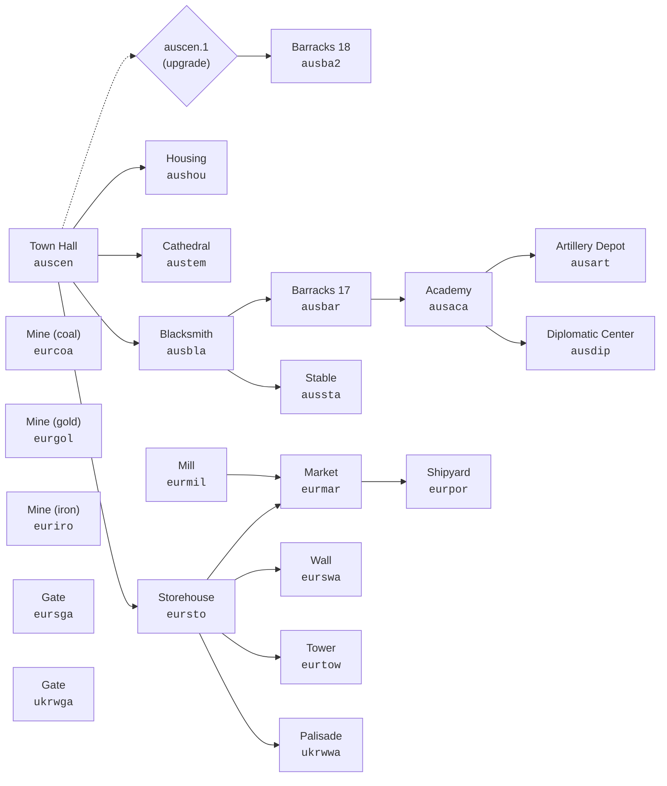

# Cossacks 3 - Tech Tree (by nation)

[← Tables and calculations](../README.md)

Dependency graph: what needs to be built or researched before what. Extracted from `_country_AddFixedProduceWithAccessControl` and `_country_AddUpgradeWithAccessControl` (parameters `req0`..`req7`). The source of truth is [`derived/tech_tree.json`](../../../derived/tech_tree.json).

**Legends:**
- `[B]` - building, `[U]` - unit, `[T]` - upgrade (technology, research)
- `→ X, Y` - to unlock you need X and Y at the same time
- For buildings the base price is shown (see [building price growth](../economy/scaling_prices.md) for N>1)

## Building graph (Austria as a representative example)

The graph shows the dependence of the construction of one building on another. Solid arrows - `prereqs` from `country.script`, dotted arrows - the connection “building → its upgrade” (for example, `auscen → auscen.1`, advance to the 18th century). For other nations, the graph is structurally identical - only the nation-specific names `<nat>cen`, `<nat>bar`, etc. differ.

## Contents

| Nation | Buildings | Units | Key upgrades |
|---|---|---|---|
| **[ALG - Algeria](#alg--algeria-алжир)** | [buildings](#alg--здания) | [units](#alg--юниты) | [upgrades](#alg--ключевые-апгрейды-с-зависимостями) |
| **[AUS - Austria](#aus--austria-австрия)** | [buildings](#aus--здания) | [units](#aus--юниты) | [upgrades](#aus--ключевые-апгрейды-с-зависимостями) |
| **[BAV - Bavaria](#bav--bavaria-бавария)** | [buildings](#bav--здания) | [units](#bav--юниты) | [upgrades](#bav--ключевые-апгрейды-с-зависимостями) |
| **[DEN - Denmark](#den--denmark-дания)** | [buildings](#den--здания) | [units](#den--юниты) | [upgrades](#den--ключевые-апгрейды-с-зависимостями) |
| **[ENG - England](#eng--england-англия)** | [buildings](#eng--здания) | [units](#eng--юниты) | [upgrades](#eng--ключевые-апгрейды-с-зависимостями) |
| **[FRA - France](#fra--france-франция)** | [buildings](#fra--здания) | [units](#fra--юниты) | [upgrades](#fra--ключевые-апгрейды-с-зависимостями) |
| **[HUN - Hungary](#hun--hungary-венгрия)** | [buildings](#hun--здания) | [units](#hun--юниты) | [upgrades](#hun--ключевые-апгрейды-с-зависимостями) |
| **[NET - Netherlands](#net--netherlands-нидерланды)** | [buildings](#net--здания) | [units](#net--юниты) | [upgrades](#net--ключевые-апгрейды-с-зависимостями) |
| **[PIE - Piedmont](#pie--piedmont-пьемонт)** | [buildings](#pie--здания) | [units](#pie--юниты) | [upgrades](#pie--ключевые-апгрейды-с-зависимостями) |
| **[POL - Poland](#pol--poland-польша)** | [buildings](#pol--здания) | [units](#pol--юниты) | [upgrades](#pol--ключевые-апгрейды-с-зависимостями) |
| **[POR - Portugal](#por--portugal-португалия)** | [buildings](#por--здания) | [units](#por--юниты) | [upgrades](#por--ключевые-апгрейды-с-зависимостями) |
| **[PRU - Prussia](#pru--prussia-пруссия)** | [buildings](#pru--здания) | [units](#pru--юниты) | [upgrades](#pru--ключевые-апгрейды-с-зависимостями) |
| **[RUS — Russia](#rus--russia-россия)** | [buildings](#rus--здания) | [units](#rus--юниты) | [upgrades](#rus--ключевые-апгрейды-с-зависимостями) |
| **[SAX - Saxony](#sax--saxony-саксония)** | [buildings](#sax--здания) | [units](#sax--юниты) | [upgrades](#sax--ключевые-апгрейды-с-зависимостями) |
| **[SCO - Scotland](#sco--scotland-шотландия)** | [buildings](#sco--здания) | [units](#sco--юниты) | [upgrades](#sco--ключевые-апгрейды-с-зависимостями) |
| **[SPA - Spain](#spa--spain-испания)** | [buildings](#spa--здания) | [units](#spa--юниты) | [upgrades](#spa--ключевые-апгрейды-с-зависимостями) |
| **[SWE - Sweden](#swe--sweden-швеция)** | [buildings](#swe--здания) | [units](#swe--юниты) | [upgrades](#swe--ключевые-апгрейды-с-зависимостями) |
| **[SWI - Switzerland](#swi--switzerland-швейцария)** | [buildings](#swi--здания) | [units](#swi--юниты) | [upgrades](#swi--ключевые-апгрейды-с-зависимостями) |
| **[TUR - Turkey](#tur--turkey-турция)** | [buildings](#tur--здания) | [units](#tur--юниты) | [upgrades](#tur--ключевые-апгрейды-с-зависимостями) |
| **[UKR - Ukraine](#ukr--ukraine-украина)** | [buildings](#ukr--здания) | [units](#ukr--юниты) | [upgrades](#ukr--ключевые-апгрейды-с-зависимостями) |
| **[VEN - Venice](#ven--venice-венеция)** | [buildings](#ven--здания) | [units](#ven--юниты) | [upgrades](#ven--ключевые-апгрейды-с-зависимостями) |

## Algeria (`alg`)

### `alg` - buildings

| sid | name | Time (g-sec) | price | farm | requires |
|---|---|---:|---|---:|---|
| `algaca` | Minaret | 156.2 | W1450 S1100 | — | [B] `algbar` |
| `algart` | Artillery Depot | 245.9 | W100 S1000 C1400 | — | [B] `algaca` |
| `algbar` | Barracks | 93.8 | W400 S400 | 50 | [B] `algbla` |
| `algbla` | Blacksmith | 109.4 | W100 S30 I640 | — | [B] `algcen` |
| `algcen` | Town Hall | 156.2 | W450 S700 | 50 | — |
| `algdip` | Diplomatic Center | 312.5 | W4600 S2020 | — | [B] `algaca` |
| `alghou` | Housing | 31.2 | W100 S100 | 25 | [B] `algcen` |
| `algsta` | Stable | 156.2 | W1000 S2200 | — | [B] `algbla` |
| `algtem` | Mosque | 93.8 | W1000 S1200 I500 | — | [B] `algcen` |
| `eurcoa` | Mine | 93.8 | W100 S100 | — | — |
| `eurgol` | Mine | 93.8 | W100 S100 | — | — |
| `euriro` | Mine | 93.8 | W100 S100 | — | — |
| `turmar` | Bazaar | 234.4 | W450 S150 | — | [B] `turmil`, [B] `tursto` |
| `turmil` | Mill | 93.8 | W30 S150 | — | — |
| `turpor` | Shipyard | 1562.5 | W800 S800 I400 | — | [B] `turmar` |
| `tursga` | Gate | 120.0 | S60 | — | — |
| `tursto` | Storehouse | 31.2 | W30 S10 | — | [B] `algcen` |
| `turswa` | Wall | 120.0 | S60 | — | [B] `tursto` |
| `turtow` | Tower | 984.4 | W150 S90 G100 | — | [B] `tursto` |
| `ukrwga` | Gate | 5.6 | W10 | — | — |
| `ukrwwa` | Palisade | 5.6 | W10 | — | [B] `tursto` |

### `alg` - units

| sid | name | Time (g-sec) | price | trains in | requires |
|---|---|---:|---|---|---|
| `archer` | Archer | 1.50 | F20 W2 G1 | algbar | — |
| `archerdip` | Archer (mercenary) | 1.25 | G15 | algdip | [B] `algaca`, [B] `algcen` |
| `archerturdip` | Turkish archer (mercenary) | 1.25 | G15 | algdip | [B] `algaca`, [B] `algcen` |
| `battleship` | Ship of the Line | 390.00 | W9000 G3200 I700 C6500 | turpor | [T] `algaca.29`, [B] `algart` |
| `cannon` | Cannon | 75.00 | W250 G400 I400 | algart | [B] `algbla` |
| `cossacksichdip` | Sich Cossack (mercenary) | 2.50 | G60 | algdip | [B] `algaca`, [B] `algcen` |
| `dragoon18dip` | Dragoon, 18th century (mercenary) | 2.00 | G120 | algdip | [B] `algaca`, [B] `algcen` |
| `drummertur` | Drummer, 17th century | 4.00 | F30 G15 | algbar | [B] `algaca` |
| `ferry` | Ferry | 56.00 | W300 G50 I100 | turpor | [B] `algart` |
| `fishboat` | Boat | 40.00 | W600 | turpor | — |
| `galley` | Galley | 50.00 | W9500 G900 I800 | turpor | [B] `algart` |
| `grenadierdip` | Grenadier (mercenary) | 1.50 | G25 | algdip | [B] `algaca`, [B] `algcen` |
| `howitzer` | Howitzer | 94.00 | W250 G350 I300 | algart | [B] `algbla` |
| `lightcavalrydip` | Light cavalry (mercenary) | 2.00 | G120 | algdip | [B] `algaca`, [B] `algcen` |
| `lightinfantry` | Light Infantryman | 1.00 | F25 I1 | algbar | — |
| `lightinfantrydip` | Light Infantryman (mercenary) | 1.25 | G4 | algdip | [B] `algaca`, [B] `algcen` |
| `mameluke` | Mameluke | 12.00 | F100 W5 G8 | algsta | — |
| `mortar` | Bombard | 25.00 | W100 G75 I200 | algart | [B] `algbla` |
| `mullah` | Mullah | 15.00 | F30 G10 | algtem | — |
| `officertur` | Officer | 7.50 | F50 G100 | algbar | [B] `algaca` |
| `peatur` | Peasant | 12.50 | F100 | algcen | — |
| `pikemantur` | Ottoman Pikeman | 5.50 | F55 G5 | algbar | [B] `algbla` |
| `roundshierdip` | Roundshier (mercenary) | 1.50 | G12 | algdip | [B] `algaca`, [B] `algcen` |
| `unitbox` | — | 3.12 | F100 | — | — |
| `xebec` | Xebec | 230.00 | W7000 G1600 I320 C960 | turpor | [T] `algaca.6`, [B] `algart` |

### `alg` - key upgrades (with dependencies)

| sid | name | Time (g-sec) | price | requires |
|---|---|---:|---|---|
| `algaca.16` | Research improved additions to gunpowder formula (artillery range +5%) | 15.6 | G2000 | [B] `algart` |
| `algaca.17` | Design new barrel types: unicorn, carronade (artillery range +10%) | 15.6 | S3000 G4550 | [B] `algart` |
| `algaca.18` | Design more durable gun carriage: Gribovalle system (artillery durability +50%) | 15.6 | G500 I3830 C1500 | [B] `algart` |
| `algaca.20` | Research new sighting devices for artillery (artillery accuracy +35%) | 15.6 | W3540 G2000 C7250 | [B] `algart` |
| `algaca.21` | Finance artillery repair shops (repair all artillery) | 15.6 | W350 G100 C250 | [B] `algart` |
| `algaca.27` | Develop mathematics (artillery accuracy +35%) | 15.6 | W9540 G12000 C65200 | [B] `algart` |
| `algaca.28` | Design new rigging types (ship speed +40%) | 15.6 | G1900 | [B] `turpor` |
| `algaca.29` | Design new rib system and new hulls (battleship construction) | 15.6 | W32300 G6800 I9000 C12800 | [B] `turpor` |
| `algaca.30` | Train carpenters (shipbuilding speed x10) | 15.6 | S42700 | [B] `turpor` |
| `algaca.5` | Design new tackle and fishing nets (boat efficiency +100%) | 15.6 | W12400 G2520 | [B] `turpor` |
| `algaca.6` | Develop new woodworking methods (xebec building) | 15.6 | W9500 G7040 | [B] `turpor` |
| `algaca.7` | Build new shipyards for fishing boats (fishing boat cost -85%) | 15.6 | W7300 G1220 | [B] `turpor` |
| `algaca.8` | Design new woodworking tools (woodcutting efficiency +100%) | 15.6 | F5500 G550 | [B] `algbla` |
| `algart.cannon.1.1` | — | 10.0 | W1000 S500 G300 | [B] `algbla` |
| `algart.cannon.1.2` | — | 10.0 | W3000 S1000 G500 | [B] `algbla` |
| `algart.cannon.1.3` | — | 10.0 | W6000 S2000 G1000 | [B] `algbla` |
| `algart.cannon.1.4` | — | 15.6 | F1760 G350 | [B] `algbla` |
| `algart.cannon.1.5` | — | 15.6 | F1760 G350 | [B] `algbla` |
| `algart.cannon.1.6` | — | 15.6 | F1760 G350 | [B] `algbla` |
| `algart.cannon.2.1` | — | 10.0 | G950 I1000 | [B] `algbla` |
| `algart.cannon.2.2` | — | 10.0 | G150 I2000 | [B] `algbla` |
| `algart.cannon.2.3` | — | 10.0 | G250 I3000 | [B] `algbla` |
| `algart.cannon.2.4` | — | 15.6 | F2560 G1350 | [B] `algbla` |
| `algart.cannon.2.5` | — | 15.6 | F3560 G2500 | [B] `algbla` |
| `algart.cannon.2.6` | — | 15.6 | F5560 G3350 | [B] `algbla` |
| `algart.howitzer.1.1` | — | 10.0 | W1000 S500 G300 | [B] `algbla` |
| `algart.howitzer.1.2` | — | 10.0 | W3000 S1000 G500 | [B] `algbla` |
| `algart.howitzer.1.3` | — | 10.0 | W6000 S2000 G1000 | [B] `algbla` |
| `algart.howitzer.1.4` | — | 15.6 | F1760 G350 | [B] `algbla` |
| `algart.howitzer.1.5` | — | 15.6 | F1760 G350 | [B] `algbla` |
| `algart.howitzer.1.6` | — | 15.6 | F1760 G350 | [B] `algbla` |
| `algart.howitzer.2.1` | — | 10.0 | G350 I1000 | [B] `algbla` |
| `algart.howitzer.2.2` | — | 10.0 | G450 I2000 | [B] `algbla` |
| `algart.howitzer.2.3` | — | 10.0 | G550 I3000 | [B] `algbla` |
| `algart.howitzer.2.4` | — | 31.2 | F2560 G1150 | [B] `algbla` |
| `algart.howitzer.2.5` | — | 31.2 | F3560 G3200 | [B] `algbla` |
| `algart.howitzer.2.6` | — | 31.2 | F5560 G4500 | [B] `algbla` |
| `algbar.lightinfantry.1.4` | — | 15.6 | F3000 G360 | [B] `algbla` |
| `algbar.lightinfantry.1.5` | — | 15.6 | F4500 G540 | [B] `algbla` |
| `algbar.lightinfantry.1.6` | — | 15.6 | F9375 G1125 | [B] `algbla` |
| `algbar.lightinfantry.2.4` | — | 15.6 | F3600 G600 | [B] `algbla` |
| `algbar.lightinfantry.2.5` | — | 15.6 | F5400 G900 | [B] `algbla` |
| `algbar.lightinfantry.2.6` | — | 15.6 | F11250 G1875 | [B] `algbla` |
| `algbar.pikemantur.1.6` | — | 15.6 | F18750 G2350 | [B] `algbla` |
| `algbar.pikemantur.2.6` | — | 15.6 | F16875 G2250 | [B] `algbla` |
| `turpor.1` | Train woodworkers (repair all ships) | 46.9 | W20000 G1500 | [B] `algart` |
| `turtow.1` | Increase number of defensive cannons (20%) | 31.2 | G250 | [B] `algart` |
| `turtow.2` | Increase number of defensive cannons (20%) | 31.2 | I350 | [B] `algart` |
| `turtow.3` | Increase number of defensive cannons (10%) | 31.2 | C400 | [B] `algart` |
| `turtow.4` | Increase number of defensive cannons (10%) | 31.2 | I450 | [B] `algart` |
| `turtow.5` | Increase number of defensive cannons (10%) | 31.2 | C500 | [B] `algart` |

[↑ to contents](#содержание)

## Austria (`aus`)

### `aus` - buildings

| sid | name | Time (g-sec) | price | farm | requires |
|---|---|---:|---|---:|---|
| `ausaca` | Academy | 625.0 | W1250 S1100 | — | [B] `ausbar` |
| `ausart` | Artillery Depot | 245.9 | W100 S1000 C1400 | — | [B] `ausaca` |
| `ausba2` | Barracks, 18th century | 5625.0 | W1700 S2950 G4000 | 250 | [T] `auscen.1` |
| `ausbar` | Barracks, 17th century | 93.8 | W100 S100 G500 | 150 | [B] `ausbla` |
| `ausbla` | Blacksmith | 93.8 | W100 S30 I640 | — | [B] `auscen` |
| `auscen` | Town Hall | 46.9 | W700 S700 | 100 | — |
| `ausdip` | Diplomatic Center | 312.5 | W4900 S1700 | — | [B] `ausaca` |
| `aushou` | Housing | 31.2 | W100 S100 | 25 | [B] `auscen` |
| `aussta` | Stable | 625.0 | W2500 S100 G600 | — | [B] `ausbla` |
| `austem` | Cathedral | 156.2 | W1000 S1200 I500 | — | [B] `auscen` |
| `eurcoa` | Mine | 93.8 | W100 S100 | — | — |
| `eurgol` | Mine | 93.8 | W100 S100 | — | — |
| `euriro` | Mine | 93.8 | W100 S100 | — | — |
| `eurmar` | Market | 234.4 | W450 | — | [B] `eurmil`, [B] `eursto` |
| `eurmil` | Mill | 93.8 | W30 S150 | — | — |
| `eurpor` | Shipyard | 1562.5 | W1600 S800 I400 | — | [B] `eurmar` |
| `eursga` | Gate | 90.0 | S50 | — | — |
| `eursto` | Storehouse | 31.2 | W50 S20 | — | [B] `auscen` |
| `eurswa` | Wall | 90.0 | S50 | — | [B] `eursto` |
| `eurtow` | Tower | 1230.3 | W100 S100 G150 | — | [B] `eursto` |
| `ukrwga` | Gate | 5.6 | W10 | — | — |
| `ukrwwa` | Palisade | 5.6 | W10 | — | [B] `eursto` |

### `aus` - units

| sid | name | Time (g-sec) | price | trains in | requires |
|---|---|---:|---|---|---|
| `archerdip` | Archer (mercenary) | 1.25 | G15 | ausdip | [B] `ausaca`, [B] `auscen` |
| `archerturdip` | Turkish archer (mercenary) | 1.25 | G15 | ausdip | [B] `ausaca`, [B] `auscen` |
| `battleship` | Ship of the Line | 390.00 | W9000 G3200 I700 C6500 | europor | [T] `ausaca.29`, [B] `ausart` |
| `cannon` | Cannon | 75.00 | W250 G400 I400 | ausart | [B] `ausbla` |
| `cossacksichdip` | Sich Cossack (mercenary) | 2.50 | G60 | ausdip | [B] `ausaca`, [B] `auscen` |
| `croat` | Croat | 15.75 | F80 G6 I2 | aussta | [B] `ausbla` |
| `cuirassier` | Cuirassier | 22.50 | F120 G35 I25 | aussta | [B] `ausbla`, [T] `auscen.1` |
| `dragoon` | Dragoon, 17th century | 15.00 | F90 G7 I5 | aussta | [B] `ausbla` |
| `dragoon18` | Dragoon, 18th century | 22.50 | F70 G60 I7 | aussta | [B] `ausbla`, [T] `auscen.1` |
| `dragoon18dip` | Dragoon, 18th century (mercenary) | 2.00 | G120 | ausdip | [B] `ausaca`, [B] `auscen` |
| `drummer` | Drummer, 17th century | 5.00 | F60 G20 | ausbar | [B] `ausaca` |
| `drummer18` | Drummer, 18th century | 6.00 | F50 G30 | ausba2 | [B] `ausaca` |
| `ferry` | Ferry | 56.00 | W300 G50 I100 | europor | [B] `ausart` |
| `fishboat` | Boat | 40.00 | W600 | europor | — |
| `frigate` | Frigate | 230.00 | W5000 G1100 I600 C800 | europor | [T] `ausaca.6`, [B] `ausart` |
| `galley` | Galley | 50.00 | W9500 G900 I800 | europor | [B] `ausart` |
| `grenadier` | Grenadier | 6.00 | F80 G60 I40 | ausba2 | [B] `ausbla` |
| `grenadierdip` | Grenadier (mercenary) | 1.50 | G25 | ausdip | [B] `ausaca`, [B] `auscen` |
| `howitzer` | Howitzer | 94.00 | W250 G350 I300 | ausart | [B] `ausbla` |
| `hussar` | Hussar | 15.00 | F70 G20 I2 | aussta | [B] `ausbla`, [T] `auscen.1` |
| `lightcavalrydip` | Light cavalry (mercenary) | 2.00 | G120 | ausdip | [B] `ausaca`, [B] `auscen` |
| `lightinfantrydip` | Light Infantryman (mercenary) | 1.25 | G4 | ausdip | [B] `ausaca`, [B] `auscen` |
| `mortar` | Bombard | 25.00 | W100 G75 I200 | ausart | [B] `ausbla` |
| `multicannon` | Multi-barrelled Cannon | 50.00 | W200 G400 I250 | ausart | [T] `ausaca.19`, [B] `ausbla` |
| `musketeer18` | Musketeer, 18th century | 4.50 | F50 G40 I40 | ausba2 | [B] `ausbla` |
| `musketeeraus` | Musketeer, 17th century | 6.50 | F35 G9 I15 | ausbar | [B] `ausbla` |
| `officer` | Officer, 17th century | 10.00 | F50 G150 I30 | ausbar | [B] `ausaca` |
| `officer18` | Officer, 18th century | 6.00 | F50 G200 I10 | ausba2 | [B] `ausaca` |
| `pandur` | Pandur | 5.50 | F40 G15 I10 | ausba2 | [B] `ausbla` |
| `peaaus` | Peasant | 12.50 | F100 | auscen | — |
| `pikeman` | Pikeman, 17th century | 4.50 | F25 G3 I20 | ausbar | [B] `ausbla` |
| `pikeman18` | Pikeman, 18th century | 1.25 | F30 G2 | ausba2 | — |
| `priest` | Priest | 20.00 | F60 G25 | austem | — |
| `reiter` | Reiter | 24.00 | F120 G10 I40 | aussta | [B] `ausbla` |
| `roundshier` | Roundshier | 4.00 | F20 G3 I25 | ausbar | [B] `ausbla` |
| `roundshierdip` | Roundshier (mercenary) | 1.50 | G12 | ausdip | [B] `ausaca`, [B] `auscen` |
| `unitbox` | — | 3.12 | F100 | — | — |
| `yacht` | Yacht | 48.00 | W900 G450 I150 C200 | europor | [B] `ausart` |

### `aus` - key upgrades (with dependencies)

| sid | name | Time (g-sec) | price | requires |
|---|---|---:|---|---|
| `ausaca.12` | Improve firearms: rifled barrel (fire power +10%) | 15.6 | I5000 | [B] `ausbla` |
| `ausaca.13` | Research granular gunpowder (fire power +10%) | 15.6 | G4000 | [B] `ausbla` |
| `ausaca.14` | Research new sulphur purification methods (fire power +15%) | 15.6 | G7000 | [B] `ausbla` |
| `ausaca.15` | Research new nitre purification methods (fire power +25%) | 15.6 | C11000 | [B] `ausbla` |
| `ausaca.16` | Research improved additions to gunpowder formula (artillery range +5%) | 15.6 | G2000 I12150 | [B] `ausart` |
| `ausaca.17` | Design new barrel types: unicorn, carronade (artillery range +10%) | 15.6 | S3000 G4550 I19200 | [B] `ausart` |
| `ausaca.18` | Design more durable gun carriage: Gribovalle system (artillery durability +50%) | 15.6 | G500 I3830 C1500 | [B] `ausart` |
| `ausaca.19` | Design multi-barrelled cannon | 15.6 | G1500 C2500 | [B] `ausart` |
| `ausaca.20` | Research new sighting devices for artillery (artillery accuracy +35%) | 15.6 | W3540 G2000 C7250 | [B] `ausart` |
| `ausaca.21` | Finance artillery repair shops (repair all artillery) | 15.6 | W350 G100 C250 | [B] `ausart` |
| `ausaca.25` | Design Montgolfier (reveals the whole map) | 15.6 | G5750 | [T] `auscen.1` |
| `ausaca.27` | Develop mathematics (artillery accuracy +35%) | 15.6 | W9540 G12000 C65200 | [B] `ausart` |
| `ausaca.28` | Design new rigging types (ship speed +40%) | 15.6 | W65400 G24050 | [B] `eurpor` |
| `ausaca.29` | Design new rib system and new hulls (battleship construction) | 15.6 | W32300 G6800 I9000 C12800 | [B] `eurpor` |
| `ausaca.30` | Train carpenters (shipbuilding speed x10) | 15.6 | W2300 S42700 G1150 | [B] `eurpor` |
| `ausaca.32` | Design flintlock (musket cost -50%) | 15.6 | G6050 C7750 | [T] `auscen.1` |
| `ausaca.34` | Research improved steel grades for cuirasses (armoured soldier defence +2) | 15.6 | G9750 | [B] `ausbla` |
| `ausaca.35` | Design bayonet: barrel-inserted, bayonet with a tube (cold steel weapons +5) | 15.6 | G11500 | [T] `auscen.1`, [B] `ausbla` |
| `ausaca.36` | Research new steel grades (18c musketeer/grenadier melee attack efficiency +25%) | 15.6 | G19500 | [T] `auscen.1`, [B] `ausbla` |
| `ausaca.5` | Design new tackle and fishing nets (boat efficiency +100%) | 15.6 | W12400 G2520 | [B] `eurpor` |
| `ausaca.6` | Develop new woodworking methods (frigate building) | 15.6 | W12400 G7040 | [B] `eurpor` |
| `ausaca.7` | Build new shipyards for fishing boats (fishing boat cost -85%) | 15.6 | W7300 G1220 | [B] `eurpor` |
| `ausaca.8` | Design new woodworking tools (woodcutting efficiency +100%) | 15.6 | F5500 G550 | [B] `ausbla` |
| `ausart.cannon.1.1` | — | 10.0 | W1000 S500 G300 | [B] `ausbla` |
| `ausart.cannon.1.2` | — | 10.0 | W3000 S1000 G500 | [B] `ausbla` |
| `ausart.cannon.1.3` | — | 10.0 | W6000 S2000 G1000 | [B] `ausbla` |
| `ausart.cannon.1.4` | — | 15.6 | F1760 G350 | [B] `ausbla` |
| `ausart.cannon.1.5` | — | 15.6 | F1760 G350 | [B] `ausbla` |
| `ausart.cannon.1.6` | — | 15.6 | F1760 G350 | [B] `ausbla` |
| `ausart.cannon.2.1` | — | 10.0 | G500 I1000 | [B] `ausbla` |
| `ausart.cannon.2.2` | — | 10.0 | G1000 I2000 | [B] `ausbla` |
| `ausart.cannon.2.3` | — | 10.0 | G2000 I3000 | [B] `ausbla` |
| `ausart.cannon.2.4` | — | 15.6 | F2560 | [B] `ausbla` |
| `ausart.cannon.2.5` | — | 15.6 | F3560 | [B] `ausbla` |
| `ausart.cannon.2.6` | — | 15.6 | F5560 | [B] `ausbla` |
| `ausart.howitzer.1.1` | — | 10.0 | W1000 S500 G300 | [B] `ausbla` |
| `ausart.howitzer.1.2` | — | 10.0 | W3000 S1000 G500 | [B] `ausbla` |
| `ausart.howitzer.1.3` | — | 10.0 | W6000 S2000 G1000 | [B] `ausbla` |
| `ausart.howitzer.1.4` | — | 15.6 | F1760 G350 | [B] `ausbla` |
| `ausart.howitzer.1.5` | — | 15.6 | F1760 G350 | [B] `ausbla` |
| `ausart.howitzer.1.6` | — | 15.6 | F1760 G350 | [B] `ausbla` |
| `ausart.howitzer.2.1` | — | 10.0 | G500 I1000 | [B] `ausbla` |
| `ausart.howitzer.2.2` | — | 10.0 | G1000 I2000 | [B] `ausbla` |
| `ausart.howitzer.2.3` | — | 10.0 | G2000 I3000 | [B] `ausbla` |
| `ausart.howitzer.2.4` | — | 31.2 | F2560 | [B] `ausbla` |
| `ausart.howitzer.2.5` | — | 31.2 | F3560 | [B] `ausbla` |
| `ausart.howitzer.2.6` | — | 31.2 | F5560 | [B] `ausbla` |
| `ausbar.pikeman.1.6` | — | 15.6 | F15000 G1875 | [B] `ausbla` |
| `ausbar.pikeman.2.6` | — | 15.6 | F11250 G1500 | [B] `ausbla` |
| `ausbar.roundshier.1.4` | — | 15.6 | F7500 G900 | [B] `ausbla` |
| `ausbar.roundshier.1.5` | — | 15.6 | F9000 G1080 | [B] `ausbla` |
| `ausbar.roundshier.1.6` | — | 15.6 | F18750 G2250 | [B] `ausbla` |
| `ausbar.roundshier.2.4` | — | 15.6 | F3750 G450 | [B] `ausbla` |
| `ausbar.roundshier.2.5` | — | 15.6 | F6750 G810 | [B] `ausbla` |
| `ausbar.roundshier.2.6` | — | 15.6 | F9375 G1125 | [B] `ausbla` |
| `ausbla.4` | Forge bayonets and broadswords for infantry (18c musketeer/grenadier melee attack +5) | 15.6 | W1300 G1500 I900 C5000 | [T] `auscen.1` |
| `auscen.1` | Progress to the 18th Century | 9.4 | F30000 G5000 I2000 C2000 | [B] `ausaca`, [B] `austem`, [B] `ausart` |
| `eurcoa.4` | Enlarge mines and build extensive railroad network for them (+12) | 9.4 | F15800 G18500 | [T] `auscen.1` |
| `eurcoa.5` | Enlarge mines and build extensive railroad network for them (+15) | 9.4 | F19800 G21050 | [T] `auscen.1` |
| `eurcoa.6` | Enlarge mines and build extensive railroad network for them (+40) | 9.4 | F50200 G25950 | [T] `auscen.1` |
| `eurgol.4` | Enlarge mines and build extensive railroad network for them (+12) | 9.4 | F15800 G18500 | [T] `auscen.1` |
| `eurgol.5` | Enlarge mines and build extensive railroad network for them (+15) | 9.4 | F19800 G21050 | [T] `auscen.1` |
| `eurgol.6` | Enlarge mines and build extensive railroad network for them (+40) | 9.4 | F50200 G25950 | [T] `auscen.1` |
| `euriro.4` | Enlarge mines and build extensive railroad network for them (+12) | 9.4 | F15800 G18500 | [T] `auscen.1` |
| `euriro.5` | Enlarge mines and build extensive railroad network for them (+15) | 9.4 | F19800 G21050 | [T] `auscen.1` |
| `euriro.6` | Enlarge mines and build extensive railroad network for them (+40) | 9.4 | F50200 G25950 | [T] `auscen.1` |
| `eurpor.1` | Train woodworkers (repair all ships) | 46.9 | W20000 G1500 | [B] `ausart` |
| `eurtow.1` | Increase number of defensive cannons (20%) | 31.2 | G250 | [B] `ausart` |
| `eurtow.2` | Increase number of defensive cannons (20%) | 31.2 | I350 | [B] `ausart` |
| `eurtow.3` | Increase number of defensive cannons (10%) | 31.2 | C400 | [B] `ausart` |
| `eurtow.4` | Increase number of defensive cannons (10%) | 31.2 | I450 | [B] `ausart` |
| `eurtow.5` | Increase number of defensive cannons (10%) | 31.2 | C500 | [B] `ausart` |
| `ferry.1` | Improve transport vessel design (+200 capacity) | 15.6 | F1000 G1250 | [T] `auscen.1` |

[↑ to contents](#содержание)

## Bavaria (`bav`)

### `bav` - buildings

| sid | name | Time (g-sec) | price | farm | requires |
|---|---|---:|---|---:|---|
| `bavaca` | Academy | 625.0 | W1250 S1100 | — | [B] `bavbar` |
| `bavart` | Artillery Depot | 245.9 | W100 S1000 C1400 | — | [B] `bavaca` |
| `bavba2` | Barracks, 18th century | 5625.0 | W1700 S2950 G4000 | 250 | [T] `bavcen.1` |
| `bavbar` | Barracks, 17th century | 93.8 | W100 S100 G500 | 150 | [B] `bavbla` |
| `bavbla` | Blacksmith | 93.8 | W100 S30 I640 | — | [B] `bavcen` |
| `bavcen` | Town Hall | 156.2 | W700 S700 | 100 | — |
| `bavdip` | Diplomatic Center | 312.5 | W4900 S1700 | — | [B] `bavaca` |
| `bavhou` | Housing | 31.2 | W100 S100 | 25 | [B] `bavcen` |
| `bavsta` | Stable | 625.0 | W2500 S100 G600 | — | [B] `bavbla` |
| `bavtem` | Cathedral | 156.2 | W1000 S1200 I500 | — | [B] `bavcen` |
| `eurcoa` | Mine | 93.8 | W100 S100 | — | — |
| `eurgol` | Mine | 93.8 | W100 S100 | — | — |
| `euriro` | Mine | 93.8 | W100 S100 | — | — |
| `eurmar` | Market | 234.4 | W450 | — | [B] `eurmil`, [B] `eursto` |
| `eurmil` | Mill | 93.8 | W30 S150 | — | — |
| `eurpor` | Shipyard | 1562.5 | W1600 S800 I400 | — | [B] `eurmar` |
| `eursga` | Gate | 90.0 | S50 | — | — |
| `eursto` | Storehouse | 31.2 | W50 S20 | — | [B] `bavcen` |
| `eurswa` | Wall | 90.0 | S50 | — | [B] `eursto` |
| `eurtow` | Tower | 1230.3 | W100 S100 G150 | — | [B] `eursto` |
| `ukrwga` | Gate | 5.6 | W10 | — | — |
| `ukrwwa` | Palisade | 5.6 | W10 | — | [B] `eursto` |

### `bav` - units

| sid | name | Time (g-sec) | price | trains in | requires |
|---|---|---:|---|---|---|
| `archerdip` | Archer (mercenary) | 1.25 | G15 | bavdip | [B] `bavaca`, [B] `bavcen` |
| `archerturdip` | Turkish archer (mercenary) | 1.25 | G15 | bavdip | [B] `bavaca`, [B] `bavcen` |
| `battleship` | Ship of the Line | 390.00 | W9000 G3200 I700 C6500 | europor | [T] `bavaca.29`, [B] `bavart` |
| `cannon` | Cannon | 75.00 | W250 G400 I400 | bavart | [B] `bavbla` |
| `cossacksichdip` | Sich Cossack (mercenary) | 2.50 | G60 | bavdip | [B] `bavaca`, [B] `bavcen` |
| `cuirassier` | Cuirassier | 22.50 | F120 G35 I25 | bavsta | [B] `bavbla`, [T] `bavcen.1` |
| `dragoon` | Dragoon, 17th century | 15.00 | F90 G7 I5 | bavsta | [B] `bavbla` |
| `dragoon18` | Dragoon, 18th century | 22.50 | F70 G60 I7 | bavsta | [B] `bavbla`, [T] `bavcen.1` |
| `dragoon18dip` | Dragoon, 18th century (mercenary) | 2.00 | G120 | bavdip | [B] `bavaca`, [B] `bavcen` |
| `drummer` | Drummer, 17th century | 5.00 | F60 G20 | bavbar | [B] `bavaca` |
| `drummer18` | Drummer, 18th century | 6.00 | F50 G30 | bavba2 | [B] `bavaca` |
| `ferry` | Ferry | 56.00 | W300 G50 I100 | europor | [B] `bavart` |
| `fishboat` | Boat | 40.00 | W600 | europor | — |
| `frigate` | Frigate | 230.00 | W5000 G1100 I600 C800 | europor | [T] `bavaca.6`, [B] `bavart` |
| `galley` | Galley | 50.00 | W9500 G900 I800 | europor | [B] `bavart` |
| `grenadierbav` | Grenadier | 6.00 | F95 G70 I40 | bavba2 | [B] `bavbla` |
| `grenadierdip` | Grenadier (mercenary) | 1.50 | G25 | bavdip | [B] `bavaca`, [B] `bavcen` |
| `howitzer` | Howitzer | 94.00 | W250 G350 I300 | bavart | [B] `bavbla` |
| `hussar` | Hussar | 15.00 | F70 G20 I2 | bavsta | [B] `bavbla`, [T] `bavcen.1` |
| `lightcavalrydip` | Light cavalry (mercenary) | 2.00 | G120 | bavdip | [B] `bavaca`, [B] `bavcen` |
| `lightinfantrydip` | Light Infantryman (mercenary) | 1.25 | G4 | bavdip | [B] `bavaca`, [B] `bavcen` |
| `mortar` | Bombard | 25.00 | W100 G75 I200 | bavart | [B] `bavbla` |
| `multicannon` | Multi-barrelled Cannon | 50.00 | W200 G400 I250 | bavart | [T] `bavaca.19`, [B] `bavbla` |
| `musketeer` | Musketeer, 17th century | 6.00 | F45 G6 I5 | bavbar | [B] `bavbla` |
| `musketeer18bav` | Musketeer, 18th century | 5.00 | F60 G55 I35 | bavba2 | [B] `bavbla` |
| `officer` | Officer, 17th century | 10.00 | F50 G150 I30 | bavbar | [B] `bavaca` |
| `officer18` | Officer, 18th century | 6.00 | F50 G200 I10 | bavba2 | [B] `bavaca` |
| `peaaus` | Peasant | 12.50 | F100 | bavcen | — |
| `pikeman` | Pikeman, 17th century | 4.50 | F25 G3 I20 | bavbar | [B] `bavbla` |
| `pikeman18` | Pikeman, 18th century | 1.25 | F30 G2 | bavba2 | — |
| `priest` | Priest | 20.00 | F60 G25 | bavtem | — |
| `reiter` | Reiter | 24.00 | F120 G10 I40 | bavsta | [B] `bavbla` |
| `roundshierdip` | Roundshier (mercenary) | 1.50 | G12 | bavdip | [B] `bavaca`, [B] `bavcen` |
| `unitbox` | — | 3.12 | F100 | — | — |
| `yacht` | Yacht | 48.00 | W900 G450 I150 C200 | europor | [B] `bavart` |

### `bav` - key upgrades (with dependencies)

| sid | name | Time (g-sec) | price | requires |
|---|---|---:|---|---|
| `bavaca.12` | Improve firearms: rifled barrel (fire power +10%) | 15.6 | I5000 | [B] `bavbla` |
| `bavaca.13` | Research granular gunpowder (fire power +10%) | 15.6 | G4000 | [B] `bavbla` |
| `bavaca.14` | Research new sulphur purification methods (fire power +15%) | 15.6 | G7000 | [B] `bavbla` |
| `bavaca.15` | Research new nitre purification methods (fire power +25%) | 15.6 | C11000 | [B] `bavbla` |
| `bavaca.16` | Research improved additions to gunpowder formula (artillery range +5%) | 15.6 | G2000 I12150 | [B] `bavart` |
| `bavaca.17` | Design new barrel types: unicorn, carronade (artillery range +10%) | 15.6 | S3000 G4550 I19200 | [B] `bavart` |
| `bavaca.18` | Design more durable gun carriage: Gribovalle system (artillery durability +50%) | 15.6 | G500 I3830 C1500 | [B] `bavart` |
| `bavaca.19` | Design multi-barrelled cannon | 15.6 | G1500 C2500 | [B] `bavart` |
| `bavaca.20` | Research new sighting devices for artillery (artillery accuracy +35%) | 15.6 | W3540 G2000 C7250 | [B] `bavart` |
| `bavaca.21` | Finance artillery repair shops (repair all artillery) | 15.6 | W350 G100 C250 | [B] `bavart` |
| `bavaca.25` | Design Montgolfier (reveals the whole map) | 15.6 | G5750 | [T] `bavcen.1` |
| `bavaca.27` | Develop mathematics (artillery accuracy +35%) | 15.6 | W9540 G12000 C65200 | [B] `bavart` |
| `bavaca.28` | Design new rigging types (ship speed +40%) | 15.6 | W65400 G24050 | [B] `eurpor` |
| `bavaca.29` | Design new rib system and new hulls (battleship construction) | 15.6 | W32300 G6800 I9000 C12800 | [B] `eurpor` |
| `bavaca.30` | Train carpenters (shipbuilding speed x10) | 15.6 | W2300 S42700 G1150 | [B] `eurpor` |
| `bavaca.32` | Design flintlock (musket cost -50%) | 15.6 | G6050 C7750 | [T] `bavcen.1` |
| `bavaca.34` | Research improved steel grades for cuirasses (armoured soldier defence +2) | 15.6 | G9750 | [B] `bavbla` |
| `bavaca.35` | Design bayonet: barrel-inserted, bayonet with a tube (cold steel weapons +5) | 15.6 | G11500 | [T] `bavcen.1`, [B] `bavbla` |
| `bavaca.36` | Research new steel grades (18c musketeer/grenadier melee attack efficiency +25%) | 15.6 | G19500 | [T] `bavcen.1`, [B] `bavbla` |
| `bavaca.5` | Design new tackle and fishing nets (boat efficiency +100%) | 15.6 | W12400 G2520 | [B] `eurpor` |
| `bavaca.6` | Develop new woodworking methods (frigate building) | 15.6 | W12400 G7040 | [B] `eurpor` |
| `bavaca.7` | Build new shipyards for fishing boats (fishing boat cost -85%) | 15.6 | W7300 G1220 | [B] `eurpor` |
| `bavaca.8` | Design new woodworking tools (woodcutting efficiency +100%) | 15.6 | F5500 G550 | [B] `bavbla` |
| `bavart.cannon.1.1` | — | 10.0 | W1000 S500 G300 | [B] `bavbla` |
| `bavart.cannon.1.2` | — | 10.0 | W3000 S1000 G500 | [B] `bavbla` |
| `bavart.cannon.1.3` | — | 10.0 | W6000 S2000 G1000 | [B] `bavbla` |
| `bavart.cannon.1.4` | — | 15.6 | F1760 G350 | [B] `bavbla` |
| `bavart.cannon.1.5` | — | 15.6 | F1760 G350 | [B] `bavbla` |
| `bavart.cannon.1.6` | — | 15.6 | F1760 G350 | [B] `bavbla` |
| `bavart.cannon.2.1` | — | 10.0 | G500 I1000 | [B] `bavbla` |
| `bavart.cannon.2.2` | — | 10.0 | G1000 I2000 | [B] `bavbla` |
| `bavart.cannon.2.3` | — | 10.0 | G2000 I3000 | [B] `bavbla` |
| `bavart.cannon.2.4` | — | 15.6 | F2560 | [B] `bavbla` |
| `bavart.cannon.2.5` | — | 15.6 | F3560 | [B] `bavbla` |
| `bavart.cannon.2.6` | — | 15.6 | F5560 | [B] `bavbla` |
| `bavart.howitzer.1.1` | — | 10.0 | W1000 S500 G300 | [B] `bavbla` |
| `bavart.howitzer.1.2` | — | 10.0 | W3000 S1000 G500 | [B] `bavbla` |
| `bavart.howitzer.1.3` | — | 10.0 | W6000 S2000 G1000 | [B] `bavbla` |
| `bavart.howitzer.1.4` | — | 15.6 | F1760 G350 | [B] `bavbla` |
| `bavart.howitzer.1.5` | — | 15.6 | F1760 G350 | [B] `bavbla` |
| `bavart.howitzer.1.6` | — | 15.6 | F1760 G350 | [B] `bavbla` |
| `bavart.howitzer.2.1` | — | 10.0 | G500 I1000 | [B] `bavbla` |
| `bavart.howitzer.2.2` | — | 10.0 | G1000 I2000 | [B] `bavbla` |
| `bavart.howitzer.2.3` | — | 10.0 | G2000 I3000 | [B] `bavbla` |
| `bavart.howitzer.2.4` | — | 31.2 | F2560 | [B] `bavbla` |
| `bavart.howitzer.2.5` | — | 31.2 | F3560 | [B] `bavbla` |
| `bavart.howitzer.2.6` | — | 31.2 | F5560 | [B] `bavbla` |
| `bavbar.pikeman.1.6` | — | 15.6 | F15000 G1875 | [B] `bavbla` |
| `bavbar.pikeman.2.6` | — | 15.6 | F11250 G1500 | [B] `bavbla` |
| `bavbla.4` | Forge bayonets and broadswords for infantry (18c musketeer/grenadier melee attack +5) | 15.6 | W1300 G1500 I900 C5000 | [T] `bavcen.1` |
| `bavcen.1` | Progress to the 18th Century | 9.4 | F30000 G5000 I2000 C2000 | [B] `bavaca`, [B] `bavtem`, [B] `bavart` |
| `eurcoa.4` | Enlarge mines and build extensive railroad network for them (+12) | 9.4 | F15800 G18500 | [T] `bavcen.1` |
| `eurcoa.5` | Enlarge mines and build extensive railroad network for them (+15) | 9.4 | F19800 G21050 | [T] `bavcen.1` |
| `eurcoa.6` | Enlarge mines and build extensive railroad network for them (+40) | 9.4 | F50200 G25950 | [T] `bavcen.1` |
| `eurgol.4` | Enlarge mines and build extensive railroad network for them (+12) | 9.4 | F15800 G18500 | [T] `bavcen.1` |
| `eurgol.5` | Enlarge mines and build extensive railroad network for them (+15) | 9.4 | F19800 G21050 | [T] `bavcen.1` |
| `eurgol.6` | Enlarge mines and build extensive railroad network for them (+40) | 9.4 | F50200 G25950 | [T] `bavcen.1` |
| `euriro.4` | Enlarge mines and build extensive railroad network for them (+12) | 9.4 | F15800 G18500 | [T] `bavcen.1` |
| `euriro.5` | Enlarge mines and build extensive railroad network for them (+15) | 9.4 | F19800 G21050 | [T] `bavcen.1` |
| `euriro.6` | Enlarge mines and build extensive railroad network for them (+40) | 9.4 | F50200 G25950 | [T] `bavcen.1` |
| `eurpor.1` | Train woodworkers (repair all ships) | 46.9 | W20000 G1500 | [B] `bavart` |
| `eurtow.1` | Increase number of defensive cannons (20%) | 31.2 | G250 | [B] `bavart` |
| `eurtow.2` | Increase number of defensive cannons (20%) | 31.2 | I350 | [B] `bavart` |
| `eurtow.3` | Increase number of defensive cannons (10%) | 31.2 | C400 | [B] `bavart` |
| `eurtow.4` | Increase number of defensive cannons (10%) | 31.2 | I450 | [B] `bavart` |
| `eurtow.5` | Increase number of defensive cannons (10%) | 31.2 | C500 | [B] `bavart` |
| `ferry.1` | Improve transport vessel design (+200 capacity) | 15.6 | F1000 G1250 | [T] `bavcen.1` |

[↑ to contents](#содержание)

## Denmark (`den`)

### `den` - buildings

| sid | name | Time (g-sec) | price | farm | requires |
|---|---|---:|---|---:|---|
| `denaca` | Academy | 625.0 | W1450 S900 | — | [B] `denbar` |
| `denart` | Artillery Depot | 245.9 | W100 S1000 C1400 | — | [B] `denaca` |
| `denba2` | Barracks, 18th century | 5625.0 | W1700 S2950 G4000 | 250 | [T] `dencen.1` |
| `denbar` | Barracks, 17th century | 93.8 | W100 S100 G500 | 150 | [B] `denbla` |
| `denbla` | Blacksmith | 93.8 | W100 S30 I640 | — | [B] `dencen` |
| `dencen` | Town Hall | 156.2 | W700 S700 | 100 | — |
| `dendip` | Diplomatic Center | 312.5 | W4900 S1700 | — | [B] `denaca` |
| `denhou` | Housing | 31.2 | W100 S100 | 25 | [B] `dencen` |
| `densta` | Stable | 625.0 | W2500 S100 G600 | — | [B] `denbla` |
| `dentem` | Cathedral | 156.2 | W1000 S1200 I500 | — | [B] `dencen` |
| `eurcoa` | Mine | 93.8 | W100 S100 | — | — |
| `eurgol` | Mine | 93.8 | W100 S100 | — | — |
| `euriro` | Mine | 93.8 | W100 S100 | — | — |
| `eurmar` | Market | 234.4 | W450 | — | [B] `eurmil`, [B] `eursto` |
| `eurmil` | Mill | 93.8 | W30 S150 | — | — |
| `eurpor` | Shipyard | 1562.5 | W1600 S800 I400 | — | [B] `eurmar` |
| `eursga` | Gate | 90.0 | S50 | — | — |
| `eursto` | Storehouse | 31.2 | W50 S20 | — | [B] `dencen` |
| `eurswa` | Wall | 90.0 | S50 | — | [B] `eursto` |
| `eurtow` | Tower | 1230.3 | W100 S100 G150 | — | [B] `eursto` |
| `ukrwga` | Gate | 5.6 | W10 | — | — |
| `ukrwwa` | Palisade | 5.6 | W10 | — | [B] `eursto` |

### `den` - units

| sid | name | Time (g-sec) | price | trains in | requires |
|---|---|---:|---|---|---|
| `archerdip` | Archer (mercenary) | 1.25 | G15 | dendip | [B] `denaca`, [B] `dencen` |
| `archerturdip` | Turkish archer (mercenary) | 1.25 | G15 | dendip | [B] `denaca`, [B] `dencen` |
| `battleship` | Ship of the Line | 390.00 | W9000 G3200 I700 C6500 | europor | [T] `denaca.29`, [B] `denart` |
| `cannon` | Cannon | 75.00 | W250 G400 I400 | denart | [B] `denbla` |
| `cossacksichdip` | Sich Cossack (mercenary) | 2.50 | G60 | dendip | [B] `denaca`, [B] `dencen` |
| `cuirassier` | Cuirassier | 22.50 | F120 G35 I25 | densta | [B] `denbla`, [T] `dencen.1` |
| `dragoon` | Dragoon, 17th century | 15.00 | F90 G7 I5 | densta | [B] `denbla` |
| `dragoon18` | Dragoon, 18th century | 22.50 | F70 G60 I7 | densta | [B] `denbla`, [T] `dencen.1` |
| `dragoon18dip` | Dragoon, 18th century (mercenary) | 2.00 | G120 | dendip | [B] `denaca`, [B] `dencen` |
| `drummer` | Drummer, 17th century | 5.00 | F60 G20 | denbar | [B] `denaca` |
| `drummer18` | Drummer, 18th century | 6.00 | F50 G30 | denba2 | [B] `denaca` |
| `ferry` | Ferry | 56.00 | W300 G50 I100 | europor | [B] `denart` |
| `fishboat` | Boat | 40.00 | W600 | europor | — |
| `frigate` | Frigate | 230.00 | W5000 G1100 I600 C800 | europor | [T] `denaca.6`, [B] `denart` |
| `galley` | Galley | 50.00 | W9500 G900 I800 | europor | [B] `denart` |
| `grenadierden` | Grenadier | 6.50 | F100 G90 I40 | denba2 | [B] `denbla` |
| `grenadierdip` | Grenadier (mercenary) | 1.50 | G25 | dendip | [B] `denaca`, [B] `dencen` |
| `howitzer` | Howitzer | 94.00 | W250 G350 I300 | denart | [B] `denbla` |
| `hussar` | Hussar | 15.00 | F70 G20 I2 | densta | [B] `denbla`, [T] `dencen.1` |
| `lightcavalrydip` | Light cavalry (mercenary) | 2.00 | G120 | dendip | [B] `denaca`, [B] `dencen` |
| `lightinfantrydip` | Light Infantryman (mercenary) | 1.25 | G4 | dendip | [B] `denaca`, [B] `dencen` |
| `mortar` | Bombard | 25.00 | W100 G75 I200 | denart | [B] `denbla` |
| `multicannon` | Multi-barrelled Cannon | 50.00 | W200 G400 I250 | denart | [T] `denaca.19`, [B] `denbla` |
| `musketeer` | Musketeer, 17th century | 6.00 | F45 G6 I5 | denbar | [B] `denbla` |
| `musketeer18den` | Musketeer, 18th century | 5.50 | F50 G80 I40 | denba2 | [B] `denbla` |
| `officer` | Officer, 17th century | 10.00 | F50 G150 I30 | denbar | [B] `denaca` |
| `officer18` | Officer, 18th century | 6.00 | F50 G200 I10 | denba2 | [B] `denaca` |
| `peaeng` | Peasant | 12.50 | F100 | dencen | — |
| `pikeman` | Pikeman, 17th century | 4.50 | F25 G3 I20 | denbar | [B] `denbla` |
| `pikeman18` | Pikeman, 18th century | 1.25 | F30 G2 | denba2 | — |
| `priest` | Priest | 20.00 | F60 G25 | dentem | — |
| `reiter` | Reiter | 24.00 | F120 G10 I40 | densta | [B] `denbla` |
| `roundshierdip` | Roundshier (mercenary) | 1.50 | G12 | dendip | [B] `denaca`, [B] `dencen` |
| `unitbox` | — | 3.12 | F100 | — | — |
| `yacht` | Yacht | 48.00 | W900 G450 I150 C200 | europor | [B] `denart` |

### `den` - key upgrades (with dependencies)
| sid | name | Time (g-sec) | price | requires |
|---|---|---:|---|---|
| `denaca.12` | Improve firearms: rifled barrel (fire power +10%) | 15.6 | I5000 | [B] `denbla` |
| `denaca.13` | Research granular gunpowder (fire power +10%) | 15.6 | G4000 | [B] `denbla` |
| `denaca.14` | Research new sulphur purification methods (fire power +15%) | 15.6 | G7000 | [B] `denbla` |
| `denaca.15` | Research new nitre purification methods (fire power +25%) | 15.6 | C11000 | [B] `denbla` |
| `denaca.16` | Research improved additions to gunpowder formula (artillery range +5%) | 15.6 | G2000 I12150 | [B] `denart` |
| `denaca.17` | Design new barrel types: unicorn, carronade (artillery range +10%) | 15.6 | S3000 G4550 I19200 | [B] `denart` |
| `denaca.18` | Design more durable gun carriage: Gribovalle system (artillery durability +50%) | 15.6 | G500 I3830 C1500 | [B] `denart` |
| `denaca.19` | Design multi-barrelled cannon | 15.6 | G1500 C2500 | [B] `denart` |
| `denaca.20` | Research new sighting devices for artillery (artillery accuracy +35%) | 15.6 | W3540 G2000 C7250 | [B] `denart` |
| `denaca.21` | Finance artillery repair shops (repair all artillery) | 15.6 | W350 G100 C250 | [B] `denart` |
| `denaca.25` | Design Montgolfier (reveals the whole map) | 15.6 | G5750 | [T] `dencen.1` |
| `denaca.27` | Develop mathematics (artillery accuracy +35%) | 15.6 | W9540 G12000 C65200 | [B] `denart` |
| `denaca.28` | Design new rigging types (ship speed +40%) | 15.6 | W65400 G24050 | [B] `eurpor` |
| `denaca.29` | Design new rib system and new hulls (battleship construction) | 15.6 | W32300 G6800 I9000 C12800 | [B] `eurpor` |
| `denaca.30` | Train carpenters (shipbuilding speed x10) | 15.6 | W2300 S42700 G1150 | [B] `eurpor` |
| `denaca.32` | Design flintlock (musket cost -50%) | 15.6 | G6050 C7750 | [T] `dencen.1` |
| `denaca.34` | Research improved steel grades for cuirasses (armoured soldier defence +2) | 15.6 | G9750 | [B] `denbla` |
| `denaca.35` | Design bayonet: barrel-inserted, bayonet with a tube (cold steel weapons +5) | 15.6 | G11500 | [T] `dencen.1`, [B] `denbla` |
| `denaca.36` | Research new steel grades (18c musketeer/grenadier melee attack efficiency +25%) | 15.6 | G19500 | [T] `dencen.1`, [B] `denbla` |
| `denaca.5` | Design new tackle and fishing nets (boat efficiency +100%) | 15.6 | W12400 G2520 | [B] `eurpor` |
| `denaca.6` | Develop new woodworking methods (frigate building) | 15.6 | W12400 G7040 | [B] `eurpor` |
| `denaca.7` | Build new shipyards for fishing boats (fishing boat cost -85%) | 15.6 | W7300 G1220 | [B] `eurpor` |
| `denaca.8` | Design new woodworking tools (woodcutting efficiency +100%) | 15.6 | F5500 G550 | [B] `denbla` |
| `denart.cannon.1.1` | — | 10.0 | W1000 S500 G300 | [B] `denbla` |
| `denart.cannon.1.2` | — | 10.0 | W3000 S1000 G500 | [B] `denbla` |
| `denart.cannon.1.3` | — | 10.0 | W6000 S2000 G1000 | [B] `denbla` |
| `denart.cannon.1.4` | — | 15.6 | F1760 G350 | [B] `denbla` |
| `denart.cannon.1.5` | — | 15.6 | F1760 G350 | [B] `denbla` |
| `denart.cannon.1.6` | — | 15.6 | F1760 G350 | [B] `denbla` |
| `denart.cannon.2.1` | — | 10.0 | G500 I1000 | [B] `denbla` |
| `denart.cannon.2.2` | — | 10.0 | G1000 I2000 | [B] `denbla` |
| `denart.cannon.2.3` | — | 10.0 | G2000 I3000 | [B] `denbla` |
| `denart.cannon.2.4` | — | 15.6 | F2560 | [B] `denbla` |
| `denart.cannon.2.5` | — | 15.6 | F3560 | [B] `denbla` |
| `denart.cannon.2.6` | — | 15.6 | F5560 | [B] `denbla` |
| `denart.howitzer.1.1` | — | 10.0 | W1000 S500 G300 | [B] `denbla` |
| `denart.howitzer.1.2` | — | 10.0 | W3000 S1000 G500 | [B] `denbla` |
| `denart.howitzer.1.3` | — | 10.0 | W6000 S2000 G1000 | [B] `denbla` |
| `denart.howitzer.1.4` | — | 15.6 | F1760 G350 | [B] `denbla` |
| `denart.howitzer.1.5` | — | 15.6 | F1760 G350 | [B] `denbla` |
| `denart.howitzer.1.6` | — | 15.6 | F1760 G350 | [B] `denbla` |
| `denart.howitzer.2.1` | — | 10.0 | G500 I1000 | [B] `denbla` |
| `denart.howitzer.2.2` | — | 10.0 | G1000 I2000 | [B] `denbla` |
| `denart.howitzer.2.3` | — | 10.0 | G2000 I3000 | [B] `denbla` |
| `denart.howitzer.2.4` | — | 31.2 | F2560 | [B] `denbla` |
| `denart.howitzer.2.5` | — | 31.2 | F3560 | [B] `denbla` |
| `denart.howitzer.2.6` | — | 31.2 | F5560 | [B] `denbla` |
| `denbar.pikeman.1.6` | — | 15.6 | F15000 G1875 | [B] `denbla` |
| `denbar.pikeman.2.6` | — | 15.6 | F11250 G1500 | [B] `denbla` |
| `denbla.4` | Forge bayonets and broadswords for infantry (18c musketeer/grenadier melee attack +5) | 15.6 | W1300 G1500 I900 C5000 | [T] `dencen.1` |
| `dencen.1` | Progress to the 18th Century | 9.4 | F20000 G6500 I1100 C1100 | [B] `denaca`, [B] `dentem`, [B] `denart` |
| `eurcoa.4` | Enlarge mines and build extensive railroad network for them (+12) | 9.4 | F15800 G18500 | [T] `dencen.1` |
| `eurcoa.5` | Enlarge mines and build extensive railroad network for them (+15) | 9.4 | F19800 G21050 | [T] `dencen.1` |
| `eurcoa.6` | Enlarge mines and build extensive railroad network for them (+40) | 9.4 | F50200 G25950 | [T] `dencen.1` |
| `eurgol.4` | Enlarge mines and build extensive railroad network for them (+12) | 9.4 | F15800 G18500 | [T] `dencen.1` |
| `eurgol.5` | Enlarge mines and build extensive railroad network for them (+15) | 9.4 | F19800 G21050 | [T] `dencen.1` |
| `eurgol.6` | Enlarge mines and build extensive railroad network for them (+40) | 9.4 | F50200 G25950 | [T] `dencen.1` |
| `euriro.4` | Enlarge mines and build extensive railroad network for them (+12) | 9.4 | F15800 G18500 | [T] `dencen.1` |
| `euriro.5` | Enlarge mines and build extensive railroad network for them (+15) | 9.4 | F19800 G21050 | [T] `dencen.1` |
| `euriro.6` | Enlarge mines and build extensive railroad network for them (+40) | 9.4 | F50200 G25950 | [T] `dencen.1` |
| `eurpor.1` | Train woodworkers (repair all ships) | 46.9 | W20000 G1500 | [B] `denart` |
| `eurtow.1` | Increase number of defensive cannons (20%) | 31.2 | G250 | [B] `denart` |
| `eurtow.2` | Increase number of defensive cannons (20%) | 31.2 | I350 | [B] `denart` |
| `eurtow.3` | Increase number of defensive cannons (10%) | 31.2 | C400 | [B] `denart` |
| `eurtow.4` | Increase number of defensive cannons (10%) | 31.2 | I450 | [B] `denart` |
| `eurtow.5` | Increase number of defensive cannons (10%) | 31.2 | C500 | [B] `denart` |
| `ferry.1` | Improve transport vessel design (+200 capacity) | 15.6 | F1000 G1250 | [T] `dencen.1` |

[↑ to contents](#содержание)

## England (`eng`)

### `eng` - buildings

| sid | name | Time (g-sec) | price | farm | requires |
|---|---|---:|---|---:|---|
| `engaca` | Academy | 625.0 | W1150 S1200 | — | [B] `engbar` |
| `engart` | Artillery Depot | 245.9 | W100 S1000 C1400 | — | [B] `engaca` |
| `engba2` | Barracks, 18th century | 5625.0 | W1700 S2950 G4000 | 250 | [T] `engcen.1` |
| `engbar` | Barracks, 17th century | 93.8 | W100 S100 G500 | 150 | [B] `engbla` |
| `engbla` | Blacksmith | 93.8 | W100 S30 I640 | — | [B] `engcen` |
| `engcen` | Town Hall | 156.2 | W700 S700 | 100 | — |
| `engdip` | Diplomatic Center | 312.5 | W4900 S1700 | — | [B] `engaca` |
| `enghou` | Housing | 31.2 | W100 S100 | 25 | [B] `engcen` |
| `engsta` | Stable | 375.0 | W2350 G800 | — | [B] `engbla` |
| `engtem` | Cathedral | 156.2 | W1000 S1200 I500 | — | [B] `engcen` |
| `eurcoa` | Mine | 93.8 | W100 S100 | — | — |
| `eurgol` | Mine | 93.8 | W100 S100 | — | — |
| `euriro` | Mine | 93.8 | W100 S100 | — | — |
| `eurmar` | Market | 234.4 | W450 | — | [B] `eurmil`, [B] `eursto` |
| `eurmil` | Mill | 93.8 | W30 S150 | — | — |
| `eurpor` | Shipyard | 1562.5 | W1600 S800 I400 | — | [B] `eurmar` |
| `eursga` | Gate | 90.0 | S50 | — | — |
| `eursto` | Storehouse | 31.2 | W50 S20 | — | [B] `engcen` |
| `eurswa` | Wall | 90.0 | S50 | — | [B] `eursto` |
| `eurtow` | Tower | 1230.3 | W100 S100 G150 | — | [B] `eursto` |
| `ukrwga` | Gate | 5.6 | W10 | — | — |
| `ukrwwa` | Palisade | 5.6 | W10 | — | [B] `eursto` |

### `eng` - units

| sid | name | Time (g-sec) | price | trains in | requires |
|---|---|---:|---|---|---|
| `archerdip` | Archer (mercenary) | 1.25 | G15 | engdip | [B] `engaca`, [B] `engcen` |
| `archerturdip` | Turkish archer (mercenary) | 1.25 | G15 | engdip | [B] `engaca`, [B] `engcen` |
| `bagpiper` | Bagpiper | 7.00 | F120 G20 | engba2 | [B] `engaca` |
| `battleship` | Ship of the Line | 390.00 | W9000 G3200 I700 C6500 | europor | [T] `engaca.29`, [B] `engart` |
| `cannon` | Cannon | 75.00 | W250 G400 I400 | engart | [B] `engbla` |
| `cossacksichdip` | Sich Cossack (mercenary) | 2.50 | G60 | engdip | [B] `engaca`, [B] `engcen` |
| `cuirassier` | Cuirassier | 22.50 | F120 G35 I25 | engsta | [B] `engbla`, [T] `engcen.1` |
| `dragoon` | Dragoon, 17th century | 15.00 | F90 G7 I5 | engsta | [B] `engbla` |
| `dragoon18` | Dragoon, 18th century | 22.50 | F70 G60 I7 | engsta | [B] `engbla`, [T] `engcen.1` |
| `dragoon18dip` | Dragoon, 18th century (mercenary) | 2.00 | G120 | engdip | [B] `engaca`, [B] `engcen` |
| `drummer` | Drummer, 17th century | 5.00 | F60 G20 | engbar | [B] `engaca` |
| `ferry` | Ferry | 56.00 | W300 G50 I100 | europor | [B] `engart` |
| `fishboat` | Boat | 40.00 | W600 | europor | — |
| `frigate` | Frigate | 230.00 | W5000 G1100 I600 C800 | europor | [T] `engaca.6`, [B] `engart` |
| `galley` | Galley | 50.00 | W9500 G900 I800 | europor | [B] `engart` |
| `grenadier` | Grenadier | 6.00 | F80 G60 I40 | engba2 | [B] `engbla` |
| `grenadierdip` | Grenadier (mercenary) | 1.50 | G25 | engdip | [B] `engaca`, [B] `engcen` |
| `highlander` | Highlander | 6.50 | F90 G25 I10 | engba2 | [B] `engbla` |
| `howitzer` | Howitzer | 94.00 | W250 G350 I300 | engart | [B] `engbla` |
| `hussar` | Hussar | 15.00 | F70 G20 I2 | engsta | [B] `engbla`, [T] `engcen.1` |
| `lightcavalrydip` | Light cavalry (mercenary) | 2.00 | G120 | engdip | [B] `engaca`, [B] `engcen` |
| `lightinfantrydip` | Light Infantryman (mercenary) | 1.25 | G4 | engdip | [B] `engaca`, [B] `engcen` |
| `mortar` | Bombard | 25.00 | W100 G75 I200 | engart | [B] `engbla` |
| `multicannon` | Multi-barrelled Cannon | 50.00 | W200 G400 I250 | engart | [T] `engaca.19`, [B] `engbla` |
| `musketeer` | Musketeer, 17th century | 6.00 | F45 G6 I5 | engbar | [B] `engbla` |
| `musketeer18` | Musketeer, 18th century | 4.50 | F50 G40 I40 | engba2 | [B] `engbla` |
| `officer` | Officer, 17th century | 10.00 | F50 G150 I30 | engbar | [B] `engaca` |
| `officer18` | Officer, 18th century | 6.00 | F50 G200 I10 | engba2 | [B] `engaca` |
| `peaeng` | Peasant | 12.50 | F100 | engcen | — |
| `pikeman` | Pikeman, 17th century | 4.50 | F25 G3 I20 | engbar | [B] `engbla` |
| `pikeman18` | Pikeman, 18th century | 1.25 | F30 G2 | engba2 | — |
| `priest` | Priest | 20.00 | F60 G25 | engthem | — |
| `reiter` | Reiter | 24.00 | F120 G10 I40 | engsta | [B] `engbla` |
| `roundshierdip` | Roundshier (mercenary) | 1.50 | G12 | engdip | [B] `engaca`, [B] `engcen` |
| `unitbox` | — | 3.12 | F100 | — | — |
| `yacht` | Yacht | 48.00 | W900 G450 I150 C200 | europor | [B] `engart` |

### `eng` - key upgrades (with dependencies)

| sid | name | Time (g-sec) | price | requires |
|---|---|---:|---|---|
| `engaca.12` | Improve firearms: rifled barrel (fire power +10%) | 15.6 | I5000 | [B] `engbla` |
| `engaca.13` | Research granular gunpowder (fire power +10%) | 15.6 | G4000 | [B] `engbla` |
| `engaca.14` | Research new sulphur purification methods (fire power +15%) | 15.6 | G7000 | [B] `engbla` |
| `engaca.15` | Research new nitre purification methods (fire power +25%) | 15.6 | C11000 | [B] `engbla` |
| `engaca.16` | Research improved additions to gunpowder formula (artillery range +5%) | 15.6 | G2000 I12150 | [B] `engart` |
| `engaca.17` | Design new barrel types: unicorn, carronade (artillery range +10%) | 15.6 | S3000 G4550 I19200 | [B] `engart` |
| `engaca.18` | Design more durable gun carriage: Gribovalle system (artillery durability +50%) | 15.6 | G500 I3830 C1500 | [B] `engart` |
| `engaca.19` | Design multi-barrelled cannon | 15.6 | G1500 C2500 | [B] `engart` |
| `engaca.20` | Research new sighting devices for artillery (artillery accuracy +35%) | 15.6 | W3540 G2000 C7250 | [B] `engart` |
| `engaca.21` | Finance artillery repair shops (repair all artillery) | 15.6 | W350 G100 C250 | [B] `engart` |
| `engaca.25` | Design Montgolfier (reveals the whole map) | 15.6 | G5750 | [T] `engcen.1` |
| `engaca.27` | Develop mathematics (artillery accuracy +35%) | 15.6 | W9540 G12000 C65200 | [B] `engart` |
| `engaca.28` | Design new rigging types (ship speed +40%) | 15.6 | W53400 G22050 | [B] `eurpor` |
| `engaca.29` | Design new rib system and new hulls (battleship construction) | 15.6 | W22300 G6800 I7500 C13200 | [B] `eurpor` |
| `engaca.30` | Train carpenters (shipbuilding speed x10) | 15.6 | W2300 S42700 G1150 | [B] `eurpor` |
| `engaca.32` | Design flintlock (musket cost -50%) | 15.6 | G6050 C7750 | [T] `engcen.1` |
| `engaca.34` | Research improved steel grades for cuirasses (armoured soldier defence +2) | 15.6 | G9750 | [B] `engbla` |
| `engaca.35` | Design bayonet: barrel-inserted, bayonet with a tube (cold steel weapons +5) | 15.6 | G11500 | [T] `engcen.1`, [B] `engbla` |
| `engaca.36` | Research new steel grades (18c musketeer/grenadier melee attack efficiency +25%) | 15.6 | G19500 | [T] `engcen.1`, [B] `engbla` |
| `engaca.5` | Design new tackle and fishing nets (boat efficiency +100%) | 15.6 | W12400 G3520 | [B] `eurpor` |
| `engaca.6` | Develop new woodworking methods (frigate building) | 15.6 | W12400 G7040 | [B] `eurpor` |
| `engaca.7` | Build new shipyards for fishing boats (fishing boat cost -85%) | 15.6 | W7300 G1220 | [B] `eurpor` |
| `engaca.8` | Design new woodworking tools (woodcutting efficiency +100%) | 15.6 | F5500 G550 | [B] `engbla` |
| `engart.cannon.1.1` | — | 10.0 | W1000 S500 G300 | [B] `engbla` |
| `engart.cannon.1.2` | — | 10.0 | W3000 S1000 G500 | [B] `engbla` |
| `engart.cannon.1.3` | — | 10.0 | W6000 S2000 G1000 | [B] `engbla` |
| `engart.cannon.1.4` | — | 15.6 | F1760 G350 | [B] `engbla` |
| `engart.cannon.1.5` | — | 15.6 | F1760 G350 | [B] `engbla` |
| `engart.cannon.1.6` | — | 15.6 | F1760 G350 | [B] `engbla` |
| `engart.cannon.2.1` | — | 10.0 | G500 I1000 | [B] `engbla` |
| `engart.cannon.2.2` | — | 10.0 | G1000 I2000 | [B] `engbla` |
| `engart.cannon.2.3` | — | 10.0 | G2000 I3000 | [B] `engbla` |
| `engart.cannon.2.4` | — | 15.6 | F2560 | [B] `engbla` |
| `engart.cannon.2.5` | — | 15.6 | F3560 | [B] `engbla` |
| `engart.cannon.2.6` | — | 15.6 | F5560 | [B] `engbla` |
| `engart.howitzer.1.1` | — | 10.0 | W1000 S500 G300 | [B] `engbla` |
| `engart.howitzer.1.2` | — | 10.0 | W3000 S1000 G500 | [B] `engbla` |
| `engart.howitzer.1.3` | — | 10.0 | W6000 S2000 G1000 | [B] `engbla` |
| `engart.howitzer.1.4` | — | 15.6 | F1760 G350 | [B] `engbla` |
| `engart.howitzer.1.5` | — | 15.6 | F1760 G350 | [B] `engbla` |
| `engart.howitzer.1.6` | — | 15.6 | F1760 G350 | [B] `engbla` |
| `engart.howitzer.2.1` | — | 10.0 | G500 I1000 | [B] `engbla` |
| `engart.howitzer.2.2` | — | 10.0 | G1000 I2000 | [B] `engbla` |
| `engart.howitzer.2.3` | — | 10.0 | G2000 I3000 | [B] `engbla` |
| `engart.howitzer.2.4` | — | 31.2 | F2560 | [B] `engbla` |
| `engart.howitzer.2.5` | — | 31.2 | F3560 | [B] `engbla` |
| `engart.howitzer.2.6` | — | 31.2 | F5560 | [B] `engbla` |
| `engba2.highlander.2.4` | — | 15.6 | F3600 G600 | [B] `engbla` |
| `engba2.highlander.2.5` | — | 15.6 | F5400 G900 | [B] `engbla` |
| `engba2.highlander.2.6` | — | 15.6 | F11250 G1875 | [B] `engbla` |
| `engbar.pikeman.1.6` | — | 15.6 | F15000 G1875 | [B] `engbla` |
| `engbar.pikeman.2.6` | — | 15.6 | F11250 G1500 | [B] `engbla` |
| `engbla.4` | Forge bayonets and broadswords for infantry (18c musketeer/grenadier melee attack +5) | 15.6 | W1300 G1500 I900 C5000 | [T] `engcen.1` |
| `engcen.1` | Progress to the 18th Century | 9.4 | F25000 G5000 I5500 C5500 | [B] `engaca`, [B] `engtem`, [B] `engart` |
| `eurcoa.4` | Enlarge mines and build extensive railroad network for them (+12) | 9.4 | F15800 G18500 | [T] `engcen.1` |
| `eurcoa.5` | Enlarge mines and build extensive railroad network for them (+15) | 9.4 | F19800 G21050 | [T] `engcen.1` |
| `eurcoa.6` | Enlarge mines and build extensive railroad network for them (+40) | 9.4 | F50200 G25950 | [T] `engcen.1` |
| `eurgol.4` | Enlarge mines and build extensive railroad network for them (+12) | 9.4 | F15800 G18500 | [T] `engcen.1` |
| `eurgol.5` | Enlarge mines and build extensive railroad network for them (+15) | 9.4 | F19800 G21050 | [T] `engcen.1` |
| `eurgol.6` | Enlarge mines and build extensive railroad network for them (+40) | 9.4 | F50200 G25950 | [T] `engcen.1` |
| `euriro.4` | Enlarge mines and build extensive railroad network for them (+12) | 9.4 | F15800 G18500 | [T] `engcen.1` |
| `euriro.5` | Enlarge mines and build extensive railroad network for them (+15) | 9.4 | F19800 G21050 | [T] `engcen.1` |
| `euriro.6` | Enlarge mines and build extensive railroad network for them (+40) | 9.4 | F50200 G25950 | [T] `engcen.1` |
| `eurpor.1` | Train woodworkers (repair all ships) | 46.9 | W12000 G500 | [B] `engart` |
| `eurtow.1` | Increase number of defensive cannons (20%) | 31.2 | G250 | [B] `engart` |
| `eurtow.2` | Increase number of defensive cannons (20%) | 31.2 | I350 | [B] `engart` |
| `eurtow.3` | Increase number of defensive cannons (10%) | 31.2 | C400 | [B] `engart` |
| `eurtow.4` | Increase number of defensive cannons (10%) | 31.2 | I450 | [B] `engart` |
| `eurtow.5` | Increase number of defensive cannons (10%) | 31.2 | C500 | [B] `engart` |
| `ferry.1` | Improve transport vessel design (+200 capacity) | 15.6 | F1000 G1250 | [T] `engcen.1` |

[↑ to contents](#содержание)

## France (`fra`)

### `fra` - buildings

| sid | name | Time (g-sec) | price | farm | requires |
|---|---|---:|---|---:|---|
| `eurcoa` | Mine | 93.8 | W100 S100 | — | — |
| `eurgol` | Mine | 93.8 | W100 S100 | — | — |
| `euriro` | Mine | 93.8 | W100 S100 | — | — |
| `eurmar` | Market | 234.4 | W450 | — | [B] `eurmil`, [B] `eursto` |
| `eurmil` | Mill | 93.8 | W30 S150 | — | — |
| `eurpor` | Shipyard | 1562.5 | W1600 S800 I400 | — | [B] `eurmar` |
| `eursga` | Gate | 90.0 | S50 | — | — |
| `eursto` | Storehouse | 31.2 | W50 S20 | — | [B] `fracen` |
| `eurswa` | Wall | 90.0 | S50 | — | [B] `eursto` |
| `eurtow` | Tower | 1230.3 | W100 S100 G150 | — | [B] `eursto` |
| `fraaca` | Academy | 625.0 | W1250 S1100 | — | [B] `frabar` |
| `fraart` | Artillery Depot | 245.9 | W100 S1000 C1400 | — | [B] `fraaca` |
| `fraba2` | Barracks, 18th century | 5625.0 | W1700 S2950 G4000 | 250 | [T] `fracen.1` |
| `frabar` | Barracks, 17th century | 93.8 | W100 S100 G500 | 150 | [B] `frabla` |
| `frabla` | Blacksmith | 93.8 | W100 S30 I640 | — | [B] `fracen` |
| `fracen` | Town Hall | 156.2 | W700 S700 | 100 | — |
| `fradip` | Diplomatic Center | 312.5 | W4900 S1700 | — | [B] `fraaca` |
| `frahou` | Housing | 31.2 | W100 S100 | 25 | [B] `fracen` |
| `frasta` | Stable | 625.0 | W2500 S100 G600 | — | [B] `frabla` |
| `fratem` | Cathedral | 312.5 | W1100 S2000 I600 | — | [B] `fracen` |
| `ukrwga` | Gate | 5.6 | W10 | — | — |
| `ukrwwa` | Palisade | 5.6 | W10 | — | [B] `eursto` |

### `fra` - units

| sid | name | Time (g-sec) | price | trains in | requires |
|---|---|---:|---|---|---|
| `archerdip` | Archer (mercenary) | 1.25 | G15 | fradip | [B] `fraaca`, [B] `fracen` |
| `archerturdip` | Turkish archer (mercenary) | 1.25 | G15 | fradip | [B] `fraaca`, [B] `fracen` |
| `battleship` | Ship of the Line | 390.00 | W9000 G3200 I700 C6500 | europor | [T] `fraaca.29`, [B] `fraart` |
| `cannon` | Cannon | 75.00 | W250 G400 I400 | fraart | [B] `frabla` |
| `chasseur` | Chasseur | 7.50 | F50 G45 I15 | fraba2 | [B] `frabla` |
| `cossacksichdip` | Sich Cossack (mercenary) | 2.50 | G60 | fradip | [B] `fraaca`, [B] `fracen` |
| `cuirassier` | Cuirassier | 22.50 | F120 G35 I25 | fast | [B] `frabla`, [T] `fracen.1` |
| `dragoon` | Dragoon, 17th century | 15.00 | F90 G7 I5 | fast | [B] `frabla` |
| `dragoon18dip` | Dragoon, 18th century (mercenary) | 2.00 | G120 | fradip | [B] `fraaca`, [B] `fracen` |
| `dragoon18fra` | Dragoon, 18th century | 15.00 | F50 G30 I6 | fast | [B] `frabla`, [T] `fracen.1` |
| `drummer` | Drummer, 17th century | 5.00 | F60 G20 | frabar | [B] `fraaca` |
| `drummer18` | Drummer, 18th century | 6.00 | F50 G30 | fraba2 | [B] `fraaca` |
| `ferry` | Ferry | 56.00 | W300 G50 I100 | europor | [B] `fraart` |
| `fishboat` | Boat | 40.00 | W600 | europor | — |
| `frigate` | Frigate | 230.00 | W5000 G1100 I600 C800 | europor | [T] `fraaca.6`, [B] `fraart` |
| `galley` | Galley | 50.00 | W9500 G900 I800 | europor | [B] `fraart` |
| `grenadier` | Grenadier | 6.00 | F80 G60 I40 | fraba2 | [B] `frabla` |
| `grenadierdip` | Grenadier (mercenary) | 1.50 | G25 | fradip | [B] `fraaca`, [B] `fracen` |
| `howitzer` | Howitzer | 94.00 | W250 G350 I300 | fraart | [B] `frabla` |
| `hussar` | Hussar | 15.00 | F70 G20 I2 | fast | [B] `frabla`, [T] `fracen.1` |
| `kingmusketeer` | King's Musketeer | 27.00 | F100 G100 I8 | fast | [B] `frabla` |
| `lightcavalrydip` | Light cavalry (mercenary) | 2.00 | G120 | fradip | [B] `fraaca`, [B] `fracen` |
| `lightinfantrydip` | Light Infantryman (mercenary) | 1.25 | G4 | fradip | [B] `fraaca`, [B] `fracen` |
| `mortar` | Bombard | 25.00 | W100 G75 I200 | fraart | [B] `frabla` |
| `multicannon` | Multi-barrelled Cannon | 50.00 | W200 G400 I250 | fraart | [T] `fraaca.19`, [B] `frabla` |
| `musketeer` | Musketeer, 17th century | 6.00 | F45 G6 I5 | frabar | [B] `frabla` |
| `musketeer18` | Musketeer, 18th century | 4.50 | F50 G40 I40 | fraba2 | [B] `frabla` |
| `officer` | Officer, 17th century | 10.00 | F50 G150 I30 | frabar | [B] `fraaca` |
| `officer18` | Officer, 18th century | 6.00 | F50 G200 I10 | fraba2 | [B] `fraaca` |
| `peaeng` | Peasant | 12.50 | F100 | fracen | — |
| `pikeman` | Pikeman, 17th century | 4.50 | F25 G3 I20 | frabar | [B] `frabla` |
| `pikeman18` | Pikeman, 18th century | 1.25 | F30 G2 | fraba2 | — |
| `priest` | Priest | 20.00 | F60 G25 | frate | — |
| `reiter` | Reiter | 24.00 | F120 G10 I40 | fast | [B] `frabla` |
| `roundshierdip` | Roundshier (mercenary) | 1.50 | G12 | fradip | [B] `fraaca`, [B] `fracen` |
| `unitbox` | — | 3.12 | F100 | — | — |
| `yacht` | Yacht | 48.00 | W900 G450 I150 C200 | europor | [B] `fraart` |

### `fra` - key upgrades (with dependencies)

| sid | name | Time (g-sec) | price | requires |
|---|---|---:|---|---|
| `eurcoa.4` | Enlarge mines and build extensive railroad network for them (+12) | 9.4 | F15800 G18500 | [T] `fracen.1` |
| `eurcoa.5` | Enlarge mines and build extensive railroad network for them (+15) | 9.4 | F19800 G21050 | [T] `fracen.1` |
| `eurcoa.6` | Enlarge mines and build extensive railroad network for them (+40) | 9.4 | F50200 G25950 | [T] `fracen.1` |
| `eurgol.4` | Enlarge mines and build extensive railroad network for them (+12) | 9.4 | F15800 G18500 | [T] `fracen.1` |
| `eurgol.5` | Enlarge mines and build extensive railroad network for them (+15) | 9.4 | F19800 G21050 | [T] `fracen.1` |
| `eurgol.6` | Enlarge mines and build extensive railroad network for them (+40) | 9.4 | F50200 G25950 | [T] `fracen.1` |
| `euriro.4` | Enlarge mines and build extensive railroad network for them (+12) | 9.4 | F15800 G18500 | [T] `fracen.1` |
| `euriro.5` | Enlarge mines and build extensive railroad network for them (+15) | 9.4 | F19800 G21050 | [T] `fracen.1` |
| `euriro.6` | Enlarge mines and build extensive railroad network for them (+40) | 9.4 | F50200 G25950 | [T] `fracen.1` |
| `eurpor.1` | Train woodworkers (repair all ships) | 46.9 | W20000 G1500 | [B] `fraart` |
| `eurtow.1` | Increase number of defensive cannons (20%) | 31.2 | G250 | [B] `fraart` |
| `eurtow.2` | Increase number of defensive cannons (20%) | 31.2 | I350 | [B] `fraart` |
| `eurtow.3` | Increase number of defensive cannons (10%) | 31.2 | C400 | [B] `fraart` |
| `eurtow.4` | Increase number of defensive cannons (10%) | 31.2 | I450 | [B] `fraart` |
| `eurtow.5` | Increase number of defensive cannons (10%) | 31.2 | C500 | [B] `fraart` |
| `ferry.1` | Improve transport vessel design (+200 capacity) | 15.6 | F1000 G1250 | [T] `fracen.1` |
| `fraaca.12` | Improve firearms: rifled barrel (fire power +10%) | 15.6 | I5000 | [B] `frabla` |
| `fraaca.13` | Research granular gunpowder (fire power +10%) | 15.6 | G4000 | [B] `frabla` |
| `fraaca.14` | Research new sulphur purification methods (fire power +15%) | 15.6 | G7000 | [B] `frabla` |
| `fraaca.15` | Research new nitre purification methods (fire power +25%) | 15.6 | C11000 | [B] `frabla` |
| `fraaca.16` | Research improved additions to gunpowder formula (artillery range +5%) | 15.6 | G2000 I12150 | [B] `fraart` |
| `fraaca.17` | Design new barrel types: unicorn, carronade (artillery range +10%) | 15.6 | S3000 G4550 I19200 | [B] `fraart` |
| `fraaca.18` | Design more durable gun carriage: Gribovalle system (artillery durability +50%) | 15.6 | G500 I3830 C1500 | [B] `fraart` |
| `fraaca.19` | Design multi-barrelled cannon | 15.6 | G1500 C2500 | [B] `fraart` |
| `fraaca.20` | Research new sighting devices for artillery (artillery accuracy +35%) | 15.6 | W13540 G1500 C5950 | [B] `fraart` |
| `fraaca.21` | Finance artillery repair shops (repair all artillery) | 15.6 | W350 G100 C250 | [B] `fraart` |
| `fraaca.25` | Design Montgolfier (reveals the whole map) | 15.6 | G5750 | [T] `fracen.1` |
| `fraaca.27` | Develop mathematics (artillery accuracy +35%) | 15.6 | W23580 G9800 C65400 | [B] `fraart` |
| `fraaca.28` | Design new rigging types (ship speed +40%) | 15.6 | W65400 G24050 | [B] `eurpor` |
| `fraaca.29` | Design new rib system and new hulls (battleship construction) | 15.6 | W32300 G6800 I9000 C12800 | [B] `eurpor` |
| `fraaca.30` | Train carpenters (shipbuilding speed x10) | 15.6 | W2300 S42700 G1150 | [B] `eurpor` |
| `fraaca.32` | Design flintlock (musket cost -50%) | 15.6 | G6050 C7750 | [T] `fracen.1` |
| `fraaca.34` | Research improved steel grades for cuirasses (armoured soldier defence +2) | 15.6 | G9750 | [B] `frabla` |
| `fraaca.35` | Design bayonet: barrel-inserted, bayonet with a tube (cold steel weapons +5) | 15.6 | G11500 | [T] `fracen.1`, [B] `frabla` |
| `fraaca.36` | Research new steel grades (18c musketeer/grenadier melee attack efficiency +25%) | 15.6 | G19500 | [T] `fracen.1`, [B] `frabla` |
| `fraaca.5` | Design new tackle and fishing nets (boat efficiency +100%) | 15.6 | W13900 G2420 | [B] `eurpor` |
| `fraaca.6` | Develop new woodworking methods (frigate building) | 15.6 | W13500 G7250 | [B] `eurpor` |
| `fraaca.7` | Build new shipyards for fishing boats (fishing boat cost -85%) | 15.6 | W7800 G1110 | [B] `eurpor` |
| `fraaca.8` | Design new woodworking tools (woodcutting efficiency +100%) | 15.6 | F5500 G550 | [B] `frabla` |
| `fraart.cannon.1.1` | — | 10.0 | W1000 S500 G300 | [B] `frabla` |
| `fraart.cannon.1.2` | — | 10.0 | W3000 S1000 G500 | [B] `frabla` |
| `fraart.cannon.1.3` | — | 10.0 | W6000 S2000 G1000 | [B] `frabla` |
| `fraart.cannon.1.4` | — | 15.6 | F1760 G350 | [B] `frabla` |
| `fraart.cannon.1.5` | — | 15.6 | F1760 G350 | [B] `frabla` |
| `fraart.cannon.1.6` | — | 15.6 | F1760 G350 | [B] `frabla` |
| `fraart.cannon.2.1` | — | 10.0 | G500 I1000 | [B] `frabla` |
| `fraart.cannon.2.2` | — | 10.0 | G1000 I2000 | [B] `frabla` |
| `fraart.cannon.2.3` | — | 10.0 | G2000 I3000 | [B] `frabla` |
| `fraart.cannon.2.4` | — | 15.6 | F2560 | [B] `frabla` |
| `fraart.cannon.2.5` | — | 15.6 | F3560 | [B] `frabla` |
| `fraart.cannon.2.6` | — | 15.6 | F5560 | [B] `frabla` |
| `fraart.howitzer.1.1` | — | 10.0 | W1000 S500 G300 | [B] `frabla` |
| `fraart.howitzer.1.2` | — | 10.0 | W3000 S1000 G500 | [B] `frabla` |
| `fraart.howitzer.1.3` | — | 10.0 | W6000 S2000 G1000 | [B] `frabla` |
| `fraart.howitzer.1.4` | — | 15.6 | F1760 G350 | [B] `frabla` |
| `fraart.howitzer.1.5` | — | 15.6 | F1760 G350 | [B] `frabla` |
| `fraart.howitzer.1.6` | — | 15.6 | F1760 G350 | [B] `frabla` |
| `fraart.howitzer.2.1` | — | 10.0 | G500 I1000 | [B] `frabla` |
| `fraart.howitzer.2.2` | — | 10.0 | G1000 I2000 | [B] `frabla` |
| `fraart.howitzer.2.3` | — | 10.0 | G2000 I3000 | [B] `frabla` |
| `fraart.howitzer.2.4` | — | 31.2 | F2560 | [B] `frabla` |
| `fraart.howitzer.2.5` | — | 31.2 | F3560 | [B] `frabla` |
| `fraart.howitzer.2.6` | — | 31.2 | F5560 | [B] `frabla` |
| `frabar.pikeman.1.6` | — | 15.6 | F15000 G1875 | [B] `frabla` |
| `frabar.pikeman.2.6` | — | 15.6 | F11250 G1500 | [B] `frabla` |
| `frabla.4` | Forge bayonets and broadswords for infantry (18c musketeer/grenadier melee attack +5) | 15.6 | W1300 G1500 I900 C5000 | [T] `fracen.1` |
| `fracen.1` | Progress to the 18th Century | 9.4 | F40000 G3500 I4000 C4000 | [B] `fraaca`, [B] `fratem`, [B] `fraart` |

[↑ to contents](#содержание)

## Hungary (`hun`)

### `hun` - buildings

| sid | name | Time (g-sec) | price | farm | requires |
|---|---|---:|---|---:|---|
| `eurcoa` | Mine | 93.8 | W100 S100 | — | — |
| `eurgol` | Mine | 93.8 | W100 S100 | — | — |
| `euriro` | Mine | 93.8 | W100 S100 | — | — |
| `eurmar` | Market | 234.4 | W450 | — | [B] `eurmil`, [B] `eursto` |
| `eurmil` | Mill | 93.8 | W30 S150 | — | — |
| `eurpor` | Shipyard | 1562.5 | W1600 S800 I400 | — | [B] `eurmar` |
| `eursga` | Gate | 90.0 | S50 | — | — |
| `eursto` | Storehouse | 31.2 | W50 S20 | — | [B] `huncen` |
| `eurswa` | Wall | 90.0 | S50 | — | [B] `eursto` |
| `eurtow` | Tower | 1230.3 | W100 S100 G150 | — | [B] `eursto` |
| `hunaca` | Academy | 625.0 | W1250 S1100 | — | [B] `hunbar` |
| `hunart` | Artillery Depot | 245.9 | W100 S1000 C1400 | — | [B] `hunaca` |
| `hunba2` | Barracks, 18th century | 5625.0 | W1700 S2950 G4000 | 250 | [T] `huncen.1` |
| `hunbar` | Barracks, 17th century | 93.8 | W100 S100 G500 | 150 | [B] `hunbla` |
| `hunbla` | Blacksmith | 93.8 | W100 S30 I640 | — | [B] `huncen` |
| `huncen` | Town Hall | 156.2 | W700 S700 | 100 | — |
| `hundip` | Diplomatic Center | 312.5 | W4900 S1700 | — | [B] `hunaca` |
| `hunhou` | Housing | 31.2 | W100 S100 | 25 | [B] `huncen` |
| `hunsta` | Stable | 625.0 | W2500 S100 G600 | — | [B] `hunbla` |
| `huntem` | Cathedral | 156.2 | W1000 S1200 I500 | — | [B] `huncen` |
| `ukrwga` | Gate | 5.6 | W10 | — | — |
| `ukrwwa` | Palisade | 5.6 | W10 | — | [B] `eursto` |

### `hun` - units

| sid | name | Time (g-sec) | price | trains in | requires |
|---|---|---:|---|---|---|
| `archerdip` | Archer (mercenary) | 1.25 | G15 | hundip | [B] `hunaca`, [B] `huncen` |
| `archerturdip` | Turkish archer (mercenary) | 1.25 | G15 | hundip | [B] `hunaca`, [B] `huncen` |
| `battleship` | Ship of the Line | 390.00 | W9000 G3200 I700 C6500 | europor | [T] `hunaca.29`, [B] `hunart` |
| `cannon` | Cannon | 75.00 | W250 G400 I400 | hunart | [B] `hunbla` |
| `cossacksichdip` | Sich Cossack (mercenary) | 2.50 | G60 | hundip | [B] `hunaca`, [B] `huncen` |
| `cuirassier` | Cuirassier | 22.50 | F120 G35 I25 | hunsta | [B] `hunbla`, [T] `huncen.1` |
| `dragoon` | Dragoon, 17th century | 15.00 | F90 G7 I5 | hunsta | [B] `hunbla` |
| `dragoon18dip` | Dragoon, 18th century (mercenary) | 2.00 | G120 | hundip | [B] `hunaca`, [B] `huncen` |
| `drummer` | Drummer, 17th century | 5.00 | F60 G20 | hunbar | [B] `hunaca` |
| `drummer18` | Drummer, 18th century | 6.00 | F50 G30 | hunba2 | [B] `hunaca` |
| `ferry` | Ferry | 56.00 | W300 G50 I100 | europor | [B] `hunart` |
| `fishboat` | Boat | 40.00 | W600 | europor | — |
| `frigate` | Frigate | 230.00 | W5000 G1100 I600 C800 | europor | [T] `hunaca.6`, [B] `hunart` |
| `galley` | Galley | 50.00 | W9500 G900 I800 | europor | [B] `hunart` |
| `gauduk` | Hajduk | 4.50 | F35 G4 I4 | hunbar | [B] `hunbla` |
| `grenadierdip` | Grenadier (mercenary) | 1.50 | G25 | hundip | [B] `hunaca`, [B] `huncen` |
| `grenadierhun` | Grenadier | 6.50 | F90 G80 I40 | hunba2 | [B] `hunbla` |
| `howitzer` | Howitzer | 94.00 | W250 G350 I300 | hunart | [B] `hunbla` |
| `hussarhun` | Hussar | 21.00 | F100 G30 I2 | hunsta | [B] `hunbla` |
| `lightcavalry` | Light cavalry | 21.00 | F90 G50 I6 | hunsta | [B] `hunbla`, [T] `huncen.1` |
| `lightcavalrydip` | Light cavalry (mercenary) | 2.00 | G120 | hundip | [B] `hunaca`, [B] `huncen` |
| `lightinfantrydip` | Light Infantryman (mercenary) | 1.25 | G4 | hundip | [B] `hunaca`, [B] `huncen` |
| `mortar` | Bombard | 25.00 | W100 G75 I200 | hunart | [B] `hunbla` |
| `multicannon` | Multi-barrelled Cannon | 50.00 | W200 G400 I250 | hunart | [T] `hunaca.19`, [B] `hunbla` |
| `musketeer18` | Musketeer, 18th century | 4.50 | F50 G40 I40 | hunba2 | [B] `hunbla` |
| `officer` | Officer, 17th century | 10.00 | F50 G150 I30 | hunbar | [B] `hunaca` |
| `officer18` | Officer, 18th century | 6.00 | F50 G200 I10 | hunba2 | [B] `hunaca` |
| `pandurhun` | Szekely | 6.50 | F30 G25 I10 | hunba2 | [B] `hunbla` |
| `peapol` | Peasant | 12.50 | F100 | huncen | — |
| `pikeman` | Pikeman, 17th century | 4.50 | F25 G3 I20 | hunbar | [B] `hunbla` |
| `pikeman18` | Pikeman, 18th century | 1.25 | F30 G2 | hunba2 | — |
| `priest` | Priest | 20.00 | F60 G25 | huntem | — |
| `reiter` | Reiter | 24.00 | F120 G10 I40 | hunsta | [B] `hunbla` |
| `roundshierdip` | Roundshier (mercenary) | 1.50 | G12 | hundip | [B] `hunaca`, [B] `huncen` |
| `unitbox` | — | 3.12 | F100 | — | — |
| `yacht` | Yacht | 48.00 | W900 G450 I150 C200 | europor | [B] `hunart` |

### `hun` - key upgrades (with dependencies)

| sid | name | Time (g-sec) | price | requires |
|---|---|---:|---|---|
| `eurcoa.4` | Enlarge mines and build extensive railroad network for them (+12) | 9.4 | F15800 G18500 | [T] `huncen.1` |
| `eurcoa.5` | Enlarge mines and build extensive railroad network for them (+15) | 9.4 | F19800 G21050 | [T] `huncen.1` |
| `eurcoa.6` | Enlarge mines and build extensive railroad network for them (+40) | 9.4 | F50200 G25950 | [T] `huncen.1` |
| `eurgol.4` | Enlarge mines and build extensive railroad network for them (+12) | 9.4 | F15800 G18500 | [T] `huncen.1` |
| `eurgol.5` | Enlarge mines and build extensive railroad network for them (+15) | 9.4 | F19800 G21050 | [T] `huncen.1` |
| `eurgol.6` | Enlarge mines and build extensive railroad network for them (+40) | 9.4 | F50200 G25950 | [T] `huncen.1` |
| `euriro.4` | Enlarge mines and build extensive railroad network for them (+12) | 9.4 | F15800 G18500 | [T] `huncen.1` |
| `euriro.5` | Enlarge mines and build extensive railroad network for them (+15) | 9.4 | F19800 G21050 | [T] `huncen.1` |
| `euriro.6` | Enlarge mines and build extensive railroad network for them (+40) | 9.4 | F50200 G25950 | [T] `huncen.1` |
| `eurpor.1` | Train woodworkers (repair all ships) | 46.9 | W20000 G1500 | [B] `hunart` |
| `eurtow.1` | Increase number of defensive cannons (20%) | 31.2 | G250 | [B] `hunart` |
| `eurtow.2` | Increase number of defensive cannons (20%) | 31.2 | I350 | [B] `hunart` |
| `eurtow.3` | Increase number of defensive cannons (10%) | 31.2 | C400 | [B] `hunart` |
| `eurtow.4` | Increase number of defensive cannons (10%) | 31.2 | I450 | [B] `hunart` |
| `eurtow.5` | Increase number of defensive cannons (10%) | 31.2 | C500 | [B] `hunart` |
| `ferry.1` | Improve transport vessel design (+200 capacity) | 15.6 | F1000 G1250 | [T] `huncen.1` |
| `hunaca.12` | Improve firearms: rifled barrel (fire power +10%) | 15.6 | I5000 | [B] `hunbla` |
| `hunaca.13` | Research granular gunpowder (fire power +10%) | 15.6 | G4000 | [B] `hunbla` |
| `hunaca.14` | Research new sulphur purification methods (fire power +15%) | 15.6 | G7000 | [B] `hunbla` |
| `hunaca.15` | Research new nitre purification methods (fire power +25%) | 15.6 | C11000 | [B] `hunbla` |
| `hunaca.16` | Research improved additions to gunpowder formula (artillery range +5%) | 15.6 | G2000 I12150 | [B] `hunart` |
| `hunaca.17` | Design new barrel types: unicorn, carronade (artillery range +10%) | 15.6 | S3000 G4550 I19200 | [B] `hunart` |
| `hunaca.18` | Design more durable gun carriage: Gribovalle system (artillery durability +50%) | 15.6 | G500 I3830 C1500 | [B] `hunart` |
| `hunaca.19` | Design multi-barrelled cannon | 15.6 | G1500 C2500 | [B] `hunart` |
| `hunaca.20` | Research new sighting devices for artillery (artillery accuracy +35%) | 15.6 | W3540 G2000 C7250 | [B] `hunart` |
| `hunaca.21` | Finance artillery repair shops (repair all artillery) | 15.6 | W350 G100 C250 | [B] `hunart` |
| `hunaca.25` | Design Montgolfier (reveals the whole map) | 15.6 | G5750 | [T] `huncen.1` |
| `hunaca.27` | Develop mathematics (artillery accuracy +35%) | 15.6 | W9540 G12000 C65200 | [B] `hunart` |
| `hunaca.28` | Design new rigging types (ship speed +40%) | 15.6 | W65400 G24050 | [B] `eurpor` |
| `hunaca.29` | Design new rib system and new hulls (battleship construction) | 15.6 | W32300 G6800 I9000 C12800 | [B] `eurpor` |
| `hunaca.30` | Train carpenters (shipbuilding speed x10) | 15.6 | W2300 S42700 G1150 | [B] `eurpor` |
| `hunaca.32` | Design flintlock (musket cost -50%) | 15.6 | G6050 C7750 | [T] `huncen.1` |
| `hunaca.34` | Research improved steel grades for cuirasses (armoured soldier defence +2) | 15.6 | G9750 | [B] `hunbla` |
| `hunaca.35` | Design bayonet: barrel-inserted, bayonet with a tube (cold steel weapons +5) | 15.6 | G11500 | [T] `huncen.1`, [B] `hunbla` |
| `hunaca.36` | Research new steel grades (18c musketeer/grenadier melee attack efficiency +25%) | 15.6 | G19500 | [T] `huncen.1`, [B] `hunbla` |
| `hunaca.5` | Design new tackle and fishing nets (boat efficiency +100%) | 15.6 | W12400 G2520 | [B] `eurpor` |
| `hunaca.6` | Develop new woodworking methods (frigate building) | 15.6 | W12400 G7040 | [B] `eurpor` |
| `hunaca.7` | Build new shipyards for fishing boats (fishing boat cost -85%) | 15.6 | W7300 G1220 | [B] `eurpor` |
| `hunaca.8` | Design new woodworking tools (woodcutting efficiency +100%) | 15.6 | F5500 G550 | [B] `hunbla` |
| `hunart.cannon.1.1` | — | 10.0 | W1000 S500 G300 | [B] `hunbla` |
| `hunart.cannon.1.2` | — | 10.0 | W3000 S1000 G500 | [B] `hunbla` |
| `hunart.cannon.1.3` | — | 10.0 | W6000 S2000 G1000 | [B] `hunbla` |
| `hunart.cannon.1.4` | — | 15.6 | F1760 G350 | [B] `hunbla` |
| `hunart.cannon.1.5` | — | 15.6 | F1760 G350 | [B] `hunbla` |
| `hunart.cannon.1.6` | — | 15.6 | F1760 G350 | [B] `hunbla` |
| `hunart.cannon.2.1` | — | 10.0 | G500 I1000 | [B] `hunbla` |
| `hunart.cannon.2.2` | — | 10.0 | G1000 I2000 | [B] `hunbla` |
| `hunart.cannon.2.3` | — | 10.0 | G2000 I3000 | [B] `hunbla` |
| `hunart.cannon.2.4` | — | 15.6 | F2560 | [B] `hunbla` |
| `hunart.cannon.2.5` | — | 15.6 | F3560 | [B] `hunbla` |
| `hunart.cannon.2.6` | — | 15.6 | F5560 | [B] `hunbla` |
| `hunart.howitzer.1.1` | — | 10.0 | W1000 S500 G300 | [B] `hunbla` |
| `hunart.howitzer.1.2` | — | 10.0 | W3000 S1000 G500 | [B] `hunbla` |
| `hunart.howitzer.1.3` | — | 10.0 | W6000 S2000 G1000 | [B] `hunbla` |
| `hunart.howitzer.1.4` | — | 15.6 | F1760 G350 | [B] `hunbla` |
| `hunart.howitzer.1.5` | — | 15.6 | F1760 G350 | [B] `hunbla` |
| `hunart.howitzer.1.6` | — | 15.6 | F1760 G350 | [B] `hunbla` |
| `hunart.howitzer.2.1` | — | 10.0 | G500 I1000 | [B] `hunbla` |
| `hunart.howitzer.2.2` | — | 10.0 | G1000 I2000 | [B] `hunbla` |
| `hunart.howitzer.2.3` | — | 10.0 | G2000 I3000 | [B] `hunbla` |
| `hunart.howitzer.2.4` | — | 31.2 | F2560 | [B] `hunbla` |
| `hunart.howitzer.2.5` | — | 31.2 | F3560 | [B] `hunbla` |
| `hunart.howitzer.2.6` | — | 31.2 | F5560 | [B] `hunbla` |
| `hunbar.pikeman.1.6` | — | 15.6 | F15000 G1875 | [B] `hunbla` |
| `hunbar.pikeman.2.6` | — | 15.6 | F11250 G1500 | [B] `hunbla` |
| `hunbla.4` | Forge bayonets and broadswords for infantry (18c musketeer/grenadier melee attack +5) | 15.6 | W1300 G1500 I900 C5000 | [T] `huncen.1` |
| `huncen.1` | Progress to the 18th Century | 9.4 | F30000 G5000 I2000 C2000 | [B] `hunaca`, [B] `huntem`, [B] `hunart` |

[↑ to contents](#содержание)

## Netherlands (`net`)

### `net` - buildings

| sid | name | Time (g-sec) | price | farm | requires |
|---|---|---:|---|---:|---|
| `eurcoa` | Mine | 93.8 | W100 S100 | — | — |
| `eurgol` | Mine | 93.8 | W100 S100 | — | — |
| `euriro` | Mine | 93.8 | W100 S100 | — | — |
| `eurmar` | Market | 234.4 | W450 | — | [B] `eurmil`, [B] `eursto` |
| `eurmil` | Mill | 93.8 | W30 S150 | — | — |
| `eurpor` | Shipyard | 1562.5 | W1600 S800 I400 | — | [B] `eurmar` |
| `eursga` | Gate | 90.0 | S50 | — | — |
| `eursto` | Storehouse | 31.2 | W50 S20 | — | [B] `netcen` |
| `eurswa` | Wall | 90.0 | S50 | — | [B] `eursto` |
| `eurtow` | Tower | 1230.3 | W100 S100 G150 | — | [B] `eursto` |
| `netaca` | Academy | 625.0 | W1050 S1230 | — | [B] `netbar` |
| `netart` | Artillery Depot | 245.9 | W100 S1000 C1400 | — | [B] `netaca` |
| `netba2` | Barracks, 18th century | 5625.0 | W1700 S2950 G4000 | 250 | [T] `netcen.1` |
| `netbar` | Barracks, 17th century | 93.8 | W100 S100 G500 | 150 | [B] `netbla` |
| `netbla` | Blacksmith | 93.8 | W100 S30 I640 | — | [B] `netcen` |
| `netcen` | Town Hall | 156.2 | W700 S700 | 100 | — |
| `netdip` | Diplomatic Center | 312.5 | W4900 S1700 | — | [B] `netaca` |
| `nethou` | Housing | 31.2 | W100 S100 | 25 | [B] `netcen` |
| `netsta` | Stable | 625.0 | W2500 S100 G600 | — | [B] `netbla` |
| `nettem` | Cathedral | 156.2 | W1000 S1200 I500 | — | [B] `netcen` |
| `ukrwga` | Gate | 5.6 | W10 | — | — |
| `ukrwwa` | Palisade | 5.6 | W10 | — | [B] `eursto` |

### `net` - units

| sid | name | Time (g-sec) | price | trains in | requires |
|---|---|---:|---|---|---|
| `archerdip` | Archer (mercenary) | 1.25 | G15 | netdip | [B] `netaca`, [B] `netcen` |
| `archerturdip` | Turkish archer (mercenary) | 1.25 | G15 | netdip | [B] `netaca`, [B] `netcen` |
| `battleship` | Ship of the Line | 390.00 | W9000 G3200 I700 C6500 | europor | [T] `netaca.29`, [B] `netart` |
| `cannon` | Cannon | 75.00 | W250 G400 I400 | netart | [B] `netbla` |
| `cossacksichdip` | Sich Cossack (mercenary) | 2.50 | G60 | netdip | [B] `netaca`, [B] `netcen` |
| `cuirassier` | Cuirassier | 22.50 | F120 G35 I25 | netsta | [B] `netbla`, [T] `netcen.1` |
| `dragoon` | Dragoon, 17th century | 15.00 | F90 G7 I5 | netsta | [B] `netbla` |
| `dragoon18dip` | Dragoon, 18th century (mercenary) | 2.00 | G120 | netdip | [B] `netaca`, [B] `netcen` |
| `dragoon18net` | Dragoon, 18th century | 24.00 | F100 G70 I7 | netsta | [B] `netbla`, [T] `netcen.1` |
| `drummer` | Drummer, 17th century | 5.00 | F60 G20 | netbar | [B] `netaca` |
| `drummer18` | Drummer, 18th century | 6.00 | F50 G30 | netba2 | [B] `netaca` |
| `ferry` | Ferry | 56.00 | W300 G50 I100 | europor | [B] `netart` |
| `fishboat` | Boat | 40.00 | W600 | europor | — |
| `frigate` | Frigate | 230.00 | W5000 G1100 I600 C800 | europor | [T] `netaca.6`, [B] `netart` |
| `galley` | Galley | 50.00 | W9500 G900 I800 | europor | [B] `netart` |
| `grenadier` | Grenadier | 6.00 | F80 G60 I40 | netba2 | [B] `netbla` |
| `grenadierdip` | Grenadier (mercenary) | 1.50 | G25 | netdip | [B] `netaca`, [B] `netcen` |
| `howitzer` | Howitzer | 94.00 | W250 G350 I300 | netart | [B] `netbla` |
| `hussar` | Hussar | 15.00 | F70 G20 I2 | netsta | [B] `netbla`, [T] `netcen.1` |
| `lightcavalrydip` | Light cavalry (mercenary) | 2.00 | G120 | netdip | [B] `netaca`, [B] `netcen` |
| `lightinfantrydip` | Light Infantryman (mercenary) | 1.25 | G4 | netdip | [B] `netaca`, [B] `netcen` |
| `mortar` | Bombard | 25.00 | W100 G75 I200 | netart | [B] `netbla` |
| `multicannon` | Multi-barrelled Cannon | 50.00 | W200 G400 I250 | netart | [T] `netaca.19`, [B] `netbla` |
| `musketeer18` | Musketeer, 18th century | 4.50 | F50 G40 I40 | netba2 | [B] `netbla` |
| `musketeernet` | Musketeer, 17th century | 5.00 | F50 G8 I4 | netbar | [B] `netbla` |
| `officer` | Officer, 17th century | 10.00 | F50 G150 I30 | netbar | [B] `netaca` |
| `officer18` | Officer, 18th century | 6.00 | F50 G200 I10 | netba2 | [B] `netaca` |
| `peaeng` | Peasant | 12.50 | F100 | netcen | — |
| `pikeman` | Pikeman, 17th century | 4.50 | F25 G3 I20 | netbar | [B] `netbla` |
| `pikeman18` | Pikeman, 18th century | 1.25 | F30 G2 | netba2 | — |
| `priest` | Priest | 20.00 | F60 G25 | nettem | — |
| `reiter` | Reiter | 24.00 | F120 G10 I40 | netsta | [B] `netbla` |
| `roundshierdip` | Roundshier (mercenary) | 1.50 | G12 | netdip | [B] `netaca`, [B] `netcen` |
| `unitbox` | — | 3.12 | F100 | — | — |
| `yacht` | Yacht | 48.00 | W900 G450 I150 C200 | europor | [B] `netart` |

### `net` - key upgrades (with dependencies)

| sid | name | Time (g-sec) | price | requires |
|---|---|---:|---|---|
| `eurcoa.4` | Enlarge mines and build extensive railroad network for them (+12) | 9.4 | F15800 G18500 | [T] `netcen.1` |
| `eurcoa.5` | Enlarge mines and build extensive railroad network for them (+15) | 9.4 | F19800 G21050 | [T] `netcen.1` |
| `eurcoa.6` | Enlarge mines and build extensive railroad network for them (+40) | 9.4 | F50200 G25950 | [T] `netcen.1` |
| `eurgol.4` | Enlarge mines and build extensive railroad network for them (+12) | 9.4 | F15800 G18500 | [T] `netcen.1` |
| `eurgol.5` | Enlarge mines and build extensive railroad network for them (+15) | 9.4 | F19800 G21050 | [T] `netcen.1` |
| `eurgol.6` | Enlarge mines and build extensive railroad network for them (+40) | 9.4 | F50200 G25950 | [T] `netcen.1` |
| `euriro.4` | Enlarge mines and build extensive railroad network for them (+12) | 9.4 | F15800 G18500 | [T] `netcen.1` |
| `euriro.5` | Enlarge mines and build extensive railroad network for them (+15) | 9.4 | F19800 G21050 | [T] `netcen.1` |
| `euriro.6` | Enlarge mines and build extensive railroad network for them (+40) | 9.4 | F50200 G25950 | [T] `netcen.1` |
| `eurpor.1` | Train woodworkers (repair all ships) | 46.9 | W20000 G1500 | [B] `netart` |
| `eurtow.1` | Increase number of defensive cannons (20%) | 31.2 | G250 | [B] `netart` |
| `eurtow.2` | Increase number of defensive cannons (20%) | 31.2 | I350 | [B] `netart` |
| `eurtow.3` | Increase number of defensive cannons (10%) | 31.2 | C400 | [B] `netart` |
| `eurtow.4` | Increase number of defensive cannons (10%) | 31.2 | I450 | [B] `netart` |
| `eurtow.5` | Increase number of defensive cannons (10%) | 31.2 | C500 | [B] `netart` |
| `ferry.1` | Improve transport vessel design (+200 capacity) | 15.6 | F1000 G1250 | [T] `netcen.1` |
| `netaca.12` | Improve firearms: rifled barrel (fire power +10%) | 15.6 | I5000 | [B] `netbla` |
| `netaca.13` | Research granular gunpowder (fire power +10%) | 15.6 | G4000 | [B] `netbla` |
| `netaca.14` | Research new sulphur purification methods (fire power +15%) | 15.6 | G7000 | [B] `netbla` |
| `netaca.15` | Research new nitre purification methods (fire power +25%) | 15.6 | C11000 | [B] `netbla` |
| `netaca.16` | Research improved additions to gunpowder formula (artillery range +5%) | 15.6 | G2000 I12150 | [B] `netart` |
| `netaca.17` | Design new barrel types: unicorn, carronade (artillery range +10%) | 15.6 | S3000 G4550 I19200 | [B] `netart` |
| `netaca.18` | Design more durable gun carriage: Gribovalle system (artillery durability +50%) | 15.6 | G500 I3830 C1500 | [B] `netart` |
| `netaca.19` | Design multi-barrelled cannon | 15.6 | G1500 C2500 | [B] `netart` |
| `netaca.20` | Research new sighting devices for artillery (artillery accuracy +35%) | 15.6 | W3540 G2000 C7250 | [B] `netart` |
| `netaca.21` | Finance artillery repair shops (repair all artillery) | 15.6 | W350 G100 C250 | [B] `netart` |
| `netaca.25` | Design Montgolfier (reveals the whole map) | 15.6 | G5750 | [T] `netcen.1` |
| `netaca.27` | Develop mathematics (artillery accuracy +35%) | 15.6 | W9540 G12000 C65200 | [B] `netart` |
| `netaca.28` | Design new rigging types (ship speed +40%) | 15.6 | W65400 G24050 | [B] `eurpor` |
| `netaca.29` | Design new rib system and new hulls (battleship construction) | 15.6 | W32300 G6800 I9000 C12800 | [B] `eurpor` |
| `netaca.30` | Train carpenters (shipbuilding speed x10) | 15.6 | W2300 S42700 G1150 | [B] `eurpor` |
| `netaca.32` | Design flintlock (musket cost -50%) | 15.6 | G6050 C7750 | [T] `netcen.1` |
| `netaca.34` | Research improved steel grades for cuirasses (armoured soldier defence +2) | 15.6 | G9750 | [B] `netbla` |
| `netaca.35` | Design bayonet: barrel-inserted, bayonet with a tube (cold steel weapons +5) | 15.6 | G11500 | [T] `netcen.1`, [B] `netbla` |
| `netaca.36` | Research new steel grades (18c musketeer/grenadier melee attack efficiency +25%) | 15.6 | G19500 | [T] `netcen.1`, [B] `netbla` |
| `netaca.5` | Design new tackle and fishing nets (boat efficiency +100%) | 15.6 | W12400 G2520 | [B] `eurpor` |
| `netaca.6` | Develop new woodworking methods (frigate building) | 15.6 | W12400 G7040 | [B] `eurpor` |
| `netaca.7` | Build new shipyards for fishing boats (fishing boat cost -85%) | 15.6 | W7300 G1220 | [B] `eurpor` |
| `netaca.8` | Design new woodworking tools (woodcutting efficiency +100%) | 15.6 | F5500 G550 | [B] `netbla` |
| `netart.cannon.1.1` | — | 10.0 | W1000 S500 G300 | [B] `netbla` |
| `netart.cannon.1.2` | — | 10.0 | W3000 S1000 G500 | [B] `netbla` |
| `netart.cannon.1.3` | — | 10.0 | W6000 S2000 G1000 | [B] `netbla` |
| `netart.cannon.1.4` | — | 15.6 | F1760 G350 | [B] `netbla` |
| `netart.cannon.1.5` | — | 15.6 | F1760 G350 | [B] `netbla` |
| `netart.cannon.1.6` | — | 15.6 | F1760 G350 | [B] `netbla` |
| `netart.cannon.2.1` | — | 10.0 | G500 I1000 | [B] `netbla` |
| `netart.cannon.2.2` | — | 10.0 | G1000 I2000 | [B] `netbla` |
| `netart.cannon.2.3` | — | 10.0 | G2000 I3000 | [B] `netbla` |
| `netart.cannon.2.4` | — | 15.6 | F2560 | [B] `netbla` |
| `netart.cannon.2.5` | — | 15.6 | F3560 | [B] `netbla` |
| `netart.cannon.2.6` | — | 15.6 | F5560 | [B] `netbla` |
| `netart.howitzer.1.1` | — | 10.0 | W1000 S500 G300 | [B] `netbla` |
| `netart.howitzer.1.2` | — | 10.0 | W3000 S1000 G500 | [B] `netbla` |
| `netart.howitzer.1.3` | — | 10.0 | W6000 S2000 G1000 | [B] `netbla` |
| `netart.howitzer.1.4` | — | 15.6 | F1760 G350 | [B] `netbla` |
| `netart.howitzer.1.5` | — | 15.6 | F1760 G350 | [B] `netbla` |
| `netart.howitzer.1.6` | — | 15.6 | F1760 G350 | [B] `netbla` |
| `netart.howitzer.2.1` | — | 10.0 | G500 I1000 | [B] `netbla` |
| `netart.howitzer.2.2` | — | 10.0 | G1000 I2000 | [B] `netbla` |
| `netart.howitzer.2.3` | — | 10.0 | G2000 I3000 | [B] `netbla` |
| `netart.howitzer.2.4` | — | 31.2 | F2560 | [B] `netbla` |
| `netart.howitzer.2.5` | — | 31.2 | F3560 | [B] `netbla` |
| `netart.howitzer.2.6` | — | 31.2 | F5560 | [B] `netbla` |
| `netbar.pikeman.1.6` | — | 15.6 | F15000 G1875 | [B] `netbla` |
| `netbar.pikeman.2.6` | — | 15.6 | F11250 G1500 | [B] `netbla` |
| `netbla.4` | Forge bayonets and broadswords for infantry (18c musketeer/grenadier melee attack +5) | 15.6 | W1300 G1500 I900 C5000 | [T] `netcen.1` |
| `netcen.1` | Progress to the 18th Century | 9.4 | F33000 G4800 I1800 C1800 | [B] `netaca`, [B] `nettem`, [B] `netart` |

[↑ to contents](#содержание)

## Piedmont (`pie`)

### `pie` - buildings

| sid | name | Time (g-sec) | price | farm | requires |
|---|---|---:|---|---:|---|
| `eurcoa` | Mine | 93.8 | W100 S100 | — | — |
| `eurgol` | Mine | 93.8 | W100 S100 | — | — |
| `euriro` | Mine | 93.8 | W100 S100 | — | — |
| `eurmar` | Market | 234.4 | W450 | — | [B] `eurmil`, [B] `eursto` |
| `eurmil` | Mill | 93.8 | W30 S150 | — | — |
| `eurpor` | Shipyard | 1562.5 | W1600 S800 I400 | — | [B] `eurmar` |
| `eursga` | Gate | 90.0 | S50 | — | — |
| `eursto` | Storehouse | 31.2 | W50 S20 | — | [B] `piecen` |
| `eurswa` | Wall | 90.0 | S50 | — | [B] `eursto` |
| `eurtow` | Tower | 1230.3 | W100 S100 G150 | — | [B] `eursto` |
| `pieaca` | Academy | 625.0 | W1250 S1100 | — | [B] `piebar` |
| `pieart` | Artillery Depot | 245.9 | W100 S1000 C1400 | — | [B] `pieaca` |
| `pieba2` | Barracks, 18th century | 5625.0 | W1700 S2950 G4000 | 250 | [T] `piecen.1` |
| `piebar` | Barracks, 17th century | 93.8 | W100 S100 G500 | 150 | [B] `piebla` |
| `piebla` | Blacksmith | 93.8 | W100 S30 I640 | — | [B] `piecen` |
| `piecen` | Town Hall | 156.2 | W700 S700 | 100 | — |
| `piedip` | Diplomatic Center | 312.5 | W4900 S1700 | — | [B] `pieaca` |
| `piehou` | Housing | 31.2 | W100 S100 | 25 | [B] `piecen` |
| `piesta` | Stable | 625.0 | W2500 S100 G600 | — | [B] `piebla` |
| `pietem` | Cathedral | 156.2 | W1000 S1200 I500 | — | [B] `piecen` |
| `ukrwga` | Gate | 5.6 | W10 | — | — |
| `ukrwwa` | Palisade | 5.6 | W10 | — | [B] `eursto` |

### `pie` - units

| sid | name | Time (g-sec) | price | trains in | requires |
|---|---|---:|---|---|---|
| `archerdip` | Archer (mercenary) | 1.25 | G15 | piedip | [B] `pieaca`, [B] `piecen` |
| `archerturdip` | Turkish archer (mercenary) | 1.25 | G15 | piedip | [B] `pieaca`, [B] `piecen` |
| `battleship` | Ship of the Line | 390.00 | W9000 G3200 I700 C6500 | europor | [T] `pieaca.29`, [B] `pieart` |
| `cannon` | Cannon | 75.00 | W250 G400 I400 | pieart | [B] `piebla` |
| `cossacksichdip` | Sich Cossack (mercenary) | 2.50 | G60 | piedip | [B] `pieaca`, [B] `piecen` |
| `cuirassier` | Cuirassier | 22.50 | F120 G35 I25 | piesta | [B] `piebla`, [T] `piecen.1` |
| `dragoon` | Dragoon, 17th century | 15.00 | F90 G7 I5 | piesta | [B] `piebla` |
| `dragoon18dip` | Dragoon, 18th century (mercenary) | 2.00 | G120 | piedip | [B] `pieaca`, [B] `piecen` |
| `dragoon18pie` | Dragoon, 18th century | 20.25 | F60 G65 I7 | piesta | [B] `piebla`, [T] `piecen.1` |
| `drummer` | Drummer, 17th century | 5.00 | F60 G20 | piebar | [B] `pieaca` |
| `drummer18` | Drummer, 18th century | 6.00 | F50 G30 | pieba2 | [B] `pieaca` |
| `ferry` | Ferry | 56.00 | W300 G50 I100 | europor | [B] `pieart` |
| `fishboat` | Boat | 40.00 | W600 | europor | — |
| `frigate` | Frigate | 230.00 | W5000 G1100 I600 C800 | europor | [T] `pieaca.6`, [B] `pieart` |
| `galley` | Galley | 50.00 | W9500 G900 I800 | europor | [B] `pieart` |
| `grenadier` | Grenadier | 6.00 | F80 G60 I40 | pieba2 | [B] `piebla` |
| `grenadierdip` | Grenadier (mercenary) | 1.50 | G25 | piedip | [B] `pieaca`, [B] `piecen` |
| `howitzer` | Howitzer | 94.00 | W250 G350 I300 | pieart | [B] `piebla` |
| `hussar` | Hussar | 15.00 | F70 G20 I2 | piesta | [B] `piebla`, [T] `piecen.1` |
| `lightcavalrydip` | Light cavalry (mercenary) | 2.00 | G120 | piedip | [B] `pieaca`, [B] `piecen` |
| `lightinfantrydip` | Light Infantryman (mercenary) | 1.25 | G4 | piedip | [B] `pieaca`, [B] `piecen` |
| `mortar` | Bombard | 25.00 | W100 G75 I200 | pieart | [B] `piebla` |
| `multicannon` | Multi-barrelled Cannon | 50.00 | W200 G400 I250 | pieart | [T] `pieaca.19`, [B] `piebla` |
| `musketeer` | Musketeer, 17th century | 6.00 | F45 G6 I5 | piebar | [B] `piebla` |
| `musketeer18` | Musketeer, 18th century | 4.50 | F50 G40 I40 | pieba2 | [B] `piebla` |
| `officer` | Officer, 17th century | 10.00 | F50 G150 I30 | piebar | [B] `pieaca` |
| `officer18` | Officer, 18th century | 6.00 | F50 G200 I10 | pieba2 | [B] `pieaca` |
| `padre` | Padre | 25.00 | F50 G40 | pietem | — |
| `peaspa` | Peasant | 12.50 | F100 | piecen | — |
| `pikeman` | Pikeman, 17th century | 4.50 | F25 G3 I20 | piebar | [B] `piebla` |
| `pikeman18` | Pikeman, 18th century | 1.25 | F30 G2 | pieba2 | — |
| `reiter` | Reiter | 24.00 | F120 G10 I40 | piesta | [B] `piebla` |
| `roundshierdip` | Roundshier (mercenary) | 1.50 | G12 | piedip | [B] `pieaca`, [B] `piecen` |
| `unitbox` | — | 3.12 | F100 | — | — |
| `yacht` | Yacht | 48.00 | W900 G450 I150 C200 | europor | [B] `pieart` |

### `pie` - key upgrades (with dependencies)

| sid | name | Time (g-sec) | price | requires |
|---|---|---:|---|---|
| `eurcoa.4` | Enlarge mines and build extensive railroad network for them (+12) | 9.4 | F15800 G18500 | [T] `piecen.1` |
| `eurcoa.5` | Enlarge mines and build extensive railroad network for them (+15) | 9.4 | F19800 G21050 | [T] `piecen.1` |
| `eurcoa.6` | Enlarge mines and build extensive railroad network for them (+40) | 9.4 | F50200 G25950 | [T] `piecen.1` |
| `eurgol.4` | Enlarge mines and build extensive railroad network for them (+12) | 9.4 | F15800 G18500 | [T] `piecen.1` |
| `eurgol.5` | Enlarge mines and build extensive railroad network for them (+15) | 9.4 | F19800 G21050 | [T] `piecen.1` |
| `eurgol.6` | Enlarge mines and build extensive railroad network for them (+40) | 9.4 | F50200 G25950 | [T] `piecen.1` |
| `euriro.4` | Enlarge mines and build extensive railroad network for them (+12) | 9.4 | F15800 G18500 | [T] `piecen.1` |
| `euriro.5` | Enlarge mines and build extensive railroad network for them (+15) | 9.4 | F19800 G21050 | [T] `piecen.1` |
| `euriro.6` | Enlarge mines and build extensive railroad network for them (+40) | 9.4 | F50200 G25950 | [T] `piecen.1` |
| `eurpor.1` | Train woodworkers (repair all ships) | 46.9 | W20000 G1500 | [B] `pieart` |
| `eurtow.1` | Increase number of defensive cannons (20%) | 31.2 | G250 | [B] `pieart` |
| `eurtow.2` | Increase number of defensive cannons (20%) | 31.2 | I350 | [B] `pieart` |
| `eurtow.3` | Increase number of defensive cannons (10%) | 31.2 | C400 | [B] `pieart` |
| `eurtow.4` | Increase number of defensive cannons (10%) | 31.2 | I450 | [B] `pieart` |
| `eurtow.5` | Increase number of defensive cannons (10%) | 31.2 | C500 | [B] `pieart` |
| `ferry.1` | Improve transport vessel design (+200 capacity) | 15.6 | F1000 G1250 | [T] `piecen.1` |
| `pieaca.12` | Improve firearms: rifled barrel (fire power +10%) | 15.6 | I5000 | [B] `piebla` |
| `pieaca.13` | Research granular gunpowder (fire power +10%) | 15.6 | G4000 | [B] `piebla` |
| `pieaca.14` | Research new sulphur purification methods (fire power +15%) | 15.6 | G7000 | [B] `piebla` |
| `pieaca.15` | Research new nitre purification methods (fire power +25%) | 15.6 | C11000 | [B] `piebla` |
| `pieaca.16` | Research improved additions to gunpowder formula (artillery range +5%) | 15.6 | G2000 I12150 | [B] `pieart` |
| `pieaca.17` | Design new barrel types: unicorn, carronade (artillery range +10%) | 15.6 | S3000 G4550 I19200 | [B] `pieart` |
| `pieaca.18` | Design more durable gun carriage: Gribovalle system (artillery durability +50%) | 15.6 | G500 I3830 C1500 | [B] `pieart` |
| `pieaca.19` | Design multi-barrelled cannon | 15.6 | G1500 C2500 | [B] `pieart` |
| `pieaca.20` | Research new sighting devices for artillery (artillery accuracy +35%) | 15.6 | W3540 G2000 C7250 | [B] `pieart` |
| `pieaca.21` | Finance artillery repair shops (repair all artillery) | 15.6 | W350 G100 C250 | [B] `pieart` |
| `pieaca.25` | Design Montgolfier (reveals the whole map) | 15.6 | G5750 | [T] `piecen.1` |
| `pieaca.27` | Develop mathematics (artillery accuracy +35%) | 15.6 | W9540 G12000 C65200 | [B] `pieart` |
| `pieaca.28` | Design new rigging types (ship speed +40%) | 15.6 | W65400 G24050 | [B] `eurpor` |
| `pieaca.29` | Design new rib system and new hulls (battleship construction) | 15.6 | W32300 G6800 I9000 C12800 | [B] `eurpor` |
| `pieaca.30` | Train carpenters (shipbuilding speed x10) | 15.6 | W2300 S42700 G1150 | [B] `eurpor` |
| `pieaca.32` | Design flintlock (musket cost -50%) | 15.6 | G6050 C7750 | [T] `piecen.1` |
| `pieaca.34` | Research improved steel grades for cuirasses (armoured soldier defence +2) | 15.6 | G9750 | [B] `piebla` |
| `pieaca.35` | Design bayonet: barrel-inserted, bayonet with a tube (cold steel weapons +5) | 15.6 | G11500 | [T] `piecen.1`, [B] `piebla` |
| `pieaca.36` | Research new steel grades (18c musketeer/grenadier melee attack efficiency +25%) | 15.6 | G19500 | [T] `piecen.1`, [B] `piebla` |
| `pieaca.5` | Design new tackle and fishing nets (boat efficiency +100%) | 15.6 | W12400 G2520 | [B] `eurpor` |
| `pieaca.6` | Develop new woodworking methods (frigate building) | 15.6 | W12400 G7040 | [B] `eurpor` |
| `pieaca.7` | Build new shipyards for fishing boats (fishing boat cost -85%) | 15.6 | W7300 G1220 | [B] `eurpor` |
| `pieaca.8` | Design new woodworking tools (woodcutting efficiency +100%) | 15.6 | F5500 G550 | [B] `piebla` |
| `pieart.cannon.1.1` | — | 10.0 | W1000 S500 G300 | [B] `piebla` |
| `pieart.cannon.1.2` | — | 10.0 | W3000 S1000 G500 | [B] `piebla` |
| `pieart.cannon.1.3` | — | 10.0 | W6000 S2000 G1000 | [B] `piebla` |
| `pieart.cannon.1.4` | — | 15.6 | F1760 G350 | [B] `piebla` |
| `pieart.cannon.1.5` | — | 15.6 | F1760 G350 | [B] `piebla` |
| `pieart.cannon.1.6` | — | 15.6 | F1760 G350 | [B] `piebla` |
| `pieart.cannon.2.1` | — | 10.0 | G500 I1000 | [B] `piebla` |
| `pieart.cannon.2.2` | — | 10.0 | G1000 I2000 | [B] `piebla` |
| `pieart.cannon.2.3` | — | 10.0 | G2000 I3000 | [B] `piebla` |
| `pieart.cannon.2.4` | — | 15.6 | F2560 | [B] `piebla` |
| `pieart.cannon.2.5` | — | 15.6 | F3560 | [B] `piebla` |
| `pieart.cannon.2.6` | — | 15.6 | F5560 | [B] `piebla` |
| `pieart.howitzer.1.1` | — | 10.0 | W1000 S500 G300 | [B] `piebla` |
| `pieart.howitzer.1.2` | — | 10.0 | W3000 S1000 G500 | [B] `piebla` |
| `pieart.howitzer.1.3` | — | 10.0 | W6000 S2000 G1000 | [B] `piebla` |
| `pieart.howitzer.1.4` | — | 15.6 | F1760 G350 | [B] `piebla` |
| `pieart.howitzer.1.5` | — | 15.6 | F1760 G350 | [B] `piebla` |
| `pieart.howitzer.1.6` | — | 15.6 | F1760 G350 | [B] `piebla` |
| `pieart.howitzer.2.1` | — | 10.0 | G500 I1000 | [B] `piebla` |
| `pieart.howitzer.2.2` | — | 10.0 | G1000 I2000 | [B] `piebla` |
| `pieart.howitzer.2.3` | — | 10.0 | G2000 I3000 | [B] `piebla` |
| `pieart.howitzer.2.4` | — | 31.2 | F2560 | [B] `piebla` |
| `pieart.howitzer.2.5` | — | 31.2 | F3560 | [B] `piebla` |
| `pieart.howitzer.2.6` | — | 31.2 | F5560 | [B] `piebla` |
| `piebar.pikeman.1.6` | — | 15.6 | F15000 G1875 | [B] `piebla` |
| `piebar.pikeman.2.6` | — | 15.6 | F11250 G1500 | [B] `piebla` |
| `piebla.4` | Forge bayonets and broadswords for infantry (18c musketeer/grenadier melee attack +5) | 15.6 | W1300 G1500 I900 C5000 | [T] `piecen.1` |
| `piecen.1` | Progress to the 18th Century | 9.4 | F30000 G5000 I2000 C2000 | [B] `pieaca`, [B] `pietem`, [B] `pieart` |

[↑ to contents](#содержание)

## Poland (`pol`)

### `pol` - buildings

| sid | name | Time (g-sec) | price | farm | requires |
|---|---|---:|---|---:|---|
| `eurcoa` | Mine | 93.8 | W100 S100 | — | — |
| `eurgol` | Mine | 93.8 | W100 S100 | — | — |
| `euriro` | Mine | 93.8 | W100 S100 | — | — |
| `eurmar` | Market | 234.4 | W450 | — | [B] `eurmil`, [B] `russto` |
| `eurmil` | Mill | 93.8 | W30 S150 | — | — |
| `eurpor` | Shipyard | 1562.5 | W1600 S800 I400 | — | [B] `eurmar` |
| `eursga` | Gate | 90.0 | S50 | — | — |
| `eurswa` | Wall | 90.0 | S50 | — | [B] `russto` |
| `eurtow` | Tower | 1230.3 | W100 S100 G150 | — | [B] `russto` |
| `polaca` | Academy | 625.0 | W950 S800 | — | [B] `polbar` |
| `polart` | Artillery Depot | 245.9 | W100 S1000 C1400 | — | [B] `polaca` |
| `polba2` | Barracks, 18th century | 5625.0 | W1700 S2950 G4000 | 250 | [T] `polcen.1` |
| `polbar` | Barracks, 17th century | 93.8 | W100 S100 G500 | 150 | [B] `polbla` |
| `polbla` | Blacksmith | 93.8 | W100 S30 I640 | — | [B] `polcen` |
| `polcen` | Town Hall | 156.2 | W700 S700 | 100 | — |
| `poldip` | Diplomatic Center | 312.5 | W4900 S1700 | — | [B] `polaca` |
| `polhou` | Housing | 31.2 | W100 S100 | 25 | [B] `polcen` |
| `polsta` | Stable | 625.0 | W2500 S100 G600 | — | [B] `polbla` |
| `poltem` | Cathedral | 156.2 | W1000 S1200 I500 | — | [B] `polcen` |
| `russto` | Storehouse | 31.2 | W50 S20 | — | [B] `polcen` |
| `ukrwga` | Gate | 5.6 | W10 | — | — |
| `ukrwwa` | Palisade | 5.6 | W10 | — | [B] `russto` |

### `pol` - units

| sid | name | Time (g-sec) | price | trains in | requires |
|---|---|---:|---|---|---|
| `archerdip` | Archer (mercenary) | 1.25 | G15 | poldip | [B] `polaca`, [B] `polcen` |
| `archerturdip` | Turkish archer (mercenary) | 1.25 | G15 | poldip | [B] `polaca`, [B] `polcen` |
| `battleship` | Ship of the Line | 390.00 | W9000 G3200 I700 C6500 | europor | [T] `polaca.29`, [B] `polart` |
| `cannon` | Cannon | 75.00 | W250 G400 I400 | polar | [B] `polbla` |
| `cossacksichdip` | Sich Cossack (mercenary) | 2.50 | G60 | poldip | [B] `polaca`, [B] `polcen` |
| `cuirassier` | Cuirassier | 22.50 | F120 G35 I25 | polsta | [B] `polbla`, [T] `polcen.1` |
| `dragoon` | Dragoon, 17th century | 15.00 | F90 G7 I5 | polsta | [B] `polbla` |
| `dragoon18` | Dragoon, 18th century | 22.50 | F70 G60 I7 | polsta | [B] `polbla`, [T] `polcen.1` |
| `dragoon18dip` | Dragoon, 18th century (mercenary) | 2.00 | G120 | poldip | [B] `polaca`, [B] `polcen` |
| `dragoonpol` | Pospolite ruszenie | 13.50 | F70 G5 I4 | polsta | [B] `polbla` |
| `drummer` | Drummer, 17th century | 5.00 | F60 G20 | polbar | [B] `polaca` |
| `drummer18` | Drummer, 18th century | 6.00 | F50 G30 | polba2 | [B] `polaca` |
| `ferry` | Ferry | 56.00 | W300 G50 I100 | europor | [B] `polart` |
| `fishboat` | Boat | 40.00 | W600 | europor | — |
| `frigate` | Frigate | 230.00 | W5000 G1100 I600 C800 | europor | [T] `polaca.6`, [B] `polart` |
| `galley` | Galley | 50.00 | W9500 G900 I800 | europor | [B] `polart` |
| `grenadier` | Grenadier | 6.00 | F80 G60 I40 | polba2 | [B] `polbla` |
| `grenadierdip` | Grenadier (mercenary) | 1.50 | G25 | poldip | [B] `polaca`, [B] `polcen` |
| `howitzer` | Howitzer | 94.00 | W250 G350 I300 | polar | [B] `polbla` |
| `hussar` | Hussar | 15.00 | F70 G20 I2 | polsta | [B] `polbla`, [T] `polcen.1` |
| `lightcavalrydip` | Light cavalry (mercenary) | 2.00 | G120 | poldip | [B] `polaca`, [B] `polcen` |
| `lightinfantrydip` | Light Infantryman (mercenary) | 1.25 | G4 | poldip | [B] `polaca`, [B] `polcen` |
| `mortar` | Bombard | 25.00 | W100 G75 I200 | polar | [B] `polbla` |
| `multicannon` | Multi-barrelled Cannon | 50.00 | W200 G400 I250 | polar | [T] `polaca.19`, [B] `polbla` |
| `musketeer18` | Musketeer, 18th century | 4.50 | F50 G40 I40 | polba2 | [B] `polbla` |
| `musketeerpol` | Musketeer, 17th century | 4.50 | F40 G3 I3 | polbar | [B] `polbla` |
| `officer` | Officer, 17th century | 10.00 | F50 G150 I30 | polbar | [B] `polaca` |
| `officer18` | Officer, 18th century | 6.00 | F50 G200 I10 | polba2 | [B] `polaca` |
| `peapol` | Peasant | 12.50 | F100 | polcen | — |
| `pikeman18` | Pikeman, 18th century | 1.25 | F30 G2 | polba2 | — |
| `pikemanpol` | Pikeman, 17th century | 3.00 | F25 G1 | polbar | [B] `polbla` |
| `priest` | Priest | 20.00 | F60 G25 | poltem | — |
| `reiterpol` | Light Reiter | 8.25 | F60 G5 I2 | polsta | [B] `polbla` |
| `roundshierdip` | Roundshier (mercenary) | 1.50 | G12 | poldip | [B] `polaca`, [B] `polcen` |
| `unitbox` | — | 3.12 | F100 | — | — |
| `wingedhussar` | Winged Hussar | 26.00 | F130 G30 I25 | polsta | [B] `polbla` |
| `yacht` | Yacht | 48.00 | W900 G450 I150 C200 | europor | [B] `polart` |

### `pol` - key upgrades (with dependencies)

| sid | name | Time (g-sec) | price | requires |
|---|---|---:|---|---|
| `eurcoa.4` | Enlarge mines and build extensive railroad network for them (+12) | 9.4 | F15800 G18500 | [T] `polcen.1` |
| `eurcoa.5` | Enlarge mines and build extensive railroad network for them (+15) | 9.4 | F19800 G21050 | [T] `polcen.1` |
| `eurcoa.6` | Enlarge mines and build extensive railroad network for them (+40) | 9.4 | F50200 G25950 | [T] `polcen.1` |
| `eurgol.4` | Enlarge mines and build extensive railroad network for them (+12) | 9.4 | F15800 G18500 | [T] `polcen.1` |
| `eurgol.5` | Enlarge mines and build extensive railroad network for them (+15) | 9.4 | F19800 G21050 | [T] `polcen.1` |
| `eurgol.6` | Enlarge mines and build extensive railroad network for them (+40) | 9.4 | F50200 G25950 | [T] `polcen.1` |
| `euriro.4` | Enlarge mines and build extensive railroad network for them (+12) | 9.4 | F15800 G18500 | [T] `polcen.1` |
| `euriro.5` | Enlarge mines and build extensive railroad network for them (+15) | 9.4 | F19800 G21050 | [T] `polcen.1` |
| `euriro.6` | Enlarge mines and build extensive railroad network for them (+40) | 9.4 | F50200 G25950 | [T] `polcen.1` |
| `eurpor.1` | Train woodworkers (repair all ships) | 46.9 | W20000 G1500 | [B] `polart` |
| `eurtow.1` | Increase number of defensive cannons (20%) | 31.2 | G250 | [B] `polart` |
| `eurtow.2` | Increase number of defensive cannons (20%) | 31.2 | I350 | [B] `polart` |
| `eurtow.3` | Increase number of defensive cannons (10%) | 31.2 | C400 | [B] `polart` |
| `eurtow.4` | Increase number of defensive cannons (10%) | 31.2 | I450 | [B] `polart` |
| `eurtow.5` | Increase number of defensive cannons (10%) | 31.2 | C500 | [B] `polart` |
| `ferry.1` | Improve transport vessel design (+200 capacity) | 15.6 | F1000 G1250 | [T] `polcen.1` |
| `polaca.12` | Improve firearms: rifled barrel (fire power +10%) | 15.6 | I5000 | [B] `polbla` |
| `polaca.13` | Research granular gunpowder (fire power +10%) | 15.6 | G4000 | [B] `polbla` |
| `polaca.14` | Research new sulphur purification methods (fire power +15%) | 15.6 | G7000 | [B] `polbla` |
| `polaca.15` | Research new nitre purification methods (fire power +25%) | 15.6 | C11000 | [B] `polbla` |
| `polaca.16` | Research improved additions to gunpowder formula (artillery range +5%) | 15.6 | G2000 I12150 | [B] `polart` |
| `polaca.17` | Design new barrel types: unicorn, carronade (artillery range +10%) | 15.6 | S3000 G4550 I19200 | [B] `polart` |
| `polaca.18` | Design more durable gun carriage: Gribovalle system (artillery durability +50%) | 15.6 | G500 I3830 C1500 | [B] `polart` |
| `polaca.19` | Design multi-barrelled cannon | 15.6 | G1500 C2500 | [B] `polart` |
| `polaca.20` | Research new sighting devices for artillery (artillery accuracy +35%) | 15.6 | W3540 G2000 C7250 | [B] `polart` |
| `polaca.21` | Finance artillery repair shops (repair all artillery) | 15.6 | W350 G100 C250 | [B] `polart` |
| `polaca.25` | Design Montgolfier (reveals the whole map) | 15.6 | G5750 | [T] `polcen.1` |
| `polaca.27` | Develop mathematics (artillery accuracy +35%) | 15.6 | W9540 G12000 C65200 | [B] `polart` |
| `polaca.28` | Design new rigging types (ship speed +40%) | 15.6 | W65400 G24050 | [B] `eurpor` |
| `polaca.29` | Design new rib system and new hulls (battleship construction) | 15.6 | W32300 G6800 I9000 C12800 | [B] `eurpor` |
| `polaca.30` | Train carpenters (shipbuilding speed x10) | 15.6 | W2300 S42700 G1150 | [B] `eurpor` |
| `polaca.32` | Design flintlock (musket cost -50%) | 15.6 | G6050 C7750 | [T] `polcen.1` |
| `polaca.34` | Research improved steel grades for cuirasses (armoured soldier defence +2) | 15.6 | G9750 | [B] `polbla` |
| `polaca.35` | Design bayonet: barrel-inserted, bayonet with a tube (cold steel weapons +5) | 15.6 | G11500 | [T] `polcen.1`, [B] `polbla` |
| `polaca.36` | Research new steel grades (18c musketeer/grenadier melee attack efficiency +25%) | 15.6 | G19500 | [T] `polcen.1`, [B] `polbla` |
| `polaca.5` | Design new tackle and fishing nets (boat efficiency +100%) | 15.6 | W12400 G2520 | [B] `eurpor` |
| `polaca.6` | Develop new woodworking methods (frigate building) | 15.6 | W12400 G7040 | [B] `eurpor` |
| `polaca.7` | Build new shipyards for fishing boats (fishing boat cost -85%) | 15.6 | W7300 G1220 | [B] `eurpor` |
| `polaca.8` | Design new woodworking tools (woodcutting efficiency +100%) | 15.6 | F5500 G550 | [B] `polbla` |
| `polart.cannon.1.1` | — | 10.0 | W1000 S500 G300 | [B] `polbla` |
| `polart.cannon.1.2` | — | 10.0 | W3000 S1000 G500 | [B] `polbla` |
| `polart.cannon.1.3` | — | 10.0 | W6000 S2000 G1000 | [B] `polbla` |
| `polart.cannon.1.4` | — | 15.6 | F1760 G350 | [B] `polbla` |
| `polart.cannon.1.5` | — | 15.6 | F1760 G350 | [B] `polbla` |
| `polart.cannon.1.6` | — | 15.6 | F1760 G350 | [B] `polbla` |
| `polart.cannon.2.1` | — | 10.0 | G500 I1000 | [B] `polbla` |
| `polart.cannon.2.2` | — | 10.0 | G1000 I2000 | [B] `polbla` |
| `polart.cannon.2.3` | — | 10.0 | G2000 I3000 | [B] `polbla` |
| `polart.cannon.2.4` | — | 15.6 | F2560 | [B] `polbla` |
| `polart.cannon.2.5` | — | 15.6 | F3560 | [B] `polbla` |
| `polart.cannon.2.6` | — | 15.6 | F5560 | [B] `polbla` |
| `polart.howitzer.1.1` | — | 10.0 | W1000 S500 G300 | [B] `polbla` |
| `polart.howitzer.1.2` | — | 10.0 | W3000 S1000 G500 | [B] `polbla` |
| `polart.howitzer.1.3` | — | 10.0 | W6000 S2000 G1000 | [B] `polbla` |
| `polart.howitzer.1.4` | — | 15.6 | F1760 G350 | [B] `polbla` |
| `polart.howitzer.1.5` | — | 15.6 | F1760 G350 | [B] `polbla` |
| `polart.howitzer.1.6` | — | 15.6 | F1760 G350 | [B] `polbla` |
| `polart.howitzer.2.1` | — | 10.0 | G500 I1000 | [B] `polbla` |
| `polart.howitzer.2.2` | — | 10.0 | G1000 I2000 | [B] `polbla` |
| `polart.howitzer.2.3` | — | 10.0 | G2000 I3000 | [B] `polbla` |
| `polart.howitzer.2.4` | — | 31.2 | F2560 | [B] `polbla` |
| `polart.howitzer.2.5` | — | 31.2 | F3560 | [B] `polbla` |
| `polart.howitzer.2.6` | — | 31.2 | F5560 | [B] `polbla` |
| `polbar.pikemanpol.1.6` | — | 15.6 | F22500 G2800 | [B] `polbla` |
| `polbar.pikemanpol.2.6` | — | 15.6 | F15000 G1000 | [B] `polbla` |
| `polbla.4` | Forge bayonets and broadswords for infantry (18c musketeer/grenadier melee attack +5) | 15.6 | W1300 G1500 I900 C5000 | [T] `polcen.1` |
| `polcen.1` | Progress to the 18th Century | 9.4 | F30000 G4800 I2200 C2200 | [B] `polaca`, [B] `poltem`, [B] `polart` |

[↑ to contents](#содержание)

## Portugal (`por`)

### `por` - buildings

| sid | name | Time (g-sec) | price | farm | requires |
|---|---|---:|---|---:|---|
| `eurcoa` | Mine | 93.8 | W100 S100 | — | — |
| `eurgol` | Mine | 93.8 | W100 S100 | — | — |
| `euriro` | Mine | 93.8 | W100 S100 | — | — |
| `eurmil` | Mill | 93.8 | W30 S150 | — | — |
| `eursga` | Gate | 90.0 | S50 | — | — |
| `eurswa` | Wall | 90.0 | S50 | — | [B] `spasto` |
| `eurtow` | Tower | 1230.3 | W100 S100 G150 | — | [B] `spasto` |
| `poraca` | Academy | 625.0 | W1250 S1100 | — | [B] `porbar` |
| `porart` | Artillery Depot | 245.9 | W100 S1000 C1400 | — | [B] `poraca` |
| `porba2` | Barracks, 18th century | 5625.0 | W1700 S2950 G4000 | 250 | [T] `porcen.1` |
| `porbar` | Barracks, 17th century | 93.8 | W100 S100 G500 | 150 | [B] `porbla` |
| `porbla` | Blacksmith | 93.8 | W100 S30 I640 | — | [B] `porcen` |
| `porcen` | Town Hall | 156.2 | W700 S700 | 100 | — |
| `pordip` | Diplomatic Center | 312.5 | W4900 S1700 | — | [B] `poraca` |
| `porhou` | Housing | 31.2 | W100 S100 | 25 | [B] `porcen` |
| `porpor` | Shipyard | 1562.5 | W1600 S800 I400 | — | [B] `spamar` |
| `porsta` | Stable | 625.0 | W2500 S100 G600 | — | [B] `porbla` |
| `portem` | Cathedral | 156.2 | W1000 S1200 I500 | — | [B] `porcen` |
| `spamar` | Market | 156.2 | W450 | — | [B] `eurmil`, [B] `spasto` |
| `spasto` | Storehouse | 31.2 | W20 S20 | — | [B] `porcen` |
| `ukrwga` | Gate | 5.6 | W10 | — | — |
| `ukrwwa` | Palisade | 5.6 | W10 | — | [B] `spasto` |

### `por` - units

| sid | name | Time (g-sec) | price | trains in | requires |
|---|---|---:|---|---|---|
| `archerdip` | Archer (mercenary) | 1.25 | G15 | pordip | [B] `poraca`, [B] `porcen` |
| `archerturdip` | Turkish archer (mercenary) | 1.25 | G15 | pordip | [B] `poraca`, [B] `porcen` |
| `battleship` | Ship of the Line | 390.00 | W9000 G3200 I700 C6500 | porpor | [T] `poraca.29`, [B] `porart` |
| `cannon` | Cannon | 75.00 | W250 G400 I400 | porart | [B] `porbla` |
| `cossacksichdip` | Sich Cossack (mercenary) | 2.50 | G60 | pordip | [B] `poraca`, [B] `porcen` |
| `cuirassier` | Cuirassier | 22.50 | F120 G35 I25 | porta | [B] `porbla`, [T] `porcen.1` |
| `dragoon` | Dragoon, 17th century | 15.00 | F90 G7 I5 | porta | [B] `porbla` |
| `dragoon18` | Dragoon, 18th century | 22.50 | F70 G60 I7 | porta | [B] `porbla`, [T] `porcen.1` |
| `dragoon18dip` | Dragoon, 18th century (mercenary) | 2.00 | G120 | pordip | [B] `poraca`, [B] `porcen` |
| `drummer` | Drummer, 17th century | 5.00 | F60 G20 | porbar | [B] `poraca` |
| `drummer18` | Drummer, 18th century | 6.00 | F50 G30 | porba2 | [B] `poraca` |
| `ferry` | Ferry | 56.00 | W300 G50 I100 | porpor | [B] `porart` |
| `fishboat` | Boat | 40.00 | W600 | porpor | — |
| `frigate` | Frigate | 230.00 | W5000 G1100 I600 C800 | porpor | [T] `poraca.6`, [B] `porart` |
| `galley` | Galley | 50.00 | W9500 G900 I800 | porpor | [B] `porart` |
| `grenadier` | Grenadier | 6.00 | F80 G60 I40 | porba2 | [B] `porbla` |
| `grenadierdip` | Grenadier (mercenary) | 1.50 | G25 | pordip | [B] `poraca`, [B] `porcen` |
| `howitzer` | Howitzer | 94.00 | W250 G350 I300 | porart | [B] `porbla` |
| `hussar` | Hussar | 15.00 | F70 G20 I2 | porta | [B] `porbla`, [T] `porcen.1` |
| `jagerpor` | Volunteer | 2.25 | F30 G2 I5 | porba2 | [B] `porbla` |
| `lightcavalrydip` | Light cavalry (mercenary) | 2.00 | G120 | pordip | [B] `poraca`, [B] `porcen` |
| `lightinfantrydip` | Light Infantryman (mercenary) | 1.25 | G4 | pordip | [B] `poraca`, [B] `porcen` |
| `mortar` | Bombard | 25.00 | W100 G75 I200 | porart | [B] `porbla` |
| `multicannon` | Multi-barrelled Cannon | 50.00 | W200 G400 I250 | porart | [T] `poraca.19`, [B] `porbla` |
| `musketeer` | Musketeer, 17th century | 6.00 | F45 G6 I5 | porbar | [B] `porbla` |
| `musketeer18` | Musketeer, 18th century | 4.50 | F50 G40 I40 | porba2 | [B] `porbla` |
| `officer` | Officer, 17th century | 10.00 | F50 G150 I30 | porbar | [B] `poraca` |
| `officer18` | Officer, 18th century | 6.00 | F50 G200 I10 | porba2 | [B] `poraca` |
| `peaspa` | Peasant | 12.50 | F100 | porcen | — |
| `pikeman18` | Pikeman, 18th century | 1.25 | F30 G2 | porba2 | — |
| `pikemanpor` | Pikeman, 17th century | 4.00 | F40 G4 I5 | porbar | [B] `porbla` |
| `priest` | Priest | 20.00 | F60 G25 | portem | — |
| `reiter` | Reiter | 24.00 | F120 G10 I40 | porta | [B] `porbla` |
| `roundshierdip` | Roundshier (mercenary) | 1.50 | G12 | pordip | [B] `poraca`, [B] `porcen` |
| `unitbox` | — | 3.12 | F100 | — | — |
| `yacht` | Yacht | 48.00 | W900 G450 I150 C200 | porpor | [B] `porart` |

### `por` - key upgrades (with dependencies)

| sid | name | Time (g-sec) | price | requires |
|---|---|---:|---|---|
| `eurcoa.4` | Enlarge mines and build extensive railroad network for them (+12) | 9.4 | F15800 G18500 | [T] `porcen.1` |
| `eurcoa.5` | Enlarge mines and build extensive railroad network for them (+15) | 9.4 | F19800 G21050 | [T] `porcen.1` |
| `eurcoa.6` | Enlarge mines and build extensive railroad network for them (+40) | 9.4 | F50200 G25950 | [T] `porcen.1` |
| `eurgol.4` | Enlarge mines and build extensive railroad network for them (+12) | 9.4 | F15800 G18500 | [T] `porcen.1` |
| `eurgol.5` | Enlarge mines and build extensive railroad network for them (+15) | 9.4 | F19800 G21050 | [T] `porcen.1` |
| `eurgol.6` | Enlarge mines and build extensive railroad network for them (+40) | 9.4 | F50200 G25950 | [T] `porcen.1` |
| `euriro.4` | Enlarge mines and build extensive railroad network for them (+12) | 9.4 | F15800 G18500 | [T] `porcen.1` |
| `euriro.5` | Enlarge mines and build extensive railroad network for them (+15) | 9.4 | F19800 G21050 | [T] `porcen.1` |
| `euriro.6` | Enlarge mines and build extensive railroad network for them (+40) | 9.4 | F50200 G25950 | [T] `porcen.1` |
| `eurtow.1` | Increase number of defensive cannons (20%) | 31.2 | G250 | [B] `porart` |
| `eurtow.2` | Increase number of defensive cannons (20%) | 31.2 | I350 | [B] `porart` |
| `eurtow.3` | Increase number of defensive cannons (10%) | 31.2 | C400 | [B] `porart` |
| `eurtow.4` | Increase number of defensive cannons (10%) | 31.2 | I450 | [B] `porart` |
| `eurtow.5` | Increase number of defensive cannons (10%) | 31.2 | C500 | [B] `porart` |
| `ferry.1` | Improve transport vessel design (+200 capacity) | 15.6 | F1000 G1250 | [T] `porcen.1` |
| `poraca.12` | Improve firearms: rifled barrel (fire power +10%) | 15.6 | I5000 | [B] `porbla` |
| `poraca.13` | Research granular gunpowder (fire power +10%) | 15.6 | G4000 | [B] `porbla` |
| `poraca.14` | Research new sulphur purification methods (fire power +15%) | 15.6 | G7000 | [B] `porbla` |
| `poraca.15` | Research new nitre purification methods (fire power +25%) | 15.6 | C11000 | [B] `porbla` |
| `poraca.16` | Research improved additions to gunpowder formula (artillery range +5%) | 15.6 | G2000 I12150 | [B] `porart` |
| `poraca.17` | Design new barrel types: unicorn, carronade (artillery range +10%) | 15.6 | S3000 G4550 I19200 | [B] `porart` |
| `poraca.18` | Design more durable gun carriage: Gribovalle system (artillery durability +50%) | 15.6 | G500 I3830 C1500 | [B] `porart` |
| `poraca.19` | Design multi-barrelled cannon | 15.6 | G1500 C2500 | [B] `porart` |
| `poraca.20` | Research new sighting devices for artillery (artillery accuracy +35%) | 15.6 | W3540 G2000 C7250 | [B] `porart` |
| `poraca.21` | Finance artillery repair shops (repair all artillery) | 15.6 | W350 G100 C250 | [B] `porart` |
| `poraca.25` | Design Montgolfier (reveals the whole map) | 15.6 | G5750 | [T] `porcen.1` |
| `poraca.27` | Develop mathematics (artillery accuracy +35%) | 15.6 | W9540 G12000 C65200 | [B] `porart` |
| `poraca.28` | Design new rigging types (ship speed +40%) | 15.6 | W65400 G24050 | [B] `porpor` |
| `poraca.29` | Design new rib system and new hulls (battleship construction) | 15.6 | W32300 G6800 I9000 C12800 | [B] `porpor` |
| `poraca.30` | Train carpenters (shipbuilding speed x10) | 15.6 | W2300 S42700 G1150 | [B] `porpor` |
| `poraca.32` | Design flintlock (musket cost -50%) | 15.6 | G6050 C7750 | [T] `porcen.1` |
| `poraca.34` | Research improved steel grades for cuirasses (armoured soldier defence +2) | 15.6 | G9750 | [B] `porbla` |
| `poraca.35` | Design bayonet: barrel-inserted, bayonet with a tube (cold steel weapons +5) | 15.6 | G11500 | [T] `porcen.1`, [B] `porbla` |
| `poraca.36` | Research new steel grades (18c musketeer/grenadier melee attack efficiency +25%) | 15.6 | G19500 | [T] `porcen.1`, [B] `porbla` |
| `poraca.5` | Design new tackle and fishing nets (boat efficiency +100%) | 15.6 | W12400 G2520 | [B] `porpor` |
| `poraca.6` | Develop new woodworking methods (frigate building) | 15.6 | W12400 G7040 | [B] `porpor` |
| `poraca.7` | Build new shipyards for fishing boats (fishing boat cost -85%) | 15.6 | W7300 G1220 | [B] `porpor` |
| `poraca.8` | Design new woodworking tools (woodcutting efficiency +100%) | 15.6 | F5500 G550 | [B] `porbla` |
| `porart.cannon.1.1` | — | 10.0 | W1000 S500 G300 | [B] `porbla` |
| `porart.cannon.1.2` | — | 10.0 | W3000 S1000 G500 | [B] `porbla` |
| `porart.cannon.1.3` | — | 10.0 | W6000 S2000 G1000 | [B] `porbla` |
| `porart.cannon.1.4` | — | 15.6 | F1760 G350 | [B] `porbla` |
| `porart.cannon.1.5` | — | 15.6 | F1760 G350 | [B] `porbla` |
| `porart.cannon.1.6` | — | 15.6 | F1760 G350 | [B] `porbla` |
| `porart.cannon.2.1` | — | 10.0 | G500 I1000 | [B] `porbla` |
| `porart.cannon.2.2` | — | 10.0 | G1000 I2000 | [B] `porbla` |
| `porart.cannon.2.3` | — | 10.0 | G2000 I3000 | [B] `porbla` |
| `porart.cannon.2.4` | — | 15.6 | F2560 | [B] `porbla` |
| `porart.cannon.2.5` | — | 15.6 | F3560 | [B] `porbla` |
| `porart.cannon.2.6` | — | 15.6 | F5560 | [B] `porbla` |
| `porart.howitzer.1.1` | — | 10.0 | W1000 S500 G300 | [B] `porbla` |
| `porart.howitzer.1.2` | — | 10.0 | W3000 S1000 G500 | [B] `porbla` |
| `porart.howitzer.1.3` | — | 10.0 | W6000 S2000 G1000 | [B] `porbla` |
| `porart.howitzer.1.4` | — | 15.6 | F1760 G350 | [B] `porbla` |
| `porart.howitzer.1.5` | — | 15.6 | F1760 G350 | [B] `porbla` |
| `porart.howitzer.1.6` | — | 15.6 | F1760 G350 | [B] `porbla` |
| `porart.howitzer.2.1` | — | 10.0 | G500 I1000 | [B] `porbla` |
| `porart.howitzer.2.2` | — | 10.0 | G1000 I2000 | [B] `porbla` |
| `porart.howitzer.2.3` | — | 10.0 | G2000 I3000 | [B] `porbla` |
| `porart.howitzer.2.4` | — | 31.2 | F2560 | [B] `porbla` |
| `porart.howitzer.2.5` | — | 31.2 | F3560 | [B] `porbla` |
| `porart.howitzer.2.6` | — | 31.2 | F5560 | [B] `porbla` |
| `porbar.pikemanpor.1.6` | — | 15.6 | F15000 G1875 | [B] `porbla` |
| `porbar.pikemanpor.2.6` | — | 15.6 | F11250 G1500 | [B] `porbla` |
| `porbla.4` | Forge bayonets and broadswords for infantry (18c musketeer/grenadier melee attack +5) | 15.6 | W1300 G1500 I900 C5000 | [T] `porcen.1` |
| `porcen.1` | Progress to the 18th Century | 9.4 | F30000 G5000 I2000 C2000 | [B] `poraca`, [B] `portem`, [B] `porart` |
| `porpor.1` | Train woodworkers (repair all ships) | 46.9 | W20000 G1500 | [B] `porart` |

[↑ to contents](#содержание)

## Prussia (`pru`)

### `pru` - buildings

| sid | name | Time (g-sec) | price | farm | requires |
|---|---|---:|---|---:|---|
| `eurcoa` | Mine | 93.8 | W100 S100 | — | — |
| `eurgol` | Mine | 93.8 | W100 S100 | — | — |
| `euriro` | Mine | 93.8 | W100 S100 | — | — |
| `eurmar` | Market | 234.4 | W450 | — | [B] `eurmil`, [B] `eursto` |
| `eurmil` | Mill | 93.8 | W30 S150 | — | — |
| `eurpor` | Shipyard | 1562.5 | W1600 S800 I400 | — | [B] `eurmar` |
| `eursga` | Gate | 90.0 | S50 | — | — |
| `eursto` | Storehouse | 31.2 | W50 S20 | — | [B] `prucen` |
| `eurswa` | Wall | 90.0 | S50 | — | [B] `eursto` |
| `eurtow` | Tower | 1230.3 | W100 S100 G150 | — | [B] `eursto` |
| `pruaca` | Academy | 625.0 | W1200 S1150 | — | [B] `prubar` |
| `pruart` | Artillery Depot | 245.9 | W100 S1000 C1400 | — | [B] `pruaca` |
| `pruba2` | Barracks, 18th century | 5625.0 | W1700 S2950 G4000 | 250 | [T] `prucen.1` |
| `prubar` | Barracks, 17th century | 93.8 | W100 S100 G500 | 150 | [B] `prubla` |
| `prubla` | Blacksmith | 93.8 | W100 S30 I640 | — | [B] `prucen` |
| `prucen` | Town Hall | 156.2 | W700 S700 | 100 | — |
| `prudip` | Diplomatic Center | 312.5 | W4900 S1700 | — | [B] `pruaca` |
| `pruhou` | Housing | 31.2 | W100 S100 | 25 | [B] `prucen` |
| `prusta` | Stable | 625.0 | W2500 S100 G600 | — | [B] `prubla` |
| `prutem` | Cathedral | 156.2 | W1000 S1200 I500 | — | [B] `prucen` |
| `ukrwga` | Gate | 5.6 | W10 | — | — |
| `ukrwwa` | Palisade | 5.6 | W10 | — | [B] `eursto` |

### `pru` - units

| sid | name | Time (g-sec) | price | trains in | requires |
|---|---|---:|---|---|---|
| `archerdip` | Archer (mercenary) | 1.25 | G15 | prudip | [B] `pruaca`, [B] `prucen` |
| `archerturdip` | Turkish archer (mercenary) | 1.25 | G15 | prudip | [B] `pruaca`, [B] `prucen` |
| `battleship` | Ship of the Line | 390.00 | W9000 G3200 I700 C6500 | europor | [T] `pruaca.29`, [B] `pruart` |
| `cannon` | Cannon | 75.00 | W250 G400 I400 | pruart | [B] `prubla` |
| `cossacksichdip` | Sich Cossack (mercenary) | 2.50 | G60 | prudip | [B] `pruaca`, [B] `prucen` |
| `cuirassier` | Cuirassier | 22.50 | F120 G35 I25 | prusta | [B] `prubla`, [T] `prucen.1` |
| `dragoon` | Dragoon, 17th century | 15.00 | F90 G7 I5 | prusta | [B] `prubla` |
| `dragoon18` | Dragoon, 18th century | 22.50 | F70 G60 I7 | prusta | [B] `prubla`, [T] `prucen.1` |
| `dragoon18dip` | Dragoon, 18th century (mercenary) | 2.00 | G120 | prudip | [B] `pruaca`, [B] `prucen` |
| `drummer` | Drummer, 17th century | 5.00 | F60 G20 | prubar | [B] `pruaca` |
| `drummer18` | Drummer, 18th century | 6.00 | F50 G30 | pruba2 | [B] `pruaca` |
| `ferry` | Ferry | 56.00 | W300 G50 I100 | europor | [B] `pruart` |
| `fishboat` | Boat | 40.00 | W600 | europor | — |
| `frigate` | Frigate | 230.00 | W5000 G1100 I600 C800 | europor | [T] `pruaca.6`, [B] `pruart` |
| `galley` | Galley | 50.00 | W9500 G900 I800 | europor | [B] `pruart` |
| `grenadier` | Grenadier | 6.00 | F80 G60 I40 | pruba2 | [B] `prubla` |
| `grenadierdip` | Grenadier (mercenary) | 1.50 | G25 | prudip | [B] `pruaca`, [B] `prucen` |
| `grenadierpru` | Grenadier | 7.00 | F90 G100 I45 | pruba2 | [B] `prubla` |
| `howitzer` | Howitzer | 94.00 | W250 G350 I300 | pruart | [B] `prubla` |
| `hussarpru` | Hussar | 11.25 | F80 G15 I2 | prusta | [B] `prubla`, [T] `prucen.1` |
| `lightcavalrydip` | Light cavalry (mercenary) | 2.00 | G120 | prudip | [B] `pruaca`, [B] `prucen` |
| `lightinfantrydip` | Light Infantryman (mercenary) | 1.25 | G4 | prudip | [B] `pruaca`, [B] `prucen` |
| `mortar` | Bombard | 25.00 | W100 G75 I200 | pruart | [B] `prubla` |
| `multicannon` | Multi-barrelled Cannon | 50.00 | W200 G400 I250 | pruart | [T] `pruaca.19`, [B] `prubla` |
| `musketeer` | Musketeer, 17th century | 6.00 | F45 G6 I5 | prubar | [B] `prubla` |
| `musketeer18pru` | Musketeer, 18th century | 6.00 | F70 G80 I40 | pruba2 | [B] `prubla` |
| `officer` | Officer, 17th century | 10.00 | F50 G150 I30 | prubar | [B] `pruaca` |
| `officer18` | Officer, 18th century | 6.00 | F50 G200 I10 | pruba2 | [B] `pruaca` |
| `peaaus` | Peasant | 12.50 | F100 | prucen | — |
| `pikeman` | Pikeman, 17th century | 4.50 | F25 G3 I20 | prubar | [B] `prubla` |
| `pikeman18` | Pikeman, 18th century | 1.25 | F30 G2 | pruba2 | — |
| `priest` | Priest | 20.00 | F60 G25 | prutem | — |
| `reiter` | Reiter | 24.00 | F120 G10 I40 | prusta | [B] `prubla` |
| `roundshierdip` | Roundshier (mercenary) | 1.50 | G12 | prudip | [B] `pruaca`, [B] `prucen` |
| `unitbox` | — | 3.12 | F100 | — | — |
| `yacht` | Yacht | 48.00 | W900 G450 I150 C200 | europor | [B] `pruart` |

### `pru` - key upgrades (with dependencies)

| sid | name | Time (g-sec) | price | requires |
|---|---|---:|---|---|
| `eurcoa.4` | Enlarge mines and build extensive railroad network for them (+12) | 9.4 | F15800 G18500 | [T] `prucen.1` |
| `eurcoa.5` | Enlarge mines and build extensive railroad network for them (+15) | 9.4 | F19800 G21050 | [T] `prucen.1` |
| `eurcoa.6` | Enlarge mines and build extensive railroad network for them (+40) | 9.4 | F50200 G25950 | [T] `prucen.1` |
| `eurgol.4` | Enlarge mines and build extensive railroad network for them (+12) | 9.4 | F15800 G18500 | [T] `prucen.1` |
| `eurgol.5` | Enlarge mines and build extensive railroad network for them (+15) | 9.4 | F19800 G21050 | [T] `prucen.1` |
| `eurgol.6` | Enlarge mines and build extensive railroad network for them (+40) | 9.4 | F50200 G25950 | [T] `prucen.1` |
| `euriro.4` | Enlarge mines and build extensive railroad network for them (+12) | 9.4 | F15800 G18500 | [T] `prucen.1` |
| `euriro.5` | Enlarge mines and build extensive railroad network for them (+15) | 9.4 | F19800 G21050 | [T] `prucen.1` |
| `euriro.6` | Enlarge mines and build extensive railroad network for them (+40) | 9.4 | F50200 G25950 | [T] `prucen.1` |
| `eurpor.1` | Train woodworkers (repair all ships) | 46.9 | W20000 G1500 | [B] `pruart` |
| `eurtow.1` | Increase number of defensive cannons (20%) | 31.2 | G250 | [B] `pruart` |
| `eurtow.2` | Increase number of defensive cannons (20%) | 31.2 | I350 | [B] `pruart` |
| `eurtow.3` | Increase number of defensive cannons (10%) | 31.2 | C400 | [B] `pruart` |
| `eurtow.4` | Increase number of defensive cannons (10%) | 31.2 | I450 | [B] `pruart` |
| `eurtow.5` | Increase number of defensive cannons (10%) | 31.2 | C500 | [B] `pruart` |
| `ferry.1` | Improve transport vessel design (+200 capacity) | 15.6 | F1000 G1250 | [T] `prucen.1` |
| `pruaca.12` | Improve firearms: rifled barrel (fire power +10%) | 15.6 | I5000 | [B] `prubla` |
| `pruaca.13` | Research granular gunpowder (fire power +10%) | 15.6 | G4000 | [B] `prubla` |
| `pruaca.14` | Research new sulphur purification methods (fire power +15%) | 15.6 | G7000 | [B] `prubla` |
| `pruaca.15` | Research new nitre purification methods (fire power +25%) | 15.6 | C11000 | [B] `prubla` |
| `pruaca.16` | Research improved additions to gunpowder formula (artillery range +5%) | 15.6 | G2000 I12150 | [B] `pruart` |
| `pruaca.17` | Design new barrel types: unicorn, carronade (artillery range +10%) | 15.6 | S3000 G4550 I19200 | [B] `pruart` |
| `pruaca.18` | Design more durable gun carriage: Gribovalle system (artillery durability +50%) | 15.6 | G500 I3830 C1500 | [B] `pruart` |
| `pruaca.19` | Design multi-barrelled cannon | 15.6 | G1500 C2500 | [B] `pruart` |
| `pruaca.20` | Research new sighting devices for artillery (artillery accuracy +35%) | 15.6 | W23540 G1900 C4250 | [B] `pruart` |
| `pruaca.21` | Finance artillery repair shops (repair all artillery) | 15.6 | W350 G100 C250 | [B] `pruart` |
| `pruaca.25` | Design Montgolfier (reveals the whole map) | 15.6 | G5750 | [T] `prucen.1` |
| `pruaca.27` | Develop mathematics (artillery accuracy +35%) | 15.6 | W12540 G8500 C57200 | [B] `pruart` |
| `pruaca.28` | Design new rigging types (ship speed +40%) | 15.6 | W65400 G24050 | [B] `eurpor` |
| `pruaca.29` | Design new rib system and new hulls (battleship construction) | 15.6 | W32300 G6800 I9000 C12800 | [B] `eurpor` |
| `pruaca.30` | Train carpenters (shipbuilding speed x10) | 15.6 | W2300 S42700 G1150 | [B] `eurpor` |
| `pruaca.32` | Design flintlock (musket cost -50%) | 15.6 | G6050 C7750 | [T] `prucen.1` |
| `pruaca.34` | Research improved steel grades for cuirasses (armoured soldier defence +2) | 15.6 | G9750 | [B] `prubla` |
| `pruaca.35` | Design bayonet: barrel-inserted, bayonet with a tube (cold steel weapons +5) | 15.6 | G11500 | [T] `prucen.1`, [B] `prubla` |
| `pruaca.36` | Research new steel grades (18c musketeer/grenadier melee attack efficiency +25%) | 15.6 | G19500 | [T] `prucen.1`, [B] `prubla` |
| `pruaca.5` | Design new tackle and fishing nets (boat efficiency +100%) | 15.6 | W12400 G2520 | [B] `eurpor` |
| `pruaca.6` | Develop new woodworking methods (frigate building) | 15.6 | W12400 G7040 | [B] `eurpor` |
| `pruaca.7` | Build new shipyards for fishing boats (fishing boat cost -85%) | 15.6 | W7300 G1220 | [B] `eurpor` |
| `pruaca.8` | Design new woodworking tools (woodcutting efficiency +100%) | 15.6 | F5500 G550 | [B] `prubla` |
| `pruart.cannon.1.1` | — | 10.0 | W1000 S500 G300 | [B] `prubla` |
| `pruart.cannon.1.2` | — | 10.0 | W3000 S1000 G500 | [B] `prubla` |
| `pruart.cannon.1.3` | — | 10.0 | W6000 S2000 G1000 | [B] `prubla` |
| `pruart.cannon.1.4` | — | 15.6 | F1760 G350 | [B] `prubla` |
| `pruart.cannon.1.5` | — | 15.6 | F1760 G350 | [B] `prubla` |
| `pruart.cannon.1.6` | — | 15.6 | F1760 G350 | [B] `prubla` |
| `pruart.cannon.2.1` | — | 10.0 | G500 I1000 | [B] `prubla` |
| `pruart.cannon.2.2` | — | 10.0 | G1000 I2000 | [B] `prubla` |
| `pruart.cannon.2.3` | — | 10.0 | G2000 I3000 | [B] `prubla` |
| `pruart.cannon.2.4` | — | 15.6 | F2560 | [B] `prubla` |
| `pruart.cannon.2.5` | — | 15.6 | F3560 | [B] `prubla` |
| `pruart.cannon.2.6` | — | 15.6 | F5560 | [B] `prubla` |
| `pruart.howitzer.1.1` | — | 10.0 | W1000 S500 G300 | [B] `prubla` |
| `pruart.howitzer.1.2` | — | 10.0 | W3000 S1000 G500 | [B] `prubla` |
| `pruart.howitzer.1.3` | — | 10.0 | W6000 S2000 G1000 | [B] `prubla` |
| `pruart.howitzer.1.4` | — | 15.6 | F1760 G350 | [B] `prubla` |
| `pruart.howitzer.1.5` | — | 15.6 | F1760 G350 | [B] `prubla` |
| `pruart.howitzer.1.6` | — | 15.6 | F1760 G350 | [B] `prubla` |
| `pruart.howitzer.2.1` | — | 10.0 | G500 I1000 | [B] `prubla` |
| `pruart.howitzer.2.2` | — | 10.0 | G1000 I2000 | [B] `prubla` |
| `pruart.howitzer.2.3` | — | 10.0 | G2000 I3000 | [B] `prubla` |
| `pruart.howitzer.2.4` | — | 31.2 | F2560 | [B] `prubla` |
| `pruart.howitzer.2.5` | — | 31.2 | F3560 | [B] `prubla` |
| `pruart.howitzer.2.6` | — | 31.2 | F5560 | [B] `prubla` |
| `prubar.pikeman.1.6` | — | 15.6 | F15000 G1875 | [B] `prubla` |
| `prubar.pikeman.2.6` | — | 15.6 | F11250 G1500 | [B] `prubla` |
| `prubla.4` | Forge bayonets and broadswords for infantry (18c musketeer/grenadier melee attack +5) | 15.6 | W1300 G1500 I900 C5000 | [T] `prucen.1` |
| `prucen.1` | Progress to the 18th Century | 9.4 | F20000 G6500 I1100 C1100 | [B] `pruaca`, [B] `prutem`, [B] `pruart` |

[↑ to contents](#содержание)

## Russia (`rus`)

### `rus` - buildings

| sid | name | Time (g-sec) | price | farm | requires |
|---|---|---:|---|---:|---|
| `eurcoa` | Mine | 93.8 | W100 S100 | — | — |
| `eurgol` | Mine | 93.8 | W100 S100 | — | — |
| `euriro` | Mine | 93.8 | W100 S100 | — | — |
| `rusaca` | Academy | 843.8 | W1250 S1300 | — | [B] `rusbar` |
| `rusart` | Artillery Depot | 245.9 | W100 S1000 C1400 | — | [B] `rusaca` |
| `rusba2` | Barracks, 18th century | 5625.0 | W1700 S2950 G4000 | 250 | [T] `ruscen.1` |
| `rusbar` | Strelets Barracks | 78.1 | W200 S20 | 25 | [B] `rusbla` |
| `rusbla` | Blacksmith | 93.8 | W100 S30 I640 | — | [B] `ruscen` |
| `ruscen` | Town Hall | 156.2 | W680 S700 | 75 | — |
| `rusdip` | Diplomatic Center | 312.5 | W7900 S3700 | — | [B] `rusaca` |
| `rushou` | Izba | 31.2 | W120 | 25 | [B] `ruscen` |
| `rusmar` | Market | 234.4 | W450 | — | [B] `rusmil`, [B] `russto` |
| `rusmil` | Mill | 93.8 | W210 | — | — |
| `ruspor` | Shipyard | 1562.5 | W1200 S800 I400 | — | [B] `rusmar` |
| `russga` | Gate | 200.0 | S60 | — | — |
| `russta` | Stable | 375.0 | W7950 G550 | — | [B] `rusbla` |
| `russto` | Storehouse | 31.2 | W50 S20 | — | [B] `ruscen` |
| `russwa` | Wall | 200.0 | S60 | — | [B] `russto` |
| `rustem` | Orthodox Cathedral | 156.2 | W1150 S1650 G100 I500 | — | [B] `ruscen` |
| `rustow` | Tower | 1476.6 | W100 S100 G150 | — | [B] `russto` |
| `ukrwga` | Gate | 5.6 | W10 | — | — |
| `ukrwwa` | Palisade | 5.6 | W10 | — | [B] `russto` |

### `rus` - units

| sid | name | Time (g-sec) | price | trains in | requires |
|---|---|---:|---|---|---|
| `archerdip` | Archer (mercenary) | 1.25 | G15 | rusdip | [B] `rusaca`, [B] `ruscen` |
| `archerturdip` | Turkish archer (mercenary) | 1.25 | G15 | rusdip | [B] `rusaca`, [B] `ruscen` |
| `battleship` | Ship of the Line | 390.00 | W9000 G3200 I700 C6500 | ruspor | [T] `rusaca.29`, [B] `rusart` |
| `cannon` | Cannon | 75.00 | W250 G400 I400 | rusart | [B] `rusbla` |
| `cossackdon` | Don Cossack | 13.50 | F100 W1 | russta | — |
| `cossacksichdip` | Sich Cossack (mercenary) | 2.50 | G60 | rusdip | [B] `rusaca`, [B] `ruscen` |
| `cuirassier` | Cuirassier | 22.50 | F120 G35 I25 | russta | [B] `rusbla`, [T] `ruscen.1` |
| `dragoon18` | Dragoon, 18th century | 22.50 | F70 G60 I7 | russta | [B] `rusbla`, [T] `ruscen.1` |
| `dragoon18dip` | Dragoon, 18th century (mercenary) | 2.00 | G120 | rusdip | [B] `rusaca`, [B] `ruscen` |
| `drummer18` | Drummer, 18th century | 6.00 | F90 G15 | rusba2 | [B] `rusaca` |
| `drummerrus` | Drummer, 17th century | 6.00 | F90 G15 | rusbar | [B] `rusaca` |
| `ferry` | Ferry | 56.00 | W300 G50 I100 | ruspor | [B] `rusart` |
| `fishboat` | Boat | 40.00 | W600 | ruspor | — |
| `frigate` | Frigate | 230.00 | W5000 G1100 I600 C800 | ruspor | [T] `rusaca.6`, [B] `rusart` |
| `galley` | Galley | 50.00 | W9500 G900 I800 | ruspor | [B] `rusart` |
| `grenadier` | Grenadier | 6.00 | F80 G60 I40 | rusba2 | [B] `rusbla` |
| `grenadierdip` | Grenadier (mercenary) | 1.50 | G25 | rusdip | [B] `rusaca`, [B] `ruscen` |
| `howitzer` | Howitzer | 94.00 | W250 G350 I300 | rusart | [B] `rusbla` |
| `hussar` | Hussar | 15.00 | F70 G20 I2 | russta | [B] `rusbla`, [T] `ruscen.1` |
| `lightcavalrydip` | Light cavalry (mercenary) | 2.00 | G120 | rusdip | [B] `rusaca`, [B] `ruscen` |
| `lightinfantrydip` | Light Infantryman (mercenary) | 1.25 | G4 | rusdip | [B] `rusaca`, [B] `ruscen` |
| `mortar` | Bombard | 25.00 | W100 G75 I200 | rusart | [B] `rusbla` |
| `multicannon` | Multi-barrelled Cannon | 50.00 | W200 G400 I250 | rusart | [T] `rusaca.19`, [B] `rusbla` |
| `musketeer18` | Musketeer, 18th century | 4.50 | F50 G40 I40 | rusba2 | [B] `rusbla` |
| `officer18` | Officer, 18th century | 6.00 | F50 G200 I10 | rusba2 | [B] `rusaca` |
| `officerrus` | Commander | 12.50 | F100 G125 I5 | rusbar | [B] `rusaca` |
| `pearus` | Serf | 12.50 | F100 | ruscen | — |
| `pikeman18` | Pikeman, 18th century | 1.25 | F30 G2 | rusba2 | — |
| `pikemanrus` | Spearman | 5.50 | F45 G4 I15 | rusbar | [B] `rusbla` |
| `pope` | Pope | 20.00 | F40 G20 | rustem | — |
| `roundshierdip` | Roundshier (mercenary) | 1.50 | G12 | rusdip | [B] `rusaca`, [B] `ruscen` |
| `strelet` | Strelets | 8.50 | F70 G7 I9 | rusbar | [B] `rusbla` |
| `unitbox` | — | 3.12 | F100 | — | — |
| `vityaz` | Vityaz | 25.50 | F160 G13 I25 | russta | [B] `rusbla` |
| `yacht` | Yacht | 48.00 | W900 G450 I150 C200 | ruspor | [B] `rusart` |

### `rus` - key upgrades (with dependencies)

| sid | name | Time (g-sec) | price | requires |
|---|---|---:|---|---|
| `eurcoa.4` | Enlarge mines and build extensive railroad network for them (+12) | 9.4 | F15800 G18500 | [T] `ruscen.1` |
| `eurcoa.5` | Enlarge mines and build extensive railroad network for them (+15) | 9.4 | F19800 G21050 | [T] `ruscen.1` |
| `eurcoa.6` | Enlarge mines and build extensive railroad network for them (+40) | 9.4 | F50200 G25950 | [T] `ruscen.1` |
| `eurgol.4` | Enlarge mines and build extensive railroad network for them (+12) | 9.4 | F15800 G18500 | [T] `ruscen.1` |
| `eurgol.5` | Enlarge mines and build extensive railroad network for them (+15) | 9.4 | F19800 G21050 | [T] `ruscen.1` |
| `eurgol.6` | Enlarge mines and build extensive railroad network for them (+40) | 9.4 | F50200 G25950 | [T] `ruscen.1` |
| `euriro.4` | Enlarge mines and build extensive railroad network for them (+12) | 9.4 | F15800 G18500 | [T] `ruscen.1` |
| `euriro.5` | Enlarge mines and build extensive railroad network for them (+15) | 9.4 | F19800 G21050 | [T] `ruscen.1` |
| `euriro.6` | Enlarge mines and build extensive railroad network for them (+40) | 9.4 | F50200 G25950 | [T] `ruscen.1` |
| `ferry.1` | Improve transport vessel design (+200 capacity) | 15.6 | F1000 G1250 | [T] `ruscen.1` |
| `rusaca.12` | Improve firearms: rifled barrel (fire power +10%) | 15.6 | I5000 | [B] `rusbla` |
| `rusaca.13` | Research granular gunpowder (fire power +10%) | 15.6 | G4000 | [B] `rusbla` |
| `rusaca.14` | Research new sulphur purification methods (fire power +15%) | 15.6 | G7000 | [B] `rusbla` |
| `rusaca.15` | Research new nitre purification methods (fire power +25%) | 15.6 | C11000 | [B] `rusbla` |
| `rusaca.16` | Research improved additions to gunpowder formula (artillery range +5%) | 15.6 | G2000 I12150 | [B] `rusart` |
| `rusaca.17` | Design new barrel types: unicorn, carronade (artillery range +10%) | 15.6 | S3000 G4550 I19200 | [B] `rusart` |
| `rusaca.18` | Design more durable gun carriage: Gribovalle system (artillery durability +50%) | 15.6 | G500 I3830 C1500 | [B] `rusart` |
| `rusaca.19` | Design multi-barrelled cannon | 15.6 | G1500 C2500 | [B] `rusart` |
| `rusaca.20` | Research new sighting devices for artillery (artillery accuracy +35%) | 15.6 | W3540 G2000 C7250 | [B] `rusart` |
| `rusaca.21` | Finance artillery repair shops (repair all artillery) | 15.6 | W350 G100 C250 | [B] `rusart` |
| `rusaca.25` | Design Montgolfier (reveals the whole map) | 15.6 | G5750 | [T] `ruscen.1` |
| `rusaca.27` | Develop mathematics (artillery accuracy +35%) | 15.6 | W9540 G12000 C65200 | [B] `rusart` |
| `rusaca.28` | Design new rigging types (ship speed +40%) | 15.6 | W65400 G24050 | [B] `ruspor` |
| `rusaca.29` | Design new rib system and new hulls (battleship construction) | 15.6 | W32300 G6800 I9000 C12800 | [B] `ruspor` |
| `rusaca.30` | Train carpenters (shipbuilding speed x10) | 15.6 | W2300 S42700 G1150 | [B] `ruspor` |
| `rusaca.32` | Design flintlock (musket cost -50%) | 15.6 | G6050 C7750 | [T] `ruscen.1` |
| `rusaca.34` | Research improved steel grades for cuirasses (armoured soldier defence +2) | 15.6 | G9750 | [B] `rusbla` |
| `rusaca.35` | Design bayonet: barrel-inserted, bayonet with a tube (cold steel weapons +5) | 15.6 | G11500 | [T] `ruscen.1`, [B] `rusbla` |
| `rusaca.36` | Research new steel grades (18c musketeer/grenadier melee attack efficiency +25%) | 15.6 | G19500 | [T] `ruscen.1`, [B] `rusbla` |
| `rusaca.5` | Design new tackle and fishing nets (boat efficiency +100%) | 15.6 | W12400 G2520 | [B] `ruspor` |
| `rusaca.6` | Develop new woodworking methods (frigate building) | 15.6 | W12400 G7040 | [B] `ruspor` |
| `rusaca.7` | Build new shipyards for fishing boats (fishing boat cost -85%) | 15.6 | W7300 G1220 | [B] `ruspor` |
| `rusaca.8` | Design new woodworking tools (woodcutting efficiency +100%) | 15.6 | F5500 G550 | [B] `rusbla` |
| `rusart.cannon.1.1` | — | 10.0 | W1000 S500 G300 | [B] `rusbla` |
| `rusart.cannon.1.2` | — | 10.0 | W3000 S1000 G500 | [B] `rusbla` |
| `rusart.cannon.1.3` | — | 10.0 | W6000 S2000 G1000 | [B] `rusbla` |
| `rusart.cannon.1.4` | — | 15.6 | F1760 G350 | [B] `rusbla` |
| `rusart.cannon.1.5` | — | 15.6 | F1760 G350 | [B] `rusbla` |
| `rusart.cannon.1.6` | — | 15.6 | F1760 G350 | [B] `rusbla` |
| `rusart.cannon.2.1` | — | 10.0 | G500 I1000 | [B] `rusbla` |
| `rusart.cannon.2.2` | — | 10.0 | G1000 I2000 | [B] `rusbla` |
| `rusart.cannon.2.3` | — | 10.0 | G2000 I3000 | [B] `rusbla` |
| `rusart.cannon.2.4` | — | 15.6 | F2560 | [B] `rusbla` |
| `rusart.cannon.2.5` | — | 15.6 | F3560 | [B] `rusbla` |
| `rusart.cannon.2.6` | — | 15.6 | F5560 | [B] `rusbla` |
| `rusart.howitzer.1.1` | — | 10.0 | W1000 S500 G300 | [B] `rusbla` |
| `rusart.howitzer.1.2` | — | 10.0 | W3000 S1000 G500 | [B] `rusbla` |
| `rusart.howitzer.1.3` | — | 10.0 | W6000 S2000 G1000 | [B] `rusbla` |
| `rusart.howitzer.1.4` | — | 15.6 | F1760 G350 | [B] `rusbla` |
| `rusart.howitzer.1.5` | — | 15.6 | F1760 G350 | [B] `rusbla` |
| `rusart.howitzer.1.6` | — | 15.6 | F1760 G350 | [B] `rusbla` |
| `rusart.howitzer.2.1` | — | 10.0 | G500 I1000 | [B] `rusbla` |
| `rusart.howitzer.2.2` | — | 10.0 | G1000 I2000 | [B] `rusbla` |
| `rusart.howitzer.2.3` | — | 10.0 | G2000 I3000 | [B] `rusbla` |
| `rusart.howitzer.2.4` | — | 31.2 | F2560 | [B] `rusbla` |
| `rusart.howitzer.2.5` | — | 31.2 | F3560 | [B] `rusbla` |
| `rusart.howitzer.2.6` | — | 31.2 | F5560 | [B] `rusbla` |
| `rusbar.pikemanrus.1.6` | — | 15.6 | F15000 G1875 | [B] `rusbla` |
| `rusbar.pikemanrus.2.6` | — | 15.6 | F11250 G1500 | [B] `rusbla` |
| `rusbla.4` | Forge bayonets and broadswords for infantry (18c musketeer/grenadier melee attack +5) | 15.6 | W1300 G1500 I900 C5000 | [T] `ruscen.1` |
| `ruscen.1` | Progress to the 18th Century | 9.4 | F30000 G5000 I2000 C2000 | [B] `rusaca`, [B] `rustem`, [B] `rusart` |
| `ruspor.1` | Train woodworkers (repair all ships) | 46.9 | W20000 G1500 | [B] `rusart` |
| `rustow.1` | Increase number of defensive cannons (20%) | 31.2 | G250 | [B] `rusart` |
| `rustow.2` | Increase number of defensive cannons (20%) | 31.2 | I350 | [B] `rusart` |
| `rustow.3` | Increase number of defensive cannons (10%) | 31.2 | C400 | [B] `rusart` |
| `rustow.4` | Increase number of defensive cannons (10%) | 31.2 | I450 | [B] `rusart` |
| `rustow.5` | Increase number of defensive cannons (10%) | 31.2 | C500 | [B] `rusart` |

[↑ to contents](#содержание)

## Saxony (`sax`)

### `sax` - buildings

| sid | name | Time (g-sec) | price | farm | requires |
|---|---|---:|---|---:|---|
| `eurcoa` | Mine | 93.8 | W100 S100 | — | — |
| `eurgol` | Mine | 93.8 | W100 S100 | — | — |
| `euriro` | Mine | 93.8 | W100 S100 | — | — |
| `eurmar` | Market | 234.4 | W450 | — | [B] `eurmil`, [B] `eursto` |
| `eurmil` | Mill | 93.8 | W30 S150 | — | — |
| `eurpor` | Shipyard | 1562.5 | W1600 S800 I400 | — | [B] `eurmar` |
| `eursga` | Gate | 90.0 | S50 | — | — |
| `eursto` | Storehouse | 31.2 | W50 S20 | — | [B] `saxcen` |
| `eurswa` | Wall | 90.0 | S50 | — | [B] `eursto` |
| `eurtow` | Tower | 1230.3 | W100 S100 G150 | — | [B] `eursto` |
| `saxaca` | Academy | 625.0 | W1250 S1100 | — | [B] `saxbar` |
| `saxart` | Artillery Depot | 245.9 | W100 S1000 C1400 | — | [B] `saxaca` |
| `saxba2` | Barracks, 18th century | 5625.0 | W1700 S2950 G4000 | 250 | [T] `saxcen.1` |
| `saxbar` | Barracks, 17th century | 93.8 | W100 S100 G500 | 150 | [B] `saxbla` |
| `saxbla` | Blacksmith | 93.8 | W100 S30 I640 | — | [B] `saxcen` |
| `saxcen` | Town Hall | 156.2 | W700 S700 | 100 | — |
| `saxdip` | Diplomatic Center | 312.5 | W4900 S1700 | — | [B] `saxaca` |
| `saxhou` | Housing | 31.2 | W100 S100 | 25 | [B] `saxcen` |
| `saxsta` | Stable | 625.0 | W2500 S100 G600 | — | [B] `saxbla` |
| `saxtem` | Cathedral | 156.2 | W1000 S1200 I500 | — | [B] `saxcen` |
| `ukrwga` | Gate | 5.6 | W10 | — | — |
| `ukrwwa` | Palisade | 5.6 | W10 | — | [B] `eursto` |

### `sax` - units

| sid | name | Time (g-sec) | price | trains in | requires |
|---|---|---:|---|---|---|
| `archerdip` | Archer (mercenary) | 1.25 | G15 | saxdip | [B] `saxaca`, [B] `saxcen` |
| `archerturdip` | Turkish archer (mercenary) | 1.25 | G15 | saxdip | [B] `saxaca`, [B] `saxcen` |
| `battleship` | Ship of the Line | 390.00 | W9000 G3200 I700 C6500 | europor | [T] `saxaca.29`, [B] `saxart` |
| `cannon` | Cannon | 75.00 | W250 G400 I400 | saxart | [B] `saxbla` |
| `cossacksichdip` | Sich Cossack (mercenary) | 2.50 | G60 | saxdip | [B] `saxaca`, [B] `saxcen` |
| `cuirassier` | Cuirassier | 22.50 | F120 G35 I25 | saxsta | [B] `saxbla`, [T] `saxcen.1` |
| `dragoon` | Dragoon, 17th century | 15.00 | F90 G7 I5 | saxsta | [B] `saxbla` |
| `dragoon18` | Dragoon, 18th century | 22.50 | F70 G60 I7 | saxsta | [B] `saxbla`, [T] `saxcen.1` |
| `dragoon18dip` | Dragoon, 18th century (mercenary) | 2.00 | G120 | saxdip | [B] `saxaca`, [B] `saxcen` |
| `drummer` | Drummer, 17th century | 5.00 | F60 G20 | saxbar | [B] `saxaca` |
| `drummer18` | Drummer, 18th century | 6.00 | F50 G30 | saxba2 | [B] `saxaca` |
| `ferry` | Ferry | 56.00 | W300 G50 I100 | europor | [B] `saxart` |
| `fishboat` | Boat | 40.00 | W600 | europor | — |
| `frigate` | Frigate | 230.00 | W5000 G1100 I600 C800 | europor | [T] `saxaca.6`, [B] `saxart` |
| `galley` | Galley | 50.00 | W9500 G900 I800 | europor | [B] `saxart` |
| `grenadierdip` | Grenadier (mercenary) | 1.50 | G25 | saxdip | [B] `saxaca`, [B] `saxcen` |
| `grenadiersax` | Grenadier | 6.00 | F50 G60 I40 | saxba2 | [B] `saxbla` |
| `guardcavalrysax` | Cavalry Guard | 24.00 | F140 G50 I20 | saxsta | [B] `saxbla`, [T] `saxcen.1` |
| `howitzer` | Howitzer | 94.00 | W250 G350 I300 | saxart | [B] `saxbla` |
| `hussar` | Hussar | 15.00 | F70 G20 I2 | saxsta | [B] `saxbla`, [T] `saxcen.1` |
| `lightcavalrydip` | Light cavalry (mercenary) | 2.00 | G120 | saxdip | [B] `saxaca`, [B] `saxcen` |
| `lightinfantrydip` | Light Infantryman (mercenary) | 1.25 | G4 | saxdip | [B] `saxaca`, [B] `saxcen` |
| `mortar` | Bombard | 25.00 | W100 G75 I200 | saxart | [B] `saxbla` |
| `multicannon` | Multi-barrelled Cannon | 50.00 | W200 G400 I250 | saxart | [T] `saxaca.19`, [B] `saxbla` |
| `musketeer` | Musketeer, 17th century | 6.00 | F45 G6 I5 | saxbar | [B] `saxbla` |
| `musketeer18sax` | Musketeer, 18th century | 4.50 | F40 G45 I40 | saxba2 | [B] `saxbla` |
| `officer` | Officer, 17th century | 10.00 | F50 G150 I30 | saxbar | [B] `saxaca` |
| `officer18` | Officer, 18th century | 6.00 | F50 G200 I10 | saxba2 | [B] `saxaca` |
| `peaaus` | Peasant | 12.50 | F100 | saxcen | — |
| `pikeman` | Pikeman, 17th century | 4.50 | F25 G3 I20 | saxbar | [B] `saxbla` |
| `pikeman18` | Pikeman, 18th century | 1.25 | F30 G2 | saxba2 | — |
| `priest` | Priest | 20.00 | F60 G25 | saxtem | — |
| `reiter` | Reiter | 24.00 | F120 G10 I40 | saxsta | [B] `saxbla` |
| `roundshierdip` | Roundshier (mercenary) | 1.50 | G12 | saxdip | [B] `saxaca`, [B] `saxcen` |
| `unitbox` | — | 3.12 | F100 | — | — |
| `yacht` | Yacht | 48.00 | W900 G450 I150 C200 | europor | [B] `saxart` |

### `sax` - key upgrades (with dependencies)

| sid | name | Time (g-sec) | price | requires |
|---|---|---:|---|---|
| `eurcoa.4` | Enlarge mines and build extensive railroad network for them (+12) | 9.4 | F15800 G18500 | [T] `saxcen.1` |
| `eurcoa.5` | Enlarge mines and build extensive railroad network for them (+15) | 9.4 | F19800 G21050 | [T] `saxcen.1` |
| `eurcoa.6` | Enlarge mines and build extensive railroad network for them (+40) | 9.4 | F50200 G25950 | [T] `saxcen.1` |
| `eurgol.4` | Enlarge mines and build extensive railroad network for them (+12) | 9.4 | F15800 G18500 | [T] `saxcen.1` |
| `eurgol.5` | Enlarge mines and build extensive railroad network for them (+15) | 9.4 | F19800 G21050 | [T] `saxcen.1` |
| `eurgol.6` | Enlarge mines and build extensive railroad network for them (+40) | 9.4 | F50200 G25950 | [T] `saxcen.1` |
| `euriro.4` | Enlarge mines and build extensive railroad network for them (+12) | 9.4 | F15800 G18500 | [T] `saxcen.1` |
| `euriro.5` | Enlarge mines and build extensive railroad network for them (+15) | 9.4 | F19800 G21050 | [T] `saxcen.1` |
| `euriro.6` | Enlarge mines and build extensive railroad network for them (+40) | 9.4 | F50200 G25950 | [T] `saxcen.1` |
| `eurpor.1` | Train woodworkers (repair all ships) | 46.9 | W20000 G1500 | [B] `saxart` |
| `eurtow.1` | Increase number of defensive cannons (20%) | 31.2 | G250 | [B] `saxart` |
| `eurtow.2` | Increase number of defensive cannons (20%) | 31.2 | I350 | [B] `saxart` |
| `eurtow.3` | Increase number of defensive cannons (10%) | 31.2 | C400 | [B] `saxart` |
| `eurtow.4` | Increase number of defensive cannons (10%) | 31.2 | I450 | [B] `saxart` |
| `eurtow.5` | Increase number of defensive cannons (10%) | 31.2 | C500 | [B] `saxart` |
| `ferry.1` | Improve transport vessel design (+200 capacity) | 15.6 | F1000 G1250 | [T] `saxcen.1` |
| `saxaca.12` | Improve firearms: rifled barrel (fire power +10%) | 15.6 | I5000 | [B] `saxbla` |
| `saxaca.13` | Research granular gunpowder (fire power +10%) | 15.6 | G4000 | [B] `saxbla` |
| `saxaca.14` | Research new sulphur purification methods (fire power +15%) | 15.6 | G7000 | [B] `saxbla` |
| `saxaca.15` | Research new nitre purification methods (fire power +25%) | 15.6 | C11000 | [B] `saxbla` |
| `saxaca.16` | Research improved additions to gunpowder formula (artillery range +5%) | 15.6 | G2000 I12150 | [B] `saxart` |
| `saxaca.17` | Design new barrel types: unicorn, carronade (artillery range +10%) | 15.6 | S3000 G4550 I19200 | [B] `saxart` |
| `saxaca.18` | Design more durable gun carriage: Gribovalle system (artillery durability +50%) | 15.6 | G500 I3830 C1500 | [B] `saxart` |
| `saxaca.19` | Design multi-barrelled cannon | 15.6 | G1500 C2500 | [B] `saxart` |
| `saxaca.20` | Research new sighting devices for artillery (artillery accuracy +35%) | 15.6 | W3540 G2000 C7250 | [B] `saxart` |
| `saxaca.21` | Finance artillery repair shops (repair all artillery) | 15.6 | W350 G100 C250 | [B] `saxart` |
| `saxaca.25` | Design Montgolfier (reveals the whole map) | 15.6 | G5750 | [T] `saxcen.1` |
| `saxaca.27` | Develop mathematics (artillery accuracy +35%) | 15.6 | W9540 G12000 C65200 | [B] `saxart` |
| `saxaca.28` | Design new rigging types (ship speed +40%) | 15.6 | W65400 G24050 | [B] `eurpor` |
| `saxaca.29` | Design new rib system and new hulls (battleship construction) | 15.6 | W32300 G6800 I9000 C12800 | [B] `eurpor` |
| `saxaca.30` | Train carpenters (shipbuilding speed x10) | 15.6 | W2300 S42700 G1150 | [B] `eurpor` |
| `saxaca.32` | Design flintlock (musket cost -50%) | 15.6 | G6050 C7750 | [T] `saxcen.1` |
| `saxaca.34` | Research improved steel grades for cuirasses (armoured soldier defence +2) | 15.6 | G9750 | [B] `saxbla` |
| `saxaca.35` | Design bayonet: barrel-inserted, bayonet with a tube (cold steel weapons +5) | 15.6 | G11500 | [T] `saxcen.1`, [B] `saxbla` |
| `saxaca.36` | Research new steel grades (18c musketeer/grenadier melee attack efficiency +25%) | 15.6 | G19500 | [T] `saxcen.1`, [B] `saxbla` |
| `saxaca.5` | Design new tackle and fishing nets (boat efficiency +100%) | 15.6 | W12400 G2520 | [B] `eurpor` |
| `saxaca.6` | Develop new woodworking methods (frigate building) | 15.6 | W12400 G7040 | [B] `eurpor` |
| `saxaca.7` | Build new shipyards for fishing boats (fishing boat cost -85%) | 15.6 | W7300 G1220 | [B] `eurpor` |
| `saxaca.8` | Design new woodworking tools (woodcutting efficiency +100%) | 15.6 | F5500 G550 | [B] `saxbla` |
| `saxart.cannon.1.1` | — | 10.0 | W1000 S500 G300 | [B] `saxbla` |
| `saxart.cannon.1.2` | — | 10.0 | W3000 S1000 G500 | [B] `saxbla` |
| `saxart.cannon.1.3` | — | 10.0 | W6000 S2000 G1000 | [B] `saxbla` |
| `saxart.cannon.1.4` | — | 15.6 | F1760 G350 | [B] `saxbla` |
| `saxart.cannon.1.5` | — | 15.6 | F1760 G350 | [B] `saxbla` |
| `saxart.cannon.1.6` | — | 15.6 | F1760 G350 | [B] `saxbla` |
| `saxart.cannon.2.1` | — | 10.0 | G500 I1000 | [B] `saxbla` |
| `saxart.cannon.2.2` | — | 10.0 | G1000 I2000 | [B] `saxbla` |
| `saxart.cannon.2.3` | — | 10.0 | G2000 I3000 | [B] `saxbla` |
| `saxart.cannon.2.4` | — | 15.6 | F2560 | [B] `saxbla` |
| `saxart.cannon.2.5` | — | 15.6 | F3560 | [B] `saxbla` |
| `saxart.cannon.2.6` | — | 15.6 | F5560 | [B] `saxbla` |
| `saxart.howitzer.1.1` | — | 10.0 | W1000 S500 G300 | [B] `saxbla` |
| `saxart.howitzer.1.2` | — | 10.0 | W3000 S1000 G500 | [B] `saxbla` |
| `saxart.howitzer.1.3` | — | 10.0 | W6000 S2000 G1000 | [B] `saxbla` |
| `saxart.howitzer.1.4` | — | 15.6 | F1760 G350 | [B] `saxbla` |
| `saxart.howitzer.1.5` | — | 15.6 | F1760 G350 | [B] `saxbla` |
| `saxart.howitzer.1.6` | — | 15.6 | F1760 G350 | [B] `saxbla` |
| `saxart.howitzer.2.1` | — | 10.0 | G500 I1000 | [B] `saxbla` |
| `saxart.howitzer.2.2` | — | 10.0 | G1000 I2000 | [B] `saxbla` |
| `saxart.howitzer.2.3` | — | 10.0 | G2000 I3000 | [B] `saxbla` |
| `saxart.howitzer.2.4` | — | 31.2 | F2560 | [B] `saxbla` |
| `saxart.howitzer.2.5` | — | 31.2 | F3560 | [B] `saxbla` |
| `saxart.howitzer.2.6` | — | 31.2 | F5560 | [B] `saxbla` |
| `saxbar.pikeman.1.6` | — | 15.6 | F15000 G1875 | [B] `saxbla` |
| `saxbar.pikeman.2.6` | — | 15.6 | F11250 G1500 | [B] `saxbla` |
| `saxbla.4` | Forge bayonets and broadswords for infantry (18c musketeer/grenadier melee attack +5) | 15.6 | W1300 G1500 I900 C5000 | [T] `saxcen.1` |
| `saxcen.1` | Progress to the 18th Century | 9.4 | F30000 G5000 I2000 C2000 | [B] `saxaca`, [B] `saxtem`, [B] `saxart` |

[↑ to contents](#содержание)

## Scotland (`sco`)

### `sco` - buildings

| sid | name | Time (g-sec) | price | farm | requires |
|---|---|---:|---|---:|---|
| `eurcoa` | Mine | 93.8 | W100 S100 | — | — |
| `eurgol` | Mine | 93.8 | W100 S100 | — | — |
| `euriro` | Mine | 93.8 | W100 S100 | — | — |
| `eurmar` | Market | 234.4 | W450 | — | [B] `eurmil`, [B] `eursto` |
| `eurmil` | Mill | 93.8 | W30 S150 | — | — |
| `eurpor` | Shipyard | 1562.5 | W1600 S800 I400 | — | [B] `eurmar` |
| `eursga` | Gate | 90.0 | S50 | — | — |
| `eursto` | Storehouse | 31.2 | W50 S20 | — | [B] `scocen` |
| `eurswa` | Wall | 90.0 | S50 | — | [B] `eursto` |
| `eurtow` | Tower | 1230.3 | W100 S100 G150 | — | [B] `eursto` |
| `scoaca` | Academy | 625.0 | W1250 S1100 | — | [B] `scobar` |
| `scoart` | Artillery Depot | 245.9 | W100 S1000 C1400 | — | [B] `scoaca` |
| `scoba2` | Castle | 625.0 | W640 S2400 G2400 | 150 | [B] `scobla` |
| `scobar` | Barracks, 17th century | 93.8 | W100 S100 G500 | 150 | [B] `scobla` |
| `scobla` | Blacksmith | 93.8 | W100 S30 I640 | — | [B] `scocen` |
| `scocen` | Town Hall | 156.2 | W700 S700 | 100 | — |
| `scodip` | Diplomatic Center | 312.5 | W4900 S1700 | — | [B] `scoaca` |
| `scohou` | Housing | 31.2 | W100 S100 | 25 | [B] `scocen` |
| `scosta` | Stable | 375.0 | W2350 G800 | — | [B] `scobla` |
| `scotem` | Cathedral | 156.2 | W1000 S1200 I500 | — | [B] `scocen` |
| `ukrwga` | Gate | 5.6 | W10 | — | — |
| `ukrwwa` | Palisade | 5.6 | W10 | — | [B] `eursto` |

### `sco` - units

| sid | name | Time (g-sec) | price | trains in | requires |
|---|---|---:|---|---|---|
| `archerdip` | Archer (mercenary) | 1.25 | G15 | scodip | [B] `scoaca`, [B] `scocen` |
| `archersco` | Bow Clansman | 6.00 | F80 W5 G7 | scoba2 | [B] `scobla` |
| `archerturdip` | Turkish archer (mercenary) | 1.25 | G15 | scodip | [B] `scoaca`, [B] `scocen` |
| `bagpiper` | Bagpiper | 7.00 | F120 G20 | scobar | [B] `scoaca` |
| `battleship` | Ship of the Line | 390.00 | W9000 G3200 I700 C6500 | europor | [T] `scoaca.29`, [B] `scoart` |
| `cannon` | Cannon | 75.00 | W250 G400 I400 | scoart | [B] `scobla` |
| `cossacksichdip` | Sich Cossack (mercenary) | 2.50 | G60 | scodip | [B] `scoaca`, [B] `scocen` |
| `dragoon18dip` | Dragoon, 18th century (mercenary) | 2.00 | G120 | scodip | [B] `scoaca`, [B] `scocen` |
| `ferry` | Ferry | 56.00 | W300 G50 I100 | europor | [B] `scoart` |
| `fishboat` | Boat | 40.00 | W600 | europor | — |
| `framegun` | Frame gun | 50.00 | W200 G300 I150 | scoart | [B] `scobla` |
| `frigate` | Frigate | 230.00 | W5000 G1100 I600 C800 | europor | [T] `scoaca.6`, [B] `scoart` |
| `grenadierdip` | Grenadier (mercenary) | 1.50 | G25 | scodip | [B] `scoaca`, [B] `scocen` |
| `howitzer` | Howitzer | 94.00 | W250 G350 I300 | scoart | [B] `scobla` |
| `lancersco` | Lancer | 21.00 | F120 G6 | scosta | [B] `scobla` |
| `lightcavalrydip` | Light cavalry (mercenary) | 2.00 | G120 | scodip | [B] `scoaca`, [B] `scocen` |
| `lightinfantrydip` | Light Infantryman (mercenary) | 1.25 | G4 | scodip | [B] `scoaca`, [B] `scocen` |
| `mortar` | Bombard | 25.00 | W100 G75 I200 | scoart | [B] `scobla` |
| `musketeersco` | Covenanter musketeer | 7.00 | F55 G8 I7 | scobar | [B] `scobla` |
| `officersco` | Officer | 10.00 | F130 G130 I10 | scobar | [B] `scoaca` |
| `peasco` | Peasant | 12.50 | F100 | scocen | — |
| `pikemansco` | Covenanter pikeman | 4.00 | F35 G2 | scobar | [B] `scobla` |
| `priest` | Priest | 20.00 | F60 G25 | scotem | — |
| `raidersco` | Raider | 22.50 | F130 G8 I2 | scosta | [B] `scobla` |
| `roundshierdip` | Roundshier (mercenary) | 1.50 | G12 | scodip | [B] `scoaca`, [B] `scocen` |
| `swordsmansco` | Sword Clansman | 7.00 | F110 W5 G10 | scoba2 | [B] `scobla` |
| `unitbox` | — | 3.12 | F100 | — | — |
| `yacht` | Yacht | 48.00 | W900 G450 I150 C200 | europor | [B] `scoart` |

### `sco` - key upgrades (with dependencies)

| sid | name | Time (g-sec) | price | requires |
|---|---|---:|---|---|
| `eurcoa.4` | Enlarge mines and build extensive railroad network for them (+12) | 9.4 | F15800 G18500 | [T] `scocen.1` |
| `eurcoa.5` | Enlarge mines and build extensive railroad network for them (+15) | 9.4 | F19800 G21050 | [T] `scocen.1` |
| `eurcoa.6` | Enlarge mines and build extensive railroad network for them (+40) | 9.4 | F50200 G25950 | [T] `scocen.1` |
| `eurgol.4` | Enlarge mines and build extensive railroad network for them (+12) | 9.4 | F15800 G18500 | [T] `scocen.1` |
| `eurgol.5` | Enlarge mines and build extensive railroad network for them (+15) | 9.4 | F19800 G21050 | [T] `scocen.1` |
| `eurgol.6` | Enlarge mines and build extensive railroad network for them (+40) | 9.4 | F50200 G25950 | [T] `scocen.1` |
| `euriro.4` | Enlarge mines and build extensive railroad network for them (+12) | 9.4 | F15800 G18500 | [T] `scocen.1` |
| `euriro.5` | Enlarge mines and build extensive railroad network for them (+15) | 9.4 | F19800 G21050 | [T] `scocen.1` |
| `euriro.6` | Enlarge mines and build extensive railroad network for them (+40) | 9.4 | F50200 G25950 | [T] `scocen.1` |
| `eurpor.1` | Train woodworkers (repair all ships) | 46.9 | W20000 G1500 | [B] `scoart` |
| `eurtow.1` | Increase number of defensive cannons (20%) | 31.2 | G250 | [B] `scoart` |
| `eurtow.2` | Increase number of defensive cannons (20%) | 31.2 | I350 | [B] `scoart` |
| `eurtow.3` | Increase number of defensive cannons (10%) | 31.2 | C400 | [B] `scoart` |
| `eurtow.4` | Increase number of defensive cannons (10%) | 31.2 | I450 | [B] `scoart` |
| `eurtow.5` | Increase number of defensive cannons (10%) | 31.2 | C500 | [B] `scoart` |
| `ferry.1` | Improve transport vessel design (+200 capacity) | 15.6 | F1000 G1250 | [T] `scocen.1` |
| `scoaca.12` | Improve firearms: rifled barrel (fire power +10%) | 15.6 | I5000 | [B] `scobla` |
| `scoaca.13` | Research granular gunpowder (fire power +10%) | 15.6 | G4000 | [B] `scobla` |
| `scoaca.14` | Research new sulphur purification methods (fire power +15%) | 15.6 | G7000 | [B] `scobla` |
| `scoaca.15` | Research new nitre purification methods (fire power +25%) | 15.6 | C11000 | [B] `scobla` |
| `scoaca.16` | Research improved additions to gunpowder formula (artillery range +5%) | 15.6 | G2000 I12150 | [B] `scoart` |
| `scoaca.17` | Design new barrel types: unicorn, carronade (artillery range +10%) | 15.6 | S3000 G4550 I19200 | [B] `scoart` |
| `scoaca.18` | Design more durable gun carriage: Gribovalle system (artillery durability +50%) | 15.6 | G500 I3830 C1500 | [B] `scoart` |
| `scoaca.20` | Research new sighting devices for artillery (artillery accuracy +35%) | 15.6 | W3540 G2000 C7250 | [B] `scoart` |
| `scoaca.21` | Finance artillery repair shops (repair all artillery) | 15.6 | W350 G100 C250 | [B] `scoart` |
| `scoaca.27` | Develop mathematics (artillery accuracy +35%) | 15.6 | W9540 G12000 C65200 | [B] `scoart` |
| `scoaca.28` | Design new rigging types (ship speed +40%) | 15.6 | W65400 G24050 | [B] `eurpor` |
| `scoaca.29` | Design new rib system and new hulls (battleship construction) | 15.6 | W32300 G6800 I9000 C12800 | [B] `eurpor` |
| `scoaca.30` | Train carpenters (shipbuilding speed x10) | 15.6 | W2300 S42700 G1150 | [B] `eurpor` |
| `scoaca.32` | Design flintlock (musket cost -50%) | 15.6 | G6050 C7750 | [T] `scocen.1` |
| `scoaca.34` | Research improved steel grades for cuirasses (armoured soldier defence +2) | 15.6 | G9750 | [B] `scobla` |
| `scoaca.35` | Design bayonet: barrel-inserted, bayonet with a tube (cold steel weapons +5) | 15.6 | G11500 | [T] `scocen.1`, [B] `scobla` |
| `scoaca.36` | Research new steel grades (18c musketeer/grenadier melee attack efficiency +25%) | 15.6 | G19500 | [T] `scocen.1`, [B] `scobla` |
| `scoaca.5` | Design new tackle and fishing nets (boat efficiency +100%) | 15.6 | W12400 G2520 | [B] `eurpor` |
| `scoaca.6` | Develop new woodworking methods (frigate building) | 15.6 | W12400 G7040 | [B] `eurpor` |
| `scoaca.7` | Build new shipyards for fishing boats (fishing boat cost -85%) | 15.6 | W7300 G1220 | [B] `eurpor` |
| `scoaca.8` | Design new woodworking tools (woodcutting efficiency +100%) | 15.6 | F5500 G550 | [B] `scobla` |
| `scoart.cannon.1.1` | — | 10.0 | W1000 S500 G300 | [B] `scobla` |
| `scoart.cannon.1.2` | — | 10.0 | W3000 S1000 G500 | [B] `scobla` |
| `scoart.cannon.1.3` | — | 10.0 | W6000 S2000 G1000 | [B] `scobla` |
| `scoart.cannon.1.4` | — | 15.6 | F1760 G350 | [B] `scobla` |
| `scoart.cannon.1.5` | — | 15.6 | F1760 G350 | [B] `scobla` |
| `scoart.cannon.1.6` | — | 15.6 | F1760 G350 | [B] `scobla` |
| `scoart.cannon.2.1` | — | 10.0 | G500 I1000 | [B] `scobla` |
| `scoart.cannon.2.2` | — | 10.0 | G1000 I2000 | [B] `scobla` |
| `scoart.cannon.2.3` | — | 10.0 | G2000 I3000 | [B] `scobla` |
| `scoart.cannon.2.4` | — | 15.6 | F2560 | [B] `scobla` |
| `scoart.cannon.2.5` | — | 15.6 | F3560 | [B] `scobla` |
| `scoart.cannon.2.6` | — | 15.6 | F5560 | [B] `scobla` |
| `scoart.howitzer.1.1` | — | 10.0 | W1000 S500 G300 | [B] `scobla` |
| `scoart.howitzer.1.2` | — | 10.0 | W3000 S1000 G500 | [B] `scobla` |
| `scoart.howitzer.1.3` | — | 10.0 | W6000 S2000 G1000 | [B] `scobla` |
| `scoart.howitzer.1.4` | — | 15.6 | F1760 G350 | [B] `scobla` |
| `scoart.howitzer.1.5` | — | 15.6 | F1760 G350 | [B] `scobla` |
| `scoart.howitzer.1.6` | — | 15.6 | F1760 G350 | [B] `scobla` |
| `scoart.howitzer.2.1` | — | 10.0 | G500 I1000 | [B] `scobla` |
| `scoart.howitzer.2.2` | — | 10.0 | G1000 I2000 | [B] `scobla` |
| `scoart.howitzer.2.3` | — | 10.0 | G2000 I3000 | [B] `scobla` |
| `scoart.howitzer.2.4` | — | 31.2 | F2560 | [B] `scobla` |
| `scoart.howitzer.2.5` | — | 31.2 | F3560 | [B] `scobla` |
| `scoart.howitzer.2.6` | — | 31.2 | F5560 | [B] `scobla` |
| `scobar.pikemansco.1.6` | — | 15.6 | F22500 G2800 | [B] `scobla` |
| `scobar.pikemansco.2.6` | — | 15.6 | F16875 G2250 | [B] `scobla` |
| `scobla.4` | Forge bayonets and broadswords for infantry (18c musketeer/grenadier melee attack +5) | 15.6 | W1300 G1500 I900 C5000 | [T] `scocen.1` |
| `scocen.1` | Progress to the 18th Century | 9.4 | F30000 G5000 I2000 C2000 | [B] `scoaca`, [B] `scotem`, [B] `scoart` |

[↑ to contents](#содержание)

## Spain (`spa`)

### `spa` - buildings

| sid | name | Time (g-sec) | price | farm | requires |
|---|---|---:|---|---:|---|
| `eurcoa` | Mine | 93.8 | W100 S100 | — | — |
| `eurgol` | Mine | 93.8 | W100 S100 | — | — |
| `euriro` | Mine | 93.8 | W100 S100 | — | — |
| `eurmil` | Mill | 93.8 | W30 S150 | — | — |
| `eurpor` | Shipyard | 1562.5 | W1600 S800 I400 | — | [B] `spamar` |
| `eursga` | Gate | 90.0 | S50 | — | — |
| `eurswa` | Wall | 90.0 | S50 | — | [B] `spasto` |
| `eurtow` | Tower | 1230.3 | W100 S100 G150 | — | [B] `spasto` |
| `spaaca` | Academy | 625.0 | W1350 S1000 | — | [B] `spabar` |
| `spaart` | Artillery Depot | 245.9 | W100 S1000 C1400 | — | [B] `spaaca` |
| `spaba2` | Barracks, 18th century | 5625.0 | W1700 S2950 G4000 | 250 | [T] `spacen.1` |
| `spabar` | Barracks, 17th century | 93.8 | W100 S100 G500 | 150 | [B] `spabla` |
| `spabla` | Blacksmith | 93.8 | W100 S30 I640 | — | [B] `spacen` |
| `spacen` | Town Hall | 156.2 | W700 S700 | 100 | — |
| `spadip` | Diplomatic Center | 312.5 | W4900 S1700 | — | [B] `spaaca` |
| `spahou` | Housing | 31.2 | W100 S100 | 25 | [B] `spacen` |
| `spamar` | Market | 156.2 | W450 | — | [B] `eurmil`, [B] `spasto` |
| `spasta` | Stable | 625.0 | W2500 S100 G600 | — | [B] `spabla` |
| `spasto` | Storehouse | 31.2 | W20 S20 | — | [B] `spacen` |
| `spatem` | Cathedral | 156.2 | W1000 S1200 I500 | — | [B] `spacen` |
| `ukrwga` | Gate | 5.6 | W10 | — | — |
| `ukrwwa` | Palisade | 5.6 | W10 | — | [B] `spasto` |

### `spa` - units

| sid | name | Time (g-sec) | price | trains in | requires |
|---|---|---:|---|---|---|
| `archerdip` | Archer (mercenary) | 1.25 | G15 | spadip | [B] `spaaca`, [B] `spacen` |
| `archerturdip` | Turkish archer (mercenary) | 1.25 | G15 | spadip | [B] `spaaca`, [B] `spacen` |
| `battleship` | Ship of the Line | 390.00 | W9000 G3200 I700 C6500 | europor | [T] `spaaca.29`, [B] `spaart` |
| `cannon` | Cannon | 75.00 | W250 G400 I400 | spaart | [B] `spabla` |
| `cossacksichdip` | Sich Cossack (mercenary) | 2.50 | G60 | spadip | [B] `spaaca`, [B] `spacen` |
| `cuirassier` | Cuirassier | 22.50 | F120 G35 I25 | spasta | [B] `spabla`, [T] `spacen.1` |
| `dragoon` | Dragoon, 17th century | 15.00 | F90 G7 I5 | spasta | [B] `spabla` |
| `dragoon18` | Dragoon, 18th century | 22.50 | F70 G60 I7 | spasta | [B] `spabla`, [T] `spacen.1` |
| `dragoon18dip` | Dragoon, 18th century (mercenary) | 2.00 | G120 | spadip | [B] `spaaca`, [B] `spacen` |
| `drummer` | Drummer, 17th century | 5.00 | F60 G20 | spabar | [B] `spaaca` |
| `drummer18` | Drummer, 18th century | 6.00 | F50 G30 | spaba2 | [B] `spaaca` |
| `ferry` | Ferry | 56.00 | W300 G50 I100 | europor | [B] `spaart` |
| `fishboat` | Boat | 40.00 | W600 | europor | — |
| `frigate` | Frigate | 230.00 | W5000 G1100 I600 C800 | europor | [T] `spaaca.6`, [B] `spaart` |
| `galley` | Galley | 50.00 | W9500 G900 I800 | europor | [B] `spaart` |
| `grenadier` | Grenadier | 6.00 | F80 G60 I40 | spaba2 | [B] `spabla` |
| `grenadierdip` | Grenadier (mercenary) | 1.50 | G25 | spadip | [B] `spaaca`, [B] `spacen` |
| `howitzer` | Howitzer | 94.00 | W250 G350 I300 | spaart | [B] `spabla` |
| `hussar` | Hussar | 15.00 | F70 G20 I2 | spasta | [B] `spabla`, [T] `spacen.1` |
| `lightcavalrydip` | Light cavalry (mercenary) | 2.00 | G120 | spadip | [B] `spaaca`, [B] `spacen` |
| `lightinfantrydip` | Light Infantryman (mercenary) | 1.25 | G4 | spadip | [B] `spaaca`, [B] `spacen` |
| `mortar` | Bombard | 25.00 | W100 G75 I200 | spaart | [B] `spabla` |
| `multicannon` | Multi-barrelled Cannon | 50.00 | W200 G400 I250 | spaart | [T] `spaaca.19`, [B] `spabla` |
| `musketeer18` | Musketeer, 18th century | 4.50 | F50 G40 I40 | spaba2 | [B] `spabla` |
| `musketeerspa` | Musketeer, 17th century | 7.50 | F40 G12 I20 | spabar | [B] `spabla` |
| `officer` | Officer, 17th century | 10.00 | F50 G150 I30 | spabar | [B] `spaaca` |
| `officer18` | Officer, 18th century | 6.00 | F50 G200 I10 | spaba2 | [B] `spaaca` |
| `peaspa` | Peasant | 12.50 | F100 | spacen | — |
| `pikeman` | Pikeman, 17th century | 5.50 | F35 G7 I30 | spabar | [B] `spabla` |
| `pikeman18` | Pikeman, 18th century | 1.25 | F30 G2 | spaba2 | — |
| `pikemanspa` | Coselete | 5.50 | F35 G7 I30 | spabar | [B] `spabla` |
| `priest` | Priest | 20.00 | F60 G25 | spatem | — |
| `reiter` | Reiter | 24.00 | F120 G10 I40 | spasta | [B] `spabla` |
| `roundshierdip` | Roundshier (mercenary) | 1.50 | G12 | spadip | [B] `spaaca`, [B] `spacen` |
| `unitbox` | — | 3.12 | F100 | — | — |
| `yacht` | Yacht | 48.00 | W900 G450 I150 C200 | europor | [B] `spaart` |

### `spa` - key upgrades (with dependencies)

| sid | name | Time (g-sec) | price | requires |
|---|---|---:|---|---|
| `eurcoa.4` | Enlarge mines and build extensive railroad network for them (+12) | 9.4 | F15800 G18500 | [T] `spacen.1` |
| `eurcoa.5` | Enlarge mines and build extensive railroad network for them (+15) | 9.4 | F19800 G21050 | [T] `spacen.1` |
| `eurcoa.6` | Enlarge mines and build extensive railroad network for them (+40) | 9.4 | F50200 G25950 | [T] `spacen.1` |
| `eurgol.4` | Enlarge mines and build extensive railroad network for them (+12) | 9.4 | F15800 G18500 | [T] `spacen.1` |
| `eurgol.5` | Enlarge mines and build extensive railroad network for them (+15) | 9.4 | F19800 G21050 | [T] `spacen.1` |
| `eurgol.6` | Enlarge mines and build extensive railroad network for them (+40) | 9.4 | F50200 G25950 | [T] `spacen.1` |
| `euriro.4` | Enlarge mines and build extensive railroad network for them (+12) | 9.4 | F15800 G18500 | [T] `spacen.1` |
| `euriro.5` | Enlarge mines and build extensive railroad network for them (+15) | 9.4 | F19800 G21050 | [T] `spacen.1` |
| `euriro.6` | Enlarge mines and build extensive railroad network for them (+40) | 9.4 | F50200 G25950 | [T] `spacen.1` |
| `eurpor.1` | Train woodworkers (repair all ships) | 46.9 | W20000 G1500 | [B] `spaart` |
| `eurtow.1` | Increase number of defensive cannons (20%) | 31.2 | G250 | [B] `spaart` |
| `eurtow.2` | Increase number of defensive cannons (20%) | 31.2 | I350 | [B] `spaart` |
| `eurtow.3` | Increase number of defensive cannons (10%) | 31.2 | C400 | [B] `spaart` |
| `eurtow.4` | Increase number of defensive cannons (10%) | 31.2 | I450 | [B] `spaart` |
| `eurtow.5` | Increase number of defensive cannons (10%) | 31.2 | C500 | [B] `spaart` |
| `ferry.1` | Improve transport vessel design (+200 capacity) | 15.6 | F1000 G1250 | [T] `spacen.1` |
| `spaaca.12` | Improve firearms: rifled barrel (fire power +10%) | 15.6 | I5000 | [B] `spabla` |
| `spaaca.13` | Research granular gunpowder (fire power +10%) | 15.6 | G4000 | [B] `spabla` |
| `spaaca.14` | Research new sulphur purification methods (fire power +15%) | 15.6 | G7000 | [B] `spabla` |
| `spaaca.15` | Research new nitre purification methods (fire power +25%) | 15.6 | C11000 | [B] `spabla` |
| `spaaca.16` | Research improved additions to gunpowder formula (artillery range +5%) | 15.6 | G2000 I12150 | [B] `spaart` |
| `spaaca.17` | Design new barrel types: unicorn, carronade (artillery range +10%) | 15.6 | S3000 G4550 I19200 | [B] `spaart` |
| `spaaca.18` | Design more durable gun carriage: Gribovalle system (artillery durability +50%) | 15.6 | G500 I3830 C1500 | [B] `spaart` |
| `spaaca.19` | Design multi-barrelled cannon | 15.6 | G1500 C2500 | [B] `spaart` |
| `spaaca.20` | Research new sighting devices for artillery (artillery accuracy +35%) | 15.6 | W3540 G2000 C7250 | [B] `spaart` |
| `spaaca.21` | Finance artillery repair shops (repair all artillery) | 15.6 | W350 G100 C250 | [B] `spaart` |
| `spaaca.25` | Design Montgolfier (reveals the whole map) | 15.6 | G5750 | [T] `spacen.1` |
| `spaaca.27` | Develop mathematics (artillery accuracy +35%) | 15.6 | W9540 G12000 C65200 | [B] `spaart` |
| `spaaca.28` | Design new rigging types (ship speed +40%) | 15.6 | W65400 G24050 | [B] `eurpor` |
| `spaaca.29` | Design new rib system and new hulls (battleship construction) | 15.6 | W32300 G6800 I9000 C12800 | [B] `eurpor` |
| `spaaca.30` | Train carpenters (shipbuilding speed x10) | 15.6 | W2300 S42700 G1150 | [B] `eurpor` |
| `spaaca.32` | Design flintlock (musket cost -50%) | 15.6 | G6050 C7750 | [T] `spacen.1` |
| `spaaca.34` | Research improved steel grades for cuirasses (armoured soldier defence +2) | 15.6 | G9750 | [B] `spabla` |
| `spaaca.35` | Design bayonet: barrel-inserted, bayonet with a tube (cold steel weapons +5) | 15.6 | G11500 | [T] `spacen.1`, [B] `spabla` |
| `spaaca.36` | Research new steel grades (18c musketeer/grenadier melee attack efficiency +25%) | 15.6 | G19500 | [T] `spacen.1`, [B] `spabla` |
| `spaaca.5` | Design new tackle and fishing nets (boat efficiency +100%) | 15.6 | W12400 G2520 | [B] `eurpor` |
| `spaaca.6` | Develop new woodworking methods (frigate building) | 15.6 | W12400 G7040 | [B] `eurpor` |
| `spaaca.7` | Build new shipyards for fishing boats (fishing boat cost -85%) | 15.6 | W7300 G1220 | [B] `eurpor` |
| `spaaca.8` | Design new woodworking tools (woodcutting efficiency +100%) | 15.6 | F5500 G550 | [B] `spabla` |
| `spaart.cannon.1.1` | — | 10.0 | W1000 S500 G300 | [B] `spabla` |
| `spaart.cannon.1.2` | — | 10.0 | W3000 S1000 G500 | [B] `spabla` |
| `spaart.cannon.1.3` | — | 10.0 | W6000 S2000 G1000 | [B] `spabla` |
| `spaart.cannon.1.4` | — | 15.6 | F1760 G350 | [B] `spabla` |
| `spaart.cannon.1.5` | — | 15.6 | F1760 G350 | [B] `spabla` |
| `spaart.cannon.1.6` | — | 15.6 | F1760 G350 | [B] `spabla` |
| `spaart.cannon.2.1` | — | 10.0 | G500 I1000 | [B] `spabla` |
| `spaart.cannon.2.2` | — | 10.0 | G1000 I2000 | [B] `spabla` |
| `spaart.cannon.2.3` | — | 10.0 | G2000 I3000 | [B] `spabla` |
| `spaart.cannon.2.4` | — | 15.6 | F2560 | [B] `spabla` |
| `spaart.cannon.2.5` | — | 15.6 | F3560 | [B] `spabla` |
| `spaart.cannon.2.6` | — | 15.6 | F5560 | [B] `spabla` |
| `spaart.howitzer.1.1` | — | 10.0 | W1000 S500 G300 | [B] `spabla` |
| `spaart.howitzer.1.2` | — | 10.0 | W3000 S1000 G500 | [B] `spabla` |
| `spaart.howitzer.1.3` | — | 10.0 | W6000 S2000 G1000 | [B] `spabla` |
| `spaart.howitzer.1.4` | — | 15.6 | F1760 G350 | [B] `spabla` |
| `spaart.howitzer.1.5` | — | 15.6 | F1760 G350 | [B] `spabla` |
| `spaart.howitzer.1.6` | — | 15.6 | F1760 G350 | [B] `spabla` |
| `spaart.howitzer.2.1` | — | 10.0 | G500 I1000 | [B] `spabla` |
| `spaart.howitzer.2.2` | — | 10.0 | G1000 I2000 | [B] `spabla` |
| `spaart.howitzer.2.3` | — | 10.0 | G2000 I3000 | [B] `spabla` |
| `spaart.howitzer.2.4` | — | 31.2 | F2560 | [B] `spabla` |
| `spaart.howitzer.2.5` | — | 31.2 | F3560 | [B] `spabla` |
| `spaart.howitzer.2.6` | — | 31.2 | F5560 | [B] `spabla` |
| `spabar.pikeman.1.6` | — | 15.6 | F15000 G1875 | [B] `spabla` |
| `spabar.pikeman.2.6` | — | 15.6 | F11250 G1500 | [B] `spabla` |
| `spabla.4` | Forge bayonets and broadswords for infantry (18c musketeer/grenadier melee attack +5) | 15.6 | W1300 G1500 I900 C5000 | [T] `spacen.1` |
| `spacen.1` | Progress to the 18th Century | 9.4 | F30000 G5000 I2000 C2000 | [B] `spaaca`, [B] `spatem`, [B] `spaart` |

[↑ to contents](#содержание)

## Sweden (`swe`)

### `swe` - buildings

| sid | name | Time (g-sec) | price | farm | requires |
|---|---|---:|---|---:|---|
| `eurcoa` | Mine | 93.8 | W100 S100 | — | — |
| `eurgol` | Mine | 93.8 | W100 S100 | — | — |
| `euriro` | Mine | 93.8 | W100 S100 | — | — |
| `eurmar` | Market | 234.4 | W450 | — | [B] `eurmil`, [B] `eursto` |
| `eurmil` | Mill | 93.8 | W30 S150 | — | — |
| `eurpor` | Shipyard | 1562.5 | W1600 S800 I400 | — | [B] `eurmar` |
| `eursga` | Gate | 90.0 | S50 | — | — |
| `eursto` | Storehouse | 31.2 | W50 S20 | — | [B] `swecen` |
| `eurswa` | Wall | 90.0 | S50 | — | [B] `eursto` |
| `eurtow` | Tower | 1230.3 | W100 S100 G150 | — | [B] `eursto` |
| `sweaca` | Academy | 625.0 | W1350 S1000 | — | [B] `swebar` |
| `sweart` | Artillery Depot | 245.9 | W100 S1000 C1400 | — | [B] `sweaca` |
| `sweba2` | Barracks, 18th century | 5625.0 | W1700 S2950 G4000 | 250 | [T] `swecen.1` |
| `swebar` | Barracks, 17th century | 93.8 | W100 S100 G500 | 150 | [B] `swebla` |
| `swebla` | Blacksmith | 93.8 | W100 S30 I640 | — | [B] `swecen` |
| `swecen` | Town Hall | 156.2 | W700 S700 | 100 | — |
| `swedip` | Diplomatic Center | 312.5 | W4900 S1700 | — | [B] `sweaca` |
| `swehou` | Housing | 31.2 | W100 S100 | 25 | [B] `swecen` |
| `swesta` | Stable | 625.0 | W2500 S100 G600 | — | [B] `swebla` |
| `swetem` | Cathedral | 156.2 | W1000 S1200 I500 | — | [B] `swecen` |
| `ukrwga` | Gate | 5.6 | W10 | — | — |
| `ukrwwa` | Palisade | 5.6 | W10 | — | [B] `eursto` |

### `swe` - units

| sid | name | Time (g-sec) | price | trains in | requires |
|---|---|---:|---|---|---|
| `archerdip` | Archer (mercenary) | 1.25 | G15 | swedip | [B] `sweaca`, [B] `swecen` |
| `archerturdip` | Turkish archer (mercenary) | 1.25 | G15 | swedip | [B] `sweaca`, [B] `swecen` |
| `battleship` | Ship of the Line | 390.00 | W9000 G3200 I700 C6500 | europor | [T] `sweaca.29`, [B] `sweart` |
| `cannon` | Cannon | 75.00 | W250 G400 I400 | sweart | [B] `swebla` |
| `cossacksichdip` | Sich Cossack (mercenary) | 2.50 | G60 | swedip | [B] `sweaca`, [B] `swecen` |
| `cuirassier` | Cuirassier | 22.50 | F120 G35 I25 | swesta | [B] `swebla`, [T] `swecen.1` |
| `dragoon` | Dragoon, 17th century | 15.00 | F90 G7 I5 | swesta | [B] `swebla` |
| `dragoon18` | Dragoon, 18th century | 22.50 | F70 G60 I7 | swesta | [B] `swebla`, [T] `swecen.1` |
| `dragoon18dip` | Dragoon, 18th century (mercenary) | 2.00 | G120 | swedip | [B] `sweaca`, [B] `swecen` |
| `drummer` | Drummer, 17th century | 5.00 | F60 G20 | swebar | [B] `sweaca` |
| `drummer18` | Drummer, 18th century | 6.00 | F50 G30 | sweba2 | [B] `sweaca` |
| `ferry` | Ferry | 56.00 | W300 G50 I100 | europor | [B] `sweart` |
| `fishboat` | Boat | 40.00 | W600 | europor | — |
| `frigate` | Frigate | 230.00 | W5000 G1100 I600 C800 | europor | [T] `sweaca.6`, [B] `sweart` |
| `galley` | Galley | 50.00 | W9500 G900 I800 | europor | [B] `sweart` |
| `grenadier` | Grenadier | 6.00 | F80 G60 I40 | sweba2 | [B] `swebla` |
| `grenadierdip` | Grenadier (mercenary) | 1.50 | G25 | swedip | [B] `sweaca`, [B] `swecen` |
| `hackapell` | Hakkapeliitta | 18.00 | F80 G7 I2 | swesta | [B] `swebla` |
| `howitzer` | Howitzer | 94.00 | W250 G350 I300 | sweart | [B] `swebla` |
| `hussar` | Hussar | 15.00 | F70 G20 I2 | swesta | [B] `swebla`, [T] `swecen.1` |
| `lightcavalrydip` | Light cavalry (mercenary) | 2.00 | G120 | swedip | [B] `sweaca`, [B] `swecen` |
| `lightinfantrydip` | Light Infantryman (mercenary) | 1.25 | G4 | swedip | [B] `sweaca`, [B] `swecen` |
| `mortar` | Bombard | 25.00 | W100 G75 I200 | sweart | [B] `swebla` |
| `multicannon` | Multi-barrelled Cannon | 50.00 | W200 G400 I250 | sweart | [T] `sweaca.19`, [B] `swebla` |
| `musketeer` | Musketeer, 17th century | 6.00 | F45 G6 I5 | swebar | [B] `swebla` |
| `musketeer18` | Musketeer, 18th century | 4.50 | F50 G40 I40 | sweba2 | [B] `swebla` |
| `officer` | Officer, 17th century | 10.00 | F50 G150 I30 | swebar | [B] `sweaca` |
| `officer18` | Officer, 18th century | 6.00 | F50 G200 I10 | sweba2 | [B] `sweaca` |
| `peaeng` | Peasant | 12.50 | F100 | swecen | — |
| `pikeman` | Pikeman, 17th century | 4.50 | F25 G3 I20 | swebar | [B] `swebla` |
| `pikeman18swe` | Pikeman, 18th century | 1.50 | F40 G3 | sweba2 | — |
| `priest` | Priest | 20.00 | F60 G25 | sweetem | — |
| `reiterswe` | Swedish Reiter | 22.50 | F130 G7 I20 | swesta | [B] `swebla` |
| `roundshierdip` | Roundshier (mercenary) | 1.50 | G12 | swedip | [B] `sweaca`, [B] `swecen` |
| `unitbox` | — | 3.12 | F100 | — | — |
| `yacht` | Yacht | 48.00 | W900 G450 I150 C200 | europor | [B] `sweart` |

### `swe` - key upgrades (with dependencies)

| sid | name | Time (g-sec) | price | requires |
|---|---|---:|---|---|
| `eurcoa.4` | Enlarge mines and build extensive railroad network for them (+12) | 9.4 | F15800 G18500 | [T] `swecen.1` |
| `eurcoa.5` | Enlarge mines and build extensive railroad network for them (+15) | 9.4 | F19800 G21050 | [T] `swecen.1` |
| `eurcoa.6` | Enlarge mines and build extensive railroad network for them (+40) | 9.4 | F50200 G25950 | [T] `swecen.1` |
| `eurgol.4` | Enlarge mines and build extensive railroad network for them (+12) | 9.4 | F15800 G18500 | [T] `swecen.1` |
| `eurgol.5` | Enlarge mines and build extensive railroad network for them (+15) | 9.4 | F19800 G21050 | [T] `swecen.1` |
| `eurgol.6` | Enlarge mines and build extensive railroad network for them (+40) | 9.4 | F50200 G25950 | [T] `swecen.1` |
| `euriro.4` | Enlarge mines and build extensive railroad network for them (+12) | 9.4 | F15800 G18500 | [T] `swecen.1` |
| `euriro.5` | Enlarge mines and build extensive railroad network for them (+15) | 9.4 | F19800 G21050 | [T] `swecen.1` |
| `euriro.6` | Enlarge mines and build extensive railroad network for them (+40) | 9.4 | F50200 G25950 | [T] `swecen.1` |
| `eurpor.1` | Train woodworkers (repair all ships) | 46.9 | W20000 G1500 | [B] `sweart` |
| `eurtow.1` | Increase number of defensive cannons (20%) | 31.2 | G250 | [B] `sweart` |
| `eurtow.2` | Increase number of defensive cannons (20%) | 31.2 | I350 | [B] `sweart` |
| `eurtow.3` | Increase number of defensive cannons (10%) | 31.2 | C400 | [B] `sweart` |
| `eurtow.4` | Increase number of defensive cannons (10%) | 31.2 | I450 | [B] `sweart` |
| `eurtow.5` | Increase number of defensive cannons (10%) | 31.2 | C500 | [B] `sweart` |
| `ferry.1` | Improve transport vessel design (+200 capacity) | 15.6 | F1000 G1250 | [T] `swecen.1` |
| `sweaca.12` | Improve firearms: rifled barrel (fire power +10%) | 15.6 | I5000 | [B] `swebla` |
| `sweaca.13` | Research granular gunpowder (fire power +10%) | 15.6 | G4000 | [B] `swebla` |
| `sweaca.14` | Research new sulphur purification methods (fire power +15%) | 15.6 | G7000 | [B] `swebla` |
| `sweaca.15` | Research new nitre purification methods (fire power +25%) | 15.6 | C11000 | [B] `swebla` |
| `sweaca.16` | Research improved additions to gunpowder formula (artillery range +5%) | 15.6 | G2000 I12150 | [B] `sweart` |
| `sweaca.17` | Design new barrel types: unicorn, carronade (artillery range +10%) | 15.6 | S3000 G4550 I19200 | [B] `sweart` |
| `sweaca.18` | Design more durable gun carriage: Gribovalle system (artillery durability +50%) | 15.6 | G500 I3830 C1500 | [B] `sweart` |
| `sweaca.19` | Design multi-barrelled cannon | 15.6 | G1500 C2500 | [B] `sweart` |
| `sweaca.20` | Research new sighting devices for artillery (artillery accuracy +35%) | 15.6 | W3540 G2000 C7250 | [B] `sweart` |
| `sweaca.21` | Finance artillery repair shops (repair all artillery) | 15.6 | W350 G100 C250 | [B] `sweart` |
| `sweaca.25` | Design Montgolfier (reveals the whole map) | 15.6 | G5750 | [T] `swecen.1` |
| `sweaca.27` | Develop mathematics (artillery accuracy +35%) | 15.6 | W9540 G12000 C65200 | [B] `sweart` |
| `sweaca.28` | Design new rigging types (ship speed +40%) | 15.6 | W65400 G24050 | [B] `eurpor` |
| `sweaca.29` | Design new rib system and new hulls (battleship construction) | 15.6 | W32300 G6800 I9000 C12800 | [B] `eurpor` |
| `sweaca.30` | Train carpenters (shipbuilding speed x10) | 15.6 | W2300 S42700 G1150 | [B] `eurpor` |
| `sweaca.32` | Design flintlock (musket cost -50%) | 15.6 | G6050 C7750 | [T] `swecen.1` |
| `sweaca.34` | Research improved steel grades for cuirasses (armoured soldier defence +2) | 15.6 | G9750 | [B] `swebla` |
| `sweaca.35` | Design bayonet: barrel-inserted, bayonet with a tube (cold steel weapons +5) | 15.6 | G11500 | [T] `swecen.1`, [B] `swebla` |
| `sweaca.36` | Research new steel grades (18c musketeer/grenadier melee attack efficiency +25%) | 15.6 | G19500 | [T] `swecen.1`, [B] `swebla` |
| `sweaca.5` | Design new tackle and fishing nets (boat efficiency +100%) | 15.6 | W12400 G2520 | [B] `eurpor` |
| `sweaca.6` | Develop new woodworking methods (frigate building) | 15.6 | W12400 G7040 | [B] `eurpor` |
| `sweaca.7` | Build new shipyards for fishing boats (fishing boat cost -85%) | 15.6 | W7300 G1220 | [B] `eurpor` |
| `sweaca.8` | Design new woodworking tools (woodcutting efficiency +100%) | 15.6 | F5500 G550 | [B] `swebla` |
| `sweart.cannon.1.1` | — | 10.0 | W1000 S500 G300 | [B] `swebla` |
| `sweart.cannon.1.2` | — | 10.0 | W3000 S1000 G500 | [B] `swebla` |
| `sweart.cannon.1.3` | — | 10.0 | W6000 S2000 G1000 | [B] `swebla` |
| `sweart.cannon.1.4` | — | 15.6 | F1760 G350 | [B] `swebla` |
| `sweart.cannon.1.5` | — | 15.6 | F1760 G350 | [B] `swebla` |
| `sweart.cannon.1.6` | — | 15.6 | F1760 G350 | [B] `swebla` |
| `sweart.cannon.2.1` | — | 10.0 | G500 I1000 | [B] `swebla` |
| `sweart.cannon.2.2` | — | 10.0 | G1000 I2000 | [B] `swebla` |
| `sweart.cannon.2.3` | — | 10.0 | G2000 I3000 | [B] `swebla` |
| `sweart.cannon.2.4` | — | 15.6 | F2560 | [B] `swebla` |
| `sweart.cannon.2.5` | — | 15.6 | F3560 | [B] `swebla` |
| `sweart.cannon.2.6` | — | 15.6 | F5560 | [B] `swebla` |
| `sweart.howitzer.1.1` | — | 10.0 | W1000 S500 G300 | [B] `swebla` |
| `sweart.howitzer.1.2` | — | 10.0 | W3000 S1000 G500 | [B] `swebla` |
| `sweart.howitzer.1.3` | — | 10.0 | W6000 S2000 G1000 | [B] `swebla` |
| `sweart.howitzer.1.4` | — | 15.6 | F1760 G350 | [B] `swebla` |
| `sweart.howitzer.1.5` | — | 15.6 | F1760 G350 | [B] `swebla` |
| `sweart.howitzer.1.6` | — | 15.6 | F1760 G350 | [B] `swebla` |
| `sweart.howitzer.2.1` | — | 10.0 | G500 I1000 | [B] `swebla` |
| `sweart.howitzer.2.2` | — | 10.0 | G1000 I2000 | [B] `swebla` |
| `sweart.howitzer.2.3` | — | 10.0 | G2000 I3000 | [B] `swebla` |
| `sweart.howitzer.2.4` | — | 31.2 | F2560 | [B] `swebla` |
| `sweart.howitzer.2.5` | — | 31.2 | F3560 | [B] `swebla` |
| `sweart.howitzer.2.6` | — | 31.2 | F5560 | [B] `swebla` |
| `swebar.pikeman.1.6` | — | 15.6 | F15000 G1875 | [B] `swebla` |
| `swebar.pikeman.2.6` | — | 15.6 | F11250 G1500 | [B] `swebla` |
| `swebla.4` | Forge bayonets and broadswords for infantry (18c musketeer/grenadier melee attack +5) | 15.6 | W1300 G1500 I900 C5000 | [T] `swecen.1` |
| `swecen.1` | Progress to the 18th Century | 9.4 | F37000 G5500 I1500 C1500 | [B] `sweaca`, [B] `swetem`, [B] `sweart` |

[↑ to contents](#содержание)

## Switzerland (`swi`)

### `swi` - buildings

| sid | name | Time (g-sec) | price | farm | requires |
|---|---|---:|---|---:|---|
| `eurcoa` | Mine | 93.8 | W100 S100 | — | — |
| `eurgol` | Mine | 93.8 | W100 S100 | — | — |
| `euriro` | Mine | 93.8 | W100 S100 | — | — |
| `eurmar` | Market | 234.4 | W450 | — | [B] `eurmil`, [B] `eursto` |
| `eurmil` | Mill | 93.8 | W30 S150 | — | — |
| `eurpor` | Shipyard | 1562.5 | W1600 S800 I400 | — | [B] `eurmar` |
| `eursga` | Gate | 90.0 | S50 | — | — |
| `eursto` | Storehouse | 31.2 | W50 S20 | — | [B] `swicen` |
| `eurswa` | Wall | 90.0 | S50 | — | [B] `eursto` |
| `eurtow` | Tower | 1230.3 | W100 S100 G150 | — | [B] `eursto` |
| `swiaca` | Academy | 625.0 | W1250 S1100 | — | [B] `swibar` |
| `swiart` | Artillery Depot | 245.9 | W100 S1000 C1400 | — | [B] `swiaca` |
| `swiba2` | Barracks, 18th century | 5625.0 | W1700 S2950 G4000 | 250 | [T] `swicen.1` |
| `swibar` | Barracks, 17th century | 93.8 | W100 S100 G500 | 150 | [B] `swibla` |
| `swibla` | Blacksmith | 93.8 | W100 S30 I640 | — | [B] `swicen` |
| `swicen` | Town Hall | 156.2 | W700 S700 | 100 | — |
| `swidip` | Diplomatic Center | 312.5 | W4900 S1700 | — | [B] `swiaca` |
| `swihou` | Housing | 31.2 | W100 S100 | 25 | [B] `swicen` |
| `swista` | Stable | 625.0 | W2500 S100 G600 | — | [B] `swibla` |
| `switem` | Cathedral | 156.2 | W1000 S1200 I500 | — | [B] `swicen` |
| `ukrwga` | Gate | 5.6 | W10 | — | — |
| `ukrwwa` | Palisade | 5.6 | W10 | — | [B] `eursto` |

### `swi` - units

| sid | name | Time (g-sec) | price | trains in | requires |
|---|---|---:|---|---|---|
| `archerdip` | Archer (mercenary) | 1.25 | G15 | swidip | [B] `swiaca`, [B] `swicen` |
| `archerturdip` | Turkish archer (mercenary) | 1.25 | G15 | swidip | [B] `swiaca`, [B] `swicen` |
| `battleship` | Ship of the Line | 390.00 | W9000 G3200 I700 C6500 | europor | [T] `swiaca.29`, [B] `swiart` |
| `cannon` | Cannon | 75.00 | W250 G400 I400 | swiart | [B] `swibla` |
| `cossacksichdip` | Sich Cossack (mercenary) | 2.50 | G60 | swidip | [B] `swiaca`, [B] `swicen` |
| `cuirassier` | Cuirassier | 22.50 | F120 G35 I25 | swista | [B] `swibla`, [T] `swicen.1` |
| `dragoon` | Dragoon, 17th century | 15.00 | F90 G7 I5 | swista | [B] `swibla` |
| `dragoon18` | Dragoon, 18th century | 22.50 | F70 G60 I7 | swista | [B] `swibla`, [T] `swicen.1` |
| `dragoon18dip` | Dragoon, 18th century (mercenary) | 2.00 | G120 | swidip | [B] `swiaca`, [B] `swicen` |
| `drummer` | Drummer, 17th century | 5.00 | F60 G20 | swibar | [B] `swiaca` |
| `drummer18` | Drummer, 18th century | 6.00 | F50 G30 | swiba2 | [B] `swiaca` |
| `ferry` | Ferry | 56.00 | W300 G50 I100 | europor | [B] `swiart` |
| `fishboat` | Boat | 40.00 | W600 | europor | — |
| `frigate` | Frigate | 230.00 | W5000 G1100 I600 C800 | europor | [T] `swiaca.6`, [B] `swiart` |
| `galley` | Galley | 50.00 | W9500 G900 I800 | europor | [B] `swiart` |
| `grenadier` | Grenadier | 6.00 | F80 G60 I40 | swiba2 | [B] `swibla` |
| `grenadierdip` | Grenadier (mercenary) | 1.50 | G25 | swidip | [B] `swiaca`, [B] `swicen` |
| `howitzer` | Howitzer | 94.00 | W250 G350 I300 | swiart | [B] `swibla` |
| `hussarswi` | Mounted Jaeger | 19.50 | F120 G30 I2 | swista | [B] `swibla`, [T] `swicen.1` |
| `jagerswi` | Chasseur | 8.50 | F40 G70 I20 | swiba2 | [B] `swibla` |
| `lightcavalrydip` | Light cavalry (mercenary) | 2.00 | G120 | swidip | [B] `swiaca`, [B] `swicen` |
| `lightinfantrydip` | Light Infantryman (mercenary) | 1.25 | G4 | swidip | [B] `swiaca`, [B] `swicen` |
| `mortar` | Bombard | 25.00 | W100 G75 I200 | swiart | [B] `swibla` |
| `multicannon` | Multi-barrelled Cannon | 50.00 | W200 G400 I250 | swiart | [T] `swiaca.19`, [B] `swibla` |
| `musketeer` | Musketeer, 17th century | 6.00 | F45 G6 I5 | swibar | [B] `swibla` |
| `musketeer18` | Musketeer, 18th century | 4.50 | F50 G40 I40 | swiba2 | [B] `swibla` |
| `officer` | Officer, 17th century | 10.00 | F50 G150 I30 | swibar | [B] `swiaca` |
| `officer18` | Officer, 18th century | 6.00 | F50 G200 I10 | swiba2 | [B] `swiaca` |
| `peaaus` | Peasant | 12.50 | F100 | swicen | — |
| `pikeman18` | Pikeman, 18th century | 1.25 | F30 G2 | swiba2 | — |
| `pikemanswi` | Pikeman, 17th century | 5.00 | F40 G6 I20 | swibar | [B] `swibla` |
| `priest` | Priest | 20.00 | F60 G25 | sweetem | — |
| `reiter` | Reiter | 24.00 | F120 G10 I40 | swista | [B] `swibla` |
| `roundshierdip` | Roundshier (mercenary) | 1.50 | G12 | swidip | [B] `swiaca`, [B] `swicen` |
| `unitbox` | — | 3.12 | F100 | — | — |
| `yacht` | Yacht | 48.00 | W900 G450 I150 C200 | europor | [B] `swiart` |

### `swi` - key upgrades (with dependencies)

| sid | name | Time (g-sec) | price | requires |
|---|---|---:|---|---|
| `eurcoa.4` | Enlarge mines and build extensive railroad network for them (+12) | 9.4 | F15800 G18500 | [T] `swicen.1` |
| `eurcoa.5` | Enlarge mines and build extensive railroad network for them (+15) | 9.4 | F19800 G21050 | [T] `swicen.1` |
| `eurcoa.6` | Enlarge mines and build extensive railroad network for them (+40) | 9.4 | F50200 G25950 | [T] `swicen.1` |
| `eurgol.4` | Enlarge mines and build extensive railroad network for them (+12) | 9.4 | F15800 G18500 | [T] `swicen.1` |
| `eurgol.5` | Enlarge mines and build extensive railroad network for them (+15) | 9.4 | F19800 G21050 | [T] `swicen.1` |
| `eurgol.6` | Enlarge mines and build extensive railroad network for them (+40) | 9.4 | F50200 G25950 | [T] `swicen.1` |
| `euriro.4` | Enlarge mines and build extensive railroad network for them (+12) | 9.4 | F15800 G18500 | [T] `swicen.1` |
| `euriro.5` | Enlarge mines and build extensive railroad network for them (+15) | 9.4 | F19800 G21050 | [T] `swicen.1` |
| `euriro.6` | Enlarge mines and build extensive railroad network for them (+40) | 9.4 | F50200 G25950 | [T] `swicen.1` |
| `eurpor.1` | Train woodworkers (repair all ships) | 46.9 | W20000 G1500 | [B] `swiart` |
| `eurtow.1` | Increase number of defensive cannons (20%) | 31.2 | G250 | [B] `swiart` |
| `eurtow.2` | Increase number of defensive cannons (20%) | 31.2 | I350 | [B] `swiart` |
| `eurtow.3` | Increase number of defensive cannons (10%) | 31.2 | C400 | [B] `swiart` |
| `eurtow.4` | Increase number of defensive cannons (10%) | 31.2 | I450 | [B] `swiart` |
| `eurtow.5` | Increase number of defensive cannons (10%) | 31.2 | C500 | [B] `swiart` |
| `ferry.1` | Improve transport vessel design (+200 capacity) | 15.6 | F1000 G1250 | [T] `swicen.1` |
| `swiaca.12` | Improve firearms: rifled barrel (fire power +10%) | 15.6 | I5000 | [B] `swibla` |
| `swiaca.13` | Research granular gunpowder (fire power +10%) | 15.6 | G4000 | [B] `swibla` |
| `swiaca.14` | Research new sulphur purification methods (fire power +15%) | 15.6 | G7000 | [B] `swibla` |
| `swiaca.15` | Research new nitre purification methods (fire power +25%) | 15.6 | C11000 | [B] `swibla` |
| `swiaca.16` | Research improved additions to gunpowder formula (artillery range +5%) | 15.6 | G2000 I12150 | [B] `swiart` |
| `swiaca.17` | Design new barrel types: unicorn, carronade (artillery range +10%) | 15.6 | S3000 G4550 I19200 | [B] `swiart` |
| `swiaca.18` | Design more durable gun carriage: Gribovalle system (artillery durability +50%) | 15.6 | G500 I3830 C1500 | [B] `swiart` |
| `swiaca.19` | Design multi-barrelled cannon | 15.6 | G1500 C2500 | [B] `swiart` |
| `swiaca.20` | Research new sighting devices for artillery (artillery accuracy +35%) | 15.6 | W3540 G2000 C7250 | [B] `swiart` |
| `swiaca.21` | Finance artillery repair shops (repair all artillery) | 15.6 | W350 G100 C250 | [B] `swiart` |
| `swiaca.25` | Design Montgolfier (reveals the whole map) | 15.6 | G5750 | [T] `swicen.1` |
| `swiaca.27` | Develop mathematics (artillery accuracy +35%) | 15.6 | W9540 G12000 C65200 | [B] `swiart` |
| `swiaca.28` | Design new rigging types (ship speed +40%) | 15.6 | W65400 G24050 | [B] `eurpor` |
| `swiaca.29` | Design new rib system and new hulls (battleship construction) | 15.6 | W32300 G6800 I9000 C12800 | [B] `eurpor` |
| `swiaca.30` | Train carpenters (shipbuilding speed x10) | 15.6 | W2300 S42700 G1150 | [B] `eurpor` |
| `swiaca.32` | Design flintlock (musket cost -50%) | 15.6 | G6050 C7750 | [T] `swicen.1` |
| `swiaca.34` | Research improved steel grades for cuirasses (armoured soldier defence +2) | 15.6 | G9750 | [B] `swibla` |
| `swiaca.35` | Design bayonet: barrel-inserted, bayonet with a tube (cold steel weapons +5) | 15.6 | G11500 | [T] `swicen.1`, [B] `swibla` |
| `swiaca.36` | Research new steel grades (18c musketeer/grenadier melee attack efficiency +25%) | 15.6 | G19500 | [T] `swicen.1`, [B] `swibla` |
| `swiaca.5` | Design new tackle and fishing nets (boat efficiency +100%) | 15.6 | W12400 G2520 | [B] `eurpor` |
| `swiaca.6` | Develop new woodworking methods (frigate building) | 15.6 | W12400 G7040 | [B] `eurpor` |
| `swiaca.7` | Build new shipyards for fishing boats (fishing boat cost -85%) | 15.6 | W7300 G1220 | [B] `eurpor` |
| `swiaca.8` | Design new woodworking tools (woodcutting efficiency +100%) | 15.6 | F5500 G550 | [B] `swibla` |
| `swiart.cannon.1.1` | — | 10.0 | W1000 S500 G300 | [B] `swibla` |
| `swiart.cannon.1.2` | — | 10.0 | W3000 S1000 G500 | [B] `swibla` |
| `swiart.cannon.1.3` | — | 10.0 | W6000 S2000 G1000 | [B] `swibla` |
| `swiart.cannon.1.4` | — | 15.6 | F1760 G350 | [B] `swibla` |
| `swiart.cannon.1.5` | — | 15.6 | F1760 G350 | [B] `swibla` |
| `swiart.cannon.1.6` | — | 15.6 | F1760 G350 | [B] `swibla` |
| `swiart.cannon.2.1` | — | 10.0 | G500 I1000 | [B] `swibla` |
| `swiart.cannon.2.2` | — | 10.0 | G1000 I2000 | [B] `swibla` |
| `swiart.cannon.2.3` | — | 10.0 | G2000 I3000 | [B] `swibla` |
| `swiart.cannon.2.4` | — | 15.6 | F2560 | [B] `swibla` |
| `swiart.cannon.2.5` | — | 15.6 | F3560 | [B] `swibla` |
| `swiart.cannon.2.6` | — | 15.6 | F5560 | [B] `swibla` |
| `swiart.howitzer.1.1` | — | 10.0 | W1000 S500 G300 | [B] `swibla` |
| `swiart.howitzer.1.2` | — | 10.0 | W3000 S1000 G500 | [B] `swibla` |
| `swiart.howitzer.1.3` | — | 10.0 | W6000 S2000 G1000 | [B] `swibla` |
| `swiart.howitzer.1.4` | — | 15.6 | F1760 G350 | [B] `swibla` |
| `swiart.howitzer.1.5` | — | 15.6 | F1760 G350 | [B] `swibla` |
| `swiart.howitzer.1.6` | — | 15.6 | F1760 G350 | [B] `swibla` |
| `swiart.howitzer.2.1` | — | 10.0 | G500 I1000 | [B] `swibla` |
| `swiart.howitzer.2.2` | — | 10.0 | G1000 I2000 | [B] `swibla` |
| `swiart.howitzer.2.3` | — | 10.0 | G2000 I3000 | [B] `swibla` |
| `swiart.howitzer.2.4` | — | 31.2 | F2560 | [B] `swibla` |
| `swiart.howitzer.2.5` | — | 31.2 | F3560 | [B] `swibla` |
| `swiart.howitzer.2.6` | — | 31.2 | F5560 | [B] `swibla` |
| `swibar.pikemanswi.1.6` | — | 15.6 | F15000 G1875 | [B] `swibla` |
| `swibar.pikemanswi.2.6` | — | 15.6 | F11250 G1500 | [B] `swibla` |
| `swibla.4` | Forge bayonets and broadswords for infantry (18c musketeer/grenadier melee attack +5) | 15.6 | W1300 G1500 I900 C5000 | [T] `swicen.1` |
| `swicen.1` | Progress to the 18th Century | 9.4 | F30000 G5000 I2000 C2000 | [B] `swiaca`, [B] `switem`, [B] `swiart` |

[↑ to contents](#содержание)

## Turkey (`tur`)

### `tur` - buildings

| sid | name | Time (g-sec) | price | farm | requires |
|---|---|---:|---|---:|---|
| `eurcoa` | Mine | 93.8 | W100 S100 | — | — |
| `eurgol` | Mine | 93.8 | W100 S100 | — | — |
| `euriro` | Mine | 93.8 | W100 S100 | — | — |
| `turaca` | Minaret | 156.2 | W1450 S1100 | — | [B] `turbar` |
| `turart` | Artillery Depot | 245.9 | W500 S1200 C1400 | — | [B] `turaca` |
| `turbar` | Barracks | 93.8 | W400 S400 | 50 | [B] `turbla` |
| `turbla` | Blacksmith | 109.4 | W100 S30 I640 | — | [B] `turcen` |
| `turcen` | Town Hall | 156.2 | W600 S500 | 100 | — |
| `turdip` | Diplomatic Center | 312.5 | W4600 S2020 | — | [B] `turaca` |
| `turhou` | Housing | 31.2 | W100 S100 | 25 | [B] `turcen` |
| `turmar` | Bazaar | 234.4 | W450 S150 | — | [B] `turmil`, [B] `tursto` |
| `turmil` | Mill | 93.8 | W30 S150 | — | — |
| `turpor` | Shipyard | 1562.5 | W800 S800 I400 | — | [B] `turmar` |
| `tursga` | Gate | 120.0 | S60 | — | — |
| `tursta` | Stable | 156.2 | W1000 S2600 | — | [B] `turbla` |
| `tursto` | Storehouse | 31.2 | W30 S10 | — | [B] `turcen` |
| `turswa` | Wall | 120.0 | S60 | — | [B] `tursto` |
| `turtem` | Mosque | 93.8 | W1000 S1200 I500 | — | [B] `turcen` |
| `turtow` | Tower | 984.4 | W150 S90 G100 | — | [B] `tursto` |
| `ukrwga` | Gate | 5.6 | W10 | — | — |
| `ukrwwa` | Palisade | 5.6 | W10 | — | [B] `tursto` |

### `tur` - units

| sid | name | Time (g-sec) | price | trains in | requires |
|---|---|---:|---|---|---|
| `archerdip` | Archer (mercenary) | 1.25 | G15 | turdip | [B] `turaca`, [B] `turcen` |
| `archertur` | Turkish archer | 3.00 | F45 W3 G4 | turbo | [B] `turbla` |
| `archerturdip` | Turkish archer (mercenary) | 1.25 | G15 | turdip | [B] `turaca`, [B] `turcen` |
| `battleship` | Ship of the Line | 390.00 | W9000 G3200 I700 C6500 | turpor | [T] `turaca.29`, [B] `turart` |
| `cannon` | Cannon | 75.00 | W250 G400 I400 | turart | [B] `turbla` |
| `cossacksichdip` | Sich Cossack (mercenary) | 2.50 | G60 | turdip | [B] `turaca`, [B] `turcen` |
| `dragoon18dip` | Dragoon, 18th century (mercenary) | 2.00 | G120 | turdip | [B] `turaca`, [B] `turcen` |
| `drummertur` | Drummer, 17th century | 4.00 | F30 G15 | turbo | [B] `turaca` |
| `ferry` | Ferry | 56.00 | W300 G50 I100 | turpor | [B] `turart` |
| `fishboat` | Boat | 40.00 | W600 | turpor | — |
| `galley` | Galley | 50.00 | W9500 G900 I800 | turpor | [B] `turart` |
| `grenadierdip` | Grenadier (mercenary) | 1.50 | G25 | turdip | [B] `turaca`, [B] `turcen` |
| `howitzer` | Howitzer | 94.00 | W250 G350 I300 | turart | [B] `turbla` |
| `jannisary` | Janissary | 8.00 | F55 G13 I5 | turbo | [B] `turbla` |
| `lightcavalrydip` | Light cavalry (mercenary) | 2.00 | G120 | turdip | [B] `turaca`, [B] `turcen` |
| `lightinfantry` | Light Infantryman | 1.00 | F25 I1 | turbo | — |
| `lightinfantrydip` | Light Infantryman (mercenary) | 1.25 | G4 | turdip | [B] `turaca`, [B] `turcen` |
| `mortar` | Bombard | 25.00 | W100 G75 I200 | turart | [B] `turbla` |
| `mullah` | Mullah | 15.00 | F30 G10 | turtem | — |
| `officertur` | Officer | 7.50 | F50 G100 | turbo | [B] `turaca` |
| `peatur` | Peasant | 12.50 | F100 | turcen | — |
| `pikemantur` | Ottoman Pikeman | 5.50 | F55 G5 | turbo | [B] `turbla` |
| `roundshierdip` | Roundshier (mercenary) | 1.50 | G12 | turdip | [B] `turaca`, [B] `turcen` |
| `sipahi` | Heavy Sipahi | 18.00 | F130 G20 I70 | tursta | [B] `turbla` |
| `spakh` | Light Sipahi | 9.00 | F80 G6 I5 | tursta | — |
| `tatar` | Tatar | 11.25 | F70 W2 G6 | tursta | — |
| `unitbox` | — | 3.12 | F100 | — | — |
| `xebec` | Xebec | 230.00 | W7000 G1600 I320 C960 | turpor | [T] `turaca.6`, [B] `turart` |
| `yachttur` | Yacht | 48.00 | W900 G450 I150 C200 | turpor | [B] `turart` |

### `tur` - key upgrades (with dependencies)

| sid | name | Time (g-sec) | price | requires |
|---|---|---:|---|---|
| `turaca.12` | Improve firearms: rifled barrel (fire power +10%) | 15.6 | I5000 | [B] `turbla` |
| `turaca.13` | Research granular gunpowder (fire power +10%) | 15.6 | G4000 | [B] `turbla` |
| `turaca.14` | Research new sulphur purification methods (fire power +15%) | 15.6 | G7000 | [B] `turbla` |
| `turaca.15` | Research new nitre purification methods (fire power +25%) | 15.6 | C11000 | [B] `turbla` |
| `turaca.16` | Research improved additions to gunpowder formula (artillery range +5%) | 15.6 | G2000 | [B] `turart` |
| `turaca.17` | Design new barrel types: unicorn, carronade (artillery range +10%) | 15.6 | S3000 G4550 | [B] `turart` |
| `turaca.18` | Design more durable gun carriage: Gribovalle system (artillery durability +50%) | 15.6 | G500 I3830 C1500 | [B] `turart` |
| `turaca.20` | Research new sighting devices for artillery (artillery accuracy +35%) | 15.6 | W3540 G2000 C7250 | [B] `turart` |
| `turaca.21` | Finance artillery repair shops (repair all artillery) | 15.6 | W350 G100 C250 | [B] `turart` |
| `turaca.27` | Develop mathematics (artillery accuracy +35%) | 15.6 | W9540 G12000 C65200 | [B] `turart` |
| `turaca.28` | Design new rigging types (ship speed +40%) | 15.6 | G1900 | [B] `turpor` |
| `turaca.29` | Design new rib system and new hulls (battleship construction) | 15.6 | W32300 G6800 I9000 C12800 | [B] `turpor` |
| `turaca.30` | Train carpenters (shipbuilding speed x10) | 15.6 | S42700 | [B] `turpor` |
| `turaca.34` | Research improved steel grades for cuirasses (armoured soldier defence +2) | 15.6 | G6950 | [B] `turbla` |
| `turaca.5` | Design new tackle and fishing nets (boat efficiency +100%) | 15.6 | W12400 G2520 | [B] `turpor` |
| `turaca.6` | Develop new woodworking methods (xebec building) | 15.6 | W9500 G7040 | [B] `turpor` |
| `turaca.7` | Build new shipyards for fishing boats (fishing boat cost -85%) | 15.6 | W7300 G1220 | [B] `turpor` |
| `turaca.8` | Design new woodworking tools (woodcutting efficiency +100%) | 15.6 | F5500 G550 | [B] `turbla` |
| `turart.cannon.1.1` | — | 10.0 | W1000 S500 G300 | [B] `turbla` |
| `turart.cannon.1.2` | — | 10.0 | W3000 S1000 G500 | [B] `turbla` |
| `turart.cannon.1.3` | — | 10.0 | W6000 S2000 G1000 | [B] `turbla` |
| `turart.cannon.1.4` | — | 15.6 | F1760 G350 | [B] `turbla` |
| `turart.cannon.1.5` | — | 15.6 | F1760 G350 | [B] `turbla` |
| `turart.cannon.1.6` | — | 15.6 | F1760 G350 | [B] `turbla` |
| `turart.cannon.2.1` | — | 10.0 | G950 I1000 | [B] `turbla` |
| `turart.cannon.2.2` | — | 10.0 | G150 I2000 | [B] `turbla` |
| `turart.cannon.2.3` | — | 10.0 | G250 I3000 | [B] `turbla` |
| `turart.cannon.2.4` | — | 15.6 | F2560 G1350 | [B] `turbla` |
| `turart.cannon.2.5` | — | 15.6 | F3560 G2500 | [B] `turbla` |
| `turart.cannon.2.6` | — | 15.6 | F5560 G3350 | [B] `turbla` |
| `turart.howitzer.1.1` | — | 10.0 | W1000 S500 G300 | [B] `turbla` |
| `turart.howitzer.1.2` | — | 10.0 | W3000 S1000 G500 | [B] `turbla` |
| `turart.howitzer.1.3` | — | 10.0 | W6000 S2000 G1000 | [B] `turbla` |
| `turart.howitzer.1.4` | — | 15.6 | F1760 G350 | [B] `turbla` |
| `turart.howitzer.1.5` | — | 15.6 | F1760 G350 | [B] `turbla` |
| `turart.howitzer.1.6` | — | 15.6 | F1760 G350 | [B] `turbla` |
| `turart.howitzer.2.1` | — | 10.0 | G350 I1000 | [B] `turbla` |
| `turart.howitzer.2.2` | — | 10.0 | G450 I2000 | [B] `turbla` |
| `turart.howitzer.2.3` | — | 10.0 | G550 I3000 | [B] `turbla` |
| `turart.howitzer.2.4` | — | 31.2 | F2560 G1150 | [B] `turbla` |
| `turart.howitzer.2.5` | — | 31.2 | F3560 G3200 | [B] `turbla` |
| `turart.howitzer.2.6` | — | 31.2 | F5560 G4500 | [B] `turbla` |
| `turbar.jannisary.1.4` | — | 15.6 | F5000 G1600 | [B] `turbla` |
| `turbar.jannisary.1.5` | — | 15.6 | F7500 G3200 | [B] `turbla` |
| `turbar.jannisary.1.6` | — | 15.6 | F10000 G4800 | [B] `turbla` |
| `turbar.lightinfantry.1.4` | — | 15.6 | F3000 G360 | [B] `turbla` |
| `turbar.lightinfantry.1.5` | — | 15.6 | F4500 G540 | [B] `turbla` |
| `turbar.lightinfantry.1.6` | — | 15.6 | F9375 G1125 | [B] `turbla` |
| `turbar.lightinfantry.2.4` | — | 15.6 | F3600 G600 | [B] `turbla` |
| `turbar.lightinfantry.2.5` | — | 15.6 | F5400 G900 | [B] `turbla` |
| `turbar.lightinfantry.2.6` | — | 15.6 | F11250 G1875 | [B] `turbla` |
| `turbar.pikemantur.1.6` | — | 15.6 | F18750 G2350 | [B] `turbla` |
| `turbar.pikemantur.2.6` | — | 15.6 | F16875 G2250 | [B] `turbla` |
| `turpor.1` | Train woodworkers (repair all ships) | 46.9 | W20000 G1500 | [B] `turart` |
| `turtow.1` | Increase number of defensive cannons (20%) | 31.2 | G250 | [B] `turart` |
| `turtow.2` | Increase number of defensive cannons (20%) | 31.2 | I350 | [B] `turart` |
| `turtow.3` | Increase number of defensive cannons (10%) | 31.2 | C400 | [B] `turart` |
| `turtow.4` | Increase number of defensive cannons (10%) | 31.2 | I450 | [B] `turart` |
| `turtow.5` | Increase number of defensive cannons (10%) | 31.2 | C500 | [B] `turart` |

[↑ to contents](#содержание)

## Ukraine (`ukr`)

### `ukr` - buildings

| sid | name | Time (g-sec) | price | farm | requires |
|---|---|---:|---|---:|---|
| `eurcoa` | Mine | 93.8 | W100 S100 | — | — |
| `eurgol` | Mine | 93.8 | W100 S100 | — | — |
| `euriro` | Mine | 93.8 | W100 S100 | — | — |
| `rusmar` | Market | 234.4 | W450 | — | [B] `rusmil`, [B] `russto` |
| `rusmil` | Mill | 93.8 | W210 | — | — |
| `russto` | Storehouse | 31.2 | W50 S20 | — | [B] `ukrcen` |
| `ukraca` | Academy | 46.9 | W1350 S1200 | — | [B] `ukrbar` |
| `ukrart` | Artillery Depot | 245.9 | W4250 S4400 G100 C1400 | — | [B] `ukraca` |
| `ukrbar` | Cossack House | 93.8 | W150 S150 | 75 | [B] `ukrbla` |
| `ukrbla` | Blacksmith | 62.5 | W100 S30 I640 | — | [B] `ukrcen` |
| `ukrcen` | Town Hall | 156.2 | W700 | 200 | — |
| `ukrdip` | Diplomatic Center | 312.5 | W3900 S2700 | — | [B] `ukraca` |
| `ukrhou` | Hut | 31.2 | W120 | 25 | [B] `ukrcen` |
| `ukrpor` | Shipyard | 1562.5 | W2000 | — | [B] `rusmar` |
| `ukrsta` | Stable | 156.2 | W3200 S850 G850 | — | [B] `ukrbla` |
| `ukrtem` | Orthodox Cathedral | 156.2 | W1100 S1400 I300 | — | [B] `ukrcen` |
| `ukrwga` | Gate | 8.1 | W12 | — | — |
| `ukrwwa` | Palisade | 8.1 | W12 | — | [B] `russto` |

### `ukr` - units

| sid | name | Time (g-sec) | price | trains in | requires |
|---|---|---:|---|---|---|
| `archerdip` | Archer (mercenary) | 1.25 | G15 | ukrdip | [B] `ukraca`, [B] `ukrcen` |
| `archerturdip` | Turkish archer (mercenary) | 1.25 | G15 | ukrdip | [B] `ukraca`, [B] `ukrcen` |
| `cannon` | Cannon | 75.00 | W250 G400 I400 | ukrart | [B] `ukrbla` |
| `chaika` | — | 40.00 | W1050 G600 I200 C400 | ukrpor | [B] `ukrart` |
| `cossackregister` | Register Cossack | 10.50 | F70 G15 | ukrsta | [B] `ukrbla` |
| `cossacksich` | Sich Cossack | 13.50 | F130 I2 | ukrsta | — |
| `cossacksichdip` | Sich Cossack (mercenary) | 2.50 | G60 | ukrdip | [B] `ukraca`, [B] `ukrcen` |
| `dragoon18dip` | Dragoon, 18th century (mercenary) | 2.00 | G120 | ukrdip | [B] `ukraca`, [B] `ukrcen` |
| `ferry` | Ferry | 56.00 | W300 G50 I100 | ukrpor | [B] `ukrart` |
| `fishboat` | Boat | 40.00 | W600 | ukrpor | — |
| `galley` | Galley | 50.00 | W9500 G900 I800 | ukrpor | [B] `ukrart` |
| `grenadierdip` | Grenadier (mercenary) | 1.50 | G25 | ukrdip | [B] `ukraca`, [B] `ukrcen` |
| `hetman` | Hetman | 16.50 | F150 G150 I10 | ukrsta | — |
| `howitzer` | Howitzer | 94.00 | W250 G350 I300 | ukrart | [B] `ukrbla` |
| `lightcavalrydip` | Light cavalry (mercenary) | 2.00 | G120 | ukrdip | [B] `ukraca`, [B] `ukrcen` |
| `lightinfantrydip` | Light Infantryman (mercenary) | 1.25 | G4 | ukrdip | [B] `ukraca`, [B] `ukrcen` |
| `mortar` | Bombard | 25.00 | W100 G75 I200 | ukrart | [B] `ukrbla` |
| `peaukr` | Peasant | 11.25 | F100 | ukrcen | — |
| `pope` | Pope | 20.00 | F40 G20 | ukrtem | — |
| `roundshierdip` | Roundshier (mercenary) | 1.50 | G12 | ukrdip | [B] `ukraca`, [B] `ukrcen` |
| `serdiuk` | Serdiuk | 11.00 | F60 G11 I5 | ukrbar | — |
| `unitbox` | — | 3.12 | F100 | — | — |

### `ukr` - key upgrades (with dependencies)

| sid | name | Time (g-sec) | price | requires |
|---|---|---:|---|---|
| `ukraca.12` | Improve firearms: rifled barrel (fire power +10%) | 15.6 | I5000 | [B] `ukrbla` |
| `ukraca.13` | Research granular gunpowder (fire power +10%) | 15.6 | G4000 | [B] `ukrbla` |
| `ukraca.14` | Research new sulphur purification methods (fire power +15%) | 15.6 | G7000 | [B] `ukrbla` |
| `ukraca.15` | Research new nitre purification methods (fire power +25%) | 15.6 | C11000 | [B] `ukrbla` |
| `ukraca.16` | Research improved additions to gunpowder formula (artillery range +5%) | 15.6 | G2000 I12150 | [B] `ukrart` |
| `ukraca.17` | Design new barrel types: unicorn, carronade (artillery range +10%) | 15.6 | S3000 G4550 I19200 | [B] `ukrart` |
| `ukraca.18` | Design more durable gun carriage: Gribovalle system (artillery durability +50%) | 15.6 | G500 I3830 C1500 | [B] `ukrart` |
| `ukraca.20` | Research new sighting devices for artillery (artillery accuracy +35%) | 15.6 | W3540 G2000 C7250 | [B] `ukrart` |
| `ukraca.21` | Finance artillery repair shops (repair all artillery) | 15.6 | W350 G100 C250 | [B] `ukrart` |
| `ukraca.27` | Develop mathematics (artillery accuracy +35%) | 15.6 | W9540 G12000 C65200 | [B] `ukrart` |
| `ukraca.28` | Design new rigging types (ship speed +40%) | 15.6 | G900 | [B] `ukrpor` |
| `ukraca.30` | Train carpenters (shipbuilding speed x10) | 15.6 | W2300 S42700 G1150 | [B] `ukrpor` |
| `ukraca.5` | Design new tackle and fishing nets (boat efficiency +100%) | 15.6 | W12400 G2520 | [B] `ukrpor` |
| `ukraca.7` | Build new shipyards for fishing boats (fishing boat cost -85%) | 15.6 | W7300 G1220 | [B] `ukrpor` |
| `ukraca.8` | Design new woodworking tools (woodcutting efficiency +100%) | 15.6 | F5500 G550 | [B] `ukrbla` |
| `ukrart.cannon.1.1` | — | 10.0 | W1000 S500 G300 | [B] `ukrbla` |
| `ukrart.cannon.1.2` | — | 10.0 | W3000 S1000 G500 | [B] `ukrbla` |
| `ukrart.cannon.1.3` | — | 10.0 | W6000 S2000 G1000 | [B] `ukrbla` |
| `ukrart.cannon.1.4` | — | 15.6 | F1760 G350 | [B] `ukrbla` |
| `ukrart.cannon.1.5` | — | 15.6 | F1760 G350 | [B] `ukrbla` |
| `ukrart.cannon.1.6` | — | 15.6 | F1760 G350 | [B] `ukrbla` |
| `ukrart.cannon.2.1` | — | 10.0 | G500 I1000 | [B] `ukrbla` |
| `ukrart.cannon.2.2` | — | 10.0 | G1000 I2000 | [B] `ukrbla` |
| `ukrart.cannon.2.3` | — | 10.0 | G2000 I3000 | [B] `ukrbla` |
| `ukrart.cannon.2.4` | — | 15.6 | F2560 | [B] `ukrbla` |
| `ukrart.cannon.2.5` | — | 15.6 | F3560 | [B] `ukrbla` |
| `ukrart.cannon.2.6` | — | 15.6 | F5560 | [B] `ukrbla` |
| `ukrart.howitzer.1.1` | — | 10.0 | W1000 S500 G300 | [B] `ukrbla` |
| `ukrart.howitzer.1.2` | — | 10.0 | W3000 S1000 G500 | [B] `ukrbla` |
| `ukrart.howitzer.1.3` | — | 10.0 | W6000 S2000 G1000 | [B] `ukrbla` |
| `ukrart.howitzer.1.4` | — | 15.6 | F1760 G350 | [B] `ukrbla` |
| `ukrart.howitzer.1.5` | — | 15.6 | F1760 G350 | [B] `ukrbla` |
| `ukrart.howitzer.1.6` | — | 15.6 | F1760 G350 | [B] `ukrbla` |
| `ukrart.howitzer.2.1` | — | 10.0 | G500 I1000 | [B] `ukrbla` |
| `ukrart.howitzer.2.2` | — | 10.0 | G1000 I2000 | [B] `ukrbla` |
| `ukrart.howitzer.2.3` | — | 10.0 | G2000 I3000 | [B] `ukrbla` |
| `ukrart.howitzer.2.4` | — | 31.2 | F2560 | [B] `ukrbla` |
| `ukrart.howitzer.2.5` | — | 31.2 | F3560 | [B] `ukrbla` |
| `ukrart.howitzer.2.6` | — | 31.2 | F5560 | [B] `ukrbla` |
| `ukrbar.serdiuk.1.6` | — | 15.6 | F60000 G8000 | [B] `ukrbla` |
| `ukrbar.serdiuk.2.6` | — | 15.6 | F11250 G1125 | [B] `ukrbla` |
| `ukrpor.1` | Train woodworkers (repair all ships) | 46.9 | W20000 G1500 | [B] `ukrart` |

[↑ to contents](#содержание)

## Venice (`ven`)

### `ven` - buildings

| sid | name | Time (g-sec) | price | farm | requires |
|---|---|---:|---|---:|---|
| `eurcoa` | Mine | 93.8 | W100 S100 | — | — |
| `eurgol` | Mine | 93.8 | W100 S100 | — | — |
| `euriro` | Mine | 93.8 | W100 S100 | — | — |
| `eurmar` | Market | 234.4 | W450 | — | [B] `eurmil`, [B] `eursto` |
| `eurmil` | Mill | 93.8 | W30 S150 | — | — |
| `eurpor` | Shipyard | 1562.5 | W1600 S800 I400 | — | [B] `eurmar` |
| `eursga` | Gate | 90.0 | S50 | — | — |
| `eursto` | Storehouse | 31.2 | W50 S20 | — | [B] `vencen` |
| `eurswa` | Wall | 90.0 | S50 | — | [B] `eursto` |
| `eurtow` | Tower | 1230.3 | W100 S100 G150 | — | [B] `eursto` |
| `ukrwga` | Gate | 5.6 | W10 | — | — |
| `ukrwwa` | Palisade | 5.6 | W10 | — | [B] `eursto` |
| `venaca` | Academy | 625.0 | W1090 S1260 | — | [B] `venbar` |
| `venart` | Artillery Depot | 245.9 | W100 S1000 C1400 | — | [B] `venaca` |
| `venba2` | Barracks, 18th century | 5625.0 | W1700 S2950 G4000 | 250 | [T] `vencen.1` |
| `venbar` | Barracks, 17th century | 93.8 | W100 S100 G500 | 150 | [B] `venbla` |
| `venbla` | Blacksmith | 93.8 | W100 S30 I640 | — | [B] `vencen` |
| `vencen` | Town Hall | 156.2 | W700 S700 | 100 | — |
| `vendip` | Diplomatic Center | 312.5 | W4900 S1700 | — | [B] `venaca` |
| `venhou` | Housing | 31.2 | W100 S100 | 25 | [B] `vencen` |
| `vensta` | Stable | 625.0 | W2500 S100 G600 | — | [B] `venbla` |
| `ventem` | Cathedral | 156.2 | W1000 S1200 I500 | — | [B] `vencen` |

### `ven` - units

| sid | name | Time (g-sec) | price | trains in | requires |
|---|---|---:|---|---|---|
| `archerdip` | Archer (mercenary) | 1.25 | G15 | vendip | [B] `venaca`, [B] `vencen` |
| `archerturdip` | Turkish archer (mercenary) | 1.25 | G15 | vendip | [B] `venaca`, [B] `vencen` |
| `battleship` | Ship of the Line | 390.00 | W9000 G3200 I700 C6500 | europor | [T] `venaca.29`, [B] `venart` |
| `cannon` | Cannon | 75.00 | W250 G400 I400 | venart | [B] `venbla` |
| `cossacksichdip` | Sich Cossack (mercenary) | 2.50 | G60 | vendip | [B] `venaca`, [B] `vencen` |
| `cuirassier` | Cuirassier | 22.50 | F120 G35 I25 | vensta | [B] `venbla`, [T] `vencen.1` |
| `dragoon` | Dragoon, 17th century | 15.00 | F90 G7 I5 | vensta | [B] `venbla` |
| `dragoon18` | Dragoon, 18th century | 22.50 | F70 G60 I7 | vensta | [B] `venbla`, [T] `vencen.1` |
| `dragoon18dip` | Dragoon, 18th century (mercenary) | 2.00 | G120 | vendip | [B] `venaca`, [B] `vencen` |
| `drummer` | Drummer, 17th century | 5.00 | F60 G20 | venbar | [B] `venaca` |
| `drummer18` | Drummer, 18th century | 6.00 | F50 G30 | venba2 | [B] `venaca` |
| `ferry` | Ferry | 56.00 | W300 G50 I100 | europor | [B] `venart` |
| `fishboat` | Boat | 40.00 | W600 | europor | — |
| `frigate` | Frigate | 230.00 | W5000 G1100 I600 C800 | europor | [T] `venaca.6`, [B] `venart` |
| `galley` | Galley | 50.00 | W9500 G900 I800 | europor | [B] `venart` |
| `grenadier` | Grenadier | 6.00 | F80 G60 I40 | venba2 | [B] `venbla` |
| `grenadierdip` | Grenadier (mercenary) | 1.50 | G25 | vendip | [B] `venaca`, [B] `vencen` |
| `howitzer` | Howitzer | 94.00 | W250 G350 I300 | venart | [B] `venbla` |
| `hussar` | Hussar | 15.00 | F70 G20 I2 | vensta | [B] `venbla`, [T] `vencen.1` |
| `lightcavalrydip` | Light cavalry (mercenary) | 2.00 | G120 | vendip | [B] `venaca`, [B] `vencen` |
| `lightinfantrydip` | Light Infantryman (mercenary) | 1.25 | G4 | vendip | [B] `venaca`, [B] `vencen` |
| `mortar` | Bombard | 25.00 | W100 G75 I200 | venart | [B] `venbla` |
| `multicannon` | Multi-barrelled Cannon | 50.00 | W200 G400 I250 | venart | [T] `venaca.19`, [B] `venbla` |
| `musketeer` | Musketeer, 17th century | 6.00 | F45 G6 I5 | venbar | [B] `venbla` |
| `musketeer18` | Musketeer, 18th century | 4.50 | F50 G40 I40 | venba2 | [B] `venbla` |
| `officer` | Officer, 17th century | 10.00 | F50 G150 I30 | venbar | [B] `venaca` |
| `officer18` | Officer, 18th century | 6.00 | F50 G200 I10 | venba2 | [B] `venaca` |
| `peaspa` | Peasant | 12.50 | F100 | crowned | — |
| `pikeman` | Pikeman, 17th century | 4.50 | F25 G3 I20 | venbar | [B] `venbla` |
| `pikeman18` | Pikeman, 18th century | 1.25 | F30 G2 | venba2 | — |
| `priest` | Priest | 20.00 | F60 G25 | ventem | — |
| `reiter` | Reiter | 24.00 | F120 G10 I40 | vensta | [B] `venbla` |
| `roundshierdip` | Roundshier (mercenary) | 1.50 | G12 | vendip | [B] `venaca`, [B] `vencen` |
| `unitbox` | — | 3.12 | F100 | — | — |
| `yacht` | Yacht | 48.00 | W900 G450 I150 C200 | europor | [B] `venart` |

### `ven` - key upgrades (with dependencies)

| sid | name | Time (g-sec) | price | requires |
|---|---|---:|---|---|
| `eurcoa.4` | Enlarge mines and build extensive railroad network for them (+12) | 9.4 | F15800 G18500 | [T] `vencen.1` |
| `eurcoa.5` | Enlarge mines and build extensive railroad network for them (+15) | 9.4 | F19800 G21050 | [T] `vencen.1` |
| `eurcoa.6` | Enlarge mines and build extensive railroad network for them (+40) | 9.4 | F50200 G25950 | [T] `vencen.1` |
| `eurgol.4` | Enlarge mines and build extensive railroad network for them (+12) | 9.4 | F15800 G18500 | [T] `vencen.1` |
| `eurgol.5` | Enlarge mines and build extensive railroad network for them (+15) | 9.4 | F19800 G21050 | [T] `vencen.1` |
| `eurgol.6` | Enlarge mines and build extensive railroad network for them (+40) | 9.4 | F50200 G25950 | [T] `vencen.1` |
| `euriro.4` | Enlarge mines and build extensive railroad network for them (+12) | 9.4 | F15800 G18500 | [T] `vencen.1` |
| `euriro.5` | Enlarge mines and build extensive railroad network for them (+15) | 9.4 | F19800 G21050 | [T] `vencen.1` |
| `euriro.6` | Enlarge mines and build extensive railroad network for them (+40) | 9.4 | F50200 G25950 | [T] `vencen.1` |
| `eurpor.1` | Train woodworkers (repair all ships) | 46.9 | W20000 G1500 | [B] `venart` |
| `eurtow.1` | Increase number of defensive cannons (20%) | 31.2 | G250 | [B] `venart` |
| `eurtow.2` | Increase number of defensive cannons (20%) | 31.2 | I350 | [B] `venart` |
| `eurtow.3` | Increase number of defensive cannons (10%) | 31.2 | C400 | [B] `venart` |
| `eurtow.4` | Increase number of defensive cannons (10%) | 31.2 | I450 | [B] `venart` |
| `eurtow.5` | Increase number of defensive cannons (10%) | 31.2 | C500 | [B] `venart` |
| `ferry.1` | Improve transport vessel design (+200 capacity) | 15.6 | F1000 G1250 | [T] `vencen.1` |
| `venaca.12` | Improve firearms: rifled barrel (fire power +10%) | 15.6 | I5000 | [B] `venbla` |
| `venaca.13` | Research granular gunpowder (fire power +10%) | 15.6 | G4000 | [B] `venbla` |
| `venaca.14` | Research new sulphur purification methods (fire power +15%) | 15.6 | G7000 | [B] `venbla` |
| `venaca.15` | Research new nitre purification methods (fire power +25%) | 15.6 | C11000 | [B] `venbla` |
| `venaca.16` | Research improved additions to gunpowder formula (artillery range +5%) | 15.6 | G2000 I12150 | [B] `venart` |
| `venaca.17` | Design new barrel types: unicorn, carronade (artillery range +10%) | 15.6 | S3000 G4550 I19200 | [B] `venart` |
| `venaca.18` | Design more durable gun carriage: Gribovalle system (artillery durability +50%) | 15.6 | G500 I3830 C1500 | [B] `venart` |
| `venaca.19` | Design multi-barrelled cannon | 15.6 | G1500 C2500 | [B] `venart` |
| `venaca.20` | Research new sighting devices for artillery (artillery accuracy +35%) | 15.6 | W3540 G2000 C7250 | [B] `venart` |
| `venaca.21` | Finance artillery repair shops (repair all artillery) | 15.6 | W350 G100 C250 | [B] `venart` |
| `venaca.25` | Design Montgolfier (reveals the whole map) | 15.6 | G5750 | [T] `vencen.1` |
| `venaca.27` | Develop mathematics (artillery accuracy +35%) | 15.6 | W9540 G12000 C65200 | [B] `venart` |
| `venaca.28` | Design new rigging types (ship speed +40%) | 15.6 | W65400 G24050 | [B] `eurpor` |
| `venaca.29` | Design new rib system and new hulls (battleship construction) | 15.6 | W32300 G6800 I9000 C12800 | [B] `eurpor` |
| `venaca.30` | Train carpenters (shipbuilding speed x10) | 15.6 | W2300 S42700 G1150 | [B] `eurpor` |
| `venaca.32` | Design flintlock (musket cost -50%) | 15.6 | G6050 C7750 | [T] `vencen.1` |
| `venaca.34` | Research improved steel grades for cuirasses (armoured soldier defence +2) | 15.6 | G9750 | [B] `venbla` |
| `venaca.35` | Design bayonet: barrel-inserted, bayonet with a tube (cold steel weapons +5) | 15.6 | G11500 | [T] `vencen.1`, [B] `venbla` |
| `venaca.36` | Research new steel grades (18c musketeer/grenadier melee attack efficiency +25%) | 15.6 | G19500 | [T] `vencen.1`, [B] `venbla` |
| `venaca.5` | Design new tackle and fishing nets (boat efficiency +100%) | 15.6 | W12400 G2520 | [B] `eurpor` |
| `venaca.6` | Develop new woodworking methods (frigate building) | 15.6 | W12400 G7040 | [B] `eurpor` |
| `venaca.7` | Build new shipyards for fishing boats (fishing boat cost -85%) | 15.6 | W7300 G1220 | [B] `eurpor` |
| `venaca.8` | Design new woodworking tools (woodcutting efficiency +100%) | 15.6 | F5500 G550 | [B] `venbla` |
| `venart.cannon.1.1` | — | 10.0 | W1000 S500 G300 | [B] `venbla` |
| `venart.cannon.1.2` | — | 10.0 | W3000 S1000 G500 | [B] `venbla` |
| `venart.cannon.1.3` | — | 10.0 | W6000 S2000 G1000 | [B] `venbla` |
| `venart.cannon.1.4` | — | 15.6 | F1760 G350 | [B] `venbla` |
| `venart.cannon.1.5` | — | 15.6 | F1760 G350 | [B] `venbla` |
| `venart.cannon.1.6` | — | 15.6 | F1760 G350 | [B] `venbla` |
| `venart.cannon.2.1` | — | 10.0 | G500 I1000 | [B] `venbla` |
| `venart.cannon.2.2` | — | 10.0 | G1000 I2000 | [B] `venbla` |
| `venart.cannon.2.3` | — | 10.0 | G2000 I3000 | [B] `venbla` |
| `venart.cannon.2.4` | — | 15.6 | F2560 | [B] `venbla` |
| `venart.cannon.2.5` | — | 15.6 | F3560 | [B] `venbla` |
| `venart.cannon.2.6` | — | 15.6 | F5560 | [B] `venbla` |
| `venart.howitzer.1.1` | — | 10.0 | W1000 S500 G300 | [B] `venbla` |
| `venart.howitzer.1.2` | — | 10.0 | W3000 S1000 G500 | [B] `venbla` |
| `venart.howitzer.1.3` | — | 10.0 | W6000 S2000 G1000 | [B] `venbla` |
| `venart.howitzer.1.4` | — | 15.6 | F1760 G350 | [B] `venbla` |
| `venart.howitzer.1.5` | — | 15.6 | F1760 G350 | [B] `venbla` |
| `venart.howitzer.1.6` | — | 15.6 | F1760 G350 | [B] `venbla` |
| `venart.howitzer.2.1` | — | 10.0 | G500 I1000 | [B] `venbla` |
| `venart.howitzer.2.2` | — | 10.0 | G1000 I2000 | [B] `venbla` |
| `venart.howitzer.2.3` | — | 10.0 | G2000 I3000 | [B] `venbla` |
| `venart.howitzer.2.4` | — | 31.2 | F2560 | [B] `venbla` |
| `venart.howitzer.2.5` | — | 31.2 | F3560 | [B] `venbla` |
| `venart.howitzer.2.6` | — | 31.2 | F5560 | [B] `venbla` |
| `venbar.pikeman.1.6` | — | 15.6 | F15000 G1875 | [B] `venbla` |
| `venbar.pikeman.2.6` | — | 15.6 | F11250 G1500 | [B] `venbla` |
| `venbla.4` | Forge bayonets and broadswords for infantry (18c musketeer/grenadier melee attack +5) | 15.6 | W1300 G1500 I900 C5000 | [T] `vencen.1` |
| `vencen.1` | Progress to the 18th Century | 9.4 | F40000 G3000 I2500 C2500 | [B] `venaca`, [B] `ventem`, [B] `venart` |

[↑ to contents](#содержание)
