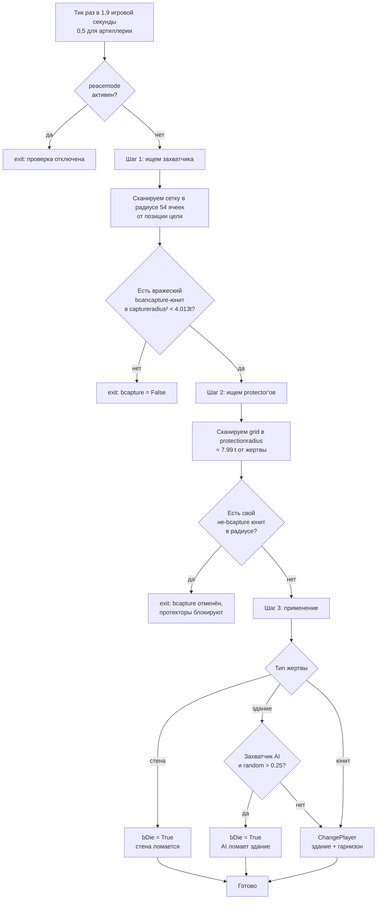

# Технический разбор захвата зданий и юнитов

[← Скрипты и сценарии](structure.md)

[Читательская статья о захвате](../../docs/recon/world/economy/capture_mechanics.md)

Разбор игровой механики по `lib/miscext.script` (функции `_misc_CheckCapture`,
`_misc_ChangePlayer`). Все ссылки на код и фрагменты на языке Pascal собраны в
разделе [Источники](#источники) в конце документа.

## Коротко о главном

В «Казаках 3» нет обращения вражеских юнитов в стиле Age of Empires II.
Захват работает чисто
**геометрически:**

- Через заданные интервалы движок измеряет евклидово расстояние от позиции
  объекта-жертвы, которую возвращает движок, до окружающих вражеских юнитов.
- Если в радиусе `gc_gameplay_captureradius` (≈ 4 клетки) нашёлся
  вражеский юнит с признаком `bcancapture`, а в радиусе
  `gc_gameplay_protectionradius` (≈ 8 клеток) нет своего юнита-защитника
  с `bprotector` — объект меняет владельца (или умирает, если
  у него выставлен `bDie`).
- Священники — **лекари**, а не захватчики. Их технические роли
  `priest`, `pope`, `mullah` и `padre` используют отрицательный урон
  для лечения и не связаны с `captureradius`.

---

## 1. Константы

Радиусы захвата [^1]:

```
gc_gameplay_captureblockshotradius = 160 / gc_pixels_to_tile = 3.0 tile
gc_gameplay_captureradius          = 214 / 53.333          ≈ 4.013 tile
gc_gameplay_protectionradius       = 426 / 53.333          ≈ 7.987 tile
gc_gameplay_resourceDropRadius     = 3 tile
*Sqr — те же значения в квадрате (для евкл. сравнения)
```

Тики [^2]:
```
gc_unit_TimeCheckCapture    = 0.1*19  ≈ 1.9   игрового сек.   (peasant + buildings)
gc_unit_TimeCheckCaptureArt = 0.1*5   ≈ 0.5   игрового сек.   (артиллерия — чаще)
```

Метрика — квадрат **евклидова расстояния** [^3]: `(px, py)` — позиция
объекта-жертвы, которую возвращает движок, `(tx, ty)` — соответствующая
позиция кандидата-захватчика. Сравнение идёт точка-к-точке, а не по
манхэттенскому расстоянию или расстоянию Чебышёва; форма здания не
учитывается. Точное отношение позиции движка к центру модели, центру
ограничивающего прямоугольника или опорной точке пока не установлено (§9).

Карточные настройки `gMap.settings.additional.capture` [^4]:
```
0 capture_default            — можно захватывать все изначально подходящие объекты
1 capture_nopeasants         — peasant нельзя захватить (default deathmatch + battles)
2 capture_nocenterspeasants  — peasant нельзя захватить + центр (TC) нельзя
3 capture_onlyartillery      — только артиллерию можно захватывать
```

Все четыре значения настройки «Правила захвата» (`capture`) с
каноническими русскими названиями приведены в
[Настройки матча](../../docs/reports/map/lobby_settings.md#capture--правила-захвата).
Взаимодействие с мирным временем (`peacetime`) и владением территорией
описано в [Как настройки матча влияют на игру](../../docs/recon/world/map/game_settings.md) §3.4.

---

## 2. Кто может быть захвачен (`bcapture = True`)

Поиск `objprop.bcapture := True` в скриптах юнитов:

### Юниты

| Каноническое название | Внутренний идентификатор | Техническая роль (`usage`) |
|---|---|---|
| Крестьянин или Крепостной | `peaaus`, `peatur`, `pearus`, `peapol`, `peaspa`, `peaeng`, `peaukr`, `peasco` | `peasant` |
| Пушка | `cannon` | `cannon` |
| Гаубица | `howitzer` | `mortar` |
| Мортира | `mortar` | `supermortar` |
| Многоствольное орудие | `multicannon` | `mcannon` |
| Рибадекин | `framegun` | `cannon` |

(Остальные типы юнитов имеют `bcapture=False` → их нельзя захватить, только убить.) [^5]

### Здания

Для готовых зданий при стандартных правилах захвата список определяется
параметром `bcapture`, который передаётся в `SetObjBuildingBaseSettings`
напрямую или через `SetObjBuildingExtProperties` [^6].

| Результат | Каноническое название | Внутренний идентификатор |
|---|---|---|
| Можно захватить | Мельница | `commonsid+'mil'` |
| Можно захватить | Рынок | `commonsid+'mar'` |
| Можно захватить | Склад | `commonsid+'sto'` |
| Можно захватить | Шахта | `commonsid+'gol'/'iro'/'coa'` |
| Можно захватить | Городской центр | `csid+'cen'` |
| Можно захватить | Дом, Изба или Хижина | `csid+'hou'` |
| Можно захватить | Академия; у Турции и Алжира — Минарет | `csid+'aca'` |
| Можно захватить | Артиллерийское депо | `csid+'art'` |
| Можно захватить | Кузница | `csid+'bla'` |
| Нельзя захватить | Порт | `commonsid+'por'` |
| Нельзя захватить | Башня | `commonsid+'tow'` |
| Нельзя захватить | Стена или ворота | `commonsid+'swa/sga'`, `ukrwwa/wga` |
| Нельзя захватить | Дипломатический центр | `csid+'dip'` |
| Нельзя захватить | Собор, Православная церковь или Мечеть | `csid+'tem'` |
| Нельзя захватить | Казарма XVII века и её национальные варианты | `csid+'bar'` |
| Нельзя захватить | Казарма XVIII века | `csid+'ba2'` |
| Нельзя захватить | Конюшня | `csid+'sta'` |
| Нельзя захватить | Здания и декорации миссий | идентификаторы с префиксом `mis` |

Таким образом, **Академия захватывается**, а обе обычные категории казарм —
нет.

`SetObjBuildingBaseSettings` также задаёт
`bcancapture := not bcapture` [^7]. Это не превращает незахватываемые
здания в захватчиков: `_unit_SearchCapturers` отдельно требует
`not bbuilding`, поэтому любое здание исключается из поиска.

Для не-зданий действует дополнительная настройка [^8]:

- **Любой** небоевой / боевой юнит, у которого `bcapture=False`,
  становится `bprotector` (защищает свои здания) и `bcancapture` (может
  захватывать) — **за исключением крестьян**.
- **Крестьянин или Крепостной** (`bcapture=True`) не является ни
  защитником (`bprotector`), ни захватчиком (`bcancapture`).
- Артиллерия (`bcapture=True`) также не является защитником или захватчиком
  (пассивна, только обороняется огнём).

⇒ Здание захватывает **обычный вражеский пехотинец или кавалерист,
но не крестьянин и не артиллерийское орудие**.

---

## 3. Проверка захвата (`_misc_CheckCapture`) — полный псевдокод

Источник: `_misc_CheckCapture` [^9]. Логика проверки в три шага:



Полный псевдокод процедуры — см. [^10]. Высокоуровневая логика по шагам:

**Подготовка.** `pobj` — объект-жертва, `scangrid` — его клетка сетки поиска.
Если `peacemode` активен и текущая клетка не вражеская, проверка
завершается сразу. Радиус обхода сетки: `rx1 = floor(214/4) + 1 = 54`.
Маска кандидатов: при `bneutral` — вражеская, иначе — своя для владельца клетки.

**Шаг 1 — найти захватчика.** Обход клеток сетки в радиусе `rx1`. В каждой
клетке с подходящей маской вызывается `_unit_SearchCapturersForWall` (для
стен) или `_unit_SearchCapturers` (для прочих). Если кандидат найден —
проверяется евклидов квадрат расстояния до жертвы:

- стена реагирует на любого вражеского юнита, кроме здания (даже на
  Крестьянина или Крепостного);
- обычное здание — только `bcancapture`-юнита, и не на воде.

При `distSqr < captureradiusSqr (≈ 4.013² tile)` поднимается `bcapture`,
запоминается `capturerHnd`. Если ещё ближе (`< 3² tile`) — взводится
`bblockshot` (заглушка стрельбы жертвы).

`_unit_SearchCapturers` ищет юнита с условиями `not bbuilding && bcancapture`,
`(myplmask & plmask) <> 0` и `pl <> mercenaryInd`. Версия для стены не
требует `bcancapture`, поэтому кандидатом становится любой вражеский
объект, не являющийся зданием, включая крестьян и артиллерию
(фактически захват = смерть стены).

**Шаг 2 — защитники.** Если жертва — здание или артиллерийское орудие, и
(для стены)
`hp >= maxhp/3`:

- *2a.* Если жертва — не Крестьянин и не Крепостной, а захватчик очень близко
  (`bblockshot`), ставим `attackdelay := max(attackdelay, 100*gc_frames_to_time)`
  (≈ 3,125 игровой секунды задержки).
- *2b.* Радиус `rx2 = floor(426/4) + 1`, обходим клетки с моими юнитами.
  `_unit_SearchProtectors` ищет юнита с `pobjprop.bprotector && not bbuilding`
  и `(myplmask & plmask) = 0`. Если найден и `not pobjprop2.bcapture`
  и `distSqr < protectionradiusSqr` — `bcapture := False` (захват
  отменяется, цикл продолжается для счётчика `protectorsCount`).
- *2c.* Логика ИИ для артиллерии (если жертва — `bartillery`, владелец — ИИ):
  при определённых соотношениях `capCount / protCount` (см. [^10])
  юнит совершает суицид (`SetTagStates(essential_death)`) — кроме
  `bEasy` или прохождения `random > 0.5`.

**Шаг 3 — применение.** Если `bcapture` остался `True`:

- Юнит, ещё не родившийся (`essential_birth & statetag`) и видимый —
  просто умирает.
- Иначе при `(statetag & visual_hide) = 0`:
  - Стены всегда умирают (`pobjprop.bwall ⇒ bDie := True`).
  - Не-здание: `_unit_Stop(goHnd)`.
  - У здания отменяются заказы производства и улучшений, затем вызываются
    `ClearOrders` и `SetSTO=0`.
  - Если владелец под управлением ИИ теряет здание, с вероятностью 75 %
    начинается разрушение (`slowdeath` / `bDie`). Для артиллерии ИИ и
    крестьян действуют отдельные
    шансы уничтожения (см. [^10]: `supermortar` ≈ 41,5 %,
    `cannon` ≈ 60,9 %, `mortar` ≈ 85,9 %, `peasant` при `bEasy` ≈ 45,3 %).
  - Если захватчик под управлением ИИ получает Крестьянина или Крепостного
    на высокой сложности, захваченный юнит погибает, а не переходит к нему.
  - Иначе — `_misc_ChangePlayer(goHnd, newPlHnd, bCapture=True, ...)`.

**Ключевые наблюдения:**
- Захват требует **только** одного захватчика в радиусе. Время захвата = 0
  (мгновенно при проверке). Игрок видит «время на захват» как
  `gc_unit_TimeCheckCapture` ≈ 1,9 игровой секунды до следующей проверки.
- Начальный момент проверки получает случайное смещение
  (`random*gc_unit_TimeCheckCapture`) при создании или загрузке объекта,
  чтобы здания не проверялись одновременно.
- **Стены не захватываются** — они автоматически `bDie := True`. Это объясняет,
  почему «захват стены ≈ слом стены». Условие в шаге 2: `if not (bwall && hp<maxhp/3)` —
  стены с прочностью ниже трети максимальной не запускают логику
  защитников и не блокируют огонь.
- **Готовые Башни** имеют `bcapture=False` ⇒ не вызывают
  `_misc_CheckCapture` и после завершения строительства не захватываются.
  Недостроенные Башни проверяются по общей ветке для строящихся зданий и
  могут сменить владельца.
- **Гарнизон**: при захвате здания, `_misc_ChangePlayer` рекурсивно меняет
  владельца всех юнитов внутри (`pObjInside`) [^11]. Производственные
  заказы отменяются, возвращая ресурсы.

### Где вызывается проверка `_misc_CheckCapture`

| Источник | Условие | Период |
|---|---|---|
| Проверка со стороны юнита [^12] | `pobjprop.bcapture and bplayable`. Только при `default OR bart OR (only_artillery and bart)`. | `TimeCheckCapture` (1,9 с) или `TimeCheckCaptureArt` (0,5 с) для артиллерии |
| Строящееся здание [^13] | `not arg_obj.bbuilt` — независимо от `bcapture` | `TimeCheckCapture` |
| Готовое здание [^14] | `pobjprop.bcapture`; учитывает настройку карты. При `only_artillery` здания не проверяются | `TimeCheckCapture` |

⚠️ **Строящееся здание** проверяется на захват всегда, включая Башню.
После завершения Башни `bcapture=False` отключает проверку.

---

## 4. Захват юнитов

### Кого можно захватить как юнита

- Крестьянин или Крепостной любой нации (внутренний шаблон `pea*`).
- Пушка (`cannon`), Гаубица (`howitzer`), Мортира (`mortar`),
  Многоствольное орудие (`multicannon`) и Рибадекин (`framegun`).

Это всё. Пехота, кавалерия, корабли — захватить **нельзя** (только убить).

### Кто захватывает
Любой обычный пехотинец или кавалерист, удовлетворяющий
`bcancapture && not bbuilding && not peasant`. Крестьянин и само
захватываемое орудие не подходят.

### Что становится с захваченным
- Крестьянин или Крепостной при стандартных условиях меняет владельца
  (`_misc_ChangePlayer`). Переносимый ресурс не выпадает; поведение ИИ
  перезапускается.
- Артиллерийское орудие меняет владельца, а заряд сохраняется в
  `weapon.cost`. Задержки производства сбрасываются.
- Захваченный юнит **выходит из отряда**
  (`_misc_SquadChangePlayer`); артиллерийский строй распадается.

### Стандартные правила в «На смерть» и «Историческом сражении»

Оба режима устанавливают `capture_nopeasants` [^15], поэтому **в стандартных
матчах крестьяне не захватываются**, только убиваются. Захват крестьянина
возможен лишь в отдельной партии с настройкой `capture_default`.

---

## 5. Нейтральные объекты, клады и наёмники

### Нейтральные игроки (`gPlayer[i].bneutral`)
- Поле `bneutral : Boolean` в структуре `TPlayer` [^16].
- Используется в **миссиях/сценариях** [^17] — скриптеры могут
  переключать `bneutral=true/false` для дипломатии. В мультиплеере /
  случайных картах **этот признак не активен** для обычных игроков.

### Наёмники (технический игрок `MaxPlayer-1`)
- `gc_player_mercenaryind = gc_MaxPlayerCount-1` [^18].
- Юниты с `bmercenary=True`, нанятые в Дипломатическом центре,
  при `brebellion=True` у владельца могут **перейти к техническому
  игроку наёмников** [^19]. То есть они уходят к нейтралу при банкротстве
  (нет золота). Это НЕ захват противником.
- Наёмники **не считаются захватчиками** [^20] — фильтр в
  `_unit_SearchCapturers`.

### Сокровища и сундуки

**Не найдено.** Поиски `treasure|chest|clad|gc_obj_usage_treasure|stash`
не дают результатов в скриптах. В «Казаках 3» нет нейтральных кладов,
которые встречались в первой части игры, например в кампании «Восстание
Степана Разина».

### Нейтральные крестьяне на карте
`SetupStartingResources` (см. [разбор генерации карты](../../docs/recon/world/map/map_generation_pipeline.md))
создаёт **18 крестьян в сетке 6×3** в начале игры — **все они уже
принадлежат игроку**, не нейтральны. Других нейтральных юнитов на
карте нет.

### Нейтральные здания
Нет. Все здания на карте принадлежат игрокам; при бунте наёмники
переходят отдельному техническому игроку, но здания — нет.

---

## 6. Захват башен (специфика)

Все башни (`commonsid+'tow'`, `misblg`, `misblg2`) имеют **`bcapture=False`** [^21].

- Они НЕ вызывают `_misc_CheckCapture` после постройки.
- У Башни нет мест для гарнизона (`peasantabsorber=0`, `transport=0`,
  см. [^21] и [раздел о юнитах внутри зданий](../../docs/recon/world/economy/building_mechanics.md#юниты-внутри-зданий)
  в статье о [строительстве и ремонте](../../docs/recon/world/economy/building_mechanics.md)), поэтому вопрос
  «что происходит с гарнизоном
  при разрушении» к башне неприменим. Для прочих зданий с `peasantabsorber>0`
  или `transport>0` (центр, казармы, корабли-транспорты) при разрушении
  срабатывает `_unit_DestroyObj` [^22], который вызывает
  `_unit_DoUnitsGoOutside(list, bDead=True, ...)`. В этом режиме процедура
  устанавливает `essential_death` каждому юниту в списке [^23] — то есть
  содержимое убивается одновременно со зданием.
- **Исключение:** во время стройки (когда `arg_obj.bbuilt=False`), любое
  здание проверяется на захват [^13]. Поэтому **недостроенную башню
  можно захватить** обычным пехотинцем, подойдя ближе чем на четыре клетки.

---

## 7. Священники лечат, а не обращают противника

**Нет такой механики.**
- `bpriest` — технический признак [^24], используется только в [^25].
- Логика: при «атаке» Священника с `bpriest=True`,
  `damage := indamage` (исходное значение без защиты), затем
  `pobj2.hp := pobj2.hp + damage` ⇒ **лечение**, а не конвертация.
- В коде Священника нет вызова `_misc_ChangePlayer`.
- Юниты с ролью лекаря (`pope`, `mullah`, `padre`, `priest`) — все
  указаны в [^26], все имеют `bpriest=True` через [^27].

⇒ Священник в «Казаках 3» — **лекарь**, который использует
«отрицательный урон» и не меняет владельца цели.

---

## 8. Точные радиусы захвата

```
Метрика:           Euclidean²  (Sqr(dx)+Sqr(dy) < radiusSqr)
Точки отсчёта:     позиции объектов X/Z, возвращённые движком
Расстояние:        в клетках карты (1 клетка = 53.333 px)
captureradius      ≈ 4.0125 клетки
                   = 214 px game-source units
captureblockshot   = 3.0 tile     (заглушает огонь жертвы)
protectionradius   ≈ 7.987 tile   (зона protector'а, отменяет захват)
```

⇒ Чтобы захватить здание, подходящему пехотинцу или кавалеристу нужно
подвести собственную позицию, возвращённую движком, на расстояние менее
4,013 клетки от такой же позиции здания по евклидовой метрике. Границы модели
и занимаемая площадь в расчёт не входят, поэтому у крупного здания расстояние
от видимого края может отличаться. Является ли позиция движка центром модели,
центром ограничивающего прямоугольника или другой опорной точкой, пока не
установлено (§9).

---

## 9. Что ещё требует проверки

1. **Точная позиция (`px`, `py`) у здания:** центр модели, центр
   ограничивающего прямоугольника или опорная точка?
   `GetGameObjectPositionXByHandle/ZByHandle` нужно проверить в игре:
   построить Академию, подвести вражеского пехотинца к краю и измерить
   минимальное расстояние до события захвата.
2. Для стены (`wall`) `_unit_SearchCapturersForWall` не требует
   `bcancapture`. Значит, крестьяне и артиллерия тоже могут ломать
   стену через механизм захвата, а не только обычной атакой. Проверить
   в отдельной партии без мирного времени (`peacetime=off`).
3. Артиллерия проверяется чаще (0,5 с против 1,9 с) — означает, что её
   захват проходит примерно в четыре раза быстрее. `_misc_CheckCapture`
   срабатывает мгновенно, задержка определяется только периодом проверки.
   Нужно измерить максимальное время как `≤ 0,5` игровой секунды.
4. Как проверка взаимодействует с туманом войны? Предположительно,
   сервер выполняет её даже для невидимой жертвы.
5. **`bsearchminattackradius`** на пушках — есть ли связь между захватом
   и тем, что орудие переключилось на ближний бой?

---

## Источники

Все ссылки указаны относительно `data/scripts/` в установке «Казаков 3».

[^1]: Константы радиусов захвата — `dmscript.global:207-220`:

    ```pascal
    gc_gameplay_captureblockshotradius = 160 / gc_pixels_to_tile;
    gc_gameplay_captureradius          = 214 / gc_pixels_to_tile;
    gc_gameplay_protectionradius       = 426 / gc_pixels_to_tile;
    gc_gameplay_resourceDropRadius     = 3;
    ```

[^2]: Тик-периоды — `dmscript.global:1478-1480`:

    ```pascal
    gc_unit_TimeCheckCapture    = 0.1 * 19;
    gc_unit_TimeCheckCaptureArt = 0.1 * 5;
    ```

[^3]: Метрика `Euclidean²` — `lib/miscext.script:1017-1018`:

    ```pascal
    distSqr := Sqr(px-tx) + Sqr(py-ty);
    if distSqr < gc_gameplay_captureradiusSqr then ...
    ```

[^4]: Карточные настройки `gMap.settings.additional.capture` — `dmscript.global:1072-1075`:

    ```pascal
    gc_capture_default            = 0;
    gc_capture_nopeasants         = 1;
    gc_capture_nocenterspeasants  = 2;
    gc_capture_onlyartillery      = 3;
    ```

[^5]: Юниты с `bcapture=True` — `lib/unit.script`:1199 (`peaaus`,
      `peatur`, `pearus`, `peapol`, `peaspa`, `peaeng`, `peaukr`,
      `peasco`), 1721 (`cannon`), 1753 (`howitzer`), 1785 (`mortar`),
      1812 (`multicannon`), 1843 (`framegun`).

[^6]: Здания с `bcapture` в `_unit_InitBase` — `lib/unit.script`.
      `bCapture` — константа `True` (строка 594). При `bcapture=True`:
      2142 (Мельница), 2190 (Рынок), 2205 (Склад), 2312 (Шахты), 2371
      (Городской центр), 2403 (Дом), 2421 (Академия), 2440
      (Артиллерийское депо), 2514 (Кузница). При `bcapture=False`: 2153
      (Порт), 2224 (Башня), 2259/2286 (стены и ворота), 2452
      (Дипломатический центр), 2462 (Собор / Православная церковь /
      Мечеть), 2472 (Казарма XVII века), 2493 (Казарма XVIII века), 2503
      (Конюшня), 2540/2555/2564/2576 (здания и декорации миссий).

[^7]: Правило `bcancapture := not bcapture` —
      `lib/unit.script:469`. Исключение зданий из поиска захватчиков —
      `_unit_SearchCapturers`, `lib/unit.script:4656`.

[^8]: Дефолты `bprotector` / `bcancapture` для не-зданий — `lib/unit.script:2096-2097`:

    ```pascal
    objprop.bprotector  := not objprop.bcapture;
    objprop.bcancapture := (not objprop.bcapture) and (objprop.usage <> gc_obj_usage_peasant);
    ```

[^9]: `_misc_CheckCapture` — `lib/miscext.script:961-1185`.

[^10]: Полный псевдокод `_misc_CheckCapture` — `lib/miscext.script:961-1185`:

    ```pascal
    procedure _misc_CheckCapture(goHnd):
      pobj      := объект-жертва
      scangrid  := его клетка скан-сетки
      bneutral  := (not gbool_peacemode) or (owner-of-grid <> мой pl)
      if not bneutral: return                          // в peacetime + рядом наш  не проверяем

      bwall    := pobjprop.bwall
      enemyplmask := gPlayer[my pl].enemyplmask
      rx1 := floor(214/4) + 1 = 54  → радиус сканирования по grid-cells
      capturePlMask := bneutral ? enemyPlMask : myPlMask-of-grid-owner

      // -------- Шаг 1: найти захватчика --------
      bcapture := False; capturerCount := 0; bblockshot := False
      for каждой grid-cell в радиусе rx1 от scangrid:
        if в клетке есть юниты enemyplmask:
          trgHnd := bwall ? _unit_SearchCapturersForWall(...) : _unit_SearchCapturers(...)
          if trgHnd != 0:
             pobjprop2 = ObjProp(trgHnd)
             // Стены ловят любой вражеский объект, кроме здания (даже peasant/art);
             // обычные здания — только bcancapture-юнита, и не на воде
             if bwall or (not (pobjprop2.bcapture or pobjprop2.media=water)):
                distSqr := (px-tx)² + (py-ty)²
                if distSqr < captureradiusSqr (≈4.013² tile):
                   bcapture := True
                   capturerCount += 1
                   capturerHnd := trgHnd
                   if distSqr < captureblockshotradiusSqr (3² tile):
                      bblockshot := True

      // _unit_SearchCapturers ищет юнита с условиями:
      //   not bbuilding && bcancapture && (myplmask & plmask)<>0
      //                                   && pl <> mercenaryInd
      // _unit_SearchCapturersForWall — то же, БЕЗ требования bcancapture
      //   (любой вражеский объект, кроме здания, ломает стену = «захватывает»),
      //   фактически здесь захват = смерть стены (bDie=True ниже).

      // -------- Шаг 2: если жертва — здание/арт-юнит у стены, и hp >= maxhp/3 --------
      if bcapture and (not (bwall and TObj(pobj).hp < maxhp/3)):

         // 2a. Если уцель — НЕ peasant, и захватчик ОЧЕНЬ близко (<3 tile),
         //     заглушаем стрельбу здания на 100 кадров (≈3,125 игровой секунды):
         if usage<>peasant and bblockshot:
            attackdelay := max(attackdelay, 100*gc_frames_to_time)

         // 2b. Найти protector'ов в радиусе protectionradius (~7.99 tile)
         rx2 := floor(426/4) + 1
         for grid-cells в rx2 (только клетки с моими юнитами myplmask):
            trgHnd := _unit_SearchProtectors(...) — ищет юнита с pobjprop.bprotector
                                                    && not bbuilding && (myplmask & plmask)=0
            if trgHnd != 0:
               if not pobjprop2.bcapture:
                  if distSqr < protectionradiusSqr:
                     bcapture := False; protectorsCount += 1; (но цикл продолжается)

         // 2c. AI-арт-логика: если жертва — bartillery и pl=AI,
         //     и слишком много protector'ов — суицид:
         if gPlayer[my pl].bai and pobjprop.bartillery:
            if (capCount>=protCount and protCount=1) or
               (capCount>3 and protCount=2)        or
               (capCount>7 and protCount=3)        or
               (capCount>10 and protCount=4):
               if (not bEasy) or (random>0.5):
                  SetTagStates(goHnd, essential_death); exit

      // -------- Шаг 3: применение захвата --------
      if bcapture:
         statetag := GetGameObjectStatesTag(goHnd)
         // Юнит, ещё не родившийся (essential_birth) и видимый — просто умирает:
         if not bbuilding and (essential_birth & statetag) and (not visual_hide):
            SetTagStates(essential_death); exit

         if (statetag & visual_hide) = 0:
            if bbuilding or (essential_none & statetag) <> 0:
               bDie := False; bAutoKill := False  // (bAutoKill в коде не задаётся явно)
               if bAutoKill or pobjprop.bwall:
                  bDie := True                    // СТЕНЫ всегда умирают, не захватываются

               if not bbuilding:
                  _unit_Stop(goHnd)
               else:
                  отменить produce/upgrade orders;  ClearOrders;  SetSTO=0

               newPlHnd := player захватчика;  newPlInd := его index

               // alarm-event для захваченного игрока:
               if my pl == InterfaceIO_pl:
                  _misc_DoAlarm(capturerHnd, goHnd, alarmevent_capture)

               // ---- AI-захватчик: иногда «ломает» вместо захвата ----
               if gPlayer[my pl].bai:        // ai теряет здание
                  if bbuilding:
                     if random > 0.25:        // 75% шанс что зайдёт в деструкцию
                        if bbuilt and pobjprop.bslowdeath and hp>1999:
                           hp := 1999 - floor(RandomExt*300)   // медленная агония
                        else:
                           bDie := True
                  else:                       // юнит peasant/арт
                     if usage=peasant and not bEasy:
                        bDie := True          // hard+: ai уничтожает своего peasant'а перед захватом
                     else case usage of
                        supermortar: if random>0.585     then bDie := True   // ≈41.5% suicide
                        cannon:      if random>0.391     then bDie := True   // ≈60.9% suicide
                        mortar:      if random>0.141     then bDie := True   // ≈85.9% suicide
                        peasant:     if random>0.547     then bDie := True   // ≈45.3% (если bEasy)
               else if gPlayer[newPlInd].bai and usage=peasant and not bEasy:
                  bDie := True                 // обратное: AI-захватчик «убивает» peasant'а в hard

               if bDie: SetTagStates(essential_death)
               else:    _misc_ChangePlayer(goHnd, newPlHnd, bCapture=True, bCustom=False, bLAN=True)
    ```

[^11]: Рекурсивный обход гарнизона в `_misc_ChangePlayer` — `lib/miscext.script:932-933`.

[^12]: Проверка захвата со стороны юнита —
       `units/unit.inc/nothing.inc:507-535`.

[^13]: Проверка строящегося здания — `units/building.inc/nothing.inc:300-304`.

[^14]: Проверка готового здания — `units/building.inc/nothing.inc:311-326`.

[^15]: Стандартные значения для режимов «На смерть» и «Историческое
       сражение» — `lib/map.script:276,283` (оба режима выставляют
       `capture_nopeasants`).

[^16]: Поле `bneutral : Boolean` в `TPlayer` — `lib/classes.script:3698`.

[^17]: Использование `bneutral` в сценариях — `lib/scenario.script:2181-2238`.

[^18]: `gc_player_mercenaryind = gc_MaxPlayerCount-1` — `dmscript.global:776`.

[^19]: Уход наёмников при `brebellion` — `units/unit.inc/nothing.inc:487-505`:

    ```pascal
    if gPlayer[plInd].brebellion and pobjprop.bmercenary and plInd<>mercenaryInd:
       if random_check_per_difficulty:
          _misc_ChangePlayer(myHnd, plMercHnd, False, False, True);
    ```

[^20]: Фильтр технического игрока наёмников в `_unit_SearchCapturers` —
       `lib/unit.script:4656`:

    ```pascal
    (TObj(pobj).pl <> gc_player_mercenaryind)
    ```

[^21]: Башни (`commonsid+'tow'`, `misblg`, `misblg2`) с `bcapture=False` — `lib/unit.script:2224, 2540`. Параметры `peasantabsorber=0`, `transport=0` для башни — `lib/unit.script:2223-2224`.

[^22]: `_unit_DestroyObj` для зданий с гарнизоном — `lib/miscext2.script:4232-4242`.

[^23]: `_unit_DoUnitsGoOutside` ставит `essential_death` при `bDead=True` — `lib/unit.script:4559-4564`.

[^24]: Технический признак `bpriest` — `lib/classes.script:3645`.

[^25]: Логика роли `priest`: лечение без смены владельца —
       `lib/miscext2.script:362-399`.

[^26]: Юниты с ролью `priest` (`pope`, `mullah`, `padre`, `priest`) —
       `lib/country.script:2741-2744`.

[^27]: Установка `bpriest=True` для юнитов роли `priest` —
       `lib/unit.script:1151+`.

[^28]: Функции поиска кандидатов: `_unit_SearchCapturers` — `lib/unit.script:4639-4664`; `_unit_SearchCapturersForWall` — `lib/unit.script:4666-4691`; `_unit_SearchProtectors` — `lib/unit.script:4615-4637`.

[^29]: Дефолты `bcapture` / `bcancapture` / `bprotector` для зданий — `lib/unit.script:467-471`.

[^30]: `_misc_ChangePlayer` — `lib/miscext.script:892-959`.
