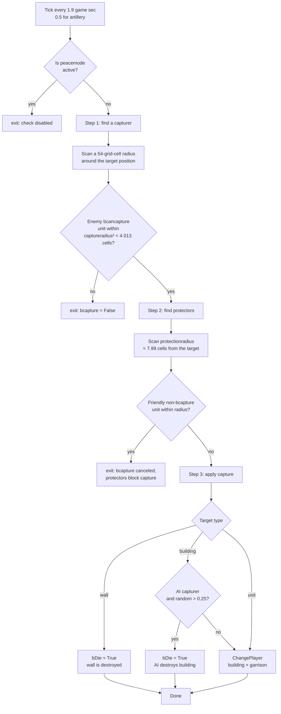

<a id="recon-механика-захвата"></a>
<a id="как-захватываются-здания-и-юниты"></a>
<a id="технический-разбор-захвата-зданий-и-юнитов"></a>
# Technical Evidence for Building and Unit Capture

[← Scripts and Scenarios](structure.md)

[Reader-facing capture article](../../docs_en/recon/world/economy/capture_mechanics.md)

This article explains the capture mechanic using `lib/miscext.script`,
especially `_misc_CheckCapture` and `_misc_ChangePlayer`. Code
references and Pascal excerpts are collected under [Sources](#sources).

<a id="коротко-о-главном"></a>
## TL;DR

Cossacks 3 has no Age of Empires II-style conversion. Capture is
purely **geometric**:

- At scheduled intervals, the engine measures the Euclidean distance from the
  target object's reference point to nearby enemy units.
- If an enemy unit with `bcancapture` is within
  `gc_gameplay_captureradius` (about four map cells), and the target has no
  friendly `bprotector` unit within `gc_gameplay_protectionradius` (about
  eight map cells), the object changes owner—or is destroyed when the capture
  branch sets `bDie`.
- Priests are **healers**, not capturers. Their technical roles
  `priest`, `pope`, `mullah`, and `padre` use negative damage for
  healing and are unrelated to `captureradius`.

---

<a id="1-константы"></a>
## 1. Constants

Capture radii [^1]:
```
gc_gameplay_captureblockshotradius = 160 / gc_pixels_to_tile = 3.0 cells
gc_gameplay_captureradius          = 214 / 53.333          ≈ 4.013 cells
gc_gameplay_protectionradius       = 426 / 53.333          ≈ 7.987 cells
gc_gameplay_resourceDropRadius     = 3 cells
*Sqr — the same values squared (for Euclidean comparisons)
```
Ticks [^2]:
```
gc_unit_TimeCheckCapture    = 0.1*19  ≈ 1.9 game sec   (peasants + buildings)
gc_unit_TimeCheckCaptureArt = 0.1*5   ≈ 0.5 game sec   (artillery — checked more often)
```
The metric is **squared Euclidean distance** [^3]: `(px, py)` is the
target position returned by the engine, and `(tx, ty)` is the corresponding
position of the candidate capturer. The comparison is point-to-point, not
Manhattan or Chebyshev distance, and does not use the building footprint.
The exact relationship between this engine position and the model center,
bounding box, or object anchor remains to be measured (§9).

The map setting `gMap.settings.additional.capture` controls the rule [^4]:
```
0 capture_default            — all initially eligible objects can be captured
1 capture_nopeasants         — peasants cannot be captured (default deathmatch + battles)
2 capture_nocenterspeasants  — peasants and Town Halls cannot be captured
3 capture_onlyartillery      — only artillery can be captured
```
All four values of the `capture` option, with their canonical labels, are
listed in the
[lobby settings](../../docs_en/reports/map/lobby_settings.md#capture--правила-захвата).
The interaction between `capture`, `peacetime`, and territory ownership is
covered in [match settings](../../docs_en/recon/world/map/game_settings.md)
§3.4.

---

<a id="2-кто-может-быть-захвачен-bcapture--true"></a>
## 2. Who can be captured (`bcapture` = True)

Search for `objprop.bcapture := True` in unit scripts:

<a id="юниты"></a>
### Units

| Canonical name | Internal ID | Technical `usage` |
|---|---|---|
| Peasant or Serf | `peaaus`, `peatur`, `pearus`, `peapol`, `peaspa`, `peaeng`, `peaukr`, `peasco` | `peasant` |
| Cannon | `cannon` | `cannon` |
| Howitzer | `howitzer` | `mortar` |
| Bombard | `mortar` | `supermortar` |
| Multi-barrelled Cannon | `multicannon` | `mcannon` |
| Frame gun | `framegun` | `cannon` |

(Other types of units have `bcapture=False` → they cannot be captured, only killed.) [^5]

<a id="здания"></a>
### Buildings

For completed buildings under the default capture rules, the result is
determined by the `bcapture` argument passed directly to
`SetObjBuildingBaseSettings` or indirectly through
`SetObjBuildingExtProperties` [^6].

| Result | Canonical name | Internal ID |
|---|---|---|
| Capturable | Mill | `commonsid+'mil'` |
| Capturable | Market | `commonsid+'mar'` |
| Capturable | Storehouse | `commonsid+'sto'` |
| Capturable | Mine | `commonsid+'gol'/'iro'/'coa'` |
| Capturable | Town Hall | `csid+'cen'` |
| Capturable | Housing, Izba, or Hut | `csid+'hou'` |
| Capturable | Academy; Minaret for Turkey and Algeria | `csid+'aca'` |
| Capturable | Artillery Depot | `csid+'art'` |
| Capturable | Blacksmith | `csid+'bla'` |
| Not capturable | Shipyard | `commonsid+'por'` |
| Not capturable | Tower | `commonsid+'tow'` |
| Not capturable | Wall or Gate | `commonsid+'swa/sga'`, `ukrwwa/wga` |
| Not capturable | Diplomatic Center | `csid+'dip'` |
| Not capturable | Cathedral, Orthodox Cathedral, or Mosque | `csid+'tem'` |
| Not capturable | Barracks, 17th century, and its national variants | `csid+'bar'` |
| Not capturable | Barracks, 18th century | `csid+'ba2'` |
| Not capturable | Stable | `csid+'sta'` |
| Not capturable | Mission buildings and scenery objects | IDs beginning with `mis` |

Therefore, the **Academy is capturable**, while both regular barracks
categories are not.

`SetObjBuildingBaseSettings` also assigns
`bcancapture := not bcapture` [^7]. This does not allow an uncapturable
building to capture another object: `_unit_SearchCapturers` separately
requires `not bbuilding`, excluding every building from the search.

For non-buildings, the additional setting [^8] applies:

- **Any** ordinary unit that has `bcapture=False`
  becomes `bprotector` (protects its buildings) and `bcancapture` (can
  capture), **except a Peasant**.
- A **Peasant or Serf** (`bcapture=True`) is neither a protector nor
  a capturer; it is a passive capture target.
- Artillery (`bcapture=True`) is neither a protector nor a capturer
  (passive, only defends itself with fire).

⇒ A building is captured by **an ordinary enemy infantryman or
cavalryman, but not a Peasant or artillery piece**.

---

<a id="3-триггер-misccheckcapture--полный-псевдокод"></a>
<a id="3-проверка-захвата-_misc_checkcapture--полный-псевдокод"></a>
## 3. Capture check (`_misc_CheckCapture`) — full pseudocode

Source: `_misc_CheckCapture` [^9]. The check has three stages:

For the complete pseudocode of the procedure, see [^10]. High-level logic step by step:

**Preparation.** `pobj` is the target object and `scangrid` is its spatial-grid
cell. If peacetime is active and the cell is not considered enemy territory,
the procedure returns immediately. The grid scan radius is
`rx1 = floor(214/4) + 1 = 54`. A neutral object uses the enemy mask;
otherwise the mask is derived from the cell owner's diplomacy.

**Step 1 — find a capturer.** The procedure scans every grid cell within
`rx1`. In matching cells it calls `_unit_SearchCapturersForWall` for Walls
or `_unit_SearchCapturers` for other objects. For every candidate it compares
the squared Euclidean distance to the target:

- a Wall accepts any enemy object except a building (including Peasants
  and artillery) as a candidate;
- an ordinary building accepts only a `bcancapture` unit that is not on
  water.

When `distSqr < captureradiusSqr` (about `4.013²` map cells), `bcapture` is
set and the candidate handle is stored in `capturerHnd`. If the candidate
is closer than three map cells, `bblockshot` is also set, delaying the target's
fire.

`_unit_SearchCapturers` requires `not bbuilding && bcancapture`,
`(myplmask & plmask) <> 0`, and `pl <> mercenaryInd`. The Wall-specific
version does not require `bcancapture`, so any enemy object other than a
building can become the candidate, including Peasants and artillery.
For a Wall, capture therefore means destruction.

**Step 2 — find protectors.** This stage runs for a building or artillery
target and, in the Wall branch, only while `hp >= maxhp/3`:

- *2a.* If the target is not a Peasant and the capturer is very close
  (`bblockshot`), the procedure sets
  `attackdelay := max(attackdelay, 100*gc_frames_to_time)`, or about
  3.125 game seconds.
- *2b.* Within `rx2 = floor(426/4) + 1`, `_unit_SearchProtectors` looks
  for a non-building unit with `bprotector`. A valid protector within
  `protectionradiusSqr` resets `bcapture` to `False`.
- *2c.* If the target is AI-controlled artillery, additional logic may
  destroy it according to the `capCount / protCount` ratio (see [^10]).
  Easy difficulty and a `random > 0.5` result bypass parts of this branch.

**Step 3 — apply the result.** If `bcapture` remains `True`:

- A visible unit still in `essential_birth` simply dies.
- Otherwise, with `(statetag & visual_hide) = 0`:
  - Walls always die (`pobjprop.bwall ⇒ bDie := True`).
  - Non-building: `_unit_Stop(goHnd)`.
  - For a building, production and research orders are canceled before
    `ClearOrders` and `SetSTO=0`.
  - When an AI player loses a building, there is a 75% chance that the
    building is destroyed instead. AI-controlled artillery and Peasants use
    separate destruction probabilities (see [^10]: `supermortar` ≈ 41.5%,
    `cannon` ≈ 60.9%, `mortar` ≈ 85.9%, and a Peasant on Easy ≈ 45.3%).
  - When a hard-difficulty AI captures a Peasant, the Peasant may die instead
    of changing owner.
  - Otherwise, `_misc_ChangePlayer(goHnd, newPlHnd, bCapture=True, ...)`
    transfers ownership.

**Key observations:**

- Capture requires only **one** eligible unit within range. The ownership
  change itself is immediate; the apparent delay is the time until the next
  check, at most about 1.9 game seconds for buildings and Peasants.
- Checks receive a random initial offset
  (`random*gc_unit_TimeCheckCapture`) so that all objects are not processed
  simultaneously.
- **Walls are not captured**: the branch sets `bDie := True`. Walls below
  one-third durability also skip the protector and fire-blocking checks.
- **Completed Towers** have `bcapture=False` and therefore do not call
  `_misc_CheckCapture`; they cannot be captured after construction.
  Unfinished Towers use the common branch for buildings under
  construction and can change ownership.
- **Internal units:** `_misc_ChangePlayer` recursively changes the owner of
  every unit in `pObjInside` [^11]. Production orders are canceled and
  their resources refunded.

<a id="триггеры-где-вызывается-misccheckcapture"></a>
<a id="где-вызывается-проверка-_misc_checkcapture"></a>
### Where `_misc_CheckCapture` is called

| Source | Condition | Period |
|---|---|---|
| Unit-side trigger [^12] | `pobjprop.bcapture and bplayable`; enabled for Default, or for artillery under the relevant settings | `TimeCheckCapture` (1.9 s), or `TimeCheckCaptureArt` (0.5 s) for artillery |
| Building under construction [^13] | `not arg_obj.bbuilt`, regardless of `bcapture` | `TimeCheckCapture` |
| Completed building [^14] | `pobjprop.bcapture`, subject to the map setting; Artillery Only disables building checks | `TimeCheckCapture` |

Every **unfinished building** is checked for capture, including a Tower under
construction. Once the Tower is complete, `bcapture=False` disables the
check.

---

<a id="4-захват-юнитов"></a>
## 4. Capturing units

<a id="кого-можно-захватить-как-юнита"></a>
### Who can be captured as a unit

- Peasant or Serf of any nation (internal pattern `pea*`).
- Cannon (`cannon`), Howitzer (`howitzer`), Bombard (`mortar`),
  Multi-barrelled Cannon (`multicannon`), and Frame gun (`framegun`).

No other units are eligible. Infantry, cavalry, and ships can only be killed.

<a id="кто-захватывает"></a>
### Who captures the unit

Any ordinary infantry or cavalry unit satisfying
`bcancapture && not bbuilding && not peasant` qualifies. Peasants and
capturable artillery do not.

<a id="что-становится-с-захваченным"></a>
### What happens to a captured unit

- A Peasant or Serf changes owner through `_misc_ChangePlayer`.
  Carried resources are retained, and AI behavior restarts.
- An artillery piece changes owner while its ammunition remains in
  `weapon.cost`; its action delays are reset.
- A captured unit **leaves its formation**
  (`_misc_SquadChangePlayer`), breaking an artillery formation.

<a id="по-умолчанию-в-deathmatch-и-historical-battle"></a>
<a id="стандартные-правила-в-на-смерть-и-историческом-сражении"></a>
### Default rule in Deathmatch and Historical Battle

Both modes set `capture_nopeasants` [^15]. Peasants are therefore killed
rather than captured in standard matches. Capturing Peasants requires a
Skirmish with the Default capture rule.

---

<a id="5-нейтральные-объекты-клады-мерценарий"></a>
<a id="5-нейтральные-объекты-клады-и-наёмники"></a>
## 5. Neutral objects, treasures, and mercenaries

<a id="нейтральные-игроки-gplayeribneutral"></a>
### Neutral players (`gPlayer[i].bneutral`)

- `TPlayer` contains the Boolean field `bneutral` [^16].
- Mission and scenario scripts may toggle it to alter diplomacy [^17].
  Ordinary players on random and multiplayer maps do not use this flag.

<a id="mercenary-player-index--maxplayer-1--особый-виртуальный-игрок"></a>
<a id="наёмники-технический-игрок-maxplayer-1"></a>
### Mercenary side (`MaxPlayer-1`)

- `gc_player_mercenaryind = gc_MaxPlayerCount-1` [^18].
- When an owner has `brebellion=True`, units hired from the Diplomatic Center
  with `bmercenary=True` may **defect to this game-controlled side** [^19].
  The transfer is a rebellion caused by a Gold shortage, not enemy capture.
- Mercenary units are excluded from the capturer search [^20] by a filter in
  `_unit_SearchCapturers`.

<a id="treasure--chest--clad"></a>
<a id="сокровища-и-сундуки"></a>
### Treasures and chests

No corresponding mechanic was found. Searches for
`treasure|chest|clad|gc_obj_usage_treasure|stash` return no relevant script
logic. Unlike the first Cossacks game, Cossacks 3 does not place neutral
treasures on random maps.

<a id="нейтральные-крестьяне-на-карте"></a>
### Neutral peasants on the map
`SetupStartingResources` (see
[map generation](../../docs_en/recon/world/map/map_generation_pipeline.md))
spawns **18 Peasants in a 6×3 grid**. They belong to their player from the
moment they are created; they are not neutral.

<a id="нейтральные-здания"></a>
### Neutral buildings

Random maps do not create neutral buildings. Buildings belong to a player;
scenario scripts can create other arrangements.

---

<a id="6-захват-башен-специфика"></a>
## 6. Tower capture

All Towers (`commonsid+'tow'`, `misblg`, `misblg2`) have
**`bcapture=False`** [^21].

- They DO NOT call `_misc_CheckCapture` after construction.
- A Tower has no internal unit slots (`peasantabsorber=0`, `transport=0`;
  see [^21] and
  [Units inside buildings](../../docs_en/recon/world/economy/building_mechanics.md#units-inside-buildings)).
  Other buildings and transports with internal capacity call
  `_unit_DestroyObj` [^22] on destruction. It invokes
  `_unit_DoUnitsGoOutside(list, bDead=True, ...)`, which assigns
  `essential_death` to every contained unit [^23].
- During construction (`arg_obj.bbuilt=False`), every building is checked
  for capture [^13]. An unfinished Tower can therefore be captured by an
  ordinary infantry unit within four map cells.

---

<a id="7-конверсия-priest-как-конвертер"></a>
<a id="7-священники-лечат-а-не-обращают-противника"></a>
## 7. Priests heal; they do not convert enemies

There is no priest conversion mechanic.

- `bpriest` is the technical flag [^24] used by the healing branch [^25].
- When a priest acts on a unit, the script uses the unmitigated
  `indamage` value and adds it to the target's durability:
  `pobj2.hp := pobj2.hp + damage`.
- The priest branch never calls `_misc_ChangePlayer`.
- The roles `pope`, `mullah`, `padre`, and `priest` [^26] all receive
  `bpriest=True` [^27].

⇒ A Priest in Cossacks 3 is a **healer** using negative damage. It
never changes the target's owner.

---

<a id="8-capture-радиус--точные-числа"></a>
<a id="8-точные-радиусы-захвата"></a>
## 8. Exact capture radii
```
Metric:            Euclidean²  (Sqr(dx)+Sqr(dy) < radiusSqr)
Reference points:  engine-returned game-object positions X/Z, point to point
Distance:          in map cells (1 cell = 53.333 px)
captureradius      ≈ 4.0125 cells
                   = 214 px game-source units
captureblockshot   = 3.0 cells    (suppresses the target's fire)
protectionradius   ≈ 7.987 cells  (protector zone; cancels capture)
```
⇒ To capture a building, an eligible infantry or cavalry unit must approach
the building's **engine position** to within 4.013 map cells (Euclidean). If the
building has a large footprint (for example, a 5×4 Town Hall), its apparent
edge-to-unit distance can differ because the function does not measure from
the footprint or nearest edge. Whether the returned engine position is the
model center, bounding-box center, or another anchor is still unresolved (§9).

---

<a id="9-что-ещё-требует-проверки"></a>
## 9. What still needs verification

1. **Exact reference position (`px`, `py`).** Determine whether the value
   returned by `GetGameObjectPositionXByHandle/ZByHandle` corresponds to the
   model center, bounding-box center, or another anchor. Measure the minimum
   capture distance around an asymmetric Academy.
2. `_unit_SearchCapturersForWall` does not require `bcancapture`. Can a
   Peasant or artillery piece therefore destroy a Wall merely by approaching
   it? Test in a skirmish with `peacetime=off` and no attack order.
3. Artillery is checked every 0.5 game seconds rather than every 1.9. Does
   the observed maximum capture delay stay at or below 0.5 game seconds?
4. Does the server continue the capture check when the victim is hidden by
   fog of war?
5. Does `bsearchminattackradius` on artillery interact with capture when the
   weapon switches to close-range behavior?

---

<a id="источники"></a>
## Sources

All links are relative to `data/scripts/` in the Cossacks 3 installation.

[^1]: Capture-radius constants — `dmscript.global:207-220`:
    ```pascal
    gc_gameplay_captureblockshotradius = 160 / gc_pixels_to_tile;
    gc_gameplay_captureradius          = 214 / gc_pixels_to_tile;
    gc_gameplay_protectionradius       = 426 / gc_pixels_to_tile;
    gc_gameplay_resourceDropRadius     = 3;
    ```
[^2]: Check intervals — `dmscript.global:1478-1480`:
    ```pascal
    gc_unit_TimeCheckCapture    = 0.1 * 19;
    gc_unit_TimeCheckCaptureArt = 0.1 * 5;
    ```
[^3]: Squared Euclidean metric — `lib/miscext.script:1017-1018`:
    ```pascal
    distSqr := Sqr(px-tx) + Sqr(py-ty);
    if distSqr < gc_gameplay_captureradiusSqr then ...
    ```
[^4]: Map setting `gMap.settings.additional.capture` — `dmscript.global:1072-1075`:
    ```pascal
    gc_capture_default            = 0;
    gc_capture_nopeasants         = 1;
    gc_capture_nocenterspeasants  = 2;
    gc_capture_onlyartillery      = 3;
    ```
[^5]: Units with `bcapture=True` - `lib/unit.script`:1199 (peaaus / peatur / pearus / peapol / peaspa / peaeng / peaukr / peasco), 1721 (cannon), 1753 (howitzer), 1785 (mortar), 1812 (multicannon), 1843 (framegun).

[^6]: Building `bcapture` values in `_unit_InitBase` —
      `lib/unit.script`. `bCapture` is the constant `True` (line 594).
      With `bcapture=True`: 2142 (Mill), 2190 (Market), 2205
      (Storehouse), 2312 (Mines), 2371 (Town Hall), 2403 (Housing), 2421
      (Academy), 2440 (Artillery Depot), and 2514 (Blacksmith). With
      `bcapture=False`: 2153 (Shipyard), 2224 (Tower), 2259/2286
      (Walls and Gates), 2452 (Diplomatic Center), 2462 (Cathedral /
      Orthodox Cathedral / Mosque), 2472 (Barracks, 17th century), 2493
      (Barracks, 18th century), 2503 (Stable), and
      2540/2555/2564/2576 (mission buildings and scenery objects).

[^7]: Assignment `bcancapture := not bcapture` —
      `lib/unit.script:469`. Buildings are excluded from the capturer search
      by `_unit_SearchCapturers` at `lib/unit.script:4656`.

[^8]: Defaults `bprotector` / `bcancapture` for non-buildings - `lib/unit.script:2096-2097`:
    ```pascal
    objprop.bprotector  := not objprop.bcapture;
    objprop.bcancapture := (not objprop.bcapture) and (objprop.usage <> gc_obj_usage_peasant);
    ```
[^9]: `_misc_CheckCapture` - `lib/miscext.script:961-1185`.

[^10]: Full pseudocode `_misc_CheckCapture` - `lib/miscext.script:961-1185`:
    ```pascal
    procedure _misc_CheckCapture(goHnd):
      pobj      := target object
      scangrid  := its scan-grid cell
      bneutral  := (not gbool_peacemode) or (owner-of-grid <> my pl)
      if not bneutral: return                          // skip during peace time when the nearby grid is ours

      bwall    := pobjprop.bwall
      enemyplmask := gPlayer[my pl].enemyplmask
      rx1 := floor(214/4) + 1 = 54  → scan radius in grid cells
      capturePlMask := bneutral ? enemyPlMask : myPlMask-of-grid-owner

      // -------- Step 1: find a capturer --------
      bcapture := False; capturerCount := 0; bblockshot := False
      for each grid cell within rx1 of scangrid:
        if the cell contains enemyplmask units:
          trgHnd := bwall ? _unit_SearchCapturersForWall(...) : _unit_SearchCapturers(...)
          if trgHnd != 0:
             pobjprop2 = ObjProp(trgHnd)
             // Walls accept any enemy non-building (even a peasant);
             // normal buildings accept only a bcancapture unit that is not on water.
             if bwall or (not (pobjprop2.bcapture or pobjprop2.media=water)):
                distSqr := (px-tx)² + (py-ty)²
                if distSqr < captureradiusSqr (≈4.013² map cells):
                   bcapture := True
                   capturerCount += 1
                   capturerHnd := trgHnd
                   if distSqr < captureblockshotradiusSqr (3² map cells):
                      bblockshot := True

      // _unit_SearchCapturers finds a unit satisfying:
      //   not bbuilding && bcancapture && (myplmask & plmask)<>0
      //                                   && pl <> mercenaryInd
      // _unit_SearchCapturersForWall is the same WITHOUT the bcancapture requirement
      //   (any enemy object except a building can break, or "capture," a wall);
      //   capture here effectively means wall death (bDie=True below).

      // -------- Step 2: target is a building or artillery piece;
      //                  a wall must also have hp >= maxhp/3 --------
      if bcapture and (not (bwall and TObj(pobj).hp < maxhp/3)):

         // 2a. If the target is NOT a peasant and the capturer is very close (<3 map cells),
         //     suppress building fire for 100 frames (≈3.125 game sec):
         if usage<>peasant and bblockshot:
            attackdelay := max(attackdelay, 100*gc_frames_to_time)

         // 2b. Find protectors within protectionradius (~7.99 map cells)
         rx2 := floor(426/4) + 1
         for grid cells within rx2 (only cells containing myplmask units):
            trgHnd := _unit_SearchProtectors(...) — finds a unit with pobjprop.bprotector
                                                    && not bbuilding && (myplmask & plmask)=0
            if trgHnd != 0:
               if not pobjprop2.bcapture:
                  if distSqr < protectionradiusSqr:
                     bcapture := False; protectorsCount += 1; (but the loop continues)

         // 2c. AI artillery logic: when the target is bartillery, pl=AI,
         //     and there are too many protectors, commit suicide:
         if gPlayer[my pl].bai and pobjprop.bartillery:
            if (capCount>=protCount and protCount=1) or
               (capCount>3 and protCount=2)        or
               (capCount>7 and protCount=3)        or
               (capCount>10 and protCount=4):
               if (not bEasy) or (random>0.5):
                  SetTagStates(goHnd, essential_death); exit

      // -------- Step 3: apply capture --------
      if bcapture:
         statetag := GetGameObjectStatesTag(goHnd)
         // A visible unit that has not spawned yet (essential_birth) simply dies:
         if not bbuilding and (essential_birth & statetag) and (not visual_hide):
            SetTagStates(essential_death); exit

         if (statetag & visual_hide) = 0:
            if bbuilding or (essential_none & statetag) <> 0:
               bDie := False; bAutoKill := False  // bAutoKill is not assigned explicitly in the code
               if bAutoKill or pobjprop.bwall:
                  bDie := True                    // WALLS always die; they are never transferred

               if not bbuilding:
                  _unit_Stop(goHnd)
               else:
                  cancel produce/upgrade orders;  ClearOrders;  SetSTO=0

               newPlHnd := capturer's player;  newPlInd := that player's index

               // Alarm event for the captured player:
               if my pl == InterfaceIO_pl:
                  _misc_DoAlarm(capturerHnd, goHnd, alarmevent_capture)

               // ---- AI capturer: sometimes destroys instead of capturing ----
               if gPlayer[my pl].bai:        // AI loses the building
                  if bbuilding:
                     if random > 0.25:        // 75% chance of entering destruction
                        if bbuilt and pobjprop.bslowdeath and hp>1999:
                           hp := 1999 - floor(RandomExt*300)   // slow death
                        else:
                           bDie := True
                  else:                       // peasant/artillery unit
                     if usage=peasant and not bEasy:
                        bDie := True          // hard+: AI destroys its peasant before capture
                     else case usage of
                        supermortar: if random>0.585     then bDie := True   // ≈41.5% suicide
                        cannon:      if random>0.391     then bDie := True   // ≈60.9% suicide
                        mortar:      if random>0.141     then bDie := True   // ≈85.9% suicide
                        peasant:     if random>0.547     then bDie := True   // ≈45.3% when bEasy
               else if gPlayer[newPlInd].bai and usage=peasant and not bEasy:
                  bDie := True                 // inverse case: an AI capturer "kills" the peasant on hard

               if bDie: SetTagStates(essential_death)
               else:    _misc_ChangePlayer(goHnd, newPlHnd, bCapture=True, bCustom=False, bLAN=True)
    ```
[^11]: Recursive transfer of internal units in `_misc_ChangePlayer` —
       `lib/miscext.script:932-933`.

[^12]: Unit-side capture trigger - `units/unit.inc/nothing.inc:507-535`.

[^13]: Building under construction — `units/building.inc/nothing.inc:300-304`.

[^14]: Building post-construction - `units/building.inc/nothing.inc:311-326`.

[^15]: Defaults in Deathmatch and Historical Battle are `lib/map.script:276,283` (both modes are set to `capture_nopeasants`).

[^16]: Field `bneutral : Boolean` in `TPlayer` is `lib/classes.script:3698`.

[^17]: Using `bneutral` in scripts - `lib/scenario.script:2181-2238`.

[^18]: `gc_player_mercenaryind = gc_MaxPlayerCount-1` - `dmscript.global:776`.

[^19]: Defection of mercenaries under `brebellion` —
       `units/unit.inc/nothing.inc:487-505`:
    ```pascal
    if gPlayer[plInd].brebellion and pobjprop.bmercenary and plInd<>mercenaryInd:
       if random_check_per_difficulty:
          _misc_ChangePlayer(myHnd, plMercHnd, False, False, True);
    ```
[^20]: Mercenary filter in `_unit_SearchCapturers` - `lib/unit.script:4656`:
    ```pascal
    (TObj(pobj).pl <> gc_player_mercenaryind)
    ```
[^21]: Towers (`commonsid+'tow'`, `misblg`, `misblg2`) with `bcapture=False` - `lib/unit.script:2224, 2540`. Parameters `peasantabsorber=0`, `transport=0` for the tower - `lib/unit.script:2223-2224`.

[^22]: `_unit_DestroyObj` for buildings with a garrison - `lib/miscext2.script:4232-4242`.

[^23]: `_unit_DoUnitsGoOutside` assigns `essential_death` when
       `bDead=True` — `lib/unit.script:4559-4564`.

[^24]: Flag `bpriest` - `lib/classes.script:3645`.

[^25]: Priest healing logic — `lib/miscext2.script:362-399`.

[^26]: Units with the priest role (`pope`, `mullah`, `padre`, `priest`) - `lib/country.script:2741-2744`.

[^27]: Setting `bpriest=True` for priest units - `lib/unit.script:1151+`.

[^28]: Candidate search functions: `_unit_SearchCapturers` - `lib/unit.script:4639-4664`; `_unit_SearchCapturersForWall` - `lib/unit.script:4666-4691`; `_unit_SearchProtectors` - `lib/unit.script:4615-4637`.

[^29]: Defaults `bcapture` / `bcancapture` / `bprotector` for buildings - `lib/unit.script:467-471`.

[^30]: `_misc_ChangePlayer` - `lib/miscext.script:892-959`.
