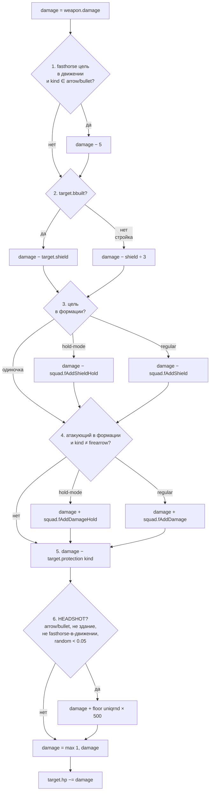

## Содержание

**Базовые понятия**
- [Типы оружия](#типы-оружия-gc_obj_weapon_kind_)
- [uniqrnd — индивидуальное случайное число юнита](#uniqrnd--индивидуальное-случайное-число-юнита)

**Формула урона и модификаторы**
- [Формула урона (полная)](#формула-урона)
- [Свойства формулы](#свойства-формулы)
- [Хедшот — критический удар](#хедшот--критический-удар)
- [Формационные бонусы (LINE/SQUARE/KARE)](#формационные-бонусы)
- [Офицер и бонусы строя](#офицер-и-бонусы-строя)
- [Высокая позиция (high ground)](#высокая-позиция-high-ground)
- [AoE damage cap](#aoe-damage-cap--как-кучкование-защищает)
- [Shield /3 при недостроенном здании](#shield-3-при-недостроенном-здании)
- [Рассеяние выстрелов](#рассеяние--почему-выстрелы-промахиваются)

**Поведение стрелков**
- [Видимость и обзор (vision, FOW)](#видимость-и-обзор-vision-fow)
- [Standground / bartprepare — режимы атаки](#standground--bartprepare--режимы-атаки)
- [RunAway — автоматический отход стрелков](#runaway--автоматический-отход-стрелков)
- [Штраф к дальности при движении (standtime)](#штраф-к-дальности-при-движении)
- [Бонус к дальности в покое (addradius)](#бонус-к-дальности-в-покое)
- [Переключение оружия по дистанции](#переключение-оружия-по-дистанции)

**Специальные взаимодействия**
- [Дружественный огонь](#дружественный-огонь)
- [Захват зданий и юнитов](#захват-зданий-и-юнитов)
- [Лечение священниками](#лечение-священниками)
- [Реакция ИИ — отряд переходит в атаку от одного удара](#реакция-ии--отряд-переходит-в-атаку-от-одного-удара)
- [Score и финальный счёт](#score-и-финальный-счёт)
- [Конец партии: победа и поражение](#конец-партии-победа-и-поражение)
- [ИИ-оппонент: difficulty, build order, агрессия](#ии-оппонент-difficulty-build-order-агрессия)
- [Подтверждённые упрощения боевой формулы](#подтверждённые-упрощения-боевой-формулы)

**Сводные таблицы**
- [Скорости юнитов](#скорости-юнитов)
- [Офицеры и формации](#офицеры-и-формации)
- [Матрица контр-эффективности (приближённый TTK)](#матрица-контр-эффективности-приближённый-ttk)
- [Перекрёстная таблица: апгрейды × характеристики](#перекрёстная-таблица-апгрейды--характеристики)
- [Стоимость одного выстрела](#стоимость-одного-выстрела)

## Типы оружия (gc_obj_weapon_kind_*)

| Kind | Описание | Носители |
|---|---|---|
| `pike` | Длинное копьё/пика | Pikemen, Pikeman18 |
| `sword` | Меч/сабля | Light infantry, swordsmen, кавалерия в ближнем бою |
| `bullet` | Пуля огнестрела | Musketeer, Strelet, Janissary, Dragoon, etc. |
| `arrow` | Стрела/болт | Archer (`SHOTLU` ammo) |
| `cannonball` | Пушечное ядро | Cannon, Tower, Frigate (single shot) |
| `cannister` | Картечь | Cannon close-range, multi-cannon |

## uniqrnd — индивидуальное случайное число юнита

При спавне каждый юнит получает `uniqrnd ∈ [0..1]` [^1]. Это **зафиксированное** число, остаётся неизменным до смерти. Используется в **4 механиках одновременно**:

| # | Где применяется | Эффект |
|---:|---|---|
| 1 | Бонус хедшота | `+floor(uniqrnd × 500)` дополнительного урона при крите |
| 2 | Эффективная max range | `radiusmax -= uniqrnd × 3` тайла. Каждый стрелок стреляет чуть на разную дистанцию (асинхронные залпы) |
| 3 | Search timing | `nextSearch = now + uniqrnd × 0.15 + 0.3` сек. Юниты не сканируют синхронно |
| 4 | Multiplayer sync seed | `SetRandomKey(floor(uniqrnd × MaxInt))` для синхронизации |

Эффекты — это **компромисс**, встроенный в каждого юнита: высокий uniqrnd → большие криты, но меньшая дальность. Низкий → дальше стреляет, но слабее криты.

В C3 разработчики **специально расширили base range на +100 px** для лучников — компенсировать uniqrnd usage #2 [^2].

## Формула урона

Источник: `_misc_DoDamage` [^3]. Шесть последовательных шагов:



В виде псевдокода:

```
damage = weapon.damage
# 1. Anti-headshot для мобильной кавалерии
if target.usage == fasthorse AND target.is_moving AND kind in {arrow, bullet}:
    damage -= 5
# 2. Shield (одно из главных свойств танков)
damage -= target.shield if target.bbuilt else target.shield // 3
# 3. Squad shield (защита от формации цели)
damage -= squad.fAddShieldHold if hold else squad.fAddShield   # если в формации
# 4. Squad damage (бонус от формации атакующего)
damage += squad.fAddDamageHold if hold else squad.fAddDamage   # если kind != firearrow
# 5. Protection
damage -= target.protection[weapon.kind]
# 6. Headshot
if kind in {arrow, bullet} AND NOT target.bbuilding AND NOT (fasthorse_on_move) AND random < 0.05:
    damage += floor(attacker.uniqrnd * 500)
damage = max(1, damage)
target.hp -= damage
```

### Свойства формулы

- `protection` и `shield` уменьшают урон **аддитивно** (не процентно).
- **Минимум 1 хп** урона: даже если `protection > damage + bonuses`, пройдёт 1 hp.
- Shield применяется ВСЕГДА (включая поверх protection). Танки с shield эффективнее тяжёлой защиты.
- При постройке здания shield делится на 3 (см. [Shield /3 при недостроенном здании](#shield-3-при-недостроенном-здании)).
- `firearrow` (зажигательная стрела лучников) НЕ получает отрядный бонус к урону.

### Хедшот — критический удар

**5% шанс на каждый выстрел** добавить `floor(uniqrnd × 500)` урона. Где `uniqrnd` — фиксированное случайное число юнита-стрелка [0..1].

**Ключевые свойства:**

- Работает только для **arrow** и **bullet** оружия.
- НЕ работает по **зданиям**.
- НЕ работает по **light cavalry на ходу** (`usage=fasthorse + state=walk`) — у них наоборот -5 dmg штраф.
- `uniqrnd` **зафиксирован при спавне** юнита-стрелка → у каждого индивидуального мушкетера свой урон от хедшота. В отряде из 36 мушкетеров будут «снайперы» (uniqrnd≈0.9 → +450 урона) и «мазилы» (uniqrnd≈0.05 → +25 урона).
- Среднее ожидаемое: `0.05 × 250 = 12.5` дополнительного урона на выстрел (выровненный по случайным uniqrnd ~0.5).

**Пример:** мушкетер стреляет в Reiter (282 hp). Обычный урон — 6 hp. На случайном выстреле (5%) случается хедшот, и тот же мушкетер (uniqrnd≈0.252) наносит `6 + floor(0.252 × 500) = 6 + 126 = 132 hp`. Reiter падает с 282 → 150 hp.

**Почему это важно для стратегии:**

- Стрелковые отряды против Heavy Cavalry/Light Infantry статистически окупаются сильно лучше чем формула урона показывает.
- Light Cavalry **в движении** иммунна к хедшоту → основной counter к стрелковому отряду.
- C1 имел 4% шанс мгновенного убийства (комментарий в коде); в C3 механика была ребалансирована в текущий вариант. Комментарий упоминает 2%, но в реальном коде осталось `<0.05` = **5%**.

## Формационные бонусы

Источник: файл `formations.cfg` [^4].

Юниты в строю получают **+урон / +shield** к каждому выстрелу/попаданию. В **hold-mode** (приказ «Стоять») бонусы значительно больше:

| Формация | размер | regular dmg/shield | **hold-mode dmg/shield** |
|---|---:|---:|---:|
| LINE / SQUARE / KARE | 15-196 | +2 / +2 | **+7 / +7** |
| LINE / SQUARE / KARE | **400** | **+3 / +3** | **+7 / +7** |
| Cavalry (PRUS, SHER, TRI) | любой | +1 / +1 | +1 / +1 |

**Ключевое:** мушкетер с base damage 6 → **в формации LINE в hold-mode наносит 13 урона** за выстрел (6 + 7 hold). И принимает -7 от каждого входящего попадания (поверх защиты).

**Что это значит для боя:**
- Стрелковые отряды **в hold-mode на формации** = **+117% к урону** (с 6 до 13).
- Без формации (рассыпная) — никаких бонусов.
- Кавалерийские формации (треугольник, клин) дают только +1/+1 — формация для них слабый множитель.
- **firearrow** (зажигательная стрела) НЕ получает отрядный бонус к урону.

## Офицер и бонусы строя

Бонусы строя (`fAddDamage`, `fAddShield`, `fAddDamageHold`, `fAddShieldHold`) — поля объекта `TSquad`. Единственная точка их записи в скриптах — `_player_SetSquadFormation` [^5].

Формула урона на каждом ударе берёт значения из того же `TSquad`:

- щит цели — `pSquad2.fAddShield(Hold)` [^6];
- бонус атакующего — `pSquad.fAddDamage(Hold)` [^7].

Обе ветки заходят только при `pSquad <> nil`. Пока объект `TSquad` существует и поля установлены, бонус применяется к каждому выстрелу и к каждому входящему попаданию.

### Когда `TSquad` создаётся

`_player_CreateSquad` собирает строй только если `_unit_IsOfficer(officerHnd) = True` [^8]. Точка входа в сборку — `_unit_MakeSquadList` [^9]: функция принимает `officerHnd`, ищет вокруг него барабанщика и подходящих рядовых, затем `_player_SetSquadFormation` ставит юнитов в сетку и записывает `fAddDamage / fAddShield` из `gFormation[formInd]`. Поэтому новые `TSquad` с записанными бонусами появляются только под живого офицера.

После сборки `_player_SetSquadFormation` сажает офицера и барабанщика в клетки `maskOfficers`; рядовых — в клетки `mask` [^10]. Если в момент перерасстановки сетки офицера в `TSquad` уже нет, его клетка остаётся `0`, но поля `fAddDamage / fAddShield` записаны раньше и от состава сетки не зависят.

### Когда `TSquad` удаляется

В каждом тике `Progress` для каждого живого игрока вызывается `CheckSquadsDisband` [^11].

- `gc_player_SquadDismissPercent = 0.25` [^12].
- `_squad_GetBaseUnitCount(pSquad)` равен `TSquad.GetCount` − 1 (если `Get(0)` — офицер) − 1 (если есть барабанщик) [^13]. В порог идут только рядовые.

Когда условие срабатывает, `_misc_DisbandSquad` [^14] → `gPlayer[plInd].DisbandSquad(sqInd)` [^15] удаляет `TSquad` из `gPlayer[plInd].squads`. После этого ветка `if (pSquad2 <> nil)` в формуле урона пропускается, и для оставшихся юнитов бонус не применяется.

Соответственно, бонусы строя пропадают не от смерти конкретного юнита, а от перехода `TSquad` в распущенное состояние, и пороговое условие — на численности рядовых.

### Hold-mode

Множитель Hold (для LINE / SQUARE / KARE: `+7 dmg / +7 shield` на размерах 15-196 и `+3/+3 → +7/+7` на 400) активен, пока `TSquad.fHoldMode = True`. Машина состояний [^16]:

- `fHoldMode := True` — когда `fStandGround = True`, `fHoldMode = False`, `fAgressive = False`, `fMoveCount = 0`, и `fHoldModeProgress` (накапливается со скоростью `deltatime / gc_squad_holdmode_time` за тик) дошёл до 1.0.
- `fHoldMode := False` — когда отряд получает приказ движения [^17].

Параметры: `gc_squad_holdmode_time = 150 × 8 × gc_frames_to_time = 37.5` g-сек простоя в Stand Ground [^18]; `gc_frames_to_time = 0.03125`.

### Сводка по `fAddDamage / fAddShield`

| Событие | Поля `fAddDamage / fAddShield` |
|---|---|
| Сборка строя через офицера | записаны значения из `gFormation[formInd]` |
| Офицер убит, рядовых ≥ 25% от `fBaseCount` | значения сохраняются, бонус применяется |
| Барабанщик убит, рядовых ≥ 25% от `fBaseCount` | значения сохраняются, бонус применяется |
| Рядовых < 25% от `fBaseCount` | `_misc_DisbandSquad` удаляет `TSquad`, бонус для выживших не находится |
| Приказ движения | `fHoldMode := False`, формула берёт `fAddDamage / fAddShield` (не Hold-варианты) |
| Stand Ground, простой 37.5 g-сек | `fHoldMode := True`, формула берёт `fAddDamageHold / fAddShieldHold` |

## Высокая позиция (high ground)

Если стрелковый юнит стоит на возвышенности (Y > 0), его **search distance** увеличивается [^19]:

```
searchdist += goHeight × 2  (только для ranged юнитов: minsearchdist > melee_radius)
```
- `goHeight` — Y-координата юнита в тайлах (высота над уровнем 0).
- Бонус **только к радиусу обнаружения** (видят дальше / открывают огонь раньше).
- Сам выстрел (`radiusmax`) технически тот же, но если враг ещё не в радиусе атаки, юнит начинает движение и выстрелит как только цель войдёт в radius. На практике **мушкетеры с холма стреляют по атакующим раньше** = больше выстрелов до ближнего боя.
- Не работает на юнитов ближнего боя (pikemen в ближнем бою остаются в нём).
- Холмы создаются параметром `relief` при генерации карты (Highlands map даёт максимум гор).

## AoE damage cap — как кучкование защищает

Взрывы (cannon, mortar, gun, grenade) попадают по всем юнитам в радиусе `r`, **но только первые N получают урон** [^20]:

```
count = floor(1 + (r / 0.35)²)
```
| Оружие | radius | максимум юнитов под взрыв |
|---|---:|---:|
| Cannon (ядро) | ~1 t | **9** |
| Mortar (бомба) | ~2 t | **33** |
| Grenade (граната) | ~0.5 t | **3** |
| Howitzer | ~1 t | **9** |

**Стратегический вывод:** **плотная толпа защищена** — 50 юнитов в одной точке теряют максимум 9 от ядра, остальные нетронуты. Растянутая линия страдает гораздо больше.

Огненные стрелы (`barrow`) работают по другой ветке условия — `(listcount > 300) or (dist < r)` [^21]. Если в собранном по площади списке **больше 300** юнитов — попадание идёт по всему списку без проверки дистанции (то есть фактический радиус «расширяется» до радиуса сборки списка). Если **300 или меньше** — нужен `dist < r`, то есть только юниты строго внутри радиуса попадания. Капа `count` в этой ветке не применяется.

## Shield /3 при недостроенном здании

При расчёте урона: если здание **ещё строится** (`bbuilt=False`), его shield делится на 3 [^22]:

```
if (target.bbuilt):  damage -= shield        # достроено: полный shield
else:                 damage -= shield // 3   # стройка: 1/3 shield
```
**Стратегический смысл:** **сноси здания пока они строятся**. Например, башня на стройке имеет shield ~33 (вместо 100), и каждый удар по ней проходит почти полностью. Контр-стройка (атака на возводимое здание противника) гораздо эффективнее чем атака готового.

Касается ТОЛЬКО зданий — юниты не имеют состояния «строится».

## Рассеяние — почему выстрелы промахиваются

При каждом выстреле снаряд **рассеивается** относительно цели [^23]:

```
maxdisp = dist × disp × 0.0267   # в тайлах
shot_x = target_x + (1 - random*2) × maxdisp
shot_z = target_z + (1 - random*2) × maxdisp
```
Где `dist` — дистанция до цели (тайлы), `disp` — `weapon.dispertion` (тайлы, после `_misc_PixelsToTiles`). **Чем дальше — тем больше рассеяние** (линейно).

**Базовые значения dispertion:**
| Оружие | dispertion (px / tiles) | На 15 t отклонение |
|---|---:|---:|
| Strelet (SHOTMUSKET, base) | 200 / 3.75 | **±1.50 t** |
| Archer (STRELA) | 175 / 3.28 | ±1.31 t |
| Archer (OSTRELA fire) | 200 / 3.75 | ±1.50 t |
| Musketeer base | 250 / 4.69 | ±1.88 t |
| Cannon (PPOINTT) | ~250 / 4.69 | ±1.88 t |
| Tower (PPOINTTTOW) | ~100 / 1.88 | ±0.75 t |
| Yacht/galley (PPOINTTKOR) | 25 / 0.47 | ±0.19 t |

**Шанс попасть в юнит размером 1×1 t** на дистанции d:

- Если 2×maxdisp ≤ 1 → ~100% попадание
- Если 2×maxdisp > 1 → шанс ≈ 1 / (2×maxdisp) попасть точно в нужный квадрат

Пример: мушкетёр (`disp = 3.75`) на 15 t → `maxdisp = 1.50`, окно ±1.50 = 3.00 → шанс попасть в цель размером 1 × 1 t ≈ 1/3 = **~33%** одним выстрелом. Это значит, что **TTK в матрице контр-эффективности занижен в 3 раза для дальних пуль и стрел**.

**Апгрейды dispertion** — только для **артиллерии**:
- `aca.20` (Research new sighting devices for artillery): **-35% dispersion**
- `aca.27` (Develop mathematics): **-35% dispersion** (накапливается с aca.20)
- Внимание: для **мушкетеров и лучников** прямого dispersion-апгрейда нет.

## Видимость и обзор (vision, FOW)

Источники: `_unit_GetVision` [^24], `SetFOWDovFunc` [^25].

В Cossacks 3 у каждого юнита есть **два разных** радиуса «осведомлённости», и их легко спутать:

| Радиус | Что это | Где хранится | В чём измеряется |
|---|---|---|---|
| **vision** | Радиус снятия тумана войны (FOW). Сколько тайлов открыто владельцу юнита. | `objprop.vision` (целое 0..8) | Тайлы по формуле `floor(20 + 4 × vision)` |
| **searchradius** | Радиус обнаружения цели для авто-атаки (используется в `bartprepare`, `_unit_SearchTarget`). Юнит **не атакует** врага вне этого круга, даже если видит его. | `weapon.radiusmax` | Пиксели (`gc_pixels_to_tile = 53.333`) |

**Vision всегда больше searchradius** — юнит замечает врага раньше, чем способен взять его как цель.

### Формула vision

```
real_vision_radius_tiles = 20 + 4 × vision
```

| `vision` | tiles | Типичный носитель |
|---:|---:|---|
| 0 | 20 | Default (минимум) — пустая башня, шахта |
| 1 | 24 | Большинство пехоты, артиллерия, городская башня без апгрейдов |
| 2 | 28 | Лёгкая пехота, мушкетеры, средняя кавалерия |
| 3 | 32 | Драгуны, башня после апгрейда, паром |
| 4 | 36 | `pearus`, `peaukr`, разведывательная кавалерия |
| 5 | 40 | `hussarpru`, `dragoon18pie` |
| 7 | **48** | `hetman` (Гетьман — лучший обзор у тяжёлой кавалерии) |
| 8 | **52** | `drummer` / `bagpiper` / корабли (Линейный корабль / Фрегат) |

### Лучшие разведчики

- **Барабанщик / Волынщик** — `vision=8` (52 t), `searchradius=0` (не атакует). Чистый разведчик, бесплатный (выходит из казармы как сопровождение). Ходит за армией.
- **Линейный корабль / Фрегат** — `vision=8` для морского патрулирования. Видит дальше, чем стреляет (дальность ядра около 31-37 t).
- **Гетьман** (Украина) — `vision=7` (48 t), уникален для своей нации. Лучший наземный разведчик.

### Стратегические следствия

- Одного `vision`-круга стрелка в standground для разведки недостаточно — впереди нужен юнит с большим обзором (барабанщик, гусар).
- **Vision не прокачивается** — апгрейдов вида `+vision` или `visionperc` в академии/кузнице нет. Единственный способ улучшить обзор — поставить более «зоркий» юнит.
- Башня даёт `vision=1` (24 t), что меньше обзора кавалерии. Башня хороша как стационарный пост, но плохо как разведка.
- **Мортира / Супермортира** имеют `vision=1` и `searchradius=0` — для самозащиты они слепы, без сопровождения цели не обнаруживают.

Полная таблица per-unit — в [`reports/combat/vision_radii.md`](../reports/combat/vision_radii.md).

## Standground / bartprepare — режимы атаки

**Ключевой механизм:** дальность авто-обнаружения врага (`maxsearchdist`) **радикально различается** в режимах standground и обычном [^26]:

```
if (bstandground AND order != move):
    maxsearchdist := MIN(searchradius, GetMaxAttackRadius)   # полная дальность оружия
else:
    maxsearchdist := minsearchdist + 0.375                    # почти melee (!)
```
**Что это значит на практике:**

- **Без standground** мушкетер (radiusmax≈9 t) обнаруживает врага только когда тот входит в **0.375 t от minsearchdist** — то есть подходит вплотную. Получается **1-2 выстрела** и сразу ближний бой. Это объясняет почему стрелковые юниты «стоят и не стреляют» по дальним целям.
- **С standground** обнаружение работает на полную `searchradius` (1500-2400 px ≈ 28-45 t). Мушкетер стреляет по любому врагу в радиусе обзора — успевает 5-10 выстрелов до ближнего боя.
- **Standground также отключает RunAway** (см. ниже): юнит держит позицию, не пытается отступать.
- **Приказ движения стирает standground**: если юниту приказали идти куда-то, он не стреляет даже если bstandground=True (см. условие `order != move`).

`bartprepare` (artillery preparation) — флаг для **артиллерии, башен и портов** [^27]. Установлен на `cannon`, `howitzer`, `framegun`, `multicannon`, `tow` (towers), `port` (shipyards). При получении `attackpoint`-приказа (по площади) такие юниты:

- Принудительно выключают `bstandground` → переходят в обычный режим обнаружения
- Принудительно включают `bsearchenemy` → активно сканируют цели вокруг точки
- Получают приказ `attackpoint(trgx, trgz)` с задержкой подготовки (`attackdelay/attackmaxdelay`)

**Стратегические выводы:**

- **Всегда ставь стрелков в standground** при обороне или подготовленной засаде. Без него мушкетеры сделают 1-2 выстрела вместо 5-10.
- **При продвижении** (`bstandground=False`) стрелки отходят (RunAway) — это иногда плюс (не дают подойти), иногда минус (тормозят свой же штурм).
- **Артиллерию лучше отдавать командой attackpoint** (Ctrl+ЛКМ) — `bartprepare` правильно настраивает режимы. Если просто переместить пушку и ждать — она в режиме движения НЕ откроет огонь.

## RunAway — автоматический отход стрелков

Если у стрелкового юнита (`minsearchdist > 0`, т.е. min range > 0) враг входит в **мёртвую зону** (между 0 и `minsearchdist`), юнит автоматически отступает [^28]:

```
if (cell_search_found_no_target AND враг_в_minsearchdist):
    if (NOT bstandground)
       AND (standtime=0 OR standtime > gc_unit_runawaydelay (1.3 sec)
            OR (player_is_human AND difficulty <= normal)):
        DoRunAway(toward_safe_direction, distance=gc_unit_runawaydist (3.5 t))
```
**Условия отступления (все должны выполниться):**

- Юнит **не в standground**.
- Юнит либо только что подошёл (`standtime=0`), либо стоит уже >1.3 сек, либо игрок-человек на easy/normal сложности (поблажка для новичков).
- Враг — в `minsearchdist` зоне.

**Эффект:** стрелок отступает на 3.5 тайла от врага, пытаясь восстановить дистанцию для выстрела. Это создаёт классический **паттерн отхода** мушкетеров: подошёл → стрельнул → отступил → стрельнул.

**Кому достаётся какой гейт:**

- В `standground` (явный приказ держать позицию) — RunAway не срабатывает ни для кого.
- Игрок-человек на easy/normal — третья ветка (`(not bai) AND (difficulty <= normal)`) включена, гейт `standtime` не проверяется. Юнит отступает каждый тик, пока враг в `minsearchdist`.
- Игрок-человек на hard и выше — третья ветка отключена, остаются только `standtime=0` и `standtime > 1.3`. Юнит отступает либо в момент захода в зону, либо после ≥1.3 сек подготовки; в промежутке (0 < standtime < 1.3) — не отступает, успевает выстрелить.
- ИИ на любой сложности — `(not bai)` равно False, третья ветка тоже отключена. Поведение ИИ одинаковое на easy/normal/hard/very hard и совпадает с человеком на hard+.

**Стратегические выводы:**

- Для отступательной тактики (отход с обстрелом) — **сними standground** и работай по уязвимой кавалерии/пехоте.
- Для удержания позиции (например, на холме) — **standground обязателен**, иначе при сближении врага на дистанцию ближнего боя стрелки разбегутся.
- Лёгкая кавалерия может **догнать отходящих мушкетеров** (fasthorse=96 против default=32 → ~3× быстрее).

## Штраф к дальности при движении

Юнит, который только что двигался (`standtime < 0.25 sec`), теряет в дальности [^29]:

```
if (standtime < 0.25) AND (weapon.kind != cannister):
    if (NOT bArtillery):
        radiusmax -= 3 × uniqrnd          # пехота: до -3 тайла
    else:
        radiusmax -= 3 × uniqrnd × 0.5    # артиллерия: до -1.5 тайла
```
Константа `gc_obj_maxattackradiusdisp = 3` [^30]. **uniqrnd** — индивидуальный коэффициент юнита (см. секцию [uniqrnd](#uniqrnd--индивидуальное-случайное-число-юнита)) ∈ [0..1]. Так что у разных стрелков в отряде штраф разный: «снайперы» (низкий uniqrnd) теряют меньше, «мазилы» (высокий uniqrnd) — почти весь штраф.

**Стратегические выводы:**

- **Стрелок в движении не выстрелит на полную дальность** — нужно ~0.25 сек постоять. Это объясняет почему мушкетеры «промахиваются» по дальним целям при подходе.
- **Картечь не штрафуется** — пушка может бить картечью даже на ходу (но в реальности пушка `bartillery` всё равно `bstandground=True` по умолчанию).
- **Артиллерия штрафуется в 2 раза меньше** — мортира/пушка после короткого movement готова стрелять почти на полную дальность.
- В сочетании с RunAway создаёт **отход — пауза — выстрел**: мушкетер отбежал на 3.5 t, ждёт 0.25 сек чтобы вернуть полную дальность, стреляет, и снова отходит.

## Бонус к дальности в покое

Если юнит в состоянии **idle** (флаг `gc_statetag_move_idle`), он получает бонус к дальности [^31]:

```
rbonus += weapon[i].addradius   # обычно _misc_PixelsToTiles(32) = ~0.6 тайла
```
**Кому даётся:** мушкетерам, лучникам, пушкам — у всех `addradius = 32 px = 0.6 t`. Для слабых стен (`gc_obj_usage_weakwall`) — дополнительно **+0.36 тайла** rbonus.

**Эффект:** стационарная защита (например, гарнизон на холме в standground) стреляет на **~0.6 t дальше** чем тот же отряд в движении. Мелочь, но в сочетании с high-ground (см. выше) и устранением movement penalty получается заметный буст эффективной дальности обороны.

## Переключение оружия по дистанции

Многие юниты имеют **несколько слотов оружия** (`weapon[0]`, `weapon[1]`, ...). Игра автоматически выбирает нужный слот по дистанции до цели — каждое оружие имеет `radiusmin..radiusmax` [^32]. Если враг вошёл в близкий диапазон — выбирается оружие с маленьким `radiusmin`, иначе — дальнее.

Дополнительно учитывается `attmask`: если у цели `mmask` совпадает с `weapon[i].attmask` (материал брони), это оружие приоритетнее. Поэтому fire arrows выбираются для построек (их attmask содержит `gc_obj_material_building`).

**Пары multi-weapon юнитов:**

**1. Cannon (пушка) — ядро против картечи:**

| Слот | Тип | dmg | Pause | Range (px) | Когда стреляет |
|---|---|---:|---:|---|---|
| `weapon[0]` PPOINTT | cannonball (ядро) | 1800 | 350 | **550-2160** | дистанция ≥ 550 px (~10.3 t) |
| `weapon[1]` PSMPOINTTPUS | cannister (картечь) | AoE по `gWeapons[]` | 350 | **0-450** | враг ближе 450 px (~8.4 t) |

**Это значит:** если пехота подошла на ~8 тайлов к пушке — она автоматически переходит в картечный режим. **Картечь — массовый урон по толпе** (AoE). Поэтому гасить пушку «навалом пехоты» = получить картечь в упор. **Атаковать пушку нужно растянутой линией** (не больше 9 в радиусе AoE — см. AoE damage cap).

**2. Musketeer 18c — пуля против штыка (bayonet):**

| Слот | Тип | dmg | Pause | Range (px) | Когда стреляет |
|---|---|---:|---:|---|---|
| `weapon[0]` (bayonet) | pike | 5-10 (по нации) | **0** (мгновенно) | **35-65** (~0.66-1.22 t) | в упор |
| `weapon[1]` SHOTMUSKET | bullet | 16-29 (по нации) | 140-190 | **400-900** (~7.5-16.9 t) | дальше 7.5 t |

**Стратегический смысл:** мушкетер после выстрела не беспомощен в ближнем бою — у него **штык** с pause=0 (бьёт каждый цикл анимации). Атаковать перезаряжающихся мушкетеров кавалерией = получить штыковой бой. Прусские мушкетеры (dmg штыка 10) сильнее в ближнем бою чем баварские (5).

**Прокачки штыка** идут отдельно от прокачек пули — `bla.musketeer18.1.X` качает урон bullet, штык остаётся базовый.

**3. Archer — обычная стрела против огненной (`firearrow`):**

| Слот | Тип | dmg | Pause | Range (px) | Dispertion | Особенности |
|---|---|---:|---:|---|---:|---|
| `weapon[0]` STRELA | arrow | 15 | 75 | 400-800 | 175 px | основная стрельба |
| `weapon[1]` OSTRELA | firearrow | **150** | 125 | 400-600 | 200 px | attmask = building+wood+woodwall |

**Огненные стрелы — оружие лучников против построек.** Урон 150 (×10 от обычной), но: ниже скорострельность (-40%), хуже точность (+14% дисп.), не получают **отрядный бонус к урону** (см. секцию Хедшот/Формула урона). Игра автоматически переключает лучника на OSTRELA когда цель — здание/wood/палисад. **Лучники — лучший анти-билдинг стрелковый юнит** (если успевают подойти).

**4. Другие multi-weapon юниты** (поищи `weapon[1]` в их sid):

- **Янычар (jannisary)** — пуля + сабля ближнего боя.
- **Стрелец** — пищаль + бердыш ближнего боя.
- **Егерь / драгун** — пуля + сабля.
- **Конные стрелки** (drabant, конный стрелец) — пуля + сабля верхом.

Во всех случаях работа одинакова: близко — оружие ближнего боя, далеко — стрелковое. **Разница перезарядок:** например мушкетер перезаряжается 150 кадров пулю и 0 штык — значит **сразу после выстрела** может ткнуть штыком если враг близко (а потом перезарядка пули продолжится в фоне).

## Дружественный огонь

**Дружественный огонь ВКЛЮЧЁН для большинства снарядов.** В функции `_misc_DoDamage` **нет проверки на сторону/владельца** — урон применяется к любому объекту, попавшему под траекторию [^33].

**Что попадает по своим:**

- Стрелы лучников (`STRELA`, `OSTRELA` fire arrows)
- Пули мушкетов (`SHOTMUSKET`)
- Гранаты (`NUCLGRE`)
- Артиллерия (`PSMPOINTTPUS`, `DIMMORT1`, `DIMMORT2NEW`, `PSMPOINTT`, `DIMMORT2KOR`)
- AoE взрывы (картечь, ядра, бомбы) — поражают **всё в радиусе**, включая своих (`_misc_DoRoundDamage` без фильтра по стороне).

**Что НЕ ранит союзников:**

- **Корабли** — есть отдельная защита `// prevent ships from friendly fire` [^34]. Торговцы и боевые корабли одного игрока не топят друг друга.
- Башни и пушки с `bcheckfriendonline=True` (по умолчанию ON) — **не выстрелят, если на линии огня стоит дружественное здание** (см. `_misc_IsBuildingInRay` [^35]). Но это про блокировку выстрела, а не про урон при пролёте.

**Список оружия с явно ОТКЛЮЧЁННОЙ проверкой `bcheckfriendonline`** (стреляют сквозь свои здания, не блокируются):

`STRELA`, `OSTRELA`, `SHOTMUSKET`, `SHOTBLOCKHOUSE`, `NUCLGRE`, `PSMPOINTTPUS`, `DIMMORT1`, `DIMMORT2NEW`, `PSMPOINTT`, `DIMMORT2KOR` — то есть **все стрелы, мушкетные пули и почти вся артиллерия**.

**Стратегические выводы:**

- **Не ставь свою пехоту на линию огня артиллерии** — ядро/бомба прошьёт строй и взорвётся среди своих.
- **Лучники и мушкетеры стреляют сквозь свои ряды** — стой во второй линии без проблем, но **бомба в массу твоих юнитов = твои потери**.
- **Башни без прямой линии огня** через здания не выстрелят (если их weapon `bcheckfriendonline=True`), но снаряд при выстреле уже не различает свой/чужой.

## Захват зданий и юнитов

Полный псевдокод и список всех `bcapture/bcancapture/bprotector` флагов — в [`recon/world/capture_mechanics.md`](../recon/world/capture_mechanics.md). Здесь — суть.

Источник: `_misc_CheckCapture` [^36].

### Геометрический триггер, а не «5% шанс»

Захват — не случайная попытка во время атаки. Каждые **1.9 g-сек** (для зданий и крестьян) или **0.5 g-сек** (для артиллерии) каждый объект-кандидат на захват проверяет своё окружение:

```
1. Найти любого вражеского юнита с bcancapture=True в евкл. радиусе captureradius (4.013 t)
   от центра объекта. Нашли — bcapture := True.
2. Проверить защитников: любой свой не-bcapture юнит в радиусе protectionradius (≈8 t)
   отменяет захват. Достаточно одного.
3. Если bcapture остался True → _misc_ChangePlayer (мгновенно, со всем гарнизоном внутри).
```

**Время до захвата = 0** (срабатывает в тот же тик). То, что игрок воспринимает как «время на захват», — это пауза между тиками проверки, до 1.9 сек.

### Кого можно захватить (`bcapture=True`)

**Юниты:**

- **Все крестьяне** всех 8 sid'ов (`peaaus`/`peatur`/`pearus`/`peapol`/`peaspa`/`peaeng`/`peaukr`/`peasco`) — `bcapture=True` [^37]. _Раньше в этом справочнике говорилось, что украинский и шотландский Крестьянин не захватываются — это **ошибка**, флаг у них тоже True._
- **Артиллерия** — `cannon`, `howitzer`, `mortar`, `multicannon`, `framegun`. Проверяется в **4× чаще** (0.5 g-сек), поэтому теряется почти мгновенно при подходе кавалерии.

**Здания (захватываются — меняют владельца):** Городской центр, Казарма (17/18 в.), Кузница, Склад, Мельница, Шахты (золото/железо/уголь).

**Здания (захватываются — разрушаются `bDie:=True`):** Стены и Каменные ворота (захват их просто ломает), а также любые здания на стадии постройки, независимо от типа.

### Кого захватить **нельзя** (`bcapture=False`)

| Тип | Что произойдёт при попытке |
|---|---|
| **Башни** (`tow`) после постройки | На захват вообще не проверяются. Только снос. |
| **Стены / Каменные ворота** | Захват = `bDie:=True` (объект просто умирает). |
| Академия, Конюшня, Дипломатический центр, Порт | Только снос. |
| Пехота, кавалерия, корабли | Только убийство. |

Внимание: **недостроенное здание** проверяется на захват **всегда**, даже Башня. Если враг подойдёт к стройке, здание сменит хозяина. Как только постройка завершена — `bcapture=False` отключает проверку.

### Кто может захватывать (`bcancapture=True`)

`bcancapture := (not bcapture) and (usage <> peasant)` — то есть любой юнит, не являющийся крестьянином и сам не захватываемый. Вся пехота и кавалерия (кроме крестьян) — да; артиллерия — нет (она сама `bcapture=True`). Капелланы, барабанщики, офицеры — да (у них `bcapture=False` и usage не peasant).

### Радиусы (точные значения)

| Радиус | px | tiles | Метрика | Что значит |
|---|---:|---:|---|---|
| `captureradius` | 214 | **4.013** | Euclidean²(центр-к-центру) | внутри — захватчик может схватить объект |
| `captureblockshotradius` | 160 | 3.0 | Euclidean² | внутри — жертва не может стрелять (≈3.125 g-сек) |
| `protectionradius` | 426 | ≈7.99 | Euclidean² | один свой не-bcapture здесь — захват отменяется |

Footprint здания **не учитывается** — берётся одна `(x, y)`-точка-якорь объекта. Поэтому крупные здания (Городской центр ≈ 5×4) на практике защищены своими размерами: захватчик должен дойти до **центра**, а не до стенки.

### Настройки карты (`gMap.settings.additional.capture`)

| Режим | Поведение |
|---|---|
| `capture_default = 0` | Захват разрешён всем |
| `capture_nopeasants = 1` | **По умолчанию в DM и Historical Battle.** Крестьян захватить нельзя. |
| `capture_nocenterspeasants = 2` | Нельзя захватить ни крестьян, ни Городской центр |
| `capture_onlyartillery = 3` | Захвату поддаётся только артиллерия |

То есть в стандартном Deathmatch крестьяне **не захватываются** (только убиваются). Захват крестьянина возможен лишь в скирмише при ручной настройке `capture_default`. Все опции лобби (`peacetime`, `marketdip`, `century18` и др.) — таблицы в [`docs/reports/map/lobby_settings.md`](../reports/map/lobby_settings.md), поведение движка — в [`docs/recon/world/game_settings.md`](../recon/world/game_settings.md).

### ИИ-захватчик: 75% шанс снести вместо захвата

Если захватчик — ИИ, он с шансом **75%** выставляет зданию `bDie:=True` вместо смены владельца. Это и объясняет, почему ИИ часто «таранит» базу, а не забирает сооружения себе. У захваченной ИИ артиллерии тоже есть шанс самоуничтожения, зависящий от типа: Мортира 86%, Пушка 61%, Супермортира 41% (формулы — в recon).

### Конверсии нет

Капеллан в Cossacks 3 — только лекарь через «отрицательный урон». Никакой конверсии в духе AoE2 в скриптах нет. См. recon §7.

### Стратегические выводы

- **Защищай артиллерию пехотой** — без защитника в 8-тайловом радиусе любой рейд кавалерии отнимет Пушку за 0.5 g-сек.
- **Башни не захватываются** — снести их можно только осадой. Но недостроенная Башня — лёгкая добыча.
- **Стены — расходник.** Захват стены означает её смерть. Стена с просевшим до трети HP не активирует protector-логику для соседнего здания.
- **ИИ «таранит» вашу базу** — с 75% вероятностью он разрушает захваченные здания. Не ждите, что компьютер оставит ваш Склад себе.

## Лечение священниками

Священники (`priest`, `pope`, `mullah`, `padre`) лечат союзных юнитов [^38]. Используют псевдо-оружие `gc_obj_weapon_kind_heal`. Формула [^39]:

```
target.hp += weapon.damage      # БЕЗ shield, БЕЗ protection!
target.hp = min(target.hp, target.maxhp)
```
**Heal pause = 0** — лечат каждый цикл анимации (~0.7 сек), пока цель не полное HP.

| Юнит | heal/удар | дальн. (px / tiles) | Где доступен |
|---|---:|---|---|
| Priest | 20 | 0-400 / 7.5 t | большинство европейских наций |
| Pope | 25 | 0-350 / 6.6 t | Папская область / Венеция |
| Mullah | 15 | 0-500 / **9.4 t** | Турция / Алжир (самый дальний heal) |
| Padre | 30 | 0-400 / 7.5 t | Испания / Португалия (самый сильный heal) |

**Стратегические выводы:**

- **Лечение игнорирует броню и щит** — восстанавливает HP на полное значение `weapon.damage` независимо от защиты цели.
- **Несколько священников лечат одну цель параллельно** — рейтер с 282 HP лечится 4 священниками = +80 HP/цикл = ~115 HP/сек. Можно держать тяжёлую кавалерию вечно.
- **Mullah имеет самую большую дальность** (9.4 t) — лечит из второй линии, недосягаем для ближнего боя.
- **Padre самый эффективный** (30/удар) — испанско-португальская армия очень живуча.
- Священники сами **уязвимы** (низкий HP, нет брони) — приоритетная цель для рейдов.

## Реакция ИИ — отряд переходит в атаку от одного удара

Любой не-артиллерийский юнит ИИ, **получивший урон**, переключает свой отряд (`squad`) в `fAgressive=True` и обновляет `fLastBattleTime` [^40].

**Эффект:** один поражающий выстрел/удар по отряду ИИ переводит его в боевой режим. ИИ начинает контратаковать, преследовать, искать врага активно.

**Стратегические выводы:**

- **Поклёвывание ИИ** (один лучник в крестьянина) **активирует реакцию всего отряда ИИ**. Может быть полезно: отвлекаешь лучником, основная сила атакует с другой стороны.
- ИИ на артиллерии (пушки/мортиры) — НЕ переключается (особый случай в коде).
- Если хочешь скрытно собрать ресурсы рядом с ИИ — **не атакуй вообще**, иначе вся армия зашевелится.

## Score и финальный счёт

Полный разбор — в [`recon/systems/victory_conditions.md`](../recon/systems/victory_conditions.md) §5. Источники в коде — `miscext2.script` и `unit.script` [^41].

Каждый объект (`TObjProp.score`) имеет базовое число очков (Крестьянин = 10, Городской центр = 1000 и т.д.). Все события прибавляют или вычитают `target.score × множитель`:

| Событие | Множитель |
|---|---:|
| Произведён свой юнит / построено здание | **+1×** |
| Убит враг | **+2×** |
| Убит вражеский юнит в гарнизоне здания | **+3×** |
| Захвачен чужой объект | **+5×** |
| Свой юнит / здание погибли | **−2×** |
| Погиб юнит-наёмник, ушедший в Rebellion | **−3×** |
| Свой юнит / здание были захвачены врагом | **−5×** |

**Score не уходит в минус** (clamp `≥0`). Снимок счёта пишется каждые 5 g-сек в `gPlayer[i].stat.scores.Add(...)` для итогового графика.

Внимание: **Score не определяет победу.** `_misc_CheckEndGame` смотрит только на «кто остался в живых», а Score нужен для статистики и достижений. Подробнее — в секции ниже.

## Конец партии: победа и поражение

Источники: `_misc_CheckEndGame` [^42] и обработчик поражения в `progress.inc` [^43]. Полная картина — в [`recon/systems/victory_conditions.md`](../recon/systems/victory_conditions.md).

### Условие победы (по умолчанию)

**Last team standing.** Игроки одной команды (поле `gPlayer[i].team` из лобби) выигрывают, как только у всех игроков других команд `not bexists or bleave`. Если на старте присутствует только одна команда — никто не побеждает (sandbox / freebuild).

### Условие поражения (по умолчанию)

**`farmused == 0`** И нет ни одного крестьянина или Городского центра в собственности. Проверка идёт раз в `gc_global_TimeCheckExists × 4..12` g-сек на player tick'е. Детали:

- Пока есть хотя бы один крестьянин **или** хотя бы один Городской центр — игрок жив.
- Проверка работает **независимо от наличия армии**. Можно сидеть с одним крестьянином и одной Мельницей и не проигрывать.
- Когда `bexists` становится False, движок добивает оставшиеся юниты (`_misc_KillPlayerUnits`) и ставит `victorystate=lose`.

### Surrender (сдача)

Кнопка «Surrender» в интерфейсе вызывает `_misc_Surrender` → `bleave:=True` + `victorystate=lose` + триггер `_misc_CheckEndGame`. Чат-команды `/resign` нет, только кнопка из меню.

В rated-играх игрок, первым сдавшийся в первые **15 минут**, получает штраф **−w ELO** (`w=1` для rated, `w=2` для casual). Напарника в 2×2 не штрафуют.

### Механики, ожидаемые из других RTS, но в C3 отсутствующие

- **Wonder of the World.** В отличие от AoE2, здания-таймера победы в C3 нет (поиск `wonder|monument` по скриптам ничего не находит).
- **Победа по очкам.** Score копится исключительно для статистики и в условие победы не входит.
- **Time-limit.** Партия не заканчивается по таймеру. Есть только время мира (запрет атаки в первые N минут — таблица в [`reports/map/lobby_settings.md`](../reports/map/lobby_settings.md#peacetime--время-мира), механика в [`recon/world/game_settings.md`](../recon/world/game_settings.md#peacetime--как-устроен-мир)) и pause-limit (4 × 120 секунд).
- **Дипломатическая победа.** Команды статично заданы лобби, в рантайме не меняются.

### Game modes

| Режим | Особенность |
|---|---|
| **Random map / skirmish** | Стандарт. Условие поражения по умолчанию (`farmused==0`) активно. |
| **Historical Battle** (`gMap.bbattle=True`) | Условие поражения по умолчанию **отключено**. Завершение только по сценарию или по сдаче. |
| **Campaign / Scenario** | Триггер-действия `endgame_win=47` и `endgame_lose=48` (на каждом клиенте, по `myplind`). |
| **Rated MP** (`gMap.brating = True`) | Вес ELO = 1 (против 2 в casual). В casual-партиях короче 10 минут результат не пишется в leaderboard. |
| **Editor / Spectator / Replay** | Режимы только для просмотра, без вмешательства. |

## ИИ-оппонент: difficulty, build order, агрессия

Источник: `lib/ai.script` + `progresseconomicai.inc` + `progresswarai.inc`. Полный разбор — в [`recon/systems/ai_behavior.md`](../recon/systems/ai_behavior.md).

ИИ работает как обычный игрок (никаких просмотров сквозь туман войны, никакой подкормки ресурсами). Тикает каждые **2.4 g-сек**, чередуя экономику и войну.

### Сложность = гандикап по скорости постройки

Главное (и почти единственное) различие между уровнями ИИ — множитель прогресса постройки и найма:

| Сложность | `deltabuildtime ×` | Эффект |
|---|---:|---|
| Easy | **0.30** | ИИ в 3.33× медленнее человека |
| Normal | 0.50 | в 2× медленнее |
| Hard | 0.75 | в 1.33× медленнее |
| Very hard | **1.00** | паритет с игроком |
| Impossible | **1.25** | на 25% быстрее (доступен только в Historical Battle) |

Внимание: **стартовые ресурсы у ИИ совпадают с игроком** на любом уровне (1000/4000/5000/1М, в зависимости от `resourcestart`). Чита по ресурсам, обзору или скорости движения в скриптах не найдено.

Прочие различия по уровням (мелкие):

- На **Easy** ИИ не исследует `bricks1`, `fort`, `armor1`, `accurency1`, `artlife` и не строит Гаубицу с Мортирой.
- Башни ИИ прокачивает максимум до уровня 2/3/4/5/5 (easy/normal/hard/veryhard/impossible).
- Параллельных диверсионных армий: 0/0/2/4/4.
- Прокачки атаки/защиты Шахт: cap-уровень 0/2/3/?/7.

### Build order

ИИ работает по правилам, а не по фиксированному списку. Каждый AI-tick запускает длинную цепочку `_ai_TryUnit(..., target_count, ...)` с условиями вида «если Городских центров ≥2 и Казарм ≥2 — строить Академию».

Макро-фазы (огрублённо):

1. Городской центр → Рынок → Мельница → Шахты.
2. Кузница.
3. **Казарма 17 в.** (target 1→2→3→6/8 в зависимости от количества центров и нации; у Руси cap 6 на «миллионных» картах).
4. Расширение центров (до 5 при ≥2).
5. Академия (когда ≥2 Казармы 17 в. и ≥2 Городских центров).
6. Конюшня / Артиллерийское депо / Дипломатический центр / Собор — после Академии.
7. **Казарма 18 в.** — после Академии и `gc_ai_upg_century`.
8. Башни — `min(3, peasants ÷ 75)`, при `difficulty>easy`.

Build-order сильно зависит от нации: для каждого `cid` (24 нации) свои ветки. Россия идёт с урезанным количеством Казарм, Украина выкатывает массу musk17 в обход officer-цепочки, Алжир и Турция отдают предпочтение лучникам через Академию.

### Production targets

| Цель | Формула |
|---|---|
| Крестьяне | `centers × 2`, cap **400 всего** или **30 на нацию** |
| Офицеры | `pikemen ÷ 36` (минимум 1, если pikemen>28) |
| Рейтары | `stable_count × 2` |
| Пехота 17 в. (target) | `ba17_count × 2` |
| Пехота 18 в. | `ba18_count × 2` |
| Пушки | `clamp(art_depo × 6, 6, 30)` |
| Гаубицы | `clamp(art_depo × 2, 2, 8)` |
| Мортиры | `clamp(art_depo × 8, 8, 40)` |

Когда `pikemen ≥ 36×7 + gc_ai_max_guards (120)`, ИИ переключается на найм только musk17.

### Агрессия

| Параметр | Значение | Что значит |
|---|---:|---|
| `gc_ai_AgressorsCount` | 5 | количество squads в первой aggressor-волне |
| `gc_ai_MaxDiverArmies` | 2 | максимум одновременных диверсионных армий |
| `gc_ai_OfficerWaitTime` | 20 | секунд ожидания барабанщика или офицера для формации |

**Триггер первой атаки:** как только pool агрессоров наберёт ≥5 squads и `not gbool_peacemode`. Pool пополняется по мере появления мобильных юнитов; остальных ИИ держит ближе к базе.

**Отступление:** при `enForce > myForce × 8` (с поправкой на тяжёлых юнитов). Иначе ИИ почти всегда атакует.

### Дипломатия

- Команды **статичны** из лобби. **Альянсов в рантайме нет.**
- ИИ выбирает врагов **симметрично** — `_ai_GetRandomEnemy` без приоритета на слабого.
- ИИ против ИИ: на одной команде — союз, на разных — взаимная атака.
- Сценарии могут менять отношения через триггер `gc_trigger_action_player_playerSetAsAlly = 19`. Random-map — нет.

## Подтверждённые упрощения боевой формулы

Несколько механик, привычных по другим RTS, в Cossacks 3 не реализованы. Каждый пункт ниже — результат прямого поиска по `unit.script`, `weapon.script`, `miscext2.script`, `player.script`.

- **Бонуса за кавалерийский натиск нет.** Кавалерия не получает дополнительного урона на разгоне или при первом ударе. Поиск `bcharging` / `firsthit` / `chargebonus` ничего не находит. Урон кавалерии = базовый урон её оружия.
- **Отдельного типа урона против лошадей нет.** У пикинера нет умножителя «×N против кавалерии». Эффективность пикинера против рейтара — это просто `weapon.damage(pike)` против `target.protection[pike]`; у кавалерии эта защита обычно низкая.
- **Ауры барабанщика нет.** Барабанщик — слот формации, формальное «наполнение» отряда. Бонусов к урону, скорости и морали он не даёт.
- **Особой траектории у гренадера нет.** Гренадер использует общий AoE-конвейер (`cannonball`-тип с радиусом взрыва). Спецэффектов траектории в коде нет.
- **Скрытности и невидимости нет.** Все юниты видны игроку в зоне его обзора. Флага `bstealth` в коде нет.

**Что из этого следует:** формация — единственный способ умножить урон. Никаких скрытых бонусов от позиции, кроме high-ground и standground. Апгрейды + формация + соответствие «тип оружия ↔ тип брони» — это вся боевая математика.

---

## Источники

Все ссылки относительно `data/scripts/` в установке Cossacks 3.

[^1]: Назначение `uniqrnd` юниту при спавне — `lib/unit.script:2726`.

[^2]: Расширение base range на +100 px для лучников — комментарий в `lib/unit.script:999`: `// c3 added range +100 cause of uniqrnd range dispertion`.

[^3]: Формула урона `_misc_DoDamage` — `lib/miscext2.script:274-510`.

[^4]: Файл формаций — `data/game/var/formations.cfg`.

[^5]: Запись бонусов в `TSquad` через `_player_SetSquadFormation` — `lib/player.script:809-812`:

    ```pascal
    TSquad(pSquad).fAddDamage     := gFormation[formInd].bonusdamage;
    TSquad(pSquad).fAddShield     := gFormation[formInd].bonusshield;
    TSquad(pSquad).fAddDamageHold := gFormation[formInd].bonusdamagehold;
    TSquad(pSquad).fAddShieldHold := gFormation[formInd].bonusshieldhold;
    ```

[^6]: Применение `pSquad2.fAddShield(Hold)` в формуле урона — `lib/miscext2.script:347, 351-353`.

[^7]: Применение `pSquad.fAddDamage(Hold)` в формуле урона — `lib/miscext2.script:421, 428-430`.

[^8]: Сборка строя только под живого офицера — `lib/player.script:914`.

[^9]: `_unit_MakeSquadList` — `lib/unit.script:6280-6315`.

[^10]: Расстановка офицера/барабанщика/рядовых по сетке — `lib/player.script:814-858`.

[^11]: `CheckSquadsDisband` в каждом тике `Progress` — `units/global.inc/progress.inc:5-35, 174-175`:

    ```pascal
    basecount := TSquad(pSquad).fBaseCount;
    count     := _squad_GetBaseUnitCount(pSquad);
    if count < basecount * gc_player_SquadDismissPercent then
        _misc_DisbandSquad(plHnd, i, true);
    ```

[^12]: `gc_player_SquadDismissPercent = 0.25` — `dmscript.global:156`.

[^13]: `_squad_GetBaseUnitCount` — `lib/squad.script:98-107`.

[^14]: `_misc_DisbandSquad` — `lib/misc.script:2893-2935`.

[^15]: `gPlayer[plInd].DisbandSquad(sqInd)` — `lib/classes.script:3747-3768`.

[^16]: Машина состояний Hold-mode — `units/global.inc/progress.inc:160-172`.

[^17]: Сброс `fHoldMode` при приказе движения — `units/global.inc/writemove.inc:42-44`, `lib/player.script:1453-1455`.

[^18]: Параметры Hold-mode — `dmscript.global:174, 180`.

[^19]: Бонус search distance с возвышенности — `lib/unit.script:5469, 7272`.

[^20]: AoE damage cap в `_misc_DoRoundDamage` — `lib/miscext2.script:576`.

[^21]: Огненные стрелы (`barrow`) в AoE — `lib/miscext2.script:589`.

[^22]: Shield /3 для недостроенного здания — `lib/miscext2.script:339-342`.

[^23]: Рассеяние выстрелов `_weapon_CalcShotDispertion` — `lib/weapon.script:625`.

[^24]: `_unit_GetVision` — `lib/unit.script:11565-11620`.

[^25]: `SetFOWDovFunc` — `lib/player.script:475`.

[^26]: Standground/обычный режим в `_unit_SearchTarget` — `lib/unit.script:7259-7286`.

[^27]: `bartprepare` обработчик — `lib/player.script:2456-2463`.

[^28]: RunAway-механика — `lib/unit.script:7363-7369`.

[^29]: Штраф к дальности при `standtime < 0.25` — `lib/unit.script:8011-8023`.

[^30]: `gc_obj_maxattackradiusdisp = 3` — `dmscript.global:116`.

[^31]: Бонус к дальности в покое — `lib/unit.script:8026-8028`.

[^32]: Переключение оружия по дистанции `_unit_GetWeaponToAttackIndex` — `lib/unit.script:6376-6451`.

[^33]: Отсутствие проверки на сторону в `_misc_DoDamage` — `lib/miscext2.script:274`.

[^34]: Защита кораблей от friendly fire — `lib/weapon.script:482-492`: комментарий `// prevent ships from friendly fire`.

[^35]: `_misc_IsBuildingInRay` — `lib/unit.script:7686-7714`.

[^36]: `_misc_CheckCapture` — `lib/miscext.script:961-1185`.

[^37]: `bcapture=True` для всех 8 sid'ов крестьян — `lib/unit.script:1199`.

[^38]: Описание священников — `lib/unit.script:1151-1188`.

[^39]: Формула лечения через `gc_obj_weapon_kind_heal` — `lib/miscext2.script:371-398`.

[^40]: Реакция отряда на урон — `lib/miscext2.script:406-417`.

[^41]: Score-механика — `lib/miscext2.script:443-461` и `lib/unit.script:3836-3950` (clamp на `≥0` — `lib/unit.script:3950`):

    ```pascal
    // miscext2.script:447  убит враг                       +2x
    // miscext2.script:451  убит враг в гарнизоне           +3x
    // unit.script:3836     произведён свой юнит/здание     +1x
    // unit.script:3837     захвачен чужой объект           +5x
    // unit.script:3946     свой юнит/здание захвачены      -5x
    // unit.script:3947     свой юнит/здание погибли        -2x
    // unit.script:3948     наёмник в Rebellion погиб       -3x
    ```

[^42]: `_misc_CheckEndGame` — `lib/miscext2.script:3770`.

[^43]: Обработчик поражения — `units/global.inc/progress.inc:54-140`.
